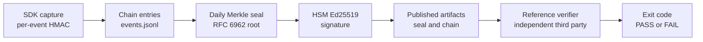

# Chain-of-Custody Specification — Public Review Draft 1 (PRD-1)

> **Status:** Public Review Draft 1 (PRD-1). Document version `0.1.0-draft.1`. **This is a draft for public comment, not a finalized standard.** Comments and review are invited per [GOVERNANCE.md](../GOVERNANCE.md). Material changes between PRD-N and PRD-(N+1) are tracked in [CHANGELOG.md](../CHANGELOG.md) and in §12 of this document.
> **Audience:** implementers of conforming SDKs, ledger servers, and verifiers; auditors and examiners reviewing the proposed standard; regulators evaluating whether to adopt it. Stakeholder navigation is at §13.
> **Conformance keywords.** The keywords MUST, MUST NOT, SHOULD, SHOULD NOT, and MAY are to be interpreted as described in [RFC 2119](https://www.rfc-editor.org/rfc/rfc2119) and [RFC 8174](https://www.rfc-editor.org/rfc/rfc8174). The keywords are normative for any future finalized version of this specification; in this draft they preview the conformance bar a finalized version is expected to carry.

---

## 0. Version policy (informative)

This specification carries **two independent versions** that implementers and reviewers must distinguish:

| Axis | Identifier | Where it appears | What it tracks |
|---|---|---|---|
| **Document version** | `0.1.0-draft.1` (banner: "Public Review Draft 1 / PRD-1") | This banner; [CHANGELOG.md](../CHANGELOG.md); the filename `chain-of-custody-DRAFT-0.1.0.md` | The state of the specification *document* — its text, its conformance requirements, its public-comment cycle. Increments per draft revision (`0.1.0-draft.2`, `0.1.0-draft.3`, …) and finalizes to `1.0.0` when the public-comment process concludes. |
| **Wire-format identifier** | `"v1"` | Every chain entry's `format_version` field; the HKDF salt `b"ffiec.chain-of-custody.v1.salt"`; the HKDF info base `b"ffiec.chain-of-custody.v1.info"`; test-vector inputs and expected outputs | The byte-level construction. A change to the wire-format identifier breaks every test vector and every implementation that parses chain entries. The wire-format identifier is intentionally stable across the draft cycle so implementations can build against PRD-N and have their output remain valid under PRD-(N+1). |

A future incompatible wire-format change ships as a new wire-format identifier (`"v2"`) and a new document version that names the migration. A future additive wire-format change (a new optional field, a new chain-kind value) ships at the same wire-format identifier and a higher document version that names the addition.

The two version axes do not move in lockstep. A document-version revision (e.g., editorial clarification, restructured stakeholder navigation, added informative sections) produces no wire-format change and no test-vector change. A wire-format revision always produces both a document-version revision and a test-vector revision.

## 0.5 How to read this document (informative)

This section is informative. It exists so a first-time reader finds their critical path through PRD-1 in under 30 minutes without reading 2158 lines. Normative content begins at §1.

### 0.5.1 The chain in three paragraphs

**What is captured.** Every AI decision the institution makes — the prompt, the model's response, the tools called, the routing decision, and the operational state at capture. The capture happens at the SDK boundary inside the institution's process. Vendor cooperation is not on the critical path of evidence integrity.

**How it is sealed.** Each captured event is HMAC-chained to the prior event under a tenant-bound session key. At the close of each day, the day's events aggregate into an RFC 6962 Merkle tree, and the root is signed by the institution's HSM. Three independent layers — per-event MAC, daily Merkle root, HSM signature — must be simultaneously compromised to silently tamper a verified chain.

**How it is verified.** An examiner with no access to the vendor or operations team runs the reference verifier (Apache-2.0, §10.26) against the institution's published chain artifacts. The verifier produces an exit code and a structured result that any third party can reproduce against the same bytes. The procedure is at §7. The corpus that defines pass and fail is at `spec/test-vectors/`.

### 0.5.2 The chain at a glance



The four labelled stages map to the four primitives at §4. The verifier procedure that consumes the published artifacts is at §7.

### 0.5.3 Reading paths by role

The §13 stakeholder navigation gives the full per-role reading guide. The table below is a triage view: time budget, the minimum sections to read, and the single supporting document outside the spec that pays back the most.

| Role | Time | Read in this order | Companion document |
|---|---|---|---|
| **Bank executive / Audit Committee chair** | 5 min | §1, §1.2, §13 entry | `docs/audit-committee-summary.md` |
| **Bank Model Risk Management (MRM) committee chair** | 45 min | §1.2, §10.20, §10.33, §10.34, §10.37 | `docs/MRM-COMMITTEE-BRIEF.md` |
| **Internal audit team** | 1 hour | §1, §4, §7, §10 | `docs/internal-audit-evidence-pack.md` |
| **SOC 1 / SOC 2 engagement team** | 1 hour | §1, §4, §7, §10, §10.18 | `docs/soc-pack/section-4-template.md` |
| **Bank Legal / IR team** | 30 min | §1.1, §1.2, §10.11, §10.13 | `docs/litigation-support.md` |
| **Bank privacy / GDPR team** | 45 min | §1.2, §10.20, §10.22, §10.23 | `docs/regulator-pack/gdpr-article-25-demonstrability.md` |
| **FFIEC IT Examiner / Cybersecurity Specialist Examiner / EIC** | 45 min | §1, §1.1, §4, §7, §10.12 | `docs/regulator-pack/fdic-occ-examination-overlay.md` |
| **FFIEC consumer-protection / CFPB examiner** | 45 min | §1.2, §10.11, §10.22, §10.23 | `docs/regulator-pack/cfpb-overlay.md` |
| **State insurance department examiner** | 45 min | §1.2, §10.11, §10.22 | `docs/regulator-pack/handbook-mapping.md` |
| **Acquirer-side IT due-diligence** | 1 hour | §1, §4, §7, §10.24 | `docs/m-and-a-handoff.md` |
| **Cryptographic expert (witness, advisory)** | 45 min | §1.2, §1.3, §1.4, §4, §10.5, §10.8, §10.17 | `docs/design/09-threat-model.md` |
| **Implementer (SDK, ledger, or verifier)** | 2-3 hours | §3, §4, §5, §7, §10 | `docs/cryptographic-agility-roadmap.md` |

For other roles (bank chain-operations team, bank chain adopter, bank vendor-management team), the full reading guide is at §13.

### 0.5.4 If you only have five minutes

Read three things in order:

1. The §1.2 lists ("the chain proves" and "the chain does NOT prove"). They bound expectations.
2. The §4 introduction (the four-primitives table). It names the construction.
3. Your §13 stakeholder entry. It points at the deeper reading you actually need.

If the §1.2 lists answer the question you came here with, you are done.

### 0.5.5 What sits outside the spec

The spec is the normative artifact. Three companion artifacts are designed for reading the spec without reading the spec end-to-end.

- **Auditor stories** — scenario walkthroughs at `docs/auditor-stories/`. Each story takes one realistic situation (an examiner challenge, an M&A handover, an adverse-action dispute, a training-data subpoena) and walks through which spec sections answer which question. Stories cite spec sections inline, so a reader can drop into a story and arrive at the relevant normative text already oriented.
- **Question bank** — the public website hosts the common reviewer questions and the spec-cited answers. Every entry shows the spec citation that grounds it.
- **Reference implementation** — Herald.Py, Apache-2.0, the test-vector corpus at `spec/test-vectors/`, and the regulator overlays at `docs/regulator-pack/`. An implementer who runs the verifier against the corpus has reproduced the spec's pass/fail definition without reading §7.

The spec, the auditor stories, and the question bank are layered: the spec is precise and dense, the stories are scenario-driven, the question bank is reactive. A reader picks the layer that matches their question and follows the citations down to the spec only when they need byte-level precision.

## 0.6 Navigation and contextual-help URL convention (normative)

This specification ships with an external **plain-spoken companion repository** that hosts scenario walkthroughs (the auditor-stories series), per-section one-line summaries, and a scenario-coverage index keyed by §10.x section number. The companion is not part of the standardization submission; it is a community-facing onboarding asset published alongside the spec under the contextual-help URL convention this section normates.

**Convention (normative).** Each §10.x normative subsection in this specification MAY reference — informatively — the plain-spoken companion's matching scenario walkthrough via a *contextual-help URL*. The URL points to the scenario(s) that exercise the section in production, plus the section's plain-spoken summary line. Two requirements bind any implementation that surfaces the URL:

1. **URL stability.** The companion repository commits to a versioned-stable URL schema. PRD-N spec text references PRD-N-matched companion URLs. Older PRD spec releases continue to reference their matched companion URLs. URL drift between PRD revisions is forbidden; deprecated PRD URLs MUST resolve to a redirect-with-current-PRD-pointer, not to 404.
2. **Citation indirection.** Scenario walkthroughs in the companion repository MAY contain narrative-driven detail (specific institution names, observer-stakeholder framings, personal arcs, recusal-protocol references). Such narrative content MUST NOT appear in this specification's normative text. The companion repository is the authoritative location for narrative-bearing operational grounding; this specification text remains conventional in form.

**Coverage-gap detector (normative for the companion repository's CI).** The companion repository's continuous-integration pipeline runs a coverage-gap detector against this specification's §10.x section enumeration. The detector emits:

- A WARNING when a §10.x normative subsection is not cited in any companion scenario.
- An ERROR when a companion scenario cites a §10.x section that does not exist in the current PRD.
- A RELEASE-BLOCKING ERROR when a §10.x section's plain-spoken summary line is absent or stale.

PRD-N → PRD-(N+1) evolution is gated on full coverage. The detector's output is published as part of the companion repository's release notes; institutions and reviewers reading either artifact can confirm coverage symmetry without manual cross-walk.

**§13 Stakeholder navigation (informative, downstream of §0.6).** §13 of this specification provides stakeholder-keyed entry points by role (bank executive, audit committee chair, MRM committee chair, FFIEC examiner, cryptographic expert, implementer, etc.). Readers entering through §13 are routed to their role's reading order and to the relevant §10.x sections; those readers MAY then follow the contextual-help URL into the companion's matching scenario for operational walkthrough. The two surfaces compose: §13 routes by role; the companion routes by scenario; §10.x is the normative anchor both surfaces cite.

**What the convention does not require.** Implementations of the §7 verifier procedure are unaffected by the companion repository's existence; §7 is verifier-conformant against the spec's normative text and test-vector corpus alone. Working-group reviewers MAY read the spec without ever consulting the companion. The contextual-help URL is an onboarding affordance, not a normative dependency.

---

## 1. Scope

This specification defines a chain-of-custody primitive set for capturing AI-driven decisions in regulated systems. The primitives are designed to satisfy the integrity-of-logging requirements in the FFIEC IT Examination Handbook (Information Security and AIO booklets) and related model-risk-management guidance (SR 11-7, OCC Bulletin 2011-12, and the 2026 consolidated update from OCC, Federal Reserve, and FDIC — OCC Bulletin 2026-13 plus counterpart Federal Reserve and FDIC issuances tracked alongside as those agencies publish; see §1.1's regulator-facing alignment note).

The primitives are language-neutral, transport-agnostic in their core construction (though a wire-format binding to OTLP is normative), and produce output that can be independently verified by an examiner with no access to the institution's vendor or operations team.

**Scope — decision-time integrity AND training-phase integrity.** This spec covers the integrity of AI agent decisions at inference time: what the model was asked, what it produced, what tools it called, what routing decision led to which provider, what the institution's operational state was at the moment of decision. The spec ALSO covers training-phase integrity for institutions operating training-phase-bearing AI (federated learning, in-house retraining, model-development pipelines): training-data hash binding, gradient compute attestation, aggregation evidence, validation against held-out test sets, and model-artifact production. The training-phase coverage is normative in §10.34 (`audit.training.*` attribute family) and composes alongside the inference-phase chain via cross-anchor patterns. Institutions operating inference-only on third-party-trained models do not emit training-phase events; institutions operating both phases emit both. The chain provides the integrity binding for training-phase events; the substantive correctness of training data, the methodology for validation, and the policy compliance of training decisions are answered by the institution's separate audit programs (training-data labeling, fair-lending review, ECOA / GDPR Article 22 / EU AI Act Article 10 / Treasury FS AI RMF data-integrity coverage) — the chain is the integrity foundation, not the truth foundation, for training as it is for inference.

### 1.1 Daubert four-factor grounding (informative)

The chain's evidentiary posture is structured so the four factors named in *Daubert v. Merrell Dow Pharmaceuticals* (and the *Frye* general-acceptance test in jurisdictions that retain it) each have a concrete answer an institution's expert witness can point at without re-engineering the system. The four factors and the spec's response:

- **Testability.** §7 defines an ordered, byte-exact verification procedure. The reference test-vector corpus (`spec/test-vectors/`) ships positive vectors 001, 002, 003, 008, 010, 015, 016, 017, 018, 019, 020, 021, 022, 023, 024, 025, and 026 alongside negative vectors N001 through N023. Each negative vector exercises an independent threat scenario — cross-chain lift, MAC tamper, fingerprint mismatch, seal forgery, JCS edge-case divergence, and the rest. The procedure and the corpus together let any third party reproduce a verifier's pass/fail result against the same bytes. The chain's integrity claim is falsifiable in the Popperian sense: produce a tampered chain that the §7 procedure does not reject, and the claim is broken.
- **Peer review.** The spec is developed under an FFIEC working-group process with periodic outside-reviewer drops captured in `docs/feedback/`. The reference implementation is published under Apache-2.0 and the test-vector corpus is public. Independent experts review both the specification text and the reference code; their comments and the working group's responses are preserved in the feedback record.
- **Known error rate.** No practical attack is known against HMAC-SHA-256 (FIPS 198-1), the RFC 6962 Merkle construction over SHA-256 (FIPS 180-4), or Ed25519 (FIPS 186-5) under the §10 threat model. A successful false-negative — a tampered chain that verifies as PASS — requires the simultaneous compromise of three independent custody layers: the tenant's IKM (held in HSM/KMS), the institution's ledger storage (append-only with operator-side controls), and the HSM signing key (FIPS 140-2 Level 3 or higher). The three layers are operated by different roles under separation-of-duties controls; the compromise of any one alone does not produce a verifying tamper.
- **General acceptance.** The cryptographic primitives are NIST-standardized (FIPS 180-4 for SHA-256, FIPS 186-5 for Ed25519, FIPS 198-1 for HMAC, RFC 5869 for HKDF, RFC 8785 for canonical JSON, RFC 6962 for Merkle aggregation). The combination of HMAC-chained event records under a tenant-bound key and a daily Merkle root signed by an HSM is standard in audit-chain literature and in deployed audit-log systems (Certificate Transparency, Trillian, append-only ledgers in regulated finance and healthcare).

The four-factor grounding is informative — it does not add normative requirements. It exists so an expert witness laying foundation under FRE 702 / *Daubert* can answer the four questions from the shipped artifacts (spec text, test-vector corpus, reference implementation, FIPS standards) rather than from internal documents the institution might not have.

**Regulator-facing alignment (informative).** The same shipped artifacts the four-factor grounding rests on — the spec text, the test-vector corpus, the reference implementation, and the §7 verification procedure — also answer regulator-facing examination questions framed by the U.S. banking-supervision model-risk-management (MRM) regime: the FFIEC IT Examination Handbook (Information Security and AIO booklets), SR 11-7 / OCC Bulletin 2011-12 (the 2011 MRM guidance), and the consolidated 2026 update from OCC, Federal Reserve, and FDIC (OCC Bulletin 2026-13 and counterpart Federal Reserve / FDIC issuances).

The 2026 guidance emphasizes risk-based proportionality, third-party vendor accountability, lineage tracking, "effective challenge," and governance posture over mathematical-purity. The spec's `(normative when applicable)` adoption pattern across §10.x, the §10.21 cross-vendor model-handover schema (including the Round-17 M&A-G2 contract-binding attributes), the §10.34 and §10.66 training and weight-lineage primitives, the §10.21.2 parallel-evaluator composition primitive, and the §10.18 CC8.1 cross-referencing discipline supply the chain-bound substrate the institution's MRM committee, the SOC engagement team, and the examiner each verify against the same shipped artifacts. The `(normative when applicable)` pattern offers institution-side proportionality on the §10.x extension surface — a community institution adopts §4 + §7 + §10.1-§10.10 and is conformant; a Tier-1 institution operating frontier-AI training adds §10.34, §10.63-§10.67, and the hardware-supply-chain family. The §4 cryptographic floor (HMAC-chained event records, daily Merkle seal, HSM-rooted root signature) is uniform across institutions and is the proportionality boundary the spec does not relax; institutions evaluating chain-of-custody adoption assess whether the §4 floor matches their risk profile before electing the spec.

The 2026 guidance explicitly notes that generative AI is "novel and rapidly evolving" and is not yet covered. Institutions adopting §4.4's OpenTelemetry GenAI namespace, §10.47-§10.50's GenAI-specific operational events, and §10.63-§10.67's training-provenance family operate under a posture the institution can defend in examiner review until prescriptive guidance issues — a posture the 2026 guidance's directional, non-prescriptive framing ("this guidance does not set forth enforceable standards or prescriptive requirements") does not foreclose.

### 1.2 Epistemic scope (informative)

The chain proves two things and does not prove three others. Implementers, examiners, and the institution's litigation-support team rely on this distinction.

The chain proves:

- **(a) What the AI said at a specific time.** The captured event records the model's response, the prompt that elicited it, the tools called, the routing decision, and the operational state at the moment of capture. The per-event MAC and the daily Merkle seal bind these to the institution's HSM-signed root.
- **(b) That the record was not tampered with after capture.** The §7 verification procedure rejects any modification to the captured bytes after the chain entry was written.

The chain does NOT prove:

- **(c) That the AI's statement is factually accurate.** The chain captures what the model said; it makes no claim about whether what the model said is true.
- **(d) That the AI's statement complied with policy.** The chain does not evaluate the captured response against the institution's policy library, fair-lending rules, ECOA / CFPB obligations, or any other compliance regime. Policy-compliance proof requires a separate audit trail — the institution's policy-as-code system, human review records, or a downstream compliance evaluator.
- **(e) That the AI's statement is free of bias.** The chain captures decisions but does not measure their statistical properties. Bias proof requires statistical testing across a population of decisions, training-data audits, and the institution's fair-lending review program.
- **(f) That a customer-disclosure subset is complete with respect to the institution's full chain.** Under §10.69 customer-disclosure mode, a customer holding a derived disclosure key verifies the integrity of the entries the institution disclosed to them — but the chain does NOT prove the institution disclosed every entry the customer was entitled to receive. An institution that mis-categorizes a withheld entry as an excluded class (`sar`, `litigation_hold`, `privileged_investigation`, or any institution-named exclusion) produces a customer-disclosure packet that PASSes the customer's verifier without the customer being able to detect the mis-categorization from the chain alone. The chain proves what was disclosed; it does not prove what was withheld. The §10.70 access-trail discipline backs disclosure completeness post-hoc when a regulator (typically FinCEN) reviews the institution's privileged-investigation access records — but the customer-side chain alone is silent on the omission. Institutions composing customer-disclosure evidence with their other regulatory regimes (BSA SAR record-retention, litigation-hold custodian discipline, court-ordered disclosure) name the composition in CC8.1.

For litigation posture, the institution's IT witness and counsel distinguish clearly between "the chain proves our system said X at time T" — which is what the chain delivers — and "X is true / X complied with policy / X is unbiased" — which are separate questions answered with evidence outside the chain. The chain composes alongside the institution's other evidence regimes without subsuming them; it is the integrity foundation, not the truth foundation.

**Stochastic-output epistemic claim (informative; complements (a)).** Generative AI systems (large language models, diffusion models, GenAI medical-literature synthesizers) produce *stochastic* outputs — running the same prompt against the same model twice can produce different output text. Claim (a) above continues to apply to stochastic outputs but its precise form is qualified: the chain proves "the AI said X at time T given the bound seed, temperature, top-p, top-k, model version, model weight hash, and retrieval-set Merkle root" — NOT "the AI necessarily would say X every time." Reproducibility tests run *out-of-band* against the bound parameters: an examiner who can re-run the model with the same seed, parameters, and retrieval set gets a reproducibility check; the chain alone does not prove reproducibility, only that the parameters governing the output were bound at capture. Same shape as (e)'s statistical-bias non-claim — the chain is the integrity foundation, not the truth foundation, and stochastic outputs slot under the same epistemic discipline as deterministic ones. §10.47 (prompt/output four-tuple binding) and §10.48 (stochasticity attestation) normate the parameter-binding for institutions operating GenAI under chain-of-custody.

**Public-transparency epistemic claim (informative; complements (a)).** Public-facing transparency layers — aggregate counts published on a regulator's transparency portal, FOIA-equivalent disclosures, civic-AI auditability under parliamentary inquiry — operate under *differential-privacy* (DP) bounds: the published aggregate is *noised* before release (Laplace, Gaussian, or institution-named DP mechanism), and the un-noised raw aggregate is too sensitive to publish. The chain integrity-binds the *noised* aggregate (the public-facing form), NOT the raw aggregate; the noise application itself is a separate attestable step that the institution names in CC8.1 (DP mechanism, ε budget, RNG seed, mechanism-version hash). The integrity claim is "we published THIS noised value, derived under THIS DP mechanism with THIS ε budget" — NOT "the raw aggregate underlying this is X." A regulator with separate (non-public) access to the raw substrate verifies noise correctness by re-deriving the noisy aggregate from the bound parameters; the chain alone proves what was published. The distinction matters under FOIA-equivalent regimes (US FOIA, EU Public Sector Information Directive, Swiss Öffentlichkeitsgesetz, parliamentary-inquiry public-records release) where the chain serves both *public* readers (who see only the noised aggregate and the chain proof of its DP-bound publication) and *regulator-side* readers (who run the noise-correctness audit out-of-band). §10.51 (public-transparency overlay) normates the DP-bound publication; §10.52 (public model-card binding) normates the model-card publication trail. The chain is the integrity foundation; DP correctness is the regulator's audit.

**Forward-secrecy non-claim (informative).** The chain does not provide forward secrecy for session keys. HKDF derivation is deterministic from the IKM; if the IKM is compromised, an attacker can recompute any past session key for that tenant and forge past events that would verify under MAC verification alone. The chain's defense against this scenario is layered: a compromised IKM is typically detected (fingerprint mismatches at reconciliation per §10.1, operational anomalies, incident response), and the daily Merkle seal plus HSM signature cover the events as they were captured and sealed; retroactive forgery requires altering the seal record, which is bound under the HSM signature whose private key is held under FIPS 140-2 Level 3 custody. The absence of forward secrecy at the session-key layer is a known property documented as a non-claim, not a vulnerability. Institutions requiring session-key forward secrecy operate compensating controls outside the chain; a v1.x extension introducing per-process ephemeral key material or HKDF-based key ratcheting is a candidate scope addition.

**Application-process compromise as a fourth class (informative; complements §1.1 "Known error rate").** The §1.1 three-layer compromise model — the tenant's IKM, the ledger storage, and the HSM signing key — names the layers an attacker must simultaneously breach to produce a verifying false-negative on a tampered chain. A fourth scenario, compromise of the SDK process holding the live session key (Adversary F per `docs/design/09-threat-model.md` §2.6), produces chain entries that verify as PASS for as long as the compromise persists. The compromised process holds the legitimate session key derived from the legitimate IKM, can compute valid `payload_hash` values, and emits chain entries that pass §7 step 8 (fingerprint match — same IKM) and step 9 (MAC match — same session key); the daily Merkle seal then signs those entries as a normal seal-day. The institution's IKM is NOT compromised, the ledger storage is NOT compromised, and the HSM is NOT compromised — yet the chain produces a verifying record of events the legitimate AI agent did not generate. This is a forward-only attack window: past chain entries are unaffected and cannot be retroactively altered by a process compromise. The window is bounded by the institution's host-hardening, intrusion-detection, and master-key-rotation controls. The chain composes alongside these controls; the chain alone does not defend against an attacker who has root on the SDK's host. A complete `Daubert` "Known error rate" answer names all four scenarios — three layers of custody compromise plus the SDK-process compromise — so an expert witness laying foundation under FRE 702 has the full residual-risk picture under cross-examination. See `docs/design/09-threat-model.md` §2.6 (Adversary F) for the residual-risk posture and the compensating controls (anomaly detection on the captured stream, out-of-band agent-behavior monitoring, third-party intrusion detection).

### 1.3 Security definitions (informative)

The chain's primitives provide standard cryptographic security properties under widely accepted assumptions. The properties are stated explicitly here so an expert witness, a CFRG-style reviewer, or an academic citation can read the spec's formal claims without inferring them from the construction.

- **Per-event MAC — existential unforgeability under chosen-message attack (EUF-CMA).** HMAC-SHA-256 (FIPS 198-1) provides EUF-CMA security: an attacker with oracle access to MAC computations cannot produce a valid `(message, MAC)` pair for a message they have not queried. The per-event chain entry's `payload_hash` carries this property — an attacker cannot forge a chain entry that verifies under the tenant's session key without holding the session key.
- **Daily Merkle seal — second-preimage resistance.** The RFC 6962 Merkle construction over SHA-256 (FIPS 180-4) provides second-preimage resistance: given a published Merkle root, an attacker cannot find a different set of leaves that produces the same root. The leaf-prefix (`0x00`) and node-prefix (`0x01`) per RFC 6962 §2.1 prevent confusing internal nodes with leaves. The Merkle seal does NOT depend on collision resistance — even if a pair of colliding SHA-256 inputs were demonstrated, the second-preimage property suffices to prevent retroactive event substitution against a fixed sealed root.
- **HSM signature — EUF-CMA (Ed25519).** Ed25519 (FIPS 186-5, RFC 8032) provides EUF-CMA security: an attacker without the private key cannot produce a signature that verifies under the corresponding public key. The HSM custody (FIPS 140-2 Level 3 or higher, §10.5) closes the obvious online attack surface — the private key is non-extractable.

**Explicit non-claims.** The spec is also explicit about what the primitives do NOT provide:

- **No confidentiality (no IND-CPA).** The chain is not an encryption scheme. The captured events are recorded in cleartext at the ledger; an attacker reading the ledger storage learns the events' contents. Confidentiality at the ledger is the institution's storage-controls responsibility, not the chain's.
- **No collision resistance load-bearing on the Merkle root.** Per the RFC 6962 second-preimage construction, the chain's integrity guarantee depends on second-preimage resistance, not collision resistance. This matters because second-preimage attacks on SHA-256 are believed strictly harder than collision attacks, and a future weakening of SHA-256 collision resistance does not by itself break the chain.
- **No forward secrecy at the session-key layer.** Per the §1.2 forward-secrecy non-claim above, IKM compromise is not bounded by past-key erasure.

**Effective security level.** The chain's effective security level is 128 bits, determined by the weakest layer: Ed25519 provides ~128-bit security, HMAC-SHA-256 provides 128-bit security against birthday-bound forgery (the output is 256 bits but the attack bound is 2^128 queries), and SHA-256 provides 128-bit second-preimage resistance. This is consistent with NIST SP 800-175B's 128-bit security baseline for cryptographic systems processing non-classified government information. Institutions requiring 256-bit security (post-quantum migration, multi-decade retention horizons exceeding NIST's 128-bit minimum-security horizon) operate under v1.x extensions introducing post-quantum signature algorithms (Dilithium per FIPS 204 provides 256-bit security at NIST level 5) and SHA-3 (256-bit second-preimage resistance). For v1.0, the 128-bit security level is appropriate for FFIEC banking-regulation horizons (typically 7-year retention) under adversaries constrained by practical computation limits.

### 1.4 Compositional security (informative)

The chain composes three independent authentication layers. The compositional argument is informal here; a future formal protocol model (TLA+, Tamarin, ProVerif) is a candidate work item but is not load-bearing for v1.0.

- **Layer 1 — per-event HMAC (Primitive 1, §4.1).** Proves no wire-level tampering after the SDK emitted the event. A tamper requires forging an HMAC under the tenant's session key.
- **Layer 2 — daily Merkle seal (Primitive 2, §4.2).** Proves no retroactive entry insertion, deletion, or reordering after the seal was published. A tamper requires producing a different Merkle leaf set that yields the same sealed root, which the second-preimage property of SHA-256 forbids.
- **Layer 3 — HSM signature on the daily root (Primitive 3, §4.3).** Proves the Merkle root was sealed by the institution's holder of the HSM private key, not by the ledger server itself or any other party with ledger-write access. A tamper requires forging an Ed25519 signature under a key the HSM does not release.

The three layers are independent in the sense that breaking any single layer is insufficient to silently tamper with a verified chain. An attacker who breaks the HMAC of one event must still produce a Merkle root that includes the forged event AND obtain the HSM's signature on that root — and the HSM does not sign roots produced by anyone other than the institution's seal job under separation-of-duties controls (§10.5). An attacker who can rewrite ledger storage but cannot produce HMACs leaves the per-event MAC verification intact (rewrites surface as MAC mismatches at §7 step 9). An attacker who can forge HSM signatures still cannot produce per-event MACs without the IKM. The composition provides defense-in-depth — a single-layer compromise is insufficient to silently tamper. The §1.1 "Known error rate" framing names these three layers as the simultaneous-compromise requirement; the §1.2 fourth-class (SDK-process compromise) names the residual scenario in which the legitimate session key is exposed and forward-only forgery is possible until detection.

### 1.5 Decision-event vs state-machine modeling (informative)

The spec body up through v1.0 treats captured events as *discrete decisions*: an AI inference, an adverse-action notice, a model handover. Each event is a self-contained record of one moment. The integrity claim is "this decision was made under the named inputs at the named moment by the named authority."

A second class of records — *long-running cases* — appears across multiple regulatory regimes and does not fit cleanly into the discrete-decision shape. The exemplars: insurance claims (FNOL → reserve → adjudication → payment → recovery → close), regulatory disputes (filed → discovery → ruling → appeal → close), customer complaints (received → triaged → investigated → resolved), audit examinations (pending → in-progress → findings → response → closed), litigation holds (issued → preserved → released). Each is a *state machine*: the entity moves through ordered states under named transitions; each transition carries an actor, a rationale, and (often) an authorizing-policy reference; the lifecycle has integrity properties (no transition out of a terminal state; certain transitions require a prerequisite state) that are weaker than chain integrity but stronger than nothing.

§10.43 (claim-state-machine), §10.46 (bordereau lifecycle), and §10.55 (audit-target challenge-response, forthcoming) operate on this state-machine shape. They share a thin common substrate — a transition validator + a chain-entry attribute schema for state transitions — that lives at the *primitive* level (`_state_machine.py` / `StateMachine.cs`) and is *not* a re-architecture of the chain itself. The chain remains the integrity substrate; the state machine is a *consumer* of the chain that uses its append-only property to record an immutable lifecycle history.

**Where the seam lives.** The shared primitive validates: (a) a transition from state X to state Y is in the institution's CC8.1-named transitions table for this state-machine kind; (b) the chain entries naming the transitions form a coherent history with no gaps and no out-of-order arrivals (per §4.4 monotonic seq + §10.36 late-arrival discipline). The shared primitive does NOT validate domain semantics — claim adjudication rules, dispute disposition logic, complaint-resolution policies are institution-side. CUPID-Domain-based: the seam is the chain-entry attribute schema and the transition-table walk; everything else is per-section.

**Composition with §10.38 consent.** Consent capture (§10.38) is itself a state-machine pattern (given → referenced → withdrawn → expired) that pre-dates §1.5. The §1.5 framing names what §10.38 was already doing implicitly; future amendments may align §10.38's text with the §1.5 vocabulary without a wire-form change.

## 2. Out of scope

This specification does not define:

- The runtime environment in which AI agents execute
- The semantic meaning of captured events (those follow the OpenTelemetry GenAI semantic conventions, referenced normatively below)
- The retention duration of ledger artifacts (regulatory frameworks set this; implementations support configurable retention)
- The specific HSM model or vendor used for root signing (any FIPS 140-2 Level 3 or higher device is conformant)

## 3. Definitions

| Term | Definition |
|---|---|
| **Event** | A discrete record of one observable AI activity (a model call, a tool call, a decision, a retry). |
| **Run** | A bounded sequence of events sharing one `run_id`, representing one logical agent invocation. |
| **Tenant** | A regulated institution subscribed to a chain-of-custody implementation. Each tenant has independent keys and a separate ledger. The tenant identifier (`tenant_id`) MUST match the regular expression `^[A-Za-z0-9_.\-]{1,255}$` — alphanumerics, underscore, hyphen, and dot only, with a maximum length of 255 bytes. The character set is constrained so that the HKDF `info` parameter `info = HKDF_INFO_BASE \|\| "\|" \|\| utf8(tenant_id)` is unambiguously parseable: the `\|` byte (0x7C) cannot appear inside `tenant_id`, eliminating boundary-confusion attacks where two distinct tenant identifiers could produce the same `info` byte sequence. `utf8(tenant_id)` is the raw UTF-8 byte encoding of the tenant identifier string; no percent-encoding, escape-sequencing, or other re-encoding is applied. The §3 character class constrains v1.0 tenant identifiers to ASCII codepoints, and ASCII is a strict subset of UTF-8 (each ASCII character encodes as a single byte with the high bit clear), so for v1.0 chains `utf8(tenant_id)` and the ASCII byte sequence are byte-identical. Stating the encoding as UTF-8 anchors the HKDF input for any future v2 spec that relaxes the character class to admit non-ASCII codepoints — implementations that produce v1.0 chains today and v2.x chains later use the same `utf8(...)` encoding rule throughout. **Enforcement is named at both ends:** SDKs MUST reject a `tenant_id` that does not match the class at construct time (refuse to instantiate a chain writer / pipeline decorator / sink with a non-conforming tenant_id); verifiers MUST reject a chain whose `header.tenant_id` does not match the class at file-header pre-flight (§7) with the named failure mode `tenant_id violates §3 character class`. Institutions whose existing tenant identifiers do not conform follow the legacy-migration guidance in §3.1. |
| **Tenant-day** | The set of events for one tenant within one UTC calendar day, used as the Merkle-seal aggregation unit. |
| **IKM (Input Key Material)** | The long-lived secret bound to one tenant from which session keys are derived via HKDF. Held in tenant-controlled custody (HSM/KMS), never on application hosts. Per §10.6, IKM length MUST be at least 32 bytes. (Synonym in operations contexts: "master key.") |
| **Session key** | A 32-byte HMAC key derived from the IKM via HKDF-SHA-256 with `info = HKDF_INFO_BASE \|\| "\|" \|\| utf8(tenant_id)`. Bound to one tenant. Held in process memory only; never written to disk. |
| **`key_version`** | A non-negative integer (≥ 1) identifying which IKM generation produced a given session key. Recorded on every chain entry so a future verifier knows which IKM generation to look up. |
| **`key_fingerprint`** | A 16-byte public identity binding: the first 16 bytes (the leading half) of `SHA-256(utf8(tenant_id) \|\| ikm)`. The full 32-byte SHA-256 output is computed over the concatenation of `utf8(tenant_id)` and the IKM bytes; the fingerprint is the first 16 of those 32 bytes. Pseudocode in §4.1 expresses this as the slice `SHA-256(...)[:16]`. Stamped on every chain entry. The verifier asserts the looked-up IKM produces this fingerprint BEFORE computing any MAC. |
| **`format_version`** | A short string identifying the chain format (`"v1"` for this spec). Stamped on every chain entry and on every audit-file header so a verifier reading an unrecognised version refuses with the right error. |
| **`chain_kind`** | A short string classifying the chain entry's event class. Required on every chain entry; covered by the per-event MAC via the §5 inclusion list. The v1 enumeration is closed: `"audit"` (the default — application audit event), `"model_call"` (chain entry representing an LLM invocation), `"tool_call"` (chain entry representing a tool invocation), `"routing"` (chain entry from §4.4.1), `"translation"` (chain entry from §10.11), `"operational"` (chain entry for control-evidence operational events). The verifier MUST reject any value not in the enumerated set with `chain_kind out of v1 enumeration at seq N`. The discriminator is distinct from the OTel `kind` field (which carries the OpenTelemetry `SpanKind` — `server`, `client`, `internal`, `producer`, `consumer`); both fields are integrity-bound under the per-event MAC and both appear on every entry. The closed enumeration is what lets two SDKs producing the same logical event under the same canonicalization rules emit byte-identical canonical bytes; an open or implicit `chain_kind` would let one SDK emit `"audit"` and another `"audit.event"` for the same logical event and break the cross-vendor byte-identity claim. |
| **`hkdf_inputs_digest`** | `SHA-256(salt \|\| info_for_tenant \|\| length_LE32)`. Recorded in the audit-file header (and in the daily seal record). Lets a future-version verifier detect "this file claims v1 but its HKDF inputs do not match v1." |
| **`mac_computed_at_utc`** | ISO 8601 UTC timestamp recorded on every chain entry at the moment the MAC was computed. Forensic field; the verifier does NOT trust this for security decisions. |
| **`kms_handle_uri`** | A provenance pointer to the IKM's KMS/HSM custody location (e.g. `"aws-kms:arn:aws:kms:..."` or `"plaintext-dev"` for development-only adapters). Recorded on every chain entry. |
| **HSM** | A Hardware Security Module conforming to FIPS 140-2 Level 3 or higher (or Common Criteria EAL4+). Used for daily root signing. |
| **Region** | An institution-defined unit of operational and cryptographic locality for multi-region deployments per §10.15. The institution's CC8.1 (or equivalent) control description names what each region encompasses — a cloud-provider region (AWS `us-east-1` vs `eu-west-1`), an availability zone or sub-region datacenter, an on-prem datacenter facility, or an institution-defined logical grouping that crosses cloud boundaries (cross-cloud, on-prem-plus-cloud, regulator-jurisdiction-bound). The institution's risk-tolerance statement governs the granularity choice. The region definition determines the per-region operational identity (regional ledger endpoint, regional HSM cluster membership, regional public-key registry entry) and the §10.15 Pattern A invariant 5 reconciliation population (the per-region event-count partition the seal region reconciles against). The spec normates the integrity invariants under §10.15; the region's concrete definition is institution-side. |
| **CC8.1 (or equivalent)** | The institution's SOC 2 Trust Services Criteria CC8.1 control description, or the equivalent document under the institution's chosen audit framework (SOC 1 §8, ISAE 3402, COSO-equivalent attestation, or institution-named substitute). The spec uses CC8.1 as the canonical institution-side authoritative document where the institution names *which §10.x sections it adopts*, *which postures it operates*, *which canonicalization choices it makes within institution-determined latitude*, and *which RNG / KMS / HSM products it deploys*. The cross-referencing discipline (every operational runbook supporting a normative spec requirement names the spec section number; every spec adoption is named in CC8.1) is normated in §10.18. The phrase "the institution's CC8.1 (or equivalent)" throughout the spec means the document the institution's SOC engagement points the auditor to for the operational evidence corresponding to each chain feature. |
| **Posture** | The institution's declared operational mode for a chain feature dimension. Postures are named in the institution's CC8.1 and dispatched on at chain-write time and at chain-walk time. Conformant postures are normated in specific spec sections — §4.1.2 (vendor-flag vs FFIEC-conformance posture), §4.3.2 (single-algorithm vs dual-algorithm posture), §10.15 (multi-region Pattern A vs Pattern B), §10.27 (seal-cadence posture), §10.53 (post-quantum mandate posture). Each dimension has a closed set of conformant postures; the institution selects one per dimension and records the selection in CC8.1; the verifier dispatches per the declared selection. A chain entry's posture appears in the canonical bytes via integrity-bound attributes (e.g., `ffiec.chain.posture`) so the verifier can confirm the chain operated under the declared posture without consulting institution-side state. |

### 3.1 Legacy tenant identifier handling (normative)

The §3 character class `^[A-Za-z0-9_.\-]{1,255}$` is mandatory for v1.0 — the constraint exists so the HKDF `info` parameter is unambiguously parseable, and relaxing it reopens the boundary-confusion attack class the constraint closes. Many institutions, however, have legacy tenant identifiers from upstream IAM systems, CRM records, or product registries that do not conform: identifiers using slashes (`acme/prod`), colons (`tenant:acme:prod`), Unicode characters (CJK names in Asia-Pacific deployments, accented Latin in European deployments), or lengths exceeding 255 bytes (composite identifiers from federated identity providers). Three migration patterns are conformant; institutions choose the one that best fits their deployment posture and document the choice in their CC8.1 control description.

**Pattern 1 — Opaque hash-of-legacy.** The institution maps each legacy identifier to a conforming opaque identifier via a deterministic hash: `tenant_id = "tnt_" || hex(SHA-256(legacy_identifier_bytes))[:24]`. The 24-hex-character result fits inside the 255-byte limit and uses only conforming characters. The institution maintains a separate registry mapping legacy identifier → conforming `tenant_id`; the registry is institution-internal and is consulted by humans for forensic purposes (e.g., when a customer dispute references the legacy name). The chain captures only the conforming `tenant_id`. Pattern 1 is the cleanest migration: cryptographically deterministic, no character-class compromises, no length issues. It is RECOMMENDED for institutions whose legacy identifiers are infrequently surfaced to humans.

**Pattern 2 — Controlled aliasing.** The institution registers a curated conforming canonical name for each legacy identifier (e.g., legacy `acme/prod` → conforming `acme_prod`). The institution maintains the legacy → canonical mapping in its tenant registry. The chain captures only the canonical name. Pattern 2 is more human-readable than Pattern 1 but requires institution-side governance to ensure the canonical names remain unique and stable across the institution's deployment lifecycle. It is RECOMMENDED for institutions whose legacy identifiers are surfaced to humans frequently (e.g., examiner reports, customer-facing materials).

**Pattern 3 — Reject non-conforming new tenants; legacy tenants remain on legacy systems.** The institution accepts that the chain-of-custody system covers only tenants whose identifiers conform to the §3 class natively. Existing non-conforming tenants are NOT migrated to the chain; they continue under whatever audit-evidence regime the institution operated before adopting v1.0. New tenants must conform at provisioning time (the institution's IAM provisioning enforces the class at registration). Pattern 3 is the conservative migration: it sacrifices coverage for simplicity. It is RECOMMENDED for institutions with a small set of legacy non-conforming tenants and a clear posture-end-date for them.

**Operational requirements (normative).** Whichever pattern an institution chooses:

- The institution's CC8.1 (or equivalent) control description names the chosen pattern, the legacy → conforming mapping mechanism (registry, deterministic hash, etc.), and the tenant-onboarding procedure that enforces the §3 class for new tenants.
- The mapping registry (Patterns 1 and 2) is institution-internal and is itself a control-evidence artifact — the institution's SOC team confirms registry integrity (e.g., via append-only enforcement, version control, or HSM-attested registry signatures).
- A change to a legacy → conforming mapping after the chain has been started under the existing mapping is a chain-discontinuity event analogous to a posture change per §4.1.2. The institution does not silently re-map; the change-management procedure governs.
- Cross-institutional reporting (regulator submissions, customer disclosures) names the conforming `tenant_id` as the primary identifier; the legacy identifier may appear as a secondary reference for human disambiguation but is not the load-bearing identifier in any audit-evidence context.

**Verifier behavior.** The verifier enforces the §3 class against the chain's recorded `tenant_id` (per §7 step 3a). It does NOT consult the institution's legacy registry — the verifier sees only the conforming chain identifier. An institution providing examiner evidence references the conforming `tenant_id` and provides the legacy mapping as ancillary forensic material if needed.

## 4. The four primitives

**Implementation topology (informative).** The four primitives below are decomposable. An implementation MAY co-locate them in a single process — a **monolithic** topology where the SDK, ledger ingest, seal job, and HSM dispatch share a deployable unit and chain entries flow between components by direct in-process call. An implementation MAY also distribute them across separate services connected by network hops — a **distributed** topology where the SDK exports over OTLP to a separate ledger service, the ledger dispatches to a separate signing service, and components communicate over the wire. The Herald reference implements the distributed topology with the SDK in the application process and the ledger / signing components in a Herald.Compliance service; other implementations MAY co-locate everything in one process. Both topologies are conformant provided the integrity invariants — per-event MAC at the moment of capture (§4.1), daily Merkle seal over all events for the tenant-day (§4.2), HSM-rooted signature on the daily root (§4.3), and integrity-verifiable wire-or-on-disk form (§4.4, §6) — are preserved. The spec normates byte-level construction and the verifier procedure, not topology.

**Observation is wire-bound (normative).** Regardless of topology, the spec normates observation and verification ONLY on the wire form (or its byte-equivalent on-disk persisted artifact per §6). Implementations MAY compute, buffer, transform, or otherwise hold chain entries in-process. **In-process observation of partially-formed entries is NOT a spec-conformant view.** This includes: debugger snapshots of an entry before MAC compute, in-memory inspection across an in-process function-call boundary, vendor-internal admin views of intermediate stages (e.g., a live-feed showing canonical bytes before the wrapped form), and any other inspection that does not read from a persisted-or-wire artifact. An observer — verifier, examiner, SOC team, vendor support — MUST establish integrity claims from wire-or-on-disk artifacts only. This rule has two practical consequences:

1. A monolithic implementation that never exports over a network wire still produces persisted on-disk chain entries (per §4.1 "persisted byte-for-byte") and persisted seal records (per §4.2). The verifier walks those on-disk artifacts. The on-disk form is the wire-equivalent observation point; "wire" and "on-disk" are interchangeable from the verifier's perspective.

2. Implementations MAY surface in-process state for operator visibility (live-feed dashboards, debug consoles, admin SPAs that show intermediate stages). Such surfaces are operational tools, NOT integrity-bound observation points. An integrity claim MUST NOT cite an in-process observation as evidence; the same record's wire-or-on-disk form is the citable evidence.

The spec's wire-or-on-disk observation rule is what permits implementation-specific discovery and policy endpoints (e.g., a distributed implementation's per-tenant receiver-policy query) to exist outside spec scope. Such endpoints are observed on the wire when an SDK queries them, and the wire response is the citable form; whether the implementation is monolithic or distributed is invisible to the verifier.

### 4.1 Primitive 1 — HMAC chain at capture (normative)

**Where this primitive lives.** Inside the application process running the SDK, on the bank's host. The MAC is computed at the moment of event capture, before the event leaves the host. The MAC IS the chain entry; it is persisted byte-for-byte. (See §2.1 of `docs/design/00-overview.md` for the attack this primitive defends against.)

**Per-event construction (normative).**

```
ikm                  = the tenant's IKM (raw bytes; minimum 32 per §10.6)
tenant_id            = the event's ffiec.chain.tenant_id (UTF-8 string)
HKDF_SALT            = b"ffiec.chain-of-custody.v1.salt"             // FFIEC-conformance constant; vendor-flag mode permitted per §4.1.2
HKDF_INFO_BASE       = b"ffiec.chain-of-custody.v1.info"             // FFIEC-conformance constant; vendor-flag mode permitted per §4.1.2
info_for_tenant      = HKDF_INFO_BASE || b"|" || utf8(tenant_id)
session_key          = HKDF-SHA-256(IKM=ikm, salt=HKDF_SALT, info=info_for_tenant, length=32)
key_fingerprint      = SHA-256(utf8(tenant_id) || ikm)[:16]          // 16 raw bytes; the first 16 bytes (leading half) of the SHA-256 output
canonical            = canonical_json(event_payload minus chain-stamp fields)   // RFC 8785 JCS
prev_hash            = 0x00 ... 0x00 (32 zero bytes) for seq=1
                     = previous event's payload_hash (raw 32 bytes) for seq > 1
payload_hash         = HMAC-SHA-256(session_key, prev_hash || canonical)        // raw 32 bytes
```

The `||` operator denotes byte concatenation. `payload_hash` and `prev_hash` are exactly 32 raw bytes. `key_fingerprint` is exactly 16 raw bytes.

**Per-entry stamp (normative).** Every chain entry MUST carry the following fields:

| Field | Type | Source |
|---|---|---|
| `seq` | int64 | Monotonic per `run_id`, starting at 1 |
| `prev_hash` | bytes[32] | Genesis (32 zero bytes) for `seq=1`; previous entry's `payload_hash` thereafter |
| `payload_hash` | bytes[32] | The HMAC-SHA-256 output computed above; persisted byte-for-byte |
| `key_version` | int (≥ 1) | The IKM generation that produced this entry's session key |
| `key_fingerprint` | bytes[16] | Computed above; equals the first 16 bytes (leading half) of `SHA-256(utf8(tenant_id) \|\| ikm)` |
| `format_version` | string | `"v1"` for this spec |
| `mac_computed_at_utc` | RFC 3339 UTC | The writer's wall-clock at MAC compute (forensic; verifier does NOT trust for security) |
| `kms_handle_uri` | string | KMS/HSM provenance pointer (e.g. `"aws-kms:arn:..."`) |

**Inviolate properties (normative).**

1. **Tenant binding via HKDF info.** The tenant_id MUST be bound into the HKDF `info` parameter as shown above. Two tenants whose IKMs are ever swapped (operator typo, KMS misconfig, restored backup pointed at the wrong tenant row) MUST derive verifiably different session keys. Binding tenant_id only into the salt is non-conformant.
2. **Fixed-width prev_hash.** `prev_hash` MUST be exactly 32 raw bytes for every entry, every version. Variable-length or hex-encoded `prev_hash` is non-conformant: the MAC input concatenates `prev_hash || canonical` and a non-fixed boundary admits length-prefix confusion.
3. **Per-entry fingerprint, checked before MAC compute.** Every entry MUST stamp `key_fingerprint`. The verifier asserts the looked-up IKM produces this fingerprint BEFORE computing any MAC (§7 step 8). A botched rotation that re-uses `key_version=1` for a different IKM is detected at the fingerprint check, not buried in a MAC-mismatch storm.
4. **Constant-time comparison.** The verifier MUST use a constant-time equality primitive for both the fingerprint check and the MAC check. Stdlib helpers (`hmac.compare_digest` in Python; `CryptographicOperations.FixedTimeEquals` in .NET; `subtle.ConstantTimeCompare` in Go) are RECOMMENDED.
5. **Genesis hash.** For the first event of any run, `prev_hash` MUST be 32 zero bytes. The audit-file header records the genesis value verbatim so a future format that uses a non-zero genesis is auditable.
6. **MAC IS the chain entry.** `payload_hash` MUST be the raw HMAC-SHA-256 output, persisted byte-for-byte. Implementations that compute the MAC and discard it (persisting a SHA-256 digest of the canonical payload instead) are non-conformant — there is nothing for the verifier to compare against and the chain provides zero tamper-evidence.
7. **Canonical form excludes the chain-stamp fields.** The canonical bytes that go into the MAC MUST exclude every field listed in the per-entry stamp table above (and the OTLP-attribute equivalents in §4.4). The MAC input does not self-reference. Stated positively: the MAC input is the canonical JSON of the event's *application content* — the OTel-namespace and `audit.*`-namespace attributes the application emitted (per the §5 inclusion list). The chain stamps the entry with `prev_hash`, `payload_hash`, `key_version`, `key_fingerprint`, and `format_version` as a separate layer; these stamp fields are excluded from the canonical form by construction. Equivalently: the entry-on-the-wire equals the canonical-form bytes plus the chain-stamp fields appended; the MAC covers only the canonical-form bytes. A reader implementing this for the first time can verify the property mechanically by computing the canonical form, observing it does not contain `payload_hash` (which would self-reference), and observing it also does not contain `prev_hash`, `key_version`, `key_fingerprint`, or `format_version` (the rest of the stamp layer).
8. **Verifier feeds `expected_prev_hash` into MAC recompute.** The verifier MUST pass the structurally-walked `expected_prev_hash` (the previous entry's `payload_hash`) into the MAC recomputation, NOT the entry's claimed `entry.prev_hash`. The structural walk independently rejects entries whose `prev_hash` drifts; feeding the expected value into the MAC compute removes a latent footgun where a future relaxation of the structural check would otherwise let an attacker substitute `prev_hash` and have writer + verifier agree on the same wrong bytes.

**Construction location.** The chain construction MUST occur in the application process at the moment the event is created, before the event leaves the host. The MAC must be persisted (locally to fsync'd storage AND/OR exported over OTLP) before the event's `payload_hash` is disclosed in any way (used as the next event's `prev_hash`, exported, or returned to the caller).

**Cross-run chain isolation (normative).** Each run is an independent chain. Run 2's first event has `prev_hash = 32 zero bytes` (the genesis value) regardless of run 1's last `payload_hash`, even when run 1 and run 2 occur within the same tenant-day. The chain links (`prev_hash`) MUST NOT cross run boundaries — an implementation that lifts run 1's terminal `payload_hash` into run 2's first entry's `prev_hash` is non-conformant. The Merkle seal aggregates `payload_hash` values across all runs in the tenant-day in `(run_id, seq)` ordering per §4.2; the daily seal therefore covers events from every run in the day, but the per-run chain links remain independent. A future test vector `003-multi-run-same-day` pins the byte values for the cross-run case so two implementations produce byte-identical output.

**Mid-write truncation refusal (normative for the verifier).** Implementations that persist chain entries to a line-oriented file format (e.g. NDJSON) MUST terminate every persisted entry with a single `\n` byte. The verifier MUST refuse to verify a file whose last byte is not `\n`: a non-`\n` last byte indicates the writer's last append did not complete (a mid-write crash) and a permissive verifier would silently pass a chain that lost its last entry.

**HKDF salt and info parameter rationale (informative).** The HKDF-SHA-256 construction uses a static `HKDF_SALT` constant across all tenants and a per-tenant `info_for_tenant = HKDF_INFO_BASE || "|" || utf8(tenant_id)`. This is RFC 5869-compliant and aligns with NIST SP 800-56C §5.4, which approves HKDF as a key-derivation function and requires salt and context to jointly ensure independence of derived keys. The per-tenant `info` parameter provides the required context separation; the static salt is acceptable because (a) the salt is a public constant, not a secret, and (b) the info parameter is unique per tenant and the tenant_id character class (§3) eliminates boundary-confusion attacks where two distinct tenant identifiers could produce the same `info` byte sequence. An alternative design using per-tenant salts is more conservative under random-oracle modeling and is a candidate for v1.x consideration; the v1.0 static-salt posture is intentional to keep the canonical bytes reproducible across implementations from the (IKM, tenant_id, length) triple alone.

**HMAC-SHA-256 key length (informative).** The session key is 32 bytes (256 bits), the natural output length of HKDF-SHA-256. This is shorter than SHA-256's internal block size (512 bits), so HMAC-SHA-256 pads the key with trailing zeros per RFC 2104 §2 before applying the inner/outer hash. The keyed MAC has full 256-bit output and 128-bit security against birthday-bound forgery per FIPS 198-1; HMAC's security is determined by the output length, not the key length, provided the key length meets the algorithm's minimum (RFC 4868 §2 recommends keys at least the size of the hash output for full security, which the 32-byte session key satisfies).

**SHA-256 length-extension audit (informative).** SHA-256 is vulnerable to length-extension attacks: given `SHA-256(m)`, an attacker can compute `SHA-256(m || padding || m')` without knowing `m`. The chain uses SHA-256 in five distinct call sites; each is audited against this attack class:

1. **Merkle leaf hash — `SHA-256(0x00 || payload_hash)`** (§4.2). Safe. The `0x00` prefix is a domain separator per RFC 6962 §2.1; an attacker cannot extend the leaf hash because the domain prefix changes the leading bytes and length extension does not preserve domain-separator semantics.
2. **Merkle internal node — `SHA-256(0x01 || left || right)`** (§4.2). Safe. The `0x01` prefix domain-separates internal nodes from leaves; an attacker cannot present a leaf hash as an internal node nor extend an internal node's hash.
3. **`key_fingerprint` — `SHA-256(utf8(tenant_id) || ikm)[:16]`** (§4.1). Safe. The output is truncated to 16 bytes; length-extension attacks require knowledge of the full digest state, which truncation hides.
4. **`hkdf_inputs_digest` — `SHA-256(HKDF_SALT || info_for_tenant || length_LE32)`** (§3, §4.2). Safe in the way it is consumed. The digest is recorded verbatim and is a constant under the tenant's HKDF inputs; the verifier recomputes from the spec-known constants and compares for equality. There is no extension-attack surface because the verifier never feeds the digest back into another hash.
5. **Empty-day Merkle root — `SHA-256(b"")`** (§4.2). Safe. The RFC 6962 convention for an empty leaf list is the SHA-256 of the empty byte string; the verifier reproduces this constant directly. There is no attacker-controlled input.

The HKDF construction itself uses HMAC-SHA-256 internally (RFC 5869 §2.2 HKDF-Expand applies HMAC iteratively). HMAC is length-extension-resistant by construction. No raw SHA-256 in the chain is applied to attacker-controlled unbounded data without a domain separator or truncation. Future v1.x extensions adding new SHA-256 call sites MUST re-run this audit.

**Per-entry algorithm agility — forward note (informative).** The per-entry HMAC algorithm is implicit `"HMAC-SHA-256"` in v1.0; the `ffiec.chain.algorithm` attribute (§4.4) is OPTIONAL and forensic-only when present. A future v1.1 or v2.0 spec MAY define the attribute as the in-band algorithm identifier for per-event MAC dispatch, defaulting to `"HMAC-SHA-256"` for v1.0 entries and admitting future values (e.g., `"HMAC-SHA-3"`, `"HMAC-BLAKE3"`) for entries produced under future spec versions. v1.0 does not normate per-entry algorithm dispatch because (a) per-entry algorithm negotiation adds operational complexity verifiers must handle uniformly, and (b) if SHA-256 weakens during v1.0's deployment horizon, the §4.3.2 emergency-patch SLA (30-day spec patch, 90-day migration for HMAC/SHA-256 breaks) governs the response. Implementations stamping the optional attribute today with the value `"HMAC-SHA-256"` produce v1.0-conformant chains and v1.1-forward-compatible chains in the same wire form.

**Per-tenant determinism — testable property (informative; expands inviolate property 4 above).** Per-tenant determinism means HKDF-SHA-256 produces the same 32-byte `session_key` and the same 16-byte `key_fingerprint` for the same `(IKM, salt, info, length)` inputs across any two implementations that correctly implement RFC 5869 and FIPS 180-4. This is a property of the algorithms — HKDF and SHA-256 use only integer arithmetic over fixed-width byte sequences with no randomization, no floating-point operations, and no platform-dependent endianness in the HKDF body. The byte-equivalence is testable: the test-vector corpus at `spec/test-vectors/` provides byte-exact expected values for `session_key` and `key_fingerprint` against pinned `(IKM, tenant_id)` inputs (test vector 001 covers the canonical case; 008 covers JCS edge cases that affect the canonical-bytes input to the MAC compute). An implementation that produces a different `session_key` or `key_fingerprint` for the pinned inputs is non-conformant; the divergence is mechanical and surfaceable without semantic interpretation.

#### 4.1.1 Session-key handshake (normative)

Two delivery models are conformant. In both, the IKM custodian (HSM/KMS) is the only party that ever holds the IKM in cleartext.

**Model A — IKM-delivered.** The custodian transports the IKM bytes to the application process over an authenticated, confidential channel. The SDK derives `session_key` locally via HKDF as specified in §4.1.

**Model B — Session-key-delivered.** The custodian performs HKDF inside the HSM and transports only the 32-byte `session_key` for one specific `tenant_id` to the application process. The SDK never sees the IKM bytes.

**Model B HSM capability note.** Most PKCS#11 HSMs do not expose HKDF as a native mechanism — they expose `CKM_SHA256_HMAC` and the application chains the HKDF Extract+Expand calls itself. Three practical implementations of Model B are conformant:

- **Native HKDF mechanism.** AWS CloudHSM, Azure Managed HSM, and Google Cloud HSM expose vendor-specific HKDF wrappers (or PKCS#11 extension mechanisms); the IKM never leaves the HSM, the session key is computed inside the device.
- **HSM-resident PRK with SDK-side Expand.** The HSM performs HKDF-Extract internally (returning the 32-byte PRK over the authenticated channel), and the SDK performs HKDF-Expand locally to produce the session key. The PRK transits the SDK process briefly under the same memory-protection posture as Model A's IKM. Conformant when the institution documents the PRK-handling posture.
- **HMAC-via-HSM dispatch.** The HSM computes both `payload_hash = HMAC(session_key, ...)` operations on demand; the session key is wrapped under the HSM's master key and never appears in cleartext outside the device. Highest-assurance posture; supported by some on-prem HSMs (Thales Luna, Entrust nShield) and by AWS CloudHSM custom mechanisms.

Implementations targeting Model B MUST document which of the three patterns they implement and the institution's posture against PRK / session-key memory residence. The verifier behavior is identical regardless of pattern — the per-tenant determinism property (§4.1.1 property 4) holds.

**Model B PRK exposure analysis (informative).** In the HSM-resident PRK pattern (the second of the three Model B patterns above), the 32-byte PRK output of HKDF-Extract transits the SDK process briefly between the HSM's Extract call and the SDK's local Expand call. The PRK is held in process memory under the same memory-protection posture as Model A's IKM during that window. If the PRK is exposed in transit (e.g., a process compromise during the brief residence window), an attacker can derive the same `session_key` values as the SDK for THAT tenant and any subsequent handshake whose info parameter the attacker observes; the attacker cannot recover the IKM (the HSM holds it and HKDF-Extract is irreversible), and the attacker cannot derive session keys for other tenants (each tenant has a distinct `info_for_tenant` that the attacker would need to know). The PRK in transit MUST be protected by the §4.1.1 confidentiality requirement (TLS 1.3 or HSM-mediated key wrap); confidentiality of the PRK at rest in SDK memory is the institution's memory-protection posture per the platform-specific guidance in `docs/design/02-chain-construction.md` §4.2. This is compliant with NIST SP 800-56C, which assumes authenticated, confidential transport of intermediate KDF values. The PRK exposure window's bounding scope (one tenant's session keys, no cross-tenant lift) parallels the Adversary F SDK-process compromise scenario (§1.2 fourth class): both produce forward-only forgery for one tenant under the institution's host-hardening defenses, and neither breaks cross-tenant isolation.

The handshake MUST satisfy the following properties regardless of model:

1. **Authentication.** The application process MUST authenticate to the IKM custodian using a cryptographic credential bound to the host or workload identity (mTLS client certificate, SPIFFE/SPIRE identity, HSM-issued bearer token, or equivalent).
2. **Confidentiality.** Transport between the custodian and the application process MUST use an authenticated, confidential channel. TLS 1.3 (or higher) is the minimum; HSM-mediated key wrap is preferred where available.
3. **No-cache at the custodian.** The IKM custodian MUST NOT cache derived session keys across handshakes. Each handshake performs a fresh derivation. (The SDK MAY cache session keys per tenant within a single process; bounded LRU eviction is RECOMMENDED.)
4. **Per-tenant determinism.** Given the same IKM and the same `tenant_id`, the derivation MUST produce a byte-identical `session_key` and `key_fingerprint` across processes, hosts, and time. The verifier depends on this property to recompute MACs from the IKM alone.

SPIFFE/SPIRE is the recommended mechanism for zero-trust deployments. Other mechanisms (mTLS, HSM-issued tokens, hardware-attested workload identity) are conformant if they satisfy the four properties above.

Implementations MUST document their memory-protection posture for session keys (and, in Model A, for IKM bytes in process memory) per the platform-specific guidance in `docs/design/02-chain-construction.md` §4.2. In environments where in-process key storage with `mlock`-equivalent protection is not available, implementations MUST use Model B with hardware-backed key handles (the SDK never holds the IKM, and HMAC operations dispatch through the HSM API).

#### 4.1.2 Vendor-namespaced constants and FFIEC conformance (normative)

Implementations MAY parameterize the `HKDF_SALT` and `HKDF_INFO_BASE` constants at SDK-construct time so a single codebase can serve multiple regulatory regimes (FFIEC, internal vendor namespace, future jurisdictional variants). A chain entry is **FFIEC-conformant** ONLY when it was produced under the constants in §4.1 — `"ffiec.chain-of-custody.v1.salt"` and `"ffiec.chain-of-custody.v1.info"`. Chain entries produced under any other constant pair are non-FFIEC chains; the institution's control description names the regulatory framework (if any) they satisfy.

**Why parameterization rather than a hard byte-lock.** Several vendors shipped HMAC-SHA-256 + HKDF audit chains under their own namespace constants before v1.0 was published; the construction is identical at the function level — only the byte values of two public constants differ. A hard byte-lock would force every prior-art vendor to flag-day-flip their constants, invalidating years of historical chains and removing the prior-art vendor's path to retain non-FFIEC use of the same primitive (internal product telemetry, non-banking deployments, regulator-aligned-but-not-FFIEC jurisdictions). The cost of forcing the flip is friction without a security payoff. By making the constants parameterizable AND naming the §4.1 byte values as the FFIEC-conformance bar, the spec lets a single codebase support both modes without a flag day, and lets the institution's control description name which posture is in force at any given time.

**The on-disk witness — `hkdf_inputs_digest`.** Both the audit-file header (§5) and the seal record (§4.2 schema) carry `hkdf_inputs_digest = SHA-256(HKDF_SALT || info_for_tenant || length_LE32)`. This field is the unambiguous on-disk record of which constants were in force when the chain was produced. A verifier walking a chain under FFIEC-conformance posture recomputes `expected_hkdf_inputs_digest` from the §4.1 byte values and constant-time compares against the persisted value (§7 step 2). A chain produced under any namespace other than `ffiec.*` fails this check at the file-header pre-flight with the spec's defined error message — `header HKDF inputs do not match running v1 inputs`. There is no silent mode in which a non-FFIEC chain passes FFIEC verification.

**Binary at the chain-file level.** The conformance question is binary at the audit-file granularity: either the file's events were produced under the §4.1 constants (FFIEC-conformant) or they were not (non-FFIEC). The audit-file header records one constants pair, and every entry under that header inherits the posture. A vendor that needs both postures simultaneously runs two SDK instances side-by-side, producing two separate chain files. There is no per-entry posture flag and no partial-conformance mode. This binary property is intentional — it removes the "is this entry conformant?" ambiguity that a per-entry flag would create, and it lets an institution's SOC engagement reason about a chain file's conformance from the file header alone.

**Verifier posture.** The verifier MUST be invoked with the conformance posture under which it walks chains. FFIEC-conformance posture asserts the §4.1 byte values; vendor-conformance posture asserts the vendor's documented constants. Cross-posture verification is non-conformant: an FFIEC-posture verifier MUST NOT silently accept a vendor-namespaced chain by relaxing the §7 step 2 check, and a vendor-posture verifier MUST NOT silently accept an FFIEC-namespaced chain. A practical SDK / verifier pair distributed by a single vendor exposes the posture as a CLI flag (e.g., `--posture=ffiec` vs `--posture=vendor:herald`) or equivalent configuration; the chosen posture is recorded in the verifier's report so an examiner reviewing the report confirms the chain was walked against the correct bar. Under FFIEC examination, the verifier MUST be invoked with `--posture=ffiec`; the institution's response to the examiner's verifier-output review confirms the posture flag.

**Institution-side control description.** An institution running an SDK that supports both FFIEC and vendor postures MUST name in its CC8.1 (or equivalent) control description: (a) which posture is in force for FFIEC-supervised activity, (b) the configuration mechanism that selects the posture at SDK-construct time, (c) the change-management procedure governing posture changes. A posture change is a chain-discontinuity event analogous to a master-key rotation crossing the seal boundary per §10.10 — the institution's chain-operations team does not toggle posture in production without going through the documented change-management procedure. A silent posture flip would produce two adjacent days of chains with different `hkdf_inputs_digest` values, which a verifier surfaces as a posture-change anomaly at examination time; the institution's CC7.2 (or equivalent) anomaly response procedure handles the surfacing.

#### 4.1.3 Per-event MAC algorithm agility (RECOMMENDED for v1.0b, candidate-normative for v1.x)

The seal record's signature has a fully-specified dual-algorithm posture under §4.3.2 (Variant B AND-security, the `signatures` list, per-algorithm `sign_payload`). The per-event HMAC has no equivalent in v1.0a — `payload_hash` is a single HMAC-SHA-256 value with no in-band space for a second-algorithm MAC. Round-17 NIST-P1 surfaces this as a partial: a 90-day migration across 7-year retention is operationally tight, and a SHA-256 break leaves no in-band cryptographic option for verifying historical chains.

**The recommendation (v1.0b RECOMMENDED, candidate-normative for v1.x).** The per-entry chain-stamp schema (§4.4 attribute table) MAY carry an OPTIONAL `payload_hash_alt` field carrying a second-algorithm MAC computed over the same canonical bytes the primary `payload_hash` covers. The second algorithm is institution-chosen from a small candidate set (HMAC-SHA-3 256, HMAC-BLAKE2b 256, HMAC-BLAKE3) named in the institution's CC8.1 control description. The second algorithm's identifier MUST be stamped on the same chain entry as the OPTIONAL `ffiec.chain.algorithm_alt` attribute (per §4.4) so the verifier dispatches correctly without out-of-band configuration.

**Verifier behavior at v1.0b (informative).** At v1.0b, a verifier walking a chain whose entries carry `payload_hash_alt` MAY check both MACs when the SDK is configured with the corresponding second-algorithm session-key derivation. The "either-passes" disposition is INFORMATIVE-only at v1.0b — the chain's normative integrity claim continues to rest on the primary `payload_hash` (HMAC-SHA-256) under §4.1's normative MAC compute. Verifiers implementing the alt check report an additional working-paper line `payload_hash_alt: PASS-INFORMATIVE` when both MACs verify, or `payload_hash_alt: ANOMALY` when the alt MAC verification fails (which is itself an investigation trigger because divergence between two algorithms over the same canonical bytes indicates a tampering or implementation-drift pattern that the primary MAC may not catch in isolation).

**v1.x candidate-normative posture.** A candidate-normative v1.x extension would lift the alt MAC from informative-only to AND-security analogous to the seal's dual-algorithm posture: a chain entry would be considered integrity-bearing only if BOTH `payload_hash` and `payload_hash_alt` verify under their respective algorithms. The candidate-normative posture is held until: (a) one of the candidate alt algorithms reaches NIST-validated parity with HMAC-SHA-256 in FIPS-validated HSMs across at least three vendors, AND (b) operational experience under the v1.0b RECOMMENDED posture confirms the per-entry compute-and-storage cost is bearable at production volume. Until both conditions hold, the alt MAC remains a v1.0b RECOMMENDED safety margin rather than a v1.0b normative requirement.

**Composition with §4.3.2 emergency-patch SLA.** The 90-day SLA from §4.3.2 remains the primary migration mechanism; the alt MAC field is an in-band early-warning capability that lets an institution that has been emitting `payload_hash_alt` for years switch to the alt algorithm as the primary at the moment a SHA-256 break is announced, without rebuilding cryptographic foundations from scratch. The two mechanisms compose: §4.3.2 covers the institutional response and timeline; the alt MAC field covers the in-band cryptographic state at the moment the response is required. An institution that adopts the alt MAC at v1.0b and runs it in parallel for the chain's full retention period reduces its post-break migration burden from "90 days to deploy a new algorithm and re-validate all primitives" to "90 days to confirm the alt algorithm survives scrutiny and switch the primary pointer in CC8.1." The cost difference is the practical motivation for the recommendation.

### 4.2 Primitive 2 — Daily Merkle seal (normative)

**Where this primitive lives.** The ledger server, on the bank's perimeter (or vendor-hosted with per-tenant key segregation). The SDK does NOT produce the Merkle seal. The seal is computed by the ledger server after ingest, before the day closes. (See §2.3 of `docs/design/00-overview.md` for the attack this primitive defends against — server-side or privileged-insider history rewrite.)

For each tenant-day, the ledger server MUST construct a binary Merkle tree over the `payload_hash` of every event captured during that UTC day, ordered by `(run_id, seq)` ascending.

The Merkle tree MUST use SHA-256 with the leaf-prefix and node-prefix scheme of [RFC 6962](https://www.rfc-editor.org/rfc/rfc6962):

```
leaf_hash     = SHA-256(0x00 || payload_hash)
internal_hash = SHA-256(0x01 || left || right)
```

Odd-leaf trees MUST be balanced by promoting the unpaired leaf to the next level (the same scheme used by RFC 6962). The Merkle root is the apex hash.

**Merkle ordering (normative).** Events are ordered for Merkle construction by `(run_id, seq)` ascending. Implementations MUST NOT use `received_at`, `captured_at`, or any other receive-or-capture timestamp for Merkle ordering — timestamp-based ordering is non-deterministic across implementations (the same event sequence can produce different Merkle roots depending on which timestamp values the institution stamped) and would break the cross-implementation byte-equivalence the test-vector corpus enforces. The `(run_id, seq)` ordering is deterministic across implementations because both fields are SDK-assigned at capture time and bound under the per-event MAC. Events that arrive at the ledger out of `(run_id, seq)` order (a later-seq event delivered ahead of an earlier-seq event due to network reordering, batched flush, or replication lag) are sorted into `(run_id, seq)` order by the seal job before Merkle construction; arrival order at the ledger does NOT affect the Merkle root.

For a tenant-day with zero events, the Merkle root is `SHA-256(b"")` (the SHA-256 hash of the empty byte sequence) = `e3b0c44298fc1c149afbf4c8996fb92427ae41e4649b934ca495991b7852b855`. This convention is consistent with [RFC 6962 §2.1](https://www.rfc-editor.org/rfc/rfc6962#section-2.1) (the Merkle Tree Hash of an empty list). Zero-activity tenant-days still produce a sealed root on the institution's declared cadence per §4.2.1; the verifier reproduces the empty-tree root mechanically without special-case logic. Every tenant-day MUST receive a seal record, including tenant-days with zero events. The seal is published to maintain continuity of the seal chain — a verifier walking from `seal_date_N` to `seal_date_N+1` finds an unbroken sequence of seals regardless of activity. An institution that omits an empty-day seal produces a gap in the seal sequence that the verifier reports as `missing seal for tenant-day {D}` (control-completeness failure, not chain-integrity failure).

**Empty-day root collision posture (informative).** Multiple empty days produce the same root by design — every empty tenant-day yields `SHA-256(b"")`. This is intentional and is not a collision risk. The Merkle root does not serve as a day identifier on its own; the seal record's `seal_date` field identifies the day, and the seal's `sign_payload` (§4.3) binds the root and the date together under the HSM signature. The identical empty-day root across different days is deterministic and expected. An attacker cannot present an empty day from `2026-05-06` as if it were `2026-05-07` without also forging the HSM signature over the new `(merkle_root, seal_date)` pair, which the FIPS 140-2 Level 3 custody posture rules out.

**Merkle second-preimage property (informative).** The chain's Merkle seal depends on second-preimage resistance of SHA-256 (RFC 6962, FIPS 180-4), not collision resistance. An attacker cannot find a different ordered set of `payload_hash` values that produces the same Merkle root as the sealed events. The leaf-prefix (`0x00`) and node-prefix (`0x01`) per RFC 6962 §2.1 ensure an internal node hash cannot be presented as a leaf hash; this prevents trivial second-preimage attacks where an attacker substitutes an internal node for a leaf at the same level. SHA-256 is currently believed secure against practical second-preimage attacks (the best known second-preimage attack on SHA-256 has complexity exceeding 2^254). If a practical second-preimage attack on SHA-256 is demonstrated, the §4.3.2 algorithm-rotation commitment (30-day emergency spec patch, 90-day migration window for SHA-256 breaks) governs migration to SHA-3 or a successor algorithm per NIST guidance. Distinguishing second-preimage resistance from collision resistance matters because the two properties have different attack horizons — a future weakening of SHA-256 collision resistance does not by itself break the chain, while a weakening of second-preimage resistance does and triggers the emergency-patch SLA.

**Seal record schema (normative).** The signed seal record MUST carry the following fields:

| Field | Type | Notes |
|---|---|---|
| `tenant_id` | string | The tenant whose events the seal covers |
| `seal_date` | date (UTC, YYYY-MM-DD) | The tenant-day the seal covers |
| `spec_version` | string | `"v1.0"` for this spec |
| `format_version` | string | `"v1"` for this spec's chain-stamp format |
| `merkle_root` | bytes[32] | Apex hash from the construction above |
| `algorithm` | string | Signature algorithm (`"ed25519"` for v1.0); see §4.3.2 |
| `public_key_id` | string | Identifier resolving to the tenant public key entry that verifies the signature |
| `key_versions` | list of int | The `key_version` values present in the day's chain entries, sorted ascending with distinct values (list form on rotation days; single-element list otherwise; per the within-day key-rotation discipline below) |
| `hkdf_inputs_digest` | bytes[32] | `SHA-256(HKDF_SALT \|\| info_for_tenant \|\| length_LE32)` for the day's chain construction (where `info_for_tenant = HKDF_INFO_BASE \|\| "\|" \|\| utf8(tenant_id)`). Per-tenant; varies by tenant_id. Same value across days for the same tenant under v1. |
| `signature` | bytes[64] | Ed25519 signature; see §4.3 |
| `signatures` | list of `{algorithm, signature}` | Optional list form for the dual-algorithm transitional period (post-quantum coexistence with Ed25519). When present, the seal is co-signed under multiple algorithms; each entry has its own `algorithm` identifier and its own raw signature bytes. **Each signature in the list MUST cover its own algorithm-bound `sign_payload`** (Variant B): each algorithm's `sign_payload` is constructed per §4.3 with that algorithm's identifier on its dedicated line. The seal's `sign_payload_version` field selects the reconstruction form (pre-amendment 6-line, amendment 10-line, or future-amendment); the algorithm dispatch occupies the algorithm line of whichever form applies. A single shared `sign_payload` covering all algorithms (Variant A) is non-conformant — it leaks the algorithm-confusion defense by letting an attacker present an algorithm-X signature on a payload that names algorithm-Y. The verifier dispatches per-algorithm: for each entry in `signatures`, reconstruct the algorithm-specific `sign_payload` under the seal's `sign_payload_version`, verify the signature against the algorithm's public key. **The `signatures` list MUST INCLUDE the primary algorithm's entry** (not just the secondary algorithm); the top-level `signature`/`algorithm` fields and the corresponding entry in the list carry byte-identical bytes, by design, so a verifier processing only the list is complete. Single-algorithm seals OMIT this field. |
| `signed_at` | RFC 3339 UTC | Wall-clock when the HSM signed the root |
| `cadence` | enum | `"hourly"` \| `"daily"` \| `"weekly"`; see §4.2.1 |
| `late_binding_count` | int64 | Count of events included in the next day's seal due to late arrival; see §4.2.2 |
| `hsm_cluster_member` | string | Optional; advisory pointer to which HSM signed |
| `dev_mode` | bool | Optional; `true` only when the seal was signed by a development software-key adapter (see §10.7). The verifier MUST refuse to validate a `dev_mode=true` seal as a production seal under `--strict`. |
| `sign_payload_version` | string | optional | The byte-form generation of the seal's `sign_payload` reconstruction. Pre-amendment seals (produced before 2026-05-07) omit this field; the verifier defaults to the pre-amendment 6-line `sign_payload` form. Amendment seals (produced 2026-05-07 onwards under v1.0-final-amendment) MUST set this field to `"v1.0a"`. Future v1.x amendments that extend `sign_payload` further MUST use a new value (e.g. `"v1.0b"`). The field is bound into the amendment-form `sign_payload` so a tampered value is detected at signature verification. |

**Within-day key rotation and `key_versions` (normative).** When key rotation occurs within a single tenant-day, the seal record's `key_versions` list contains all `key_version` values present in the day's events, in ascending numeric order (e.g., `[1, 2]` for a rotation from v1 to v2 mid-day). The list is therefore single-element on a steady-state day and multi-element on any tenant-day whose events span more than one IKM generation, regardless of whether the rotation crossed the seal boundary (per §10.10) or completed entirely within the day. Test vector 010 (`tenant-ikm-rotation-mid-day`) demonstrates the byte values for the within-day case; the day-after rotation scenario in §10.10 demonstrates the boundary-crossing case. The two scenarios share the same seal-record shape — the verifier handles both via the per-entry `key_version` lookup at §7 step 7 and does not require special-case logic.

**HKDF length encoding in `hkdf_inputs_digest` (normative).** The `hkdf_inputs_digest` field is computed as `SHA-256(HKDF_SALT || info_for_tenant || length_LE32)`. The `length_LE32` operand is the 4-byte little-endian serialization of the integer 32 (the HKDF output length parameter): the byte sequence `0x20 0x00 0x00 0x00`. This is distinct from the HKDF `length` parameter itself, which is the integer 32 passed to HKDF-SHA-256 (§4.1). A naive implementation that hashes the ASCII string `"32"` (bytes `0x33 0x32`), or the big-endian serialization (`0x00 0x00 0x00 0x20`), or any other encoding of the integer 32 produces a different digest and is non-conformant. Test vector 001 pins the byte values for the canonical case; any divergence in the `length_LE32` encoding surfaces at §7 step 2 with the failure mode `header HKDF inputs do not match running v1 inputs`.

**Supplemental per-file envelopes (informative).** Some SDKs ship a per-file integrity envelope alongside the chain (e.g., a per-file RSA-PSS or HMAC envelope sealing each chain file independently as it rolls). A vendor MAY ship such envelopes for institution-internal use cases (per-file integrity at the application host independent of the central ledger, fast-fail file-corruption detection at the SDK/host boundary, vendor-specific deployment topologies). FFIEC conformance is determined by the §4.2 daily Merkle seal alone — **per-file envelopes do not satisfy §4.2 and are not interchangeable with the daily seal in any audit context**. Specifically: (a) per-file envelopes operate at file-roll cadence (typically minutes to hours), not at the §4.2.1 cadence (daily/hourly/weekly); (b) per-file envelopes seal one file's contents, not a Merkle root over the tenant-day; (c) per-file envelopes typically use a per-file signature shape that does not match the §4.3 `sign_payload` algorithm-bound construction. SOC engagements and FFIEC examinations consume the §4.2 daily seal as the seal evidence; per-file envelopes are supplemental records the institution may retain for its own incident-response or operations purposes but does NOT cite as the chain-of-custody seal. An institution that retains per-file envelopes documents in its CC8.1 control description that the envelopes are supplemental and the §4.2 seal is authoritative for FFIEC purposes; naming a per-file envelope as "the seal" in audit documentation is non-conformant.

#### 4.2.1 Cadence (normative)

The default seal cadence is daily. Implementations MAY support hourly or weekly cadence configured per tenant. Cadence relaxation (daily → weekly, weekly → monthly) requires written examiner approval per `docs/regulator-pack/examiner-approval-template.md`. Cadence tightening (daily → hourly) requires examiner notification but not approval.

The seal record MUST carry the cadence value (`hourly` | `daily` | `weekly`) so the verifier confirms the institution's claimed cadence matches the recorded cadence.

#### 4.2.2 Day-boundary semantics (normative)

The day boundary is determined by the ledger's receive timestamp (`received_at`), not the application host's `captured_at`. The verifier partitions events into seals by `received_at` UTC date. The `captured_at` field is retained as advisory and as a clock-skew telemetry signal.

Implementations MUST log clock-skew detection events when `|received_at − captured_at|` exceeds a configurable threshold (default 5 minutes). Application hosts SHOULD be NTP-synchronized.

**Trust posture for `received_at` (normative).** The `received_at` field is stamped by the ledger server upon ingest and stored alongside the captured event; it is NOT part of the SDK-produced canonical bytes that go into the per-event MAC. Binding `received_at` under the SDK's MAC would require the SDK to know its own future `received_at` value, which is operationally impossible — the SDK produces the MAC at capture time, and the ledger stamps `received_at` later when the event arrives at ingest. The verifier consumes `received_at` as institution-trusted ledger-side metadata for day-boundary partitioning. The institution's CC8.1 (or equivalent) control description names the ledger's append-only storage posture and the operational controls preventing post-ingest rewriting of `received_at`. A ledger that mutates `received_at` after ingest is a control failure independent of the chain's cryptographic integrity; SOC engagements test this control via the `audit-procedures.md` storage-integrity sample. The trust posture is intentional: the chain's MAC covers the SDK's at-capture content, the Merkle seal covers the ledger's day-aggregated content, and the institution's append-only storage controls cover the ledger's post-ingest retention — three independent evidence layers, no one of which carries the others' burden.

**Late-arriving events (normative).** Events that arrive at the ledger after the daily seal for their `received_at` UTC date is sealed are recorded with the per-entry attribute `ffiec.chain.late_binding = true` and are included in the NEXT day's seal. The original day's seal MUST NOT be altered to include them — re-issuing a sealed seal record under a different Merkle root is non-conformant; the original seal is the load-bearing record. The `late_binding_count` field on the next day's seal record records the count of late-binding entries included.

**Trust posture for `ffiec.chain.late_binding` (normative).** The `ffiec.chain.late_binding` attribute is determined and stamped by the ledger after ingest — the SDK at capture time cannot know whether its event will arrive at the ledger before or after the seal job for the event's `received_at` UTC date completes. The condition that flags the attribute (the comparison between the entry's `received_at` and the seal status of that UTC day) is observable only at the ledger, not at the SDK. The attribute is therefore NOT part of the SDK-produced canonical bytes that the per-event MAC sealed; the verifier reads `ffiec.chain.late_binding` as institution-trusted ledger-side metadata parallel to `received_at` per the trust posture above. A ledger that mutates the attribute after the entry is appended is a control failure independent of chain integrity; SOC engagements test this control via the `audit-procedures.md` storage-integrity sample. The trust posture is intentional: an implementer reading §4.4 + §5 together might assume any `ffiec.chain.*` attribute is MAC-bound, and this paragraph names the exception so misunderstanding does not leak into the implementation. Tampering with `ffiec.chain.late_binding` is detected only by the institution's storage-integrity controls, not by the chain's cryptographic verification path.

The verifier MUST report late-binding entries explicitly in its output: for each tenant-day verified, the verifier names the count of entries carrying `ffiec.chain.late_binding = true` (with their `(run_id, seq, original_received_at)` triples) so the institution and the examiner can correlate the late binding against the original `seal_date` the events would have belonged to under prompt arrival. Late binding is a normal-operations event, not an integrity violation; the verifier reports it as `Status: PASS` with an anomaly line `late-binding entries: N`.

### 4.3 Primitive 3 — HSM-rooted root signature (normative)

**Where this primitive lives.** The HSM. Custody is outside the ledger server process — this is the load-bearing placement: the seal exists to detect tampering BY the server, so the seal must be unforgeable by the server. The ledger requests a signature; it cannot extract the key.

The daily Merkle root MUST be signed using Ed25519 (or another algorithm dispatched per §4.3.2) in HSM custody. The signature MUST cover the byte form selected by the seal record's `sign_payload_version` field per §4.2 — the pre-amendment 6-line form when the field is absent, the amendment 10-line form when the field is `"v1.0a"`, or a future-amendment form for any later value.

**Amendment form (v1.0a, normative).** Seals produced under v1.0-final-amendment (2026-05-07 onwards) MUST set `sign_payload_version = "v1.0a"` and reconstruct `sign_payload` as:

```
sign_payload (amendment form, v1.0a) =
    "ffiec.chain-of-custody.v1\n"  ||
    "v1.0a"                        || "\n" ||  // sign_payload_version
    algorithm                      || "\n" ||
    format_version                 || "\n" ||
    tenant_id                      || "\n" ||
    iso8601_date(tenant_day)       || "\n" ||
    hex(merkle_root)               || "\n" ||
    hex(hkdf_inputs_digest)        || "\n" ||
    cadence                        || "\n" ||
    (dev_mode ? "1" : "0")
```

Where:
- `sign_payload_version` is the ASCII string `"v1.0a"` (the byte sequence `0x76 0x31 0x2E 0x30 0x61`). Binding the version identifier into the second line means a tampered `sign_payload_version` value in the seal record is detected at signature verification — the verifier reconstructs `sign_payload` using the field as written, and a mismatch between the field and the byte form actually used by the signer produces a signature failure.
- `algorithm` is the signature algorithm identifier in force for this seal (`"ed25519"` for v1.0; future post-quantum algorithms dispatch here per §4.3.2).
- `format_version` is the chain-stamp format in force for the day's events (`"v1"` for this spec). Cross-format days are non-conformant; a single seal covers entries of one `format_version`.
- `tenant_id` is the UTF-8 tenant identifier.
- `iso8601_date(tenant_day)` is the YYYY-MM-DD UTC date the seal covers.
- `merkle_root` is the 32-byte Merkle apex from §4.2.
- `hkdf_inputs_digest` is the 32-byte per-tenant digest defined in §3, computed for the day's chain construction.
- `cadence` is the ASCII string `"hourly"`, `"daily"`, or `"weekly"` per §4.2.1. The seal record's `cadence` field MUST equal the value bound here.
- `dev_mode` serializes as a single ASCII byte: `"1"` (0x31) when `dev_mode = true`, `"0"` (0x30) when `dev_mode = false` or absent. The serialization is fixed to a single byte for byte-level reproducibility; implementations MUST NOT emit the literal strings `"true"` / `"false"`, JSON booleans, or any other form here.

Each inter-field separator is a single `\n` (0x0A) byte. The terminal field (`dev_mode`'s single byte) has NO trailing `\n`; the byte length of the amendment-form `sign_payload` is exactly the sum of its field bytes plus nine `0x0A` bytes (the magic line's terminator, plus eight inter-field terminators between the nine fields that follow it). Implementations that append a trailing `\n` to the structure produce a different byte sequence and a different signature.

**Amendment form (v1.0b, normative — current amendment).** Seals produced under v1.0-final-amendment Round-17 close-out (2026-05-07 onwards) MUST set `sign_payload_version = "v1.0b"` and reconstruct `sign_payload` as a 12-line form that extends the v1.0a 10-line form with two additional terminal lines binding the day's distinct `key_versions` and the day's distinct `kms_handle_uri` values. New chains MUST seal under v1.0b; v1.0a chains remain verifiable under their 10-line form for back-compat (per the verifier dispatch below).

```
sign_payload (amendment form, v1.0b) =
    "ffiec.chain-of-custody.v1\n"  ||
    "v1.0b"                        || "\n" ||  // sign_payload_version
    algorithm                      || "\n" ||
    format_version                 || "\n" ||
    tenant_id                      || "\n" ||
    iso8601_date(tenant_day)       || "\n" ||
    hex(merkle_root)               || "\n" ||
    hex(hkdf_inputs_digest)        || "\n" ||
    cadence                        || "\n" ||
    (dev_mode ? "1" : "0")         || "\n" ||
    key_versions_canon             || "\n" ||  // NEW NIST-G2
    hex(kms_handle_uris_digest)               // NEW NIST-G1, terminal (no trailing newline)
```

Where the first ten lines (magic line + `sign_payload_version` + `algorithm` + `format_version` + `tenant_id` + `iso8601_date(tenant_day)` + `hex(merkle_root)` + `hex(hkdf_inputs_digest)` + `cadence` + `dev_mode`) are byte-identical to the v1.0a form except that `sign_payload_version` is `"v1.0b"` (`0x76 0x31 0x2E 0x30 0x62`) instead of `"v1.0a"`. The two new terminal lines bind:

- `key_versions_canon` is the ASCII comma-separated ascending decimal list of distinct `key_version` integer values present in the day's chain entries. Example: when the day carries entries under `key_version = 1`, `2`, and `3`, the value is `"1,2,3"` (the four ASCII bytes `0x31 0x2C 0x32 0x2C 0x33`). Empty-day (zero chain entries under the seal) produces the empty string — zero bytes between the two surrounding `\n` separators. Single-version days produce a single decimal token (`"7"` for a day under `key_version = 7` only). The encoding is a fixed canonical form: ASCII decimal digits, no leading zeros (except the single byte `"0"` if any entry carries `key_version = 0`), no internal spaces, comma-only separator (`0x2C`), strict ascending order, distinct values only (duplicates collapsed). Closes NIST-G2 — the seal record's `key_versions` cross-check (§7 step 11) is now ALSO bound under the signature, so a tampered seal's `key_versions` rewrite produces a signature failure even before the cross-check runs.
- `kms_handle_uris_digest` is the 32-byte SHA-256 over the canonical sorted-distinct-URI form, encoded into `sign_payload` as 64 lowercase ASCII hex characters (per the lowercase-hex normative below). The canonical sorted-distinct-URI form is the ASCII concatenation of the day's distinct `kms_handle_uri` values in code-point ascending order (Unicode code-point order over the UTF-8-decoded string; equivalently, byte-lexicographic order over the UTF-8 bytes for the URI character class — the two coincide because `kms_handle_uri` values are ASCII-only in conformant deployments), joined by single `\n` (0x0A) bytes, with NO trailing `\n`. Empty-day produces `SHA-256(b"") = e3b0c44298fc1c149afbf4c8996fb92427ae41e4649b934ca495991b7852b855`. Single-URI days produce `SHA-256(utf8(uri))` with no separator. Closes NIST-G1 — the per-day `kms_handle_uri` distribution is now chain-bound, so a flip from `"plaintext-dev"` to `"aws-kms:arn:..."` (or vice versa) on the seal-day's events produces a signature failure rather than passing through as procedural-only evidence.

Inter-field separator discipline is identical to v1.0a — single `\n` (0x0A) byte between every pair of fields. The terminal field (`hex(kms_handle_uris_digest)`'s 64 ASCII bytes) has NO trailing `\n`. The byte length of the v1.0b `sign_payload` is exactly the sum of its field bytes plus eleven `0x0A` bytes (the magic line's terminator, plus ten inter-field terminators between the eleven fields that follow it). Implementations that append a trailing `\n` to the structure produce a different byte sequence and a different signature, exactly as under v1.0a.

**Why the two new fields are bound under the signature.** The two extensions close the matching cryptographic gaps Round-17's NIST-lineage reviewer surfaced as G1 (`kms_handle_uri`) and G2 (`key_versions`). Both fields were excluded from the v1.0a `sign_payload` for distinct reasons — `kms_handle_uri` was treated as provenance-only (§5 canonical-form exclusion) and `key_versions` was excluded because variable-length encoding was assumed to complicate signature reproducibility (§7 step 11). The variable-length argument does not survive scrutiny: `sign_payload` already binds variable-length `tenant_id`, so a deterministic comma-separated-decimal encoding is no harder to reproduce. Binding `key_versions_canon` closes the witness-mode-verifier hole where the IKM-bound fingerprint check (§7 step 8) is unavailable and the cross-check becomes the only line of defense; binding `kms_handle_uris_digest` closes the procedural-only integrity posture where an attacker with seal-record write access could rewrite the URI without invalidating any signature.

**Verifier dispatch on `sign_payload_version` (normative — extended).** The verifier reads the seal record's `sign_payload_version` field and dispatches:

- If the seal record has no `sign_payload_version` field → verifier reconstructs the pre-amendment 6-line form (magic line + `algorithm` + `format_version` + `tenant_id` + `iso8601_date(tenant_day)` + `hex(merkle_root)` + `hex(hkdf_inputs_digest)`, with no `cadence`, no `dev_mode`, no `sign_payload_version`). This preserves byte-level verifiability of pre-amendment chains under amendment-aware verifiers.
- If `sign_payload_version = "v1.0a"` → verifier reconstructs the v1.0a 10-line form (binds `algorithm`, `format_version`, `tenant_id`, `seal_date`, `merkle_root`, `hkdf_inputs_digest`, `cadence`, `dev_mode`, and `sign_payload_version` itself). v1.0a chains remain verifiable under this form indefinitely; the form is preserved for back-compat with chains sealed before the v1.0b amendment shipped.
- If `sign_payload_version = "v1.0b"` → verifier reconstructs the v1.0b 12-line form above (which additionally binds `key_versions_canon` and `hex(kms_handle_uris_digest)`).
- If `sign_payload_version` is present but unrecognized (e.g., `"v1.0c"` produced by a future amendment) → verifier of the current amendment fails at §7 step 11 with reason `sign_payload_version "X" not supported by this verifier (running v1.0b)`.

The dispatch is monotonic: a verifier upgraded to recognize v1.0b retains the v1.0a code path verbatim, so a chain sealed under v1.0a (before this amendment landed) verifies under any v1.0b verifier without re-sealing. Conversely, a v1.0a-only verifier reading a v1.0b chain fails fast at §7 step 11 with the unrecognized-version reason rather than reconstructing the wrong byte form and reporting a generic signature failure. Pre-amendment chains verify cleanly under their original 6-line form; v1.0a chains verify under their 10-line form; v1.0b chains verify under their 12-line form. A coordinated forgery rewriting the field value AND any other `sign_payload`-bound field is still caught by signature verification because the field is itself bound into the amendment form's second line — the signer's bytes and the verifier's reconstructed bytes only agree when the field value matches the form actually signed.

All hex-encoded values within `sign_payload` (specifically `hex(merkle_root)` and `hex(hkdf_inputs_digest)`) MUST use lowercase ASCII digits and lowercase a-f; uppercase hex is non-conformant and produces a different signature. The two values MUST be the 64-character lowercase hexadecimal representation of the corresponding 32-byte hash, zero-padded to exactly 64 characters. Implementations that strip leading zeros or otherwise produce a shorter string are non-conformant — the bytes go into the signature, so any difference produces a non-matching signature.

All line terminations in `sign_payload` are the single byte `0x0A` (LF / ASCII newline), never `0x0D 0x0A` (CRLF). Implementations on every platform MUST emit `0x0A` when computing `sign_payload`. Platform-default newline conversion in serialization libraries (e.g., Go's `text/template`, Windows-host text-mode file writers) MUST be disabled on this hot path.

The `iso8601_date(tenant_day)` is the date in `YYYY-MM-DD` form (no time component, no timezone, no fractional seconds). The verifier MUST reject seal records where this field is in any other ISO8601 form. The reference Go implementation produces this with `time.Time.Format("2006-01-02")`; clean-room implementations MUST produce byte-identical output for any given UTC date.

String fields (`algorithm`, `format_version`, `tenant_id`, `iso8601_date`, `cadence`) are UTF-8 encoded with no internal `\n`. The hex-encoded fields use lowercase hex, no separators.

**Why `cadence` and `dev_mode` are bound under the signature.** Extending `sign_payload` to cover these two seal-record fields closes two silent-rewrite paths that the shorter form left open. A `cadence` rewrite (e.g., flipping `daily` to `weekly` to claim a relaxed posture) was previously catchable only when the institution's externally-claimed cadence in regulator-approved CC8.1 control documents disagreed with the seal record; binding `cadence` under the HSM signature means a coordinated forgery would now also need to forge the institution's CC8.1 record at the regulator's side — still possible but expensive, and the cryptographic check is now mechanical rather than contingent on cross-document reconciliation. A `dev_mode = true → false` rewrite is the more serious case: an attacker with seal-record write access could present a chain produced by the §10.7 development software-key adapter as a production chain, defeating the regulator-visible-line guarantee that §10.7 establishes. Binding `dev_mode` under the HSM signature closes that path cryptographically — a `dev_mode` flip now requires forging the HSM signature, which the FIPS 140-2 Level 3 custody posture rules out.

**Why the algorithm, format_version and hkdf_inputs_digest are inside the signature.** Three independent classes of confusion are closed at the signature layer:

- `algorithm` binding closes algorithm-confusion attacks (cf. JWT `alg=none` / SAML algorithm-substitution). When v1.1 ships a second signature algorithm alongside Ed25519, an attacker with a valid Ed25519 signature cannot present it as a Dilithium signature even if `public_key_id` happened to match. Best practice since 2018; cheap to add now.
- `format_version` binding lets a future-version verifier dispatch on the chain construction the seal covers without trusting the seal record's metadata.
- `hkdf_inputs_digest` binding ties the seal to the specific (per-tenant) HKDF inputs in force; mismatch refuses the seal at the verifier's pre-flight (spec §7 step 2) before the signature compute.

**Ed25519 strict canonicalization (normative).** The HSM signature MUST use Ed25519 strict canonicalization per RFC 8032 §8.4 to prevent signature malleability. Some Ed25519 library implementations historically permitted non-canonical encodings of valid signatures (multiple byte sequences decoding to the same valid signature), which would let an attacker present a different signature byte sequence for the same root and confuse forensic evidence or cross-implementation interop. Implementations using cryptographic libraries that permit non-strict Ed25519 signatures MUST add explicit rejection of non-canonical forms — for example, by re-encoding the signature into canonical form and comparing to the received bytes before acceptance, or by configuring the library's strict-mode flag where one is exposed. FIPS 186-5 references RFC 8032; the spec's Ed25519 requirement is interpreted as the strict form. Most FIPS-validated HSMs already enforce strict canonicalization on the signing side; the requirement is also applicable to verifier-side parsing — a verifier accepting a non-canonical signature is non-conformant.

The HSM MUST hold the Ed25519 private key under FIPS 140-2 Level 3 or higher protection. The corresponding public key is published via the institution's tenant key registry (out of scope of this specification, but implementations MUST provide a documented retrieval path).

The signed root MUST be appended to the ledger within 60 minutes of the END of the tenant-day's seal window:

- **daily cadence**: by 01:00 UTC on the day after the tenant-day.
- **hourly cadence**: by H+1:00 UTC, where H is the hour the seal covers — a seal covering 13:00–14:00 UTC must be signed and appended by 15:00 UTC.
- **weekly cadence**: by 01:00 UTC on the day after the seal-week's end (default Monday; institutions MAY declare a different week-end day in their CC8.1 control description, in which case the SLA shifts to 01:00 UTC on the day following the declared week-end).

The 60-minute number is the same across cadences; what differs is the reference moment ("end of the seal window") that the 60 minutes runs from. Implementations MAY publish provisional roots earlier; the final root is the one the examiner verifies.

#### 4.3.1 HSM unavailability and notification (normative)

If the HSM is unavailable, captured events continue to be ingested and chained (the per-event HMAC is independent of the HSM). The seal job retries with exponential backoff. When the HSM is restored, the seal is computed and signed.

Institutions SHOULD notify their primary regulator if the daily seal is delayed beyond 72 hours from the seal day's UTC midnight. The 72-hour threshold accommodates common operational outages (HSM cluster failover, scheduled maintenance, regional cloud-provider incidents) without requiring escalation for every transient failure.

Cyber-incident notification under the FFIEC computer-security incident notification rule (36 hours) applies separately when the HSM unavailability is associated with a suspected security incident. The two notification paths are distinct.

#### 4.3.2 Algorithm rotation and quantum-readiness (normative)

The seal record MUST carry an explicit algorithm identifier (`ed25519` for v1.0). Future spec versions MAY add post-quantum signature algorithms (Dilithium per FIPS 204, SLH-DSA per FIPS 205) alongside Ed25519. The verifier MUST dispatch on the seal record's algorithm identifier.

If a practical attack on Ed25519, HMAC-SHA-256, or SHA-256 is demonstrated, the spec working group commits to publishing an emergency spec patch within 30 days of credible demonstration. Institutions migrate to post-attack algorithms within 180 days for signature breaks and within 90 days for HMAC/SHA-256 breaks. The 30-day publication SLA is a project-side governance commitment recorded in `GOVERNANCE.md`.

**Per-algorithm `sign_payload` under dual-algorithm posture (normative).** Under the dual-algorithm transitional period (§4.2 `signatures` list, Variant B), each algorithm in the `signatures` list is computed over its OWN algorithm-specific `sign_payload` — the `algorithm` field on line 2 reflects that algorithm's identifier. This means a Dilithium signature is over `sign_payload_dilithium` (with `algorithm = "dilithium3"` on line 2), not over `sign_payload_ed25519`. A single shared `sign_payload` covering all algorithms is non-conformant — it leaks the algorithm-confusion defense by letting an attacker present an algorithm-X signature on a payload that names algorithm-Y. The verifier dispatches per-algorithm: for each entry in `signatures`, it reconstructs the algorithm-specific `sign_payload` per §4.3 (substituting that entry's algorithm identifier on line 2) and verifies the signature against that algorithm's public key. Single-algorithm seals continue to use a single `sign_payload` and are unaffected.

**Dual-algorithm AND-security (normative).** Under dual-algorithm posture, a seal record's signature is valid ONLY IF every algorithm listed in the `signatures` array verifies successfully. The semantics are AND-security, not one-out-of-two: an attacker must forge BOTH the Ed25519 signature AND the post-quantum signature to produce a verifying tampered seal. The one-out-of-two model — where a seal would be considered valid if any single algorithm verifies — is rejected because it would permit an attacker who breaks the weaker algorithm in the pair to forge seals while the stronger algorithm's signature remains valid only for legitimate seals. AND-security is conservative and is the v1.x dual-algorithm posture's design intent. The §7 step 11 dispatch tables (cases (a) through (e)) reflect this: case (a) (both signatures present and both valid) is the only PASS disposition; case (e) (one valid + one invalid) is FAIL under `--strict` and PASS-WITH-ANOMALY under non-strict, with the anomaly disposition reflecting that the un-broken algorithm's signature still carries integrity assurance for downstream consumers, NOT that AND-security has been relaxed. Algorithm retirement (when one algorithm in the pair is finally deprecated) requires a transition period during which legacy seals continue to verify under the retiring algorithm alone while new seals are signed under the surviving algorithm only; the institution's CC8.1 control description names the retirement timeline and the verifier's posture during the transition.

**Forward reference (§10.53 lifts dual-algorithm to NORMATIVE-when-applicable).** §4.3.2's dual-algorithm posture is RECOMMENDED for institutions in the general case. §10.53 LIFTS this posture to NORMATIVE-when-applicable for institutions in scope of long-retention regimes (60-year retention horizons such as Swiss federal tax archive law, ICAO Annex 13 incident records, U.S. clinical-trial archival, DFARS export-controlled record provenance). The institution's CC8.1 names the retention-class trigger; institutions in scope MUST emit the `signatures` list in dual-algorithm Variant B form on every seal record, not optionally. The wire form is unchanged from §4.3.2 / §4.2 Variant B; §10.53 is a normative-posture lift, not a schema change. See §10.53 + `docs/regulator-pack/long-retention-overlay.md` for the trigger conditions and the generation-chain composition with §10.54 decadal re-sealing.

### 4.4 Primitive 4 — OpenTelemetry-native wire (normative)

Events MUST ship over OpenTelemetry Protocol (OTLP) using the OTel GenAI Semantic Conventions for AI-specific attributes. Chain-of-custody fields MUST be encoded as OTLP span attributes under the `ffiec.chain.*` namespace:

| Attribute | Type | Required | Description |
|---|---|---|---|
| `ffiec.chain.spec` | string | yes | Spec version, e.g. `"v1.0"` |
| `ffiec.chain.format_version` | string | yes | Chain-stamp format version, e.g. `"v1"`. Verifier refuses unrecognized values most-specific-first (§7 step 1). |
| `ffiec.chain.canonical_encoding` | string | optional | The encoding format of the canonical bytes that go into `payload_hash`. Default `"rfc8785-jcs"` when absent at `format_version = "v1"` per §5. Values: `"rfc8785-jcs"` (RFC 8785 JCS over JSON; the v1 canonical form). Future `format_version` values that change the canonical form MUST set this attribute explicitly to a non-`"rfc8785-jcs"` value (e.g., `"rfc8949-cbor"` for a hypothetical v2 binding to RFC 8949 CBOR). The verifier MUST fail-closed on any unrecognized value at the running spec version with reason `canonical_encoding "X" not supported by this verifier (running v1)`. |
| `ffiec.chain.chain_kind` | string | yes | Chain-of-custody event class. One of `"audit"` (default — application audit event) \| `"model_call"` (chain entry representing an LLM invocation) \| `"tool_call"` (tool invocation) \| `"routing"` (per §4.4.1) \| `"translation"` (per §10.11 ECOA) \| `"operational"` (control-evidence operational events). The verifier MUST reject any value not in the enumerated set with `chain_kind out of v1 enumeration at seq N`. |
| `ffiec.chain.run_id` | string | yes | The run identifier |
| `ffiec.chain.seq` | int64 | yes | Sequence number within the run, starting at 1 |
| `ffiec.chain.prev_hash` | bytes | yes | 32 raw bytes; previous entry's `payload_hash` (or 32 zero bytes for `seq=1`) |
| `ffiec.chain.payload_hash` | bytes | yes | 32 raw bytes; HMAC-SHA-256 output per §4.1, persisted byte-for-byte |
| `ffiec.chain.key_version` | int64 | yes | Integer (≥ 1) identifying the IKM generation that produced this entry's session key |
| `ffiec.chain.key_fingerprint` | bytes | yes | 16 raw bytes; `SHA-256(utf8(tenant_id) \|\| ikm)[:16]`. Verifier asserts looked-up IKM produces this fingerprint BEFORE computing any MAC. |
| `ffiec.chain.tenant_id` | string | yes | The tenant identifier |
| `ffiec.chain.captured_at` | timestamp | yes | UTC timestamp of capture, with nanosecond precision |
| `ffiec.chain.mac_computed_at_utc` | string | optional | RFC 3339 UTC string recorded at MAC compute. Forensic; verifier does NOT trust for security decisions. RECOMMENDED to emit on every entry. |
| `ffiec.chain.kms_handle_uri` | string | optional | Provenance pointer to the IKM's custody location (e.g. `"aws-kms:arn:..."`, `"plaintext-dev"` for development-only). RECOMMENDED to emit on every entry. |
| `ffiec.chain.algorithm` | string | optional | The HMAC algorithm used; default `"HMAC-SHA-256"`. Verifiers MUST handle when present and assume default when absent. **Forensic only** — the verifier does NOT trust this per-entry value for security decisions; the algorithm dispatch happens on the seal record's `algorithm` field at §7 step 11, and the `payload_hash` MAC compute uses the algorithm constant for v1 (HMAC-SHA-256). Parallel to `mac_computed_at_utc` and `kms_handle_uri` in this respect. |
| `ffiec.chain.late_binding` | bool | optional | `true` if this entry's `received_at` falls in a UTC day whose seal was already sealed before this entry arrived; the entry is included in a subsequent day's seal per §4.2.2. The verifier reports late-binding entries explicitly as a PASS-with-anomaly line. Default `false` (or absent — verifier treats absent as `false`). Trust posture per §4.2.2: the attribute is ledger-stamped after ingest and is NOT in the SDK-produced canonical bytes that the per-event MAC sealed. |
| `ffiec.chain.region` | string | required for Pattern A; optional otherwise | The institution's region identifier (per §3 `Region`) under which this entry was captured. SDK-emitted at capture time and bound under the canonical bytes via §5; a tampered value surfaces as a MAC mismatch at §7 step 9. **REQUIRED on every chain entry for institutions operating §10.15 Pattern A** (active-active with seal-region pinning) so the verifier can detect Pattern-A-declared chains whose entries omit the region attribute (a precondition for mechanically detecting run-locality violations from the chain alone). Single-region deployments and §10.15 Pattern B deployments MAY omit the attribute (Pattern B's per-region `tenant_id` segregation provides the locality binding without the attribute; single-region deployments are not multi-region by construction). The verifier does NOT enforce region-locality from this attribute alone — Pattern A's run-locality invariant (§10.15 Pattern A invariant 2) is enforced at the SDK process boundary — but the attribute's required presence on Pattern A chains makes a missing-region attack mechanically surfaceable: a chain whose CC8.1 declares Pattern A but whose entries lack the attribute fails the verifier's Pattern A presence check (see §10.15 Pattern A invariant 7). |
| `ffiec.chain.parent_run_id` | string | optional | For multi-process agent flows: links a child run to its parent. Mutually exclusive with `dag_parents`. |
| `ffiec.chain.parent_seq` | int64 | optional | The parent's seq at handoff. Required when `parent_run_id` is present. |
| `ffiec.chain.dag_parents` | string | optional | For DAG-shaped multi-process flows: comma-separated list of `(run_id, seq)` pairs identifying contributing parents. Mutually exclusive with `parent_run_id`. |
| `ffiec.chain.gen_ai_parameters` | string | optional | JCS-canonical JSON of model sampling and reproducibility parameters for SR 11-7 effective challenge. The institution determines the schema; the chain integrity-binds whatever is recorded. RECOMMENDED contents for chain entries representing a model call: decoding parameters (`temperature`, `top_p`, `top_k`, `seed`, `max_tokens`, `stop_sequences`, `presence_penalty`, `frequency_penalty`, `repetition_penalty`); sampler implementation identifier (vendor + library version); system-prompt content or content-hash with reference to a prompt-version registry; retrieval context (RAG document IDs and content-hashes); intra-run data dependencies (the `(run_id, seq)` of earlier chain entries whose outputs fed this LLM call). |
| `gen_ai.request.model` | string | **REQUIRED on any chain entry that represents a model call** (any entry carrying any `gen_ai.*` attribute). The model identifier the institution requested. The verifier reports `gen_ai_model_identifier_missing at seq N` when absent (spec §7 step 12a). Inherited from OTel GenAI semconv; integrity is bound through the OTel envelope per §5. |
| `gen_ai.response.model` | string | **REQUIRED on any chain entry that represents a model call.** The model identifier the vendor's API actually answered with. Vendors silently re-route between model versions during outages; the response-side model identifier is the load-bearing record for SR 11-7 reproducibility. The verifier reports `gen_ai_model_identifier_missing at seq N` when absent. Inherited from OTel GenAI semconv; integrity is bound through the OTel envelope per §5. |
| `gen_ai.provider_attestation` | bytes or string | optional | The provider's cryptographic attestation that the named model produced the response, as delivered by providers that ship one (Anthropic, OpenAI, Google for some endpoints). Value is either the attestation bytes verbatim, or a JCS-canonical JSON envelope encoding a structured attestation; the discriminator is the companion attribute `gen_ai.provider_attestation_format` (REQUIRED when this attribute is emitted; see below). Opaque to the chain — the attribute is captured byte-for-byte under the OTel envelope per §5 so the institution's attestation-validation worker can consume it later, but the verifier does NOT validate the attestation (provider-side validation is institution-side responsibility, outside the chain's integrity scope). The chain proves recording integrity; the attestation, validated separately, proves provider integrity. The two evidence claims compose without overlap. SDKs that capture the attribute MUST preserve it byte-for-byte across the wire (no transformation, truncation, or re-encoding); ledgers MUST persist it byte-for-byte; verifiers reading a chain that contains the attribute ignore it for chain-integrity decisions. See design 05 §4.1.3 for the validation procedure shape. |
| `gen_ai.provider_attestation_format` | string | REQUIRED when `gen_ai.provider_attestation` is emitted | Closed-enum discriminator for the format of the companion `gen_ai.provider_attestation` attribute. One of: `"raw_bytes"` (the attestation field is opaque vendor-specific bytes — typical for vendors emitting binary attestation tokens), `"jcs_envelope"` (the attestation field is a JCS-canonical JSON envelope encoding a structured attestation with a vendor-defined inner schema — typical for vendors emitting structured attestations the institution's validation worker dispatches on). Without this discriminator, a downstream attestation-validation worker has no normative way to distinguish the two forms; vendors emitting one form and validators expecting the other diverge silently. The discriminator is institution-side metadata about the vendor's emission shape, not chain-integrity-bearing — like `gen_ai.provider_attestation` itself, it is captured under the OTel envelope per §5 but the verifier does not interpret it. |

Implementations MAY emit the optional attributes; verifiers MUST handle them when present and ignore them when absent (except where the attribute is itself a normative ingredient — e.g. `algorithm` defaults to `"HMAC-SHA-256"` when absent).

**SDK per-process region binding (normative; Pattern A enforcement).** When an institution operates §10.15 Pattern A and emits the OPTIONAL `ffiec.chain.region` attribute per the table above, SDKs MUST be configured per-region — one SDK process serves events from exactly one region. Serving events from multiple regions in a single SDK process is non-conformant for §10.15 Pattern A run-locality enforcement; a multi-region SDK process cannot mechanically refuse to chain across regions because the per-process invariant the run-locality rule depends on does not hold. Institutions with workloads that span regions operate one SDK process per region (one process in `us-east-1`, one in `eu-west-1`, etc.), each pinned to its region's IKM custody endpoint and ledger endpoint. The institution's CC8.1 control description names the per-process region binding and the deployment mechanism (container labels, Kubernetes node selectors, configuration management) that enforces it. This binding is what makes §10.15 Pattern A invariant 2 mechanically enforceable: an SDK process knows its own region from configuration and refuses to chain entries whose `prev_hash` would link to an event captured in a different region. Pattern B deployments (per-region `tenant_id` per §10.15) inherit per-process region binding through tenant binding, since each regional tenant has its own SDK instance.

**SDK-side enforcement of `gen_ai.{request,response}.model` (normative).** SDKs MUST refuse to emit a chain entry whose attribute set includes any attribute under the `gen_ai.*` namespace prefix (i.e., the entry represents a model call) AND lacks either `gen_ai.request.model` or `gen_ai.response.model` non-empty. The refusal is at SDK-write time — the entry is rejected before the MAC is computed and before any wire emission. The §7 step 12a verifier check remains as defense-in-depth; the SDK-side refusal closes the source so a misconfigured pipeline cannot silently produce chains that fail at audit time. The discriminator is the `gen_ai.` namespace prefix, identical to the verifier check; entries with `tool.*` or `audit.*` only do NOT trigger the SDK-side refusal. The refusal raises an instrumented exception (e.g., `GenAIModelIdentifierMissing` in language-stdlib idiom) so the application's error path can surface the misconfiguration to the operator immediately.

**In-process attribute names vs wire form (normative).** The `ffiec.chain.*` attribute names are the wire-form contract — the OTLP emission MUST translate to these names. Intermediate in-process representations MAY use vendor-specific naming (e.g., a nested `audit_chain` block on a vendor's in-process `LogEvent.Context` shape) provided the wire encoder produces the `ffiec.chain.*` attribute namespace before transmission. A verifier reads the `ffiec.chain.*` attributes; in-process shapes are vendor-internal and outside the conformance contract. Vendors MUST document the mapping from their in-process names to the wire-form names so an institution's SOC team can mechanically test the mapping under its CC8.1 procedure.

**OTLP-collector transformation pass-through (normative).** OpenTelemetry collectors routinely apply transformations between the SDK and the receiver — redaction processors, sampling processors, filter processors, attribute-rewrite processors. The chain attributes (`ffiec.chain.*`) and the integrity-bound payload attributes (`gen_ai.*`, `tool.*`, `audit.*`, the OTel envelope per §5) MUST pass through collector transformations unchanged. Collectors that mutate any of these attributes — including silently rewriting `gen_ai.request.messages` content, redacting fields under `audit.*`, or dropping events under sampling — produce non-conformant output downstream of the mutation; the verifier surfaces the mutation as a MAC mismatch (rewritten attribute) or a chain gap (dropped event). The institution's collector configuration MUST be reviewed against this pass-through requirement; the operator-guide provides a worked configuration example. A collector that needs to redact PII does so on a non-chain pipeline branch (a separate exporter that sees a redacted copy), not by mutating the chain pipeline's events in place.

**Mutation-vs-tampering disambiguation (institution-side discipline; not a chain-walk distinction).** The verifier's surfaced anomaly (`payload_hash MAC mismatch at seq N` or chain gap) does NOT distinguish "collector misconfiguration that mutated a chain attribute" from "active tampering by a chain-write-credential attacker." Both produce identical chain-level evidence. Disambiguation is the institution's incident-response responsibility: the IR program triages the MAC mismatch by inspecting collector configuration history, OTLP collector logs, and the institution's chain-pipeline change-management record per `docs/incident-response-playbook.md` Scenarios 4 (HSM key compromise) and 9 (collector triage). An institution operating extended verifier diagnostics MAY surface heuristic mutation hints (e.g., known collector-rewrite patterns observed in the divergent bytes) as informative diagnostic lines after the normative output (per the §7 `Hint:` / `Detail:` discipline); such hints are above the spec floor and outside the §10.12 closed-enumeration `additional_verifications` array.

**Genesis-block uniqueness (normative).** A `ffiec.chain.prev_hash` value of 32 zero bytes is valid ONLY at `seq = 1`. A chain entry presenting `prev_hash = 32 zero bytes` at any `seq > 1` is non-conformant; the verifier MUST fail at §7 step 6 (structural walk) with reason `prev_hash is genesis-form (zero bytes) at seq=N where N > 1`. A second entry presenting `seq = 1` with `prev_hash = 32 zero bytes` for a `(tenant_id, run_id)` whose chain is already established is a fork attempt; the ledger MUST refuse such an entry at ingestion with reason `genesis already established for (tenant=T, run=R): refusing duplicate genesis`. The two refusals close the silent-restart attack class — an attacker with chain-write access cannot silently begin a new chain at `seq = 1` for a run that already exists, because either (a) the ledger refuses ingestion and the attempt never lands in the chain file, or (b) two chain files exist for the same `(tenant_id, run_id)` and §10.25 (run resume and chain-tail acquisition) requires the verifier to detect the fork rather than walk either branch silently. The genesis-form value is reserved for the single point in a run's lifetime where no prior entry exists; any other use is a tampering signal. Cross-reference §10.25 (the run-resume contract that forces the SDK through the ledger's chain-tail endpoint when local persistence is missing, so an SDK that lost its sidecar cannot mistakenly re-emit a genesis-form entry under a live `(tenant_id, run_id)` keying).

#### 4.4.1 AI routing decisions (normative)

In a multi-provider LLM deployment with failover, circuit breakers, and cost-routing, the **routing decision** — the institution's choice of which provider to call when, why, and what circuit-breaker state was in force at the moment — is itself a model-risk-relevant and audit-relevant event. Two institutions capturing the same downstream LLM call event can produce wildly different chains because Institution A captured the routing decision and Institution B did not. Examiners need a normative reference for what to expect, and MRM committees need a single normative shape for routing visibility across institutions.

**Position (normative).** The chain CAPTURES routing decisions through the standard capture path (the existing chain decorator / pipeline / sink). The router itself does NOT live in the SDK — institutions retain their existing resilience tooling (Polly, Resilience4j, custom-built). What the spec normates is the **schema of the routing event when emitted**, not the implementation surface of the router. An institution that operates a multi-provider deployment MUST emit routing events through the chain. An institution operating a single-provider deployment without failover or circuit-breaker logic has nothing to emit and is unaffected.

**Routing-event chain entries (normative).** When emitted, every routing event is a chain entry of its own (not attributes attached to the downstream LLM call entry). Routing-event chain entries link to the downstream LLM call (when one occurs) via `parent_run_id` / `parent_seq` per §4.4 — the routing decision is the parent; the LLM call is the child. Routing decisions that DO NOT result in a call (circuit-open precludes the attempt; rate-limit kills before retry) are still chained — the absence of a child LLM-call entry is itself evidence about the institution's behavior at that moment.

**Event types (normative).** A routing chain entry carries a span `name` from the following set, OR an `audit.routing.event_type` attribute with the same value:

| Event type | Emitted when |
|---|---|
| `audit.routing.attempt` | The router selects a provider and is about to invoke. |
| `audit.routing.success` | The selected provider returned successfully. |
| `audit.routing.failover` | The previously-attempted provider failed; the router moved to the next provider in the policy. |
| `audit.routing.circuit_state_change` | The router's circuit-breaker state for some provider transitioned (e.g., closed → open after a threshold). |
| `audit.routing.refused` | The router evaluates policy and determines no call can be made (all circuits open, no provider in policy, institution quota exhausted, cost threshold at capacity, or policy override). |
| `audit.routing.classifier_output` | A pre-routing classifier (language detection, intent classification, content category, any classifier whose output drives the routing decision) emitted its decision. The chain entry records the classifier identity, the per-class scores, the chosen output, and the input hash. Emitted BEFORE the `audit.routing.attempt` event it informs, so the chain alone reconstructs why the router selected the provider it did, without dependency on the classifier service's logs. |

The five event types are independent — a single LLM call may produce multiple chain entries (one `attempt`, zero or more `failover`, one terminating `success` or final-failover-with-no-call, or a single terminating `refused` when no call is launched at all). The institution's policy configuration determines which combinations are observable.

The `refused` event type closes the gap where the router evaluates policy and concludes no call can be made — all circuits open, all providers excluded by policy, institution quota at capacity. Without `refused`, the no-call case has nowhere to land mechanically (`circuit_state_change` doesn't fit because no state transitioned at the moment of decision; `failover` doesn't fit because nothing was being failed over from). The chained `refused` entry IS the routing-decision evidence; the absence of a child LLM-call entry confirms no call followed.

**Required event types per call shape (normative).**

- Successful single-provider call: at minimum one `audit.routing.attempt` and one `audit.routing.success` chain entry MUST be emitted.
- Failover-then-success: one `attempt` per provider, one `failover` between each provider boundary, and one terminating `success` MUST be emitted.
- Failover-exhausted (no success): one `attempt` per provider, one `failover` between each provider boundary, and one terminating event (typically a final `failover` with no successor `attempt`) MUST be emitted.
- No-call-launched evaluation: one `audit.routing.refused` event MUST be emitted; no `attempt` is emitted (no provider was selected).

The audit-procedures.md P-33 sample-comparison procedure samples for these required pairings; an institution emitting only `success` events without paired `attempt` events fails P-33 with reason `routing event coupling violation: success without paired attempt`. The required-pairing rule closes the gap where a `success` could appear in the chain without the corresponding routing-decision evidence — a `success` without a preceding `attempt` does not document which provider the router selected, what the circuit-breaker state was at the moment of decision, or which policy version the decision ran under.

**Attribute schema (normative when the event is emitted).**

| Attribute | Type | Required | Description |
|---|---|---|---|
| `audit.routing.event_type` | string | when span `name` does not carry the type | One of the five event types above. |
| `audit.routing.providers_attempted` | string[] | yes | Ordered list of provider identifiers whose call attempts were launched up to and including this event. Single-element on the first `attempt` of a request; grows by one with each subsequent `attempt` after a `failover` (e.g., `["openai-gpt-4o", "anthropic-claude-sonnet"]`). |
| `audit.routing.provider_chosen` | string | yes on `attempt` and `success` | The provider the router selected for the call. Identifier matches the institution's provider registry. Not present on `refused` (no provider was selected). |
| `audit.routing.failover_reason` | string | yes on `failover` | The cause of moving away from the previous provider. One of `timeout` \| `transport_error` \| `provider_error` \| `circuit_open` \| `rate_limit` \| `quota_exhausted` \| `cost_threshold` \| `policy_override` \| `manual_override`. `rate_limit` is provider-side (the provider's API returned 429 or equivalent). `quota_exhausted` is institution-side (the institution's per-tenant or per-customer-tier quota was exhausted before the call left the institution's perimeter). `cost_threshold` is per-call cost guard (not aggregate quota). The three discriminators are distinct because their MRM committee dispositions, customer-dispute responses, and SOC sample-comparison procedures branch on the distinction. Not present on `refused` (no prior provider was being failed over from). |
| `audit.routing.refusal_reason` | string | yes on `refused` | One of `all_circuits_open` \| `no_provider_in_policy` \| `quota_exhausted` \| `cost_threshold_at_capacity` \| `policy_override`. The reason no provider was selected. |
| `audit.routing.circuit_state.<provider>` | string | when state is observed | Per-provider circuit-breaker state at the moment of decision: `closed` \| `half_open` \| `open`. The provider identifier is appended as a sub-key (e.g., `audit.routing.circuit_state.openai-gpt-4o = "open"`). Emit one such attribute per provider in the institution's active routing pool. |
| `audit.routing.decision_at` | timestamp | yes | UTC timestamp (RFC 3339 with nanosecond precision) of the routing decision. Forensic; the chain's normal `captured_at` covers integrity. |
| `audit.routing.policy_version` | string | yes | Version identifier of the institution's routing policy that made this decision. Lets MRM committees correlate routing-behavior change-points with policy changes. |
| `audit.routing.cost_factor` | float | optional | Expected cost per call from the chosen provider (USD or institution-internal currency unit). Optional; present when cost-routing is part of the policy. |
| `audit.routing.bypass_reason` | string | optional | When the routing decision was overridden by a manual operator action or an institution-policy bypass, the reason. Forensic; documented as part of the override procedure in the institution's CC8.1. |
| `audit.routing.classifier_name` | string | yes on `classifier_output` | The classifier service or model that emitted the decision (e.g., `language-detector-v3`, `intent-classifier-mandarin-zh-tw-2026q2`). |
| `audit.routing.classifier_version` | string | yes on `classifier_output` | Version identifier for the classifier (model artifact version, service deployment version, or equivalent). |
| `audit.routing.classifier_input_hash` | string | yes on `classifier_output` | SHA-256 (lowercase hex, 64 chars) of the canonicalized input the classifier evaluated. The input itself MAY be stored separately under retention; the hash binds the chain entry to the input that drove the decision. |
| `audit.routing.classifier_scores` | object | yes on `classifier_output` | JCS-canonical object mapping class identifier to score (float in [0.0, 1.0] or institution-defined score domain). The set of class identifiers MUST match the classifier's published output schema. |
| `audit.routing.classifier_decision` | string | yes on `classifier_output` | The class identifier the classifier selected. MUST be a key in `audit.routing.classifier_scores`. |
| `audit.routing.classifier_confidence` | float | yes on `classifier_output` | Confidence value in [0.0, 1.0] for the chosen class. May be the score itself or an institution-defined confidence transform of the score distribution. |

**Worked examples — `providers_attempted` semantics.** The list contains every provider whose call attempt was launched, INCLUDING the current attempt. A single-provider success has a single-element list; a one-failover success has a two-element list.

```
Worked example — single-provider success:
  attempt:    providers_attempted = ["openai-gpt-4o"], provider_chosen = "openai-gpt-4o"
  success:    providers_attempted = ["openai-gpt-4o"], provider_chosen = "openai-gpt-4o"

Worked example — failover-then-success:
  attempt:    providers_attempted = ["openai-gpt-4o"], provider_chosen = "openai-gpt-4o"
  failover:   providers_attempted = ["openai-gpt-4o"], failover_reason = "timeout"
  attempt:    providers_attempted = ["openai-gpt-4o", "anthropic-claude-sonnet"],
              provider_chosen = "anthropic-claude-sonnet"
  success:    providers_attempted = ["openai-gpt-4o", "anthropic-claude-sonnet"],
              provider_chosen = "anthropic-claude-sonnet"
```

The attribute set is part of the canonical bytes (the chain MAC covers the routing decision, same as any other `audit.*` namespace). A verifier reading routing chain entries treats them as ordinary chain entries — the routing-attribute schema is institution-emitted content and outside the cryptographic verification path. The §7 step 12a `gen_ai_model_identifier_missing` check does NOT apply to routing entries (they have no `gen_ai.*` attribute by design).

**Capture-completeness audit procedure.** The institution's SOC engagement tests routing-completeness via a sample-comparison procedure (`docs/audit-procedures.md` P-33): sample N LLM-call chain entries per period; for each, confirm the corresponding routing-event chain entry exists at the same `(run_id, near_seq)` with `audit.routing.provider_chosen` matching the LLM call's `gen_ai.response.model` provider. A mismatch is a control-completeness finding (NOT a chain-integrity finding). The procedure also samples `audit.routing.failover` events and confirms each is followed by either an `attempt`/`success` (failover succeeded) or a terminating event with no LLM call (failover exhausted).

**Pre-routing classifier capture (normative when applicable).** When the routing decision is driven by a classifier (language detection, intent classification, content category, or any classifier whose output selects the route), the institution MUST emit an `audit.routing.classifier_output` chain entry BEFORE the `audit.routing.attempt` event the classifier informs. The two entries are linked by `parent_run_id` / `parent_seq` per §4.4 — the classifier_output is the parent of the attempt. Without the pre-routing entry, reconstructing why a user was routed to a specific provider depends on the classifier service's logs, which typically retain shorter than the chain itself; pre-chaining the classifier output makes the rationale recoverable from the chain alone for the chain's full retention period. Institutions whose routing policy is purely rule-based (no classifier) MAY omit the entry; institutions with classifier-driven routing MUST emit it. The `audit.routing.classifier_*` attribute set on the entry carries the classifier's identity, version, input hash, per-class scores, decision, and confidence (per the attribute schema above). The classifier's input itself MAY be stored separately under the institution's retention policy; the input hash on the chain entry is the load-bearing reference.

**Cross-border data transfer basis (REQUIRED when applicable; advisory otherwise).** When a chain entry corresponds to a transaction whose data crosses jurisdictions under privacy regulation (PIPA Section 28 cross-border transfer, PDPA Article 8, GDPR Article 46, CCPA cross-jurisdiction limits, NY DFS Part 500 §500.11 third-party service-provider posture, NY DFS Part 600 BitLicense cross-border limits, Cal Insurance Code §791 Insurance Information Privacy, Colorado Reg 10-1-1 cross-border posture, Massachusetts 201 CMR 17.00 cross-border discipline, or any equivalent regime), the institution MUST emit the `audit.cross_border_transfer.*` attribute set on the chain entry when the chain entry is subject to a regulator-named privacy regime named in the institution's CC8.1 control description. For chain entries not subject to a named regime, emission remains MAY (advisory). Round-17 NAIC-P4 surfaced the elevation: state-insurance-privacy regulators expect the lawful-basis attribute set on the chain entry the moment the transfer occurs, not as institution-side parallel evidence the regulator must reconcile against the chain. The cryptographic linkage between the chain entry and the contract makes the audit-evidence-chain testable as a single artifact rather than chain-plus-contract-binder. The conformance shift is binary at the institution-policy level: institutions whose CC8.1 names a privacy-regime trigger emit the attribute set whenever the trigger condition holds; institutions whose CC8.1 does not name a trigger remain in the v1.0a advisory posture.

In the schema table below, the *Required* column value `when applicable` means: the chain entry is subject to a regulator-named privacy regime named in the institution's CC8.1 control description, per the trigger paragraph above. When the trigger holds for a chain entry, all six attributes are required on that entry; outside the trigger, all six remain advisory.

| Attribute | Type | Required | Description |
|---|---|---|---|
| `audit.cross_border_transfer.contract_id` | string | when applicable | Identifier of the lawful-basis contract (intra-group data transfer agreement, standard contractual clauses, adequacy-decision invocation, etc.) registered with the privacy regulator. |
| `audit.cross_border_transfer.contract_version` | string | when applicable | Version identifier of the contract in force at seal time. Versioning lets auditors detect a contract amendment between two chain entries that share a contract_id but differ in version. |
| `audit.cross_border_transfer.contract_hash_sha256` | string | when applicable | SHA-256 (lowercase hex, 64 chars) of the contract document at the named version. Binds the chain entry to the document; a post-hoc edit of the contract is detectable. |
| `audit.cross_border_transfer.source_jurisdiction` | string | when applicable | ISO 3166-1 alpha-2 country code (or institution-defined region identifier) for the data origin. |
| `audit.cross_border_transfer.destination_jurisdiction` | string | when applicable | ISO 3166-1 alpha-2 country code (or institution-defined region identifier) for the data destination. |
| `audit.cross_border_transfer.lawful_basis_type` | string | when applicable | One of `intra_group_agreement` \| `standard_contractual_clauses` \| `adequacy_decision` \| `explicit_consent` \| `derogation` \| `binding_corporate_rules`, or an institution-named value documented in CC8.1. |

**Institutional responsibility and SOC posture.** An institution operating a multi-provider deployment without routing-event capture is operating without the chain's coverage of its multi-LLM behavior. The chain still captures every LLM call, but the *decision path* leading to each call is invisible. An institution's CC8.1 (or equivalent) control description names: (a) the institution's routing-policy versioning and change-management procedure; (b) the chain decorator integration that emits the five routing event types; (c) the per-provider circuit-breaker state monitoring; (d) the audit procedure cadence (typically aligned with SOC engagement period). The institution's MRM committee reviews the chained routing-events for systematic patterns — a sudden shift toward Provider B that correlates with a Provider A circuit-state change indicates the policy is functioning as designed; a sudden shift with no observable circuit state may indicate an unrecorded vendor-side reroute that warrants investigation.

**IR readiness.** When an incident requires reconstruction of the institution's behavior at time T (regulator inquiry, customer dispute, model-substitution audit), the routing chain entries are part of the reconstructed narrative. Missing routing entries during an incident-investigation window are a Scenario-15 trigger (`docs/incident-response-playbook.md`) — the institution determines whether the missing entries reflect a deployment misconfiguration (the chain decorator was not wired into the router) or an actual gap in routing-decision capture during the incident window.

**Single-provider deployments.** An institution running a single-provider LLM deployment with no failover, no circuit breaker, and no cost-routing has no routing decisions to emit. The §4.4.1 schema is conformant by being silent — the institution's CC8.1 control description names the deployment as single-provider and explains the absence of routing chain entries. An institution that adds a second provider in a future operational change updates its CC8.1 + emits routing events from that point forward.

#### 4.4.2 Deployment-intent capture (normative)

In a multi-LLM deployment, the same `gen_ai.response.model` value can show up in the chain for very different reasons — a deliberate A/B test, a bounded canary, a vendor silently re-routing between model versions during an outage, or a multi-region deployment whose regional variants drifted onto different model snapshots. The four cases have different MRM dispositions. The chain captures the per-event response-model identifier (per §4.4 MUST requirement); the institution's **deployment intent** for each invocation is a separate piece of evidence that lets MRM committees, SOC teams, and examiners disambiguate the four cases mechanically rather than circumstantially. Without a normative shape for the deployment-intent record, institution practice varies and the per-model decision-count distribution analysis becomes circumstantial — two institutions running the same A/B test produce chains that look identical to two institutions running an unrecorded vendor reroute. The §4.4.2 schema gives MRM committees a single normative shape across institutions.

**Position (normative).** When emitted, deployment-intent attributes attach to the chain entry representing the model invocation (alongside the entry's `gen_ai.*` attributes); they are NOT separate chain entries of their own. The deployment-intent classification is metadata about the institution's deployment posture at the moment of capture, not an independent event. The attributes are part of the canonical bytes — the chain MAC covers the deployment-intent classification, same as any other `audit.*` namespace.

**Attribute schema (normative when emitted).**

| Attribute | Type | Required | Description |
|---|---|---|---|
| `audit.deployment.intent` | string | conditional (institution-level trigger) | REQUIRED when the institution operates any of the postures named in §4.4.2 "When emission is REQUIRED" (A/B test, canary, multi-region drift, vendor-reroute observed, regulatory sandbox, disparate-impact test run). Once the institution-level trigger fires, **every model invocation** carries this attribute (with `production` for steady-state outside the triggered posture); see "Trigger model — institution-level vs entry-level (normative)" below for the full normative shape. Optional when the institution operates none of the triggering postures. One of `production` \| `ab_test` \| `canary` \| `multi_region_drift` \| `vendor_reroute_observed` \| `regulatory_sandbox` \| `disparate_impact_test_run` \| `unknown`. The institution's deployment-intent classification for this model invocation, resolved at capture time per the institution's deployment policy. The `regulatory_sandbox` value is for state DOI sandbox programs that explicitly allow models not yet in an approved rate filing; the `disparate_impact_test_run` value is for model invocations made for the carrier's own quarterly DI testing rather than for a real applicant. Both values were added per Round-17 NAIC-N3 — without them, both cases bucketed under `production` or `ab_test` and the per-decision-count distribution analysis (§4.4.2 MRM dispositions table) could not disambiguate them. |
| `audit.deployment.rate_filing_id` | string | optional | RECOMMENDED for state-insurance carriers per Round-17 NAIC-P3. The SERFF (System for Electronic Rate and Form Filing) tracking number under which the model is permitted to operate in state-insurance contexts. Lets state DOI market-conduct examiners read rate-filing alignment from the chain alone rather than cross-referencing the carrier's separate SERFF mapping data call. |
| `audit.deployment.actuarial_memo_version` | string | optional | RECOMMENDED for state-insurance carriers per Round-17 NAIC-P3. Version identifier of the state-approved actuarial memorandum tied to the rate-filing under which the model operates. Cross-reference state-DOI rate-filing regimes (NAIC AI Model Bulletin §4, Colorado Reg 10-1-1, NYDFS Circular Letter 7). |
| `audit.deployment.experiment_id` | string | optional | Identifier of the A/B test or canary experiment. RECOMMENDED when `intent` is `ab_test` or `canary`. Lets MRM committees correlate deployment changes across institutions running similar experiments and lets SOC teams group sample selection by experiment cohort. |
| `audit.deployment.region` | string | optional | The region or zone where the deployment lives (e.g. `us-east-1`, `eu-west-1`). RECOMMENDED when `intent` is `multi_region_drift` to disambiguate version variants across regions. |
| `audit.deployment.canary_traffic_pct` | float | required when `intent` is `canary` | The percentage of traffic routed to the canary at the moment of capture (0.0 to 100.0). Lets MRM committees track the canary's exposure window. A canary entry without this field is a control-completeness gap. |
| `audit.deployment.policy_version` | string | required when any `audit.deployment.*` attribute is present | Version identifier of the institution's deployment policy that classified this invocation. Lets MRM committees correlate policy changes with classification distribution shifts. The conditional requirement applies whenever ANY `audit.deployment.*` attribute is present on the entry — including `audit.deployment.intent` alone. |

The attribute set is part of the canonical bytes (the chain MAC covers the deployment-intent classification, same as any other `audit.*` namespace). A verifier reading deployment-intent attributes treats them as ordinary chain entries — the deployment-intent schema is institution-emitted content and outside the cryptographic verification path.

**Trigger model — institution-level vs entry-level (normative).** The §4.4.2 emission trigger is **institution-level**, not entry-level. Once an institution operates ANY of the postures named in "When emission is REQUIRED" below — even one A/B test, one canary, one observed vendor reroute — every subsequent model invocation by that institution MUST carry `audit.deployment.intent` (with `production` as the steady-state value for invocations not in the triggered posture). The institution-level trigger is what makes the per-decision-count distribution analysis (the §4.4.2 MRM dispositions table) coherent: a chain that emits `intent` only on the entries inside the A/B test (and omits `intent` outside it) cannot disambiguate "this institution doesn't operate A/B testing" from "this institution operates A/B testing and most invocations are production." Two institutions running the same A/B test produce identical decision-count distributions only when both emit `intent` on every invocation regardless of posture.

The trigger fires the moment the institution first operates a triggering posture (per the institution's CC8.1 change-management procedure). It does NOT retroactively apply to chain entries before the trigger fired. A chain transitioning from "trigger off" to "trigger on" produces a posture-change boundary that an examiner reads from the institution's CC8.1; chain entries before the boundary lack `audit.deployment.intent`, entries after carry it on every invocation. The transition is institution-side change-management, not chain-discontinuity.

**When emission is REQUIRED.** Institutions operating any of the following MUST emit `audit.deployment.intent` (and the conditionally-required `audit.deployment.policy_version`) on each model invocation. Per the institution-level trigger above, once any of these postures is operative for the institution, EVERY model invocation carries `audit.deployment.intent` — entries falling under the named posture carry the matching enum value; entries outside the posture carry `production`:

- An A/B test whose validation activity the MRM committee oversees (`intent = ab_test`).
- A canary deployment that exposes a new model version to a bounded fraction of production traffic (`intent = canary`).
- A multi-region deployment whose regional variants are running different model versions or model snapshots (`intent = multi_region_drift`).
- A vendor relationship the institution has determined exposes silent re-routing the institution wants to detect through chain evidence (`intent = vendor_reroute_observed` when the institution's detection logic concludes a reroute occurred).
- A model running under a state DOI regulatory-sandbox authorization not yet covered by an approved rate filing (`intent = regulatory_sandbox`). State insurance departments that operate sandbox programs explicitly admit models outside the standard rate-filing path; the chain entry MUST disambiguate sandbox runs from full-production runs so market-conduct examiners reading the chain understand the model was authorized under sandbox terms.
- A model invocation made for the carrier's own quarterly disparate-impact testing rather than for a real applicant (`intent = disparate_impact_test_run`). DI test runs produce model output the carrier evaluates for AIR (adverse-impact ratio) compliance under NAIC AI Model Bulletin §4.3 and Colorado Reg 10-1-1 §6; the chain entry MUST disambiguate test runs from real applicant invocations so the per-decision-count distribution analysis is not contaminated by test traffic.

**When emission is OPTIONAL.** Institutions running single-version, single-region production deployments with no A/B testing, no canary, and no vendor-side reroute exposure are unaffected by §4.4.2 — the absence of `audit.deployment.*` attributes is itself a valid posture. The institution's CC8.1 control description names the single-version single-region posture and explains the absence of deployment-intent attributes. An institution that adds an A/B test, canary, or multi-region deployment in a future operational change updates its CC8.1 + emits deployment-intent attributes from that point forward.

**MRM dispositions (normative).** The four `intent` values that map to substantive MRM committee action carry the following expected dispositions:

| `audit.deployment.intent` | MRM committee disposition |
|---|---|
| `ab_test` | Deliberate model-validation activity. The committee reviews the experiment's design, the per-cohort decision distribution, and the statistical-power evidence the institution presents for the experiment's outcome. The committee documents the experiment's relationship to the institution's SR 11-7 effective-challenge program. |
| `canary` | Bounded production-validation activity. The committee reviews the canary's traffic-percentage trajectory (`audit.deployment.canary_traffic_pct` over the period), the canary's decision-equivalence record against the production version, and the rollout/rollback decisions the institution made. The committee documents the canary's promotion-or-retraction outcome. |
| `multi_region_drift` | Operational housekeeping. The committee reviews the regional-version drift in conjunction with the institution's regional-config audit (audit-procedures.md P-26 extended) and confirms the drift is intentional (e.g., a phased regional rollout) rather than incidental (e.g., a regional-config-management gap). Drift the institution did not intend triggers a regional-config-management finding. |
| `vendor_reroute_observed` | Control-completeness gap. The committee reviews the institution's vendor-relationship posture: did the institution's contract with the vendor specify the institution would be notified of model-version changes? Did the institution's detection logic surface the reroute through chain evidence rather than through vendor notification? An elevated `vendor_reroute_observed` count in the period triggers a vendor-management escalation per the institution's vendor-management procedure. |

The `production` and `unknown` values are non-substantive for MRM purposes — `production` describes the steady-state posture and `unknown` describes a deployment-intent classification gap (the institution's policy was unable to classify the invocation, which the institution's deployment-policy team investigates as a classification-completeness gap).

**Capture-completeness audit procedure.** The institution's SOC engagement tests deployment-intent completeness via the extended `docs/audit-procedures.md` P-26 (model-inventory composition cross-check, extended for deployment-intent stratification): sample N model-call chain entries per period; group by `(gen_ai.response.model, audit.deployment.intent)`; confirm the distribution matches the institution's documented expected distribution per the deployment policy. A `vendor_reroute_observed` count higher than expected is a control-completeness signal the SOC team escalates per the institution's vendor-management procedure.

**Cross-references.** The MRM committee's review record for deployment-intent evidence is documented in `docs/MRM-COMMITTEE-BRIEF.md` (the per-model decision-count distribution question). The audit-procedure shape that operationalizes §4.4.2 lives in `docs/audit-procedures.md` P-26 (extended for deployment-intent stratification). The four MRM dispositions above are normative for examiner working-paper purposes; the institution's MRM policy framework MAY refine them per its risk-tolerance statement but MUST NOT contradict them.

#### 4.4.3 OTLP transport identification (normative)

A receiver consuming chain-of-custody OTLP traffic dispatches on Resource attributes that identify the traffic as chain-conformant before parsing per-entry attributes. Without this dispatch the receiver cannot route the traffic to the chain-of-custody pipeline distinct from regular telemetry, and chain entries risk landing in the wrong storage path or being processed under the wrong integrity rules. The Resource-level identification is the load-bearing in-band signal because it survives OTLP collector proxying; HTTP headers and gRPC metadata are recommended for fast pre-decode dispatch but are stripped or rewritten by some collector configurations.

**Required Resource attributes (normative).** Implementations exporting chain entries over OTLP MUST set the following on the OTLP `Resource`:

| Attribute | Type | Required | Description |
|---|---|---|---|
| `ffiec.chain.spec` | string | yes | Spec version, e.g. `"v1.0"`. Same value as the per-entry `ffiec.chain.spec` attribute (§4.4); the Resource-level attribute lets the receiver dispatch once per OTLP request. The per-entry value MUST agree with the Resource value; mismatch is a SDK misconfiguration the receiver rejects with `Resource and entry ffiec.chain.spec disagree`. |
| `service.name` | string | yes | Standard OTel attribute identifying the producing service, e.g. `"herald.py"` for the Herald Python SDK. The receiver uses this to route to vendor-specific handling when the chain operates under vendor-flag mode. |
| `service.version` | string | yes | Standard OTel attribute identifying the SDK version, e.g. `"0.13.0"`. The receiver uses this for compatibility decisions and operational debugging. |
| `ffiec.chain.posture` | string | yes | Conformance posture per §4.1.2. One of `"ffiec"` (FFIEC-conformance posture under the §4.1 byte values) or `"vendor:<name>"` (vendor-flag mode under vendor-specific HKDF constants). The receiver uses this to dispatch to the matching verifier posture. |
| `ffiec.chain.format_version` | string | yes | Same value as the per-entry `ffiec.chain.format_version` attribute. The Resource-level attribute lets the receiver dispatch once per OTLP request before per-entry decode. |

**Recommended HTTP transport headers (when OTLP/HTTP is used).** Implementations SHOULD additionally set:

- `Content-Type: application/x-protobuf` (default for OTLP/HTTP) or `application/json` (OTLP/JSON variant).
- `X-FFIEC-Chain-Spec: v1.0` — out-of-band signal for receivers that route before OTLP body decode. The header value MUST agree with the Resource attribute `ffiec.chain.spec`.
- `X-FFIEC-Chain-Posture: ffiec` (or `vendor:<name>`) — out-of-band posture signal. Mirror of the Resource attribute.

**Recommended gRPC transport metadata (when OTLP/gRPC is used).** Implementations SHOULD attach the equivalent metadata key-value pairs:

- `ffiec-chain-spec: v1.0`
- `ffiec-chain-posture: ffiec` (or `vendor:<name>`)

The metadata keys MUST agree with the Resource attributes; receivers that dispatch on metadata MUST cross-check against the Resource attribute on body decode and reject mismatches.

**Receiver behavior (normative).** A receiver consuming OTLP traffic MUST inspect the OTLP `Resource` for `ffiec.chain.spec` to determine whether the traffic is chain-of-custody-conformant. Traffic without this Resource attribute is regular OTel telemetry and MUST NOT be routed to the chain-of-custody pipeline; traffic with this Resource attribute MUST be routed to the chain-of-custody pipeline. The receiver applies its chain-conformance verification (the §7 procedure) only on traffic with the Resource attribute set. The dispatch decision is integrity-bound through §5: the OTLP `Resource` is part of the canonical bytes, so a tampered Resource attribute would surface as a MAC mismatch at §7 step 9.

#### 4.4.4 Severity for chain-of-custody traffic (normative)

Chain-of-custody traffic must remain visible through the OTel collector pipeline and through receiver-side internal routing. OTLP collectors and receivers routinely apply severity-based filtering — sampling processors, severity-floor filters, log-routing rules — that drop or downsample low-severity traffic by default. Without normative protection, chain-of-custody traffic risks being filtered as routine telemetry and silently dropped, producing chain gaps the verifier surfaces as `chain link broken at seq N`.

**SDK-side severity (normative).** Chain entries exported as OTLP `LogRecord` MAY carry any `SeverityNumber` value (or `SEVERITY_NUMBER_UNSPECIFIED = 0`); the SDK is not required to set a fixed level. Implementations exporting chain entries as OTLP `Span` records have no `SeverityNumber` field; the chain entry's `chain_kind` attribute (§3) carries the FFIEC-specific event class.

**Collector pass-through (normative; reinforcing §4.4 collector rule).** OTLP collectors in the chain pipeline MUST NOT filter, drop, sample, or downgrade chain-of-custody traffic based on `SeverityNumber`. The §4.4 collector pass-through rule already prohibits dropping chain entries; this subsection makes the severity-filter case explicit. A collector that filters by severity in a way that would drop chain-of-custody traffic is non-conformant; the verifier surfaces the resulting gap as `chain link broken at seq N`. Operators configuring collectors MUST exempt chain-of-custody traffic from severity filters (typically by routing the chain pipeline branch through a no-filter exporter; the operator-guide provides a worked configuration example).

**Receiver stamping (normative).** A receiver consuming chain-of-custody OTLP traffic MUST stamp every received `LogRecord` with a non-default `SeverityNumber` so downstream receiver-internal processing — buffering, draining, ledger writes, replication — does not silently drop the record under routine severity-based filtering inside the receiver's own pipeline. The stamped severity is receiver-side metadata; it is NOT bound under the chain MAC (the MAC was computed at the SDK before the receiver saw the record), and the SDK-side severity in the OTLP envelope (which IS in the canonical bytes per §5) is preserved unchanged.

**Receiver level resolution (normative).** The receiver positions the stamped `SeverityNumber` via a level resolver — a per-receiver component that computes the value for each received chain-of-custody record. The resolver MUST produce a `SeverityNumber` in the range `INFO ≤ N ≤ FATAL − 1` (i.e., `9 ≤ N ≤ 20`). Higher-range positioning resists routine severity filters more aggressively; staying below `FATAL = 21` keeps the record from being mis-treated as a system-fatal alert by routine alerting infrastructure. The receiver MUST NOT position chain traffic at TRACE (1-4) or DEBUG (5-8); doing so exposes the records to default severity filters and is non-conformant.

The reference Herald.Compliance implementation uses its `QuickLogBuilder` component to position the level dynamically per ingest. The QuickLogBuilder is a Herald-side resolver; the spec does not pin a specific numeric value because the right level is institution-tuned per the institution's resilience program and routine alerting baseline. Other receiver implementations MAY use their own resolver logic, provided the resulting `SeverityNumber` lies in the `9..20` range.

The stamped `SeverityText` MUST be a string identifying the chain-of-custody nature of the record. The Herald.Compliance reference implementation uses `"OTLP"`; other implementations MAY use vendor-specific text (e.g., `"FFIEC-CHAIN"`, `"AUDIT-CHAIN"`). Whichever stamping the receiver uses, the institution's CC8.1 control description names the resolver mechanism, the produced `SeverityNumber` range under the institution's policy, and the `SeverityText` value so SOC engagements verify the receiver's filter-resistance posture.

**Audit-procedures cross-reference.** SOC procedure P-38 (cross-region replication-completeness for Pattern A; defined in `audit-procedures.md`) is extended in audit-procedures with a sample-comparison procedure for the receiver-stamping convention: the SOC team confirms the institution's collector configuration exempts chain-of-custody traffic from severity filters AND the receiver stamps the documented custom level on received records.

**File header attributes.** When the chain is persisted to a line-oriented file format (e.g. NDJSON), the first line of each file MUST be a header record, NOT an event. The header carries:

| Field | Type | Required | Description |
|---|---|---|---|
| `format_version` | string | yes | `"v1"` for this spec |
| `tenant_id` | string | yes | The tenant the file's events belong to |
| `chain_id` | string | yes | The `run_id` the file's events belong to (one chain per file) |
| `genesis_hash` | bytes[32] | yes | 32 zero bytes for v1; recorded verbatim so a future format with a non-zero genesis is auditable |
| `hkdf_inputs_digest` | bytes[32] | yes | `SHA-256(HKDF_SALT \|\| info_for_tenant \|\| length_LE32)` for the file's tenant; verifier rejects files whose digest does not match the running constants |
| `opened_at_utc` | RFC 3339 UTC | yes | Wall-clock when the file opened (forensic) |

The verifier MUST run header pre-flight (§7 step 1) before walking any event in the file. An unrecognized `format_version` is refused most-specific-first.

An audit file's first line MUST be the header. A tenant-day file with zero events contains exactly one line — the header — terminated with a single `0x0A` byte. The verifier accepts this as a valid file and computes the empty-tree Merkle root per §4.2 (`SHA-256(b"")`). A file with zero bytes is structurally invalid and rejected at the verifier's file-format pre-flight with reason `"empty file: header missing"`. A file containing only an incomplete header line (no terminating `0x0A`) is rejected by the mid-write truncation refusal (§4.1, §7).

OTLP gRPC and HTTP transports are both conformant. Other transports (Kafka, Kinesis, etc.) MAY be used for delivery but MUST encode the OTLP envelope within their payload.

#### 4.4.5 Underwriting feature recording and disparate-impact testing (normative when applicable)

State insurance market-conduct examiners examining AI/ML in personal-lines underwriting, claims triage, and pricing read the chain for two evidentiary regimes the v1.0a `audit.routing.classifier_*` family did not directly serve: (a) per-decision feature-vector recording on the underwriting decision itself, so a state DOI examiner can mechanically read whether ZIP code, occupation code, vehicle make-model-year, or credit-tier-band drove a decline; (b) per-period disparate-impact / adverse-impact-ratio test artifacts under NAIC AI Model Bulletin Section 4.3 and Colorado Reg 10-1-1 §6. Both regimes were closable under v1.0a only via the generic `audit.external_artifact.*` family (§10.19), which works mechanically but does not signal to a fellow examiner that a particular chain entry IS the load-bearing underwriting feature record or IS the quarterly DI test report. Round-17 NAIC-P1 and NAIC-P2 surfaced the partial; the close-out lands two normative attribute families parallel to `audit.routing.classifier_*`.

**Attribute family `audit.underwriting.features.*` (normative when applicable, Round-17 NAIC-P1).** REQUIRED on any chain entry whose `chain_kind` is `audit` AND whose event corresponds to a model-driven underwriting / triage / pricing decision per the institution's CC8.1 control description. Optional for non-underwriting model invocations.

| Attribute | Type | Required | Description |
|---|---|---|---|
| `audit.underwriting.features.feature_vector_hash` | string | yes | SHA-256 (lowercase hex, 64 chars) of the canonicalized per-decision feature vector. The vector itself MAY be stored separately under retention (it typically carries customer PII); the hash binds the chain entry to the input that drove the decision. |
| `audit.underwriting.features.feature_store_version` | string | yes | Version identifier of the feature store the per-decision vector was drawn from. Lets MRM committees correlate model-behavior shifts with feature-store version changes. |
| `audit.underwriting.features.feature_categories` | string[] | yes | Array of feature-category identifiers participating in the decision (e.g., `["zip_code", "occupation_code", "vehicle_make_model_year", "credit_tier_band"]`). The category names match the institution's published feature taxonomy; a state DOI examiner reads the categories without parsing the institution's free-form `gen_ai_parameters` schema (§4.4 attribute, "the institution determines the schema"). |
| `audit.underwriting.features.protected_class_proxy_flags` | object | optional | JCS-canonical object mapping protected-class identifier (e.g., `"race"`, `"sex"`, `"national_origin"`) to a boolean flag indicating whether any feature in the vector was identified by the institution's MRM committee as a proxy for that protected class. Lets the examiner read protected-class-proxy attribution mechanically. |

Without this family, today the examiner takes the carrier's `gen_ai_parameters` schema on faith. The §4.4.5 normative family closes that gap for state-DOI market-conduct examination per NAIC AI Model Bulletin Section 4 ("documentation of data used in AI Systems") and Colorado Reg 10-1-1 quantitative-testing requirements.

**Attribute family `audit.disparate_impact.*` (RECOMMENDED at v1.0b, Round-17 NAIC-P2).** Per-period disparate-impact / adverse-impact-ratio test artifacts. Institutions running quarterly four-fifths-rule tests (or any DI test methodology named in the institution's CC8.1) RECOMMENDED to chain-anchor the test report under this family rather than under the generic `audit.external_artifact.*` family. RECOMMENDED rather than REQUIRED because some institutions test more frequently than the spec can normate uniformly, and some institutions outsource DI testing to specialist consultancies whose report cadence is contract-driven.

| Attribute | Type | Required | Description |
|---|---|---|---|
| `audit.disparate_impact.test_period_start_utc` | timestamp | yes when emitted | UTC timestamp (RFC 3339) of the test period start. |
| `audit.disparate_impact.test_period_end_utc` | timestamp | yes when emitted | UTC timestamp of the test period end. |
| `audit.disparate_impact.methodology` | string | yes when emitted | The test methodology in force. One of `"four_fifths_rule"` \| `"chi_square_test"` \| `"logistic_regression_residual"` \| an institution-named methodology documented in CC8.1. |
| `audit.disparate_impact.protected_class_basis` | string[] | yes when emitted | Array of protected-class identifiers under test (e.g., `["race", "sex", "age", "national_origin"]`). |
| `audit.disparate_impact.air_by_class` | object | yes when emitted | JCS-canonical object mapping protected-class identifier to the numeric AIR (adverse-impact ratio) result for that class. AIR less than 0.80 under the four-fifths rule is the typical examination trigger. |
| `audit.disparate_impact.population_hash` | string | yes when emitted | SHA-256 (lowercase hex, 64 chars) of the canonicalized input population the test ran against. Lets a regulator confirm two carriers running the same test methodology against the same population produce the same numbers. |
| `audit.disparate_impact.remediation_disposition` | string | optional | Institution's remediation posture for any AIR result that fell outside acceptable thresholds. One of `"no_remediation_required"` \| `"remediation_in_progress"` \| `"remediation_completed"` \| `"under_investigation"`, or an institution-named value documented in CC8.1. |

Cross-references: NAIC AI Model Bulletin §4.3, Colorado Reg 10-1-1 §6, NYDFS Insurance Circular Letter No. 7 (2024). For institutions using the `audit.external_artifact.*` family per §10.19 to anchor DI test reports under v1.0a, the v1.0b family is the recommended migration target — the dedicated namespace lets state DOI examiners filter for DI test entries directly without scanning the generic external-artifact bucket.

#### 4.4.6 SaaS-edge connector source attribution (normative when applicable)

When a SaaS-edge mirror connector per §10.16 emits chain entries derived from source-platform events (Salesforce CDC, HubSpot webhooks, Microsoft Dataverse Service Bus, Salesforce Pub/Sub gRPC, similar source-mirroring connectors), the chain entries MUST carry the `audit.connector_source.*` attribute family below so an examiner can cross-reference the chain entry to the source platform's own audit trail and verify completeness independently. Without these attributes the chain proves only that the institution's mirror recorded a record at a given moment; with them the chain proves which source-platform event produced the record and at what source-side commit time, which is the load-bearing evidence for SaaS-edge completeness reconciliation per §10.16.

| Attribute | Type | Required | Description |
|---|---|---|---|
| `audit.connector_source.system` | string | yes on connector-emitted entries | Identifier of the source platform and its change-stream mechanism, e.g., `"salesforce-cdc"`, `"hubspot-webhooks-v3"`, `"dataverse-service-bus"`, `"sf-pubsub-grpc"`. Matches the institution's connector registry naming. |
| `audit.connector_source.replay_id` | string or int | yes when the source platform provides one | The source-side replay or sequence identifier (Salesforce CDC `ReplayId`, Pub/Sub gRPC replay token, Dataverse change-tracking token). Lets the examiner walk the source platform's change stream from the replay point and confirm no records were silently dropped. |
| `audit.connector_source.commit_timestamp` | string (RFC 3339 UTC) | yes when the source platform provides a commit timestamp | The source platform's commit timestamp for the underlying record change, with millisecond or nanosecond precision. Distinct from `received_at` (ledger-stamped) and `captured_at` (mirror-process wall clock); this is the source platform's own clock at the moment the change committed there. |
| `audit.connector_source.commit_user` | string | RECOMMENDED | The source-side actor identifier (Salesforce User ID, HubSpot user GUID, Dataverse user principal name). Lets the examiner correlate a chain entry to the source-platform identity that drove the change. |
| `audit.connector_source.lag_observed_ms` | int | RECOMMENDED | The connector's observation of source-commit-to-chain-MAC lag in milliseconds, measured as `(captured_at − commit_timestamp)`. Per-entry observation that aggregates into the §10.16 `connector.lag_observation` operational event. |
| `audit.connector_source.change_kind` | string | RECOMMENDED | The kind of source-side change that produced the record. One of `"CREATE"`, `"UPDATE"`, `"DELETE"`, or an institution-named value documented in CC8.1. Lets the examiner distinguish a chain-anchored deletion from an absent record. |

**Stable run_id discipline (normative).** The `ffiec.chain.run_id` for connector-emitted entries MUST be derived from a **stable source-side identifier** (the source record's primary key, the source platform's transaction key, a deterministic hash over a stable subset of source-side fields the institution names in CC8.1) rather than from an ephemeral runtime identifier (a per-process UUID, a per-mirror-batch sequence number, an event-handler invocation ID). The stable derivation lets the examiner enumerate every chain entry tied to a given source record by `run_id` alone — a Salesforce Account ID maps to one chain `run_id`, every CDC event for that account chains within the same run, and the per-account history is reconstructable from the chain without depending on the connector's process state. An institution that derives `run_id` from an ephemeral identifier breaks this property: every connector restart starts a new run, and the per-record history fragments across many runs that an examiner cannot mechanically recombine.

**Restart-byte-identicality conformance property (normative).** "Stable" is a testable property: re-derivation of the connector's `run_id` for the same source record across two SDK process restarts MUST produce byte-identical `run_id`. The institution's SOC engagement tests this property under audit-procedures P-3 (or institution-named equivalent): for a sample of source records, restart the connector and confirm the chain entries produced for each tested record carry the same `run_id` as before the restart. A connector whose `run_id` shifts across restart fails this test regardless of whether its derivation rule looks "stable" by inspection — the test is byte-identicality, not derivation-rule plausibility. The restart-byte-identicality property is what closes the conformance gap that the loose phrase "deterministic hash over a stable subset" leaves open: rules that depend on ephemeral state (replay tokens treated as stable, change-stream cursors that re-emit on restart, batch sequence numbers re-issued by the source platform) fail the property under SOC sampling even when the institution claims its rule is "deterministic."

**Recommended canonical derivation form (informative).** Implementations seeking a defaultable conformant derivation MAY use `run_id = "src_" || hex(SHA-256(utf8(<canonical-stable-input>)))[:24]` where `<canonical-stable-input>` is the institution-named byte string assembled from the source record's stable fields (typical: the source primary key concatenated with the institution's tenant identifier under a `\|` separator). The form is not normative — institutions running prior-art connectors with different derivations remain conformant when they pass the restart-byte-identicality property — but is offered as a defaultable form for clean-room implementers building new connectors.

The combination of stable `run_id` + the `audit.connector_source.*` attributes above lets an examiner cross-reference the chain entry to the source platform's audit trail and verify completeness independently of the institution's connector implementation. Cross-reference §10.16 (SaaS-edge connectors and the institution's quantified lag bounds), §10.19 (chain-coverage map naming the SaaS edge as a chain-instrumented institutional system), and §10.25 (run resume — connector restart goes through the ledger's chain-tail endpoint, preserving the per-record run continuity).

## 5. Wire format

The on-the-wire encoding for chain extension fields MUST follow OTLP protobuf encoding. The reference implementation in [`core/otlp/`](../core/otlp/) provides encode and decode functions.

The canonical-JSON form used inside `payload_hash` MUST follow [RFC 8785 (JSON Canonicalization Scheme, JCS)](https://www.rfc-editor.org/rfc/rfc8785). Implementations MUST NOT use the OTLP protobuf encoding itself for hashing &mdash; protobuf is non-deterministic for some field types and is unsuitable as a canonical form.

**Canonical-form exclusion rule (normative).** The canonical bytes input to the MAC MUST EXCLUDE the chain-stamp fields — that is, the verification-relevant fields the MAC itself populates: `prev_hash`, `payload_hash`, `key_version`, `key_fingerprint`, `format_version`, `mac_computed_at_utc`, `kms_handle_uri`, `algorithm`, and `seq`. The MAC input does not self-reference.

**Coverage statement under v1.0a vs v1.0b (normative).** The exclusion set above is the per-event MAC's input boundary; it is unchanged across the amendment. The `kms_handle_uri` and `key_version` fields remain excluded from each event's canonical bytes (their values are integrity-bound at the day-aggregate level, not per-event). Under v1.0a the per-day distributions of these two fields are NOT bound by the seal's `sign_payload` either — `key_versions` is cross-checked but not signed (§7 step 11), and `kms_handle_uri` is provenance-only with no signature binding at all. Under v1.0b (per §4.3 amendment form, current amendment) the day's distinct `key_version` values bind into `sign_payload` via `key_versions_canon` and the day's distinct `kms_handle_uri` values bind into `sign_payload` via `hex(kms_handle_uris_digest)`. The two fields therefore receive day-level integrity binding under v1.0b that they did not receive under v1.0a; the per-event canonical-form exclusion is preserved in both cases, so existing per-event vectors are unaffected by the amendment. v1.0a chains remain conformant under their original signature; v1.0b chains gain the additional binding at the seal layer.

The fields the MAC DOES cover (and which therefore receive integrity binding):

- The OTel envelope: `trace_id`, `span_id`, `parent_span_id`, `name`, `timestamp_ns`, `duration_ns`, `attributes`, `resource`, `severity`, `kind`, `chain_kind`.
- The GenAI semconv attributes: `gen_ai.*`, `tool.*`.
- The application audit-event payload: `audit.*`.
- The explicit chain metadata: `tenant_id`, `run_id`, `captured_at`.
- **The cross-run linkage fields**: `parent_run_id`, `parent_seq`, `dag_parents`. These describe the event's relationship to other events in other runs and are substantive evidence about the agent's decision graph; they are not chain-stamp fields. Including them in the canonical bytes binds the cross-run linkage under the per-event MAC, so an attacker who can write to the ledger after capture but before seal cannot rewrite the parent linkage without breaking the MAC.

Two implementations of v1 MUST produce byte-identical canonical bytes for the same logical event, by following RFC 8785 over the included field set. The conformance test vectors at `spec/test-vectors/` enforce this byte-level equivalence. The conformance corpus exercises the JCS edge cases listed in `spec/test-vectors/008-jcs-edge-cases/description.md` (float canonicalization, non-ASCII Unicode, surrogate pairs, NaN/Infinity rejection, very long strings, deeply nested objects, control characters, object-key ordering, numeric edge cases). Implementations MUST pass every case in the test-vector `008-jcs-edge-cases/` corpus. Failure on any case in 008 means the implementation is non-conformant for v1.0, even if it passes every other case in the corpus. The edge cases are load-bearing: they prove the canonical-form property at the boundaries where naive JCS implementations diverge.

**IEEE-754 double range (normative).** Per RFC 8785 §3.2.2.3, all finite IEEE-754 double-precision floating-point values are conformant inputs to the canonical form, including values outside the safe-integer range (`Number.MAX_SAFE_INTEGER` = 2^53 − 1). NaN and ±Infinity are explicitly rejected per RFC 8785 §3.2.2.3. The canonical form's stability across implementations depends on RFC 8785's float-string algorithm being reproduced byte-for-byte; test vector 008 includes float boundary cases as the conformance witness.

**RFC 8785 stability assumption (informative).** The canonical form MUST conform to RFC 8785 (JSON Canonicalization Scheme) as published in January 2020, including any errata or clarifications that do not change the serialized output. The `hkdf_inputs_digest` field (§3, §4.2) is computed from the HKDF inputs and MUST remain consistent with the running canonical-form constants per spec §4.1; a future RFC 8785 revision that altered the canonical representation (for example, a clarification that changed the float-formatting algorithm) would invalidate every chain produced under the v1.0 form and would require a spec patch updating `hkdf_inputs_digest` and `format_version`. Such a change is not anticipated — RFC 8785 is a published Internet Standard whose serialized output the IETF treats as stable — but the spec names the dependency explicitly so the working-group response is documented if it occurs. Institutions are encouraged to test their JCS implementations against the `008-jcs-edge-cases/` test corpus to validate compliance independent of any future RFC version question; passing the corpus byte-for-byte is the conformance witness.

### 5.0.1 Top-level wire-format kinds (normative)

A v1 chain artifact is a sequence of records, each of which carries a *top-level wire-format kind*. The kind is the structural discriminator the verifier uses to dispatch record-walk behavior. The closed enumeration as of PRD-4 is:

| Kind | Introduced | Carrier section | Verifier dispatch |
|---|---|---|---|
| `chain_entry` | PRD-1 v1.0 | §4.1 (per-event), §4.4 (OTel envelope) | Per-event walk steps 4-9 |
| `seal_record` | PRD-1 v1.0 | §4.2 (per-day Merkle), §4.3 (HSM signature) | Per-day Merkle / signature steps 10-12 |
| `anchor_record` | PRD-1 v1.0 | §10.21 (cross-vendor model handover; later extended by §10.21.1, §10.21.2, §10.21.3) | Cross-anchor verification at §7 step 11 anchor-attribute extension |
| `cross_domain_transition` | PRD-4 v1 (additive) | §10.62 red/black separation chain integrity | §10.62 dual-mode dispatch (red-side full walk; black-side hash-equivalence walk) |

Each record carries its kind via the institutional schema attached to its OTLP envelope; the kind is determinable from the record's structure plus its `chain_kind` attribute (§3) where present. Future v1 minor revisions MAY introduce additional top-level kinds; the §7 unknown-wire-format-kind fallthrough rule binds verifier behavior on encountering kinds outside this enumeration.

`format_version` boundary preserved (normative). Adding a new top-level kind to v1 (as PRD-4 does with `cross_domain_transition`) is additive and does NOT increment `format_version`. The wire-format identifier remains `"v1"`. A v2 spec revision that changed the per-event canonical-form rules or the seal-record byte structure would increment `format_version`; introducing new kinds within a version does not.

### 5.1 Transport encryption (normative)

Implementations MUST encrypt OTLP transport between the SDK and the ledger:

- **TLS 1.3 minimum.** TLS 1.2 is acceptable only for legacy environments where the institution documents the exception in its control description. **The TLS 1.2 exception sunsets on 2028-01-01.** After that date, all conforming deployments MUST use TLS 1.3 or higher.
- Server-authenticated TLS is the floor; mutual TLS is required where the institution's posture mandates it (typical for production banking deployments).
- Cipher suites follow the institution's standard policy.

For indirect transports (Kafka, Kinesis), the wire encryption is the broker's encryption-at-rest plus the producer-to-broker and broker-to-consumer encryption-in-transit settings; the institution documents the path in its control description.

**Discovery and policy endpoints inherit the OTLP transport security floor (normative).** Any out-of-band HTTP endpoint a chain-of-custody implementation exposes for SDK or verifier consumption — receiver-policy queries, tenant-config discovery, public-key registry lookups, and similar implementation-specific endpoints — MUST satisfy the same transport-security floor as OTLP transport: TLS 1.3 minimum (TLS 1.2 acceptable only under the §5.1 sunset clause), server-authenticated TLS minimum, mutual TLS where the institution's posture mandates it. Client authentication MUST use one of: short-lived bearer token (rotated per institution policy), mutual-TLS client certificate, or HSM-issued workload identity (SPIFFE/SPIRE or equivalent per §4.1.1 handshake guidance). Plaintext HTTP for any chain-related discovery endpoint is non-conformant. Implementations naming such endpoints in their control description name the chosen authentication mechanism alongside the endpoint URL so SOC engagements verify both. The spec deliberately does not enumerate which endpoints an implementation exposes — that is implementation-specific and out of spec scope per §4 implementation-topology framing — but every such endpoint inherits this transport-security floor.

### 5.2 Best-evidence posture (informative)

The canonical bytes are computed deterministically from the captured JSON per RFC 8785. For Federal Rules of Evidence 1001-1004 (best-evidence) purposes, the institution produces both forms in discovery and labels each by its evidentiary role:

- The **captured JSON** is the content-bearing form. It is the human-readable record of what the AI said, what tools it called, and what state the system was in at capture. Examiners, opposing counsel, and the institution's own reviewers read this form to understand the substance of the event.
- The **canonical bytes** are the integrity-bearing form under the per-event MAC. The bytes the verifier feeds into HMAC-SHA-256 are the canonical bytes, not the captured JSON. The MAC verification — and the §7 chain of inferences from per-event MAC up through Merkle root and HSM signature — depends on the canonical bytes being byte-identical to what the writer hashed at capture time.

Under FRE 1001(d) (an "original" of electronically stored information includes any printout or other output readable by sight that accurately reflects the information), both forms are originals. The canonical bytes are the load-bearing evidence for the integrity claim; the captured JSON is the load-bearing evidence for the content claim. An institution producing the chain in discovery produces both, names which form answers which question, and lets the canonical bytes carry the MAC verification while the captured JSON carries the human-readable narrative. Per FRE 1003, duplicates of either form are admissible to the same extent as the original unless a genuine question of authenticity is raised — and the chain's §7 verification is the procedural answer to such a challenge. Cross-reference `docs/litigation-support.md` for the broader litigation posture, including the foundation-testimony framework and the discovery-production checklist.

## 6. Storage

Implementations MUST persist captured events in append-only form. UPDATE and DELETE operations on stored events are non-conformant. Retention period is set by regulatory framework and tenant configuration.

The Merkle tree's intermediate nodes MAY be re-computed at verification time rather than stored. Storage of the per-day Merkle root and its HSM signature is REQUIRED.

**Chain-stamp preservation (normative).** Storage MUST preserve every chain-stamp field verbatim — `prev_hash`, `payload_hash`, `key_version`, `key_fingerprint`, `format_version`, `mac_computed_at_utc`, `kms_handle_uri` — and MUST NOT canonicalize, normalize, or re-encode the bytes. A storage layer that round-trips bytes through any lossy transformation (e.g. base64 encode/decode without preserving padding) is non-conformant.

**File format header (when applicable).** When chain entries are persisted to a line-oriented file format, the first line of each file MUST be the header record specified in §4.4. The verifier rejects any file whose first line is not a valid header. Every persisted line MUST end with a single `\n` byte; the verifier rejects any file whose last byte is not `\n` (mid-write truncation refusal per §4.1).

**Empty-file structure (cross-reference).** The empty-file structure (a tenant-day file with zero events containing exactly one header line terminated with `0x0A`) is normated in §4.4. The verifier accepts the empty file as structurally valid and computes the empty-tree Merkle root per §4.2. A file with zero bytes or with an incomplete (un-terminated) header line is rejected per §4.1's mid-write truncation refusal.

## 7. Verification

A conforming verifier MUST execute the following ordered procedure. Each step's failure produces a specific, named failure mode; the verifier reports the most specific reason and stops processing the affected unit (file, day, or seal). The procedure is defense-in-depth: each step independently rejects a different attack class, and the order ensures cheap rejections happen before expensive ones.

**Failure-reason strings are normative byte-for-byte.** The expected reason strings in each step (and in each negative test vector under `spec/test-vectors/negative/`) are the conformance reference. A verifier that produces semantically equivalent but textually different reason strings (e.g., `"MAC mismatch at entry 1"` instead of `"payload_hash MAC mismatch at seq 1"`) is non-conformant. Implementations MAY append additional diagnostic detail after the normative reason string (separated by `: ` or a newline), but the normative prefix MUST appear verbatim.

**Verifier output format (normative).** Verifier output for a failed run MUST include both the failing step number and the reason string. The normative output format is three lines: `Status: FAIL`, `Step: N`, `Reason: <text>`. Field labels are exact (capitalization, colon, single-space separator). Line terminator is `0x0A`. For `PASS` the output is `Status: PASS` (one line, optionally followed by zero or more anomaly lines per §10.x sections that emit anomaly markers under `Status: PASS`). For witness mode (per the witness-verifier subsection below), the output is `Status: PASS-STRUCTURALLY, key-bound verification skipped` (one line). Verifiers exposing a CLI also follow the exit-code contract in §10.12 (PASS = `0`, FAIL = `1`, structural / input error = `2`, configuration error = `3`).

**Verdict-object trailing line (normative).** After the line-oriented form (including any anomaly lines emitted under `Status: PASS`), the verifier MUST append exactly one trailing line of the form `Verdict-Object: <jcs-bytes>`, where `<jcs-bytes>` is the RFC 8785 JCS-canonical encoding of the verdict object schema. The verdict object is the closed-shape machine-readable supplement to the line-oriented form. The schema (closed):

| Field | Type | Description |
|---|---|---|
| `additional_verifications` | array of strings | Markers from the closed enumeration in §10.12 (e.g., `"backfill_seal_verified"`, `"component_identity_binding_walk_verified"`, `"unknown_kind_present"`). Empty array on PASS with no bonus verifications and on every non-zero exit code. |
| `exit_code` | integer | The verifier's CLI exit code per §10.12 (one of `0`, `1`, `2`, `3`, or §10.29 streaming-state `4`, `5`, `6`). |

The verdict object has exactly these two fields. JCS canonicalization sorts keys lexicographically (`additional_verifications` before `exit_code`) and uses no whitespace; test vector `036-verdict-additional-verifications` pins the byte-form for three sub-cases (empty, one marker, two markers).

The trailing line is emitted on every verifier run regardless of exit code or verifier mode, including:
- `Status: PASS` (strict mode, full-IKM verification)
- `Status: FAIL` (strict mode, integrity failure)
- `Status: PASS-STRUCTURALLY, key-bound verification skipped` (witness mode, no IKM)
- `Status: PASS-CUSTOMER-DISCLOSURE, institution-IKM verification skipped` (customer-disclosure mode per §10.69)
- §10.29 streaming-state non-terminal outputs (codes 4-6)

The label `Verdict-Object: ` (capitalization, hyphen, colon, single-space separator) is exact; line terminator is `0x0A`. Implementations MAY append further diagnostic lines (e.g., `Hint: ...`, `Detail: ...`) after the verdict-object line; the verdict-object line itself is the last normative line and harnesses parsing the verdict object scan for the `Verdict-Object: ` prefix anchored after the line-oriented form. Existing examiner harnesses parsing the first three lines and ignoring the rest remain conformant under this discipline; new harnesses obtain the structured verdict deterministically by prefix match without flag dependency.

**Pre-flight JCS self-test (normative — Round-17 NIST-P2).** Before any chain verification, the verifier MUST canonicalize a baked-in fixture and assert byte-for-byte equality with a baked-in expected output. The fixture is the minimum element of the `008-jcs-edge-cases/` corpus (per §5 line referring to test vector 008); the expected output is the corresponding canonical bytes pinned in the fixture. The verifier compiles both the fixture JSON and the expected canonical bytes into the verifier binary at build time so the self-test is independent of any runtime configuration or external file. On startup (or, equivalently, before processing the first chain), the verifier runs its JCS implementation over the baked-in fixture and constant-time compares the output against the baked-in expected bytes. Equality → proceed to chain verification. Inequality → the verifier MUST report `verifier JCS self-test failed: canonicalization implementation does not conform to RFC 8785` and exit with code 3 (configuration error per §10.12), rejecting all chain processing for the run. The self-test catches an implementer who shipped a verifier with a non-conformant JCS path and has been silently passing all-ASCII chains; divergence would otherwise surface only on the first non-ASCII event years later. The self-test runs once per verifier process invocation, not per file or per chain entry, so the cost is negligible. Implementations MAY cache the self-test result across files within a single process invocation; the result MUST NOT be cached across process invocations because a binary patch or library upgrade between invocations could change the JCS implementation. The self-test is normative — a verifier that omits it is non-conformant regardless of whether its JCS implementation happens to be correct.

**File header pre-flight (per file).**

**Empty-file pre-flight.** Before the byte-level seek check, the verifier MUST stat the file or determine its size. A zero-byte file fails immediately with `empty file: header missing` (exit code 2, structural input error per §10.12). The byte-level seek check (per §4.1's mid-write truncation refusal) executes only on non-empty files. The empty-file case is a structural input error, not a §7 step failure, and is reported with the file-format-pre-flight reason rather than a §7 step reason.

1. **Format-version check.** Assert `header.format_version == "v1"` (or the running version of the verifier). Most-specific-first: a v2 file fails HERE with `format_version not supported by this verifier`, not later with a HKDF or MAC mismatch. Format-version values are compared for exact equality. A v1.0 verifier accepts only `format_version = "v1"`. Variant strings (`"v1.0"`, `"v1.1"`, `"v2"`) are refused at this step with `format_version <X> not supported by this verifier (running v1)`. v1.x extensions that reuse the v1 wire format MUST keep the format-version byte string identical to `"v1"`; v1.x extensions that change the wire format MUST use a different format-version value.
2. **HKDF inputs digest.** Recompute `expected_hkdf_inputs_digest = SHA-256(HKDF_SALT || info_for_header_tenant || length_LE32)` and constant-time compare against `header.hkdf_inputs_digest`. Mismatch → `header HKDF inputs do not match running v1 inputs`.

   A mismatched `hkdf_inputs_digest` indicates the file was produced under different HKDF constants. Three operator-side possibilities to consider: (a) the file is a genuine non-FFIEC chain (vendor-flag mode under different `HKDF_SALT` / `HKDF_INFO_BASE` byte values per §4.1.2) — route to vendor-flag analysis; (b) the verifier was built or configured with stale constants — confirm the verifier's running constants match the institution's posture, then re-verify; (c) an adversary supplied a chain produced under different constants intending to evade FFIEC-posture verification — the rejection IS the institution's defense; the IR procedure for adversarial supply lives in `incident-response-playbook.md`.

   The header `hkdf_inputs_digest` validation is unconditional — it runs in both strict and non-strict modes; a mismatch is always FAIL with the reason above. There is no witness-mode equivalent for header validation — a mismatched header signals a non-FFIEC-posture file (or a misconfigured verifier), neither of which is recoverable by relaxing the check. The strict/non-strict split applies only to steps requiring IKM access (7, 8, 9) and to the cadence/dev-mode/gen_ai-completeness checks (12, 12a).
3. **Genesis-hash check.** Assert `header.genesis_hash == 32 zero bytes`. Mismatch → `header genesis_hash does not match v1 constant`.
3a. **Tenant-id character-class check.** Assert `header.tenant_id` matches the §3 character class `^[A-Za-z0-9_.\-]{1,255}$`. Mismatch → `tenant_id violates §3 character class`. This catches a chain produced by an SDK that did not enforce the class at construct time (older or non-conforming SDK), or a tampered file whose header was rewritten with an arbitrary string. The check executes after the format-version and HKDF-inputs checks because a v2 file's tenant_id might use a different class; v2 verifiers handle that case under their own §3 definition.

**Per-event walk (in `(run_id, seq)` order within the file).**

4. **Per-entry binding.** Assert `event.tenant_id == header.tenant_id` and `event.run_id == header.chain_id`. Mismatch on either → `cross-chain lift detected at seq N`. This is the cross-chain-lift defence; events lifted from another tenant or another run fail before any MAC compute.

   **Replay attack prevention (informative).** Cross-tenant and cross-run replay attacks are prevented at two layers and surface at two distinct §7 steps. First, the per-tenant session key — derived from the tenant's IKM and the tenant_id-bound HKDF info parameter (§4.1) — ensures an event captured under Tenant A's MAC cannot verify under Tenant B's session key; an attacker who lifts a Tenant-A entry into a Tenant-B chain sees MAC verification fail at step 9 with `payload_hash MAC mismatch at seq N`. Second, the cross-chain-lift check at this step (4) rejects entries whose `tenant_id` does not match the header's `tenant_id` and whose `run_id` does not match the header's `chain_id`, before any MAC compute — so an attacker who replays a Tenant-A event into a chain file headered for Tenant B fails here, cheaply, with `cross-chain lift detected at seq N`. Replay across runs within the same tenant fails at step 6 (structural walk: `chain link broken at seq N` because the chained `prev_hash` does not match the expected previous payload_hash). Replay across institutions is structurally impossible because each institution operates its own IKM registry and its own verifier — a Tenant-A event at Institution X has no IKM available at Institution Y to recompute the MAC against. The two-layer defense is intentional: the cheap structural check catches the common case (lift attempts surface as header mismatches), and the MAC compute provides a cryptographic backstop against any structural-check bypass.
5. **Per-entry format check.** Assert `entry.format_version == header.format_version`. Mismatch → `format_version mismatch at seq N`.
6. **Structural walk.** Assert `entry.seq == expected_seq` (starts at 1, increments by 1) and `entry.prev_hash == expected_prev_hash` (32 zero bytes for `seq=1`; the previous entry's `payload_hash` thereafter). Mismatch → `chain link broken at seq N` or `seq out of order at seq N`.
7. **IKM lookup.** Resolve `ikm = ikm_lookup(event.tenant_id, entry.key_version)` against the verifier's IKM registry. A null result → `unknown key_version: no IKM for (tenant=T, key_version=V) at seq N`. **No MAC compute happens on lookup miss.**
8. **Fingerprint check.** Recompute `expected_fingerprint = SHA-256(utf8(event.tenant_id) || ikm)[:16]` and constant-time compare against `entry.key_fingerprint`. Mismatch → `key_fingerprint mismatch at seq N: looked-up IKM does not match the entry's recorded fingerprint`. **No MAC compute happens on fingerprint mismatch.** This catches the botched-rotation failure mode at lookup time.
9. **MAC recompute.** Derive `session_key = HKDF-SHA-256(IKM=ikm, salt=HKDF_SALT, info=info_for_tenant, length=32)`. Recompute `expected_mac = HMAC-SHA-256(session_key, expected_prev_hash || canonical_bytes)`. **The MAC input MUST use `expected_prev_hash` (the structurally walked value), NOT `entry.prev_hash`** — this removes a latent footgun where a relaxation of the structural check would otherwise let an attacker substitute `prev_hash` and have writer + verifier agree on the same wrong bytes. Constant-time compare against `entry.payload_hash`. Mismatch → `payload_hash MAC mismatch at seq N`.

**Per-day Merkle and signature (per tenant-day).**

10. **Merkle recomputation.** Stream the day's events in `(run_id, seq)` order; compute the streaming RFC 6962 Merkle root from each event's `payload_hash`. Compare against `seal.merkle_root`. Mismatch → `merkle root mismatch — ledger contents do not produce sealed root`.
11. **Signature verification.** Reconstruct `sign_payload` per §4.3, dispatching on the seal record's `sign_payload_version` field: absent → pre-amendment 6-line form; `"v1.0a"` → v1.0a 10-line form (binds `algorithm`, `format_version`, `tenant_id`, `seal_date`, `merkle_root`, `hkdf_inputs_digest`, `cadence`, `dev_mode`, and `sign_payload_version` itself); `"v1.0b"` → v1.0b 12-line form (additionally binds `key_versions_canon` and `hex(kms_handle_uris_digest)` per §4.3 v1.0b amendment); unrecognized value → fail with `sign_payload_version "X" not supported by this verifier (running v1.0b)`. Verify the signature against the tenant public key, dispatching on `algorithm`. Mismatch → `signature verification failed`. If the seal's `algorithm` does not match the public key's algorithm (e.g. the seal claims `"ed25519"` but the resolved public key is a Dilithium key), report `algorithm/key-type mismatch at signature verification` rather than the generic message.

   **Dual-algorithm transitional period (v1.x post-quantum).** When the institution operates dual-algorithm posture (Ed25519 + a post-quantum algorithm coexisting per §4.3.2), the verifier's behavior is dispatched on the seal record's `signatures` list (§4.2 schema):

   - **(a) Both signatures present and both valid.** Report PASS. The seal carries co-signed integrity under both algorithm assumptions; both signature validations are recorded in the verifier output for the working-paper trail.
   - **(b) Single algorithm signature on a seal during dual-algorithm posture.** Under `--strict`: report PASS-WITH-ANOMALY with `partial-coverage seal: single-algorithm signature during institution's declared dual-algorithm posture`. Under non-strict: PASS-WITH-ANOMALY same anomaly type. The seal is integrity-bearing under the present algorithm; the institution's declared posture commitment is incomplete on this seal-day, which the institution investigates as a control-completeness finding (NOT a chain-integrity finding).
   - **(c) Seal carrying an algorithm not on the institution's declared algorithm-posture list.** Under `--strict`: FAIL with `algorithm not on institution's declared posture list at seal_date {D}`. Under non-strict: PASS-WITH-ANOMALY with the same reason. The institution's declared posture MUST be named in the institution's CC8.1 (or equivalent) control description with one of the following resolution sources, picked by the institution and documented unambiguously: (i) a flat file at a specific institution-controlled URL or filesystem path that the verifier is configured to read at startup; (ii) a registry entry in the institution's tenant key registry (typically a `posture` field per tenant); (iii) a field in the seal record itself (the seal carries `declared_algorithms = ["ed25519", "dilithium3"]` alongside `algorithm` and `signatures`); or (iv) an inline declaration in the verifier's invocation parameters (the institution provides the posture list as a CLI argument at examination time). Whichever source the institution chooses, the institution's control description names the source, the source's authentication (how the verifier confirms it is reading the institution's authoritative posture, not a tampered copy), and the change-management procedure that governs posture changes. Two verifiers walking the same seal record under the same institution's posture MUST reach the same case (a)/(b)/(c)/(d)/(e) disposition; if they disagree, the cause is one of the verifiers reading the wrong source — the institution's control description disambiguates which source is authoritative.
   - **(d) Single-algorithm posture (default for v1.0).** The dual-algorithm dispatch reduces to single-algorithm verification; PASS / FAIL on the single signature.
   - **(e) Both signatures present, one valid + one invalid.** Under `--strict`: FAIL with `co-signed seal failure: algorithm X validated, algorithm Y did not`. Under non-strict: PASS-WITH-ANOMALY with the same reason. **The severity of case (e) is Severe regardless of bracket** — the PASS-WITH-ANOMALY disposition under non-strict reflects the spec's posture that the un-broken algorithm's signature still provides integrity assurance for downstream consumers, NOT that the failure is itself low-severity. Examiners writing up case (e) findings cite `regulator-pack/finding-language.md` row "11 (dual-algo) co-signed seal failure" (Severe MRA) regardless of which bracket the verifier reported. This is a load-bearing case: a seal where one of the two algorithms validated and the other did not indicates EITHER (i) one of the algorithms has been broken (in which case the un-broken algorithm's signature still provides integrity assurance and the institution coordinates with the regulator on the broken-algorithm migration timeline), OR (ii) one of the seals is forged under a compromised algorithm-specific signing key (in which case the un-broken algorithm's signature confirms the un-compromised half of the chain custody). The verifier does NOT attempt to interpret which case applies; the institution's IR program does the interpretation per IR Scenario 12. The working paper records BOTH the valid-algorithm validation and the invalid-algorithm failure so the regulator has the full picture.

   **Examiner working-paper convention (under any dual-algorithm case).** The verifier output MUST record both algorithms' validation results (PASS / FAIL / NOT-PRESENT per algorithm) when the seal record carries `signatures`. The examiner's working paper carries both rows; the examination report cites both algorithm validations. This convention applies during the multi-year transitional period; once the institution retires one algorithm, the convention reverts to single-algorithm reporting.

   **`key_versions` cross-check (normative).** After signature validation, the verifier MUST cross-check the seal record's `key_versions` list against the actual `key_version` distribution observed in the day's chain entries: `seal.key_versions == sorted(set(entry.key_version for entry in day_events))`. Mismatch → `seal.key_versions does not match per-event key_version distribution`. The cross-check's role differs by `sign_payload_version`: under the pre-amendment 6-line form and the v1.0a 10-line form, `seal.key_versions` is NOT bound under the signature, so the cross-check is the only line of defense against a silent rewrite of `seal.key_versions` (a coordinated forgery rewriting both the seal's `key_versions` and a per-entry `key_version` is still caught by step 8 fingerprint mismatch). Under the v1.0b 12-line form, `key_versions_canon` IS bound under the signature, so a tampered `seal.key_versions` produces a signature failure earlier in the same step 11. The cross-check still runs on v1.0b chains as defense-in-depth — it catches the case where `seal.key_versions` is consistent with `key_versions_canon` (so signature passes) but diverges from the per-event distribution (which would mean the per-event `key_version` values were tampered with in a way that step 8 should already catch). Two independent failures (signature + cross-check, or step 8 + cross-check) provide the strongest forensic narrative; the cross-check is cheap and adds no signature-dependent state.

   The `key_versions` cross-check executes after signature dispatch in ALL cases (a)–(e), regardless of signature outcome, because the cross-check is a distinct integrity property not contingent on signature validation. A coordinated forgery rewriting `key_versions` AND a per-entry `key_version` is caught by step 8 fingerprint check; the cross-check is cheap and adds no signature-dependent state. A verifier that short-circuits the cross-check on signature failure (case (c)/(e) under `--strict`, for example) misses the silent-rewrite catch the cross-check is designed for.
12. **Cadence and dev-mode check.** Assert `seal.cadence` matches the institution's claimed cadence (per §4.2.1) and (under `--strict`) refuse `seal.dev_mode == true`. Mismatch → `cadence mismatch` or `dev-mode seal in production verification — refused`.

12a. **GenAI model identifier completeness check (per-event, when applicable).** For each chain entry that carries any attribute under the OTel `gen_ai.*` namespace prefix (i.e., the entry represents a model call per OpenTelemetry GenAI Semantic Conventions; the discriminator is the literal namespace `gen_ai.` — entries with `tool.*` or `audit.*` only do NOT trigger this check), assert that BOTH `gen_ai.request.model` and `gen_ai.response.model` are present and non-empty per spec §4.4 normative requirement. Missing either → report `gen_ai_model_identifier_missing at seq N: {field_name} required for chain entries representing model calls`. Under `--strict`: FAIL. Under non-strict: PASS-WITH-ANOMALY (control-completeness for SR 11-7 reproducibility, NOT chain-integrity). The check fires only on chain entries representing model calls; entries with no `gen_ai.*` attribute (e.g., tool calls, audit-only events) are unaffected. The check executes inline during the per-event walk (after step 9, before the verifier moves to the per-day step 10) — implementations MUST NOT defer it to a second pass; deferral makes the check observable-at-scale (memory-overhead and latency for the deferred queue) and is non-conformant.

**Late-binding entry reporting (normative).** The verifier MUST scan each tenant-day's events for entries carrying `ffiec.chain.late_binding = true`. For each late-binding entry, the verifier reports the entry's `(run_id, seq)`, the entry's `received_at`, and the entry's `captured_at` so an examiner can identify the day the entry would have belonged to under prompt arrival. The verifier's output appends `late-binding entries: N` as an anomaly line under `Status: PASS`. Late-binding is normal-operations behavior, not integrity violation; the verifier does not FAIL on late-binding entries.

**Unknown wire-format kind fallthrough (normative — minor-version forward compatibility).** Within a single `format_version` (e.g., `"v1"`), later minor revisions of this specification MAY introduce new top-level wire-format kinds — record kinds beyond the chain-entry / seal-record / anchor-record set established in earlier revisions of v1. The §10.62 cross-domain transition record (introduced in PRD-4) is the canonical example. To preserve forward compatibility, every conforming v1 verifier MUST honor the following discipline when it encounters a record whose `format_version == header.format_version` (i.e., the record IS a v1 record) but whose top-level kind is NOT one the verifier was built to walk:

1. The verifier MUST NOT silently treat the unknown record as a chain entry; the chain-walk steps 4-9 MUST NOT execute against it.
2. The verifier MUST NOT FAIL the entire run on the unknown kind alone.
3. The verifier MUST emit an anomaly line under `Status: PASS` of the form `unknown wire-format kind present: <kind_string> (count: N)` listing each unknown kind observed and the count of records of that kind.
4. The verifier output MUST also surface the unknown-kind anomaly in `additional_verifications` as `additional_verifications: ['unknown_kind_present']` so downstream tooling and examiner harnesses can dispatch on the marker programmatically.
5. Verifier exit code remains `0` (PASS) when only unknown-kind anomalies are present and all other §7 steps pass, consistent with the §10.12 additional-verifications discipline (PASS-with-bonus-or-condition reports the condition via the array, not via a new exit code). Tooling that wants to dispatch "PASS with unknown kinds present" distinctly from a fully-known-kinds PASS reads the `additional_verifications` array for the `'unknown_kind_present'` marker; institutions requiring stricter posture MAY configure their pipeline to treat that marker as a non-PASS condition out-of-band, but the verifier's exit code remains `0` per §10.12.
6. The verifier MUST recompute the per-day Merkle root and the §11 signature verification against the day's full leaf sequence including the unknown-kind records — Merkle integrity holds across all v1 records regardless of whether the verifier walks the kind. The chain remains integrity-bound; the verifier acknowledges that a portion of the chain has semantic interpretation it cannot offer.

The fallthrough rule applies symmetrically to PRD-3 verifiers ingesting PRD-4 chains and to any future PRD-(N+1) verifier ingesting PRD-N+2 chains, provided `format_version` remains `"v1"`. A verifier that silently mis-handles unknown kinds is non-conformant. The rule is back-portable to PRD-3.1; institutions running PRD-3 verifiers SHOULD upgrade to a PRD-3.1 (or later) verifier release before any PRD-4 record kinds appear in their chain stream.

The fallthrough rule does NOT apply across `format_version` boundaries. A v1 verifier ingesting a v2 record (different `format_version`) fails at §7 step 1 (Format-version check) per the existing normative text; the unknown-kind fallthrough is an intra-`format_version` discipline only.

**Forward-compatibility — verifier fault tolerance (normative).** A v1.0Y verifier reading a chain that includes constructs from a later v1.x amendment (a new `sign_payload_version`, a new wire-format kind, new optional attributes the verifier does not recognize, new `additional_verifications` markers, new optional seal-record fields, a new `canonical_encoding`) MUST handle each construct gracefully — either dispatching to a named failure mode with a reason string examiners can read, or passing with the unknown construct surfaced as an anomaly. A verifier that crashes, hangs, segfaults, infinite-loops, or produces undefined behavior on any of the constructs below is non-conformant. The spec's **principle of forward compatibility** is that future v1.x amendments are additive within `format_version = "v1"`; v1.0Y-1 verifiers reading v1.0Y chains MUST either fail closed at a named dispatch or PASS with anomaly, never abort. The specific dispatches:

1. **Unknown `sign_payload_version`** — fail closed at §7 step 11 with named reason `sign_payload_version "<X>" not supported by this verifier (running v1.0Y)`. MUST NOT crash.
2. **Unknown wire-format kinds** within `format_version = "v1"` — apply the §7 unknown-wire-format-kind fallthrough (PASS with anomaly line + `additional_verifications: ['unknown_kind_present']`). MUST NOT crash.
3. **Unknown OTel attributes on chain entries** — the per-event MAC layer is byte-level over canonical bytes (§5 JCS); MAC verification succeeds regardless of whether the verifier interprets the attribute semantically. The verifier MUST NOT reject a chain entry solely because it does not recognize an attribute name; it MAY skip semantic interpretation of unrecognized attributes (the §10.12 `additional_verifications` array reports only markers this verifier emitted; markers a future version would emit are simply absent from this verifier's output). MUST NOT crash on unknown attribute names or types.
4. **Unknown `additional_verifications` markers** in upstream verifier output (e.g., when a downstream tool reads a v1.0Y verifier's output through a v1.0Y-1-aware harness) — the harness MUST treat unknown strings as opaque diagnostic output per §10.12's closed-enumeration discipline (closed at issuance for emission; opaque-on-read for unknown values). MUST NOT crash.
5. **Unknown seal-record fields** — a v1.x amendment that adds optional fields to the seal record (e.g., the v1.0b `key_versions_canon` and `hex(kms_handle_uris_digest)` additions to v1.0a's 10-line `sign_payload`) does NOT break a v1.0Y-1 verifier reading a v1.0Y seal. The verifier dispatches on `sign_payload_version` to determine the signed scope; ignores fields outside that scope; verifies the signature over the scope it knows. When `sign_payload_version` is one the verifier knows (e.g., a v1.0b-aware verifier reading a v1.0a-stamped chain), additional fields on the seal record are ignored and the verifier produces normal PASS output. MUST NOT crash on unrecognized seal-record fields.
6. **Unknown `canonical_encoding`** — fail closed with named reason `canonical_encoding "<X>" not supported by this verifier (running v1)` per the §4.4 attribute table normative dispatch. MUST NOT crash.

The forward-compatibility principle is what makes the spec deployable across the multi-year v1.x timeline without forcing every institution to upgrade verifiers in lock-step. A regulator running a v1.0a-built verifier in 2027 against a v1.0b chain produced today either gets a graceful fail at the signature step (the regulator's institution coordinates the verifier upgrade) or a PASS with anomaly (when the v1.0b additions don't intersect what the v1.0a verifier dispatches on). Neither outcome is a crash; neither outcome leaves the regulator without a named reason to act on.

**Step ordering — normative for data-dependent steps.** The step order is normative for steps with data dependencies. Specifically: step 7 (IKM lookup) MUST precede step 8 (fingerprint check) MUST precede step 9 (MAC compute), because step 9's expected MAC depends on the IKM resolved by step 7 and confirmed against the fingerprint by step 8. Reordering steps 7-9 would let cross-tenant or botched-rotation attacks be misreported as MAC failures. Steps 1-6 are sequential because each establishes preconditions for steps 7+. Steps 10, 11, and 12 (and 12a when applicable) operate on day-level or per-event data with no dependency on each other; implementations MAY execute them in any order relative to each other, provided each step's failure reason is reported with its correct step number. An implementation that skips a step entirely (rather than reordering) is non-conformant.

**Streaming vs in-memory Merkle (normative).** The Merkle root MUST be reproducible from the ordered leaf sequence; implementations are free to use streaming construction (constant memory) or in-memory tree construction, provided the final root matches the test-vector expectation byte-for-byte. Both strategies are conformant. The conformance contract is the root, not the construction. Tier-1 institutions implementing streaming Merkle for cost reasons are unaffected by this clause; clean-room v1.x implementers reading §7 know the contract is byte-level on the root only.

**Witness-verifier mode (normative).** Witness-verifier mode (no `--master-key`, non-strict). The verifier MUST execute steps 1, 2, 3, 3a, 4, 5, 6, 10, 11, 12, and 12a (when applicable). It MUST skip steps 7, 8, and 9 — these require IKM access. The output is `Status: PASS-STRUCTURALLY, key-bound verification skipped` if all executed steps pass; `FAIL` with the specific step's reason string if any executed step fails. Institutional self-verification MUST use `--master-key` and execute all 12 (or 13 with 12a) steps. An implementation that skips additional steps in witness mode (e.g., omitting Merkle recomputation) is non-conformant.

**Witness-mode applicability across §10.x verifier dispatches (normative).** Many §10.x sections normate verifier-side cross-anchor or cross-walk dispatches that compose alongside the §7 base procedure (PASS markers in the `additional_verifications` array, anomaly lines under `Status: PASS`). Witness-mode applicability for these dispatches turns on whether the dispatch requires IKM access. The following table normates witness-mode applicability for the §10.x dispatch surface; sections marked "witness-applicable" execute their dispatch in both strict and witness modes; sections marked "strict-only" require IKM access and are skipped under witness mode.

| §10.x section | Verifier dispatch | Witness-mode applicability |
|---|---|---|
| §10.21.1 sample-based attestation | Cross-anchor walk + sample-disposition discrimination | witness-applicable (no IKM access required for cross-anchor walks; the dispatch validates hashes and binding artifacts) |
| §10.21.2 parallel-evaluator anchor | Cross-anchor walk + cardinality coverage check | witness-applicable |
| §10.21.3 registry-discovery cross-anchor | Registry walk + state discrimination | witness-applicable |
| §10.31 per-cohort subtree disclosure (issuing-bank-side) | RFC 6962 audit-path verification against signed root, using institution-held disclosure key | strict-only when verifying with the institution's full IKM; witness-applicable when verifying audit-path structure alone (Merkle path + signature) |
| §10.31 per-cohort subtree disclosure (customer-side) | RFC 6962 audit-path verification against signed root, using customer-disclosure key per §10.69 | customer-disclosure mode (the customer holds a §10.69-derived disclosure key for their own subset's MAC verification; the partial-disclosure walk is structural Merkle + signature work that composes with whichever IKM-tier the customer's disclosure key represents) |
| §10.42 backfill seal | Backfill-manifest Merkle recompute + dual-signature verification | witness-applicable (signature work; the institution's IKM does not gate the backfill manifest's structural verification) |
| §10.44 cession-cohort recursive subtree disclosure | Recursive subtree Merkle audit-path verification | witness-applicable |
| §10.49 retrieval-set Merkle | Per-document anchor walk + Merkle root recompute | witness-applicable |
| §10.54 decadal re-sealing | Re-seal signature verification + previous-anchor cross-walk | witness-applicable |
| §10.58 component cryptographic identity (binding-walk) | Binding-hash recompute + per-event MAC binding check | strict-only for the per-event MAC binding check (step 9 IKM-dependent); the binding-hash structural recompute itself is witness-applicable in isolation, but §10.58 binding-walk's normative output combines both |
| §10.58 component cryptographic identity (challenge-walk) | Live component challenge | strict-only (component-in-hand requirement; out of witness scope) |
| §10.62 red-side full walk | Releasable-hash projection re-run + per-event MAC | strict-only (red-side IKM access required for the underlying chain-walk steps 7-9) |
| §10.62 black-side hash-equivalence walk | Hash equivalence at boundary; no red-side IKM | witness-applicable (this is the canonical witness-mode-style walk for cross-domain integrity; the spec's red/black separation discipline exists precisely to make black-side verification possible without red-side IKM) |
| §10.66 model-weight lineage walk | Lineage DAG walk + Merkle root recompute | witness-applicable |
| §10.69 customer-disclosure subset walk | See *Customer-disclosure verifier mode* below — neither full strict nor witness | customer-disclosure mode (third mode; see below) |

Sections not listed in this table inherit the default: a §10.x dispatch executes in both strict and witness modes unless its normative text explicitly requires IKM access. New §10.x sections normating verifier dispatch MUST name their witness-mode applicability in the dispatch paragraph.

**Customer-disclosure verifier mode (normative).** §10.69 introduces a third verifier mode, distinct from strict (full IKM) and witness (no IKM). In customer-disclosure mode, the verifier holds a §10.69-derived per-customer disclosure key (NOT the institution's IKM) and walks a customer-side disclosure packet that comprises only the chain entries belonging to that customer. The verifier MUST execute steps 1, 2, 3, 3a, 4, 5, 6, 10, 11, 12, and 12a (when applicable) per the witness-mode shape, AND additionally executes steps 7, 8, 9 against the disclosure key (NOT the institution's IKM): step 7 resolves the disclosure key from the §10.69-named customer-disclosure registry; step 8 verifies the per-entry fingerprint against the disclosure-derived expected fingerprint; step 9 recomputes the per-event MAC against the disclosure-derived session key. Successful execution of all listed steps (including 7-9 against the disclosure key) confirms the customer's disclosed subset is integrity-bound to the institution's chain. The output is `Status: PASS-CUSTOMER-DISCLOSURE, institution-IKM verification skipped` (parallel to PASS-STRUCTURALLY) when all executed steps pass; `FAIL` with the specific step's reason string if any executed step fails. The mode is invoked via `--customer-disclosure-key <key>` (or equivalent configuration mechanism); the institution's CC8.1 names the customer-disclosure-key derivation registry per §10.69. Implementations MUST NOT silently fall back from strict mode to customer-disclosure mode (or vice versa); the invocation flag is explicit.

**Concurrent seal signing — verifier robustness (normative).** Concurrent ingestion during seal signing is institution-side ledger semantics, not a verifier concern. The verifier reads the persisted seal record's `merkle_root` and recomputes Merkle over the events whose `received_at` falls within the seal-date UTC day. Late-binding events (per §4.2.2) belong in the next day's seal; the institution's ledger is responsible for cutover discipline. The verifier MUST NOT attempt to detect cutover anomalies — its scope is the persisted seal-and-events; institution-side cutover is exercised by the SOC team's storage-integrity sample (`audit-procedures.md`).

**Fail-closed semantics.** If any step cannot be evaluated unambiguously, the affected unit is reported as FAILED. Specifically: an absent IKM (verifier has no master key) is a `--strict` FAIL when the verifier was invoked without `--master-key`; otherwise the verifier reports `structurally consistent, key-bound verification skipped` and the day is reported as PASS-WITH-ANOMALY.

**Mid-write truncation.** When verifying a line-oriented file, the verifier MUST refuse any file whose last byte is not `\n` (per §4.1). A truncated file is reported as FAILED with `audit file ends mid-line — possible mid-write crash`, not silently passed.

**Implementation note (normative).** Stdlib line readers in common languages — Python's `for line in file:` (and `file.readline()`), .NET's `StreamReader.ReadLine()`, Go's `bufio.Scanner.Scan()`, Java's `BufferedReader.readLine()` — strip the terminator from each returned line and silently tolerate a final-line-without-newline. A verifier that walks the file using only such a reader will MISS the truncation case and incorrectly PASS a truncated chain. Verifiers MUST therefore perform an out-of-band byte-level check on the file before delegating to a line reader: open the file at byte level, seek to the last byte (e.g., `seek(-1, SEEK_END); read(1)` in POSIX terms; `fs.Seek(-1, io.SeekEnd)` in Go; `stream.Seek(-1, SeekOrigin.End)` in .NET), and assert the byte equals `0x0A`. The byte-level check executes once per file at pre-flight time before any line walk; the cost is one syscall regardless of file size. A verifier that omits the byte-level check is non-conformant regardless of which stdlib reader subsequently walks the file. The §10.2 operational event `audit_file.truncation_detected` is emitted on a confirmed truncation; the operational guidance for triaging recurring truncations lives in `docs/incident-response-playbook.md` Scenario 9.

## 8. Conformance test vectors

[`test-vectors/`](test-vectors/) contains the canonical conformance corpus. A conforming implementation produces output identical to the test vectors for the cases they cover. Implementations SHOULD extend the corpus when they add features.

## 9. Security considerations

See [`docs/design/09-threat-model.md`](../docs/design/09-threat-model.md) for the threat model and adversary capabilities considered. The auditor's lens applies: any change that weakens an integrity property is a normative break, not an implementation choice.

## 10. Operational requirements (normative)

### 10.1 Key-fingerprint reconciliation

Institutions SHOULD operate key-fingerprint reconciliation at no more than weekly cadence. The reconciliation matches every `(tenant_id, key_version, key_fingerprint)` triple observed on captured events against the institution's roster of authorized IKM generations and recomputes the expected fingerprint for each row. Any observed fingerprint that does not match the IKM-roster's expected fingerprint is a high-priority alert (potential cross-tenant configuration drift, botched rotation, or compromised IKM).

The reconciliation bounds the master-compromise detection window to at most one week, plus the time between observation and remediation. Institutions with elevated risk profile MAY operate reconciliation at higher frequency (daily, hourly, or continuous).

Reconciliation evidence is emitted as the `master.reconciliation_completed` operational event (§10.2) with `unmatched_count` recording the number of fingerprint mismatches. Per the audit-procedures sample (P-6), the SOC team and FFIEC examiner cross-check this evidence against the institution's IKM roster.

**Tenant-id uniqueness enforcement at the IKM-registry layer (normative).** The HKDF `info` parameter binds `tenant_id` per §4.1, and the chain's per-tenant session-key isolation depends on `info` byte uniqueness across all derivations under the same IKM. Uniqueness of `tenant_id` MUST be enforced at the IKM-registry layer, not by institutional discipline alone. The registration process MUST reject a `tenant_id` that is already registered under the institution's IKM registry; an institution that permits duplicate `tenant_id` values under the same institution is non-conformant because two tenants whose `info_for_tenant` byte sequences match would derive identical session keys and break per-tenant isolation. For multi-tenant SaaS vendors serving multiple institutions on a shared platform, the IKM registry MUST enforce uniqueness globally across `(institution, tenant_id)` pairs — a duplicate `tenant_id` registered under different institutions is conformant (each institution has its own IKM) but a duplicate `tenant_id` registered twice under the same institution is non-conformant. The registry implementation MAY be a centralized registry service (e.g., a managed-KMS metadata table), a database with a uniqueness constraint, or a documented allocation procedure under change management — whichever the institution chooses, its CC8.1 control description names the registry, the uniqueness-enforcement mechanism, and the registration procedure SOC engagements test.

**Multi-deployment uniqueness enforcement (normative).** Institutions operating multiple deployments — on-premises plus cloud, multiple cloud regions under §10.15 Pattern A or Pattern B, hybrid topologies — MUST maintain a single global IKM registry covering every deployment, NOT a per-region or per-instance registry. The registry MUST enforce `tenant_id` uniqueness across all deployments (under the same institution, per the previous paragraph). Acceptable implementations include: (1) a centralized registry service (AWS Secrets Manager with cross-region replication, Azure Key Vault with multi-region failover, Google Cloud Secret Manager) configured so all deployments read from a single source of truth; (2) a database shared across regions with a uniqueness constraint on `(institution, tenant_id)`; (3) a documented allocation procedure where the central team approves all `tenant_id` allocations before any deployment uses them — typically a change-control ticket that reserves the identifier in the central registry, then the deployment provisions the IKM under the reserved identifier. Institutions that permit independent `tenant_id` generation in each deployment without cross-deployment coordination, and allow duplicate `tenant_id` values across deployments under the same institution, are non-conformant. For cloud-native topologies using managed KMS with multi-region replication, the KMS's replication serves as the authoritative registry; the institution names the KMS as the load-bearing registry in its CC8.1 control description. The verifier does not inspect the registry directly — uniqueness is an institution-side discipline whose violation surfaces as cross-tenant key confusion at chain-verification time (a session-key collision would produce MAC matches against the wrong tenant's IKM, which the §7 step 8 fingerprint check catches before the MAC compute).

### 10.2 Operational events

Implementations MUST emit operational events for control evidence per the schema documented in `docs/soc-pack/control-evidence-events.md`. The events include:

- Ledger lifecycle: `ledger.startup`, `ledger.hsm_session_opened`
- Seal job lifecycle: `seal.job_started`, `seal.job_completed`, `seal.job_failed`
- Chain integrity: `chain.verification_failure`
- Audit file integrity: `audit_file.truncation_detected` (emitted by the verifier when a file's last byte is not `\n`; see §4.1 mid-write truncation refusal)
- HSM operations: `hsm.operation_success`, `hsm.operation_failure`
- Configuration: `config.reload`
- Master-key events: `master_key.rotated`, `master_key.rotation_observed`, `master_key.retired` (the latter when an IKM is removed from the registry per §10.9)
- Reconciliation: `master.reconciliation_completed`
- Multi-region replication: `master.cross_region_replication_completed` (per-tenant per-day per-source-region replication evidence; per §10.15 Pattern A reconciliation)
- Regulator-held fingerprint lifecycle (institution-defined; per `09-threat-model.md` §2.9 Adversary I reception procedure): `regulator_fingerprint.rotation_received`, `regulator_fingerprint.rotation_validated`, `regulator_fingerprint.installed`
- SaaS-edge mirror connectors (per §10.16): `connector.lag_observation` (recorded at the institution's named cadence, typically every 60 seconds), `connector.outage` (start/end timestamps, back-log count, recovery action)
- HSM partition ceremony attestation (per §10.17): `chain.partition_ceremony_attended` (ceremony type, partition handle, optional customer-bank id, started/completed UTC timestamps, signatories array, witness, SHA-256 hash of scanned attendance-log PDF, optional PDF-holder, optional partition-PIN-change flag)
- Chain-coverage map publication (per §10.19, Round-17 M&A-P3): `chain.coverage_map_published` (`coverage_map_version`, `effective_utc`, `coverage_map_sha256`). Emitted whenever the institution publishes or updates the §10.19 chain-coverage map. The event is the cryptographic anchor that lets an acquirer-side auditor running an 18-month lookback determine which map version was in force on a given date.
- Consumer-correlation index attestation (per §10.23 Shape 2, Round-17 CFPB-G2): `consumer_index.attestation` (`index_snapshot_sha256`, `consumer_count`, `coverage_period_start_utc`, `coverage_period_end_utc`). Emitted by institutions operating §10.23 Shape 2 (index-attestation rather than chain-anchored index entries). The CFPB's verifier independently recomputes the index hash from the chain and compares against this attestation. Institutions operating §10.23 Shape 1 (each CUEC entry as its own chain entry) do not emit this event.
- Entity succession (per §10.24, Round-17 M&A-G1): `chain.entity_succession` (`from_entity_legal_name`, `to_entity_legal_name`, optional `from_entity_lei`, optional `to_entity_lei`, `effective_utc`, `kind`, optional `regulator_filing_id`, `dual_signatures` array following §10.17 schema, optional `from_tenant_id` / `to_tenant_id` when `tenant_id` is renamed at succession). Emitted when the chain experiences a legal-entity change of operator (merger, acquisition, divestiture, rename, subsidiary transfer). Bound under the seal of the transfer-day per §4.3 sign_payload v1.0b.

Operational events MUST be retained at least as long as the chain events they relate to.

### 10.3 Append-only enforcement

Implementations MUST enforce append-only semantics at two layers:

- **Application level.** The codebase contains no UPDATE or DELETE statements on the events or daily_seals tables.
- **Database role level.** The database role used by the ledger writer SHOULD be granted INSERT and SELECT only; UPDATE, DELETE, and TRUNCATE permissions SHOULD be revoked.

The Merkle seal catches deletion regardless of which layer it occurs at; the role-level enforcement is defense in depth.

### 10.4 Time synchronization

Application hosts and ledger servers SHOULD be NTP-synchronized. The day-boundary semantics (§4.2.2) use the ledger's receive timestamp as authoritative; application-host clock drift is a clock-skew anomaly the verifier reports rather than an integrity failure.

### 10.5 HSM custody

The signing key MUST be held in a FIPS 140-2 Level 3 (or higher) HSM, with the private key non-extractable. Acceptable HSM products at v1.0 publication include AWS CloudHSM Classic (FIPS 140-2 Level 3), AWS CloudHSM v2 (FIPS 140-2 Level 3), Azure Managed HSM (FIPS 140-2 Level 3), Azure Dedicated HSM (FIPS 140-2 Level 3), and Google Cloud HSM (FIPS 140-2 Level 3). AWS KMS without CloudHSM backing (the multi-tenant managed-key service; FIPS 140-2 Level 2) is not conformant. Azure Key Vault Standard (FIPS 140-2 Level 1) and Azure Key Vault Premium (FIPS 140-2 Level 2 with software-protected keys) are not conformant. The Azure Key Vault Premium "HSM-protected key" feature uses Azure Managed HSM under the covers and IS conformant. See `docs/cloud-hsm-guide.md` for per-provider provisioning.

The seal-job operator role MUST grant `sign` only; `extract`, `delete`, and `import` MUST require separate authorization. Separation of duties between the seal-job operator and the HSM administrator is REQUIRED at institutions where role separation is operationally feasible; small institutions MAY use documented dual-control as a compensating control.

**Fault-injection attack residual risk (informative).** Fault-injection attacks (FIA) — also known as differential fault attacks (DFA) — induce timing or computational errors in HSM signing operations to leak fragments of the private key. FIPS 140-2 Level 3 devices are not required to certify DFA resistance; the FIPS 140-2 standard's tamper-resistance requirements address physical attack but not all classes of side-channel and fault-injection attacks. FIPS 140-3 strengthens this posture: SP 800-108 names DFA resistance as a requirement for certain key-derivation algorithms, and FIPS 140-3 Level 3 and higher devices have stronger physical-security requirements that incidentally raise the cost of fault injection. The spec accepts FIA as a residual risk under the v1.0 baseline of FIPS 140-2 Level 3 physical tamper-resistance. The institution's incident-response procedure (`docs/incident-response-playbook.md` Scenario 4: HSM key compromise) covers detection and recovery if a fault-injection attack succeeds in the field. Institutions deploying in jurisdictions with threat models that include nation-state attackers SHOULD select HSMs with documented DFA countermeasures (Common Criteria EAL5+ certifications, vendor-published fault-injection-resistance reports, or FIPS 140-3 Level 4 devices where available); the v1.0 conformance bar does not require this elevation, but the institution's CC8.1 control description SHOULD name the institution's posture against the FIA threat class so SOC engagements record the institution's residual-risk acceptance.

### 10.6 IKM minimum length

The IKM MUST be at least 32 bytes (256 bits) of cryptographic entropy. Shorter IKMs are non-conformant.

This minimum closes two attacks. First, RFC 4868 §2 requires HMAC-SHA-256 keys to match the hash output size (32 bytes) for full security; shorter IKMs degrade HMAC strength. Second, the public 16-byte `key_fingerprint = SHA-256(utf8(tenant_id) || ikm)[:16]` is offline-grindable against a low-entropy IKM — an attacker observing chain entries could brute-force the IKM from the fingerprint if the IKM had less than ~64 bits of entropy. The 32-byte minimum makes this attack computationally infeasible.

Implementations SHOULD enforce the minimum at IKM-provisioning time (refuse to register an under-length IKM in the tenant key registry) and MUST enforce it at SDK-configure time (refuse to start the chain writer with a short IKM).

**IKM minimum-length grounding (informative).** The 32-byte (256-bit) minimum is grounded in two cryptographic-engineering references. RFC 4868 §2 specifies HMAC-SHA-256 keying recommendations: keys at least the size of the hash output (256 bits) are required for the HMAC to retain its full security margin against birthday-bound forgery attacks; shorter keys reduce the effective security level below SHA-256's 128-bit baseline. NIST SP 800-132 (password-based key derivation) names 256-bit keys as the conservative posture for derived cryptographic material. A 32-byte IKM provides 256 bits of input entropy to HKDF-SHA-256, which yields a 32-byte session key with full 256-bit input security; a 16-byte IKM (128-bit) is below the cryptographic security level the SHA-256 family targets and is non-conformant. The per-entry `key_fingerprint` is not brute-forceable under the 32-byte IKM: an offline attacker observing fingerprints from a chain cannot reverse-engineer the IKM via brute force because the search space is 2^256, infeasible under any practical compute budget. An attacker with online access to the HKDF derivation function (e.g., via a compromised HSM or KMS endpoint accepting derive-on-demand calls) could attempt key enumeration through repeated derivation queries; this is why the spec requires HSM custody under FIPS 140-2 Level 3 (§10.5) — the HSM rate-limits and authenticates derivation requests, denying the online enumeration path.

**16-byte fingerprint truncation analysis (informative).** The `key_fingerprint = SHA-256(utf8(tenant_id) || ikm)[:16]` truncates the 32-byte SHA-256 output to 16 bytes (128 bits). Two questions arise: (1) does truncation introduce a collision-attack surface, and (2) is the 16-byte length load-bearing for security?

For collisions, the birthday bound on 128-bit truncated SHA-256 is 2^64 — within reach of well-funded adversaries over multi-decade horizons in adversarial scenarios. The fingerprint, however, is not load-bearing for cryptographic security. The verifier checks the fingerprint at §7 step 8 BEFORE computing any MAC; an attacker exploiting a fingerprint collision would need to simultaneously present two different IKMs as if they produced the same fingerprint, which the per-entry MAC check immediately detects (a colliding-IKM substitution would compute a different `payload_hash` under the substituted IKM's session key, and the §7 step 9 MAC compare would fail). The fingerprint serves operational audit (§10.1 P-6 reconciliation) and pre-flight rejection of botched rotations (§7 step 8); cryptographic properties depending on collision resistance use the full 32-byte SHA-256 output (the Merkle leaf hash, the `hkdf_inputs_digest`, and the chain's per-event MAC).

For the length choice, 16 bytes was selected for human-readable forensic familiarity — operators inspecting chains by eye, fingerprint values appearing in regulator working papers, and 16-byte identifiers being the conventional length for content-addressed forensic identifiers (UUIDs, GitHub commit SHAs truncated to 16 hex characters). Institutions with extreme-scale deployments (petabyte-scale ledgers under multi-decade retention horizons exceeding 50 years) MAY consider proposing the full 32-byte fingerprint as a v1.x option if the birthday bound becomes operationally relevant; v1.0 retains 16 bytes as the conformance bar because the security argument above does not depend on the fingerprint's collision resistance.

### 10.6.1 IKM generation requirements (normative)

The IKM MUST be generated from a FIPS-validated cryptographic random-number generator approved per NIST SP 800-90A, NIST SP 800-90B (entropy sources), or NIST SP 800-90C (RNG construction). The choice of generator MUST be documented in the institution's CC8.1 (or equivalent) control description, alongside the operational evidence that confirms the generator's posture (vendor FIPS validation certificate, OS-distribution CSPRNG documentation, HSM RNG self-test logs).

Three RNG patterns are conformant:

- **HSM internal RNG.** The IKM is generated inside the HSM by the HSM's internal CSPRNG. This is the highest-assurance posture; the HSM's RNG is validated as part of the FIPS 140-2 Level 3 (or higher) certification. AWS CloudHSM, Azure Managed HSM, Google Cloud HSM, Thales Luna, and Entrust nShield all expose IKM-generation operations that satisfy this pattern.
- **OS-level CSPRNG.** The IKM is generated by an OS-level cryptographic random-number generator: `/dev/urandom` on Linux (which is CSPRNG-quality on modern kernels per Linux 5.18+ documentation), `CryptGenRandom` on Windows, `SecureRandom` on Java, `secrets.token_bytes` on Python (which calls into `os.urandom`), `crypto.randomBytes` on Node.js, the .NET `RandomNumberGenerator` class. These primitives derive entropy from kernel-managed entropy pools that draw from hardware sources where available and are FIPS-validated on supported platforms. This pattern is acceptable for institutions whose IKM custody posture admits software-host generation.
- **Dedicated CSPRNG hardware.** A dedicated CSPRNG device (TRNG with FIPS validation, RDRAND/RDSEED on conforming Intel platforms when configured under FIPS-validated mode) feeds the IKM-generation routine. Conformant when the device's FIPS validation is documented in the institution's CC8.1.

Weak RNG sources are non-conformant. The following patterns MUST NOT be used to generate IKM material:

- System time, monotonic counters, or other low-entropy sources concatenated and hashed.
- Sequential identifiers (`tenant-001`, `tenant-002`) hashed under SHA-256 — the hash output is deterministic from a known input.
- Hash of configuration files or environment variables — the inputs are not unpredictable to an attacker with read access to the deployment.
- Language-stdlib non-cryptographic RNGs: Python's `random.random()`, JavaScript's `Math.random()`, Java's `java.util.Random` (NOT `SecureRandom`), C's `rand()`, .NET's `Random` (NOT `RandomNumberGenerator`). These RNGs produce predictable output and are explicitly NOT cryptographic.

Implementations SHOULD provide explicit RNG-source configuration so the institution selects the pattern at IKM-provisioning time. The `master_key.generated` operational event (§10.2) MUST record the RNG type used for the IKM (e.g., `"hsm.cloudhsm-classic"`, `"os.linux-urandom"`, `"os.windows-cryptgenrandom"`) so the audit trail captures the RNG-source decision; SOC engagements consume this evidence under the institution's CC8.1 procedure to confirm the institution's IKM-generation posture matches the documented control.

A weak-RNG IKM defeats the entire chain — the per-tenant session-key isolation, the offline-non-grindability of the fingerprint, and the layered authentication of §1.4 all depend on IKM unpredictability. The 32-byte length minimum (§10.6) is necessary but not sufficient: a 32-byte value drawn from a predictable source provides no security regardless of length.

### 10.7 Software-key adapter exclusion in production

Implementations MAY ship a software-key adapter for development and test (the IKM lives as bytes in a config file or environment variable, NOT in an HSM). The software adapter MUST:

- **Be unreachable in production deployments through any combination of build-flag, packaging, and configuration that a normal misconfigured deployment cannot bypass at run time.** The intent is that no run-time-only flag can resurrect the adapter in a production build. Two patterns satisfy this requirement, and others equally strict are conformant:
   - **Compile-time exclusion (the strictest pattern).** Production release builds compile out the adapter — a build-flag, conditional-compilation directive, or feature-set switch removes the adapter source code from the binary entirely. A run-time environment variable cannot resurrect what was never compiled in.
   - **Packaging exclusion.** Production builds ship without the adapter assembly, package, or module on disk. The institution's deployment pipeline asserts the adapter artifact is absent in the production image (registry-side check, cosign-verified content manifest, or deployment-gating control). Configuration cannot resurrect an artifact that is not present.
   - **Equally-strict alternatives.** A vendor that demonstrates an alternative (e.g., signed-binary attestation that names the adapter as excluded; runtime-attestation under a confidential-computing posture that refuses to load the adapter image) MUST document the mechanism in its control description and the institution's CC8.1 procedure tests the bypass-resistance property.

   Run-time-only environment-variable gating is NOT sufficient. A deployment that flips a single environment variable to bring the software adapter online in production is non-conformant regardless of which intent the operator declared, because the failure mode (an operator typo, a leaked credential, a config-management regression) is too cheap an attack against a regulator-visible line.

- Stamp every chain entry it produces with `kms_handle_uri = "plaintext-dev"` (or another agreed prefix beginning with `"plaintext-"`).
- Cause the verifier to refuse the produced chain under `--strict` mode (verifier rejects any seal whose `dev_mode` is `true` or whose `kms_handle_uri` begins with `"plaintext-"`).

The double-protection is a regulator-visible line: development-only key material cannot accidentally ship to production via configuration drift, AND a chain that the dev adapter produced is structurally rejected at verification time even if it somehow reached production storage.

**Institution-side CC8.1 verification.** The institution's CC8.1 (or equivalent) control description names which exclusion pattern its SDK uses and the procedural test that confirms the adapter is absent in production. SOC team's annual procedure (P-N analog) inspects the production binary or production image and asserts the adapter is unreachable — by code-search for the adapter symbol (compile-time exclusion), file-search for the adapter artifact (packaging exclusion), or the equivalent test for an equally-strict alternative.

### 10.8 Constant-time comparison

Implementations MUST use a constant-time equality primitive for the `key_fingerprint` check (§7 step 8) and the `payload_hash` MAC check (§7 step 9). `hmac.compare_digest` in Python, `CryptographicOperations.FixedTimeEquals` in .NET, and `subtle.ConstantTimeCompare` in Go are stdlib helpers that satisfy this requirement. Naive byte-by-byte comparison leaks timing information that lets an attacker forge MACs against a running verifier.

A custom constant-time compare is acceptable only if the implementation has verified it is constant-time against the platform's timing side-channels (e.g., the implementation has been measured under a CI harness that asserts compare-time independence from the position of the first byte mismatch). A plain byte-equality (Go's `bytes.Equal`, Python's `==` on bytes objects, .NET's `Span<byte>.SequenceEqual` without the cryptographic-equality variant) is NOT constant-time and is non-conformant — these helpers leak early-mismatch position via timing. The constant-time discipline is a cryptographic requirement, not a performance optimization.

Constant-time comparison applies to BOTH the fingerprint and the MAC even though the fingerprint is publicly stamped on every entry — the discipline carries, and a future maintainer extending the verifier does not reach for `==` on the MAC compare.

### 10.9 IKM registry retention

The tenant key registry MUST retain every IKM generation for at least as long as any chain entry stamped with that `key_version` is retained. An institution that retires an IKM out of recoverability while chain entries that reference it still exist loses the ability to verify those entries; the verifier reports `unknown key_version: no IKM for (tenant=T, key_version=V)` per §7 step 7 and the affected days FAIL key-bound verification.

Implementations SHOULD enforce the retention coupling at the registry layer: a request to retire an IKM whose `key_version` is still referenced by retained chain entries MUST require an explicit override and MUST be logged as a `master_key.retired` operational event. The institution's IKM-retirement procedure MUST be documented in its control description and reviewed by SOC and FFIEC examiners against the chain-event retention.

Cloud KMS providers' default retention behavior varies (AWS CloudHSM keys can be marked for deletion with a 7-30-day pending-window; Azure Managed HSM and Google Cloud HSM offer similar windows). Institutions document the configured retention window per IKM generation; the conservative posture is to retain IKMs for the longer of (a) the retention period of any chain entry referencing them, and (b) the institution's regulatory minimum (typically 7 years for FFIEC chain-of-custody data).

### 10.10 Rotation crossing the seal boundary

A master-key rotation that completes near a seal-time boundary (UTC midnight + delay per §4.2.1) admits a transient window where late-arriving events under the old IKM are included in the next day's seal as late-binding entries. The day-after seal's `key_versions` field MUST list both the new generation (for events freshly captured under the new IKM) and the old generation (for the late-binding entries). The verifier handles this case by per-entry `key_version` lookup; no special-case logic is required.

Implementations MUST emit a `master_key.rotation_observed` operational event when a chain entry under a new `key_version` first appears at the ledger, and the seal job MUST record `key_versions = [old, new]` in the day-after seal record when both versions appear. The verifier's anomaly section SHOULD report `master_key_rotation_observed` for the rotation day and the day after; this is normal-operations PASS-with-anomaly behavior, not a failure.

#### 10.10.1 Hourly cadence (normative)

The reasoning above is daily-cadence-shaped. For institutions operating hourly cadence (per §4.2.1, configurable per tenant), an IKM rotation can cross MULTIPLE seal boundaries within a single day. The same per-entry `key_version` lookup handles each crossing mechanically — there is no special verifier path. The seal job MUST record `key_versions = [old, new]` on EVERY hourly seal whose events span both versions until the rotation completes. The institution's chain-operations runbook documents the expected number of `key_versions = [old, new]` seals during a rotation window (a typical hourly-cadence rotation in a high-throughput tenant produces 2–4 mixed-version seals before the next-event-under-old-IKM tail closes). Operators monitoring the rotation can confirm completion by observing the first hourly seal with `key_versions = [new]` only.

For weekly cadence (institution-approved relaxation per §4.2.1), an IKM rotation typically completes inside a single seal window. The day-after rules for daily cadence apply directly: the seal whose window contains the rotation transition records `key_versions = [old, new]`; the next seal records `key_versions = [new]` only.

#### 10.10.2 Within-day algorithm rotation (normative)

§4.3.2 names the seal-record `algorithm` field as the dispatch identifier for the signature algorithm. An institution rotating from Ed25519 to a post-quantum algorithm (Dilithium per FIPS 204, SLH-DSA per FIPS 205) at a within-day boundary (e.g., noon UTC on a Tuesday) follows one of two conformant patterns:

- **Pattern A — same-day cosign.** The institution's seal job operates dual-algorithm posture per §4.3.2 throughout the rotation day. Every seal that day is co-signed under both algorithms; the verifier's `signatures` list dispatch handles the seal correctly. The rotation is not visible at the chain-stamp layer (every chain entry's per-event MAC is unaffected — algorithm rotation is signature-only). On the day-after, the institution may continue dual-algorithm posture or retire the legacy algorithm per its declared posture progression. This pattern is RECOMMENDED for institutions with mature dual-algorithm tooling.

- **Pattern B — split-day with two seal records.** The institution's seal job produces TWO seal records for the rotation day: one covering events RECEIVED before the algorithm-rotation boundary (signed under the old algorithm), one covering events RECEIVED after (signed under the new algorithm). Each seal records its own `merkle_root` over its event subset. The day-boundary semantics (§4.2.2) apply to BOTH seals — they share `seal_date` but split the day's events by `received_at` time. The institution's chain-operations runbook documents the split-time so the verifier knows to expect two seal records for the day. This pattern is acceptable for institutions whose tooling does not yet support dual-algorithm cosign, but the institution's CC8.1 control description names the split-day pattern explicitly and the institution's MRM committee reviews the algorithm-rotation evidence as a control-completeness item.

**Pattern B partition mechanism (normative).** Under Pattern B, both seal records for the rotation day carry two additional fields binding the event subset each seal covers:

| Field | Type | Required | Description |
|---|---|---|---|
| `covers_received_at_min` | RFC 3339 UTC | required for Pattern B | Inclusive lower bound of the half-open `received_at` window the seal covers. |
| `covers_received_at_max` | RFC 3339 UTC | required for Pattern B | Exclusive upper bound of the half-open `received_at` window the seal covers. |

The two fields name a half-open time window. Events whose `received_at` falls in `[covers_received_at_min, covers_received_at_max)` belong to that seal's Merkle tree. The two seals' windows MUST be contiguous and non-overlapping; together they MUST cover the entire UTC day from `00:00:00.000000Z` (inclusive) to `24:00:00.000000Z` (exclusive, expressed as the next day's `00:00:00.000000Z`). The institution's algorithm-rotation boundary determines the split timestamp; the institution's chain-operations runbook records the decision.

Both fields are bound into `sign_payload` for Pattern B seals. Pattern B composes with both v1.0a and v1.0b base forms — the verifier dispatches on `sign_payload_version` (per §7 step 11) to determine the base form, then appends the two partition fields after the base form's terminal field. The two Pattern B forms:

**Pattern B v1.0a (12-line form).** Builds on the v1.0a 10-line form (per §4.3 amendment) and extends it with two additional lines after `dev_mode`:

```
               (dev_mode ? "1" : "0")     || "\n" ||
               covers_received_at_min     || "\n" ||
               covers_received_at_max
```

Under Pattern B v1.0a, `dev_mode` is no longer the terminal field — it gains a trailing `\n` separator, and `covers_received_at_max` becomes the terminal field with NO trailing `\n`. Total separator count: eleven `0x0A` bytes (one after magic + eight inter-field separators of the v1.0a base + two new separators introduced by the extension).

**Pattern B v1.0b (14-line form).** Builds on the v1.0b 12-line form (per §4.3 v1.0b amendment, which extends v1.0a by binding `key_versions_canon` and `hex(kms_handle_uris_digest)` as terminal fields). Pattern B v1.0b extends the 12-line form with the same two partition fields after `hex(kms_handle_uris_digest)`:

```
               key_versions_canon                || "\n" ||
               hex(kms_handle_uris_digest)       || "\n" ||
               covers_received_at_min            || "\n" ||
               covers_received_at_max
```

Under Pattern B v1.0b, `hex(kms_handle_uris_digest)` is no longer terminal — it gains a trailing `\n` separator, and `covers_received_at_max` becomes terminal with NO trailing `\n`. Total separator count: thirteen `0x0A` bytes (one after magic + ten inter-field separators of the v1.0b base + two new separators).

**Verifier dispatch (normative).** A verifier reading a seal record with `sign_payload_version = "v1.0a"` AND `covers_received_at_min` present reconstructs the Pattern B v1.0a 12-line form. A verifier reading a seal record with `sign_payload_version = "v1.0b"` AND `covers_received_at_min` present reconstructs the Pattern B v1.0b 14-line form. The two are byte-distinct; signature verification fails closed if the verifier reconstructs the wrong form. Institutions migrating from v1.0a to v1.0b under Pattern B operate v1.0b base form for new seals; existing v1.0a Pattern B seals remain verifiable indefinitely under their original 12-line form.

These two partition lines appear ONLY on Pattern B seals (in either v1.0a or v1.0b form). Pattern A cosigned same-day seals and single-algorithm steady-state seals do NOT carry the partition fields and do NOT extend `sign_payload` beyond the v1.0a or v1.0b base. The verifier dispatches on the seal record's schema: when `covers_received_at_min` is present, the verifier reads it, partitions events accordingly, and includes both fields in `sign_payload` reconstruction at §7 step 11.

A verifier reading two seal records both with the same `seal_date` and neither carrying `covers_received_at_*` fields treats the situation as a malformed Pattern B and FAILS with reason `Pattern B partition fields missing on multi-seal-day`. The institution's posture under §10.10.2 governs the response.

**Pattern B `key_versions` cross-check (normative).** Under Pattern B, each seal's `key_versions` field lists the versions present in THAT seal's event subset (`covers_received_at_min..max`), NOT the full day. The §7 step 11 cross-check applies per-subset: for each Pattern B seal, `seal.key_versions == sorted(set(entry.key_version for entry in the subset whose received_at falls within [covers_received_at_min, covers_received_at_max)))`. Per-subset is the right reading because it preserves the cross-check's purpose (catch silent rewrites of `key_versions` against actual per-event distribution); a full-day reading would force one seal's `key_versions` to misrepresent its actual subset. The verifier MUST partition events by the seal's `covers_received_at_*` window before computing the expected `key_versions` set; a Pattern B verifier that uses the full-day distribution misreports both seals.

Pattern A is preferred because it preserves the "one seal per tenant-day" invariant that downstream consumers (SOC engagements, FFIEC examinations, customer-dispute reproduction) rely on. Pattern B is conformant but introduces a transient operational complication. Neither pattern affects the per-event chain integrity — the algorithm rotation is at the seal-signature layer only. The verifier handles both patterns mechanically: Pattern A via `signatures` list dispatch (§7 step 11); Pattern B via the documented two-seal-records-per-day convention with the partition fields above (the verifier reads both, validates each independently, reports both in the working paper).

### 10.11 Adverse-action notice translation (ECOA and state-insurance analog)

Chain entries for ECOA adverse-action notices MUST chain the customer-language translation step per [`docs/customer-dispute-procedures.md`](../docs/customer-dispute-procedures.md) §"Adverse-action notices (ECOA)". The translation entry binds to the AI's original response via `parent_run_id` / `parent_seq` per §4.4 so the customer-side disclosure produces a coherent narrative.

The translation discipline applies by analogy to **state-insurance-law adverse-action notices** (declination, non-renewal, rate-up tier assignment) under several states' insurance privacy laws (NY DFS Insurance Circular Letter No. 7 (2024), CA Insurance Code §791.10, CO Reg 10-1-1, MA 211 CMR 134.00). The §10.11 attribute schema is conformant for those use cases by analogy — a state DOI examiner cites this section in an examination report without filing a separate clarification request. Round-17 NAIC-N2 surfaced the cross-reference; the section name was renamed in the same close-out so a state DOI reader lands here directly.

**Translation-entry attribute schema (normative).**

| Attribute | Type | Required | Description |
|---|---|---|---|
| `audit.ecoa.translation.target_language` | string | yes | BCP 47 language code the translation produced (e.g., `es-US`, `zh-CN`). |
| `audit.ecoa.translation.source_language` | string | RECOMMENDED | BCP 47 language code of the original AI response. |
| `audit.ecoa.translation.translator_kind` | string | yes | One of `human` \| `llm` \| `translation_api` \| `glossary_lookup`. The institution's translation method. |
| `audit.ecoa.translation.translator_id` | string | conditional | Required when `translator_kind = "llm"`: the model identifier (matches `gen_ai.response.model` shape). Optional otherwise. |
| `audit.ecoa.translation.glossary_version` | string | conditional | When the institution operates a regulated-language glossary the translation conforms to: the glossary version. |
| `audit.ecoa.translation.output_hash` | string | yes | Lowercase hex SHA-256 of the customer-facing translated text. The text itself MAY be customer-PII; the hash binds the translation under the chain without binding the PII. |
| `audit.ecoa.translation.delivery_method` | string | RECOMMENDED | One of `mail` \| `secure_message` \| `email` \| `phone` \| `in_person`. Method of delivery to the customer. |
| `audit.ecoa.translation.delivery_timestamp` | RFC 3339 UTC | conditional | REQUIRED on any translation entry where `audit.ecoa.translation.delivery_method` is also recorded; RECOMMENDED otherwise. UTC time at delivery. Round-17 CFPB-N1 elevated the conformance posture: the two attributes together form the within-window evidence (the 30-day ECOA clock check; per `docs/customer-dispute-procedures.md` §109), so making one REQUIRED while the other remained RECOMMENDED left the window-check optional in practice. |

The attributes are part of the canonical bytes — the chain MAC covers them, same as any other `audit.*` namespace. The translation entry's `chain_kind` (per §3) is `"translation"`.

The translation entry binds to the AI's original response via `parent_run_id` / `parent_seq` (§4.4). The original response and the translation form a pair: the original is integrity-bound by its own chain entry; the translation is integrity-bound by the translation entry; the link between them is integrity-bound by the canonical-bytes inclusion of `parent_run_id` / `parent_seq` (§5).

**Delivery confirmation.** The delivery event itself (the "this letter was mailed" event) is institution-tracked separately and is not required to be a chain entry. `audit.ecoa.translation.delivery_method` and `audit.ecoa.translation.delivery_timestamp` on the translation entry are the chain-of-custody record of the institution's delivery commitment; the institution's customer-dispute-procedures (`docs/customer-dispute-procedures.md`) names the operational evidence that confirms delivery occurred (postal tracking, secure-message receipt, email logs).

A CFPB / ECOA examiner answering "did this customer receive the adverse-action notice in their preferred language within the regulatory window?" answers from these attributes alone, without the institution surfacing supplementary evidence.

#### 10.11.1 ECOA adverse-action reasons schema (normative)

The §10.11 translation entry has a normative attribute schema; the underlying adverse-action entry that the translation binds to (via `parent_run_id` / `parent_seq`) had no normative reasons schema in v1.0a. Round-17 CFPB-P1 surfaced the gap: the chain proved the bank said reason X but did not bind reason X to what the model actually weighted. The close-out lands a normative `audit.ecoa.adverse_action.*` family parallel to §10.11's translation schema.

**Attribute family `audit.ecoa.adverse_action.*` (normative).** REQUIRED on the underlying adverse-action entry that the §10.11 translation step references via parent linkage. Optional on entries unrelated to ECOA adverse-action workflows.

| Attribute | Type | Required | Description |
|---|---|---|---|
| `audit.ecoa.adverse_action.reasons` | string[] | yes | Array of the listed reasons sent to the consumer, in the order they appear on the adverse-action notice. Each entry is the institution's structured reason identifier (a code from the institution's reasons taxonomy, NOT free-form prose). The customer-facing text is in the §10.11 translation entry; this attribute is the integrity-bound list of reasons. |
| `audit.ecoa.adverse_action.feature_attributions` | object | optional | JCS-canonical object mapping feature identifier to numeric attribution weight (e.g., SHAP value, LIME weight, native-model coefficient). Optional because some institutions' models do not expose attribution at decision time; when available the attribution lets a CFPB examiner answer "do the listed reasons match the model's actual weights?" mechanically. |
| `audit.ecoa.adverse_action.model_explanation_method` | string | yes | The institution's named method for deriving listed reasons from model output. One of `"shap_top_k"` \| `"lime_top_k"` \| `"native_model_reasons"` \| `"manual_mapping"` \| `"rule_based_overlay"`, or an institution-named method documented in CC8.1. The method name is the load-bearing record for the explanation discipline; an examiner reading the chain confirms the institution's explanation method against its CC8.1 control description. |

**Composition with §10.11 translation step.** The translation step's `output_hash` binds the customer-facing text without binding the PII; the `audit.ecoa.adverse_action.reasons` array is the integrity-bound structured-reasons record the translation derives from. A CFPB examiner reads both entries together: the underlying entry shows what reasons the model produced; the translation entry shows what text the customer received. The integrity binding makes the chain answer "do the listed reasons match the model's actual weights?" rather than the prior posture of "the bank says reason X."

**Cross-reference.** Reg B §1002.9(a)(2)(i) requires the bank's notice to disclose the "principal reason(s) for the adverse action." Under §10.11.1 the chain entry IS the integrity-bound record of those principal reasons; the §10.11 translation entry IS the integrity-bound record of the customer-facing text. The two together form the four-piece evidence package referenced in `docs/customer-dispute-procedures.md` §"Adverse-action notices (ECOA)".

#### 10.11.2 FCRA §611 reinvestigation timing (normative)

§10.11 normates the ECOA 30-day adverse-action clock; §10.11.1 normates the underlying adverse-action reasons schema. Round-17 CFPB-G1 surfaced the parallel FCRA gap: when an institution operates as a furnisher or as a consumer reporting agency and a consumer disputes information under FCRA §611 (15 USC §1681i), the institution is bound by a 30-day reinvestigation clock (extended to 45 days under §611(a)(3) when the consumer supplies additional relevant information during the reinvestigation period). At v1.0a the spec body had no normative event family for the FCRA dispute trail — the chain proved what was decided; it did not prove the dispute timing. §10.11.2 closes the gap with a normative `audit.fcra.reinvestigation.*` event family parallel to §10.11's translation schema.

**Position (normative).** Each FCRA §611 reinvestigation MUST emit a chain entry with `chain_kind = "audit"` carrying the `audit.fcra.reinvestigation.*` attribute family below. The entry binds to the original adverse-action decision via `audit.fcra.reinvestigation.parent_decision_run_id` and `audit.fcra.reinvestigation.parent_decision_seq` (the decision the consumer is disputing) — the dispute trail and the underlying decision form a chained pair the same way §10.11's translation step chains to its parent decision.

**Attribute schema (normative).**

| Attribute | Type | Required | Description |
|---|---|---|---|
| `audit.fcra.reinvestigation.dispute_received_at` | RFC 3339 UTC | yes | UTC timestamp when the institution received the consumer's dispute. The §611(a)(1) 30-day clock starts at this moment; the chain entry is the integrity-bound record of clock-start. |
| `audit.fcra.reinvestigation.additional_info_received_at` | RFC 3339 UTC | RECOMMENDED | UTC timestamp when the consumer supplied additional relevant information during the reinvestigation. Presence of this attribute extends the §611(a)(1) clock to 45 days per §611(a)(3); absence keeps the clock at 30 days. RECOMMENDED rather than required because not every reinvestigation involves additional consumer-supplied information; emission when applicable is the integrity-bound record of the clock extension. |
| `audit.fcra.reinvestigation.furnisher_notified_at` | RFC 3339 UTC | conditional | REQUIRED when a furnisher exists (the institution is a CRA forwarding the dispute to a data furnisher; or the institution is a furnisher receiving notice from a CRA). UTC timestamp when the furnisher received the notice. §611(a)(2) requires the CRA to notify the furnisher within 5 business days; the chain entry is the integrity-bound record of that notification timing. |
| `audit.fcra.reinvestigation.reinvestigation_completed_at` | RFC 3339 UTC | yes | UTC timestamp when the institution completed its reinvestigation. The within-window check is `(reinvestigation_completed_at − dispute_received_at) ≤ 30 days` (or ≤ 45 days when `additional_info_received_at` is present). |
| `audit.fcra.reinvestigation.consumer_notified_at` | RFC 3339 UTC | yes | UTC timestamp when the institution notified the consumer of the reinvestigation outcome. §611(a)(6) requires consumer notification within 5 business days of completion; the chain entry is the integrity-bound record of consumer-side closure. |
| `audit.fcra.reinvestigation.outcome` | string | yes | One of `verified` (the disputed information was confirmed accurate) \| `corrected` (the institution modified the disputed information) \| `deleted` (the institution removed the disputed information). The outcome enumeration is load-bearing — a CFPB examiner reading the chain alone reconstructs the §611 disposition mechanically rather than circumstantially. |
| `audit.fcra.reinvestigation.parent_decision_run_id` | string | yes | The `run_id` of the original adverse-action decision the consumer is disputing. Lets the verifier walk from the dispute trail back to the decision under §10.11.1's reasons schema. |
| `audit.fcra.reinvestigation.parent_decision_seq` | integer | yes | The `seq` of the original adverse-action decision within `parent_decision_run_id`. Same parent-linkage discipline §10.11 applies for translation entries. |

The attributes are part of the canonical bytes — the chain MAC covers them, same as any other `audit.*` namespace.

**Composition with §10.11 and §10.11.1.** §10.11.1's `audit.ecoa.adverse_action.*` is the integrity-bound record of what the institution decided and which reasons it sent the consumer. §10.11's `audit.ecoa.translation.*` is the integrity-bound record of the customer-facing translated text. §10.11.2's `audit.fcra.reinvestigation.*` is the integrity-bound record of the dispute-trail timing when the consumer subsequently disputes the decision under FCRA §611. The three families together let a CFPB examiner reconstruct the full lifecycle — decision → translation → dispute → reinvestigation outcome — from the chain alone. The audit procedure paralleling §10.11's P-35 is `docs/audit-procedures.md` P-56 (FCRA reinvestigation timing audit).

**Cross-reference.** FCRA §611 (15 USC §1681i) for the reinvestigation procedure; §611(a)(3) for the 45-day extension; §611(a)(2) for furnisher-notification timing; §611(a)(6) for consumer-notification timing; §10.11 for the ECOA 30-day cousin-clock pattern; §10.11.1 for the underlying adverse-action reasons schema this entry chains back to; `docs/audit-procedures.md` P-56 for the SOC sample-comparison procedure that tests the reinvestigation-completeness against this schema.

### 10.12 Verifier CLI exit-code contract (normative)

Verifiers exposing a CLI MUST use the following exit codes:

- `0` — PASS or PASS-STRUCTURALLY (witness mode). The verifier completed and the chain (or the structural subset under witness mode) verified.
- `1` — FAIL. The chain failed integrity verification at one of the §7 steps. The reason and step number appear on stdout per the normative output format (§7). Includes §7 step 1 (`format_version` not supported), §7 step 2 (HKDF inputs digest mismatch), and every other named §7 step.
- `2` — Structural / input error. The verifier could not BEGIN the §7 procedure: file unreadable, JSON malformed, mandatory header field missing entirely (distinct from an invalid value), or the file is empty. When the verifier can begin §7 — even if §7 step 1 immediately rejects on an unsupported `format_version` value — the exit code is 1.
- `3` — Configuration error. The verifier was invoked without a required argument (e.g., `--master-key` under `--strict`), the algorithm is unknown, or the posture flag does not match the chain's posture.

The discriminator between exit codes 1 and 2 is "could the §7 procedure begin?" — yes → exit 1 (a §7 step rejected the chain on its merits); no → exit 2 (the verifier never reached §7). This matters in examiner harnesses and SOC sample-comparison scripts that branch on the distinction: an exit-2 result is a deployment / artifact problem (the institution provided a malformed file or an empty file), while an exit-1 result is an integrity finding (the chain reached §7 and failed a named step).

Implementations MAY define additional exit codes ≥ 4 for vendor-specific diagnostics; the conformance contract is codes 0-3. Examiner harnesses and SOC sample-comparison scripts MUST treat exit codes ≥ 4 as opaque diagnostic output and MUST NOT branch on them; the normative reason string on stdout is the load-bearing signal.

**Additional-verifications discipline (normative).** When a verifier exits 0 (PASS) and additionally completed one or more bonus verifications beyond the §7 base procedure (the §10.42 backfill-seal verification, the future hybrid-PQ dual-signature verification per the cryptographic-agility roadmap, and similar additive integrity checks), the verifier MUST report the bonus verifications via an `additional_verifications` array on the structured verdict object, NOT via additional exit codes. Each entry in the array is a spec-named string from the closed enumeration: `"backfill_seal_verified"` per §10.42; future enumerations land here as the corresponding spec sections normate them. Bonus-verification reporting is additive — exit 0 stays exit 0 regardless of the array's content; the array is empty when no bonus verifications applied. The discipline is what saves the §10.12 exit-code contract from combinatorial blow-up across the §10.27-§10.55 wave: every "PASS + ⟨condition⟩" reports the condition in the array rather than claiming a new exit code, and the integrator's 0-vs-non-zero contract is preserved. The §10.29 streaming-state codes 4-6 are unchanged by this discipline (they signal non-terminal state, not bonus-verification metadata). The verdict object's `additional_verifications` field is documented in `docs/design/07-verifier-design.md`; test vector `036-verdict-additional-verifications` pins the structured shape. The verdict object is emitted via §7's normative `Verdict-Object: <jcs-bytes>` trailing line on stdout, alongside the line-oriented Status / Step / Reason form, so machine consumers obtain the structured verdict deterministically without flag dependency. Implementations MAY additionally offer flag-controlled output modes (e.g., a `--json` flag emitting structured-only output to stdout, or a sidecar file per implementation-side discipline) above the spec-floor trailing-line discipline, provided the trailing line is always emitted on the default invocation.

**Anomaly-line shape convention (normative).** Anomaly lines emitted under `Status: PASS` (control-completeness anomalies that do not break chain integrity) and reason strings emitted under `Status: FAIL` (chain-integrity failures) follow a canonical shape: `<feature> <noun-phrase> at seq N[: <specific-divergence-detail>]`. The leading `<feature>` is the spec section's normative concept (e.g., `parallel-evaluator`, `releasable_hash projection`, `red-black hash equivalence`, `unknown wire-format kind present`). The `<noun-phrase>` names what was found (e.g., `coverage incomplete`, `diverges`, `unresolved`, `broken`). The `at seq N` anchor is mandatory for any anomaly tied to a specific chain entry — `at seal_date YYYY-MM-DD` substitutes for tenant-day anomalies; `at chain` substitutes for whole-chain anomalies. The trailing `<specific-divergence-detail>` (after `: `) is optional but RECOMMENDED for byte-level divergences (include both observed and expected hex hashes; cardinality counts; identifier values; etc.). Two implementations producing the same anomaly type produce byte-identical anomaly-line text under this convention; cross-implementation byte-equivalence at the verifier-output level depends on the convention being followed verbatim. Marker strings in `additional_verifications` follow the parallel convention `<feature>_<verb-or-state>_verified` for completed-action markers, with state-suffix variants `_present`, `_unbound`, and `_bound` for state markers per the §10.x sections that introduce them. The four suffixes (`_verified`, `_present`, `_unbound`, `_bound`) are the closed enumeration of marker terminations under v1.0; new marker terminations require a §10.12 amendment. Adding a new normative anomaly line in any §10.x section that does not follow this convention is a non-conformance against §10.12.

**REQUIRED-with-soft-enforcement pattern (normative).** Several normative requirements in this spec use the pattern "REQUIRED, with verifier-side detection emitting an anomaly line under `Status: PASS` rather than failing the chain." Examples: §10.15 Pattern A invariant 7 (`ffiec.chain.region` REQUIRED on every chain entry; verifier emits `Pattern A declared but ffiec.chain.region absent at seq N` under PASS); §10.21 `audit.model_handover.contract_status` cross-check (consistency REQUIRED; mismatch surfaces as PASS-with-anomaly, not FAIL); §10.21.2 cardinality coverage (the dynamic-cardinality regime emits coverage anomalies under PASS). This pattern is a deliberate design choice — the affected requirements bear on **operational attestation completeness** rather than **cryptographic chain integrity**, and the chain's `Status: PASS` / `Status: FAIL` distinction is reserved for chain-integrity outcomes. A chain that is structurally intact but missing an institution-side attestation attribute (or carrying an inconsistent declaration) PASSes integrity verification while the verifier surfaces the operational gap as an anomaly line that examiners and SOC engagements review per audit-procedures. The "REQUIRED-with-soft-enforcement" pattern preserves the integrity-vs-completeness distinction §1.2 establishes; it is NOT an indication that the requirement is optional. A verifier that silently ignores a soft-enforcement anomaly is non-conformant; the anomaly MUST appear in the line-oriented output (under `Status: PASS`) AND in the `additional_verifications` array's anomaly-marker enumeration where applicable.

**Institution-named extensions to closed enumerations (normative).** Several §10.x schemas allow institution-named values alongside the spec's closed enumeration (e.g., `audit.deployment.intent` enum; `audit.model_handover.contract_status` enum's institution-named third value; `audit.parallel_evaluator.evaluator_role` institution-extension provision; the `additional_verifications` array's vendor-specific strings). Where the spec defines a cross-check on a closed enumeration (e.g., `contract_status` consistency with the contract triple's presence/absence), the cross-check applies UNIFORMLY across spec-named AND institution-named values UNLESS the institution explicitly opts the institution-named value out, with rationale named in the institution's CC8.1 control description. The opt-out discipline: an institution that declares an institution-named value (e.g., `contract_status = "intra_group_no_dpa"` for an unusual handover regime not covered by the spec's two main values) MUST EITHER (a) document in CC8.1 that the value follows the spec's cross-check rules (the `external_contract_bound` or `internal_no_external_contract` rule whichever is closer), OR (b) document the alternate cross-check rule the institution operates and the rationale. Without the opt-out discipline, an institution-named value is an escape hatch from the cross-check; with it, institution-named values inherit the integrity-binding the cross-check provides. The verifier does NOT enforce CC8.1's text directly (the verifier reads chain entries, not control descriptions); the SOC engagement and examiner review confirm CC8.1 names the discipline.

### 10.13 Evidentiary artifacts (informative)

Institutions whose chain entries may enter litigation MUST retain the following documentary evidence for the chain-data retention period (or longer if a litigation hold extends it):

- SDK version manifest (the build identifier of the SDK in production during the period).
- SDK source-code hash (a content-addressed reference to the source that produced the build, e.g., a Git commit hash) and the build reproducibility evidence (SLSA attestation when available).
- HSM configuration (the model, FIPS level, signing-key rotation history, separation-of-duties roster).
- Daily seal-job logs (success/failure for each seal, timestamps, the HSM-signed `signed_at` value).
- Change-management records covering any configuration change to the SDK, ledger, or HSM during the period.
- Verifier output for the period showing PASS for each tenant-day, or documenting any anomaly with the institution's IR record.

These artifacts substantiate FRE 901(b)(9) authentication of the process — the chain's verifier output proves the result; these artifacts prove the process. The institution's IT witness lays foundation from them at deposition without re-engineering the system. See `docs/litigation-support.md` §3 for the foundation-testimony framework.

### 10.14 Trusted-time integration (informative)

For institutions requiring maximum timestamp credibility in high-stakes disputes (litigation anticipated, regulator-supervised dispute resolution), RFC 3161 trusted-timestamp integration is RECOMMENDED but NOT REQUIRED for v1.0 conformance. A future v1.x extension MAY define a normative `audit.timestamp.rfc3161_token` attribute (Base64-encoded RFC 3161 TimeStampToken for the entry's `captured_at` value) to provide an independent time-authority attestation alongside the institution's NTP-synchronized clock.

For v1.0, the timestamp foundation is NTP discipline per §10.4. The institution's IT witness testifies to NTP synchronization (audit procedure P-7 verification) as the foundation for timestamp reliability. See `docs/litigation-support.md` §12 for the trusted-timestamp posture.

**Forward commitment for v1.x extension (normative).** A v1.x extension that adds RFC 3161 trusted timestamps MUST specify whether the attribute is bound into the per-event canonical bytes (pre-MAC posture, hot-path TSA round-trip per chain entry) or recorded post-MAC (decoupled TSA path, institution-trusted attestation written to a sidecar adjacent to the chain entry). The two postures compose differently with the §5 integrity binding and answer different evidentiary questions. Pre-MAC binding asserts "the SDK had a TSA-attested timestamp at the moment the per-event MAC sealed the event"; tampering with the token surfaces as a MAC mismatch at §7 step 9. Post-MAC binding asserts "an institution-internal worker obtained a TSA-attested timestamp for this captured_at after capture"; tampering with the token is detected only by independent TSA validation, not by the chain's MAC. The two postures have different operational profiles — pre-MAC binding adds a TSA round-trip per chain entry on the hot path (which may exceed the latency budget of high-volume institutions), while post-MAC binding decouples hot-path latency from TSA availability at the cost of weaker integrity binding. The v1.x extension MUST name the posture in normative spec text, and conforming SDKs MUST implement the chosen posture exclusively per chain — mixing pre-MAC and post-MAC binding in the same chain produces inconsistent integrity evidence. This forward commitment pre-empts the implementer-side ambiguity that the current "RECOMMENDED" wording would otherwise leave open when the v1.x extension lands.

### 10.15 Multi-region resilience (normative)

A single `tenant_id` MAY operate across multiple geographic regions for resilience. The chain's integrity invariants compose with multi-region deployment provided the institution operates one of two conformant patterns documented in `docs/design/00-overview.md` §6.4: Pattern A (active-active with seal-region pinning) or Pattern B (per-region `tenant_id`). The patterns are mutually exclusive per tenant; the institution's CC8.1 control description names the chosen pattern and the operational discipline that supports it.

**Pattern A — integrity invariants (normative).**

1. **Per-event MAC is region-agnostic.** A given `tenant_id` derives the same `session_key` from the same IKM in any region — per-event MACs are byte-identical for byte-identical inputs regardless of capture region. The HKDF binding (§4.1) is region-blind.

2. **Run-locality (v1.0).** A run MUST start and end in the same region. The SDK MUST NOT compute a chain entry whose `prev_hash` references an event captured in a different region. Cross-region run continuation (an agent migrating mid-run between regions) is deferred to v1.1. An institution operating a workload that requires cross-region run continuation routes the workload to a single region or operates under Pattern B. **SDK per-process region binding is the conformant enforcement model**: one SDK process serves events from exactly one region (per §4.4 SDK per-process region binding). Serving events from multiple regions in a single SDK process is non-conformant for run-locality enforcement because a multi-region SDK process cannot mechanically know its own region from configuration and cannot refuse to chain across regions. Institutions with multi-region workloads operate one SDK process per region, each pinned to its region's IKM custody endpoint and ledger endpoint per the institution's deployment mechanism. The OPTIONAL `ffiec.chain.region` attribute (§4.4) records the region under MAC binding for incident-response reconstruction; the attribute is advisory evidence — the load-bearing run-locality enforcement is the per-process region binding, not the attribute's presence.

3. **Single seal region per tenant per `seal_date`.** Exactly one region's ledger ("seal region") aggregates events from all regions for the tenant-day, computes the daily Merkle root in `(run_id, seq)` ordering, and produces the HSM-signed seal. The institution's CC8.1 names the seal region per tenant.

4. **Day-boundary at the seal region.** The `received_at` partition (§4.2.2) is the seal region's `received_at`. Events captured in replication regions and replicated to the seal region after the seal region's UTC-day boundary belong to the next `seal_date` (late-binding per §4.2.2 day-boundary semantics).

5. **Replication-loss detection.** Pattern A deployments MUST operate per-region event-count reconciliation per tenant-day: each region reports event count; the seal region's count MUST equal the sum of regional counts. A mismatch is a control failure (replication did not deliver all events to the seal region) — separate from chain integrity. The seal accurately seals what's in the seal region's ledger; the missing events are a regional ingest issue. The `master.cross_region_replication_completed` operational event records per-region replication evidence (per-region count, replication-completion timestamp, the seal region the replication targets). The per-region count and replication-completion timestamp in the event MUST reflect the replication pipeline's actual state at the moment the event is emitted, not a cached representation. Implementations that read these fields from a poll-cached store are non-conformant if the cache may lag the replication pipeline at emission time, even when the cache freshness window is well-bounded; the staleness creates a window in which the event diverges from the replication pipeline's actual state, breaking the event's role as authoritative replication evidence. Acceptable implementations include a synchronous read against the replication pipeline's state at emission time, a push-update from the replication pipeline that the event publisher reads before emission, or any equivalent mechanism the institution's CC8.1 control description names. Where seal cadence is hourly or sub-hourly, the synchronous-read requirement is load-bearing — a five-minute cache lag against a one-hour seal cycle is a partial conformance: the count and timestamp are within freshness bounds for slow-cadence tenants but unreliable for fast-cadence tenants where the cache lag exceeds the half-cadence boundary.

6. **Seal-region failover.** The institution's CC8.1 names the seal-region failover procedure. If the seal region becomes unavailable before seal-time, the institution promotes a replication region to seal-region status. The promoted region MUST have all events for the tenant-day before producing the seal. The institution's tenant key registry resolves the public key per signing entity through the seal record's `public_key_id`; multiple HSM endpoints under the same `tenant_id` are conformant when each is named in the registry.

7. **Region-attribute presence (normative — verifier-enforced).** Every chain entry on a Pattern A chain MUST carry the `ffiec.chain.region` attribute (per §4.4). When a verifier walks a chain whose institution's CC8.1 declares Pattern A and finds an entry missing the attribute, the verifier MUST emit the anomaly line `Pattern A declared but ffiec.chain.region absent at seq N` under `Status: PASS` (control-completeness anomaly, NOT chain-integrity failure — the chain itself is structurally intact; the gap is in the operational attestation surface). The verifier obtains Pattern A declaration from a posture source the institution's CC8.1 names per §10.18 (typical: a per-tenant posture flag in the tenant key registry, or an inline declaration in the verifier's invocation parameters). Without this invariant, an SDK that violates run-locality and silently omits the region attribute is undetectable from the chain alone; the invariant closes the unfalsifiable-absence gap that the v1.0a OPTIONAL framing of `ffiec.chain.region` would otherwise leave open.

**Pattern A — verifier behavior (normative).** The verifier walks the seal region's ledger as a normal single-tenant verification. Per-event MAC verification works because the session_key is region-agnostic. Merkle recomputation works because the seal region has all events for the tenant-day. Signature verification works against the seal region's (or the per-day signing entity's) HSM-signed root. Cross-region replication-loss is detected by the institution's reconciliation, not by the verifier directly — the verifier's output is silent on replication completeness.

The verifier's working-paper output for a Pattern A tenant references the institution's `master.cross_region_replication_completed` operational events (§10.2) for the seal-date as supporting evidence. An examiner reviewing the verifier's `Status: PASS` output cross-checks against the per-region event counts the institution reported in those operational events: the sum of per-region counts MUST equal the seal region's count for the tenant-day. A failover with incomplete replication produces a count mismatch at the institution's reconciliation (§10.15 Pattern A invariant 5) and is recorded in the operational events; the verifier's output is silent on the gap (a chain that seals an incomplete view of the day still passes integrity verification because the seal accurately seals what the seal region holds), but the institution's reconciliation evidence makes the gap visible at the next layer of audit. This makes the institution-side reconciliation a named link in the audit-evidence chain rather than ambient process knowledge — the examiner reading the verifier output knows where to find the replication-completeness evidence and how to interpret a PASS in the context of the institution's multi-region posture.

**Pattern B — integrity (normative).** When the institution operates Pattern B, the chain integrity is exactly single-tenant per regional tenant. Each regional tenant has its own IKM, seals, verifier runs. Cross-region correlation is institution-side. The verifier runs once per regional tenant.

**Pattern selection.** Pattern A reduces verifier-run count to one per audit period (the seal region's chain) and aggregates multi-region evidence into one seal — the lower-cost option for institutions whose risk posture admits cross-region replication trust. Pattern B preserves per-region cryptographic isolation — appropriate for institutions whose regional regulatory regimes mandate in-region key custody, or whose risk posture treats cross-region replication as an unacceptable trust boundary. The institution's risk-tolerance statement governs the choice.

### 10.16 SaaS-edge capture connectors (normative)

Some institutions capture customer-interaction data on SaaS platforms (CRM, helpdesk, ticketing, email) where the SDK does not run inside the SaaS application's own process. The chain extends to the SaaS edge through a **mirror connector**: a process the institution operates that subscribes to the SaaS platform's change stream, replicates each captured record into the institution's chain-instrumented store, and emits the chain entry from that store. The SaaS platform itself is not chain-instrumented; the institution's mirror is.

A mirror connector introduces a capture-to-seal lag distinct from in-process SDK capture. Documenting the lag with imprecise wording such as "near real-time" or "low-latency mirror" is non-conformant. The institution's CC8.1 control description for any SaaS-edge mirror connector MUST quantify the lag with at least the following numbers, measured continuously and reported per tenant-day:

1. **Median lag** between the SaaS platform's change-stream timestamp for a record and the chain entry's `received_at` for that record. Reported in seconds.
2. **95th-percentile lag** over a rolling 30-day window, reported in seconds. The institution's CC8.1 names the 95th-percentile lag bound the connector is designed to meet (the **lag SLO**). Typical bounds are 60-180 seconds for a CRM mirror; the bound an institution chooses depends on the SaaS platform's change-stream characteristics and the institution's downstream consumers.
3. **Alerting threshold** above which the institution's operations team is paged. The threshold MUST be strictly greater than the 95th-percentile bound (so transient-but-within-SLO lag does not page) and SHOULD be no more than 2× the bound (so an early signal arrives before the lag becomes a control gap). For a 90-second 95th-percentile bound, an alerting threshold between 120 and 180 seconds is typical.
4. **Recovery time objective (RTO)** for connector outage. If the connector stops replicating, how quickly does the institution restore replication? RTO is named in seconds or minutes; the institution's CC8.1 names the procedure.

The mirror connector MUST emit a `connector.lag_observation` operational event at the cadence the institution's CC8.1 names (typically every 60 seconds during steady-state operation). The event records: the connector identifier, the SaaS platform identifier, the tenant under chain, the median lag observed in the measurement window, the 95th-percentile lag observed in the measurement window, the count of records replicated in the window, and the count of records the SaaS platform's change stream emitted (so the connector's completeness can be reconciled against the SaaS platform's own counters). A connector that emits no `connector.lag_observation` events for more than two consecutive measurement windows is in a non-observable state and MUST be treated as down for control purposes.

The mirror connector MUST also emit a `connector.outage` operational event when the connector fails to replicate (the SaaS platform's change-stream subscription dropped, the institution's destination store rejected writes, the connector process crashed). The event records: the connector identifier, the outage start timestamp, the outage end timestamp (or `null` if still ongoing), the count of records the SaaS platform's change stream emitted during the outage window (so the institution can quantify the back-log), and the recovery action taken. An outage longer than the institution's RTO is a control failure surfaced in audit-procedures P-3 (control-completeness sample) at the next audit cycle.

The verifier does not directly observe SaaS-edge lag. The chain entries the verifier walks were emitted by the institution's chain-instrumented store after the mirror replicated the SaaS-platform record into it; the verifier's `Status: PASS` confirms chain integrity over the mirror's output, not over the SaaS platform's source. Examiners reviewing a SaaS-edge deployment cross-check the verifier's PASS against the institution's `connector.lag_observation` and `connector.outage` operational events: a PASS over a tenant-day during which the connector was in outage for 6 hours means the chain integrity holds for the records that *did* arrive, but the institution's reconciliation against the SaaS platform's source-side counter is the load-bearing evidence that no records were lost. The institution's CC8.1 names the source-side counter, the reconciliation cadence (typically per seal-cycle), and the procedure for investigating any count mismatch.

**Imprecise lag wording is non-conformance, not cosmetic (normative).** Any runbook or CC8.1 control description that describes connector lag without citing the four quantified bounds (median, 95th-percentile SLO, alerting threshold, RTO) by number is non-conformant. Examples of non-conformant phrasings include but are not limited to: `"near real-time"`, `"low-latency"`, `"low-latency mirror"`, `"fast"`, `"swift"`, `"prompt"`, `"responsive"`, `"minimal lag"`, `"minimal delay"`, `"minimally-delayed"`, `"sub-second"` (without a numeric upper bound), `"sub-minute"` (without a numeric upper bound), `"within seconds"` (without a numeric upper bound), `"within minutes"` (without a numeric upper bound), `"as fast as practical"`, `"best-effort"`, `"streaming"` (used as a lag descriptor without numbers), `"continuous"` (used as a lag descriptor without numbers), `"live"` (used as a lag descriptor), and any synonym, paraphrase, or rephrasing that conveys speed-by-adjective rather than speed-by-number. The list is non-exhaustive — the **principle** is that any wording describing lag without citing the four numbers is non-conformant by default.

**Severity classification (normative).** Imprecise lag wording in a runbook or CC8.1 control description is **never** a Nit. It is a **non-conformance** and MUST be classified by the engagement team as such. Auditor reports, examiner workpapers, SOC 2 engagement findings, and internal-audit reports MUST NOT downgrade this finding to a Nit, a documentation observation, or a recommendation. The wording IS the testable claim; an institution whose runbook does not name the four numbers has not made a testable claim, and an examiner cannot test what the institution has not committed to. Remediation is required before the next engagement cycle; remediation status is tracked in the engagement's findings register.

Examiners and SOC 2 engagement teams are entitled to test the connector against the institution's stated bounds; an institution whose runbook does not name a bound has failed at the precondition for testing — there is nothing to test against. The four-number requirement is the entry-fee for SaaS-edge mirror conformance; absence of the four numbers is non-conformance even when the connector itself is operating well.

### 10.17 HSM partition ceremony attestation (normative)

Institutions operating an HSM partition under dual-control or witnessed-control procedures (per §10.5 HSM custody) MUST emit a chain-coupled attestation event for each ceremony that affects the partition's load-bearing state. The event makes the audit-evidence trail for the dual-control attendance integrity-bound to the same chain that the institution presents to examiners and customer-bank auditors as the chain's authoritative artifact. Without this binding, the chain's integrity claim ("no operator role can retrieve a customer's IKM") rests on a paper-and-PDF document with different integrity properties from the chain itself, leaving a procedural seam that a sophisticated adversary could exploit and a careful examiner would surface as a Partial.

**Ceremonies in scope.** At minimum, the institution MUST emit `chain.partition_ceremony_attended` for: partition creation, partition wipe, IKM rotation, partition-PIN reset, controlling-person rotation, and any ceremony the institution's CC8.1 control description names as a load-bearing dual-control event. Routine maintenance ceremonies that do not affect partition state (firmware updates that the HSM vendor's procedure handles single-control with vendor-side attestation) MAY be excluded from chain coupling provided the institution's CC8.1 names the exclusion and the SOC 2 engagement team accepts the rationale.

**Event schema.** `chain.partition_ceremony_attended` carries:

- `ceremony_type` — REQUIRED. One of `partition_created`, `partition_wiped`, `ikm_rotated`, `partition_pin_reset`, `controlling_person_rotated`, or an institution-named value documented in CC8.1.
- `partition_handle` — REQUIRED. The HSM-vendor-issued partition identifier. For multi-tenant SaaS vendors per §10.1, this is the per-customer-bank partition handle.
- `customer_bank_id` — OPTIONAL. Present for multi-tenant SaaS vendors per §10.1. Names the customer-bank under which the partition is held. Absent for single-institution deployments.
- `ceremony_started_at_utc` — REQUIRED. ISO 8601 UTC timestamp of ceremony start.
- `ceremony_completed_at_utc` — REQUIRED. ISO 8601 UTC timestamp of ceremony completion. Equal to `ceremony_started_at_utc` for instantaneous ceremonies.
- `signatories` — REQUIRED. JCS-canonical array of objects, each with `role` (e.g., `customer_bank_ciso`, `vendor_ciso`, `controlling_person`), `name` (the named individual signing in ink), and `entity_affiliation` (the signatory's legal-entity affiliation at signature time, REQUIRED per Round-17 M&A-P1). The `entity_affiliation` field is load-bearing under entity-change scenarios — when the same individual signs Day -1 under Target authority and Day +1 under Acquirer authority, the chain MUST distinguish the two; the affiliation is the discriminator. The institution's CC8.1 names the required signatory roster per `ceremony_type`.
- `witness` — REQUIRED. JCS-canonical object with `role` (e.g., `colocation_engineer`), `name`, and `entity_affiliation` (REQUIRED per Round-17 M&A-P1, same rationale as `signatories`). The witness MUST be a separate party from the signatories. A ceremony without a witness signature is a control failure independent of the chain event.
- `attendance_pdf_sha256` — REQUIRED. SHA-256 hash (lowercase hex, 64 chars) of the scanned attendance-log PDF. The PDF itself is retained per the institution's CC8.1 retention period (typically in the institution's compliance vault) but the chain entry binds the hash so any post-hoc edit of the PDF is detectable.
- `attendance_pdf_holder` — OPTIONAL. Names the party retaining the original paper attendance-log document (e.g., the colocation provider). The original-document custody arrangement is part of the dual-control posture; the institution's CC8.1 names the holder and retention period.
- `partition_pin_change` — OPTIONAL. Boolean; `true` if the ceremony involved a partition-PIN change. The actual PIN MUST NOT appear in the chain entry. The fact of the change is sufficient for examiner traceability.
- `hsm_attestation_token_b64` — RECOMMENDED at v1.0b, candidate-normative for v1.x (Round-17 NIST-P3). HSM-emitted attestation token bound to the ceremony, encoded as Base64. The token shape is HSM-vendor-specific: Thales SafeNet HSMs expose ceremony-bound attestation tokens through their attestation API; Entrust nShield exposes ceremony-attested key blocks signed under the HSM's attestation key; AWS CloudHSM exposes attestation tokens through the attestation client tool. The institution's CC8.1 control description names the HSM model, the attestation mechanism the model exposes, and the verification path examiners use to confirm the token's authenticity against the HSM vendor's published attestation root. The token's role is to bind the chain event ("the chain says the ceremony happened at time T with these signatories") to HSM-side evidence ("the HSM agrees the ceremony happened at time T"). Without the token, the chain event proves only what the institution's chain-emitting code believed at emission time; the token closes the gap by adding HSM-side cryptographic agreement. Cross-reference §10.5 HSM custody. The candidate-normative posture is held until the three major HSM vendors stabilize on a common attestation profile (currently each vendor's profile is distinct enough that a normative MUST would require the spec to enumerate three forms or pick one as the conformance bar — both options have acceptance friction at v1.0b). Until that convergence happens, RECOMMENDED is the load-bearing posture: institutions emitting the token today produce v1.0b-conformant chains and v1.x-forward-compatible chains in the same wire form.

**Composition with §10.5 HSM custody.** The paper-and-PDF attendance log remains the dispute-resolution record for ink-signed authenticity (handwriting analysis, witness deposition, traditional document forensics). The chain event is the integrity-bound attestation that the ceremony occurred at the recorded time with the recorded signatories. A discrepancy between the paper-and-PDF record and the chain event is a control failure surfaced through audit-procedures P-6 (anomaly review). The two records together form a stronger evidence package than either alone.

**Verifier behavior.** The verifier walks include the event the same way as any other operational event under §10.2; the event is sealed under the institution's tenant-day Merkle seal. Verifier output records the event's presence but does not interpret its semantic contents. The partial-disclosure verifier mode (design 07-verifier-design.md §10) MAY produce an attendance-event-only disclosure for examiner workflows that need to confirm a specific ceremony occurred without exposing other chain entries.

**Cross-language CC8.1 discoverability for multi-tenant vendors.** For multi-tenant SaaS vendors per §10.1 serving customers in multiple jurisdictions, the institution's CC8.1 control description for partition-ceremony procedures MUST be available in a language the customer-bank auditor can read. If operational runbooks supporting the ceremony are maintained in a different language (e.g., the vendor's local-jurisdiction language), the CC8.1 control description MUST cross-reference the runbook by title, table-of-contents structure, and the named sections that describe ceremony procedures — so that a customer-bank auditor without the local-language can identify and request translations of the relevant sections. The cross-reference itself is a CC8.1 control element; its omission is a discoverability gap surfaced by SOC 2 vendor-management testing as a Nit (not a Partial — the control is correctly executed; the documentation is not discoverable to non-local-language readers).

### 10.18 CC8.1 and runbook cross-referencing (normative)

Operational runbooks supporting normative spec requirements MUST cross-reference the spec section number from which the requirement derives. A runbook section that describes IKM registration without naming §10.1, a runbook section that describes Merkle seal aggregation without naming §4.2, a runbook section that describes HSM custody procedures without naming §10.5, a runbook section that describes multi-region failover without naming §10.15, a runbook section that describes partition ceremony procedures without naming §10.17, a runbook section that describes SaaS-edge mirror connector lag handling without naming §10.16 — each is a CC8.1 control-element discoverability gap surfaced as a Nit by SOC 2 engagement teams and customer-bank vendor-management auditors.

The cross-reference is a one-line addition; its omission does not affect chain integrity but breaks the verification path a reviewer needs to walk: from the runbook section to the spec requirement to the audit-procedure that tests the requirement. A reviewer reading a runbook section titled "Multi-Tenant Operations" needs the spec section number (§10.1 in that case) to determine whether the runbook satisfies the binding requirement; without the cross-reference, the reviewer's path is "read the runbook, then read the entire spec, then attempt to map," which is testable as a discoverability deficiency.

The cross-reference MAY be inline in the runbook section heading (e.g., "Multi-Tenant Operations (per spec §10.1)"), as a footnote, as a runbook-wide table mapping each runbook section to its supporting spec section, or in any equivalent form the institution's CC8.1 names. The institution's CC8.1 names the cross-reference style; the SOC 2 engagement team tests for the cross-reference in the runbook sections that touch normative spec elements.

The cross-referencing requirement is bidirectional in spirit — the spec already cross-references its supporting design documents (`docs/design/02-chain-construction.md`, `docs/design/07-verifier-design.md`, etc.) and audit procedures (`docs/audit-procedures.md`) by relative path. The institution's runbook completes the loop by cross-referencing the spec section it derives from. The result is a discoverable evidence chain: runbook → spec → design → audit procedure → SOC engagement → examiner workpaper.

### 10.19 Chain-coverage boundary documentation (normative)

The institution's CC8.1 control description MUST include a chain-coverage map naming the systems the chain reaches and the systems the chain does not reach. The map answers, for each system the institution's data flows through: (a) is the system chain-instrumented; (b) is it the institution's system or a third party's; (c) is it under institutional contractual access for inspection; (d) what evidentiary substitute exists where the chain does not reach; (e) what the institution's posture is at that boundary.

Without an explicit chain-coverage map, the audit-evidence chain has implicit boundaries that an examiner discovers per-finding. Explicit mapping makes the boundaries discoverable, testable, and accountable to a vendor-management auditor reviewing the institution's chain-of-custody control.

**Version-stamping and chain-anchoring (normative — Round-17 M&A-P3).** The chain-coverage map MUST be version-stamped and chain-anchored. Each published map carries a `coverage_map_version` identifier (institution-issued, monotonically incrementing or otherwise unambiguously orderable) and an `effective_utc` timestamp naming when the version takes effect. Every publication or update of the map emits the §10.2 `chain.coverage_map_published` operational event carrying `coverage_map_version`, `effective_utc`, and `coverage_map_sha256` (SHA-256 over the canonical bytes of the published map). The chain anchor is what lets an 18-month-lookback auditor (typical for M&A IT due-diligence) determine which map version was in force on a given date — without the version stamp and the chain anchor, the seller can produce a current map that does not describe the system as it operated 14 months ago, and the acquirer has no cryptographic way to confirm the map's lookback alignment. The event MAY be re-emitted on every seal day to provide continuous evidence of the map version in force; institutions whose map is stable across long periods MAY emit only on actual map changes plus a periodic re-emission cadence (typically monthly or quarterly) so an auditor sampling any month finds at least one anchor event.

**Chain-coverage map content (normative).** The map MUST enumerate at minimum:

1. **Chain-instrumented institutional systems.** The systems where the institution's SDK runs in-process and chain entries are emitted at capture. Each named system documents its tenant_id and service.name binding.

2. **Institutional systems not yet chain-instrumented.** Systems the institution operates that are not yet under the chain. The institution's CC8.1 names the rollout posture (planned, in-progress, deferred) and the evidentiary substitute (e.g., legacy WORM-storage logs, paper-and-PDF records).

3. **Third-party systems under contractual inspection.** Systems operated by third parties (CROs, contract factories, customs brokers, colocation providers) where the institution holds contractual rights to inspect logs, audit records, or access-control state. The map names the third party, the contract clause, and the institution's substitute audit procedure.

4. **Third-party systems out of contractual inspection reach.** Systems operated by third parties where the institution does not have contractual access. The map names the institutional substitute (e.g., supplier code-of-conduct attestation, third-party SOC 2 report reliance, regulator-side chain-of-custody — CBP bonded-carrier manifest in the maritime leg, for example).

5. **External evidentiary artifacts the institution may want to hash-anchor.** Artifacts that originate outside the chain but the institution wants to bind cryptographically — CES inspection notices, broker case-management state snapshots, contract-factory access-log extracts, third-party signed PDFs. Hash-anchoring is via the `audit.external_artifact.*` attribute family below.

**Attribute family `audit.external_artifact.*` (informative, advisory).** The institution MAY hash-anchor an external evidentiary artifact by emitting a chain entry with the following attribute set. The artifact itself is stored externally per the institution's retention policy; the chain entry binds the hash so a post-hoc edit of the artifact is detectable.

| Attribute | Type | Required | Description |
|---|---|---|---|
| `audit.external_artifact.kind` | string | yes | Institution-named kind of artifact (e.g., `ces_inspection_notice`, `customs_broker_state_snapshot`, `factory_access_log_extract`, `third_party_signed_pdf`, `cpsia_certificate`, `bonded_carrier_manifest`). The institution's CC8.1 names the kinds it uses. |
| `audit.external_artifact.identifier` | string | yes | The identifier the external system uses for the artifact (CBP CES notice number, broker case ID, factory log file name, etc.). Lets a reviewer correlate the chain entry to the source artifact in the third party's system. |
| `audit.external_artifact.sha256` | string | yes | SHA-256 (lowercase hex, 64 chars) of the canonicalized artifact bytes. Binding hash. |
| `audit.external_artifact.received_at_utc` | timestamp | yes | When the institution received the artifact, in RFC 3339 UTC. Lets the timeline be reconstructed even when the external system's own timestamps are not authoritative. |
| `audit.external_artifact.source_party` | string | when applicable | The party that produced the artifact (e.g., `cbp_los_angeles`, `customs_broker_<name>`, `factory_<name>`, `bureau_veritas`). Forensic. |
| `audit.external_artifact.evidentiary_role` | string | when applicable | Why this artifact matters in the audit-evidence chain (e.g., `regulatory_compliance`, `chain_of_custody_handoff`, `contract_performance`, `recall_readiness`). Documented in CC8.1. |
| `audit.external_artifact.intermediate_state` | boolean | optional | `true` if the artifact represents an intermediate workflow state (e.g., a customs-broker case snapshot at moment-of-save before the final ABI submission). Distinguishes intermediate-state captures from end-state captures. Helps reviewers reconstruct workflow timelines from the chain alone. |

**Worked example — customs-broker intermediate state.** A US importer's customs broker manually adds country-of-origin detail to a Section 321 de-minimis filing. The broker saves the case at T1; the broker submits the final ABI filing at T2. Without intermediate-state capture, the chain has only the T2 hash (the final submission). With intermediate-state capture per `audit.external_artifact.*`, the broker emits a hash-anchored snapshot at T1 (broker case ID + canonical-bytes hash + intermediate_state = true), and the institution's chain has both T1 and T2. A CBP enforcement inquiry into the manual addition step has a chain-bound timeline rather than a broker-case-management-system-bound timeline.

**Worked example — CES inspection notice.** CBP issues a Container Examination Station notice when it opens a container in transit. The institution receives the notice at T1. Hash-anchoring at T1 (`kind = ces_inspection_notice`, `identifier = CBP CES notice number`, `received_at_utc = T1`, `source_party = cbp_los_angeles`, `evidentiary_role = chain_of_custody_handoff`) binds the notice to the chain at the moment of receipt. The notice itself is retained per the institution's retention policy (typically 7+ years for CBP records); the chain entry is the integrity-bound attestation that the institution received the named notice on the named date.

**Composition with chain-coverage map.** External-artifact hash anchors land on the chain-coverage map under "external evidentiary artifacts hash-anchored." The map names which artifact kinds the institution hash-anchors, the cadence (per-receipt for CES notices; per-save for broker cases; per-batch for factory access logs), and the retention posture for the source artifacts. SOC 2 engagement teams test the chain-coverage map against the chain entries to confirm the map describes what the chain actually does.

### 10.20 Training-data retention vs deployment-window discipline (normative)

When an institution operates an AI/ML model under chain-of-custody and a separate party (in-house team, partner consultancy, or model-development vendor) retains the training-data shards from which the model was built, the training-data retention period MUST be at least as long as the longest active deployment window of any model trained on that data. A training-data retention policy shorter than the active deployment window leaves the institution unable to retrace, investigate, or attribute a regression detected later than the retention boundary; the chain detects the regression but the regression's root cause cannot be retrieved beyond the retention window.

**Worked example.** A model-development consultancy delivers a model to a deployer. The consultancy retains training-data shards for 90 days post-delivery under a privacy-data-minimization policy. The deployer runs the model in production for 9-18 months. A regression appears six months after deployment. The chain detects the regression (post-deployment inference scores diverge from validation-set expectations); the manifest hash and the manifest document are retained, so the chain identifies which model version is regressing; but the underlying training shards are gone. The regression's root cause (which training shards' content drove the model's behavior in the regressed direction) cannot be retrieved.

**Required retention floor.** The party retaining training-data shards (the model provider in EU AI Act terms; the in-house ML team in single-organization deployments) MUST set the retention floor at the longest active deployment window across all models trained on the data, plus an investigation buffer (typically 60-90 days). The deployer's CC8.1 control description names: (a) the longest active deployment window the institution operates, (b) the training-data retention floor the model provider commits to, (c) the contractual mechanism (data-processing addendum, model-supply contract clause, or in-house retention policy) that binds the model provider to the floor.

**GDPR data-minimization tension and resolution.** The retention floor will often exceed what a strict data-minimization reading of GDPR Article 5(1)(c) might suggest. The resolution is documented in the institution's GDPR Article 6 lawful-basis determination: the legitimate interest in retaining training-data shards for the model's deployment lifetime, plus the investigation buffer, is the data-controller's stated purpose; the retention is purpose-limited (training-data retention beyond the buffer is not permitted) and the data is held under appropriate access controls. Article 6(1)(f) (legitimate interests) supports the floor when the deployer's regulatory obligations (EU AI Act Article 12 logging, post-market surveillance, model-card lineage requirements) require the retention. The institution's DPIA (Article 35) names the training-data retention as a processing activity with the longest-deployment-window justification.

**Bidirectional cross-vendor anchor implication.** Where the chain extends across a model-provider/deployer boundary via cross-vendor anchors (the deployer's chain entry references the provider's chain entry by ID and hash), the retention floor on the provider side governs the chain's forensic depth on the deployer side. A 90-day retention floor at the provider with an 18-month deployment window at the deployer is a partial conformance under §10.20: the chain proves what was deployed, but the chain's forensic reach into the training-data root-cause path is bounded by the provider's retention.

### 10.21 Cross-vendor model-handover schema (normative when applicable)

When a model is delivered from one party to another under chain-of-custody (an external model-development consultancy delivers to a deployer; a model-marketplace publishes a model into a deployer's pipeline; an in-house ML platform team delivers to a downstream business unit), the deployer's chain MUST include a model-handover entry binding the delivered artifact to the provider's chain. The handover entry uses the `audit.model_handover.*` attribute family below.

| Attribute | Type | Required | Description |
|---|---|---|---|
| `audit.model_handover.provider` | string | yes | Provider identifier (e.g., `lumiere-ai`, `internal-ml-platform`, `huggingface-org/model-name`). The deployer's CC8.1 names the provider taxonomy. |
| `audit.model_handover.model_id` | string | yes | Provider-issued model identifier. Stable across model versions; the version field below distinguishes versions. |
| `audit.model_handover.model_version` | string | yes | Provider-issued version of the delivered model. Lets the deployer track upgrades and link a downstream inference to a specific delivered version. |
| `audit.model_handover.model_artifact_sha256` | string | yes | SHA-256 (lowercase hex, 64 chars) of the canonicalized model artifact (weights file, model archive, or institution-defined canonicalization). Binds the deployer's chain to the bytes the deployer received. |
| `audit.model_handover.model_card_sha256` | string | yes | SHA-256 of the model card document at delivery. The model card describes the model's intended use, performance characteristics, and known limitations. |
| `audit.model_handover.fairness_audit_report_sha256` | string | when applicable | SHA-256 of the fairness-audit report associated with the delivered version. Required for high-risk AI systems under EU AI Act Article 11/12. |
| `audit.model_handover.audit_report_languages` | string[] | when applicable | Array (NOT singular) of language codes (ISO 639 or BCP 47) for which translations of the audit report are available. The primary language appears first; subsequent entries are translations. Multilingual audit reports are common when the model crosses jurisdictions or when downstream customers (e.g., automotive OEMs) include multilingual examiner audiences. The plural form discovers all available languages from a single chain entry; reviewers without the primary language find the available translations through the chain itself. |
| `audit.model_handover.provider_chain_entry_id` | string | when applicable | The provider's chain-entry identifier corresponding to this handover. Lets a verifier (with the provider's read credentials) traverse the cross-vendor anchor and confirm what the provider says it delivered matches what the deployer says it received. |
| `audit.model_handover.training_data_retention_floor_days` | integer | when applicable | The provider's training-data retention floor in days, per §10.20. Lets the deployer's CC8.1 evidence the floor commitment without dependence on the underlying contract document at audit time. |
| `audit.model_handover.training_shard_manifest_sha256` | string | optional | SHA-256 (lowercase hex, 64 chars) over the provider's canonical sorted list of training-shard hashes (newline-joined ASCII, no trailing newline). Per Round-17 M&A-P2: §10.20's `training_data_retention_floor_days` is an integer commitment but provider adherence is contractual, not cryptographic. Binding the manifest hash on the chain at handover lets the post-close auditor recompute the manifest from the surviving shards and confirm the provider delivered what was committed. The provider MAY publish the manifest separately (typically alongside the model card); the chain entry anchors the hash so a post-hoc edit of the manifest is detectable. Closes the deal-window-lookback gap where the chain proved provider delivery but did not bind the enumerated shard list. |
| `audit.model_handover.contract_id` | string | when applicable | Institution-determined identifier of the model-supply contract or DPA (data-processing addendum) under which the handover occurred. Required when applicable per Round-17 M&A-G2. "Applicable" means: any model handover under a written supply contract or DPA. Internal-only handovers within a single legal entity (in-house ML platform team delivering to a downstream business unit under a single corporate authority) MAY omit when the institution's CC8.1 names the absence of an external contract. Follows the §4.4.1 cross_border_transfer precedent — the contract identifier is institution-determined, not a registry lookup. |
| `audit.model_handover.contract_version` | string | when applicable | Version identifier of the contract in force at handover time. Required when `audit.model_handover.contract_id` is present. Versioning lets a post-close auditor detect a contract amendment between two handovers that share a `contract_id` but differ in version — the same versioning discipline §4.4.1 applies for cross-border-transfer contracts. |
| `audit.model_handover.contract_hash_sha256` | string | when applicable | SHA-256 (lowercase hex, 64 chars) of the canonicalized contract bytes at the named version. Required when `audit.model_handover.contract_id` is present. Binds the handover entry to the contract document; a post-hoc edit of the contract is detectable. The cryptographic linkage between the handover entry and the contract is what advances the post-close evidence posture from chain-plus-contract-binder (procedural — the acquirer trusts that the seller's contract binder describes what was actually in force) to chain-plus-bound-contract (cryptographic — the chain proves which contract version was in force at each delivery). Closes Round-17 M&A-G2: the acquirer post-close answers "which contract version governed this delivery?" from the chain alone, without dependence on the seller's binder. |
| `audit.model_handover.contract_status` | string | yes | Closed-enum discriminator that integrity-binds the *absence* (or presence) of the three contract attributes above. One of: `"external_contract_bound"` (handover is under a written external supply contract or DPA; `contract_id`, `contract_version`, `contract_hash_sha256` MUST all be present); `"internal_no_external_contract"` (handover is internal-only within a single legal entity; the three contract attributes MUST all be absent); or an institution-named value documented in CC8.1 (rare; reserved for handover regimes the spec's two main values do not cover). Round-17 M&A-G3 amendment: under v1.0a / v1.0b without this field, an acquirer post-close auditing a handover entry that omits the contract triple cannot distinguish (a) internal handover with valid omission from (b) external handover with non-conformant omission — the absence is unfalsifiable from the chain alone. The `contract_status` enum closes the gap by integrity-binding the declaration. The verifier MUST cross-check consistency: when `contract_status == "external_contract_bound"`, the three contract attributes MUST be present; when `contract_status == "internal_no_external_contract"`, the three contract attributes MUST be absent; mismatch surfaces as the named anomaly `contract_status / contract-attribute presence inconsistent at seq N` (control-completeness anomaly under `Status: PASS`, NOT chain-integrity failure). |

**Cross-border transfer composition.** When the model handover crosses jurisdictions (provider in Paris, deployer in Stuttgart; provider in San Francisco, deployer in Tel Aviv; provider in Singapore, deployer in Taipei), the institution SHOULD also emit the `audit.cross_border_transfer.*` attribute set on the same chain entry to make the cross-jurisdiction transfer explicit. Within-EU transfers (e.g., France-to-Germany) DO NOT require the attribute set under GDPR — the regime is the same end-to-end — but the attribute set IS recommended for examiner-readability for non-EU regulators or vendor-management auditors who are unfamiliar with the GDPR-internal model. The Eberhardt-Lumière case (Story 11) is the exemplar: implicit within-EU transfer is GDPR-compliant; explicit attribution is examiner-friendlier for the BMW joint-supplier audit and for any non-EU vendor-management read.

**Contract binding (Round-17 M&A-G2).** When the handover happens under a written supply contract or DPA — which is the common case for any external model-development consultancy delivery, model-marketplace publication, or in-house delivery across legal entities — the institution MUST also emit `contract_id`, `contract_version`, and `contract_hash_sha256` on the same handover entry. The three attributes follow the §4.4.1 cross-border-transfer precedent: institution-determined identifier, version stamp, SHA-256 of the canonicalized contract bytes. Internal-only handovers within a single legal entity (in-house ML platform team delivering to a downstream business unit under a single corporate authority) MAY omit when the institution's CC8.1 names the absence of an external contract. The acquirer-side use case is load-bearing: post-close, the acquirer asks "which contract version governed this delivery?" and answers from the chain alone — no dependence on the seller's contract binder.

**Cross-anchor verification.** The deployer's chain entry references the provider's chain entry by `audit.model_handover.provider_chain_entry_id`. Bidirectional verification proceeds: the deployer runs the verifier on its chain entry; the verifier confirms chain integrity (HMAC, Merkle, signature). With provider-side read credentials, the deployer (or a third-party auditor) runs the provider's verifier against the referenced provider chain entry; the verifier confirms provider-side chain integrity. The two verifier outputs together establish that the delivered artifact matches what the provider says it delivered. The hash equalities (model_artifact_sha256, model_card_sha256, fairness_audit_report_sha256) are independently verifiable from the artifact bytes themselves.

**Audit-report languages worked example.** A deployer using a tri-lingual EU joint-supplier audit report records `audit.model_handover.audit_report_languages = ["en", "de", "fr"]`; the primary language appears first. A vendor-management auditor without German finds the English translation through the chain itself; the same chain entry serves all three audiences without separate per-language attribute emissions. Round-17 M&A-N2 surfaced the example.

#### 10.21.1 Sample-based-attestation cross-anchor pattern (normative when applicable)

The §10.21 cross-anchor pattern binds a single artifact's hash to a chain entry. Some operational regimes attest to *populations* of artifacts via destructive or sample-based testing — anti-counterfeit verification under SAE AS6171, DARPA SHIELD chiplet attestation, lot-acceptance testing for pharmaceutical or medical-device lots, environmental-compliance sampling for industrial products. In these regimes the artifact tested is by construction not the artifact installed (destructive test) or is a representative subset of the lot (sampling). §10.21.1 normates the *sample-based-attestation* cross-anchor variant for these populations.

**Schema (normative).** Sample-based-attestation cross-anchors carry the standard §10.21 attribute set plus the following additions:

| Attribute | Type | Required | Description |
|---|---|---|---|
| `audit.sample_attestation.lot_identifier` | string | yes | Institution-named lot identifier the attestation extends to. The chain entry binds the attestation hash to the lot; per-part chain entries (§10.56 HBOM, §10.59 RMA) reference the lot identifier and inherit the attestation transitively. |
| `audit.sample_attestation.sample_size` | integer | yes | Number of items sampled from the lot. |
| `audit.sample_attestation.lot_population` | integer | yes | Total population of the lot. The institution's CC8.1 names the sampling discipline; statistical inference is the institution's program, not a chain claim. |
| `audit.sample_attestation.sample_disposition` | string | yes | Enumerated value: `destructive` (samples consumed in test), `non-destructive` (samples returned to lot post-test), `non-destructive-isolated` (samples held separately under audit). |
| `audit.sample_attestation.attestation_authority` | string | yes | The independent third party that performed the test (e.g., `bureau-veritas`, `sgs`, `darpa-shield-program`, `as6171-laboratory-name`). |

The §10.21.1 cross-anchor extends to the lot, not to the installed part. A verifier walking a per-part chain entry under §10.56 (HBOM) discovers the §10.21.1 lot-attestation via the lot_identifier reference; the verifier records `additional_verifications: ['sample_based_attestation_via_lot_verified']` on PASS (the `_verified` suffix matches the §10.12 marker-namespace convention). The institution-side responsibility is the sampling discipline; the chain-side responsibility is the integrity binding of the attestation hash to the lot.

**Anti-counterfeit composition (informative).** §10.60 (anti-counterfeit cross-anchor) is the canonical institutional consumer of §10.21.1; institutions running AS6171 or DARPA SHIELD attestation publish the attestation document via a §10.21 cross-anchor and discriminate the sample-based-vs-direct binding via §10.21.1's `sample_disposition` field.

#### 10.21.2 Independent-evaluator parallel-chain composition (normative when applicable)

A single subject (a model deployment, a hardware lot, a clinical decision-support output, a reinsurance claim) may be evaluated by *multiple* independent parties, each operating its own chain. The cedent's chain and the reinsurer's chain (§10.43-§10.46) compose at the cession boundary; the lab's evaluation chain and the AI Safety Institute's evaluation chain (§10.67) compose at the target-model-weights boundary; the deployer's chain and an independent third-party adjuster's chain (§10.45) compose at the claim-handover boundary; the institutional clinical chain and the Cleveland Clinic observer's clinical chain (§10.50) compose at the output-grounding boundary. §10.21.2 normates the *parallel-evaluator* composition pattern that all four cases share.

**Schema (normative).** Parallel-evaluator chain entries carry the standard §10.21 attribute set plus the following additions:

| Attribute | Type | Required | Description |
|---|---|---|---|
| `audit.parallel_evaluator.evaluator_identity` | string | yes | Stable identifier of the evaluator (e.g., `aisi-program-evaluation`, `bureau-veritas-as6171`, `cleveland-clinic-clinical-observer`, `lloyds-syndicate-{name}`, `independent-adjuster-{firm}`). The institution's CC8.1 names the evaluator-identity registry. |
| `audit.parallel_evaluator.evaluator_role` | string | yes | Enumerated value: `regulatory-equivalent`, `independent-third-party`, `co-evaluator`, `observer`. The role determines downstream verifier dispatch. |
| `audit.parallel_evaluator.target_anchor_chain_entry_id` | string | yes | The chain-entry identifier of the subject being evaluated (the target-model-weights chain entry, the claim-handover chain entry, the output-grounding chain entry). The cross-anchor binds the parallel-evaluator chain to the subject. |
| `audit.parallel_evaluator.evaluator_chain_entry_id` | string | when applicable | The evaluator's chain-entry identifier. Required when the evaluator runs a TesseraSeal-conformant chain; absent when the evaluator's attestation lives in a non-chain artifact (in which case the artifact's hash is bound via §10.21 standard cross-anchor). |
| `audit.parallel_evaluator.cardinality` | integer or string | yes | Number of independent evaluators expected for the subject (positive integer ≥ 1) for known-cardinality regimes (lab + AISI = 2; cedent + reinsurer + retrocessionaire = 3), OR the literal string `"dynamic"` for dynamic-cardinality regimes where the evaluator count is institution-determined and varies per subject. **REQUIRED on every §10.21.2 cross-anchor entry** (Round-17 close-out: making the dynamic-cardinality regime a positive declaration rather than absence-of-field eliminates the escape-hatch where an institution could omit the field to suppress the inline coverage anomaly while CC8.1 quietly claims dynamic-cardinality discipline). The `"dynamic"` value is integrity-bound on the chain; the institution's CC8.1 documents the dynamic-cardinality regime's out-of-band coverage evidence per §10.18. |

**Verifier dispatch (normative).** A verifier walking a §10.21.2 cross-anchor discovers the parallel-evaluator chain (or attestation artifact) and validates the binding hash. The verifier emits `additional_verifications: ['parallel_evaluator_anchor_verified']` on PASS. When `cardinality` is present and the discovered evaluators are fewer than `cardinality`, the verifier emits an anomaly line under `Status: PASS` of the form `parallel-evaluator coverage incomplete: declared cardinality {N}, observed {M}` so an examiner can identify the missing evaluator(s). When `cardinality == "dynamic"` (the positive declaration of the dynamic-cardinality regime per the schema), the verifier MUST NOT perform an inline coverage check (an inline check would emit false-negative anomalies whenever the institution's regime legitimately admits a variable evaluator count, undermining the marker's signal value); the institution's CC8.1 documents the dynamic-cardinality discipline and any out-of-band coverage evidence the institution relies on. When `cardinality` is ABSENT (a non-conformant chain entry per the schema's REQUIRED designation), the verifier emits the anomaly line `parallel-evaluator cardinality absent at seq N: schema requires integer or "dynamic"` under `Status: PASS` (control-completeness anomaly per the §10.12 REQUIRED-with-soft-enforcement pattern; not chain-integrity failure). The marker `'parallel_evaluator_anchor_verified'` is emitted on PASS regardless of `cardinality` presence; the field gates only the inline coverage-completeness anomaly. Exit code is `0` per §10.12's additional-verifications discipline.

**Failure paths (normative).** Two cross-anchor failure modes surface under §7's byte-for-byte normative-reason-string discipline as control-completeness anomalies under `Status: PASS` (the cross-anchor walk found a divergence; the chain itself remains structurally intact; the `'parallel_evaluator_anchor_verified'` PASS marker is omitted on the affected entry):

- **Target anchor unresolved.** When `audit.parallel_evaluator.target_anchor_chain_entry_id` resolves to a chain entry that does not exist in the verifier's reachable chain corpus (the anchor target is a dangling reference), the verifier emits `parallel-evaluator target unresolved at seq N: target_anchor_chain_entry_id="<id>" not found`. The institution's CC8.1 names the cross-chain-corpus the verifier walks (typical: institution-side registry of reachable evaluator chains) and the IR procedure for unresolved anchors.
- **Hash-binding mismatch.** When the evaluator's chain entry exists in the corpus but its computed hash-binding (per the institution's CC8.1-named binding-hash construction) does not byte-equal the value bound on the §10.21.2 cross-anchor entry, the verifier emits `parallel-evaluator hash mismatch at seq N: cross-anchor binding 0x<hex>, evaluator chain entry 0x<hex>`. The mismatch indicates either an unauthorized post-hoc edit of the cross-anchor binding or evaluator-chain-side tampering.

**Composition with §10.45, §10.50, §10.60, §10.67 (informative).** §10.45 (independent third-party adjuster) is the original §10.21.2 instance. §10.50 (output-grounding event) carries §10.21.2 attribution when an external clinical observer (e.g., Cleveland Clinic) runs a parallel chain. §10.60 (anti-counterfeit cross-anchor) carries §10.21.2 when the AS6171 attestation is one of multiple independent attestations. §10.67 (pre-deployment evaluation chain) carries §10.21.2 when the lab and the AISI run parallel evaluation chains anchored at the target-model-weights chain entry.

#### 10.21.3 Registry-discovery pattern for cross-institution cross-anchors (normative when applicable)

Some cross-institution chains compose via a *registry* — a third-party-operated discovery surface where participating institutions publish their cross-anchors and counterparts retrieve them. The Federal Reserve's voluntary cross-institution-anchor registry for Fedwire and ACH (§10.71) is the canonical instance; future analogs include SWIFT-mediated international-wire registries, FedNow instant-payment registries, FINRA broker-dealer trade-reporting registries, CCP-cleared-derivatives chain registries, and credit-bureau-mediated cross-institution-correlation registries. §10.21.3 normates the *registry-discovery* cross-anchor pattern.

**Schema (normative).** Registry-discovery cross-anchors carry the standard §10.21 attribute set plus the following additions:

| Attribute | Type | Required | Description |
|---|---|---|---|
| `audit.registry_discovery.registry_identity` | string | yes | Stable identifier of the registry operator (e.g., `federal-reserve-fedwire-registry`, `swift-cbpr-registry`, `fednow-instant-registry`, `finra-trade-reporting-registry`). The institution's CC8.1 names the participating-registry list. |
| `audit.registry_discovery.registry_publication_id` | string | yes | The registry-issued identifier under which the cross-anchor is published. Lets a counterpart institution retrieve the cross-anchor mechanically. |
| `audit.registry_discovery.registry_publication_at_utc` | timestamp | yes | RFC 3339 UTC timestamp of registry publication (typically within institution-named SLA of the originating chain event). |
| `audit.registry_discovery.counterpart_institution` | string | when applicable | Stable identifier of the counterpart institution (the receiving institution for an outbound wire, the sending institution for an inbound wire). The institution's CC8.1 names the counterpart-identity registry. |
| `audit.registry_discovery.cross_anchor_state` | string | yes | Enumerated value: `published-pending-counterpart` (originating side published; counterpart not yet published or non-participating), `bound` (both sides published; cross-anchor verifiable), `unbound` (counterpart institution non-participating in the registry; documented residual). |

**Verifier dispatch (normative).** A verifier walking a §10.21.3 cross-anchor performs registry-discovery against the named registry: when `cross_anchor_state == "bound"`, the verifier confirms both sides' chain entries are present and hash-equivalent at the registry; verifier emits `additional_verifications: ['registry_cross_anchor_verified']`. When `cross_anchor_state == "published-pending-counterpart"`, the verifier emits an anomaly line under `Status: PASS` indicating the binding is in flight. When `cross_anchor_state == "unbound"`, the verifier emits `additional_verifications: ['cross_anchor_unbound']` and the institution's CC8.1 documents the receiving-institution non-participation as a residual.

**Registry SLA (institution-side discipline).** The institution's CC8.1 names the registry's publication SLA (typically 90 seconds post-settlement for Fedwire; varies by registry). Registries SHOULD provide replay-resistant publication APIs (signed publication receipts, idempotent publish-by-publication-id semantics); institutions verifying registry-published cross-anchors verify the registry's signature where the registry signs publications.

**Composition with §10.45 / §10.71 (informative).** §10.45 (independent third-party adjuster anchor) is a §10.21.2 case where the adjuster is *not* registry-mediated; §10.71 is the §10.21.3 case where Fedwire / ACH cross-anchors are registry-mediated. The pattern distinction is structural: §10.21.2 covers parallel-chain composition where parties know each other directly; §10.21.3 covers cross-institution cross-anchors where parties discover each other via a third-party registry.

### 10.22 Redaction discipline (normative — Round-17 CFPB-P2)

Round-17 CFPB-P2 surfaced the gap: v1.0a's spec body did not name where redaction lives in the conformant pipeline, leaving a critical examiner question — "what did the institution redact, where, and how do I verify the redaction did not conceal a decision driver?" — institution-side without normative shape. The §5.2 best-evidence posture names the captured JSON as the content-bearing form; §4.4 forbids OTLP-collector pass-through mutation of chain attributes; the implication had been that redaction must happen pre-MAC at the SDK or post-MAC on a sidecar, but neither posture was normated. §10.22 closes the gap with a normative posture statement and a normative `audit.redaction.*` attribute family.

**Posture statement (normative).** Redaction MUST happen pre-MAC at the SDK boundary. A chain entry's canonical bytes (which the per-event MAC covers) are the redacted content; an attacker or insider who reads the chain after capture sees only the redacted form. Post-MAC sidecar redaction produces a non-conformant chain UNLESS the sidecar is itself a separate chain that points to a parent unredacted chain via §10.21-style cross-anchor (the parent unredacted chain lives under stricter access controls, typically a regulator-mediated escrow or court-controlled IKM custody, and the sidecar's chain entries reference the parent by `audit.model_handover.provider_chain_entry_id`-shaped attributes per institution CC8.1). The posture statement is binary: either redaction is pre-MAC at the SDK (conformant) or post-MAC via a parent-anchored sidecar (conformant only with the cross-anchor) — there is no "post-MAC sidecar without cross-anchor" conformant form.

**Attribute family `audit.redaction.*` (normative when emitted).** Bound under the per-event MAC (the attribute is part of the canonical bytes). REQUIRED on any chain entry whose content was redacted at the SDK boundary; emission lets an examiner read the redaction posture mechanically rather than inferring it from architecture.

| Attribute | Type | Required | Description |
|---|---|---|---|
| `audit.redaction.policy_id` | string | yes when emitted | Identifier of the institution's redaction policy. Lets the examiner correlate a chain entry's redaction to the policy in force at capture time. |
| `audit.redaction.policy_version` | string | yes when emitted | Version identifier of the policy. Versioning lets auditors detect a policy change between two chain entries that share `policy_id` but differ in version. |
| `audit.redaction.redacted_field_paths` | string[] | yes when emitted | Array of JSONPath-style identifiers (e.g., `["$.gen_ai.request.messages[*].content"]`, `["$.audit.customer.ssn", "$.audit.customer.dob"]`) naming the fields that were redacted. Lets the examiner confirm the redaction policy was applied to the named fields without inspecting the captured JSON. |
| `audit.redaction.redaction_method` | string[] | yes when emitted | Array of redaction methods applied (one per redacted field path in the same order). Each entry is one of `"sha256_hash"` \| `"deterministic_token"` \| `"length_preserving_pad"` \| `"static_replacement"` \| `"format_preserving_encryption"`, or an institution-named method documented in CC8.1. |
| `audit.redaction.disposition` | string | yes when emitted | One of `"redacted_at_sdk"` (the conformant pre-MAC posture) \| `"redacted_post_mac_sidecar"` (the conformant cross-anchor posture per §10.21-style sidecar). Implementations producing any other value are non-conformant. |

**Composition with §5.2 best-evidence.** Under §5.2 the captured JSON is the content-bearing form; under §10.22 the captured JSON IS the redacted form (by the pre-MAC posture statement). For a CFPB examiner reproducing a decision from the chain alone, the captured JSON's redacted content is the load-bearing record — the examiner cannot reproduce the decision from the chain alone if the redaction concealed a decision driver, which is exactly what the `audit.redaction.*` attributes let the examiner detect. The discipline is bidirectional: the institution names what was redacted; the examiner reads what was redacted; a discrepancy is a control failure surfaced through audit-procedures P-6 (anomaly review). Cross-reference `docs/privacy-by-design.md` for the broader privacy-program shape and `docs/customer-dispute-procedures.md` for the consumer-facing redaction discipline.

### 10.23 Consumer-correlation index integrity (normative — Round-17 CFPB-G2)

The chain is keyed by `(tenant_id, run_id, seq)` (per §3 and §4.1), which is correct for integrity but leaves consumer-keyed retrieval — the kind a CFPB Civil Investigative Demand asks for ("produce all adverse-action decisions for consumers in [ZIP X] during Q1 2026") — dependent on the institution's customer-correlation index (CUEC). At v1.0a the CUEC was institution-internal and unchained; the spec did not normate its shape, integrity, or reproducibility. Round-17 CFPB-G2 surfaced the gap: a CID response built off an unchained, institution-controlled index is exactly the kind of asymmetric-evidence move §10.11 closed for the translation step — the bank could regenerate the index at production time and quietly omit consumers it would rather not surface, with no cryptographic record of the omission. §10.23 closes the gap.

**Posture statement (normative).** Institutions operating a CUEC for any chain-bound consumer-facing decision class MUST operate one of two shapes for index integrity. The shapes are alternatives — the institution names which it operates in CC8.1 per the §10.18 cross-referencing rule.

**Shape 1 — Chain-anchored index (recommended).** Each CUEC entry is itself a chain entry under `chain_kind = "operational"` (per §3 enumeration). The append-only property of the chain (per §10.3) makes the index append-only by construction: any rebuild of the index produces a new chain entry, never mutates an existing one. A CFPB verifier reading the chain reconstructs the index at any historical moment by replaying the operational events through the period in question; the chain alone is the integrity-bound retrieval substrate.

| Attribute | Type | Required | Description |
|---|---|---|---|
| `consumer_index.consumer_id_hash` | string | yes | Lowercase hex SHA-256 of the canonicalized consumer identifier per the institution's policy (institution names the canonicalization in CC8.1 — typical: lowercased email, normalized SSN, lowercased federal-tax-ID, or a stable institution-issued consumer ID). The hash binds the consumer-side identifier without binding the PII into the chain entry. |
| `consumer_index.run_id` | string | yes | The chain `run_id` the consumer's decision is recorded under. |
| `consumer_index.seq` | integer | yes | The `seq` within `run_id` of the consumer's decision entry. |
| `consumer_index.relationship` | string | yes | One of `"applicant"` \| `"co_applicant"` \| `"authorized_user"` \| `"guarantor"` \| `"beneficiary"`, or an institution-named relationship documented in CC8.1. Lets a CID response distinguish primary applicants from co-applicants without a separate institution-side lookup. |

**Shape 2 — Index attestation (acceptable).** The institution emits a daily `consumer_index.attestation` operational event under §10.2 carrying the index's snapshot hash, the consumer count covered, and the period the snapshot covers. The CFPB's verifier independently recomputes the index hash from the chain (replaying the consumer-decision entries through the period) and compares against the attestation. A mismatch is a control-completeness finding surfaced through audit-procedures P-6.

| Attribute | Type | Required | Description |
|---|---|---|---|
| `consumer_index.attestation.index_snapshot_sha256` | string | yes | Lowercase hex SHA-256 of the canonicalized index snapshot (the institution's CC8.1 names the canonicalization — typical: JCS-canonical sorted array of `(consumer_id_hash, run_id, seq, relationship)` tuples). Binds the index hash on the chain at attestation time so a post-hoc edit of the index is detectable. |
| `consumer_index.attestation.consumer_count` | integer | yes | Count of distinct `consumer_id_hash` values covered by the snapshot. Lets the CFPB's verifier sample the count against expected population sizes for the period. |
| `consumer_index.attestation.coverage_period_start_utc` | RFC 3339 UTC | yes | Start of the period the snapshot covers. |
| `consumer_index.attestation.coverage_period_end_utc` | RFC 3339 UTC | yes | End of the period the snapshot covers. |

**Shape selection.** Institutions whose decision volume permits per-consumer chain entries SHOULD operate Shape 1 — it is the stronger posture (the chain alone IS the integrity-bound retrieval substrate, with no separate attestation step the verifier must trust). Institutions whose decision volume is too high for per-consumer chain entries to be cost-effective MAY operate Shape 2 (the daily attestation is a single event regardless of consumer count). The institution's CC8.1 names the chosen shape and the rationale; a CFPB examiner reads the named shape and tests against the corresponding shape's evidence.

**Composition with `docs/customer-dispute-procedures.md` "CFPB-specific procedures".** The customer-dispute-procedures doc previously named the CUEC as the institution-internal retrieval substrate without normating its integrity. Round-17 CFPB-G2 close-out updates the customer-dispute doc to remove the institution-internal-trust-only language and to reference §10.23 for the CFPB's verifiable retrieval path. CID-class production is now testable from the chain alone under either shape.

**Cross-reference.** §3 `chain_kind` enumeration (operational events); §10.2 operational events list (the daily attestation event under Shape 2); §10.3 append-only enforcement; §10.18 CC8.1 cross-referencing rule (institution names chosen shape in CC8.1); §10.19 chain-coverage map (a CUEC operating under §10.23 is named in the chain-coverage map under the chain-instrumented institutional systems category); `docs/customer-dispute-procedures.md` "CFPB-specific procedures" (Bureau-side production discipline that consumes §10.23).

### 10.24 Entity succession (normative — Round-17 M&A-G1)

Round-17 M&A-G1 surfaced a deal-killer absence in the v1.0a spec body: when an acquirer buys a target on date D and operates the same chain (same `tenant_id`, or a renamed `tenant_id`) from D onward, the spec body had no normative procedure governing the handoff. The continuity discipline lived only in the informative `docs/m-and-a-handoff.md`, which seller's counsel resists in representation drafting because informative docs do not bind. §10.24 lifts the entity-succession procedure to normative spec text so the acquirer's representation can cite a normative section by number.

**Position (normative).** When a chain operating under `(tenant_id, run_id)` keying experiences a legal-entity change of the operator (merger, acquisition, divestiture, rename, subsidiary transfer), the institution MUST emit a `chain.entity_succession` operational event under §10.2 marking the legal-entity transition. The chain itself stays under the same `(tenant_id, run_id)` keying — the succession event is the integrity-bound record of the legal-entity change, not a re-keying of the chain. Chain entries from before the succession remain verifiable under the original entity's binding; chain entries from after the succession are bound under the successor entity's signature on the transfer-day seal.

**Event schema.** `chain.entity_succession` carries:

| Attribute | Type | Required | Description |
|---|---|---|---|
| `chain.entity_succession.from_entity_legal_name` | string | yes | The legal name of the from-entity (the entity operating the chain through D-1). |
| `chain.entity_succession.to_entity_legal_name` | string | yes | The legal name of the to-entity (the entity operating the chain from D forward). |
| `chain.entity_succession.from_entity_lei` | string | RECOMMENDED | The from-entity's RFC 9101 Legal Entity Identifier (20-character LEI per ISO 17442). Lets a regulator-side or counterparty-side reader resolve the entity unambiguously without depending on the institution's CC8.1 entity registry. |
| `chain.entity_succession.to_entity_lei` | string | RECOMMENDED | The to-entity's LEI per RFC 9101. Same rationale. |
| `chain.entity_succession.effective_utc` | RFC 3339 UTC | yes | UTC timestamp of the legal-entity-change effective moment. The transfer-day seal (the seal whose `seal_date` covers `effective_utc`) is the seal under which the succession event is bound; the to-entity's signature on that seal is what completes the chained handoff. |
| `chain.entity_succession.kind` | string | yes | One of `"merger"` \| `"acquisition"` \| `"divestiture"` \| `"rename"` \| `"subsidiary_transfer"`, or an institution-named kind documented in CC8.1. The kind discriminates the legal mechanism the change operated under — different mechanisms have different regulatory-filing footprints (bank merger applications, FDIC merger applications, OCC bank merger filings, divestiture closing certificates) and different downstream evidence-trail expectations. |
| `chain.entity_succession.regulator_filing_id` | string | when applicable | The regulator's filing identifier for the change (e.g., FDIC application number, OCC merger filing, FRB Y-3 / Y-4 filing identifier). Required when a regulator filing exists; absent for changes that do not involve a regulator filing (intra-corporate rename without regulator approval). Lets a post-close regulator inquiry resolve the change against the regulator's own filing record. |
| `chain.entity_succession.dual_signatures` | array | yes | JCS-canonical array of exactly two signature objects per the §10.17 signatory schema. The first signature object is the from-entity's authorized signer (CISO, board-authorized officer, or institution-named role per CC8.1) signing the succession; the second is the to-entity's authorized signer signing acceptance. Both signatures are REQUIRED. Each signature object carries `role`, `name`, and `entity_affiliation` per §10.17 (the entity_affiliation field is load-bearing under the succession scenario — the discriminator between the from-entity signature and the to-entity signature). Both signatures are bound under the seal of the transfer-day per §4.3 sign_payload v1.0b — the seal's HSM-rooted root signature anchors the dual signatures the same way it anchors any other event the seal covers. |
| `chain.entity_succession.from_tenant_id` | string | when tenant_id is renamed | When the `tenant_id` itself is renamed at the succession (the from-entity's `tenant_id = "northbridge-bank"`, the to-entity operates as `tenant_id = "heritage-pacific-northbridge"`), the from-entity's prior `tenant_id` is recorded here. The chain entries before the succession remain under the from-entity's `tenant_id`; the chain entries after the succession are under the to-entity's `tenant_id`. Absent when the succession preserves the original `tenant_id`. |
| `chain.entity_succession.to_tenant_id` | string | when tenant_id is renamed | Same as above for the to-entity. The `tenant_id` change is verifiable across the boundary because both `tenant_id` values are recorded on the succession event itself, both of which are bound under the seal of the transfer-day. |

**Continuity discipline.** The chain stays under the same `(tenant_id, run_id)` keying across the succession unless the institution's succession explicitly renames `tenant_id`. When `tenant_id` is preserved, the chain entries before and after the succession verify under the same tenant binding; the legal-entity change is recorded on the succession event without breaking chain integrity. When `tenant_id` is renamed at succession, both the old and new `tenant_id` values are recorded on the succession event; the old chain remains verifiable under the from-entity's binding; new entries seal under the new `tenant_id`. The verifier walks both chains independently using the per-`tenant_id` HKDF binding (§4.1).

**Cross-vendor-target subcase (composition with §10.39 / §10.42).** The continuity discipline above presumes the *target* operated a Herald-conformant chain that the acquirer can directly continue. The cross-vendor-target subcase — where the acquired entity operated a different vendor's chain (or no chain at all, only baseline-diary records) — produces a *chain discontinuity* the §10.24 dual_signatures alone cannot bridge: there is no acquired-side chain to continue under the same `(tenant_id, run_id)` keying. In this subcase, the institution MUST emit, alongside the §10.24 `chain.entity_succession` event under the day-of-close seal, a §10.39 `chain.successor_attestation` event recording the cryptographic inheritance of the target's pre-acquisition records. When the inherited records are under a non-chain shape (baseline-diary records, paper-and-PDF retention, internal audit logs), the institution MUST also emit a §10.42 backfill seal at acquisition close producing a chain-shaped integrity envelope retroactively over the inherited records. When the inherited records are under a foreign vendor's chain, the institution SHOULD anchor the foreign-vendor roll-up artifacts using the §10.40 cross-anchor pattern.

The three-section composition (§10.24 + §10.39 + §10.42 with §10.40 as the foreign-chain alternative) is the cross-vendor-target form of entity succession. The §10.24 event remains load-bearing — the acquirer's representation cites §10.24 by section number for the legal-entity transition — and §10.39 / §10.40 / §10.42 are the cryptographic-inheritance complements the cross-vendor-target subcase requires. A target operating a Herald-conformant chain that the acquirer can directly continue does NOT need §10.39 or §10.42; the §10.24 event suffices.

The cut-over window during which the §10.39 attestation and §10.42 backfill seal MUST be emitted is the institution's CC8.1-named window per §10.41 (the chain-coverage-map M&A temporal-slice extension). The window discipline — typically 4-12 weeks — is what an 18-month-lookback auditor reads to reconstruct the migration state at any moment of the cut-over.

**Wire-form preservation.** The succession event does NOT modify the v1.0a or v1.0b `sign_payload` byte-form. The event is an `audit.*`-namespace operational event under §10.2, sealed under the day's normal seal record. The v1.0b 12-line `sign_payload` continues to bind the succession event the same way it binds any other event the day's seal covers. The locked wire form is unchanged.

**Promotion of `docs/m-and-a-handoff.md`.** The companion document `docs/m-and-a-handoff.md` is promoted from informative to normative-supplement. The doc provides operational shapes (merger / acquisition / divestiture / spin-off / vendor-change scenarios) anchored against §10.24; the spec section is the binding requirement and the supplement is the operational realization. Acquirer's counsel cites §10.24 in representation; the supplement provides the operational detail the institution's CC8.1 names per §10.18.

**Cross-reference.** §10.17 (signature shape — the dual_signatures array follows the §10.17 signatory schema including the `entity_affiliation` field that discriminates from-entity and to-entity signers); §10.18 (CC8.1 runbook discipline — the institution's CC8.1 cross-references §10.24 for the succession procedure); §10.19 (chain-coverage map — the succession boundary is named in the map's enumeration, and the `chain.coverage_map_published` event re-emits across the boundary so the post-succession coverage map is anchored on the to-entity's chain); §4.3 sign_payload v1.0b (the dual signatures bind under the v1.0b seal); `docs/m-and-a-handoff.md` (operational supplement); `docs/audit-procedures.md` P-57 (the SOC sample-comparison procedure that tests the succession-event completeness).

### 10.25 Run resume and chain-tail acquisition (normative)

A run is opened with a `(tenant_id, run_id)` pair and is expected to continue monotonically — every subsequent entry under that pair carries the next `seq` value and a `prev_hash` that links to the previous entry's `payload_hash`. The chain's integrity claim depends on the SDK never silently breaking this monotonic continuation across process boundaries. Round-17's NIST cryptographic reviewer (Q8) surfaced the silent-restart attack class as the open question this section closes: an SDK that lost its local state, or an attacker with chain-write access who synthesizes a fresh state, must be prevented from emitting a second `seq = 1` entry for a run that already exists. §10.25 names the resume contract that the SDK and the ledger jointly enforce.

**The resume contract (normative).** Once a run is opened with `(tenant_id, run_id)`, the SDK MUST acquire the run's chain tail before emitting the next entry, regardless of whether the run is fresh, in-process, or being resumed across a process boundary. The chain tail is the triple `(latest_seq, latest_payload_hash, key_version)` plus optional metadata (`last_commit_utc`, `kms_handle_uri`) for diagnostics. The SDK's next entry uses `seq = latest_seq + 1` and `prev_hash = latest_payload_hash`; a fresh run uses `seq = 1` and `prev_hash = 32 zero bytes` per §4.4 genesis-block uniqueness. The SDK MUST NOT emit any entry until the tail is acquired or the SDK has confirmed by exhaustion of the three mechanisms below that the run is genuinely new.

**Three-place tail acquisition (normative).** Acceptable mechanisms are listed below. The SDK MAY use any one, or any combination in priority order (in-memory first, sidecar second, ledger third):

1. **In-memory state.** When the run is open in the same process, the tail is held in the SDK's per-run state. This is the steady-state path during a run's active lifetime.
2. **Local persistence sidecar.** A per-`(tenant_id, run_id)` state record (a file in the SDK's state directory, a SQLite row, or an equivalent local persistence mechanism) carrying `(latest_seq, latest_payload_hash, key_version, last_commit_utc)`. The sidecar is updated after every successful commit; the SDK fsyncs the update before disclosing the entry's `payload_hash` (per §4.1's "MAC must be persisted before the payload_hash is disclosed" rule). The sidecar MUST be file-locked or row-locked so a single writer per run is enforced at the local layer (see the single-writer-per-run rule below).
3. **Ledger query (rejoin path).** When local persistence is missing or corrupted — a fresh container with no sidecar, a disk lost in DR failover, a region failover without state replication — the SDK queries the ledger's chain-tail endpoint for the run and resumes from the returned tail. The query authenticates with the SDK's tenant credential. The endpoint is implementation-specific; the institution's CC8.1 names the URL, the authentication mechanism, and the change-management procedure governing endpoint configuration. Network access is required; the rejoin path is the cold-start path, not the steady-state path.

**Genesis vs resume disambiguation (normative).** If none of the three mechanisms find a tail for `(tenant_id, run_id)`, the run is genuinely new and the next entry uses `seq = 1` with `prev_hash = 32 zero bytes` per §4.4. SDKs MUST NOT silently start at `seq = 1` if any of the three mechanisms found a tail with `seq ≥ 1`. The genesis-form value is reserved for runs that have never been written; restart-after-state-loss MUST go through the ledger rejoin path and pick up the existing tail, never through silent re-genesis. An SDK that starts at `seq = 1` after losing its sidecar without first querying the ledger is non-conformant — the §4.4 genesis-block uniqueness rule plus the ledger's ingestion cross-check below catch the resulting fork at the ledger layer, but the SDK is the first line of defense and the local check is cheaper.

**Single-writer-per-run rule (normative).** At most one writer per `(tenant_id, run_id)` MAY emit chain entries at a time. Implementations MUST enforce this at the local-persistence sidecar layer through file locks, advisory locks, SQLite write transactions, or an equivalent mechanism that produces a hard refusal — not a best-effort warning — when a second writer attempts to acquire the lock. Two writers for the same run produce a fork that the ledger SHOULD detect at flush per the ingestion cross-check below; the local lock is the first line of defense and prevents the fork from ever leaving the SDK boundary in the common case (a misconfigured deployment that started two SDK processes for the same run). The institution's CC8.1 names the lock mechanism the SDK uses and the deployment-side discipline that prevents two processes from racing for the same run identifier in the first place.

**Ledger ingestion cross-check (normative).** The ledger MUST cross-check the first entry of each ingested batch against the run's known tail. The batch's claimed `prev_hash` MUST equal the ledger's last-known `payload_hash` for the run, and the batch's claimed `seq` MUST equal the ledger's last-known `seq + 1`. Mismatch → the ledger refuses the batch with reason `chain-tail mismatch for (tenant=T, run=R): ledger expected prev_hash=X at seq=N+1, batch claimed prev_hash=Y at seq=M`. The cross-check runs at ingest, before the batch is appended to the chain file. Combined with the §4.4 genesis-block uniqueness rule, the cross-check closes the silent-restart attack class at the ledger layer: an attacker who synthesizes a fresh state and emits an entry claiming `seq = 1` with `prev_hash = 32 zero bytes` for an existing run hits the genesis-form anti-spoof refusal below; an attacker who synthesizes a non-genesis entry hits the monotonicity check.

**Genesis-form anti-spoof at ingestion (normative).** Per §4.4 genesis-block uniqueness, the ledger MUST refuse any incoming entry whose `prev_hash = 32 zero bytes` if the run's known tail is non-empty. This applies even when the entry claims `seq = 1` — a "silent restart" attempt that tries to reset the run by claiming a fresh start. The refusal reason is `genesis already established for (tenant=T, run=R): refusing duplicate genesis` per §4.4. The check runs as the first cross-check on any ingested entry whose `prev_hash` is the genesis-form value, before the monotonicity check above.

**Disaster-recovery rejoin discipline (normative).** When local persistence is permanently lost — disk corruption, container disposal, region failover without state replication — the SDK MUST query the ledger's chain-tail endpoint before emitting the next entry under the affected `(tenant_id, run_id)`. The rejoin mechanism MUST NOT degrade silently to genesis if the ledger is unreachable. If the ledger is unreachable and local persistence is missing, the SDK MUST refuse to emit until the tail is acquired OR until an operator explicitly authorizes a fresh genesis under a NEW `run_id`. A fresh genesis under the SAME `run_id` is non-conformant; the institution's CC8.1 names the operator authorization procedure for the new-run-id case and ties it to a documented incident-response trigger. The discipline closes the failure mode where a careless DR rebuild produces a forked chain — the SDK's refusal-to-emit forces the operator into the documented procedure rather than letting the chain quietly diverge.

**Fork-detection responsibility (normative).** Two chain files sharing `(tenant_id, run_id)` but diverging at `seq = N` each verify under §7 in isolation — the per-event MAC, the structural walk, and the seal signature all check correctly within each branch because each branch is internally consistent. Fork detection at the ledger level is closed by the ingestion cross-check above: the ledger never accepts the fork-creating second batch in the first place, so a fork in storage requires an attacker with privileged write access to the ledger storage itself. Fork detection at the verifier level when presented with two chain files for the same run is the verifier-tooling concern: verifiers SHOULD detect duplicate `(tenant_id, run_id)` ingest at the file-discovery layer (the verifier walks a directory tree and notices two files claiming the same run) and report the fork rather than walking either branch silently. The reference verifier reports the fork with reason `duplicate (tenant_id, run_id) detected: two chain files claim the same run identifier — possible fork or unauthorized duplicate genesis` and refuses to walk either branch under `--strict`. Under non-strict mode the verifier MAY walk both branches and report each separately, leaving disambiguation to the institution's IR program.

**Cross-reference.** §4.4 (chain envelope and genesis-block uniqueness — the SDK-side and verifier-side rule that genesis form is valid only at `seq = 1`); §4.1 (per-event MAC — the integrity layer the resume contract sits underneath); §7 step 6 (structural walk — where a fork-by-prev_hash-mismatch surfaces during verification); §7 step 9 (verifier `expected_prev_hash` discipline — the verifier walks the chain link from the previous entry's `payload_hash`, not from the entry's claimed `prev_hash`); §10.18 (CC8.1 runbook cross-referencing — the institution's CC8.1 names the chosen tail-acquisition mechanism, the sidecar location and lock mechanism, the ledger chain-tail endpoint URL, and the DR rejoin procedure); §10.10 (IKM rotation across the seal boundary — legitimate restarts cross the seal boundary under documented rotation procedure rather than under silent re-genesis).

### 10.26 Reference verifier distribution (normative)

The §7 verification procedure is the cryptographic substrate; the reference verifier is the implementation that walks the procedure on shipped artifacts. Examiners, institutions, and counterparties read a verifier's output as authoritative evidence of chain integrity, so the verifier's distribution discipline is itself part of the conformance bar. §10.26 lifts the distribution discipline to normative spec text so an institution citing "the verifier" in CC8.1 knows what claim it is making and a regulator reading the citation knows what to test.

**Repository separation (normative).** The reference verifier ships in a repository SEPARATE from the spec, under an OSI-approved license (Apache 2.0 is the typical choice and is the license the reference implementation uses). The separation lets the verifier cycle through patch releases, security fixes, and platform-binary additions without touching the spec text, and lets a clean-room implementer write a second verifier against the spec without inheriting the reference verifier's source. The spec is the binding contract; the verifier is one conformant realization of it.

**Per-release artifact discipline (normative).** Each verifier release MUST provide:

- **Reproducible builds.** The build process MUST be deterministic — two independent builders starting from the same source commit and the same toolchain produce byte-identical binaries. Reproducibility lets an institution or examiner rebuild the binary from source and confirm the published artifact has not been tampered with.
- **Signed release artifacts.** Cosign signatures (or an equivalent signature scheme tied to a published verification key) MUST cover every published binary, archive, and manifest. The verification key is published through the project's release-key channel and the institution's CC8.1 names the key fingerprint it accepts.
- **Per-platform binaries.** At minimum, Linux x86_64 and Linux ARM64; Windows x86_64 and macOS (x86_64 + ARM64) are RECOMMENDED. Examiner laptops are typically Windows or macOS; institutional production verifiers typically run Linux.
- **SHA-256 and SHA-512 manifests.** Every release artifact MUST be listed in a manifest carrying both SHA-256 and SHA-512 hashes. The manifest is itself signed.
- **SBOM.** A CycloneDX or SPDX software bill of materials MUST be published per release, naming every transitive dependency and its version. The SBOM lets the institution's vendor-management process inspect supply-chain composition without rebuilding from source.

**Spec-version pinning (normative).** Each spec version pins the reference verifier's release version in §11 References. An institution operating under a given spec version cites the pinned verifier version as the conformance reference; later verifier releases that maintain back-compat are acceptable, but the pinned version is the floor for conformance.

**Conformance for other implementations (normative).** Other implementations of the §7 verifier procedure are conformant if they pass the spec's test-vector corpus per the Q-28 vendor-conformance attestation procedure (`docs/vendor-conformance-attestation.md`). The reference verifier is one conformant implementation; it is not the only conformant implementation. An institution operating a clean-room verifier that passes the corpus is operating a conformant verifier under §10.26 even when it does not use the reference binary.

**CC8.1 citation discipline (normative).** An institution citing "the verifier" in CC8.1 MUST name (a) the implementation it is referencing (the reference verifier, a named clean-room implementation, or a vendor-shipped implementation), (b) the version, and (c) the verification key the institution uses to authenticate the binary at the moment it runs the verifier. Without these three names, "the verifier" is ambiguous — different examiners reading the institution's CC8.1 could land on different implementations, different versions, and different trust posture for the binary. The three-name citation lets an examiner reading the CC8.1 reproduce the institution's verifier invocation byte-identically.

**Cross-reference.** §7 (the verification procedure the verifier implements); §10.12 (CLI exit-code contract — `0`/`1`/`2`/`3`, `≥4` vendor-specific); §10.18 (CC8.1 cross-referencing — the verifier citation appears in the institution's CC8.1 alongside the spec section pointers); §11 References (the pinned reference-verifier version per spec version); `docs/vendor-conformance-attestation.md` (the test-vector-corpus-passing procedure that lets a clean-room implementation claim conformance).

### 10.27 Configurable seal cadence (normative)

The default seal cadence is daily per §4.2.1. Implementations MUST support cadence configurable at any value from per-second through weekly. The cadence is recorded in every seal record's `cadence` field; supported normative values: `"per_second"`, `"per_minute"`, `"per_hour"`, `"hourly"`, `"daily"`, `"weekly"`. Cadence at sub-daily granularity (`"per_second"`, `"per_minute"`, `"per_hour"`) is the **streaming-mode** seal. The institution's CC8.1 control description names the cadence in force and the change-management procedure governing cadence changes.

Streaming-mode institutions operate with two-layer integrity (per-event MAC plus seal record) from the cadence-interval boundary onwards rather than waiting for end-of-UTC-day. The seal record's `cadence` field is bound under the §4.3 `sign_payload` form so a tampered cadence value is detected at signature verification. The verifier confirms the seal records cover the period continuously without gaps under the institution's claimed cadence.

**HSM throughput.** Sub-second cadence requires HSM signing throughput proportional to `1 second / cadence_interval`. FIPS 140-2 Level 3 HSMs typically support tens of thousands of Ed25519 signatures per second, accommodating sub-second cadence at typical institution scale. The institution's CC8.1 names the HSM model and its signing throughput, and the change-management procedure verifies throughput before transitioning to a tighter cadence.

**Cross-reference.** §4.2.1 cadence (the default and tightening posture this section extends); §4.3 sign_payload form (binds the cadence value); §10.28 streaming-mode rotation; §10.30 trusted-time normative for streaming; test vector `020-streaming-seal-cadence-1s` exercises 1-second cadence.

### 10.28 Streaming-mode IKM rotation discipline (normative)

For institutions operating sub-daily cadence per §10.27, IKM rotation crossing a cadence-interval boundary follows the §10.10 boundary-crossing discipline at the cadence interval rather than the daily boundary. The cadence-interval crossing the rotation event is sealed under both the prior and new key generations; the seal records covering the crossing interval list both `key_version` values in `key_versions`. The verifier dispatches per-entry `key_version` lookup at §7 step 7 across the rotation interval; both key generations remain valid for the chain entries they signed.

Operational events (`master.rotation.completed` per §10.2) are emitted at rotation time regardless of cadence. The institution's CC8.1 names the cadence-aware rotation procedure.

### 10.29 Streaming-mode verifier procedure (normative)

The §7 verification procedure operates in two modes: batch mode (the default; consumes a complete tenant-day or chain-file) and **streaming mode** (consumes the chain stream incrementally as it ships). Streaming-mode verifiers produce per-event PASS/FAIL on the per-event MAC, per-cadence-interval PASS/FAIL on streaming seal records, and an incremental verdict.

The §10.12 verifier CLI exit-code contract extends with streaming-state codes:

- `4` — streaming, all-pass-so-far (verifier is consuming a live stream and has not detected an anomaly)
- `5` — streaming, anomaly-detected (the verifier has detected an integrity anomaly in the stream; the institution's IR program engages)
- `6` — streaming, key-rotation-pending-confirmation (the verifier observed a rotation event and is awaiting the next seal under the new key)

Streaming-mode verification is conformant under any cadence; the procedure is identical to batch verification on a per-event and per-seal-record basis but is invoked incrementally rather than at end-of-day. Test vector `022-streaming-verifier-incremental` pins the incremental verdict shape.

**Cross-reference.** §7 verification procedure; §10.12 exit codes; §10.27 configurable cadence.

### 10.30 Trusted-time integration normative for streaming-mode (normative)

Per §10.14, RFC 3161 trusted-timestamp integration is RECOMMENDED. For institutions operating streaming-mode cadence per §10.27 (sub-daily cadence), trusted-time integration is **normative**: the institution MUST integrate a trusted-time source (NIST, USNO, GPS-disciplined, or RFC 3161 timestamp authority) for chain entries and seal records, and the institution's CC8.1 names the source.

The operational-events catalog gains `clock.drift_detected` per §10.2 — emitted whenever clock drift exceeds the institution's CC8.1-named threshold (typical: 100 ms for streaming-mode institutions). The streaming-mode verifier consults the `clock.drift_detected` event stream when validating temporal claims at §10.14's pre-MAC vs post-MAC choice.

**Cross-reference.** §10.14 trusted-time integration; §10.2 operational events; §10.4 NTP discipline (the floor for non-streaming institutions).

### 10.31 Per-cohort subtree disclosure (normative)

Per §4.2's Merkle inclusion proof posture, the daily seal covers all events for the tenant-day. Multi-tenant SaaS vendors and payments networks operating chains where downstream consumers (issuing banks, sponsor banks, regulator-jurisdiction-bound subgroups) require per-cohort visibility MUST support **subtree disclosure**: the institution selects the leaves matching a cohort filter (per-issuer slice, per-region slice, per-model-version slice) and produces a Merkle audit path showing those leaves are part of the sealed root. The verifier's partial-disclosure mode (per `docs/design/07-verifier-design.md` §10) validates the cohort-bounded subtree against the seal's signed root.

The cohort-filter expression is institution-side: the chain entries' `audit.routing.*` / `audit.deployment.*` / `audit.connector_source.*` attributes provide the filter substrate. The institution's CC8.1 names the supported cohort filters and the audit-path encoding used for production. Subtree disclosure does NOT alter the seal — the original Merkle root signed by the HSM is the authoritative seal; the disclosure is a verifiable-window-into-the-sealed-tree, not a re-seal.

Test vector `023-merkle-inclusion-proof-rfc6962` pins the per-leaf audit-path encoding the cohort disclosure relies on (every leaf of a 5-leaf RFC 6962 tree round-trips to the signed root); cohort-filter logic itself is institution-side, exercised against the chain entries' attribute substrate above.

**Cross-reference.** §4.2 daily Merkle seal; vector 017 (existing partial-disclosure inclusion proof for individual entries); `docs/design/07-verifier-design.md` §10 partial-disclosure verifier mode.

**Role-aware recursive extension (normative when applicable — §10.44).** Multi-party flows (insurance cession: cedent → reinsurer → retrocessionaire; supply chain: importer → broker → CBP) MAY layer per-cohort subtrees through §10.37 hierarchical Merkle aggregation with a role attribute per level. The role attribute family `audit.disclosure.role.*` carries:

| Attribute | Type | Required | Description |
|---|---|---|---|
| `audit.disclosure.role.party_role` | string | yes | One of `"cedent"` \| `"reinsurer"` \| `"retrocessionaire"` \| `"independent_third_party_adjuster"` \| `"importer"` \| `"customs_broker"` \| `"regulator_observer"`, or an institution-named role documented in CC8.1. |
| `audit.disclosure.role.party_identifier` | string | yes | Stable institution-issued identifier of the party at this role at this disclosure level. Lets a verifier traverse the role boundary with a bounded credential. |
| `audit.disclosure.role.parent_role` | string | when nested | The role at the next level up (cedent appears as `parent_role` for the reinsurer subtree's disclosure entry). Enables verifier-side reconstruction of the role hierarchy without out-of-band metadata. |

Role-aware disclosure is implementation-additive — the §10.31 single-level subtree path is unchanged; multi-party deployments opt in by emitting the attribute family alongside the existing cohort filter. The verifier dispatches per role at chain-walk time. Test vector `041-role-aware-recursive-disclosure` is planned for v1.x.

**Cross-reference (role-aware).** §10.37 hierarchical Merkle aggregation (the depth>1 substrate); §10.45 adjuster anchor (the bidirectional-anchor sibling pattern); `docs/regulator-pack/naic-market-conduct-overlay.md` (operational mapping for insurance multi-party flows).

### 10.32 Per-device session key derivation (normative when applicable)

Edge-deployed institutions operating per-device chain capture (field officer tablets, point-of-sale terminals, IoT sensors emitting chain entries) MUST derive a per-device session key from the institution's tenant-bound IKM via HKDF with the device identifier bound into the `info` parameter:

```
info_for_device = HKDF_INFO_BASE || b"|" || utf8(tenant_id) || b"|" || utf8(device_id)
session_key     = HKDF-SHA-256(IKM=ikm, salt=HKDF_SALT, info=info_for_device, length=32)
```

The `device_id` is a stable institution-issued identifier conforming to the §3 `tenant_id` character class (`^[A-Za-z0-9_.\-]{1,255}$`). Each device's session key is independent — a compromised device's session key cannot forge entries for any other device. The institution's CC8.1 names the device-id issuance and revocation procedure; the chain entry stamps `ffiec.chain.device_id` per §4.4.

Single-tenant non-edge institutions continue under the §4.1 derivation (`info_for_tenant = HKDF_INFO_BASE || "|" || utf8(tenant_id)`); the per-device extension is opt-in via the institution's published configuration the verifier consults at chain-walk time. Test vector `024-per-device-derivation` pins the derivation byte values.

**Cross-reference.** §4.1 per-tenant HKDF binding (the base derivation); §4.4 `ffiec.chain.device_id` attribute; §10.35 edge-attestation (the device-integrity layer that composes with per-device key derivation).

### 10.33 Model-update events (normative)

Institutions deploying AI models that update on a cadence (federated-learning aggregations, monthly-pushed retrains, vendor-pushed model versions) MUST emit chain entries for the model-update lifecycle boundary moments. The `audit.model_update.*` family covers four events:

| Event | When emitted | Required attributes |
|---|---|---|
| `audit.model_update.push` | Central server pushes the new model artifact to deployment | `model_artifact_sha256`, `model_id`, `model_version_from`, `model_version_to`, `signed_by_party` |
| `audit.model_update.pull` | Edge device or deployment target pulls the model artifact | `pulled_at_utc`, `model_artifact_sha256`, `device_id` (if per-device per §10.32) |
| `audit.model_update.verify` | Pulling target verifies the institution's signature on the artifact | `signature_verified`, `signing_key_fingerprint`, `verified_at_utc` |
| `audit.model_update.activate` | Pulling target begins serving decisions under the new model | `activated_at_utc`, `prior_model_version`, `new_model_version` |

The four events form a parent-linked chain via `parent_run_id` / `parent_seq` per §4.4. Subsequent decision entries from the activated target carry the new `audit.deployment.model_version` per §4.4.2, integrity-bound by the activation event. Federated-learning aggregator-side events (gradient combination, validation, hyperparameter selection) are training-phase events covered by §10.34.

A test vector pinning the four-event sequence is planned for v1.x; institutions and verifier implementers exercise the schema against the attribute table above until the byte-level fixture lands.

**Cross-reference.** §4.4 attribute namespace; §4.4.2 deployment-intent (downstream consumers); §10.34 training-phase integrity (the parent of the model-update lifecycle).

### 10.34 Training-phase integrity (normative)

The chain covers training-phase activity for AI-based models in addition to inference-phase activity. Training-phase events comprise the `audit.training.*` family:

| Event | When emitted | Required attributes |
|---|---|---|
| `audit.training.local_gradient` | Edge device computes a local gradient on local data (federated learning) | `local_data_hash`, `gradient_hash`, `device_id` (if per-device per §10.32), `attestation_token` (per §10.35 if applicable) |
| `audit.training.aggregation` | Central aggregator combines gradients into a candidate global update | `contributing_devices`, `aggregation_method`, `candidate_model_hash` |
| `audit.training.validation` | Validation pass against held-out test set | `test_set_hash`, `validation_method`, `validation_outcome`, `metrics_snapshot_hash` |
| `audit.training.model_artifact` | Final model artifact production after validation passes | `model_artifact_hash`, `model_card_hash`, `hyperparameter_set_hash`, `training_environment_attestation` |

The four events form a per-training-cycle chain. The training-phase chain composes alongside the deployment-phase chain via cross-anchor patterns analogous to §10.21 — a deployment-phase `audit.model_update.activate` references the training-phase `audit.training.model_artifact` via parent-linkage, so an examiner walking from a decision entry traverses model_update → model_artifact → validation → aggregation → local_gradient.

Privacy-preserving binding: `local_data_hash` is the cryptographic hash of the local training data (not the data itself); the chain carries the hash for integrity binding without carrying the data. Federated-learning institutions retain the underlying data per their separate retention regime; the chain proves what the gradient was computed against, not what the data was.

The §1 scope explicitly includes training-phase integrity per this section. Institutions operating training-phase-bearing AI (federated learning, in-house retraining, model-development pipelines) emit the family. Institutions operating inference-only on third-party-trained models do not emit it.

Test vectors pinning the training-phase byte values (a per-device local-gradient fixture and an aggregator-side aggregation-and-validation fixture) are planned for v1.x; the schema above is the conformance contract until the byte-level fixtures land.

**Cross-reference.** §1 scope; §10.21 cross-vendor model-handover (the cross-anchor between deployment and training phases); §10.32 per-device key derivation; §10.35 edge-attestation.

### 10.35 Edge-attestation primitive (normative when applicable)

Institutions operating edge-deployed chain capture per §10.32 MUST bind chain entries to the device's hardware-attestation document. The device's TEE / TPM / Secure Enclave produces an attestation document at chain-entry production time; the document attests the device's hardware-integrity state (verified-boot state, attestation chain, attestation timestamp). The attestation document is bound to the chain entry via the `ffiec.chain.attestation` attribute (per §4.4) carrying:

- `attestation_format` — `"android-keystore"` | `"apple-secure-enclave"` | `"tpm-2.0"` | `"intel-sgx"` | institution-named format per CC8.1
- `attestation_document` — base64-encoded attestation document bytes
- `attestation_chain` — base64-encoded certificate chain rooting in the platform-vendor attestation CA

The verifier at §7 step 12 (extended) verifies the attestation chain against the platform-vendor's attestation root certificate at chain-walk time. A failed attestation chain is an integrity anomaly; the verifier reports it under the §10.12 streaming-mode `5` exit code or the §7 verification-failed posture.

The institution's CC8.1 names the device-class attestation requirement (e.g., "Knox-enrolled Android with verified-boot, attestation-chain rooted in Google's Android Keystore CA"). Devices that fail the attestation requirement are non-conformant and MUST be excluded from chain-entry production until remediated.

Test vector `025-attestation-android-keystore` pins the attestation envelope byte values for the Android Keystore platform; an Apple-Secure-Enclave companion vector is planned for v1.x.

**Cross-reference.** §1.2 SDK-process compromise residual (this primitive narrows the residual at the edge); §10.32 per-device key derivation; §4.4 `ffiec.chain.attestation` attribute; design 09-threat-model.md §2.7 Adversary F (the residual class).

### 10.36 Late-arriving-entry seal discipline (normative)

Per §4.2.2, late-arriving events are sealed in the next day's seal under `ffiec.chain.late_binding = true`. Streaming-mode and edge-deployed institutions experience late arrivals at higher frequency (offline-first edge devices uploading after multi-day no-cellular periods, sub-second cadence with arrival-skew). The institution chooses one of two normative patterns and names the choice in CC8.1:

- **Pattern A — Supplemental seal**: The day-N+1 seal record includes a "supplemental" sub-record covering late-arriving day-N entries, with its own Merkle root and signature. The supplemental seal binds the day-N late-arrivals into the day-N integrity envelope retroactively; the original day-N seal is unchanged.
- **Pattern B — Rolling seal window**: The day-N seal stays open for a defined late-arrival window (e.g., 7 days) during which late-arriving day-N entries are sealed under the day-N root via supplemental seal records emitted within the window. After window-expiry, late-arriving entries are sealed under a "post-cutoff" supplemental seal.

The verifier dispatches on the seal record's pattern indicator (`seal.late_pattern = "supplemental" | "rolling_window"`) and reconciles late-arrivals against the institution's window discipline. Test vectors pinning the supplemental-seal and rolling-seal-window byte values are planned for v1.x.

**Cross-reference.** §4.2.2 day-boundary semantics (the base late-binding posture this section extends); §10.27 configurable cadence (streaming-mode amplifies late-arrival frequency).

### 10.37 Hierarchical Merkle aggregation (normative when applicable)

Edge-deployed institutions with bandwidth-constrained connectivity MAY operate **hierarchical Merkle aggregation**: the per-device SDK computes a per-device Merkle root over its locally-buffered entries; the central server includes the per-device Merkle root as a leaf in the daily seal's Merkle tree. The aggregation is two-level (or N-level for very high-fan-out deployments). The seal record names its hierarchy depth and structure via `seal.hierarchy = N` and `seal.hierarchy_metadata`.

The verifier walks the hierarchy: for a chain entry at the leaf level, it produces a Merkle audit path to the per-device root, then a Merkle audit path from the per-device root to the daily root. Both paths verify against the seal's signed apex root.

Bandwidth efficiency: the device uploads its per-device root and the inclusion proofs for chain entries the central server hasn't seen yet (hash-only, not full payloads). Chain entries themselves can be uploaded on a longer cadence; integrity claims close via the Merkle root. Test vector `026-hierarchical-merkle-aggregation` pins the hierarchy byte values (a two-level tree: 4 subtrees with varying leaf counts, each leaf round-trips to the apex root via concatenated audit paths).

**Cross-reference.** §4.2 daily Merkle seal; §10.32 per-device key derivation; §10.35 edge-attestation.

### 10.38 Consent capture (normative when applicable)

Institutions operating under privacy regimes that require consent records bound to data-processing decisions (Indian DPDP Act 2023 §6, GDPR Article 6(1)(a) consent basis, CCPA §1798.120 right-to-opt-out, Korean PIPA Article 15, Brazilian LGPD Article 7(I), etc.) MUST emit `audit.consent.*` attributes on chain entries representing decisions covered by the regime. The family covers four event shapes:

| Event | When emitted | Required attributes |
|---|---|---|
| `audit.consent.given` | Subject grants consent for a defined processing purpose | `consent_id`, `subject_id_hash`, `purpose_code`, `granted_at_utc`, `legal_basis` (e.g. `"dpdp_act_2023_§6"`, `"gdpr_article_6_1_a"`), `consent_text_hash` (SHA-256 of the canonical consent prose presented to the subject) |
| `audit.consent.referenced` | A processing decision references an existing consent | `consent_id`, `purpose_code` (matched against `granted_at_utc` consent purpose), `decision_run_id`, `decision_seq` |
| `audit.consent.withdrawn` | Subject withdraws previously-granted consent | `consent_id`, `withdrawn_at_utc`, `effective_at_utc` (when withdrawal takes effect; may differ from `withdrawn_at_utc` for delayed-effect regimes) |
| `audit.consent.expired` | Time-bound consent reaches its expiration | `consent_id`, `expired_at_utc`, `original_granted_at_utc`, `validity_period_days` |

The four events form a per-consent lifecycle chain. A processing decision under a consent that has been withdrawn or expired is detectable at chain-walk time: the verifier surfaces the inconsistency as a control-completeness anomaly (the institution's IR program engages). The `subject_id_hash` is the cryptographic hash of the subject identifier (not the identifier itself); the chain carries the hash so consent-lifecycle integrity is provable without binding the subject's PII into the chain. The institution's token vault (per the privacy-by-design pattern in `docs/privacy-by-design.md`) maps the hash back to the subject identifier under controlled access.

The `legal_basis` attribute identifies the regime under which consent was captured; the verifier does NOT validate the regime's substantive requirements (the institution's privacy program does that), but the verifier DOES confirm the chain entries form a coherent lifecycle (no `referenced` after `withdrawn` or `expired`; `withdrawn` only after `given`; etc.).

A test vector pinning the four-event byte values and the cross-event referencing under `parent_run_id` / `parent_seq` per §4.4 is planned for v1.x; institutions exercise the schema against the attribute table above until the byte-level fixture lands.

**Cross-reference.** §10.11 ECOA adverse-action translation (the consumer-rights cousin in the family); §10.23 consumer-correlation-index integrity (the consumer-side integrity floor that consent capture composes alongside); `docs/privacy-by-design.md` (the tokenization layer that holds subject-identifier-to-hash mapping); `docs/regulator-pack/dpdp-overlay.md` and `docs/regulator-pack/gdpr-lawful-basis.md` (regulator-overlay treatment of specific regimes).

### 10.39 Institutional successor-attestation (normative when applicable)

Under the §10.24 `chain.entity_succession` event, the chain stays under the same `(tenant_id, run_id)` keying when the *target* operated a Herald-conformant chain. The cross-vendor-target subcase — where the acquired entity operated a different vendor's chain (or no chain at all, only baseline-diary records) — produces a *chain discontinuity* the §10.24 dual_signatures alone cannot bridge. §10.39 closes the discontinuity by binding an acquirer-HSM signature over the acquired institution's pre-acquisition baseline manifest. The acquirer's chain carries a successor-attestation event recording what was inherited, what its hash is, and which acquirer-side authority signed the inheritance.

**Position (normative).** When an acquirer absorbs a target whose pre-acquisition records are not under a Herald-conformant chain that the acquirer can directly continue, the acquirer's chain MUST emit a `chain.successor_attestation` operational event under §10.2 within the cut-over window the institution's CC8.1 names per §10.41. The event is sealed under the acquirer's day-of-close seal alongside the §10.24 `chain.entity_succession` event; the two events compose (succession records the legal-entity change; successor-attestation records the cryptographic inheritance of the target's pre-acquisition records).

**Event schema.** `chain.successor_attestation` carries:

| Attribute | Type | Required | Description |
|---|---|---|---|
| `chain.successor_attestation.acquired_entity_legal_name` | string | yes | Legal name of the acquired institution (matches the from-entity on the paired §10.24 event). |
| `chain.successor_attestation.acquired_entity_lei` | string | RECOMMENDED | LEI per RFC 9101. Same rationale as §10.24. |
| `chain.successor_attestation.baseline_manifest_sha256` | string | yes | Lowercase hex SHA-256 (64 chars) of the JCS-canonical bytes (per §5) of the acquired-institution baseline manifest. **The manifest is normatively a JSON array of objects, each object carrying `kind` (institution-named per the inherited record's source), `identifier` (institution-named per the inherited record's primary key), and `sha256` (lowercase hex of the inherited artifact's content hash). Array elements MUST be ordered lexicographically ascending by `(kind, identifier)`.** The manifest itself is an artifact retained per the institution's retention policy and independently fetchable; the chain entry binds the JCS-canonical hash so a post-hoc edit of the manifest is detectable. The institution's CC8.1 names *what records* the manifest enumerates (e.g., prior-vendor daily-roll-up PDFs, baseline-diary records); the canonicalization itself is normated here, not in CC8.1, so two implementations verifying the same baseline manifest produce byte-identical SHA-256. |
| `chain.successor_attestation.baseline_manifest_kind` | string | yes | One of `"prior_vendor_chain"` \| `"prior_vendor_signed_pdfs"` \| `"baseline_diary"` \| `"mixed"`, or an institution-named kind documented in CC8.1. The kind discriminates what shape the inherited records take and binds the verifier's expected verification path. The `prior_vendor_chain` and `prior_vendor_signed_pdfs` kinds REQUIRE §10.40 cross-anchor entries (per the normative MUST below). The `baseline_diary` kind REQUIRES a §10.42 backfill-seal record. The `mixed` kind REQUIRES both §10.40 anchors AND a §10.42 backfill-seal record. |
| `chain.successor_attestation.acquirer_hsm_key_fingerprint` | string | yes | Lowercase hex SHA-256 (64 chars) of the acquirer-HSM public key under which the successor-attestation is signed. The fingerprint is the integrity-bound identifier of the HSM root the acquirer-side authority used at attestation time; the institution's CC8.1 names the fingerprint and the change-management procedure governing its rotation. |
| `chain.successor_attestation.effective_utc` | RFC 3339 UTC | yes | UTC timestamp of the attestation moment. The day-of-close seal (the seal whose `seal_date` covers `effective_utc`) is the seal under which the attestation event is bound. |
| `chain.successor_attestation.dual_signatures` | array | yes | JCS-canonical array of exactly two signature objects per the §10.17 signatory schema, identical in shape to §10.24 `chain.entity_succession.dual_signatures`. The first signature is the acquired-institution's authorized signer (CISO, board-authorized officer, or institution-named role per CC8.1) signing acceptance of the integrity claim over the inherited manifest; the second is the acquirer's authorized signer signing the inheritance. Both signatures are REQUIRED. The `entity_affiliation` field per §10.17 discriminates from-entity and to-entity signers as in §10.24. |
| `chain.successor_attestation.companion_backfill_seal_run_id` | string | when applicable | When the institution emits a §10.42 backfill seal as the cryptographic complement of the successor-attestation, the `run_id` of the backfill-seal record is recorded here. Required when `baseline_manifest_kind` is `"baseline_diary"` or `"mixed"`. The companion linkage lets a verifier traverse from the attestation event to the backfill seal record without depending on institution-side metadata. |

**Cross-anchor and backfill-seal emission requirements (normative).** The verifier dispatches on `baseline_manifest_kind` to determine which cryptographic-inheritance complement is required:

- When `baseline_manifest_kind ∈ {"prior_vendor_chain", "prior_vendor_signed_pdfs"}`, the institution MUST emit a §10.40 cross-anchor entry (under §10.19's `audit.external_artifact.*` family) per foreign-vendor roll-up artifact within the cut-over window the institution's CC8.1 names per §10.41. The §10.40 entries' SHA-256 digests MUST appear in the canonicalized baseline manifest covered by `baseline_manifest_sha256`. A `chain.successor_attestation` event with one of these kinds and no §10.40 entries on the chain is a control-completeness anomaly the verifier surfaces under audit-procedures P-6.
- When `baseline_manifest_kind ∈ {"baseline_diary", "mixed"}`, the institution MUST emit a §10.42 backfill-seal record at acquisition close, and `companion_backfill_seal_run_id` MUST reference that record's run_id. The bidirectional linkage is enforced by §10.42's verifier-dispatch path step 5.
- When `baseline_manifest_kind = "mixed"`, the institution MUST emit BOTH §10.40 cross-anchor entries (covering the foreign-vendor-chain period) AND a §10.42 backfill-seal record (covering the baseline-diary period).

**Wire-form preservation.** The successor-attestation event does NOT modify the v1.0a or v1.0b `sign_payload` byte-form. The event is an `audit.*`-namespace operational event under §10.2, sealed under the day-of-close seal record. The locked wire form is unchanged.

**Cross-reference.** §10.17 (signature shape — the dual_signatures array follows the §10.17 signatory schema); §10.21 cross-vendor-handover schema (the model-handover sibling — successor-attestation is the institution-handover analog); §10.24 entity succession (the legal-entity-change paired event); §10.40 cross-vendor chain-merge cross-anchor (the prior-vendor-chain inheritance kind); §10.41 chain-coverage-map M&A temporal-slice extension (the cut-over window discipline that bounds when the attestation is emitted); §10.42 backfill-seal (the cryptographic complement when baseline records are under a non-chain shape); test vector `034-successor-attestation` pins the byte values; `docs/m-and-a-handoff.md` (operational supplement covering acquirer-target inheritance scenarios).

### 10.40 Cross-vendor chain-merge cross-anchor (normative when applicable)

When §10.39 emits with `baseline_manifest_kind ∈ {"prior_vendor_chain", "prior_vendor_signed_pdfs", "mixed"}`, the institution MUST anchor the foreign chain's roll-up artifacts (typically the foreign vendor's signed daily-roll-up PDFs or signed seal records) using the §10.19 `audit.external_artifact.*` attribute family. The acquirer's chain entry binds the SHA-256 of each foreign-vendor roll-up artifact at the moment of inheritance; a post-hoc edit of the foreign artifact is detectable from the acquirer's chain alone, without dependence on the foreign verifier. The §10.40 anchors are the cryptographic substrate the §10.39 attestation event references via `baseline_manifest_sha256` (the SHA-256 of the canonicalized list of inherited artifacts).

The pattern generalizes the §10.21 cross-vendor model-handover schema for the institutional-succession case: §10.21 anchors the *delivery* of an artifact across a vendor boundary; §10.40 anchors the *inheritance* of an artifact across an entity-and-vendor boundary at acquisition close. The acquirer's chain becomes the integrity-bound retrieval substrate for the foreign-vendor roll-ups even after the foreign vendor's service is decommissioned, provided the underlying artifact bytes are retained per the institution's retention policy.

**Composition with §10.39.** When `chain.successor_attestation.baseline_manifest_kind = "prior_vendor_chain"` or `"prior_vendor_signed_pdfs"`, the institution emits a §10.40 cross-anchor entry per foreign-vendor roll-up (typically per daily PDF) under §10.19's `audit.external_artifact.*` family. The successor-attestation's `baseline_manifest_sha256` covers the canonicalized list of these anchors; the individual anchors are independently verifiable from the acquirer's chain at chain-walk time.

**Cross-reference.** §10.19 `audit.external_artifact.*` family (the anchor mechanism); §10.21 cross-vendor model-handover (the model-handover sibling pattern); §10.39 successor-attestation (the institution-handover composition point); §10.42 backfill-seal (the cryptographic complement when baseline records are not under a foreign chain).

### 10.41 Chain-coverage-map M&A temporal-slice extension (normative when applicable)

Under §10.19 the chain-coverage map is a single integrity-bound document describing what the chain reaches at the moment of publication. Under M&A, the institution's coverage *changes across the cut-over window*: pre-acquisition, the acquirer's coverage map describes only acquirer-side systems; during the cut-over window, target-side systems migrate onto the acquirer's chain in named tranches; post-cut-over, the unified coverage map describes the merged institution. A single pre-cut-over or post-cut-over snapshot does not let an 18-month-lookback auditor reconstruct what was chain-instrumented at each moment of the migration. §10.41 closes the gap by requiring three named partitions in the chain-coverage map during the cut-over window the institution's CC8.1 names.

**Position (normative).** When an institution undergoes an M&A succession per §10.24 with cross-vendor-target onboarding per §10.39, the chain-coverage map MUST identify three temporal partitions:

1. **Pre-acquisition partition.** Systems that were chain-instrumented under the acquirer's chain *before* the day-of-close. The `coverage_map_version` covering this partition is the acquirer's standing pre-acquisition map.
2. **Cut-over window partition.** Systems migrating onto the acquirer's chain during the cut-over window. Each entry in this partition names the system, the migration tranche, and the date the system's chain-instrumentation activated. Per §10.19 the map is re-emitted via `chain.coverage_map_published` at each tranche so an auditor sampling any week of the cut-over window finds an anchor event for that week's migration state.
3. **Post-cut-over partition.** Systems chain-instrumented under the unified institution's chain *after* the cut-over window closes. The `coverage_map_version` covering this partition is the merged institution's standing post-cut-over map.

The institution's CC8.1 names the cut-over window's start and end dates (typically 4-12 weeks), the migration tranches, and the systems in each tranche. Each partition MAY also reference the §10.40 cross-anchor entries for foreign-vendor artifacts inherited at close.

**Cross-reference.** §10.19 chain-coverage map (the base section this extends); §10.24 entity succession (the legal-entity-change paired event); §10.39 successor-attestation (the cryptographic inheritance the temporal-slice extension complements); `docs/m-and-a-handoff.md` (operational supplement covering tranche planning).

### 10.42 Backfill seal discipline (normative when applicable)

When the acquired institution's pre-acquisition records are under a non-chain shape (baseline-diary records, internal audit logs, paper-and-PDF retention) — that is, `chain.successor_attestation.baseline_manifest_kind = "baseline_diary"` or `"mixed"` — the §10.39 attestation event records the inheritance but does NOT cover the *pre-acquisition records' chain-shaped integrity*. §10.42 closes the gap with a one-time *backfill seal* at acquisition close: the acquirer's HSM signs a seal record over the Merkle root of the canonicalized baseline manifest, producing a chain-shaped integrity envelope retroactively over the inherited records. The pre-acquisition records remain under their original retention; the backfill seal is the cryptographic substrate that lets a post-close verifier confirm "the records the acquirer inherited at close are byte-identical to what the chain says they were."

**Position (normative).** When §10.39 emits with `baseline_manifest_kind ∈ {"baseline_diary", "mixed"}`, the institution MUST also emit a backfill seal record under §4.3 `sign_payload` v1.0b within the cut-over window. The backfill seal is a v1.0b seal record with the additional attributes named below; it does NOT cover live chain entries (it covers the pre-acquisition baseline manifest only) and is emitted once at acquisition close, not periodically. The companion linkage from §10.39 (`companion_backfill_seal_run_id`) anchors the attestation event to the backfill seal so a verifier can traverse between them.

**Backfill-seal attributes (normative).** A backfill-seal record is a v1.0b seal record carrying:

| Attribute | Type | Required | Description |
|---|---|---|---|
| `seal.backfill_at_close` | boolean | yes | MUST be `true`. The boolean discriminator that identifies the seal as a backfill seal under §10.42 versus a normal day-end seal under §4.2 versus a supplemental-seal under §10.36. The verifier dispatches per the boolean's value: `true` → §10.42 backfill verification path; absent or `false` → §4.2 / §10.36 path. |
| `seal.backfill_window_start_utc` | RFC 3339 UTC | yes | Earliest UTC timestamp covered by the backfill manifest (typically the acquired institution's earliest baseline-diary record). |
| `seal.backfill_window_end_utc` | RFC 3339 UTC | yes | Latest UTC timestamp covered by the backfill manifest (typically the day-of-close UTC moment). |
| `seal.backfill_baseline_manifest_sha256` | string | yes | Lowercase hex SHA-256 (64 chars) of the canonicalized baseline manifest. MUST equal `chain.successor_attestation.baseline_manifest_sha256` on the paired §10.39 event; mismatch is a control-completeness anomaly the verifier surfaces. |
| `seal.backfill_companion_attestation_run_id` | string | yes | The `run_id` of the §10.39 successor-attestation event this backfill seal complements. The cross-reference is bidirectional with §10.39's `companion_backfill_seal_run_id`. |
| `seal.dual_signatures` | array | yes | JCS-canonical array of exactly two signature objects per the §10.17 signatory schema, identical in shape to §10.24 / §10.39. The first signature is the acquired-institution's authorized signer; the second is the acquirer's authorized signer. Both signatures are REQUIRED. |

**Verifier dispatch (normative).** When the verifier encounters a seal record with `seal.backfill_at_close = true`, it dispatches to the §10.42 backfill verification path:

1. Recompute the Merkle root over the canonicalized baseline manifest (the manifest itself is retained per the institution's retention policy and is independently fetchable; the canonicalization is the normative JCS-canonical sorted-array form per §10.39).
2. Confirm the recomputed Merkle root matches the seal's apex root.
3. Confirm `seal.backfill_baseline_manifest_sha256` matches the SHA-256 of the canonicalized baseline manifest.
4. Confirm both `dual_signatures` verify under their declared signing keys per §10.17.
5. Confirm the companion §10.39 successor-attestation event exists and its `companion_backfill_seal_run_id` references this seal's run_id.

On all five steps PASS, the verifier records `backfill_seal_verified` in the verdict's `additional_verifications` array (per the §10.12 amendment; lowercase snake_case per the §10.12 marker-namespace convention) and returns exit code 0. Failure at any step records the spec-named anomaly reason and returns the §10.12 exit code corresponding to the failure class (typically exit 1 for an integrity finding, exit 2 if the manifest is unreachable).

**Wire-form preservation.** The backfill seal is a v1.0b `sign_payload` record — the locked 12-line wire form is unchanged. The new attributes are sealed under the same per-event MAC and HSM signature discipline as any other seal record. No new top-level wire-format kind is introduced; the attribute discriminator is the dispatch surface.

**Composition with §10.36 supplemental-seal pattern.** §10.36 covers late-arriving entries within an active operational period (institutional steady-state); §10.42 covers a one-time inheritance at acquisition close (institutional transition). Both follow the "annotated-seal-record + verifier-dispatch-on-attribute" pattern and both preserve the v1.0b wire form. An institution operating both patterns simultaneously (a normal operational supplemental seal for late arrivals and a one-time backfill seal at close) emits two distinct seal records, each carrying its own discriminating attribute (`seal.late_pattern` for §10.36; `seal.backfill_at_close` for §10.42).

**Cross-reference.** §4.2 daily Merkle seal (the base seal-record substrate); §4.3 sign_payload v1.0b (the wire form the backfill seal occupies); §10.17 signatory schema (the dual_signatures shape); §10.24 entity succession (the legal-entity-change paired event); §10.36 late-arriving-entry seal discipline (the supplemental-seal precedent §10.42 follows); §10.39 successor-attestation (the companion attestation event); §10.40 cross-vendor chain-merge cross-anchor (the alternative pattern when baseline records are under a foreign vendor's chain); test vector `035-backfill-seal` pins the byte values; `docs/m-and-a-handoff.md` (operational supplement).

### 10.43 Claim-state-machine chain entries (normative when applicable)

Long-running insurance claims (FNOL → reserve-set → adjudication → payment → recovery → close) are state machines per §1.5 — the entity moves through ordered states under named transitions; each transition is a chain-bound event with attribution and rationale. §10.43 normates the chain-entry attribute family `audit.claim_state.*` for institutions operating chain-of-custody on claim-management workflows.

**Position (normative).** When an institution operates chain-of-custody on claim records (primary insurer, reinsurer, retrocessionaire, claims-administrator), each transition between claim states MUST emit a `chain.claim_state.transition` operational event under §10.2. The chain stays under the same `(tenant_id, run_id)` keying for the claim's lifetime; the `run_id` MAY be the claim identifier. The state-machine integrity discipline is the §1.5 substrate; §10.43 names the chain-entry schema.

**Lifecycle enumeration (normative).** §10.43 normates a closed *high-level* lifecycle enumeration — the four states a verifier dispatches on for lifecycle-coherence:

| State | Meaning |
|---|---|
| `opened` | Claim is under intake / investigation. Includes FNOL, triage, reserve-setting, evidence-gathering. |
| `pending` | Claim is under decision processing. Includes adjudication, third-party-adjuster review, internal escalation, multi-party reconciliation. |
| `decided` | Claim has reached a substantive decision. Includes paid, denied, partially-paid, recovery-initiated, settled. |
| `closed` | Claim has reached a terminal state. Includes paid-and-closed, denied-and-closed, recovery-completed, statute-of-limitations-expired. |

The institution names domain-specific *substates* in CC8.1 — the substates carry full institutional shape. A US health insurer's substates differ from a Lloyd's syndicate reinsurer's; the high-level enum is what the verifier dispatches on cross-institution. The substates discriminate on the institution's operational reporting (CMS measure, NAIC market-conduct exam, internal claim-cycle KPI) but do not change the §10.43 chain-walk discipline.

**Event schema.** `chain.claim_state.transition` carries:

| Attribute | Type | Required | Description |
|---|---|---|---|
| `audit.claim_state.from` | string | yes | The high-level lifecycle state being left. One of the §10.43 enumeration. |
| `audit.claim_state.to` | string | yes | The high-level lifecycle state being entered. One of the §10.43 enumeration. The transition MUST be in the institution's CC8.1-named transitions table for this claim kind. |
| `audit.claim_state.from_substate` | string | when applicable | The institution-named substate at the moment of transition (e.g. `"reserve_set_initial"`, `"adjudication_committee_review"`). Empty when the institution does not name substates for the from-state. |
| `audit.claim_state.to_substate` | string | when applicable | The institution-named substate the transition enters. Same shape as `from_substate`. |
| `audit.claim_state.actor` | string | yes | Identifier of the authority making the transition (claim adjuster ID, internal committee identifier, regulatory examiner ID). Per §10.17 if a signing authority is named. |
| `audit.claim_state.rationale` | string | yes | Free-form rationale for the transition. The institution's CC8.1 names the rationale taxonomy if one applies. |
| `audit.claim_state.authorizing_policy_id` | string | when applicable | Institution-issued identifier of the policy or procedure authorizing the transition (claim-handling manual section, settlement-authority delegation matrix entry). Lets a regulator-side reviewer correlate the transition to the institution's policy framework. |
| `audit.claim_state.authorizing_policy_sha256` | string | when applicable | SHA-256 of the canonicalized policy document version at transition time. Binds the transition to the policy bytes; a post-hoc edit of the policy is detectable. Required when `authorizing_policy_id` is present. |
| `audit.claim_state.transition_utc` | RFC 3339 UTC | yes | UTC timestamp of the transition moment. |

**Lifecycle integrity (normative).** The verifier walks `chain.claim_state.transition` events for a claim's `run_id` and confirms: (a) the first event's `from` is `opened` (claim opens at FNOL); (b) every subsequent event's `from` matches the prior event's `to` (no gaps in the lifecycle); (c) every transition is in the institution's CC8.1-named transitions table; (d) no transition out of `closed` (terminal state). A walk that violates any of these is a control-completeness anomaly the verifier surfaces under audit-procedures P-6.

**Wire-form preservation.** §10.43 events do NOT modify the v1.0a or v1.0b `sign_payload` byte-form. They are `audit.*`-namespace operational events under §10.2, sealed under the day's normal seal record. The locked wire form is unchanged.

**Cross-reference.** §1.5 (decision-event vs state-machine modeling — the framing this section instantiates); §10.17 signatory schema (when actors carry signing authority); §10.34 training-phase integrity (the recurring-computation sibling pattern, applicable to actuarial reserves per the GAP-3 informative note in §10.46); §10.46 bordereau integrity (the multi-party reconciliation companion event family); §10.55 audit-target challenge-response (forthcoming; the government-decision-making sibling); test vector `038-claim-state-lifecycle` pins the byte values; `docs/regulator-pack/naic-market-conduct-overlay.md` (operational mapping for insurance multi-party flows).

### 10.44 Cession-cohort recursive subtree disclosure (normative when applicable)

§10.31 normates per-cohort subtree disclosure at a single level. Multi-party insurance flows (cedent → reinsurer → retrocessionaire) and supply-chain flows (importer → broker → CBP) operate recursive role-aware disclosure: the cedent's cohort subtree is itself the ROOT of the reinsurer's cohort subtree; the reinsurer's subtree is itself a leaf of the retrocessionaire's subtree. The recursion is depth-N hierarchical Merkle aggregation per §10.37 with role attribution per level per the §10.31 role-aware extension above.

This section is the spec-section anchor for the §10.31 role-aware recursion (the implementation discipline lives in §10.31's role-aware extension above; §10.44 is the cross-reference target for institutions naming the discipline in CC8.1). Multi-party institutions name in CC8.1: (a) the role hierarchy operating, (b) the per-level cohort filter, (c) the depth of recursion. The verifier walks the role hierarchy at chain-walk time using the §10.31 role attribute family + the §10.37 hierarchical Merkle path.

**Cross-reference.** §10.31 (the cohort-subtree substrate; the role-aware extension lives there); §10.37 hierarchical Merkle aggregation (the depth>1 substrate); §10.45 adjuster anchor (the bidirectional-anchor sibling pattern for independent third parties); test vector `041-role-aware-recursive-disclosure` planned for v1.x.

### 10.45 Independent third-party adjuster anchor (normative when applicable)

§10.21 normates cross-vendor *model* handover (one-way: provider → deployer). §10.40 normates cross-vendor *chain-merge* anchor (one-way: foreign-vendor roll-up artifacts inherited at acquisition close). Independent third-party adjusters in insurance flows operate a different shape: the SAME adjuster processes claims under BOTH the cedent's chain and the reinsurer's chain, with bidirectional cross-anchor entries on each side. §10.45 normates the bidirectional anchor.

**Position (normative).** When a chain-of-custody-bound claim involves an independent third-party adjuster (the institution does not directly employ the adjuster; the adjuster's claim-handling activity is integrity-bound on multiple parties' chains simultaneously), each affected party MUST emit a `chain.adjuster_anchor` operational event under §10.2 binding the adjuster's identity, the adjuster's signed activity record, and the cross-anchor identifiers of the other parties' corresponding entries.

**Event schema.** `chain.adjuster_anchor` carries:

| Attribute | Type | Required | Description |
|---|---|---|---|
| `audit.adjuster_anchor.adjuster_id` | string | yes | Stable institution-issued identifier of the adjuster. The institution's CC8.1 names the issuance and revocation procedure. |
| `audit.adjuster_anchor.adjuster_legal_name` | string | yes | Legal name of the adjuster firm (e.g., `"Marsh Adjusting Services LLC"`). |
| `audit.adjuster_anchor.adjuster_role` | string | yes | One of `"loss_adjuster"` \| `"investigative_adjuster"` \| `"medical_independent_examiner"` \| `"third_party_administrator"`, or an institution-named role per CC8.1. |
| `audit.adjuster_anchor.activity_record_sha256` | string | yes | SHA-256 of the canonicalized adjuster activity record (claim-file note, IME report, investigation summary). The activity record itself is retained per the institution's retention policy; the chain entry binds the hash. |
| `audit.adjuster_anchor.activity_record_signature_b64` | string | when applicable | Base64-encoded signature by the adjuster over the activity record. The institution's CC8.1 names the signature scheme and the adjuster's public-key registry. Required when the adjuster carries signing authority per the engagement contract. |
| `audit.adjuster_anchor.peer_party_chain_entries` | array | yes | JCS-canonical array of objects, each carrying `{party_role, party_identifier, peer_run_id, peer_seq}`. Names every other party's chain entry that anchors the SAME adjuster activity. Lets a verifier traverse the bidirectional cross-anchor without out-of-band metadata. The `party_role` values are drawn from §10.31's role-aware extension enumeration. |
| `audit.adjuster_anchor.activity_utc` | RFC 3339 UTC | yes | UTC timestamp of the adjuster activity moment (when the adjuster signed the activity record, NOT when the institution received it). |

**Bidirectional verifier dispatch.** The verifier walks `chain.adjuster_anchor` events and confirms: (a) `peer_party_chain_entries` is non-empty (a unilateral anchor without peer references is a control-completeness anomaly); (b) for each peer entry the verifier can reach (with the peer's read credentials), the peer's `chain.adjuster_anchor` event references this party's entry back via its own `peer_party_chain_entries`; (c) the `activity_record_sha256` is consistent across all parties' entries (every party hashes the same canonical activity record). Mismatch on (c) is a chain-integrity anomaly.

**Composition with §10.21 / §10.40.** §10.21 covers deliverer→recipient handover (one-way model delivery); §10.40 covers foreign-vendor roll-up inheritance (one-way at acquisition close). §10.45 covers bidirectional independent-party anchoring. The three sections share the cross-anchor *cross-reference-by-chain-entry-identifier* pattern but encode different directionality and different scopes.

**Wire-form preservation.** §10.45 events do NOT modify the v1.0a or v1.0b `sign_payload` byte-form. They are `audit.*`-namespace operational events under §10.2, sealed under the day's normal seal record.

**Cross-reference.** §10.21 cross-vendor model-handover (deliverer→recipient sibling); §10.21.2 independent-evaluator parallel-chain composition (the generalized primitive §10.45 is now an instance of, lifted in PRD-4); §10.31 role-aware recursive disclosure (the role enumeration §10.45 reuses); §10.40 cross-vendor chain-merge cross-anchor (one-way inheritance sibling); §10.43 claim-state-machine (the lifecycle context the adjuster activity sits within); §10.46 bordereau integrity (the periodic-reconciliation companion); test vector `039-adjuster-anchor-bidirectional` pins the byte values.

### 10.46 Bordereau integrity (normative when applicable)

A *bordereau* is a periodic risk-cession statement — typically monthly — naming all claims, premiums, and movements ceded between parties in a reinsurance arrangement during the period. Both parties (cedent and reinsurer) reconcile against the bordereau document; discrepancies surface in NAIC market-conduct exams and Lloyd's market-bureau audits. §10.46 normates the chain-entry event family for bordereau lifecycle integrity.

**Position (normative).** When a chain-of-custody-bound institution operates a reinsurance arrangement under bordereaux (or any equivalent periodic risk-cession statement), each party MUST emit `chain.bordereau.*` operational events under §10.2 covering the bordereau's lifecycle. The bordereau document itself is an external artifact hash-anchored under §10.19's `audit.external_artifact.*` family; the §10.46 events bind the bordereau's lifecycle to the chain.

**Lifecycle event family.** Four events form the bordereau lifecycle (mirroring §10.38 consent's lifecycle pattern):

| Event | When emitted | Required attributes |
|---|---|---|
| `audit.bordereau.published` | Cedent publishes the bordereau for the period. | `bordereau_id`, `period_start_utc`, `period_end_utc`, `bordereau_sha256`, `published_at_utc`, `cedent_party_identifier` |
| `audit.bordereau.received` | Reinsurer (or other downstream party) receives the bordereau. | `bordereau_id`, `received_at_utc`, `receiving_party_identifier`, `bordereau_sha256` (cross-binding to the published event) |
| `audit.bordereau.reconciled` | The receiving party completes reconciliation against its own claim records. | `bordereau_id`, `reconciled_at_utc`, `reconciling_party_identifier`, `reconciliation_outcome` (one of `"clean"` \| `"discrepancy"`), `reconciliation_record_sha256` (SHA-256 of the canonicalized reconciliation report) |
| `audit.bordereau.discrepancy_resolved` | Where reconciliation outcome was `"discrepancy"`, both parties record the resolution. | `bordereau_id`, `resolved_at_utc`, `resolution_record_sha256`, `resolving_parties` (array of party identifiers) |

**Lifecycle integrity (normative).** The verifier confirms: (a) `received` events follow `published` for the same `bordereau_id`; (b) `reconciled` events follow `received` for the same party; (c) when `reconciliation_outcome = "discrepancy"`, a `discrepancy_resolved` event eventually appears for the same `bordereau_id`; (d) `bordereau_sha256` is consistent across `published`, `received`, and `reconciled` events (every party hashes the same canonical bordereau document). Mismatch on (d) is a chain-integrity anomaly.

**Cross-binding to §10.43 claim-state.** Each claim referenced in a bordereau SHOULD have a `chain.claim_state.transition` event (per §10.43) with `audit.claim_state.bordereau_id` naming the bordereau the transition was reflected in. The cross-binding lets a NAIC market-conduct examiner trace from a bordereau back to the per-claim transitions that produced it. The cross-binding attribute is institution-side (cedents emit it on the cession-recording transition; reinsurers emit it on the inclusion-recording transition).

**GAP-3 informative note — actuarial reserve-calculation integrity.** Recurring computations (actuarial reserves, model retraining cycles, periodic risk-aggregation) produce ongoing balance updates rather than one-time decisions. The §10.34 training-phase integrity primitive (already normative for AI/ML training loops) is the existing cryptographic substrate for any recurring-computation integrity claim. An institution operating reserve-calculation under chain-of-custody MAY emit `audit.reserve.*` events with `methodology_hash`, `input_hashes`, `output_balance`, `period_start_utc`, `period_end_utc`, and a §10.34-shaped reconciliation against the period's bordereau. The discipline is informative for v1.0; a future amendment may graduate it to normative-when-applicable when an actuary-driven engagement provides the operational driver.

**Wire-form preservation.** §10.46 events do NOT modify the v1.0a or v1.0b `sign_payload` byte-form. They are `audit.*`-namespace operational events under §10.2.

**Cross-reference.** §1.5 decision-event vs state-machine modeling; §10.19 `audit.external_artifact.*` family (the bordereau-document hash-anchor substrate); §10.34 training-phase integrity (the recurring-computation substrate the GAP-3 note cites); §10.38 consent capture (the lifecycle-pattern sibling); §10.43 claim-state-machine (the per-claim cross-binding context); §10.45 adjuster anchor (the bidirectional-anchor companion); test vector `040-bordereau-lifecycle` pins the byte values; `docs/regulator-pack/naic-market-conduct-overlay.md` (operational mapping).

### 10.47 Generation prompt/output four-tuple binding (normative when applicable)

Institutions operating generative AI systems (large language models, diffusion models, GenAI medical-literature synthesizers, regulatory-summarization assistants) under chain-of-custody MUST bind every generation event to a *four-tuple* of canonical hashes: the system-prompt, the user-prompt, the retrieval-set Merkle root (per §10.49), and the output. The four-tuple is the per-inference integrity claim the chain commits to per §1.2's stochastic-output epistemic discipline.

**Position (normative).** When an institution emits a generation event under chain-of-custody, the chain entry MUST carry the `audit.generation.*` attribute family below. The chain entry's `chain_kind` (per §3) is `"generation"`. The four hashes are bound under the per-event MAC (§4.1) as part of the canonical bytes; tampering with any of them surfaces at §7 step 9.

**Event schema (normative).** `audit.generation.*` carries:

| Attribute | Type | Required | Description |
|---|---|---|---|
| `audit.generation.system_prompt_sha256` | string | yes | Lowercase hex SHA-256 (64 chars) of the canonical-bytes form of the system prompt at inference time. The system prompt is the institution's policy preamble (e.g., "You are a clinical decision support assistant. Cite PMIDs for every claim. Refuse to diagnose."); binding the hash lets a regulator confirm the system-prompt-version-in-force matches the institution's CC8.1-named version. |
| `audit.generation.user_prompt_sha256` | string | yes | Lowercase hex SHA-256 of the canonical user prompt bytes at inference time. The user prompt may be customer-PII; the hash binds the prompt without binding the PII. |
| `audit.generation.retrieval_set_merkle_root_sha256` | string | RECOMMENDED | Lowercase hex SHA-256 of the Merkle root over the retrieval set per §10.49. REQUIRED when the institution operates RAG; absent (with `retrieval_set_merkle_root_sha256` deliberately omitted) when the institution does not retrieve. The Merkle root composes with §10.31 cohort subtree disclosure for selective retrieval-set audit. |
| `audit.generation.output_sha256` | string | yes | Lowercase hex SHA-256 of the canonical output bytes (the model's response). For chunked / streaming outputs, the hash covers the *complete* output as assembled at stream-finish time; one chain entry per stream-finish event, not per chunk. |
| `audit.generation.model_id` | string | yes | Institution-issued or vendor-issued model identifier (e.g., `"openai-gpt-4o-2024-08-06"`, `"anthropic-claude-sonnet-4.6"`, `"meta-llama-3.1-70b-instruct"`). The institution's CC8.1 names the model registry. |
| `audit.generation.inference_at_utc` | RFC 3339 UTC | yes | UTC timestamp of the inference moment (the moment the model was invoked, NOT the moment the chain entry was sealed). |

The four canonical hashes (system_prompt, user_prompt, retrieval_set_merkle_root, output) form the tuple bound under the chain entry's MAC. A regulator, examiner, or downstream litigation-support team holding the canonical input bytes (or their hashes) can verify they correspond to the chain-bound generation moment without accessing the institution's internal infrastructure.

**Stochasticity attestation (§10.48 — extension).** When the institution operates under stochasticity attestation (clinical decision support, regulatory summarization, FDA-warning-letter-shaped review of a competitor's GenAI), the §10.47 entry MAY also carry the §10.48 stochasticity-attestation fields. See §10.48.

**Wire-form preservation.** §10.47 events do NOT modify the v1.0a or v1.0b `sign_payload` byte-form. They are `audit.*`-namespace operational events under §10.2.

**Cross-reference.** §1.2 stochastic-output epistemic claim; §3 `chain_kind = "generation"`; §10.31 cohort subtree disclosure (composes with the retrieval-set Merkle root); §10.48 stochasticity attestation (the optional extension); §10.49 retrieval-source integrity (the retrieval-set substrate); §10.50 output-grounding event family (the human-review composition); test vector `041-generation-four-tuple` pins the byte values; `docs/regulator-pack/healthcare-genai-overlay.md` (operational mapping).

### 10.48 Stochasticity attestation (normative when applicable — §10.47 extension)

Generative AI outputs are stochastic per §1.2: running the same prompt against the same model twice can produce different output text. The reproducibility claim the chain delivers is "the AI said X at time T given seed S, temperature T, top-p P, top-k K, model version V, model weight hash W" — NOT "the AI necessarily would say X every time." §10.48 normates the additional fields the §10.47 generation event carries when the institution operates under stochasticity attestation.

**Position (normative when applicable).** Institutions operating GenAI under regimes that require reproducibility-bound integrity claims (clinical decision support, regulatory summarization for examiner correspondence, AI-assisted underwriting) MUST emit the §10.48 stochasticity attestation fields on every §10.47 generation event. Institutions operating GenAI under non-reproducibility-bound regimes (institutional-internal exploratory tooling, draft-stage content generation) MAY omit the fields. The institution's CC8.1 names which regime applies and the §10.48 fields' presence-or-absence per regime.

**Stochasticity attestation fields (extension to §10.47).**

| Attribute | Type | Required | Description |
|---|---|---|---|
| `audit.generation.temperature` | number | when applicable | Sampling temperature (typically 0.0-2.0). Required when stochasticity attestation applies. |
| `audit.generation.top_p` | number | when applicable | Nucleus sampling probability (typically 0.0-1.0). Required when stochasticity attestation applies AND the model exposes top-p. |
| `audit.generation.top_k` | integer | when applicable | Top-k sampling cutoff (≥ 0). Required when stochasticity attestation applies AND the model exposes top-k. |
| `audit.generation.seed` | integer | when applicable | RNG seed under which the inference was performed. REQUIRED for reproducibility — without a bound seed, the inference is not deterministically reproducible even with all other parameters bound. |
| `audit.generation.model_version` | string | when applicable | Vendor-issued or institution-named model version (more specific than `model_id`; e.g., `model_id = "openai-gpt-4o"` + `model_version = "2024-08-06"` + weights pinned by `model_weight_hash` below). |
| `audit.generation.model_weight_hash` | string | when applicable | Lowercase hex SHA-256 of the canonical model-weight-bundle bytes at inference time. For closed-weight vendor models, this is institution-supplied (the institution's CC8.1 names how the weight hash is obtained — typically an attestation from the vendor). For open-weight models running in-institution, this is the hash of the on-disk weight files. The hash is the strongest reproducibility binding — a regulator running the model with the same seed, parameters, and weight bundle obtains the same output up to floating-point determinism per the institution's CC8.1-named numerics-determinism posture (CUDA-determinism flags, BF16 vs FP32, etc.). |

**Verifier dispatch (normative).** The §7 verifier validates that §10.48 fields are *bound* — present, of the right type, within stated bounds (e.g., `temperature ∈ [0.0, 2.0]`). The verifier does NOT validate reproducibility — that is an out-of-band test the regulator runs against the bound parameters. The chain's role is integrity-binding the parameters; reproducibility under those parameters is the institution's posture and the regulator's audit.

**Wire-form preservation.** §10.48 fields are additive to §10.47 events; the canonical-bytes shape stays the v1.0b sign_payload-bound chain entry. No wire-form change.

**Cross-reference.** §1.2 stochastic-output epistemic claim; §10.47 four-tuple binding (the parent event); test vector `041-generation-four-tuple` pins the byte values for both §10.47 and §10.48 (single combined fixture); `docs/regulator-pack/healthcare-genai-overlay.md` (the FDA-warning-letter-context operational mapping).

### 10.49 Retrieval-source integrity (normative when applicable)

Retrieval-Augmented Generation (RAG) systems retrieve a set of documents at inference time and pass them to the model alongside the user prompt. For chain-of-custody-bound GenAI, every retrieved document MUST be hash-bound to the inference event so a regulator can confirm "what documents were retrieved AND used in this inference?" from the chain alone. §10.49 normates two integrity surfaces: a retrieval-set Merkle root bound on the §10.47 generation event, AND per-document anchor events emitted alongside.

**Position (normative when applicable).** Institutions operating RAG under chain-of-custody MUST: (a) compute a retrieval-set Merkle root over the canonical-bytes hashes of the documents retrieved at inference time and bind it as `audit.generation.retrieval_set_merkle_root_sha256` on the §10.47 generation event; (b) emit `audit.retrieval.document_anchor.*` events as separate chain entries for every document in the retrieval set, cross-bound to the generation event via `parent_run_id` / `parent_seq` (per §4.4).

**Retrieval-set Merkle root construction (normative).** The Merkle root is computed under canonical RFC 6962 (per §4.2 / §10.37) over leaves where each leaf is the SHA-256 of the canonical-bytes form of one retrieved document. **Leaves MUST be ordered lexicographically ascending by `document_sha256` (the leaf's own hash, lowercase hex compared as bytes).** Lexicographic ordering is byte-deterministic across implementations and independent of the institution's retrieval-relevance ranking; the ranking itself is preserved on each per-document anchor event via `audit.retrieval.document_anchor.retrieval_relevance_score`, so the ranking remains integrity-bound at the per-document layer without entering the Merkle ordering. Two implementations reconstructing the retrieval-set Merkle root from the same set of retrieved documents produce byte-identical `retrieval_set_merkle_root_sha256`; this preserves §5's two-implementation byte-identicality invariant for §10.47-bound retrieval roots. The Merkle root composes with §10.31 cohort subtree disclosure: a regulator asking "show me retrieval sets for cardiology inferences only" can request a subtree of the per-day chain that includes only those inferences.

**Per-document anchor event schema.** `audit.retrieval.document_anchor.*` carries:

| Attribute | Type | Required | Description |
|---|---|---|---|
| `audit.retrieval.document_anchor.document_sha256` | string | yes | Lowercase hex SHA-256 of the canonical-bytes form of the retrieved document. MUST appear as a leaf in the retrieval-set Merkle root tree of the parent §10.47 event. |
| `audit.retrieval.document_anchor.canonical_identifier_kind` | string | when applicable | One of `"pmid"` (PubMed ID, for medical literature) \| `"doi"` (Digital Object Identifier, for scholarly publications) \| `"isbn"` (book) \| `"institutional_doc_id"` (institution-internal document) \| `"fda_label_id"` (FDA prescribing-label identifier), or an institution-named kind documented in CC8.1. The kind binds the document to a globally-canonical identifier when one exists; lets a regulator-side reader cross-reference against the canonical source. |
| `audit.retrieval.document_anchor.canonical_identifier_value` | string | when applicable | The canonical identifier value (PMID number, DOI string, etc.). Required when `canonical_identifier_kind` is present. |
| `audit.retrieval.document_anchor.retrieval_relevance_score` | number | RECOMMENDED | The retrieval system's relevance score for this document at this query (typical: 0.0-1.0). Lets a regulator audit whether the retrieval system ranked the document appropriately for the query. |
| `audit.retrieval.document_anchor.retrieved_at_utc` | RFC 3339 UTC | yes | UTC timestamp of the retrieval moment. Same value across all per-document anchor events for the same inference (the retrieval is one batch). |

**Cross-binding to §10.47.** Each `audit.retrieval.document_anchor.*` event MUST cross-reference the parent §10.47 generation event via `parent_run_id` / `parent_seq`. The verifier confirms (a) every per-document anchor's `document_sha256` is in the retrieval-set Merkle tree of the cross-referenced parent; (b) the `retrieved_at_utc` matches across the per-document anchors; (c) the count of per-document anchors matches the leaf count of the Merkle tree.

**Verifier dispatch (normative).** When the verifier encounters an `audit.generation.*` event with `retrieval_set_merkle_root_sha256` present, it MUST: (1) walk to the per-document anchor events cross-bound via `parent_run_id` / `parent_seq`; (2) reconstruct the Merkle root over the canonical-bytes leaves (per the institution's CC8.1-named ordering); (3) confirm the recomputed root matches the bound root. Mismatch is a chain-integrity anomaly.

**Wire-form preservation.** §10.49 events do NOT modify the v1.0a or v1.0b `sign_payload` byte-form. They are `audit.*`-namespace operational events under §10.2.

**Cross-reference.** §4.2 / §10.37 RFC 6962 Merkle construction (the substrate); §10.31 cohort subtree disclosure (the selective-audit composition); §10.40 cross-vendor cross-anchor (the foreign-vendor-anchor sibling — when retrieved documents are from external sources, the canonical_identifier_kind plays the role of the foreign-vendor-anchor's external-artifact identifier); §10.47 generation (the parent event); test vector `042-retrieval-set-merkle` pins the byte values.

### 10.50 Output-grounding event family (normative when applicable)

Generative AI outputs in regulated contexts (clinical decision support, regulatory summarization, AI-assisted adjudication) are typically subject to *human review* — a clinician reviews a synthesis, a regulator-side analyst reviews a summarization, an underwriter reviews an AI-assisted decision. §10.50 normates the chain-entry event family for output-review integrity, composing the §1.5 / GAP-2 state-machine primitive with the GAP-5 human-in-the-loop signed-review primitive.

**Position (normative when applicable).** When an institution operates GenAI under a human-review regime (the regime is named in CC8.1), every §10.47 generation event MUST be paired with a §10.50 review event recording the human reviewer's outcome. The pair forms a state-machine: the generation event is `pending_review`; the review event records the transition to `reviewed[outcome]`.

**Lifecycle (state-machine; per §1.5 / GAP-2).**

```
pending_review  ->  reviewed
reviewed        ->  (terminal)
```

The review event's `outcome` attribute distinguishes the review's substantive result. Reviews are terminal — the institution's CC8.1 names whether a re-review under a different reviewer is operated as a NEW state-machine instance (new `run_id`) or as an institution-extended transition (which MUST be named in CC8.1).

**Review-outcome enumeration (normative).** §10.50 normates four canonical outcomes:

| Outcome | Meaning |
|---|---|
| `clinician_edit` | Human reviewer edited the AI output. The edited output's hash is bound on the review event; the original output remains bound on the §10.47 generation event. |
| `grounding_pass` | Human reviewer confirmed the AI output is grounded in the retrieval set (RAG hallucination check passed). |
| `grounding_fail` | Human reviewer rejected the AI output as not grounded in the retrieval set (the retrieval set is good, but the model fabricated content). |
| `hallucination_detected` | Human reviewer detected a hallucination in the AI output: a claim, citation, or fact that is not in the retrieval set and is not factually accurate against an external authoritative source. |

The institution names additional domain-specific outcomes in CC8.1 (e.g., `clinician_concurred_no_edit`, `regulator_observer_flagged_for_followup`, `insufficient_grounding_more_retrieval_needed`). The four canonical outcomes are the verifier-dispatch surface; institution-named outcomes ride alongside.

**Event schema (composes GAP-5 HITL primitive).** §10.50 review events carry:

| Attribute | Type | Required | Description |
|---|---|---|---|
| `audit.review.parent_run_id` | string | yes | The `run_id` of the §10.47 generation event being reviewed. |
| `audit.review.parent_seq` | integer | yes | The `seq` within `parent_run_id` of the §10.47 generation event. Together with `parent_run_id` forms the cross-binding per §4.4. |
| `audit.review.outcome` | string | yes | One of the §10.50 canonical outcomes above, OR an institution-named outcome documented in CC8.1. |
| `audit.review.edited_output_sha256` | string | when applicable | SHA-256 of the canonical bytes of the edited output. REQUIRED when `outcome = "clinician_edit"`; absent otherwise. |
| `audit.review.review_rationale_hash` | string | RECOMMENDED | SHA-256 of the canonical bytes of the reviewer's free-form rationale (the rationale itself MAY contain customer-PII; the hash binds without binding). |
| `audit.review.signed_review` | object | yes | Signed-review-event object per the GAP-5 human-review primitive (see `docs/design/14-generation-and-hitl.md`). Carries reviewer_id, reviewer_role, signed_at_utc, signature_b64, and the reviewer-key-fingerprint binding. |

**Composition with §1.5 / GAP-2 state-machine.** The review-state lifecycle (pending_review → reviewed) is validated through the shared `_state_machine.py` primitive Phase 6 normated under §1.5 / GAP-2. §10.50 emits the pending_review state implicitly (a §10.47 generation event without a paired §10.50 review is `pending_review`) and the reviewed state explicitly via the §10.50 event itself. The institution's CC8.1 names the review-window SLA; reviews not closed within the SLA are control-completeness anomalies surfaced by audit-procedures P-6.

**Composition with GAP-5 HITL primitive.** The signed-review-event object inside `audit.review.signed_review` is the GAP-5 primitive's output. The reviewer signs the canonical bytes of the review event (excluding the signature itself) under their per-reviewer signing key; the institution's CC8.1 names the reviewer-key registry and the rotation procedure. The verifier dispatches at chain-walk time: looks up the reviewer's public key by reviewer_id, verifies the signature, confirms the signed bytes match the reviewer-canonicalized form. Mismatch is a chain-integrity anomaly.

**Wire-form preservation.** §10.50 events do NOT modify the v1.0a or v1.0b `sign_payload` byte-form. They are `audit.*`-namespace operational events under §10.2.

**Cross-reference.** §1.5 decision-event vs state-machine modeling; §1.2 stochastic-output epistemic claim; §10.11 ECOA adverse-action notice translation (the existing HITL-shaped sibling — §10.11's `translator_kind = "human"` is the precedent §10.50 generalizes); §10.21.2 independent-evaluator parallel-chain composition (the generalized primitive when an external clinical observer runs a parallel review chain anchored at the §10.50 review event; lifted in PRD-4); §10.43 claim-state-machine (the §1.5-substrate sibling); §10.47 generation (the parent event being reviewed); §10.55 audit-target challenge-response (forthcoming Phase 8; the government-decision-making sibling that consumes the same GAP-5 HITL primitive); test vector `043-output-grounding-review` pins the byte values; test vector `044-human-review-primitive` pins the GAP-5 signed-review-event byte form; `docs/regulator-pack/healthcare-genai-overlay.md` (operational mapping); GDPR Article 22 (right not to be subject to automated decision-making — §10.50 HITL signature establishes the human-in-the-loop the Article 22 exception requires).

### 10.51 Public-transparency overlay (normative when applicable)

Public-facing transparency layers — regulator transparency portals, FOIA-equivalent disclosures, parliamentary-inquiry public-records release, civic-AI auditability dashboards — publish *aggregate* counts derived from underlying chain-bound decisions. The aggregates MUST be *differentially-private* (DP-noised) before publication so the un-noised raw aggregate (which may contain sensitive personally-identifying information about audit targets, claim populations, taxpayer subsets, etc.) is never exposed publicly. §10.51 normates the chain-bound publication record for DP-noised aggregates.

**Position (normative when applicable).** When an institution operates a public-transparency layer over its chain-of-custody-bound decisions, every published aggregate MUST emit a `chain.public_transparency.published` operational event under §10.2 binding the noised aggregate, the DP mechanism, the ε budget, the RNG seed, and the mechanism-version hash. The event's chain-bound integrity claim is *the published aggregate is THIS noised value, derived under THIS mechanism with THIS budget* — per §1.2's public-transparency epistemic-claim addition. The chain does NOT bind the raw aggregate; that is the regulator's separate audit substrate.

**Event schema.** `chain.public_transparency.published` carries:

| Attribute | Type | Required | Description |
|---|---|---|---|
| `audit.public_transparency.aggregate_published_value` | number | yes | The DP-noised aggregate value the institution publishes. Numeric (count, sum, average, percentage); the institution's CC8.1 names the units. The chain integrity-binds this value byte-for-byte under JCS — a verifier, an examiner, or a member of the public reading the institution's transparency portal can confirm the published value matches what the chain says was published. |
| `audit.public_transparency.aggregate_kind` | string | yes | Institution-named aggregate kind documented in CC8.1 (e.g., `"vat_audits_initiated_count"` for a tax authority, `"adverse_action_notices_issued"` for a lender, `"clinical_decision_support_inferences_for_cardiology"` for a hospital). The kind discriminates the aggregate's domain so a reader knows what it counts. |
| `audit.public_transparency.coverage_period_start_utc` | RFC 3339 UTC | yes | Start of the period the aggregate covers. |
| `audit.public_transparency.coverage_period_end_utc` | RFC 3339 UTC | yes | End of the period the aggregate covers. |
| `audit.public_transparency.dp_mechanism` | string | yes | The differential-privacy mechanism applied. One of the canonical four: `"laplace"` \| `"gaussian"` \| `"discrete_laplace"` \| `"discrete_gaussian"`, or an institution-named mechanism documented in CC8.1. The verifier dispatches on the canonical four for cross-institution lifecycle integrity. |
| `audit.public_transparency.dp_epsilon` | number | yes | The ε privacy budget consumed by this publication (typical: 0.1-10.0 for Laplace; smaller is more private). |
| `audit.public_transparency.dp_delta` | number | when applicable | The δ relaxation parameter. REQUIRED for approximate-DP mechanisms (Gaussian, Discrete Gaussian; typical: 1e-9 to 1e-5); MUST be absent for pure-DP mechanisms (Laplace, Discrete Laplace). |
| `audit.public_transparency.dp_seed` | integer | yes | RNG seed under which the noise was sampled. Required for reproducibility — without a bound seed, an auditor with the raw substrate cannot reproduce the noise application. |
| `audit.public_transparency.dp_mechanism_version_sha256` | string | yes | Lowercase hex SHA-256 of the canonicalized DP-mechanism implementation (the specific noise-sampling code that produced the noised value). Lets an auditor confirm the noise was sampled under the institution-named mechanism version, not under a divergent implementation. |
| `audit.public_transparency.published_at_utc` | RFC 3339 UTC | yes | UTC timestamp of the publication moment. |

**Cross-binding to underlying chain-bound decisions.** The institution MAY (and SHOULD when feasible) include `audit.public_transparency.cohort_subtree_root_sha256` — the §10.31 / §10.44 cohort-subtree Merkle root over the chain entries the aggregate was computed from. This lets a regulator-side auditor (with the underlying chain-read access) reconstruct the aggregate raw value from the named subtree, apply the bound DP mechanism with the bound seed, and confirm the published value matches. Without the cohort-subtree root, the raw-aggregate-to-published-aggregate trace is institution-side-only.

**Verifier dispatch (normative).** The §7 verifier validates §10.51 events for *publication integrity* — every named field is bound, types are correct, ε is in the institution's CC8.1-named bounded range. The verifier does NOT validate noise correctness — that is an out-of-band test the regulator runs against the bound parameters with separate access to the raw substrate. Same shape as §10.48 stochasticity attestation: bind the parameters, audit reproducibility separately.

**Wire-form preservation.** §10.51 events do NOT modify the v1.0a or v1.0b `sign_payload` byte-form. They are `audit.*`-namespace operational events under §10.2.

**Cross-reference.** §1.2 public-transparency epistemic claim; §10.31 / §10.44 cohort-subtree disclosure (the optional cohort-root cross-binding); §10.52 public model-card binding (the companion publication-trail discipline); test vector `045-public-transparency-dp-aggregate` pins the byte values; `docs/regulator-pack/civic-ai-overlay.md` (operational mapping for civic-AI / parliamentary-inquiry contexts).

### 10.52 Public model-card binding (normative when applicable)

When an institution operates an AI model under chain-of-custody and publishes a public *model card* (a markdown or structured document describing the model's intended use, performance characteristics, training-data provenance, fairness-audit results, and known limitations), the institution MUST hash-anchor the model card on the chain whenever it is published or updated. §10.52 normates this discipline.

**Position (normative when applicable — narrative wrapper around §10.19).** §10.52 does NOT introduce a new attribute family. Institutions publishing model cards MUST emit a §10.19 `audit.external_artifact.*` chain entry with the institution-named kind value `"model_card"` whenever the published model card changes. The §10.19 schema (kind, identifier, sha256, received_at_utc, source_party, evidentiary_role) carries the model-card publication trail; the `kind = "model_card"` discriminator lets a verifier or auditor select model-card events from the chain without out-of-band metadata.

**Required §10.19 attribute values for model-card events.** When `audit.external_artifact.kind = "model_card"`:

| §10.19 attribute | Required value or shape |
|---|---|
| `audit.external_artifact.kind` | MUST be `"model_card"`. |
| `audit.external_artifact.identifier` | The institution-issued model identifier the model card describes (e.g., `"helvetian-vat-audit-target-model-2026-04"`). |
| `audit.external_artifact.sha256` | SHA-256 of the canonicalized model-card document bytes (the institution's CC8.1 names the canonicalization — typical: SHA-256 of UTF-8 markdown bytes for born-digital documents; SHA-256 of JCS-canonical structured-extract for parsed forms). |
| `audit.external_artifact.received_at_utc` | The model-card publication moment. |
| `audit.external_artifact.source_party` | The institution publishing the model card (typical: the chain operator itself). |
| `audit.external_artifact.evidentiary_role` | RECOMMENDED value `"public_model_card_publication"`. |

The institution's CC8.1 names the model-card canonicalization, the publication cadence, and the change-detection procedure. Every model-card change emits a new chain entry; the chain provides the publication-history audit trail.

**Composition with §10.21 cross-vendor model-handover.** §10.21 binds `audit.model_handover.model_card_sha256` at the moment of model delivery between provider and deployer. §10.52 binds the *publication* trail of the model card — every public update produces a chain entry. The two compose: the §10.21 handover hash is the model-card-at-delivery; the §10.52 hash chain is the model-card-publication-history. A reader interested in "what version of the model card was public on date X?" reads §10.52; a reader interested in "what version of the model card was delivered to the deployer at handover?" reads §10.21.

**Wire-form preservation.** §10.52 events use the §10.19 wire form unchanged; no schema additions, no wire-format identifier change.

**Cross-reference.** §10.19 `audit.external_artifact.*` (the substrate); §10.21 cross-vendor model-handover (the handover-time companion); §10.51 public-transparency overlay (the publication-trail sibling); test vector `046-public-model-card-binding` pins the byte values; `docs/regulator-pack/civic-ai-overlay.md` (operational mapping).

### 10.53 Hybrid post-quantum seal mandate (normative when applicable)

§4.3.2 normates the dual-algorithm posture (Variant B AND-security, the `signatures` list, per-algorithm `sign_payload`) as a v1.0b RECOMMENDED migration mechanism for institutions transitioning to post-quantum cryptography. The mechanism has been substrate-complete since PRD-2 (test vector `015-dual-algorithm-cosigned-seal` pins the byte form; §7 step 11 dispatches the verifier). §10.53 LIFTS the posture from RECOMMENDED to NORMATIVE-WHEN-APPLICABLE for institutions operating long-retention regimes (60-year tax archive law, multi-decade pension records, NARA-equivalent government records) during the NIST PQC migration window.

**Position (normative when applicable).** Institutions operating chain-of-custody under regimes that require integrity assurance beyond the projected NIST PQC migration deadline (institution's CC8.1 names the deadline; current planning anchors at **2030-12-31** per NIST IR 8547 and the FIPS 140-3 PQC algorithm parameter set) MUST emit seal records under dual-algorithm posture for every seal during the migration window. The migration window opens when the institution begins dual-signing (institution-named per CC8.1) and closes at the institution's CC8.1-named retirement date for the legacy algorithm (typically Ed25519 retired some years after the dual-window opens).

**Required dual-algorithm posture (normative when applicable).** During the §10.53 migration window:

1. Every seal record MUST carry the §4.2 `signatures` list with at least two entries: a legacy-algorithm entry (Ed25519) AND a post-quantum entry (ML-DSA Dilithium-3 per NIST FIPS 204, or institution-named PQC algorithm documented in CC8.1).
2. Each algorithm in the `signatures` list MUST be computed over its own algorithm-specific `sign_payload` per §4.3.2 (Variant B). The `algorithm` field on line 2 of `sign_payload` reflects that algorithm's identifier.
3. AND-security per §4.3.2: a seal is integrity-bearing only if BOTH signatures verify. Single-algorithm seals during the migration window are PASS-WITH-ANOMALY per §7 step 11 case (b).
4. The institution's CC8.1 names the migration-window opening date, the legacy-algorithm retirement date, and the change-management procedure governing the transition.

**No new wire form.** §10.53 introduces NO new sign_payload variant, NO new wire-format identifier, NO new top-level seal-record kind. The `signatures` list per §4.2 (PRD-2 substrate) is the dual-algorithm carrier; §4.3.2 normates the construction; §7 step 11 dispatches the verifier. §10.53 lifts the OPTIONAL posture to NORMATIVE-WHEN-APPLICABLE — the wire-format-identifier `"v1"` is unchanged.

**Cross-binding to §10.54 decadal re-sealing.** Institutions operating both dual-algorithm posture AND decadal re-sealing (for 60-year retention regimes) emit re-seal events under whichever cryptographic suite is current at each re-seal generation. §10.54's `seal.resealed_under_algorithm` attribute names the algorithm in force at the re-seal moment; an auditor reading the chain in 2086 understands the migration generations the chain has crossed.

**Cross-reference.** §4.3.2 (the substrate); §4.2 `signatures` list (the wire carrier); §7 step 11 (the verifier dispatch); §10.10 IKM rotation (sibling rotation discipline); §10.54 decadal re-sealing (the long-retention companion); §11 References (lifts `cryptographic-agility-roadmap.md` from informative to normative — GAP-6 closure); test vector `015-dual-algorithm-cosigned-seal` pins the byte values (the existing PRD-2 vector becomes the §10.53 normative pin); `docs/regulator-pack/long-retention-overlay.md` (operational mapping for 60-year-retention regimes).

### 10.54 Decadal re-sealing discipline (normative when applicable)

Long-retention regimes (Swiss tax archive law mandating 60-year retention; pension administrators retaining records for participant lifetimes; real-estate title records retained in perpetuity; NARA-equivalent government records) face a multi-generational cryptographic-integrity challenge: a chain sealed under cryptographic suite X at year T must remain verifiable at year T+50 even though X may have been deprecated, broken, or replaced by year T+50. §10.54 normates a *re-sealing* discipline — at each decadal cadence (institution's CC8.1 names the cadence; typical 10 years), the institution emits a re-seal record under the *then-current* cryptographic suite covering the prior period's seal records.

**Position (normative when applicable).** Institutions operating chain-of-custody under retention regimes that require integrity beyond the cryptographic lifetime of the original signing algorithm MUST emit `seal.resealed_at_decadal_boundary = true` seal records at the institution's CC8.1-named cadence. Each re-seal covers the Merkle root over the prior generation's seal records under the then-current cryptographic suite. The original seals are preserved unchanged on the chain; the re-seal is an *additive* attestation that the prior generation's integrity has been re-asserted under modern cryptography.

**Re-seal attributes (normative — annotated seal record per §10.42 precedent).** A re-seal record is a v1.0b sign_payload-bound seal record (no new wire-format kind) carrying:

| Attribute | Type | Required | Description |
|---|---|---|---|
| `seal.resealed_at_decadal_boundary` | boolean | yes | MUST be `true`. The boolean discriminator that identifies the seal as a §10.54 decadal re-seal vs a normal day-end seal vs a §10.42 backfill seal vs a §10.36 supplemental seal. |
| `seal.resealed_window_start_utc` | RFC 3339 UTC | yes | Earliest UTC timestamp covered by the re-seal manifest (the start of the prior generation's coverage). |
| `seal.resealed_window_end_utc` | RFC 3339 UTC | yes | Latest UTC timestamp covered by the re-seal manifest (typically the decadal boundary itself). |
| `seal.resealed_baseline_manifest_sha256` | string | yes | Lowercase hex SHA-256 of the canonicalized baseline manifest (a JCS-canonical sorted array of the prior generation's seal records' content hashes). |
| `seal.resealed_under_algorithm` | string | yes | The cryptographic-suite identifier for the algorithm signing this re-seal (e.g., `"dilithium3"` for the 2030s NIST PQC migration generation; `"ml_dsa_2"` for a future migration). The institution's CC8.1 names the suite-identifier registry. |
| `seal.resealed_generation_index` | integer | yes | Monotonically increasing index naming the re-seal generation (0 = original seal generation, 1 = first decadal re-seal, 2 = second decadal re-seal, etc.). Lets a verifier reading the chain at year T+N reconstruct the migration history. |
| `seal.resealed_previous_generation_anchor_sha256` | string | when applicable | Lowercase hex SHA-256 of the prior generation's terminal seal record (the last seal of the previous decadal generation). Required for `seal.resealed_generation_index >= 1`; absent for the original seal generation. Forms the re-seal generation linkage. |

**Verifier dispatch (normative).** When the verifier encounters a seal record with `seal.resealed_at_decadal_boundary = true`, it dispatches to the §10.54 re-seal verification path: (1) recompute the baseline manifest hash from the prior generation's seal-record content hashes; (2) confirm the recomputed hash matches `seal.resealed_baseline_manifest_sha256`; (3) verify the re-seal's algorithm-bound signature under the algorithm's public key; (4) confirm `seal.resealed_previous_generation_anchor_sha256` references a seal-record that exists on the chain and is the last seal of the prior generation.

**Composition with §10.42 backfill seal.** §10.42 covers a one-time backfill at acquisition close (institutional transition). §10.54 covers periodic re-sealing across multi-decade retention (institutional steady-state under long-retention). Both follow the "annotated-seal-record + verifier-dispatch-on-attribute" pattern; both preserve the v1.0b wire form. An institution operating long-retention chain-of-custody emits §10.54 re-seals AT EACH decadal boundary; the chain accumulates a re-seal generation chain over 60 years.

**Composition with §10.53 hybrid PQ.** When the institution operates dual-algorithm posture per §10.53, the re-seal record itself is co-signed under both legacy and PQC algorithms (the seal record carries the `signatures` list per §4.2). The `seal.resealed_under_algorithm` attribute names the *primary* algorithm at the re-seal moment; the dual-algorithm `signatures` list provides AND-security per §4.3.2.

**Wire-form preservation.** §10.54 events use the v1.0b sign_payload byte form unchanged. NO new wire-format kind. The §10.42 precedent applies: discriminating attributes route the verifier; the seal-record substrate is the existing v1.0b form.

**Cross-reference.** §4.3 sign_payload v1.0b (the wire form); §10.36 supplemental-seal pattern (the precedent §10.42 / §10.54 follow); §10.42 backfill seal (the one-time-signing sibling); §10.53 hybrid PQ seal mandate (the dual-algorithm composition); test vector `047-decadal-resealing` pins the byte values; `docs/regulator-pack/long-retention-overlay.md` (operational mapping).

### 10.55 Audit-target challenge-response procedure (normative when applicable)

Government-decision-making contexts that operate AI-assisted decisions affecting individuals (tax-authority audit-target selection, regulatory enforcement-action prioritization, civic-benefit eligibility scoring) MUST provide individuals with a *challenge-response* procedure: when an individual is selected for audit / enforcement / benefit-determination by an AI-assisted decision, the individual can challenge the decision; the agency reviews the challenge and issues a disposition (uphold, overturn, modify, withdraw). §10.55 normates the chain-bound integrity for the challenge-response lifecycle.

**Position (normative when applicable).** Institutions operating government-AI-decision contexts under chain-of-custody MUST emit `audit.challenge_response.*` operational events for every challenge filed against an AI-assisted decision. The challenge-response lifecycle is a state machine (per §1.5 / GAP-2: `filed → triaged → disposed[outcome]`, with `filed → disposed` permitted when triage is operationally skipped); the disposition is signed by an authorized reviewer under the GAP-5 HITL primitive. §10.55 is the civic-AI sibling of §10.50 (clinical decision support output review).

**Lifecycle (state-machine; per §1.5 / GAP-2).**

```
filed     ->  triaged | disposed
triaged   ->  disposed
disposed  ->  (terminal)
```

`filed → disposed` is permitted as a direct edge for cases where triage is operationally skipped (e.g., immediate withdrawal by the challenger before the agency triages, or summary disposition under the institution's CC8.1-named expedited-disposition policy). The `triaged` state is the default path: the agency receives the challenge, assigns it to a reviewer, and the reviewer reaches disposition. The institution names CC8.1-discipline whether re-challenge under new evidence operates under a NEW state-machine instance (new `run_id`, fresh challenge filing) or as an institution-extended transition. Default: new instance.

**Disposition-outcome enumeration (normative — closed canonical four).** §10.55 normates four canonical outcomes:

| Outcome | Meaning |
|---|---|
| `upheld` | The challenge was reviewed and the original AI-assisted decision was confirmed unchanged. |
| `overturned` | The challenge succeeded; the original decision was reversed. The institution's downstream procedures (cancel the audit, withdraw the enforcement action, restore the benefit) are operational follow-through. |
| `modified` | The challenge succeeded in part; the original decision was modified (audit scope reduced, enforcement penalty reduced, benefit-determination adjusted). The institution's CC8.1 names the modification-shape registry. |
| `withdrawn` | The challenger withdrew the challenge before disposition (typically: information requested in the challenge resolved the dispute out-of-band). |

The institution names additional domain-specific outcomes in CC8.1 (e.g., `"escalated_to_external_review"`, `"forwarded_to_legal_counsel"`); the four canonical outcomes are the verifier-dispatch surface for cross-institution lifecycle integrity.

**Event schema (composes GAP-2 + GAP-5).** §10.55 challenge-response events carry:

| Attribute | Type | Required | Description |
|---|---|---|---|
| `audit.challenge_response.original_decision_run_id` | string | yes | The `run_id` of the chain entry recording the original AI-assisted decision being challenged. |
| `audit.challenge_response.original_decision_seq` | integer | yes | The `seq` within `original_decision_run_id` of the original decision entry. Together forms the cross-binding per §4.4. |
| `audit.challenge_response.outcome` | string | yes | One of the §10.55 canonical outcomes above, OR an institution-named outcome documented in CC8.1. |
| `audit.challenge_response.rationale_hash` | string | RECOMMENDED | SHA-256 of the canonical bytes of the disposition rationale (the rationale itself MAY contain individual-identifying information; the hash binds without binding). |
| `audit.challenge_response.modified_decision_sha256` | string | when applicable | SHA-256 of the canonical bytes of the modified decision. REQUIRED when `outcome = "modified"`; absent otherwise. |
| `audit.challenge_response.signed_disposition` | object | yes | Signed-review-event object per the GAP-5 human-review primitive (see `docs/design/15-civic-ai-and-post-quantum.md`). The disposing reviewer signs the canonical bytes of the disposition (excluding the signature itself) under their per-reviewer signing key. |

**Composition with §1.5 / GAP-2 state-machine.** The challenge-response lifecycle (filed → triaged → disposed; or filed → disposed when triage is skipped) is validated through the shared `_state_machine.py` primitive Phase 6 normated under §1.5 / GAP-2. The `filed` state is the initial state recorded when the challenge is filed (a `chain.challenge_state.transition` event with `to_state = "filed"` per §10.43-style transition events); `triaged` is recorded when the agency assigns the challenge to a reviewer; `disposed` is the terminal state, recorded via the §10.55 disposition event. The institution's CC8.1 names the disposition-window SLA; challenges not disposed within the SLA are control-completeness anomalies.

**Composition with GAP-5 HITL primitive.** The signed-disposition object inside `audit.challenge_response.signed_disposition` is the GAP-5 primitive's output. The disposing reviewer (administrative-law judge, agency review officer, parliamentary inquiry committee chair) signs under their per-reviewer signing key; the institution's CC8.1 names the reviewer-key registry — typically tied to the agency's identity-management infrastructure or to a parliamentary-inquiry credential registry.

**Wire-form preservation.** §10.55 events do NOT modify the v1.0a or v1.0b `sign_payload` byte-form. They are `audit.*`-namespace operational events under §10.2.

**Cross-reference.** §1.5 decision-event vs state-machine modeling; §10.43 claim-state-machine (the §1.5-substrate sibling); §10.50 output-grounding event family (the clinical-decision-support sibling — §10.55 is the civic-AI analog); test vector `048-challenge-response-disposition` pins the byte values; `docs/regulator-pack/civic-ai-overlay.md` (operational mapping for civic-AI / parliamentary-inquiry contexts); GDPR Article 22 (right not to be subject to automated decision-making — §10.55 disposition serves the same role for government-decision-making that §10.50 serves for clinical decisions).

### 10.56 Hardware bill-of-materials chain integrity (normative when applicable)

Institutions whose chain-of-custody scope includes physical hardware components — defense-electronics primes, medical-device manufacturers, automotive-electronics suppliers, semiconductor designers — operate a *hardware bill of materials* (HBOM) that names every component down to the chip level, the lot of origin, the packaging house, the incoming-test result, and the integration into a higher-level field-replaceable unit. §10.56 normates a chain-bound HBOM family that integrity-binds the per-component lifecycle from incoming test through field deployment, depot return, and disposition.

**Position (normative when applicable).** Institutions operating chain-of-custody coverage that includes physical hardware MUST emit `audit.hbom.*` chain entries for every component admitted to the institution's bill of materials. The minimum trigger event is the incoming-test pass; subsequent events (FRU integration, depot return, RMA disposition) are emitted per the institution's CC8.1-named HBOM coverage map.

**Event schema (normative).** §10.56 defines three primary event kinds:

| Event kind | When emitted | Required attributes |
|---|---|---|
| `audit.hbom.incoming_test` | Component passes incoming-test at the institution's test bench | `part_number`, `serial_number`, `cryptographic_identity` (per §10.58), `lot_origin.fab_id`, `lot_origin.lot_id`, `lot_origin.fab_attestation_hash` (cross-anchor per §10.21), `packaging_origin.house_id`, `packaging_origin.traveler_hash`, `test_origin.test_bench_id`, `test_origin.test_program_version`, `test_origin.test_result_hash` |
| `audit.hbom.fru_integration` | Component installed into a higher-level field-replaceable unit | `parent_serial_number` (the FRU), `child_serial_number` (this component), `original_incoming_test_chain_entry_id` (cross-anchor to the §10.56 incoming_test event), `integration_test_result_hash` |
| `audit.hbom.depot_return` | Component removed from a deployed FRU and returned for disposition | `parent_serial_number`, `child_serial_number`, `original_incoming_test_chain_entry_id`, `depot_return_reason`, `disposition_pending: true` (subsequent §10.59 event carries the final disposition) |

**Cross-reference to §10.58.** The `cryptographic_identity` attribute on `audit.hbom.incoming_test` is the §10.58 component cryptographic identity primitive's output; §10.58 enumerates identity-kinds (PUF response, SEAL chiplet attestation, factory-provisioned key, serial+lot hash) and the verifier's binding-walk vs challenge-walk dispatch. §10.56's incoming_test entry binds the identity to the chain at admission; subsequent events reference the identity transitively via `original_incoming_test_chain_entry_id`.

**Verifier dispatch (normative).** A verifier walking the `audit.hbom.*` family produces a per-component lifecycle verdict: traversing `incoming_test → fru_integration → ... → depot_return → §10.59 disposition` produces an integrity-bound timeline of the component's life. The verifier emits `additional_verifications: ['hbom_lifecycle_verified']` on PASS. Lifecycle anomalies (orphan `fru_integration` without a prior `incoming_test`; `depot_return` without a corresponding integration; duplicate `incoming_test` for the same `cryptographic_identity` under different `serial_number`) are flagged per §10.59's duplicate-binding-anomaly framework.

**Cross-reference.** §10.21 / §10.21.1 cross-anchor patterns; §10.58 component cryptographic identity; §10.59 RMA / sustainment chain re-entry; §10.60 anti-counterfeit cross-anchor; `docs/design/16-hardware-supply-chain.md`; test vectors 054-055; `docs/regulator-pack/defense-cleared-environment-overlay.md`; SAE AS6171; DARPA SHIELD program; CMMC 2.0 SR-family controls.

### 10.57 Firmware-attestation chain across supplier tiers (normative when applicable)

Institutions whose hardware ships with firmware — and whose supply chain includes sub-tier suppliers who build firmware artifacts the institution loads onto its hardware — face a chain-integrity gap between the supplier's build environment and the institution's firmware-load event. §10.57 normates a firmware-attestation chain that binds the build-time integrity to the deployment-time chain entry, with cross-anchor support for sub-tier suppliers running their own conformant chains and §10.21-style hash-anchor support for suppliers running signed-engineering-attestation regimes.

**Position (normative when applicable).** Institutions operating chain-of-custody coverage that includes hardware firmware MUST emit `audit.firmware.build` and `audit.firmware.activate` events for every firmware artifact loaded onto institution-controlled hardware. Firmware built internally by the institution emits both events directly; firmware built by sub-tier suppliers emits `audit.firmware.activate` directly and references the supplier's `audit.firmware.build` chain entry (when the supplier runs a TesseraSeal-conformant chain) or a §10.21 cross-anchor to the supplier's signed attestation document (when the supplier does not).

**Event schema (normative).** §10.57 defines two event kinds:

| Event kind | When emitted | Required attributes |
|---|---|---|
| `audit.firmware.build` | Firmware artifact produced by a build pipeline (internal or supplier) | `firmware_id`, `firmware_version`, `build_environment_attestation` (TEE attestation document, optional cross-anchor), `build_inputs_hash` (canonical hash over source-code commit, build-tool versions, build-config), `build_output_hash` (SHA-256 of the firmware artifact bytes), `build_environment_kind` (`internal` \| `sub-tier-supplier` \| `oem` \| `open-source-component`) |
| `audit.firmware.activate` | Firmware artifact loaded onto institution hardware and activated | `firmware_id`, `firmware_version`, `target_serial_number` (§10.56 child_serial_number), `build_chain_entry_id` (cross-anchor to the `audit.firmware.build` event when same chain) OR `build_anchor_hash` (§10.21 cross-anchor when supplier-side build), `activation_at_utc` |

**Sub-tier supplier composition (normative when applicable).** When the firmware build occurs at a sub-tier supplier, the institution chooses one of two compositions:

1. **Supplier runs TesseraSeal-conformant chain.** The institution emits `audit.firmware.activate` with `build_chain_entry_id` referencing the supplier's `audit.firmware.build` chain entry. The institution's verifier (with supplier-side read credentials) walks the cross-chain anchor and confirms build-time integrity.
2. **Supplier runs signed-engineering-attestation regime.** The institution emits `audit.firmware.activate` with `build_anchor_hash` set to the SHA-256 of the supplier's canonical signed attestation document. The institution's CC8.1 names the supplier-side attestation regime; the chain integrity at activation binds to the attestation; build-time integrity is the supplier's contractual commitment.

**Verifier dispatch (normative).** A verifier walking `audit.firmware.*` events composes with §10.56 (the `target_serial_number` is the §10.56 child_serial_number) and produces a firmware-history timeline per FRU. The verifier emits `additional_verifications: ['firmware_attestation_chain_verified']` on PASS. Firmware-update events (post-activation re-load of new firmware) are emitted as additional `audit.firmware.activate` events; the timeline composes.

**TPM / TEE state evolution (informative).** Hardware whose chain entries carry §10.35 edge-attestation primitives (TPM PCR state) experience PCR evolution as firmware activates. The §10.65 expected-state-evolution profile (when applicable) names the institution's expected evolution; PCR shifts that match the profile are operational events, PCR shifts that don't are anomalies.

**Cross-reference.** §10.21 cross-anchor; §10.35 edge-attestation primitive; §10.56 HBOM chain; §10.65 hyperscale fleet attestation (the parallel pattern for compute-fleet chassis attestation); `docs/design/16-hardware-supply-chain.md`; test vectors 056-057; CMMC 2.0 SI-family controls; NIST SP 800-193 firmware integrity guidelines.

### 10.58 Component cryptographic identity primitive (normative when applicable)

Hardware components vary in the cryptographic identity surface they expose. Some components carry on-die physically unclonable functions (PUFs); others carry chiplet-level attestation under DARPA SHIELD or equivalent programs; others carry factory-provisioned keys (e.g., Apple Secure Enclave provisioning keys, smartcard manufacturer keys); legacy or commodity components have only a serial number plus a lot identifier. §10.58 normates a unified component-identity primitive that enumerates the identity-kinds and dispatches verifier behavior based on whether the component is in-hand at audit time.

**Position (normative when applicable).** Institutions operating chain-of-custody coverage that includes physical hardware components MUST select, per component class, an identity-kind from the §10.58 enumeration and emit it in §10.56 `incoming_test` chain entries. The institution's CC8.1 names which identity-kind is operative for which component class.

**Identity-kind enumeration (normative — closed canonical four).**

| Identity kind | Description | Verifier-mode applicability |
|---|---|---|
| `puf-response` | Physically unclonable function challenge-response. Component is challenged at incoming test; the response is captured and bound to the chain. | Both binding-walk (always available) and challenge-walk (component-in-hand). |
| `seal-chiplet-attestation` | DARPA SHIELD program chiplet attestation document, signed by the SHIELD-program authority. | Binding-walk only (attestation document is bound at incoming test; the chiplet itself need not be re-challenged at audit time). |
| `factory-provisioned-key` | Manufacturer-provisioned key whose public component is published by the manufacturer's certificate authority (Apple Secure Enclave, smartcard CSCA chain, etc.). | Binding-walk (always available); challenge-walk only when the manufacturer's CA chain is reachable at audit time and the component is online. |
| `serial-lot-hash` | Fallback for components without on-die identity. The binding-hash is derived from `(serial_number, lot_id)` per the *Binding-hash construction* table below. | Binding-walk only (the identity is by construction not challenge-able). |

**Binding-hash construction (normative).** For every chain entry carrying a §10.58 `cryptographic_identity`, the 32-byte binding-hash is `SHA-256(JCS(canonical_binding_input))` where `canonical_binding_input` is a JSON object carrying the identity-kind tag plus per-kind payload fields, and `JCS(...)` denotes the RFC 8785 JSON Canonicalization Scheme bytes per §5.

Reusing §5's universal canonicalization eliminates boundary-confusion: a separator-delimited construction would admit collisions when an identifier contains the separator byte (e.g., `(serial_number=A, lot_id=B|C)` and `(serial_number=A|B, lot_id=C)` would produce identical concatenated bytes), but JCS encodes each field as a typed JSON value with proper string quoting, so two distinct field-value tuples always produce distinct canonical bytes regardless of identifier content. The kind tag inside the JSON object provides domain separation across identity-kinds.

The `canonical_binding_input` JSON object per identity-kind:

| Identity kind | canonical_binding_input JSON object |
|---|---|
| `puf-response` | `{"identity_kind": "puf-response", "component_id": <string>, "puf_challenge_id": <string>, "puf_response_hex": <lowercase-hex string of the raw response bytes>}` |
| `seal-chiplet-attestation` | `{"identity_kind": "seal-chiplet-attestation", "shield_program_authority_id": <string>, "attestation_document_sha256": <lowercase 64-character hex of the SHIELD-program attestation document SHA-256>}` |
| `factory-provisioned-key` | `{"identity_kind": "factory-provisioned-key", "manufacturer_id": <string>, "public_key_fingerprint": <string; the institution's CC8.1 names the fingerprint canonical form — typical: lowercase hex SHA-256 of the SubjectPublicKeyInfo DER, but the institution may name an alternate form per manufacturer convention>}` |
| `serial-lot-hash` | `{"identity_kind": "serial-lot-hash", "serial_number": <string>, "lot_id": <string>}` |

The construction is byte-deterministic: two implementations applying §5 JCS to the same `canonical_binding_input` JSON object produce byte-identical canonical bytes and therefore byte-identical 32-byte SHA-256 binding-hash. JCS handles UTF-8 encoding, key sorting, string escaping, and number canonicalization; implementations MUST NOT use ad-hoc serialization (the verifier rejects with `binding-hash mismatch at seq N: canonical_binding_input non-conformant` when the recomputed hash does not match the chain-entry-stamped hash). Test vector 050 (`component-cryptographic-identity-puf-binding-walk`) pins the `puf-response` byte form and vector 058 (`component-identity-seal-chiplet-attestation`) pins the `seal-chiplet-attestation` byte form per `spec/test-vectors/PRD-4-INDEX.md`. Vectors covering `factory-provisioned-key` and `serial-lot-hash` binding are follow-up budget items per the PRD-4 vector-coverage matrix.

**Verifier-mode dispatch (normative).** Two verifier modes are normative for §10.58:

- **Binding-walk** — the verifier walks the chain entry's identity-binding hash and confirms the binding is structurally present and integrity-bound by the per-event MAC. The component need not be in-hand. Available for all four identity-kinds. Exit code on success: `0` (PASS) with `additional_verifications: ['component_identity_binding_walk_verified']`.
- **Challenge-walk** — the verifier challenges the component directly (PUF challenge-response, manufacturer-CA online verification) and confirms the chain entry's identity-binding matches the live component. The component must be in-hand. Available for `puf-response` (always) and `factory-provisioned-key` (when CA is online). Exit code on success: `0` (PASS) with `additional_verifications: ['component_identity_challenge_walk_verified']`. The marker is the dispatch surface for tooling that requires challenge-walk for a particular regulatory regime.

A verifier invoked without the component (the typical remote-walk case) executes binding-walk only; an attempt to challenge-walk without the component fails with `Reason: challenge-walk requested but component not present` (exit code 3, configuration error per §10.12).

**Composition with §10.56 / §10.59 / §10.60 / §10.65 (informative).**

- §10.56 (HBOM): the `incoming_test` chain entry's `cryptographic_identity` attribute carries the §10.58 identity-kind enumeration plus the binding hash.
- §10.59 (RMA): on re-entry, the verifier may run challenge-walk against the returning component to detect identity-vs-incoming-test mismatch (the duplicate-binding-anomaly trigger).
- §10.60 (anti-counterfeit): when AS6171 testing identifies a duplicate-binding anomaly via §10.58, the §10.60 cross-anchor records the anti-counterfeit attestation that follows.
- §10.65 (hyperscale fleet attestation): the chassis-level TPM is the §10.58 identity-kind for compute-fleet nodes; per-GPU TEEs (when present) are a finer-granularity §10.58 identity.

**Cross-reference.** §10.21 cross-anchor; §10.35 edge-attestation primitive (the parallel for tablet-class TEE attestation); §10.56 HBOM chain; §10.59 RMA chain re-entry; §10.60 anti-counterfeit cross-anchor; §10.65 hyperscale fleet attestation; `docs/design/16-hardware-supply-chain.md`; test vectors 050-051 (PUF binding-walk and challenge-walk) plus 058-059 (SEAL chiplet attestation and factory-provisioned key) per `spec/test-vectors/PRD-4-INDEX.md`; DARPA SHIELD program documentation; ISO/IEC 20897 (PUF security requirements).

### 10.59 RMA / sustainment chain re-entry discipline (normative when applicable)

Hardware components removed from deployed systems — for repair, depot maintenance, cannibalization, scrap, or RMA disposition — re-enter the institution's chain. §10.59 normates the re-entry discipline so that the component's full life (admission → integration → field deployment → return → disposition) is integrity-bound; duplicate bindings, orphan re-entries, and identity-re-verification failures are detectable mechanically.

**Position (normative when applicable).** Institutions operating chain-of-custody coverage that includes physical hardware components MUST emit `audit.rma.*` chain entries for every component re-entry event. The minimum trigger is depot return (the §10.56 `audit.hbom.depot_return` precursor); subsequent events carry the final disposition.

**Event schema (normative).** §10.59 defines four re-entry event kinds, plus a parent-children pattern for cannibalization:

| Event kind | When emitted | Required attributes |
|---|---|---|
| `audit.rma.depot_return` | Component returned for assessment, no disposition yet | `serial_number`, `cryptographic_identity`, `original_incoming_test_chain_entry_id`, `return_reason`, `disposition_pending: true` |
| `audit.rma.repair_complete` | Component repaired and re-admitted | `serial_number`, `cryptographic_identity` (re-verified per §10.58), `repair_actions_hash`, `re_admission_test_result_hash` |
| `audit.rma.cannibalized` | Component removed from a failed parent FRU; sub-components dispositioned individually | (parent event) `parent_serial_number`, `child_serial_numbers[]` (the sub-components removed); each sub-component then carries its own `audit.rma.*` event with its disposition |
| `audit.rma.scrapped` | Component removed permanently from inventory | `serial_number`, `cryptographic_identity`, `scrap_reason`, `scrap_authority` (institution-named scrap-disposition authority) |

**Duplicate-binding-anomaly framework (normative).** A §10.59 verifier walking the chain MUST flag the following anomalies:

1. **Identity-re-verification failure.** A `repair_complete` or `depot_return` event whose `cryptographic_identity` does not match the component's `original_incoming_test_chain_entry_id` identity. Cause: component was swapped, restickered, or re-provisioned between original admission and return.
2. **Duplicate binding.** A `cryptographic_identity` value bound to multiple `audit.hbom.incoming_test` chain entries under different `serial_number` values. Cause: a previously-rejected component was re-stickered with a new serial number and re-submitted to incoming test (the canonical anti-counterfeit-resistance failure mode that §10.60 addresses via independent third-party attestation).
3. **Orphan re-entry.** An `audit.rma.*` event without a corresponding `audit.hbom.incoming_test` chain entry referencing the same `cryptographic_identity` or `serial_number`. Cause: component was field-installed without going through institutional incoming test (out-of-process insertion).

The verifier emits each anomaly as an anomaly line under `Status: PASS` with the anomaly type, the affected serial_numbers, and the cross-referenced chain entries; per §10.59, identity-re-verification failure and orphan re-entry are control-completeness anomalies (NOT chain-integrity failures); duplicate binding is a control-completeness anomaly that triggers a §10.60 anti-counterfeit referral per the institution's CC8.1.

**Cannibalization parent-children pattern (normative).** When a component fails and the institution dispositions sub-components individually, the failure event is recorded as `audit.rma.cannibalized` (parent event) and each sub-component receives its own `audit.rma.*` event with its disposition. The parent event's `child_serial_numbers[]` list is the dispatch surface; the verifier walks each child's disposition. A sub-component with no child event under the parent is a control-completeness anomaly.

**Cross-reference.** §10.21 cross-anchor; §10.56 HBOM chain; §10.58 component cryptographic identity (re-verification source); §10.60 anti-counterfeit cross-anchor (referral path on duplicate-binding); `docs/design/16-hardware-supply-chain.md`; test vectors 060-061.

### 10.60 Anti-counterfeit cross-anchor (normative when applicable — extends §10.21.1)

Institutions whose hardware supply chain includes anti-counterfeit risk — defense-electronics primes (under SAE AS6171), DARPA SHIELD program participants, pharmaceutical / medical-device lot-acceptance regimes, semiconductor industrial-supply customers — operate independent third-party attestation programs that test populations of components for authenticity. The attestation outputs (signed test reports, signed attestation documents) need to be integrity-bound to the chain in a way that respects the sample-based-vs-direct testing distinction. §10.60 normates the anti-counterfeit cross-anchor by extending the §10.21.1 sample-based-attestation pattern.

**Position (normative when applicable).** Institutions operating anti-counterfeit attestation programs MUST emit a §10.21.1 sample-based-attestation cross-anchor entry on the chain for every attestation event. The cross-anchor binds the attestation document hash to the lot identifier; per-component chain entries (§10.56 incoming_test) reference the lot identifier and inherit the attestation transitively.

**Schema (composes §10.21 + §10.21.1).** §10.60 cross-anchors carry the standard §10.21 attribute set plus the §10.21.1 sample_attestation extensions. §10.60-specific naming:

| Field source | §10.60 binding |
|---|---|
| `audit.cross_anchor.kind` | `"anti_counterfeit_attestation"` |
| `audit.cross_anchor.attestation_authority` | The independent third-party laboratory (e.g., `as6171-laboratory-{name}`, `darpa-shield-program`, `bureau-veritas-as6171`) |
| `audit.sample_attestation.sample_disposition` | Typically `destructive` (AS6171 destructive testing) or `non-destructive-isolated` (SHIELD chiplet attestation on a separate sample held under audit) |

**Composition with §10.59 duplicate-binding anomaly (normative).** When §10.59's duplicate-binding anomaly fires (the same `cryptographic_identity` bound to multiple incoming_test entries under different serials), the institution's CC8.1 names §10.60 as the resolution path: the institution refers the suspect lot to the AS6171 laboratory, and the resulting attestation lands as an `audit.rma.disposition` event referencing the §10.60 cross-anchor. The composition closes the duplicate-binding-anomaly loop with cryptographic discipline.

**Cross-reference.** §10.21 cross-anchor; §10.21.1 sample-based-attestation pattern; §10.21.2 independent-evaluator parallel-chain composition (when AS6171 testing is one of multiple independent attestations against the same lot); §10.56 HBOM; §10.58 cryptographic identity; §10.59 RMA chain re-entry (the duplicate-binding-anomaly trigger); `docs/design/16-hardware-supply-chain.md`; test vector 062 per `spec/test-vectors/PRD-4-INDEX.md`; SAE AS6171 standard family; DARPA SHIELD program documentation.

### 10.61 CMMC 2.0 / NIST 800-171 / NIST 800-161 regulator-pack overlay framework (normative when applicable)

Defense-electronics primes, defense contractors, and Department of Defense supply-chain participants operate under Cybersecurity Maturity Model Certification 2.0 (CMMC 2.0), NIST SP 800-171, and NIST SP 800-161 supply-chain risk-management requirements. The chain-of-custody primitives map mechanically onto specific control items in these regimes; §10.61 normates a *regulator-pack overlay framework* that institutions deploy as a versioned overlay per CMMC release.

**Position (normative when applicable).** Institutions operating under CMMC 2.0 (and successor versions) MAY deploy the §10.61 regulator-pack overlay framework. The overlay is published in `docs/regulator-pack/cmmc-overlay.md` as a sub-overlay under §10.61, versioned per CMMC release (the operative CMMC 2.0 sub-overlay today; future CMMC releases land as additional sub-overlays under the same §10.61 anchor), and provides control-by-control PASS/FAIL verifier dispatch against the chain.

**Versioning and deprecation discipline (normative).** Each CMMC release version (CMMC 2.0, the next CMMC release, etc.) is mapped via a release-versioned sub-overlay under §10.61. Institutions MUST cite the operative sub-overlay version in CC8.1; deprecated CMMC versions remain verifiable with a `sunset_attestation` marker emitted by the verifier when the institution operates under the deprecated mapping (the institution's CC8.1 names the sunset rationale; typical reason: the institution has not yet migrated to the new CMMC release's overlay).

**Control-mapping scope (informative).** The CMMC 2.0 sub-overlay maps to Level 3 controls including AC.L3-3.1.4, MA.L3-3.7.5, SC.L3-3.13.2, SI.L3-3.14.6, and the supply-chain-risk-management family. NIST 800-171 §§3.4 (Configuration Management), 3.7 (Maintenance), 3.10 (Physical Protection), 3.13 (System & Communications Protection), 3.14 (System & Information Integrity) and NIST 800-161 SR-1 through SR-12 are mapped alongside; DFARS 252.204-7012 incident-response binding is covered. The overlay's verifier produces control-by-control PASS/FAIL.

**Cross-reference.** §10.56-§10.60 (the chain-of-custody surface the CMMC 2.0 sub-overlay maps); `docs/regulator-pack/cmmc-overlay.md` (the operative overlay); `docs/regulator-pack/defense-cleared-environment-overlay.md` (the cleared-facility companion overlay); CMMC 2.0 final rule (32 CFR Part 170); NIST SP 800-171 Rev 3; NIST SP 800-161r1.

### 10.62 Red/black separation chain integrity (normative when applicable)

Cleared-environment systems operating under NSA / NIST cross-domain discipline maintain *red/black separation* between plaintext-classified ("red") subsystems and encrypted-or-unclassified ("black") subsystems. AI-bearing systems whose inference happens on the red side and whose outputs traverse the red/black boundary via a Type-1 cross-domain cryptographic module need the chain to respect the separation: red-side chain entries carry classified content; black-side chain entries carry releasable-form content; the cross-domain transition is integrity-bound by hash equivalence without leaking red-side content into black-side chain entries.

**Position (normative when applicable).** Institutions operating chain-of-custody coverage across a red/black boundary MUST emit a *cross-domain transition record* on the red side at every red-to-black crossing. The transition record binds the source red chain entry, the deterministic releasable-hash projection, and the cross-domain module's attestation. Black-side chain entries carry the same releasable-hash and are verifiable by a black-side verifier without sight of red-side content.

**Cross-domain transition record (new wire-format kind in v1, governed by the §7 unknown-kind fallthrough rule).** §10.62 introduces a new top-level wire-format kind `cross_domain_transition` alongside the existing chain-entry / seal-record / anchor-record kinds. The record schema:

| Attribute | Type | Required | Description |
|---|---|---|---|
| `audit.cross_domain_transition.red_chain_entry_id` | string | yes | The chain-entry identifier of the source inference event on the red side. |
| `audit.cross_domain_transition.releasable_hash` | string (SHA-256) | yes | The deterministic releasable-form projection of the red-side payload. Constructed via the institution's named per-program releasability filter (§10.62.2). |
| `audit.cross_domain_transition.releasability_filter_version` | string | yes | Institution-named version identifier of the releasability filter applied. The filter's contract is normative (deterministic; no red-side-content leakage into the projection); the per-program filter implementation is institution-determined. |
| `audit.cross_domain_transition.cross_domain_module_attestation` | object | yes | §10.21 cross-anchor to the Type-1 cross-domain crypto module's NSA-issued evaluation result and per-airframe / per-deployment serial number. |
| `audit.cross_domain_transition.red_to_black_transition_at_utc` | timestamp | yes | RFC 3339 UTC timestamp of the cross-domain transition. |
| `audit.cross_domain_transition.black_chain_entry_id` | string | when applicable | The chain-entry identifier of the corresponding black-side chain entry. ABSENT when the black-side chain is operated under separate institutional authority and the binding is by `audit.cross_domain_transition.releasable_hash` equivalence only. |

The transition record is bound under the red-side tenant session key and sealed under the red-side HSM. The `audit.cross_domain_transition.releasable_hash` is the public projection that black-side chain entries reference; the verifier confirms hash equivalence at the boundary without seeing red-side content. The `audit.cross_domain_transition.*` namespace prefix matches the spec's house-style convention for §10.x cross-anchor and cross-domain attribute families (parallel to `audit.parallel_evaluator.*`, `audit.registry_discovery.*`, `audit.model_handover.*`); future minor-version additions to the cross-domain wire kind extend this namespace without colliding with other §10.x families.

**Verifier-mode dispatch (normative — verifier exit codes).** §10.62 defines two verifier modes:

- **Red-side full walk.** Operated inside the cleared area with full red-side IKM access. Walks both red-side chain entries and the cross-domain transition record's full payload; confirms releasable-hash projection determinism (re-runs the institution's named filter against the red-side payload and compares to the bound releasable_hash). Exit code on success: `0` (PASS) with `additional_verifications: ['red_black_red_side_full_walk_verified']`.
- **Black-side hash-equivalence walk.** Operated outside the cleared area with no red-side IKM access. Walks black-side chain entries and the cross-domain transition record's bound releasable_hash; confirms each black-side chain entry's payload hash matches the cross-domain transition record's releasable_hash for the corresponding transition. The verifier never sees red-side content; the integrity claim spans the red/black boundary via hash equivalence. Exit code on success: `0` (PASS) with `additional_verifications: ['red_black_black_side_hash_equivalence_verified']`. The marker is the dispatch surface for tooling that needs to discriminate black-side-only verification from full-walk verification, consistent with §10.12's array discipline.

**Failure paths (normative).** The verifier surfaces the following named anomaly lines under §7's byte-for-byte normative-reason-string discipline. All three are control-completeness anomalies emitted under `Status: PASS` (the chain itself is structurally intact; the §10.62 cross-walk found a divergence) — exit code remains `0` per §10.12; the `additional_verifications` PASS marker is omitted on the affected transition record:

- **Releasable-hash projection divergence (red-side full walk only).** When the verifier re-runs the institution's named releasability filter against the red-side payload and the resulting projection bytes do not byte-equal the bound `audit.cross_domain_transition.releasable_hash`, the verifier emits `releasable_hash projection diverges at seq N: re-run produces 0x<hex>, chain-bound 0x<hex>`. The divergence indicates either (a) an unauthorized post-hoc edit of the bound hash, (b) the named filter version drifted from the version operative at transition emission, or (c) the red-side payload was edited after the projection was bound. The institution's IR program disambiguates per `docs/incident-response-playbook.md`.
- **Cross-domain module attestation invalid.** When the verifier walks the §10.21 cross-anchor in `audit.cross_domain_transition.cross_domain_module_attestation` and the attestation document's hash-binding does not resolve, the verifier emits `cross-domain module attestation invalid at seq N: attestation cross-anchor unresolved`. The institution's CC8.1 names the cross-domain-module attestation registry (typically NSA-issued Type-1 evaluation results) and the IR procedure for unresolved attestations.
- **Red/black hash-equivalence broken (either walk).** When the black-side chain entry's payload hash does not byte-equal the corresponding `audit.cross_domain_transition.releasable_hash`, the verifier emits `red-black hash equivalence broken at seq N: red-side hash 0x<hex>, black-side hash 0x<hex>`. The divergence indicates the black-side and red-side chains report different content for the same transition.

#### 10.62.1 Red/black-aware chain entry tagging (normative)

Every chain entry on a §10.62-conformant institution's chain MUST carry the `audit.color_classification` attribute set:

| Attribute | Type | Required | Description |
|---|---|---|---|
| `audit.color_classification.side` | string | yes | Enumerated: `red` (full classified payload) \| `black` (releasable-form payload) \| `cross-domain` (the cross-domain transition record itself). |
| `audit.color_classification.classification_level` | string | when applicable | Institution-named classification level (per institution's CC8.1; e.g., `secret`, `top-secret`, `unclassified-cui`, `unclassified`). The black side typically carries `unclassified`; the red side carries the institution's mission-classified levels. |

Verifiers walking a chain mixing red and black entries dispatch on `audit.color_classification.side` to determine which entries are walkable in which verifier mode.

#### 10.62.2 Releasability-projection contract framework (normative)

The releasable-hash projection is the load-bearing primitive that prevents red-side content leakage across the boundary. §10.62.2 normates the *contract* the per-program filter must satisfy; the per-program filter implementation is institution-determined.

**Contract (normative).** Every conformant releasability-projection filter MUST satisfy:

1. **Determinism.** Given the same red-side payload, the filter produces the same projection on every invocation.
2. **No red-side content leakage.** The projection MUST NOT contain (verbatim or by inference) any field, value, or summary derived from the red-side payload's classified content. Acceptable projection content: institution-named releasable categories (e.g., classification kind, decision class, releasable timestamp), counters (e.g., decision sequence number), and constants from the institution's releasable-content catalog.
3. **Versioning.** The filter is referenced by version. PRD-N spec text references PRD-N-matched filter versions; institution-named filter version updates are tracked in CC8.1 with change-management discipline.
4. **Test-vector grounding.** Each conformant per-program filter SHIPS WITH at least one byte-identical test vector demonstrating the deterministic projection for a fixture red-side payload. The vector lands under `spec/test-vectors/` with the institution's program name in the vector identifier.

The reference projection (PRD-4) is the TALON-X program filter, vector `063-red-black-projection-talon-x`. Per-program filters added by other institutions land alongside and are normatively conformant when they satisfy §10.62.2.

**Cross-reference.** §10.21 cross-anchor (the cross-domain module attestation); §7 unknown-wire-format-kind fallthrough rule (governs PRD-3 verifier handling of the §10.62 transition record kind); §10.12 verifier exit-code contract (additional-verifications discipline — both verifier modes exit `0` (PASS) with marker strings `red_black_red_side_full_walk_verified` and `red_black_black_side_hash_equivalence_verified` respectively); `docs/design/17-red-black-separation.md`; test vector `063-red-black-projection-talon-x`; NSTISSAM TEMPEST/2-95; CNSSI 7000; NSA cross-domain-solution evaluation framework; CMMC 2.0 (for institutions cleared facility under §10.61); `docs/regulator-pack/defense-cleared-environment-overlay.md`.

### 10.63 Training-corpus provenance chain (normative when applicable)

Frontier-AI training laboratories — and any institution whose deployment includes a model trained on a corpus the institution itself curated — operate a corpus-build pipeline that takes raw data (web crawl, licensed datasets, in-house data) and produces an indexed corpus through deduplication, license screening, safety filtering, and indexing. §10.63 normates a chain-bound training-corpus provenance family that integrity-binds every transformation from raw shard ingest to final indexed corpus.

**Position (normative when applicable).** Institutions operating chain-of-custody coverage that includes corpus-bearing model training MUST emit `audit.training_corpus.*` chain entries at corpus-build time. The minimum trigger event is the indexed-corpus production; institutions running deeper corpus-build instrumentation emit shard-ingest, dedup-decision, and filter-pass events at the granularity their CC8.1 names.

**Event schema (normative).** §10.63 defines four event kinds (build-time chain — emits during corpus build, not during training):

| Event kind | When emitted | Required attributes |
|---|---|---|
| `audit.training_corpus.shard_ingested` | Per shard admitted to the corpus-build pipeline | `shard_id`, `content_hash` (SHA-256 of canonical shard bytes), `source_attribution` (institution-named source; e.g., `commoncrawl-2026-01`, `licensed-dataset-{id}`, `in-house-{program}`), `license_class` (institution-named license category; e.g., `creative-commons-by`, `commercial-licensed`, `proprietary-internal`), `ingested_at_utc` |
| `audit.training_corpus.dedup_decision` | Per dedup pass | `input_hash` (canonical hash over input shard set), `output_hash` (canonical hash over deduplicated shard set), `dedup_algorithm_version`, `dedup_threshold`, `removed_shard_count` |
| `audit.training_corpus.filter_pass` | Per filter pass (license / safety / quality / domain-specific) | `filter_kind` (institution-named; e.g., `license-screen`, `safety-classifier`, `quality-threshold`), `filter_version`, `filter_decision_hash` (canonical hash over per-shard pass/fail decisions), `passed_count`, `rejected_count` |
| `audit.training_corpus.index_built` | Final indexed corpus production | `indexed_corpus_content_hash`, `indexed_corpus_manifest_hash`, `build_environment_attestation` (cross-anchor or §10.21), `corpus_size_bytes`, `corpus_size_shards` |

**Cross-anchor to source-license attestations (informative).** Licensed datasets carry license-attestation documents from the upstream licensor. §10.63 chain entries for licensed shards SHOULD cross-anchor the license-attestation document via §10.21; the institution's CC8.1 names the license-binding posture.

**Verifier dispatch (normative).** A verifier walking the `audit.training_corpus.*` family produces a per-indexed-corpus-version integrity verdict. The verifier emits `additional_verifications: ['training_corpus_provenance_verified']` on PASS. Indexed-corpus content_hash equivalence is the load-bearing claim downstream §10.64 chain entries reference.

**Cross-reference.** §10.21 cross-anchor (license attestations); §10.34 federated-learning training-phase integrity (the federated counterpart for distributed-gradient regimes); §10.64 training-run code-and-config chain (the runtime consumer of indexed-corpus version); §10.66 model-weight lineage (deployed-weights cite indexed-corpus version transitively); `docs/design/18-frontier-ai-training-provenance.md`; test vectors 065-066 per `spec/test-vectors/PRD-4-INDEX.md`; NIST AI RMF 1.0 MAP-2 (data-provenance); NIST AI 800-218 (secure software development practices for AI).

### 10.64 Training-run code-and-config chain with per-step Merkle aggregation (normative when applicable)

Frontier-scale model training runs span months and process billions of training steps across thousands of compute nodes. §10.64 normates a chain-bound training-run family that captures the run's launch (code commit, hyperparameter config, indexed-corpus version, fleet manifest), per-step gradient aggregation as a Merkle root over per-chassis contributions, and final completion bound to the deployed model weights.

**Position (normative when applicable).** Institutions operating chain-of-custody coverage that includes training runs MUST emit `audit.training_run.*` chain entries for every named training run. The minimum trigger events are launch and completion; per-step checkpoint events are emitted per the institution's CC8.1-named cadence (typically every N steps; default cadence: every 25 minutes for a frontier-scale run).

**Event schema (normative).** §10.64 defines three event kinds:

| Event kind | When emitted | Required attributes |
|---|---|---|
| `audit.training_run.launch` | Run kickoff | `run_id`, `code_commit_hash` (institution-named monorepo commit), `hyperparameter_config_hash`, `indexed_corpus_version` (cross-anchor to §10.63 indexed_corpus_content_hash), `fleet_manifest_hash` (cross-anchor to §10.65 fleet attestation), `build_environment_attestation`, `launched_at_utc` |
| `audit.training_run.checkpoint` | Per-checkpoint cadence event | `run_id`, `step_id`, `checkpoint_content_hash` (SHA-256 of canonical model-weight bytes at checkpoint), `chassis_set_attestation_summary` (cross-anchor to §10.65 chassis attestations active at checkpoint time), `gradient_aggregation_proof_hash` (Merkle root over per-chassis gradient contributions for the step set covered by the checkpoint) |
| `audit.training_run.completed` | Run termination | `run_id`, `final_checkpoint_hash`, `model_card_hash` (cross-anchor to §10.52 published model card), `completed_at_utc` |

**Per-step Merkle aggregation (normative).** The `gradient_aggregation_proof_hash` is a Merkle root over per-chassis gradient contributions for the step. Each leaf is the SHA-256 of the per-chassis gradient contribution; leaves are sorted by chassis-id (canonical lexicographic ordering) before Merkle construction; the construction follows RFC 6962 (consistent with §4.2 daily seal Merkle). The leaf set is the §10.65 chassis attestation set active at the step; chassis attestation evolution across the run is bound through the Merkle leaf evolution.

**Cross-implementation byte equivalence (normative).** The Merkle aggregation output MUST be byte-identical across HPy and HCp.Chain implementations for the test-vector fixtures (vectors 067-068 per `spec/test-vectors/PRD-4-INDEX.md`). Implementations are free to use streaming or in-memory Merkle construction (consistent with §7's existing flexibility); the conformance contract is the root, not the construction.

**Verifier dispatch (normative).** A verifier walking `audit.training_run.*` events produces a per-run integrity verdict. The verifier emits `additional_verifications: ['training_run_chain_verified']` on PASS. Per-checkpoint walks compose with §10.65 chassis-attestation walks to confirm chassis-state evolution across the run; per-checkpoint hash equivalence is the load-bearing claim downstream §10.66 model-weight lineage references.

**Cross-reference.** §10.21 cross-anchor; §10.34 federated training-phase integrity; §10.52 public model-card binding; §10.63 training-corpus provenance; §10.65 hyperscale GPU-fleet attestation (Merkle leaf source); §10.66 model-weight lineage; §10.67 pre-deployment evaluation chain; `docs/design/18-frontier-ai-training-provenance.md`; test vectors 067-068 per `spec/test-vectors/PRD-4-INDEX.md`; RFC 6962 (Merkle construction).

### 10.65 Hyperscale GPU-fleet attestation (normative when applicable)

Frontier-scale training operates on GPU fleets numbering tens of thousands of cards across hundreds of chassis. §10.65 normates a chain-bound hyperscale fleet attestation family that integrity-binds chassis admission, per-chassis daily attestation, scheduler quarantine on attestation shifts, and decommissioning. Composes with §10.64 training-run Merkle leaves and with §10.58 cryptographic identity at the chassis level.

**Position (normative when applicable).** Institutions operating chain-of-custody coverage that includes hyperscale compute fleets MUST emit `audit.fleet.*` chain entries for every chassis lifecycle event. The minimum trigger events are admission and daily attestation; quarantine and decommissioning events are emitted as they occur.

**Event schema (normative).** §10.65 defines four event kinds:

| Event kind | When emitted | Required attributes |
|---|---|---|
| `audit.fleet.chassis_admitted` | Chassis admitted to the fleet | `chassis_id`, `tpm_attestation` (full chassis-level TPM attestation document; cross-anchor per §10.21 to the platform-vendor root), `boot_state` (TPM PCR state at admission), `cryptographic_identity` (per §10.58; chassis-level TPM identity-kind) |
| `audit.fleet.chassis_attested` | Per-chassis daily re-attestation | `chassis_id`, `pcr_state`, `drift_seen` (boolean: did the PCR state diverge from the institution's expected-state-evolution profile?), `attested_at_utc` |
| `audit.fleet.chassis_quarantined` | Scheduler quarantines chassis on attestation shift | `chassis_id`, `reason` (`tpm_drift_unexpected` \| `boot_state_change_unauthorized` \| `attestation_chain_broken` \| institution-named), `scheduler_dispatch_blocked: true` |
| `audit.fleet.chassis_decommissioned` | Chassis permanently removed | `chassis_id`, `disposition` (`replaced` \| `scrapped` \| `returned-to-vendor`), `replacement_chassis_id` (when `disposition == replaced`) |

#### 10.65.1 Composition with §10.58 (chassis-level cryptographic identity)

Chassis-level TPM is the institution's §10.58 component-cryptographic-identity primitive applied at the chassis granularity. The `cryptographic_identity` attribute on `audit.fleet.chassis_admitted` carries the §10.58 identity-kind (typically `factory-provisioned-key` for TPM 2.0 endorsement keys). Per-GPU TEEs (when present in next-generation fleets) extend the §10.58 identity surface to per-GPU granularity; the institution's CC8.1 names the operative identity-granularity.

#### 10.65.2 Expected-state-evolution profile (normative)

PCR state changes across the run as kernel modules load, drivers update, monitoring agents update. Without an *expected-state-evolution profile*, every routine kernel update produces a chain anomaly. §10.65.2 normates the profile schema.

**Position (normative).** Institutions emitting `audit.fleet.chassis_attested` events MUST publish an expected-state-evolution profile to the chain via the new event kind `audit.fleet.profile_updated`. The profile names the institution's expected PCR-state evolution per chassis class; the chain entry's `drift_seen` field is set when the actual evolution diverges from the published profile.

**Profile event schema (normative).**

| Attribute | Type | Required | Description |
|---|---|---|---|
| `audit.fleet.profile_updated.profile_id` | string | yes | Institution-named profile identifier (e.g., `h100-cluster-blackwell-supplemental-2026q1`). |
| `audit.fleet.profile_updated.profile_version` | string | yes | Versioned identifier within the profile_id namespace. Each update increments the version. |
| `audit.fleet.profile_updated.expected_pcr_evolution_hash` | string | yes | SHA-256 of the canonical bytes of the expected-PCR-evolution rule set. The rule set itself is institution-published per CC8.1. |
| `audit.fleet.profile_updated.applies_to_chassis_class` | string | yes | The chassis class this profile applies to (institution-named class taxonomy). |
| `audit.fleet.profile_updated.published_at_utc` | timestamp | yes | RFC 3339 UTC timestamp of profile publication. |

**Verifier dispatch (normative).** Verifiers walking `audit.fleet.chassis_attested` events look up the operative `profile_updated` event for the chassis-class at the attestation time and discriminate `drift_seen`. When `drift_seen == false`, attestation evolution matches expectations (operational event, not anomaly). When `drift_seen == true`, attestation evolution diverges from the expected profile (control-completeness anomaly; institution investigation per CC8.1).

**Public-verifier accessibility.** The profile event is *chain-published*, not stored only in CC8.1, so public verifiers (running outside the institution's IKM access) can perform the `drift_seen` discrimination by walking the chain. This is the load-bearing distinction from a CC8.1-only attachment: profile evolution is verifiable by any conformant verifier with chain access; institutions cannot retroactively claim a different "expected" profile after the fact.

**Cross-reference.** §10.21 cross-anchor (TPM platform-vendor root); §10.35 edge-attestation primitive (the parallel for tablet-class TEE attestation); §10.58 component cryptographic identity; §10.64 training-run Merkle leaves; §10.66 model-weight lineage (chassis-attestation set context); `docs/design/18-frontier-ai-training-provenance.md`; test vectors 069-071 per `spec/test-vectors/PRD-4-INDEX.md`; TCG TPM 2.0 specification; NIST SP 800-155 (BIOS/firmware integrity).

### 10.66 Model-weight lineage across multi-month runs (normative when applicable)

Frontier models go through a multi-stage life — pre-training run, supervised fine-tuning (SFT), reinforcement learning from human feedback (RLHF) or direct preference optimization (DPO), evaluation and red-team passes, deployment. §10.66 normates a chain-bound model-weight lineage family that captures every transition from base weights to deployed weights as a directed acyclic graph (DAG) with per-transition cross-anchor to §10.64 producing runs.

**Position (normative when applicable).** Institutions operating chain-of-custody coverage that includes frontier model lifecycle MUST emit `audit.model_weights.*` chain entries for every weight transition. Linear lineage (sequential SFT, RLHF, evaluation) and merge-pattern lineage (interpolation between checkpoints, branch merges) are both supported.

**Event schema (normative).** §10.66 defines two event kinds:

| Event kind | When emitted | Required attributes |
|---|---|---|
| `audit.model_weights.transition` | Per weight transition | `parent_weights_hashes[]` (one or more parent checkpoints; multiple for merges/interpolations), `child_weights_hash`, `transition_kind` (enumerated: `pretrain` \| `sft` \| `rlhf` \| `dpo` \| `merge` \| `interpolation`), `transition_run_id` (cross-anchor to §10.64 run that produced the child weights) |
| `audit.model_weights.deployed` | Final deployed model | `model_id`, `deployed_weights_hash`, `lineage_root_hash` (Merkle root over the full lineage DAG; institution computes by traversing all `transition` events from deployed weights back to pre-training root) |

**Lineage DAG (informative).** The lineage forms a DAG: pre-training root has no parents; each subsequent transition has one or more parents (one for linear chains; multiple for merges/interpolations); the deployed-weights node is the DAG sink. The verifier walks the DAG from the deployed node back to roots and produces an integrity-bound lineage report.

**Lineage Merkle construction (normative).** The `lineage_root_hash` is computed under canonical RFC 6962 (per §4.2 / §10.37) over leaves where each leaf is the SHA-256 of the JCS-canonical bytes (per §5) of the JSON object `{"child_weights_hash": <hex>, "parent_weights_hashes": [<hex>, …], "transition_kind": <enum>, "transition_run_id": <string>}` for one `audit.model_weights.transition` event in the DAG. Within each leaf object, the `parent_weights_hashes` array MUST be sorted lexicographically ascending; across leaves, leaves are ordered lexicographically ascending by `child_weights_hash`. Both orderings are byte-deterministic across implementations: two institutions reconstructing the lineage from the same set of transition events produce byte-identical `lineage_root_hash`. This preserves §5's two-implementation byte-identicality invariant for §10.66-bound lineage roots.

**Retention-of-weights commitment (normative).** The institution's CC8.1 MUST name the retention horizon for the actual weight artifacts. The chain binds the content_hash; the institution holds the weights in cold storage. Recommended horizon: 60 months for frontier models, aligning with §10.54 decadal re-sealing posture for long-retention regimes.

**Verifier dispatch (normative).** A verifier walking `audit.model_weights.*` events produces a per-deployed-model lineage-integrity verdict. The verifier emits `additional_verifications: ['model_weight_lineage_verified']` on PASS. Lineage gaps (a `deployed` event whose lineage walk back to roots is incomplete) are control-completeness anomalies; the verifier surfaces the gap location.

**Cross-reference.** §10.52 public model-card binding (the deployed model's model-card is bound at the same commit boundary); §10.54 decadal re-sealing (long-retention discipline for the chain itself); §10.64 training-run chain (per-transition source); §10.67 pre-deployment evaluation chain (per-transition evaluation cross-anchor); `docs/design/18-frontier-ai-training-provenance.md`; test vectors 072-073 per `spec/test-vectors/PRD-4-INDEX.md`.

### 10.67 Pre-deployment evaluation chain (normative when applicable)

Frontier models undergo pre-deployment evaluation by the institution's internal evaluation team and (under voluntary partnership regimes such as the AI Safety Institute Reference Evaluation Program) by external regulator-equivalent evaluators. §10.67 normates a chain-bound evaluation family that captures the evaluation run, results, and disposition; supports parallel-evaluator composition via §10.21.2 for lab-side and AISI-side parallel chains anchored at the target-model-weights boundary.

**Position (normative when applicable).** Institutions operating chain-of-custody coverage that includes pre-deployment evaluation MUST emit `audit.evaluation.*` chain entries for every named evaluation cycle. The minimum trigger events are evaluation run, result, and disposition; cross-anchor to §10.66 model-weight lineage and (under multi-evaluator regimes) to parallel evaluator chains via §10.21.2 is REQUIRED when applicable.

**Event schema (normative).** §10.67 defines three event kinds:

| Event kind | When emitted | Required attributes |
|---|---|---|
| `audit.evaluation.run` | Evaluation cycle initiated | `eval_id`, `evaluation_corpus_hash` (the evaluation set's content hash), `evaluation_code_hash` (the evaluator code's commit hash), `target_model_weights_hash` (cross-anchor to §10.66 deployed-weights or transition checkpoint), `eval_environment_attestation`, `evaluator_identity` (per §10.21.2; e.g., `lab-internal-eval`, `aisi-program-evaluation`) |
| `audit.evaluation.result` | Evaluation completion | `eval_id`, `per_metric_results_hashes` (per-metric canonical-bytes hashes), `aggregated_score`, `evaluator_attestation_signature` (the evaluator's signed attestation over the result canonical bytes) |
| `audit.evaluation.disposition` | Deployment decision | `eval_id`, `deployment_decision` (`ship` \| `block` \| `revise`), `decision_rationale_hash`, `decision_authority` (institution-named decision-making body) |

**Parallel-evaluator composition (normative when applicable).** When an institution operates multiple evaluator chains (lab-side + AISI-side), each evaluator's chain emits §10.67 events independently; the chains compose at the target-model-weights boundary via §10.21.2 cross-anchor. The verifier walks both chains and produces per-evaluator integrity-bound results, plus a cross-evaluator coverage check (per §10.21.2's cardinality discipline).

**Verifier dispatch (normative).** A verifier walking `audit.evaluation.*` events produces a per-eval_id integrity verdict. The verifier emits `additional_verifications: ['evaluation_chain_verified']` on PASS, plus `additional_verifications: ['parallel_evaluator_anchor_verified']` when §10.21.2 cross-anchor is present and resolves successfully.

**Cross-reference.** §10.21 / §10.21.2 cross-anchor (parallel-evaluator composition); §10.50 output-grounding event family (the inference-time grounding analog; §10.67 is the pre-deployment counterpart); §10.66 model-weight lineage (target-model-weights anchor source); §10.68 AISI submission overlay (the regulator-pack consumer of §10.67); `docs/design/18-frontier-ai-training-provenance.md`; test vectors 074-075 per `spec/test-vectors/PRD-4-INDEX.md`; NIST AI RMF 1.0 MEASURE-1, MEASURE-2 (evaluation discipline).

### 10.68 AI Safety Institute Reference Evaluation Program regulator-pack overlay (normative when applicable)

Institutions participating in voluntary pre-deployment evaluation under the US AI Safety Institute (NIST AISI) Reference Evaluation Program operate a structured submission framework. §10.68 normates a regulator-pack overlay that binds the §10.63-§10.67 family into the AISI submission framework, mapping NIST AI RMF 1.0 functions and NIST AI 800-218 secure-software-development practices onto chain entries with control-by-control PASS/FAIL verifier dispatch.

**Position (normative when applicable).** Institutions submitting models for voluntary pre-deployment evaluation under regulator-equivalent observer programs (the AISI Reference Evaluation Program is the canonical PRD-4 instance) MAY deploy the §10.68 overlay. The overlay is published in `docs/regulator-pack/aisi-overlay.md` (versioned per program release) and provides chain-integrity-bound submission packets a participating program MAY consume via the overlay's verifier dispatch as part of its submission processing. Specific program-acceptance posture is institution-side and depends on the program's published intake format; the spec normates the overlay framework and its verifier dispatch, not the participating program's acceptance commitment.

**Versioning and deprecation discipline (normative).** Each AISI Reference Evaluation Program release version is mapped via a §10.68.X overlay. Institutions MUST cite the operative §10.68.X in CC8.1; deprecated AISI-program versions remain verifiable with a `sunset_attestation` marker.

**Cross-anchor reciprocity (normative when applicable).** AISI's evaluation results — when AISI itself runs a §10.67 evaluation chain under the parallel-evaluator framework — are cross-anchored back into the lab's chain via §10.21 cross-anchor. The submission packet thus contains both the lab's evaluation chain and the cross-anchor to AISI's evaluation chain, closing the evaluation loop bidirectionally.

**Cross-reference.** §10.21 cross-anchor (AISI evaluation cross-anchor); §10.21.2 parallel-evaluator composition; §10.63-§10.67 (the chain-of-custody surface §10.68 binds); `docs/regulator-pack/aisi-overlay.md` (the operative overlay); `docs/regulator-pack/civic-ai-overlay.md` (the parliamentary/civic-AI sibling); NIST AI RMF 1.0; NIST AI 800-218; AISI Reference Evaluation Program documentation.

### 10.69 Per-customer audit-trail subset disclosure (normative when applicable)

Customers exercising rights under the CFPB Personal Financial Data Rights rule (12 CFR Part 1033, finalized October 2024) — and analogous customer-data rights under GDPR Article 15, CCPA / CPRA, PIPA, PDPA, and similar regimes — request not only their data but the audit trail of how their data was used. §10.69 normates a chain-bound per-customer subset-disclosure subprocedure that produces an integrity-bound, customer-side independently-verifiable disclosure packet.

**Position (normative when applicable).** Institutions operating chain-of-custody coverage subject to §1033 (or analogous customer-data-rights regimes) MAY deploy the §10.69 subprocedure. The subprocedure walks every chain entry whose `audit.customer_correlation_index` (per §10.23) matches the requesting customer's index value, produces a per-customer Merkle subtree-disclosure proof, derives a per-customer-disclosure key, and packages the disclosure with documented exclusions for §10.70 privileged-investigation entries.

**Per-customer-disclosure key derivation (normative).** §10.69 introduces a new HKDF derivation specifically for customer-side independent verification:

```
session_key_customer_disclosure = HKDF-SHA-256(
    IKM=ikm,
    salt=HKDF_SALT,
    info=HKDF_INFO_BASE || '|' || utf8(tenant_id) || '|' || utf8('customer-disclosure') || '|' || utf8(customer_correlation_index),
    length=32
)
```

The disclosed packet includes the per-event MAC-verifications under this customer-disclosure session key (the institution provides the key fragments to the customer; the customer computes the canonical hashes and verifies against the bound MAC). Customer-side independent verification proceeds without any access to the institution's IKM; the customer-disclosure session key is bound to one customer index and reveals nothing about other customers' chain entries.

**Disclosure packet (normative).** §10.69 disclosure packet includes:

1. The chain entries matching the customer's `audit.customer_correlation_index`, in canonical-byte form.
2. The §10.31-style Merkle subtree-disclosure proof binding each entry to the daily seal's signed root.
3. The per-customer-disclosure session-key fragments (the customer's tenant_id binding and customer_correlation_index binding suffice; the customer computes the session key per the HKDF derivation above).
4. The institution's published seal-record stream (so the customer can verify daily seals over a multi-day disclosure window).
5. A `disclosure_complete_excepting` field documenting documented exclusions (`['sar', 'litigation_hold', 'privileged_investigation']` typically).

**Documented-exception list (normative — closed canonical four).** §10.69 normates four exclusion categories:

| Exclusion | Source | Disclosure posture |
|---|---|---|
| `sar` | §10.70 BSA SAR / privileged-investigation | Excluded from §10.69 packet; verifier dispatches per §10.70 access mode. |
| `litigation_hold` | Institution's litigation-hold registry | Excluded; institution's CC8.1 names the litigation-hold registry. |
| `privileged_investigation` | §10.70 (broader than SAR; includes attorney-client, attorney work-product, regulatory examination privilege) | Excluded; reciprocal §10.69 / §10.70 composition. |
| `redacted_per_§10.22` | §10.22 redaction discipline | The chain entry IS in the packet but with redaction-discipline-bound content; customer sees the redacted form. |

**Verifier dispatch (normative).** A verifier walking a §10.69 disclosure packet (institution-side or customer-side) emits `additional_verifications: ['customer_disclosure_subtree_verified', 'customer_disclosure_key_derivation_verified']` on PASS. The institution's CC8.1 names the §10.69 SLA for disclosure packet preparation (typically 45 days under §1033) and the customer-side verification SLA (no normative limit; institution provides verifier guidance).

**Cross-reference.** §10.21 cross-anchor; §10.22 redaction discipline; §10.23 consumer-correlation-index integrity; §10.31 per-cohort subtree disclosure (the regulator-side parallel for issuing-bank examiners); §10.32 per-device session key derivation (the parallel HKDF derivation pattern); §10.70 BSA SAR / privileged-investigation overlay (the reciprocal exclusion source); `docs/design/19-customer-disclosure.md`; test vectors 077-078 per `spec/test-vectors/PRD-4-INDEX.md`; `docs/regulator-pack/cfpb-1033-overlay.md`; 12 CFR Part 1033; GDPR Article 15.

### 10.70 Bank Secrecy Act SAR / privileged-investigation overlay (normative when applicable)

Suspicious Activity Reports (SARs) and Currency Transaction Reports (CTRs) filed under 31 USC §5318(g) and 31 CFR Part 1020 are bound by privilege: the customer cannot be told they are filed; chain entries supporting the SAR must be integrity-bound for FinCEN review and law-enforcement subpoena; but the SAR-filing event itself cannot be exposed to the customer under §10.69 customer disclosure. §10.70 normates a privileged-investigation overlay that tags SAR-related (and broader privileged-investigation) chain entries with role-based verifier dispatch.

**Position (normative when applicable).** Institutions operating chain-of-custody coverage subject to BSA / FinCEN obligations (or analogous privilege regimes) MAY deploy the §10.70 overlay. Entries tagged `audit.privileged_investigation = true` are excluded from §10.69 customer disclosure; verifier dispatch on the role-based authorization context returns full content for SAR-cleared readers (BSA officer, FinCEN reviewer, subpoena-cleared law enforcement) and redacted-with-existence-attestation for non-cleared readers.

**Tag schema (normative).** §10.70 introduces two new attributes on existing chain entry kinds (NOT a new wire-format kind; the §7 fallthrough rule does not apply):

| Attribute | Type | Required | Description |
|---|---|---|---|
| `audit.privileged_investigation` | boolean | yes when emitted | `true` when the chain entry is part of a privileged investigation. Institution's CC8.1 names the privilege regimes (BSA SAR, attorney-client, attorney work-product, internal investigation under privilege, regulatory examination privilege). |
| `audit.privileged_investigation.regime` | string | yes when `privileged_investigation == true` | Enumerated: `bsa-sar` \| `bsa-ctr-narrative` \| `ofac-investigation` \| `314a-information-sharing` \| `attorney-client` \| `attorney-work-product` \| `internal-investigation` \| `regulatory-examination-privilege` \| institution-named. |

**Role-based verifier dispatch (normative).** §10.70 verifier dispatches on the verifier's *authorization context* — a structured input the verifier accepts at invocation time describing the reader's authorized role-claims (e.g., `--role-claim bsa-sar-cleared`, `--role-claim attorney-client-cleared`). The dispatch is binary per role-claim: cleared readers receive full content; non-cleared readers receive redacted-with-existence-attestation. Multiple role-claims compose by union (a reader cleared for SAR but not for attorney-client receives full SAR content and redacted attorney-client content).

**Verifier modes (normative).**

- **SAR-cleared reader walk.** Verifier invoked with the appropriate role-claim. Returns full chain entry content. Exit code: `0` (PASS) with `additional_verifications: ['privileged_investigation_full_content_returned']`.
- **Non-cleared reader walk.** Verifier invoked without the role-claim (or with a non-matching role-claim). Returns redacted-with-existence-attestation form: confirms entries exist, are integrity-bound (per-event MAC verified, sealed under daily Merkle), and are tagged `privileged_investigation = true` with the specified regime, but does NOT return content. Exit code: `0` (PASS) with `additional_verifications: ['privileged_investigation_redacted_with_existence_attestation']`. The marker is the dispatch surface for tooling that requires existence-attestation discrimination, consistent with §10.12's array discipline.

**Reciprocal §10.69 / §10.70 composition (normative).** §10.69 disclosure packets exclude §10.70-tagged entries; the `disclosure_complete_excepting` field documents the exclusion. The customer learns there are excluded entries (the categorical fact of exclusion) but cannot determine which entries (specific content). The institution's CC8.1 names the regimes the institution applies; the verifier dispatches consistently.

**Access-trail attestation (normative).** Reading §10.70-tagged content produces additional chain entries under `audit.privileged_investigation_access`:

| Attribute | Type | Required | Description |
|---|---|---|---|
| `audit.privileged_investigation_access.reader_role_claim` | string | yes | The role-claim under which the access occurred. |
| `audit.privileged_investigation_access.reader_identity_hash` | string | yes | SHA-256 of canonical reader identity (institution-named identity registry). |
| `audit.privileged_investigation_access.accessed_entry_ids[]` | string[] | yes | The chain-entry identifiers accessed in this read session. |
| `audit.privileged_investigation_access.accessed_at_utc` | timestamp | yes | RFC 3339 UTC timestamp of access. |

The access-trail entries are themselves chain entries (NOT tagged `privileged_investigation`); they are visible to FinCEN reviewers and to compliance-internal audit. The institution's CC8.1 names the access-trail review cadence.

**Cross-reference.** §10.22 redaction discipline (the post-MAC vs pre-MAC binding distinction); §10.23 consumer-correlation-index integrity (privileged-investigation entries still carry the customer index for institution-side cross-referencing); §10.69 per-customer disclosure (the reciprocal exclusion source); `docs/design/20-privileged-investigation.md`; test vectors 079-080 per `spec/test-vectors/PRD-4-INDEX.md`; `docs/regulator-pack/bsa-sar-overlay.md`; 31 USC §5318(g); 31 CFR Part 1020; FinCEN Form 111 (SAR-FI).

### 10.71 Cross-institution Fedwire / ACH chain integrity (normative when applicable)

When an institution originates a Fedwire or ACH transaction to another financial institution, the chain entries on the originating side benefit from cross-institution integrity binding to the receiving institution's chain. §10.71 normates a chain-bound cross-institution wire family that uses the Federal Reserve's voluntary cross-institution-anchor registry (per §10.21.3 registry-discovery pattern) to compose the originating and receiving chains.

**Position (normative when applicable).** Institutions operating chain-of-custody coverage that includes Fedwire or ACH origination MAY deploy the §10.71 family. Participation in the Federal Reserve's voluntary cross-institution-anchor registry is institution-side; non-participating receiving institutions surface as `cross_anchor_unbound` documented residuals.

**Event schema (normative).** §10.71 defines four event kinds:

| Event kind | When emitted | Required attributes |
|---|---|---|
| `audit.wire.fedwire_originated` | Fedwire transaction sent | `imad` (Fedwire Input Message Accountability Data), `omad` (Output Message Accountability Data when accepted), `originating_institution_id`, `receiving_institution_id`, `amount`, `originated_at_utc`, registry-discovery cross-anchor per §10.21.3 |
| `audit.wire.fedwire_received` | Fedwire transaction received | `imad`, `omad`, `originating_institution_id`, `receiving_institution_id`, `amount`, `received_at_utc`, registry-discovery cross-anchor per §10.21.3 |
| `audit.ach.originated` | ACH transaction sent | `ach_trace_number`, `ach_company_entry_id`, `originating_institution_id`, `receiving_institution_id`, `amount`, `originated_at_utc` |
| `audit.ach.received` | ACH transaction received | `ach_trace_number`, `ach_company_entry_id`, `originating_institution_id`, `receiving_institution_id`, `amount`, `received_at_utc` |

**Voluntary cross-institution-anchor registry (per §10.21.3).** §10.71's discovery mechanism presupposes a voluntary cross-institution-anchor registry — operated by the Federal Reserve or by another mutually-trusted third party — under §10.21.3. Where such a registry operates, participating institutions publish their chain-entry hashes for outbound and inbound Fedwire / ACH events to the registry within institution-named SLA (typically 90 seconds post-settlement). Counterparts retrieve the cross-anchors mechanically; the verifier walks the registry-discovery cross-anchor and confirms hash equivalence. Non-participating receiving institutions surface as `cross_anchor_unbound` (per §10.21.3 schema). Where no such registry operates, §10.71 cross-institution events emit `cross_anchor_unbound` for every transaction and the institution's CC8.1 documents the unbound posture as the operative residual until a registry materializes. Specific registry framing (operator identity, participant count, publication SLA cadence) lives in `docs/regulator-pack/fedwire-cross-institution-overlay.md` and the plain-spoken companion repository walkthrough; the spec normates the discovery mechanism, not the registry's existence.

**Verifier dispatch (normative).** A verifier walking `audit.wire.*` and `audit.ach.*` events with §10.21.3 registry-discovery cross-anchors emits `additional_verifications: ['cross_institution_chain_verified']` on PASS when both originating and receiving sides bind. When `cross_anchor_unbound` is observed (receiving institution non-participating), the verifier emits `additional_verifications: ['cross_anchor_unbound']` and the institution's CC8.1 documents the non-participation as a residual.

**ACH variant note (informative).** ACH transactions follow a different settlement window than Fedwire (next-day or two-day vs. same-day final settlement). The §10.21.3 registry-discovery SLA is institution-named per cadence; ACH publishers typically commit to publication within the ACH settlement-day window rather than the 90-second Fedwire window. Institutions running both surfaces emit both event kinds under one §10.71 deployment.

**Cross-reference.** §10.21 / §10.21.3 registry-discovery cross-anchor (the discovery mechanism); `docs/design/21-cross-institution-wire.md`; test vectors 081-083 per `spec/test-vectors/PRD-4-INDEX.md`; `docs/regulator-pack/fedwire-cross-institution-overlay.md`; Federal Reserve Operating Circular 6 (Fedwire); NACHA Operating Rules (ACH); 12 CFR Part 210 (Regulation J).

## 11. References

Normative references:

- RFC 2119 / RFC 8174 — Conformance keywords
- RFC 6962 — Certificate Transparency Merkle tree construction
- RFC 8785 — JSON Canonicalization Scheme (JCS)
- RFC 5869 — HKDF
- RFC 2104 — HMAC
- RFC 4868 — HMAC-SHA-256 keying recommendations (32-byte key minimum)
- RFC 3339 — Date and Time on the Internet (used for `mac_computed_at_utc`, `signed_at`, `opened_at_utc`)
- FIPS 140-2 / FIPS 140-3 — HSM protection levels
- FIPS 180-4 — SHA-2 family
- FIPS 186-5 — Ed25519
- FIPS 198-1 — The Keyed-Hash Message Authentication Code (HMAC)
- OpenTelemetry Specification, OTLP
- OpenTelemetry Semantic Conventions for Generative AI (gen_ai.*)
- RFC 9101 — Legal Entity Identifier (LEI), per ISO 17442

**Reference verifier (per §10.26 distribution discipline).** The reference verifier ships in a separate repository under Apache 2.0. The pinned reference-verifier version for spec v1.0b is the verifier release tag `v1.0b-verifier` (Cosign-signed, reproducible build, per-platform binaries, SHA-256/SHA-512 manifests, CycloneDX SBOM). Institutions citing the verifier in CC8.1 name the implementation, version, and verification key per §10.26. Other conformant implementations of the §7 procedure are acceptable per the Q-28 vendor-conformance attestation procedure documented in `docs/vendor-conformance-attestation.md`.

**Cryptographic-agility roadmap (GAP-6 closure — normative when applicable).** [`docs/cryptographic-agility-roadmap.md`](../docs/cryptographic-agility-roadmap.md) is lifted from informative to **normative-when-applicable** by §10.53. Institutions operating under long-retention regimes (per §10.53's institution-named CC8.1 trigger) MUST track the roadmap document's NIST PQC migration timeline, dual-algorithm transition windows, and algorithm-retirement procedures. The roadmap document is the operational realization of §10.53's normative-when-applicable mandate; institutions outside the trigger continue to read the roadmap as informative.

Informative references:

- FFIEC IT Examination Handbook — Information Security booklet (Sept 2016)
- FFIEC IT Examination Handbook — Architecture, Infrastructure, and Operations booklet (June 2021)
- Federal Reserve SR 11-7 — Model Risk Management (2011)
- OCC Bulletin 2011-12 — Sound Practices for Model Risk Management
- OCC Bulletin 2026-13 — Joint OCC / Federal Reserve / FDIC update to model-risk-management guidance, consolidating and updating SR 11-7 and OCC Bulletin 2011-12 (2026). The 2026 guidance retains the SR 11-7 framework and adds risk-based proportionality, third-party-vendor accountability, lineage-tracking emphasis, "effective-challenge" governance posture, and an explicit carve-out acknowledging that generative AI is "novel and rapidly evolving" and not yet covered by prescriptive rule-making. The 2026 guidance is directional ("does not set forth enforceable standards or prescriptive requirements"); examiner usage is for risk-based posture assessment. See §1.1 Daubert four-factor grounding's "Regulator-facing alignment (informative)" note for the spec's section-level mapping. Counterpart Federal Reserve SR letter and FDIC FIL issuances are tracked alongside as they publish.
- U.S. Treasury Financial Services AI Risk Management Framework (Feb 2026)

## 12. Change log

Entries are listed chronologically (oldest first). The v1.0-rework entry shares its date with v1.0-draft because the rework was an in-place substantive revision of the v1.0-draft text on the same day; v1.0-final is the polished form issued nine days later after subsequent reviewer rounds. The chronology reads: draft was issued, the same day the draft was substantively reworked in place (the rework entry preserves the historical record of what changed), nine days of review and refinement followed, and v1.0-final closed the period. The v1.0-final-amendment row records the 2026-05-07 close-out of the day's outside-reviewer drops — three reviewer waves (Maya Patel + Herald round-1 in the morning, Aanya Krishnan + Herald round-2 in the early afternoon, Diego Hernández + Herald round-3 in the late afternoon) plus user-directed scope additions (multi-region elimination, three edge-case clarifications) all closed on the same calendar day.

The amendment introduced TWO consecutive wire-format extensions to `sign_payload`, both reached on 2026-05-07 and both consolidated under the canonical form `v1.0a`. The morning extension bound `cadence` and `dev_mode` under the HSM signature (an 8-line intermediate form). The afternoon extension added `sign_payload_version` as a new line 2 acting as a discriminator so future amendments are detectable by verifiers without breaking the byte-form (the locked 10-line form). The locked v1.0 byte-form for FFIEC submission is the 10-line `sign_payload` with `sign_payload_version = "v1.0a"`. The morning's 8-line intermediate form is part of the close-out narrative but is NOT a conformant byte-form on its own — the LOCKED canonical v1.0 form is the 10-line form. Pre-`v1.0a` chains (originals from any earlier intermediate form, including the morning 8-line form) require re-sealing under the v1.0a structure to be conformant.

| Version | Date | Change |
|---|---|---|
| v1.0-draft | 2026-05-06 | Initial draft. Four primitives defined. Wire format normative. Test vectors planned. |
| v1.0-rework | 2026-05-06 | **Substantive in-place rework of v1.0-draft §3, §4, §5, §6, §7, §10 on the same day.** Anchored on the Herald HMAC-SHA-256 + HKDF audit-chain construction (resolved through three Auditor rounds; reference implementation in Herald.Py v1.0). §3 adds normative definitions for IKM, key_version, key_fingerprint, format_version, hkdf_inputs_digest, mac_computed_at_utc, kms_handle_uri. §4.1 replaced: per-tenant HKDF binding (`info = info_base \|\| "\|" \|\| utf8(tenant_id)`), per-entry stamp of (key_version, key_fingerprint, format_version, mac_computed_at_utc, kms_handle_uri), fixed-width prev_hash, MAC-IS-payload_hash, canonical-form excludes chain-stamp fields, mid-write truncation refusal, expected_prev_hash (not entry.prev_hash) in MAC recompute. §4.1.1 rewritten for two delivery models (IKM-delivered and session-key-delivered) and per-tenant determinism property. §4.2 adds explicit server-side placement statement and seal record schema (key_versions, hkdf_inputs_digest, dev_mode). §4.3 sign_payload extended with format_version and hkdf_inputs_digest. §4.4 OTLP attribute table replaced (drops session_key_id and master_version; adds key_version, key_fingerprint, format_version, mac_computed_at_utc, kms_handle_uri); adds file-header attributes table. §5 adds canonical-form exclusion rule. §6 adds chain-stamp preservation rule and file-header rule. §7 replaced with twelve-step ordered verification procedure. §10.1 reframed as key-fingerprint reconciliation. Added §10.6 IKM minimum (32 bytes, RFC 4868), §10.7 software-key adapter compile-time exclusion, §10.8 constant-time comparison. Added RFC 4868, RFC 3339, FIPS 198-1 to references. Closes the Herald-discovered "MAC discarded" headline gap and the cross-tenant key confusion attack class. Pre-rework spec text is preserved in `docs/feedback/historical-round-8-pre-hmac-rework/`. |
| v1.0-final | 2026-05-15 | Polished form after subsequent reviewer rounds. Added §4.1.1 session-key handshake security floor. Added §4.2.1 cadence and §4.2.2 day-boundary semantics. Added §4.3.1 HSM unavailability notification (72-hour SHOULD). Added §4.3.2 algorithm rotation and quantum-readiness commitment (30-day spec-patch SLA). Added six optional `ffiec.chain.*` attributes (algorithm, master_version, parent_run_id, parent_seq, dag_parents, gen_ai_parameters). Added §5.1 transport encryption (TLS 1.3 minimum; TLS 1.2 sunset 2028-01-01). Added §10 operational requirements (reconciliation, operational events, append-only enforcement, time synchronization, HSM custody). Added §13 stakeholder navigation. Added §3.1 legacy tenant identifier handling. Added §4.1.2 vendor-namespaced constants and FFIEC conformance. Added §4.4.1 AI routing decisions (`audit.routing.*`). Added §4.4.2 deployment-intent capture (`audit.deployment.*`). Added §10.10.1 hourly-cadence rotation crossing. Added §10.10.2 within-day algorithm rotation. Added §10.11 ECOA adverse-action notice translation (MUST). Tightened §7 step 2 verifier file-header pre-flight (added 3a tenant-id character-class check). Tightened §10.7 software-key adapter exclusion to broader "unreachable in production" requirement. Added §1 forward-scope commitment for training-phase integrity. JCS edge-case fixtures landed at `spec/test-vectors/008-jcs-edge-cases/`. Vendor-conformance attestation procedure landed at `docs/vendor-conformance-attestation.md`. |
| v1.0-final-amendment | 2026-05-07 | **Same-day close-out of three reviewer waves plus user-directed scope additions. Locked canonical wire form: the 10-line `sign_payload` with `sign_payload_version = "v1.0a"` per §4.3.** Pre-`v1.0a` chains (including chains produced under the morning 8-line intermediate form) require re-sealing under the v1.0a structure to be conformant.<br/><br/>**Wave-1 close-out — Maya Patel (40 questions) + Herald round-1 (12 questions). 48 items closed.** Originally entered as `v1.0-final` polish; consolidated into this row alongside the same-day reviewer waves below.<br/><br/>**Wave-2 close-out — Aanya Krishnan (28 spec-conformance precision questions) + Herald vendor reviewer round-2 (4 Gap + 5 Partial + 1 Nit). 41 items closed.** §3 `chain_kind` v1 enumeration locked (`audit \| model_call \| tool_call \| routing \| translation \| operational`); §3 `utf8(tenant_id)` UTF-8 boundary explicit; §3 `key_fingerprint` slice-notation rephrased language-neutral; §4.1 cross-run chain isolation explicit; §4.1 inviolate property 7 expanded (MAC input is canonical JSON of application content); §4.2 empty-day Merkle root pinned (`SHA-256(b"")` = `e3b0c44...b855`); §4.2 within-day rotation `key_versions` ascending list; §4.2 `length_LE32` 4-byte little-endian explicit; §4.2.2 `received_at` trust posture (ledger-stamped, not in SDK MAC canonical bytes); **§4.3 wire-format extension #1 — `sign_payload` extended to bind `cadence` and `dev_mode` under the HSM signature** (the morning 8-line intermediate form, superseded the same afternoon by the `sign_payload_version` discriminator below); §4.3 lowercase-hex normative; §4.3 LF-only line termination explicit; §4.3 trailing-newline absence explicit; §4.3 ISO8601 date-only required; §4.3 hex 64-character zero-padding; §4.3 cadence-aware publish SLA (hourly/daily/weekly); §4.3.2 per-algorithm `sign_payload` Variant B reinforced; §4.4 `chain_kind` attribute table row; §4.4 empty-file structure (single-line header + `0x0A`); §4.4.1 `audit.routing.refused` new event type with `audit.routing.refusal_reason` schema; §4.4.1 `failover_reason` extended with `quota_exhausted` (institution-side discriminator); §4.4.1 `providers_attempted` worked examples; §4.4.2 `audit.deployment.intent` schema column conditional; §5 RFC 8785 `008-jcs-edge-cases` corpus elevated to MUST; §5 IEEE-754 double range explicit; §6 empty-file cross-reference; §7 failure-reason strings byte-for-byte normative; §7 verifier output format normative (`Status:` / `Step:` / `Reason:`); §7 step 1 format-version exact-match (variants `"v1.0"`, `"v1.1"`, `"v2"` refused); §7 step 2 mismatch operator-side disambiguation; §7 step 2 header-validation always strict; §7 streaming vs in-memory Merkle both conformant; §7 witness-verifier explicit step list; §7 concurrent seal signing — verifier robustness; §7 step ordering normative for data-dependent steps; §7 step 11 `key_versions` cross-check verifier rule; §10.5 AWS / Azure / Google Cloud HSM product names precise; §10.8 constant-time discipline MUST (not RECOMMENDED); §10.10.2 Pattern B partition mechanism (`covers_received_at_min` / `covers_received_at_max`); §10.11 full `audit.ecoa.translation.*` attribute schema (8 attributes); new §10.12 Verifier CLI exit-code contract (0/1/2/3, ≥4 vendor-specific).<br/><br/>**Wave-3 close-out — Diego Hernández (25 evidentiary questions, 0 Partial 0 Gap) + Herald vendor reviewer round-3 (5 Gap + 5 Partial + 1 Confirmation). 36 items closed (35 cumulative Herald items raised).** Diego close-out (25 evidentiary additions): §1.1 Daubert four-factor grounding (informative); §1.2 epistemic scope (informative — chain proves what AI said and that the record was not tampered with; does not prove factual accuracy, policy compliance, or freedom from bias); §5.2 best-evidence posture under FRE 1001-1004 (captured JSON as content-bearing form, canonical bytes as integrity-bearing form, both originals under FRE 1001(d)); §10.13 evidentiary artifacts retention list (informative); §10.14 trusted-time integration (RFC 3161 RECOMMENDED for v1.0, candidate for v1.x normative); full `docs/litigation-support.md` document; cascading edits to `incident-response-playbook.md`, `audit-procedures.md` P-36, `customer-dispute-procedures.md`, `operator-guide.md`, `examiner-training.md`, and `soc-pack/control-evidence-events.md` (added `verifier.run_completed`). Herald round-3 close-out: design 03 §1 `captured_at` → `received_at` fix; **§4.3 wire-format extension #2 — `sign_payload_version` added as new line 2, making `sign_payload` a 10-line form with discriminator `"v1.0a"`** (locks the canonical v1.0 form; future amendments use new discriminator values such as `"v1.0b"` so verifiers detect the form-generation without breaking the byte-form); new `sign_payload_version` field on the seal record schema (§4.2); §7 step 11 verifier dispatch on `sign_payload_version` (absent → pre-amendment 6-line form; `"v1.0a"` → amendment 10-line form; unrecognized → fail with named reason); §10.10.2 Pattern B prose terminology fix (Pattern B `sign_payload` extension built on the v1.0a 10-line form rather than the morning 8-line form); §10.10.2 per-subset `key_versions` cross-check (Pattern B's `seal.key_versions` lists versions present in that seal's event subset, not the full day); §7 step 12a ordering fix (per-event walk runs inline after step 9, not deferred to a second pass); §7 step 11 cross-check ordering re: dual-algorithm (the `key_versions` cross-check runs after signature dispatch in ALL cases (a)–(e), not gated on signature outcome); §10.12 exit code 1 vs 2 boundary clarified (the discriminator is "could the §7 procedure begin?"); §7 empty-file pre-flight ordering (zero-byte file rejected before byte-level seek check); §4.4.1 required event types per call shape (single-provider success requires `attempt`+`success`; failover-then-success requires `attempt` per provider + `failover` between boundaries + terminating `success`; failover-exhausted requires `attempt` per provider + `failover` between boundaries + terminating final `failover`; no-call-launched evaluation requires `refused` only). Test vectors: new test vector N023 format-version-case-variant; N021 byte-level fixture regenerated for the v1.0a wire form.<br/><br/>**User-directed scope additions (same day).** **Multi-region elimination.** `docs/design/00-overview.md` §6.4 lifted from "v1.0 workaround" to v1.0 normative; new §10.15 multi-region resilience (normative) defines two conformant patterns — Pattern A (active-active with seal-region pinning, single seal region per tenant per `seal_date`, run-locality enforced in v1.0, per-region event-count reconciliation, seal-region failover discipline) and Pattern B (per-region `tenant_id`, single-tenant chain integrity per regional tenant, cross-region correlation institution-side); new operational event `master.cross_region_replication_completed` recording per-region replication evidence (count, completion timestamp, target seal region) added to §10.2; institution's CC8.1 obligations cover replication-completion reconciliation, seal-region pinning, and seal-region failover. **Three edge-case clarifications (normative).** §4.2 every tenant-day MUST receive a seal record, including tenant-days with zero events — empty-day seal continuity preserved (a missing empty-day seal is reported as `missing seal for tenant-day {D}`, control-completeness failure, not chain-integrity failure). §4.2.2 late-arriving events normative — events arriving after their `received_at` UTC date is sealed are recorded with the per-entry attribute `ffiec.chain.late_binding = true` (added to §4.4 `ffiec.chain.*` attribute table), included in the next day's seal, original seal MUST NOT be altered, verifier reports late-binding entries explicitly as `late-binding entries: N` anomaly line under `Status: PASS`. §4.2 Merkle ordering normative — events ordered by `(run_id, seq)` ascending; implementations MUST NOT use `received_at`, `captured_at`, or any other receive-or-capture timestamp for Merkle ordering (timestamp-based ordering is non-deterministic across implementations and would break the cross-implementation byte-equivalence the test-vector corpus enforces).<br/><br/>**Test vectors regenerated** for the v1.0a wire-form lock; new fixtures `003-multi-run-same-day`, `016-non-power-of-2-merkle`, `negative/N022-format-version-v1-1`, `negative/N023-format-version-case-variant`; `negative/N021` regenerated as a v1.0a byte-level fixture.<br/><br/>**§4.4 transport-and-severity addendum (within v1.0-final-amendment scope):** added `ffiec.chain.canonical_encoding` attribute (default `"rfc8785-jcs"` at `format_version = "v1"`) for self-describing wire forms. Added §4.4.3 OTLP transport identification (normative) — required Resource attributes (`ffiec.chain.spec`, `service.name`, `service.version`, `ffiec.chain.posture`, `ffiec.chain.format_version`) plus recommended HTTP headers (`X-FFIEC-Chain-Spec`, `X-FFIEC-Chain-Posture`) and gRPC metadata. Added §4.4.4 Severity for chain-of-custody traffic (normative) — collector pass-through reinforced to forbid severity-based filtering of chain traffic; receiver stamping convention documented (Herald reference: `SeverityNumber = 11`, `SeverityText = "OTLP"` between INFO and WARN); receivers MUST NOT downgrade chain traffic to TRACE or DEBUG.<br/><br/>**Wave-4 close-out — Reuven Halevi (26 formal-cryptography questions) + Elena Vasquez (24 GDPR / HIPAA / CCPA questions) + Herald round-4 (6 items) + receiver-policy discovery endpoint design. 56 items closed.** Reuven close-out (cryptographic, normative): §1.3 security definitions (EUF-CMA, second-preimage, compositional security); §1.4 compositional-security analysis (per-tenant HKDF binding + Ed25519 EUF-CMA + Merkle second-preimage compose to a 128-bit composite security level under NIST SP 800-175B); §1.2 Daubert SDK-process compromise added as fourth class; §4.1 HKDF salt rationale + length-extension audit; §4.2 second-preimage property of the Merkle root made explicit; §4.2.2 `ffiec.chain.late_binding` trust posture extended; §4.3 Ed25519 strict canonicalization (RFC 8032 §8.4); §4.3.2 dual-algorithm AND-security analysis (the dual-algorithm composition is at-least-as-strong as the stronger constituent); §10.6 IKM grounding language; new §10.6.1 IKM generation requirements normative (32 bytes minimum, RNG of cryptographic strength, FIPS 140-3 attestation MUST be available on request); §10.14 trusted-time placement clarified (pre-MAC vs post-MAC distinction with v1.x forward commitment); §10.15 multi-region resilience extended with SDK per-process region binding (one `tenant_id` per process unless Pattern B segregation is explicit); design 07-verifier-design.md §5.5 verifier output authenticity (cosign + reproducible-build path, NOT output-level signing); design 08-test-vectors.md §5.7 four future cryptographic-attack negative test cases enumerated; design 09-threat-model.md §2.1 adversary capability matrix (9 adversaries × 7 capabilities). Elena close-out (privacy, informative): 20 new regulator-pack docs (~3,276 lines): GDPR core (Article 17 erasure procedures, RoPA template, DPIA template, lawful basis, Article 25 demonstrability, Article 16 rectification, DPO consultation, controller / processor, DSAR fulfillment); HIPAA (Privacy minimum-necessary, Security Rule mapping); CCPA / CPRA rights; retention justification; Article 32 security mapping; breach notification matrix (HIPAA 60d / FFIEC 36h / GDPR 72h / DORA 24h initial early-warning); international transfers (Schrems II); pseudonymization vs anonymization; token-vault architecture; children's-data safeguards; multi-jurisdiction conflict resolution. Cascading edits: `privacy-by-design.md` (Article 5(1)(c) data-minimisation balance + Article 9 special-category handling), `customer-dispute-procedures.md` (Article 22 automated decision-making and human review), `audit-procedures.md` (P-39 children's-data safeguards audit + P-40 privacy-by-design demonstrability audit). Herald round-4 close-out: new §3 Region definition (governance domain — Pattern A seal-region pinning constraint and Pattern B `tenant_id` segregation operate in this domain); §4.4 `ffiec.chain.region` attribute (records the SDK's binding region for multi-region resilience); §10.15 verifier working-paper cross-reference to `master.cross_region_replication_completed`; §4.2.2 `ffiec.chain.late_binding` trust posture confirmed; §10.14 trusted-time pre-MAC vs post-MAC v1.x forward commitment confirmed. **Receiver-policy discovery endpoint (Herald-specific, informative — NOT in spec):** §5.1 extended (any discovery endpoint participating in chain operations inherits the OTLP transport security floor: TLS 1.3 minimum, server auth, Bearer or mTLS client auth); §4 added implementation topology (monolithic vs distributed both conformant) AND the wire-bound observation rule (NORMATIVE — observation and verification are valid only on wire-or-on-disk artifacts; in-process state is NOT a spec-conformant view); design 05-otlp-wire.md §4.6 receiver-policy informative pattern documented (out of spec scope); operator guide section added. **Severity treatment refinement (within Wave 4):** §4.4.4 `SeverityNumber` positioned dynamically by Herald's QuickLogBuilder within the spec range `9..20` (INFO floor through ERROR4 ceiling, just below FATAL=21); spec deliberately does not pin a single value — institution-tuned per CC8.1. This refinement supersedes the earlier reference to `SeverityNumber = 11` in this row's `§4.4 transport-and-severity addendum` paragraph above; the dynamic-positioning treatment is the locked v1.0a posture.<br/><br/>**Wave-5 close-out — Aoife Brennan (Big-4 SOC 2 / SSAE 18 / SOX 404 audit partner, 30 items: 8G / 7P / 5N / 10C) + Karim El-Sayed (Staff SRE, HFT, 32 items: 10G / 6P / 6N / 10C) + Margarethe Lindqvist (Senior Supervisor, Finansinspektionen / EBA secondment, DORA-aligned, 30 items: 11G / 6P / 5N / 8C) + Naveed Khan (FBI Cyber Division forensic examiner, NY Field Office, 32 items: 10G / 6P / 6N / 10C). 124 raw findings, 0 normative wire-form changes.** Wave 5 produced additive companion-doc and templating work only — no spec body edits, no test-vector regeneration. The v1.0a wire form is unchanged. Confirmation digest: all four reviewers independently confirmed the cryptographic substrate (FIPS-current, constant-time, three-layer Daubert via §1.1 + §1.3 + §1.4), verifier discipline (§7 + §10.12 exit codes), wire-bound observation rule (§4), `sign_payload_version` dispatch (§4.3 + §7 step 11), §1.2 epistemic-scope discipline, and §10 operational requirements as a defensible posture for SOC 2 attestation, federal-court authentication under FRE 901(b)(9) and 902(13)/(14), EU competent-authority dialogue under DORA Article 28-30, and production-SRE deployment. Companion-doc additions (cumulative ~2,770 lines): `docs/templates/soc2-section3-description-of-system.md` (444 lines, TSC CC1-CC9 + PI1 + A1 + C1 + Privacy mappings + period-end cutoff procedure + sampling-population definitions); `docs/templates/fre-902-certification.md` (379 lines, three certification variants signed under penalty of perjury per 28 USC §1746 covering FRE 902(13) / 902(14) / 902(11) hash-only); `docs/templates/eba-outsourcing-audit-rights.md` (474 lines, 15 contractual clauses aligned with EBA/GL/2019/02 Section 9 plus DORA Article 30(2) sub-clauses including Competent-Authority direct-access right); `docs/regulator-pack/dora-articulation-overlay.md` (608 lines, DORA / eIDAS / NIS2 / EBA / Schrems II articulation overlay with translation table mapping each v1.0a section to its European-framework status; informative — not a spec extension); `docs/selective-production-and-sampling.md` (251 lines, three named consumer contexts: 18 USC §2703(d) selective production, SOC 2 Type II sample testing, DORA Article 11-14 incident-reporting tiers); `docs/design/07-verifier-design.md` extended +239 lines with new top-level §10 partial-disclosure verifier mode (RFC 6962 §2.1.1 audit path with directional-bit encoding, explicit non-completeness limit, integration with §10.12 verifier exit codes); `docs/operator-guide.md` extended +749 lines across 10 new sections (SDK local-buffer-saturation contract, cardinality budget for OTLP attributes, synthetic-canary control specification, receiver-outage runbook, clock skew / NTP failure / leap-second / cross-region drift, per-event byte budget for capacity planning, dual-running SDK upgrades, ransomware DR, OpenTelemetry collector compatibility checklist, capacity-planning worksheet); new test-vector `spec/test-vectors/017-merkle-inclusion-partial-disclosure/` (7-entry day with Merkle inclusion proof for index 3, audit path with directional bits encoded, expected-result fixture).<br/><br/>**Wave-6 close-out — five reviewer clusters, 23 unique reviewer files (19 outside drops + Herald round-5 + 4 spawned first-look). 182 Gap+Partial items closed. 0 normative wire-form changes. Spec body unchanged at 1214 lines.** Wave-6 produced 14 new companion documents (~7,650 new lines) plus six file extensions (~1,000 added lines) covering jurisdictions and lenses not previously articulated. Per close-out directive, all reviewer-proposed v1.1 items were resolved into v1.0a companion documents — no items deferred to v1.1; v1.1 will only emerge after future feedback. Per-cluster summary: **(A) International regulator overlays** (10G + 18P closed; 4 new docs, 2,057 lines): `docs/regulator-pack/eu-articulation-extension.md` (cross-references DORA-overlay, adds AI Act Art 12 + EU-QTSA selection + parallel `audit.adverse_action.*` schema), `apac-overlay.md` (MAS / HKMA / APRA / RBI / BSP / Bank Negara / OJK / BoT articulation), `bank-of-israel-overlay.md` (Directives 357/359/361/365/367/411/414, PPL Amendment 13 cross-border, INCD coordination, Equal Opportunity Employment Law), `korea-overlay.md` (FSS / 금융감독원 examination, Korean AI Basic Act Articles 15-20, PIPA, K-ISMS, K-AI ethics). **(B) US regulatory deepening** (2G + 65P closed; 4 new docs, 2,496 lines + 8 new audit procedures P-41..P-48): `fdic-occ-examination-overlay.md` (FFIEC IT Handbook, 12 CFR Part 30 Appendix B, MRA/MRIA framework, sample sizes, severity matrix, active-incident coordination), `templates/soc2-control-matrix.md` (per-TSC mapping, RNG attestation procedure, verifier-output three-posture procedure, multi-framework cross-walk including ISAE 3000/3402, FedRAMP, HITRUST, PCI), `bsa-aml-overlay.md` (full normative AML event taxonomy with 22 event types, audit procedures, FinCEN look-back response, examiner orientation), `fedramp-fisma-overlay.md` (SP 800-53 Rev 5, OMB M-22-09 / M-23-22 / M-24-04 / M-24-10 / M-24-15, NIST AI RMF, SP 800-171 Rev 3 CUI, CMMC 2.0 scoping, CNSSP-15/CNSA Suite NSS limitation acknowledged with v1.0a-documented variant track). **(C) Adversarial / consumer-side** (3G + 9P closed; 1 new doc, 528 lines + 5 file extensions): `AI-safety-evaluation-overlay.md` (Tomás's gen_ai_parameters reproducibility schema, vendor-swap detection, hallucination labels, tool-call full-input/output, evaluation-harness export, model-card linkage, reasoning-trace, multimodal, embedding capture); design 09-threat-model.md +177 lines (six new adversaries J-O for prompt-injection, model-induced leakage, hallucinated tool argument, regulatory-narrative hallucination, output replay, forged tool call; six new R14-R19 residual risks); customer-dispute-procedures.md +148 lines (GDPR Art 22 + EU AI Act Art 86, SCHUFA reasoning, Charter Art 47 effective remedy, Brussels I bis cross-border, Dir 2020/1828 representative actions, Art 15(3) cost framework, dual-algorithm disclosure); litigation-support.md +234 lines (§18 plaintiff-side balance: FRCP 26(b)(1) proportionality, FRE 106 completeness, custodian deposition prep, asymmetric-evidence balancing, Daubert vs. examination); templates/fre-902-certification.md +41 lines (§D adversarial-balance addendum); selective-production-and-sampling.md +62 lines (§12 symmetric-production rule + court-ordered full-disclosure trigger). **(D) Healthcare + supply-chain + TPRM + internal audit + Herald round-5** (51P closed; 3 new docs, 1,261 lines + 2 file extensions + sidecar): `regulator-pack/healthcare-overlay.md` (HIPAA Privacy/Security/Breach Notification, FDA SaMD with PCCP, HITRUST CSF v11 mapping, ONC §170.315(d)(2), CMS-0057-F regulatory-timeliness attributes, state AI laws, PSQIA/PSWP, 24/7 operational posture, clinician-override capture); `internal-audit-evidence-pack.md` (IIA Standards 1100/1200/2000/2200/2300/2400/2500/2600 grounding, post-implementation review, sampling, root-cause analysis, SOX 404 ICFR admissibility, three-lines governance, chain-derived KRIs); `herald-vendor-conformance-round-5-response.md` (point-by-point Q42-Q48 cross-walk); supply-chain.md +187 lines (per-component SLSA, Sigstore Rekor inclusion, in-toto Layouts for build pipeline + corpus, CycloneDX 1.6 + SPDX 3.0 dual-format SBOM, NIST SP 800-218 SSDF mapping, independent-rebuilder attestation, AI/ML model-supply-chain composition); vendor-hosted-controls.md +207 lines (TPRM lifecycle aligned with OCC 2013-29 + June 2023 Interagency Guidance, risk tiering, AI-vendor DDQ, MSA audit-rights template, fourth-party governance, exit/data-portability with forensic defensibility); `audit-procedures-cluster-d-addenda.md` sidecar with P-50..P-55 (CMS-0057-F timeliness, state AI, healthcare 24/7, clinician-override, RNG-source registry, verifier amendment-awareness). **(E) Wave-6 spawned first-look — Reina Castellanos (NYDFS, 6G+1P+1C) + Bonnie Hartwell (plaintiff e-discovery, 7G+1C) + Eunice Park-Whittaker (records management, 4G+2P+1N+1C) + Mihail Vasiliev (CFRG crypto, 2G+2P+2N+2C). 24 G+P closed.** 3 new docs (1,886 lines) + 2 file extensions + 1 test-vector expansion: `regulator-pack/nydfs-part500-overlay.md` (23 NYCRR Part 500 section-by-section + Part 504 transaction-monitoring/filtering attestation + Part 600 BitLicense + multi-state cooperation via CSBS NCA + §500.17(a) 72-hour clock plumbed to breach-notification matrix + §500.17(b) annual senior-officer/board certification scaffolding); `templates/records-management-program.md` (records officer designation under FRA §3105 model + 8-record-series schedule with retention triggers + certificate of destruction at 7-year boundary with dual-signature + symmetric hold-release procedure with `hold.released` operational event + preservation/migration plan covering Ed25519 + SHA-256 + JCS across 20-year horizon under OAIS / ISO 16363 alignment + FOIA b(4)/(b)(8) + Privacy Act / GLBA Title V exemption posture + ISO 15489 four-characteristic mapping including usability); `cryptographic-agility-roadmap.md` (hash-function agility with five-call-site dispatch and identifier registry [`sha-256` v1.0a default, `sha-512/256`, `sha-3-256`, `shake-128`]; hybrid signature variant B with concrete Ed25519+ML-DSA-65 and Ed25519+SLH-DSA-SHA2-192f pairings, sign_payload byte structure, byte counts; key-transparency mechanism with regulator-operated CT log [recommended] + Sigstore-style alternate; HNDL response with dated dual-algorithm seal mandate effective **2030-01-01** with earlier activation on two FIPS-204-validated HSMs; `public_key_id` binding into sign_payload as v1.0a optional discipline [v1.0b form, 11-line]; key_fingerprint optional 32-byte mode for &gt;25-year horizons); templates/fre-902-certification.md +210 lines (§D Addendum A1-A5: declarant independence, customer-side verification path including court-controlled IKM escrow + HSM-mediated fallback + regulator-in-the-loop, witness-mode foundation reinforcement); litigation-support.md +340 lines (§18.1-18.6 plaintiff-side balance addressing partial-disclosure cherry-pick + FRCP 37(e) policy-driven exclusion + hash-only certification scope + verifier-exit-codes-as-cross-exam-target + customer-correlation-index unboundedness + pre-deposition checklist); `spec/test-vectors/015-dual-algorithm-cosigned-seal/README.md` (212 lines, two PQ pairings with expected byte structure, sign_payload form per algorithm, expected verifier outcome, negative-case fixture roadmap). **Wave-6 v1.1 closure discipline:** zero items deferred. All reviewer-proposed v1.1 candidates (Henrik EU-QTSA naming, Henrik parallel adverse-action schema, Mei APEC CBPR, Avishai surveillance-data-lake feed and version-deprecation roadmap, Ji-Won post-quantum readiness, Seo-Yeon Korean AI Basic Act + financial-impact disclosure, Aaron in-toto Layout normative + `gen_ai.model_provenance` + signed verifier-output manifest, Patricia FDA SaMD attribute set + CMS-0057-F regulatory-timeliness + clinician-override, Mihail hash-agility + hybrid sig + key transparency + HNDL + public_key_id + 32-byte fingerprint) are CLOSED v1.0a posture in companion docs, not deferred. Earliest crypto-agility migration window 2030-2032 per NIST SP 800-131A Rev. 2; institutions deploy on the v1.0a wire form today, with documented migration mechanism. **Cumulative 2026-05-07 close-out across six waves:** 491 items in evidence (185 outside Waves 1-4 + 124 Wave 5 spawned + 182 Wave 6 close-out).<br/><br/>**Wave-6 errata — SaaS-edge mirror connector lag bounds (normative).** Wave 6 surfaced one auditor-side observation (Northbridge engagement Nit-001): runbook wording "near real-time" for a Salesforce-mirror connector is imprecise and not testable. Closed in spec body by adding **§10.16 SaaS-edge capture connectors (normative)** mandating a quantified four-number bound in the institution's CC8.1 control description (median lag, 95th-percentile lag SLO over a 30-day rolling window, alerting threshold strictly greater than the SLO and typically no more than 2× the SLO, connector-outage RTO). Added two operational events to §10.2: `connector.lag_observation` (cadence-emitted, names connector + platform + tenant + median + p95 + replicated-record count + source-side-counter count) and `connector.outage` (start/end timestamps, back-log count, recovery action). Verifier behavior unchanged — verifier's PASS is over the mirror's output; reconciliation against the SaaS platform's source-side counter remains institution-side evidence cross-referenced from §10.16 to audit-procedures P-3. Imprecise runbook wording is now explicitly non-conformant; institutions must name the four numbers by quantity. **No wire-form change.** Spec body line count after addition: 1234 (was 1214).<br/><br/>**Wave-6 second errata — HSM partition ceremony chain coupling (normative).** NetiVa Tel Aviv engagement (Day 1 of 3-day vendor-management evaluation commissioned by Heritage Pacific Bank) surfaced one Partial (HSM physical key-ceremony attendance log not chain-coupled) and one Nit (Hebrew-only operational runbook not cross-referenced from English CC8.1 for multi-jurisdiction customer-bank auditors). Both fixes folded into spec body by adding **§10.17 HSM partition ceremony attestation (normative)**: institutions operating an HSM partition under dual-control or witnessed-control procedures MUST emit `chain.partition_ceremony_attended` for partition creation, partition wipe, IKM rotation, partition-PIN reset, and controlling-person rotation; event schema names ceremony_type + partition_handle + optional customer_bank_id + started/completed UTC timestamps + signatories array (role + name per signatory) + witness (role + name, separate party from signatories) + SHA-256 hash of the scanned attendance-log PDF + optional pdf_holder + optional partition_pin_change flag. Composition with §10.5 HSM custody preserved: paper-and-PDF attendance log remains the dispute-resolution record for ink-signed authenticity; chain event is the integrity-bound attestation. Discrepancy between PDF and chain event is a control failure surfaced through P-6 anomaly review. Cross-language CC8.1 discoverability requirement folded into the same §10.17: multi-tenant SaaS vendors per §10.1 serving multi-jurisdiction customers MUST cross-reference any non-customer-language operational runbooks from the customer-language CC8.1 by title + ToC structure + named ceremony-procedure sections. Added `chain.partition_ceremony_attended` to §10.2 events list. **No wire-form change.** Spec body line count after addition: 1260 (was 1234).<br/><br/>**Wave-6 third errata — cross-region replication event freshness + runbook cross-referencing (normative).** Atrio Banking Platform engagement (multi-tenant BaaS, 47 fintech programs × 12 sponsor banks) surfaced one Partial (the `master.cross_region_replication_completed` operational event reads per-region count and timestamp from a five-minute-stale cache rather than from the replication pipeline's actual state at emission time) and one Nit (Atrio's operational runbook section "Multi-Tenant Operations" does not cross-reference spec §10.1). Both fixes folded into spec body. **§10.15 Pattern A invariant 5 clarified (normative):** the per-region count and replication-completion timestamp in the event MUST reflect the replication pipeline's actual state at emission time, not a cached representation. Implementations reading from a poll-cached store are non-conformant if the cache may lag the replication pipeline at emission time, even with bounded freshness; staleness creates a divergence window that breaks the event's authoritative-replication-evidence role. Where seal cadence is hourly or sub-hourly, the synchronous-read requirement is load-bearing — a five-minute cache lag against a one-hour seal cycle is partial conformance. Acceptable implementations: synchronous read against the replication pipeline's state at emission, push-update from the replication pipeline that the event publisher reads before emission, or any equivalent CC8.1-named mechanism. **New §10.18 CC8.1 and runbook cross-referencing (normative):** operational runbooks supporting normative spec requirements MUST cross-reference the spec section number from which the requirement derives. A runbook section describing IKM registration without naming §10.1, multi-region failover without naming §10.15, partition ceremony procedures without naming §10.17, SaaS-edge mirror connector lag handling without naming §10.16 — each is a CC8.1 discoverability Nit. Cross-reference may be inline in section heading, footnote, or runbook-wide section-to-spec mapping table. Closes the verification path: runbook → spec → design → audit procedure → SOC engagement → examiner workpaper. **No wire-form change.** Spec body line count after addition: 1270 (was 1260).<br/><br/>**Wave-6 fourth errata — Sun-Won findings.** Sun-Won Cosmetics Group engagement (Korea + Taiwan multi-jurisdiction K-beauty retail; PIPA + PDPA + FSS + Taiwan FSC) surfaced three Partials (cross-border transfer basis not stamped into inventory chain entries; language-detection routing decision not chained ahead of model selection; chatbot reconciliation 3-of-5 routing rationale recoverable beyond detector log retention) and one documented retention-edge note (pre-chain era lookback for the celebrity-controversy window). Folded into spec body via additions to §4.4 routing schema and a new attribute family. **§4.4.1 routing schema extended (normative when applicable):** sixth event type `audit.routing.classifier_output` added — emitted BEFORE the `audit.routing.attempt` it informs, recording classifier identity + version + input hash + per-class scores + decision + confidence. Linked to the downstream attempt via `parent_run_id` / `parent_seq` per §4.4 — classifier_output is the parent of the attempt. Institutions with classifier-driven routing (language detection, intent classification, any classifier whose output selects the route) MUST emit it; rule-only institutions MAY omit. Six new attributes added to the routing schema: `audit.routing.classifier_name`, `audit.routing.classifier_version`, `audit.routing.classifier_input_hash`, `audit.routing.classifier_scores`, `audit.routing.classifier_decision`, `audit.routing.classifier_confidence`. **New attribute family `audit.cross_border_transfer.*` (informative, advisory):** institutions transferring data across jurisdictions under privacy regulation (PIPA §28, PDPA Art 8, GDPR Art 46, CCPA, etc.) MAY emit cross-border transfer basis attributes on chain entries — `contract_id`, `contract_version`, `contract_hash_sha256` (lawful-basis contract version + hash anchor), `source_jurisdiction`, `destination_jurisdiction`, `lawful_basis_type`. Cryptographic linkage between chain entry and contract is what advances the audit posture from chain-plus-contract-binder (procedural) to chain-plus-bound-contract (cryptographic). Pre-chain era retention gap (Sun-Won celebrity-controversy lookback) is documented as institution-side legacy-log dependency; not a spec concern. **No wire-form change.** Spec body line count after addition: 1358 (was 1270; +88 lines covering Sun-Won + Salt Pond + Eberhardt-Lumière clusters). Salt Pond Toys engagement (Newport RI + Shenzhen + LA, multi-location toy supply chain, CPSC + CBP CTPAT) added two Nits (contract-factory floor-operator badge boundary; CES inspection notices not chain-anchored) and one Partial (Section 321 de-minimis broker manual-step intermediate-state coverage gap) — folded into spec body via **§10.19 Chain-coverage boundary documentation (normative)**: institution's CC8.1 control description MUST include a chain-coverage map naming systems the chain reaches and systems the chain does not reach, with boundary categories (chain-instrumented institutional, institutional-not-yet-instrumented, third-party-under-contractual-inspection, third-party-out-of-reach, external-evidentiary-artifacts-hash-anchored). New attribute family **`audit.external_artifact.*` (informative, advisory)** binds external artifacts (CES inspection notices, broker case-management snapshots, factory access-log extracts, third-party signed PDFs, CPSIA certificates, bonded-carrier manifests) by SHA-256 hash with kind + identifier + received_at_utc + source_party + evidentiary_role + optional intermediate_state flag. Worked examples: customs-broker intermediate-state hash anchor at moment-of-save (Section 321 de-minimis path), CES inspection notice hash anchor at receipt. Eberhardt × Lumière engagement (Stuttgart + Paris cross-vendor automotive AI) added one Partial (Lumière 90-day training-data retention vs Eberhardt 9-18-month deployment window forensic gap) and two Nits (cross-border attribute implicit not explicit; audit_report_language singular not plural array) — folded via **§10.20 Training-data retention vs deployment-window discipline (normative)**: training-data shard retention MUST be at least as long as the longest active deployment window of any model trained on the data, plus a 60-90-day investigation buffer; GDPR Article 5(1)(c) data-minimization tension resolved through Article 6(1)(f) legitimate-interests determination tied to EU AI Act Article 12 logging obligations; bidirectional cross-vendor anchor implication named (provider-side retention floor governs deployer-side forensic depth). And **§10.21 Cross-vendor model-handover schema (normative when applicable)**: `audit.model_handover.*` attribute family with provider + model_id + model_version + model_artifact_sha256 + model_card_sha256 + fairness_audit_report_sha256 + **`audit_report_languages` (plural array, NOT singular)** + provider_chain_entry_id + training_data_retention_floor_days. Cross-border transfer composition with `audit.cross_border_transfer.*` recommended on the same chain entry for cross-jurisdiction handovers (within-EU optional but examiner-friendlier for non-EU vendor-management readers — Eberhardt-Lumière BMW joint-supplier audit case). Bidirectional verification by hash-equality between deployer and provider chain entries documented. **No wire-form change.** Cumulative spec body line count: 1358. |
| v1.0b | 2026-05-07 | **Round-17 cryptographic close-out (NIST cryptographic reviewer).** Wire-form extension #3: `sign_payload` extended from the 10-line v1.0a form to a 12-line v1.0b form binding two new terminal fields. The first new field, `key_versions_canon`, is the deterministic comma-separated ascending decimal encoding of the day's distinct `key_version` integer values (e.g., `"1,2,3"`; empty-day produces empty string). The second new field, `hex(kms_handle_uris_digest)`, is the 64-character lowercase hex of the 32-byte SHA-256 over the canonical sorted-distinct-URI form (the day's distinct `kms_handle_uri` values in code-point ascending order, joined by single `0x0A` bytes, no trailing newline; empty-day produces `e3b0c44298fc1c149afbf4c8996fb92427ae41e4649b934ca495991b7852b855`). Closes Round-17 NIST-G1 (`kms_handle_uri` was provenance-only at v1.0a, not chain-bound at the seal layer; an attacker with seal-record write access could rewrite the URI without invalidating any signature) and NIST-G2 (`key_versions` was cross-checked but not signed at v1.0a; under witness-verifier mode the cross-check was the only line of defense, with no signature backstop). Both fields are now signed at the day-aggregate level under v1.0b. Per-event MAC is unchanged — no per-event canonical-bytes change, no per-event integrity property change; existing per-event test vectors verify unchanged. Verifier dispatch (§7 step 11) extended to a fourth bullet for `"v1.0b"` → 12-line form. v1.0a chains remain verifiable under any v1.0b verifier without re-sealing (the dispatch is monotonic). New SDK installations produce v1.0b seals; v1.0a chains in storage continue to verify under their original 10-line form indefinitely. The `key_versions` cross-check (§7 step 11) continues to run on v1.0b chains as defense-in-depth against silent rewrites that pass signature verification (e.g., when `seal.key_versions` and `key_versions_canon` are consistent but diverge from the per-event distribution, indicating per-event `key_version` tampering that step 8 fingerprint check should also catch). New test vectors `018-sign-payload-v1.0b/` (mixed-version mixed-URI day) and `019-sign-payload-v1.0b-empty-day/` (empty-day edge case) added to the conformance corpus; existing v1.0a fixtures preserved unchanged for back-compat verification. **Round-17 also closed two NIST partials, four NAIC partials, three CFPB partials, three M&A partials, plus eleven nits across the four reviewer reports (NIST + NAIC + CFPB + M&A).** NIST partials: P1 per-event MAC algorithm agility (`payload_hash_alt` field, RECOMMENDED for v1.0b, candidate-normative for v1.x; new §4.1.3 subsection); P2 verifier JCS self-test (normative pre-flight check before §7 step 1; baked-in fixture from `008-jcs-edge-cases/`; failure produces `verifier JCS self-test failed: canonicalization implementation does not conform to RFC 8785` with exit code 3); P3 HSM-side attestation (`hsm_attestation_token_b64` field added to §10.17 schema, RECOMMENDED for v1.0b, candidate-normative for v1.x). NAIC partials: P1 underwriting features family (`audit.underwriting.features.*` REQUIRED on model-driven underwriting/triage/pricing decisions); P2 disparate-impact testing family (`audit.disparate_impact.*` RECOMMENDED for per-period DI test artifacts); P3 SERFF rate-filing identifier (`audit.deployment.rate_filing_id` and `audit.deployment.actuarial_memo_version` optional on §4.4.2 deployment-intent schema); P4 cross-border-transfer elevated to REQUIRED when applicable under regulator-named privacy regimes; new §4.4.5 subsection consolidates P1+P2; deployment-intent enum extended with `regulatory_sandbox` and `disparate_impact_test_run`. CFPB partials: P1 `audit.ecoa.adverse_action.*` schema (new §10.11.1 normative subsection); P2 redaction discipline (new §10.22 normative section, pre-MAC SDK redaction posture statement plus `audit.redaction.*` family); P3 Bureau-mediated verification (added to `customer-dispute-procedures.md`). M&A partials: P1 signatory `entity_affiliation` REQUIRED in §10.17; P2 `training_shard_manifest_sha256` optional in §10.21; P3 `chain.coverage_map_published` operational event added to §10.2 with §10.19 version-stamping requirement. Nits: NAIC-N1 §13 stakeholder-navigation entry for state insurance market-conduct examiner; NAIC-N2 §10.11 renamed to "Adverse-action notice translation (ECOA and state-insurance analog)"; NAIC-N3 deployment-intent enum extension; CFPB-N1 `delivery_timestamp` REQUIRED when `delivery_method` is recorded; CFPB-N2 stale v1.1 hedge replaced with `regulator-pack/cfpb-overlay.md` reference; CFPB-N3 §13 CFPB examiner entry extended; M&A-N1 §13 acquirer-side IT due-diligence reader heading; M&A-N2 `audit_report_languages` plural worked example. **New companion document: `docs/regulator-pack/cfpb-overlay.md`** (Bureau-side examiner orientation, parallel structure to `nydfs-part500-overlay.md`). Spec body line count after Round-17 close-out: 1502 (was 1358; +144 lines covering NIST + NAIC + CFPB + M&A partials and nits).<br/><br/>**Round-17 G-fix close-out (same-day continuation).** Four reviewer-surfaced gaps lifted from companion documents to normative spec body. **CFPB-G1 (FCRA §611):** new §10.11.2 normative subsection lands the `audit.fcra.reinvestigation.*` event family parallel to §10.11's ECOA translation schema — `dispute_received_at`, optional `additional_info_received_at` (extends clock to 45 days per §611(a)(3)), conditional `furnisher_notified_at`, `reinvestigation_completed_at`, `consumer_notified_at`, enum `outcome` (`verified` \| `corrected` \| `deleted`), `parent_decision_run_id` and `parent_decision_seq` chained to the original adverse-action entry under §10.11.1. New audit procedure P-56 in `docs/audit-procedures.md` parallels P-35's translation-completeness sample. **CFPB-G2 (CUEC integrity):** new §10.23 normative section "Consumer-correlation index integrity" defines two acceptable shapes — Shape 1 chain-anchored index where each CUEC entry is a chain entry under `chain_kind = "operational"` carrying `consumer_index.consumer_id_hash`, `consumer_index.run_id`, `consumer_index.seq`, `consumer_index.relationship` (recommended posture); Shape 2 daily `consumer_index.attestation` operational event carrying `index_snapshot_sha256`, `consumer_count`, `coverage_period_start_utc`, `coverage_period_end_utc` (acceptable for high-volume institutions). The Bureau's verifier independently recomputes the index hash from the chain under either shape. Institution names chosen shape in CC8.1 per §10.18. `docs/customer-dispute-procedures.md` "CFPB-specific procedures" updated to remove institution-internal-trust-only language and reference §10.23. **M&A-G1 (entity succession):** new §10.24 normative section "Entity succession" lifts the entity-succession procedure from informative `docs/m-and-a-handoff.md` to normative spec body so acquirer's counsel can cite a binding section. Defines `chain.entity_succession` operational event with `from_entity_legal_name`, `to_entity_legal_name`, optional LEI fields per RFC 9101, `effective_utc`, enum `kind` (`merger` \| `acquisition` \| `divestiture` \| `rename` \| `subsidiary_transfer`), optional `regulator_filing_id`, REQUIRED `dual_signatures` array (two signature objects per §10.17 schema — one from-entity authorized signer, one to-entity authorized signer; both bound under the seal of the transfer-day per §4.3 sign_payload v1.0b), optional `from_tenant_id` / `to_tenant_id` when `tenant_id` is renamed at succession. `docs/m-and-a-handoff.md` promoted from informative to normative-supplement. New audit procedure P-57 in `docs/audit-procedures.md` tests succession-event completeness. **M&A-G2 (model-handover contract binding):** §10.21 schema extended with three new attributes following the §4.4.1 cross-border-transfer precedent — `audit.model_handover.contract_id`, `audit.model_handover.contract_version`, `audit.model_handover.contract_hash_sha256` (SHA-256 of canonicalized contract bytes). Required when applicable; "applicable" means any model handover under a written supply contract or DPA. Internal-only handovers within a single legal entity may omit. New "Contract binding" composition note in §10.21 names the acquirer-side use case explicitly. **Wire-form preservation.** All four G-fixes are pure additions — no modification to v1.0a or v1.0b `sign_payload` byte-form, no per-event MAC change, no test-vector regeneration required. The locked v1.0b 12-line wire form is unchanged. **§13 stakeholder navigation updated.** CFPB examiner entry references §10.11.2 and §10.23; acquirer-side IT due-diligence entry references §10.24. **Spec body line count after G-fix close-out:** 1598 (was 1502; +96 lines covering CFPB-G1 + CFPB-G2 + M&A-G1 + M&A-G2).<br/><br/>**Round-17 close-out follow-up — silent-restart attack closure + connector-source standardization + verifier distribution discipline + consolidated schema reference.** Closes Round-17 NIST cryptographic reviewer Q8 (fork detection / silent-restart attack class) and folds in the Northbridge auditor-story expansion's connector-source attribution and verifier-distribution observations. New normative content: §4.4 genesis-block uniqueness (`prev_hash = 32 zero bytes` valid only at `seq = 1`; the verifier MUST refuse genesis-form at any `seq > 1` per §7 step 6, and the ledger MUST refuse duplicate genesis at ingestion); §10.25 Run resume and chain-tail acquisition (three-place tail lookup — in-memory, local persistence sidecar, ledger query rejoin path; single-writer-per-run rule enforced through file or row locks; ledger ingestion cross-check on `(prev_hash, seq)` monotonicity at every batch ingest; genesis-form anti-spoof at ingestion; DR rejoin discipline that refuses-to-emit when both local persistence and ledger reachability are lost; fork-detection responsibility split between ledger ingestion and verifier file-discovery); §4.4.6 SaaS-edge connector source attribution (`audit.connector_source.*` attribute family — `system`, `replay_id`, `commit_timestamp`, `commit_user`, `lag_observed_ms`, `change_kind`; stable-`run_id` discipline that ties the chain `run_id` to a stable source-side identifier rather than an ephemeral runtime identifier); §10.26 Reference verifier distribution discipline (separate repository, Apache 2.0, reproducible builds, Cosign-signed release artifacts, per-platform binaries, SHA-256/SHA-512 manifests, SBOM, spec-version pinning in §11, three-name CC8.1 citation discipline). New informative content: Appendix A consolidated chain envelope schema reference (single-page schema lookup across every `ffiec.chain.*`, `audit.*`, `service.*`, and `herald.*` attribute defined throughout the spec). RFC 9101 (LEI) added to normative references; reference-verifier pinning paragraph added to §11. §13 stakeholder navigation updated for SDK implementer, ledger implementer, and verifier-vendor entries. **Wire-form preservation.** No `sign_payload` byte-form change. No per-event MAC change. No test-vector regeneration required. The locked v1.0b 12-line wire form is unchanged. Cumulative spec body line count after Round-17 close-out follow-up: 1915 (was 1598; +317 lines covering §4.4 genesis-block uniqueness paragraph, §4.4.6 connector-source family, §10.25 run resume, §10.26 verifier distribution, §11 reference verifier paragraph, Appendix A consolidated schema reference, §13 stakeholder navigation updates, and the §12 erratum entry itself). | |

## 13. Stakeholder navigation

The chain-of-custody documentation corpus is comprehensive (50+ documents across spec, design, regulator pack, control map, SOC pack, and operations material). For first-time readers, this section points to the supporting documents most pertinent to each stakeholder's interests. A complete navigation index is in [`docs/INDEX.md`](../docs/INDEX.md).

### Bank executive (CEO)

What the chain does, in plain English; the cost picture; the conversation with examiners.

- [`docs/management-summary.md`](../docs/management-summary.md) — plain-English overview
- [`docs/cost-model.md`](../docs/cost-model.md) — annual cost picture and trajectory
- [`docs/MRM-COMMITTEE-BRIEF.md`](../docs/MRM-COMMITTEE-BRIEF.md) — for context on MRM oversight intersection

### Bank Audit Committee chair

Oversight role; what the committee should expect to see; how the chain composes with broader audit-committee responsibilities.

- [`docs/audit-committee-summary.md`](../docs/audit-committee-summary.md) — three-page committee brief
- [`docs/management-summary.md`](../docs/management-summary.md) — for context on CEO-side narrative

### Bank Model Risk Management (MRM) committee chair

SR 11-7 model lifecycle controls; the chain as a model-risk control layer.

- [`docs/MRM-COMMITTEE-BRIEF.md`](../docs/MRM-COMMITTEE-BRIEF.md) — committee brief
- [`docs/customer-dispute-procedures.md`](../docs/customer-dispute-procedures.md) — customer-protection considerations
- [`docs/regulator-pack/ai-policy-alignment.md`](../docs/regulator-pack/ai-policy-alignment.md) — federal and international AI policy alignment

### Bank chain-operations team

Runtime operations, IR, DR, BYOC, cloud HSM provisioning, at-scale guidance.

- [`docs/operator-guide.md`](../docs/operator-guide.md) — runtime operations
- [`docs/cloud-hsm-guide.md`](../docs/cloud-hsm-guide.md) — HSM provisioning per cloud
- [`docs/byoc-deployment.md`](../docs/byoc-deployment.md) — BYOC topology details
- [`docs/incident-response-playbook.md`](../docs/incident-response-playbook.md) — IR scenarios for chain-detected events
- [`docs/dr-and-resilience.md`](../docs/dr-and-resilience.md) — DR/RPO/RTO
- [`docs/at-scale-operations.md`](../docs/at-scale-operations.md) — billions/day operational guidance
- [`docs/first-engagement-guide.md`](../docs/first-engagement-guide.md) — when first examination is scheduled
- [`docs/legal-disclosure.md`](../docs/legal-disclosure.md) — when legal process arrives
- [`docs/edge-and-federated-ai.md`](../docs/edge-and-federated-ai.md) — for edge and emerging deployment patterns

### Bank chain adopter (deciding whether/how to adopt)

Decision support; pilot and ramp-up; minimum-viable deployment.

- [`docs/management-summary.md`](../docs/management-summary.md) — what is this
- [`docs/cost-model.md`](../docs/cost-model.md) — what does it cost
- [`docs/minimum-viable-deployment.md`](../docs/minimum-viable-deployment.md) — smallest deployment shape
- [`docs/design/00-overview.md`](../docs/design/00-overview.md) — system overview
- [`docs/m-and-a-handoff.md`](../docs/m-and-a-handoff.md) — corporate-transaction scenarios

### Bank vendor-management team

Vendor-hosted, BYOC, supply-chain trust path, M&A vendor changes.

- [`docs/vendor-hosted-controls.md`](../docs/vendor-hosted-controls.md) — vendor-hosted topology
- [`docs/byoc-deployment.md`](../docs/byoc-deployment.md) — BYOC topology
- [`docs/supply-chain.md`](../docs/supply-chain.md) — verifier binary trust path
- [`docs/m-and-a-handoff.md`](../docs/m-and-a-handoff.md) — corporate transactions

### Bank privacy / GDPR team

Privacy-by-design pattern, GDPR/CCPA alignment, customer-rights handling.

- [`docs/privacy-by-design.md`](../docs/privacy-by-design.md) — tokenization pattern; GDPR/CCPA alignment
- [`docs/control-map/TSC-mapping.md`](../docs/control-map/TSC-mapping.md) — SOC 2 Privacy criterion mapping
- [`docs/customer-dispute-procedures.md`](../docs/customer-dispute-procedures.md) — customer-rights flow

### Bank Legal / IR team

IR scenarios, court-ordered disclosure, customer disputes, evidentiary procedures.

- [`docs/incident-response-playbook.md`](../docs/incident-response-playbook.md) — IR scenarios
- [`docs/legal-disclosure.md`](../docs/legal-disclosure.md) — court-ordered disclosure procedures
- [`docs/customer-dispute-procedures.md`](../docs/customer-dispute-procedures.md) — dispute response

### Internal audit team

Independent verification, testing procedures, control evaluation.

- [`docs/audit-procedures.md`](../docs/audit-procedures.md) — sample testing procedures
- [`docs/control-map/CUECs.md`](../docs/control-map/CUECs.md) — controls to verify
- [`docs/control-map/TSC-mapping.md`](../docs/control-map/TSC-mapping.md) — TSC alignment
- [`docs/portfolio-comparison-procedures.md`](../docs/portfolio-comparison-procedures.md) — cross-period comparison

### SOC 1 / SOC 2 engagement team

Section 4 description, control-evidence schema, audit procedures, anomaly evaluation.

- [`docs/soc-pack/section-4-template.md`](../docs/soc-pack/section-4-template.md) — Section 4 starter
- [`docs/soc-pack/control-evidence-events.md`](../docs/soc-pack/control-evidence-events.md) — operational events evidence
- [`docs/control-map/TSC-mapping.md`](../docs/control-map/TSC-mapping.md) — TSC mapping
- [`docs/control-map/CUECs.md`](../docs/control-map/CUECs.md) — Complementary User Entity Controls
- [`docs/audit-procedures.md`](../docs/audit-procedures.md) — testing procedures
- [`docs/anomaly-documentation-template.md`](../docs/anomaly-documentation-template.md) — anomaly evaluation
- [`docs/vendor-hosted-controls.md`](../docs/vendor-hosted-controls.md) — for vendor-hosted institutions
- [`docs/user-entity-summary.md`](../docs/user-entity-summary.md) — for SOC 1 user-entity audience

### FFIEC IT Examiner

Quickstart, training, sample report, finding language, deployment.

- [`docs/examiner-quickstart.md`](../docs/examiner-quickstart.md) — 5-minute orientation
- [`docs/regulator-pack/examiner-training.md`](../docs/regulator-pack/examiner-training.md) — 30-minute training
- [`docs/regulator-pack/sample-report.md`](../docs/regulator-pack/sample-report.md) — sample completed report
- [`docs/regulator-pack/finding-language.md`](../docs/regulator-pack/finding-language.md) — examination-report language
- [`docs/regulator-pack/handbook-mapping.md`](../docs/regulator-pack/handbook-mapping.md) — FFIEC IT Handbook alignment
- [`docs/regulator-pack/deployment-package.md`](../docs/regulator-pack/deployment-package.md) — examiner-laptop deployment
- [`docs/regulator-pack/examiner-approval-template.md`](../docs/regulator-pack/examiner-approval-template.md) — cadence-relaxation requests
- [`docs/portfolio-comparison-procedures.md`](../docs/portfolio-comparison-procedures.md) — cross-bank and cross-period

### FFIEC Cybersecurity Specialist Examiner

NIST CSF, threat model, IR, supply chain, AI policy, emerging tech.

- [`docs/regulator-pack/CSF-2.0.md`](../docs/regulator-pack/CSF-2.0.md) — NIST CSF 2.0 mapping
- [`docs/design/09-threat-model.md`](../docs/design/09-threat-model.md) — threat model
- [`docs/incident-response-playbook.md`](../docs/incident-response-playbook.md) — IR playbook
- [`docs/cloud-hsm-guide.md`](../docs/cloud-hsm-guide.md) — cloud HSM provisioning
- [`docs/supply-chain.md`](../docs/supply-chain.md) — supply-chain controls
- [`docs/regulator-pack/ai-policy-alignment.md`](../docs/regulator-pack/ai-policy-alignment.md) — AI policy
- [`docs/edge-and-federated-ai.md`](../docs/edge-and-federated-ai.md) — emerging deployment patterns

### FFIEC Examiner-in-Charge (EIC)

Examination logistics, finding language, bank-management communication, portfolio.

- [`docs/regulator-pack/sample-report.md`](../docs/regulator-pack/sample-report.md) — what passing reports look like
- [`docs/regulator-pack/finding-language.md`](../docs/regulator-pack/finding-language.md) — finding language (including repeat-finding and public-disclosure variants)
- [`docs/regulator-pack/examiner-approval-template.md`](../docs/regulator-pack/examiner-approval-template.md) — cadence-relaxation workflow
- [`docs/first-engagement-guide.md`](../docs/first-engagement-guide.md) — first-engagement preparation
- [`docs/portfolio-comparison-procedures.md`](../docs/portfolio-comparison-procedures.md) — cross-bank comparison
- [`docs/management-summary.md`](../docs/management-summary.md) — bank-management conversation

### FFIEC consumer-protection / CFPB examiner

Customer-side disputes, AI policy, fair-lending evidence, integrity-of-evidence and translation-discipline anchors.

- [`docs/customer-dispute-procedures.md`](../docs/customer-dispute-procedures.md) — customer-side dispute response
- [`docs/regulator-pack/ai-policy-alignment.md`](../docs/regulator-pack/ai-policy-alignment.md) — AI policy alignment
- [`docs/regulator-pack/cfpb-overlay.md`](../docs/regulator-pack/cfpb-overlay.md) — Bureau-side examiner orientation
- §10.11 — Adverse-action notice translation (ECOA and state-insurance analog)
- §10.11.1 — ECOA adverse-action reasons schema (`audit.ecoa.adverse_action.*`)
- §10.11.2 — FCRA §611 reinvestigation timing (`audit.fcra.reinvestigation.*`; 30-day clock, 45-day extension under §611(a)(3))
- §10.23 — Consumer-correlation index integrity (CID-class production via chain-anchored index Shape 1 or daily attestation Shape 2)
- §5.2 — Best-evidence posture under FRE 1001-1004 (captured JSON for content, canonical bytes for integrity)

### State insurance department market-conduct examiner / rate-and-form examiner

State DOI examiner reading the chain for AI-decisioning evidence in personal-lines underwriting, claims triage, and pricing. Per Round-17 NAIC-N1 stakeholder-navigation addition.

- §4.4.2 — Deployment-intent capture (champion/challenger swap, regulatory_sandbox, disparate_impact_test_run, SERFF rate-filing identifier)
- §4.4.5 — Underwriting feature recording and disparate-impact testing (`audit.underwriting.features.*` and `audit.disparate_impact.*` families)
- §10.21 — Cross-vendor model-handover schema (third-party scoring vendors: LexisNexis, TransUnion DriverRisk, Verisk)
- §4.4.1 — AI routing decisions and `audit.routing.classifier_output`
- §10.11 — Adverse-action notice translation (ECOA and state-insurance analog)
- [`docs/regulator-pack/ai-policy-alignment.md`](../docs/regulator-pack/ai-policy-alignment.md) — AI policy alignment

### Acquirer-side IT due-diligence

M&A acquirer's IT diligence team reading a target's chain to scope the evidence trail surviving acquisition. Per Round-17 M&A-N1 stakeholder-navigation addition; complements the existing M&A handoff pointer under "Bank chain adopter" and "Bank vendor-management team".

- §10.24 — Entity succession (`chain.entity_succession` operational event, dual-signature shape, `tenant_id` rename discipline; the binding rep substrate)
- §10.19 — Chain-coverage boundary documentation (the schedule shape reps need)
- §10.21 — Cross-vendor model-handover schema (vendor-replacement rep testability via cross-anchor verification, including `contract_id` / `contract_version` / `contract_hash_sha256` post-close contract binding)
- §10.17 — HSM partition ceremony attestation (signatory affiliation, ceremony coupling)
- §4.4.1 cross-border-transfer — Schrems II reps survive post-close
- [`docs/m-and-a-handoff.md`](../docs/m-and-a-handoff.md) — corporate-transaction scenarios (normative-supplement to §10.24)

### Cryptographic expert (witness, advisory)

Threat model, HMAC chain detail, Merkle seal detail, HSM custody.

- [`docs/design/09-threat-model.md`](../docs/design/09-threat-model.md) — threat model
- [`docs/design/02-chain-construction.md`](../docs/design/02-chain-construction.md) — HMAC chain detail
- [`docs/design/03-merkle-seal.md`](../docs/design/03-merkle-seal.md) — Merkle seal detail
- [`docs/design/04-hsm-custody.md`](../docs/design/04-hsm-custody.md) — HSM custody
- [`spec/chain-of-custody-DRAFT-0.1.0.md`](chain-of-custody-DRAFT-0.1.0.md) — this document

### Implementer (building or porting an SDK, ledger, or verifier)

Specifications, design rationale, conformance corpus. The implementer's reading list is split below by role; all three roles read this document and the conformance corpus.

- [`spec/chain-of-custody-DRAFT-0.1.0.md`](chain-of-custody-DRAFT-0.1.0.md) — this document
- [`spec/test-vectors/`](test-vectors/) — conformance corpus
- [`docs/design/`](../docs/design/) — design rationale (10 docs in reading order)
- [`docs/design/08-test-vectors.md`](../docs/design/08-test-vectors.md) — test vector design
- Appendix A — Consolidated chain envelope schema reference (single-page schema lookup)

#### SDK implementer

Building or porting an SDK that emits chain entries from an application process.

- §4.1 — Per-event MAC at capture (HKDF binding, per-tenant determinism, MAC-IS-payload_hash, fixed-width prev_hash)
- §4.4 — OpenTelemetry-native wire (the `ffiec.chain.*` attribute namespace and the genesis-block uniqueness rule)
- §4.4.6 — SaaS-edge connector source attribution (`audit.connector_source.*` family and stable-`run_id` discipline for connector-emitted entries)
- §10.25 — Run resume and chain-tail acquisition (three-place tail lookup, single-writer-per-run rule, DR rejoin discipline)
- §5 — Wire format (RFC 8785 JCS canonicalization, the `008-jcs-edge-cases/` corpus, IEEE-754 double range)
- [`docs/design/02-chain-construction.md`](../docs/design/02-chain-construction.md) — chain-construction design rationale
- Appendix A — Consolidated chain envelope schema reference

#### Ledger implementer

Building or operating a ledger that ingests chain entries, computes daily Merkle seals, and produces HSM-rooted seal records.

- §4.2 — Daily Merkle seal (RFC 6962 construction, seal record schema, cadence, day-boundary semantics)
- §4.3 — HSM-rooted root signature (`sign_payload` byte form across the v1.0a 10-line and v1.0b 12-line forms)
- §10.25 — Run resume and chain-tail acquisition (the ledger ingestion cross-check, genesis-form anti-spoof at ingestion, the chain-tail endpoint the SDK queries on rejoin)
- §10.3 — Append-only enforcement
- §6 — Storage (chain-stamp preservation, file format header, empty-file structure)
- [`docs/design/03-merkle-seal.md`](../docs/design/03-merkle-seal.md) — Merkle seal design rationale
- [`docs/design/04-hsm-custody.md`](../docs/design/04-hsm-custody.md) — HSM custody and seal-signing posture

#### Verifier vendor

Building or distributing a §7 verifier (the reference verifier or a clean-room implementation).

- §7 — Verification procedure (the ordered procedure; failure-reason strings normative byte-for-byte)
- §10.12 — Verifier CLI exit-code contract (`0`/`1`/`2`/`3`, `≥ 4` vendor-specific)
- §10.26 — Reference verifier distribution discipline (Apache 2.0, reproducible builds, signed release artifacts, per-platform binaries, SHA-256/SHA-512 manifests, SBOM, spec-version pinning, CC8.1 citation discipline)
- [`docs/design/07-verifier-design.md`](../docs/design/07-verifier-design.md) — verifier design rationale (including partial-disclosure mode)
- [`docs/vendor-conformance-attestation.md`](../docs/vendor-conformance-attestation.md) — Q-28 vendor-conformance attestation procedure
- [`spec/test-vectors/`](test-vectors/) — conformance corpus
- §11 — pinned reference verifier release version

### Need full inventory

[`docs/INDEX.md`](../docs/INDEX.md) lists every document in the corpus with audience-specific tracks and reading-order recommendations.

## Appendix A — Consolidated chain envelope schema reference (informative)

This appendix consolidates every attribute defined throughout the spec into a single lookup table. It is informative — no new attributes are introduced here, and the canonical definition for each attribute remains in the spec section named in the rightmost column. Implementers stop having to walk §3, §4.4, §4.4.1, §4.4.2, §4.4.3, §4.4.5, §4.4.6, §10.11, §10.11.1, §10.11.2, §10.17, §10.19, §10.20, §10.21, §10.22, §10.23, §10.24, and §10.25 to assemble the full schema; the table below is the single page.

The "Requirement" column uses the conformance keyword family from RFC 2119 / RFC 8174:

- **Required** — MUST be present per the canonical section.
- **Recommended** — SHOULD be present per the canonical section.
- **Optional** — MAY be present per the canonical section.
- **Conditional** — MUST or SHOULD apply only when a documented trigger condition holds (e.g., when the entry represents a model call, when the institution operates a posture named in CC8.1, when emission is REQUIRED per a sub-section's "Required event types" rule). The canonical section names the trigger.

### A.1 Chain envelope (`ffiec.chain.*`)

| Attribute | Type | Requirement | Canonical section |
|---|---|---|---|
| `ffiec.chain.spec` | string | Required | §4.4 |
| `ffiec.chain.format_version` | string | Required | §4.4 |
| `ffiec.chain.canonical_encoding` | string | Optional | §4.4 |
| `ffiec.chain.chain_kind` | string | Required | §3, §4.4 |
| `ffiec.chain.run_id` | string | Required | §4.4 |
| `ffiec.chain.seq` | int64 | Required | §4.4 |
| `ffiec.chain.prev_hash` | bytes[32] | Required | §4.4 (genesis-block uniqueness) |
| `ffiec.chain.payload_hash` | bytes[32] | Required | §4.1, §4.4 |
| `ffiec.chain.key_version` | int64 | Required | §3, §4.4 |
| `ffiec.chain.key_fingerprint` | bytes[16] | Required | §3, §4.4 |
| `ffiec.chain.tenant_id` | string | Required | §3, §4.4 |
| `ffiec.chain.captured_at` | timestamp | Required | §4.4 |
| `ffiec.chain.mac_computed_at_utc` | string | Recommended | §4.4 |
| `ffiec.chain.kms_handle_uri` | string | Recommended | §3, §4.4 |
| `ffiec.chain.algorithm` | string | Optional | §4.4 |
| `ffiec.chain.late_binding` | bool | Optional | §4.2.2, §4.4 |
| `ffiec.chain.region` | string | Optional | §4.4, §10.15 |
| `ffiec.chain.parent_run_id` | string | Optional | §4.4 |
| `ffiec.chain.parent_seq` | int64 | Conditional (Required when `parent_run_id` is present) | §4.4 |
| `ffiec.chain.dag_parents` | string | Optional | §4.4 |
| `ffiec.chain.gen_ai_parameters` | string | Recommended on model-call entries | §4.4 |

### A.2 OpenTelemetry GenAI envelope (`gen_ai.*`)

| Attribute | Type | Requirement | Canonical section |
|---|---|---|---|
| `gen_ai.request.model` | string | Required on model-call entries | §4.4, §7 step 12a |
| `gen_ai.response.model` | string | Required on model-call entries | §4.4, §7 step 12a |
| `gen_ai.provider_attestation` | bytes or string | Optional | §4.4 |

### A.3 Audit-routing family (`audit.routing.*`)

| Attribute | Type | Requirement | Canonical section |
|---|---|---|---|
| `audit.routing.event_type` | string | Conditional (when span `name` does not carry the type) | §4.4.1 |
| `audit.routing.providers_attempted` | string[] | Required | §4.4.1 |
| `audit.routing.provider_chosen` | string | Required on `attempt` and `success` | §4.4.1 |
| `audit.routing.failover_reason` | string | Required on `failover` | §4.4.1 |
| `audit.routing.refusal_reason` | string | Required on `refused` | §4.4.1 |
| `audit.routing.circuit_state.<provider>` | string | Conditional (when state observed) | §4.4.1 |
| `audit.routing.decision_at` | timestamp | Required | §4.4.1 |
| `audit.routing.policy_version` | string | Required | §4.4.1 |
| `audit.routing.cost_factor` | float | Optional | §4.4.1 |
| `audit.routing.bypass_reason` | string | Optional | §4.4.1 |
| `audit.routing.classifier_name` | string | Required on `classifier_output` | §4.4.1 |
| `audit.routing.classifier_version` | string | Required on `classifier_output` | §4.4.1 |
| `audit.routing.classifier_input_hash` | string | Required on `classifier_output` | §4.4.1 |
| `audit.routing.classifier_scores` | object | Required on `classifier_output` | §4.4.1 |
| `audit.routing.classifier_decision` | string | Required on `classifier_output` | §4.4.1 |
| `audit.routing.classifier_confidence` | float | Required on `classifier_output` | §4.4.1 |

### A.4 Cross-border transfer family (`audit.cross_border_transfer.*`)

| Attribute | Type | Requirement | Canonical section |
|---|---|---|---|
| `audit.cross_border_transfer.contract_id` | string | Conditional (when applicable per §4.4.1) | §4.4.1 |
| `audit.cross_border_transfer.contract_version` | string | Conditional | §4.4.1 |
| `audit.cross_border_transfer.contract_hash_sha256` | string | Conditional | §4.4.1 |
| `audit.cross_border_transfer.source_jurisdiction` | string | Conditional | §4.4.1 |
| `audit.cross_border_transfer.destination_jurisdiction` | string | Conditional | §4.4.1 |
| `audit.cross_border_transfer.lawful_basis_type` | string | Conditional | §4.4.1 |

### A.5 Deployment-intent family (`audit.deployment.*`)

| Attribute | Type | Requirement | Canonical section |
|---|---|---|---|
| `audit.deployment.intent` | string | Conditional (Required for the postures named in §4.4.2) | §4.4.2 |
| `audit.deployment.rate_filing_id` | string | Optional (Recommended for state-insurance carriers) | §4.4.2 |
| `audit.deployment.actuarial_memo_version` | string | Optional (Recommended for state-insurance carriers) | §4.4.2 |
| `audit.deployment.experiment_id` | string | Optional | §4.4.2 |
| `audit.deployment.region` | string | Optional | §4.4.2 |
| `audit.deployment.canary_traffic_pct` | float | Conditional (Required when `intent = canary`) | §4.4.2 |
| `audit.deployment.policy_version` | string | Conditional (Required when any `audit.deployment.*` attribute is present) | §4.4.2 |

### A.6 Underwriting-feature family (`audit.underwriting.features.*`)

| Attribute | Type | Requirement | Canonical section |
|---|---|---|---|
| `audit.underwriting.features.feature_vector_hash` | string | Required on underwriting/triage/pricing entries | §4.4.5 |
| `audit.underwriting.features.feature_store_version` | string | Required on underwriting/triage/pricing entries | §4.4.5 |
| `audit.underwriting.features.feature_categories` | string[] | Required on underwriting/triage/pricing entries | §4.4.5 |
| `audit.underwriting.features.protected_class_proxy_flags` | object | Optional | §4.4.5 |

### A.7 Disparate-impact family (`audit.disparate_impact.*`)

| Attribute | Type | Requirement | Canonical section |
|---|---|---|---|
| `audit.disparate_impact.test_period_start_utc` | timestamp | Required when emitted | §4.4.5 |
| `audit.disparate_impact.test_period_end_utc` | timestamp | Required when emitted | §4.4.5 |
| `audit.disparate_impact.methodology` | string | Required when emitted | §4.4.5 |
| `audit.disparate_impact.protected_class_basis` | string[] | Required when emitted | §4.4.5 |
| `audit.disparate_impact.air_by_class` | object | Required when emitted | §4.4.5 |
| `audit.disparate_impact.population_hash` | string | Required when emitted | §4.4.5 |
| `audit.disparate_impact.remediation_disposition` | string | Optional | §4.4.5 |

### A.8 Connector-source family (`audit.connector_source.*`)

| Attribute | Type | Requirement | Canonical section |
|---|---|---|---|
| `audit.connector_source.system` | string | Required on connector-emitted entries | §4.4.6 |
| `audit.connector_source.replay_id` | string or int | Conditional (Required when source platform provides one) | §4.4.6 |
| `audit.connector_source.commit_timestamp` | string (RFC 3339) | Conditional (Required when source platform provides one) | §4.4.6 |
| `audit.connector_source.commit_user` | string | Recommended | §4.4.6 |
| `audit.connector_source.lag_observed_ms` | int | Recommended | §4.4.6 |
| `audit.connector_source.change_kind` | string | Recommended | §4.4.6 |

### A.9 ECOA / FCRA families (`audit.ecoa.*`, `audit.fcra.*`)

| Attribute | Type | Requirement | Canonical section |
|---|---|---|---|
| `audit.ecoa.translation.*` | various | Required on ECOA translation entries | §10.11 |
| `audit.ecoa.adverse_action.*` | various | Required on adverse-action entries | §10.11.1 |
| `audit.fcra.reinvestigation.*` | various | Required on reinvestigation entries | §10.11.2 |

(Per-attribute detail for the three families remains in §10.11, §10.11.1, and §10.11.2 respectively; the families carry institution-specific attribute lists that the canonical sections enumerate.)

### A.10 Redaction family (`audit.redaction.*`)

| Attribute | Type | Requirement | Canonical section |
|---|---|---|---|
| `audit.redaction.policy_id` | string | Required when emitted | §10.22 |
| `audit.redaction.policy_version` | string | Required when emitted | §10.22 |
| `audit.redaction.redacted_field_paths` | string[] | Required when emitted | §10.22 |
| `audit.redaction.redaction_method` | string[] | Required when emitted | §10.22 |
| `audit.redaction.disposition` | string | Required when emitted | §10.22 |

### A.11 Consumer-correlation index (`consumer_index.*`)

| Attribute | Type | Requirement | Canonical section |
|---|---|---|---|
| `consumer_index.consumer_id_hash` | string | Required (Shape 1) | §10.23 |
| `consumer_index.run_id` | string | Required (Shape 1) | §10.23 |
| `consumer_index.seq` | integer | Required (Shape 1) | §10.23 |
| `consumer_index.relationship` | string | Required (Shape 1) | §10.23 |
| `consumer_index.attestation.index_snapshot_sha256` | string | Required (Shape 2) | §10.23 |
| `consumer_index.attestation.consumer_count` | integer | Required (Shape 2) | §10.23 |
| `consumer_index.attestation.coverage_period_start_utc` | RFC 3339 UTC | Required (Shape 2) | §10.23 |
| `consumer_index.attestation.coverage_period_end_utc` | RFC 3339 UTC | Required (Shape 2) | §10.23 |

### A.12 Entity succession (`chain.entity_succession.*`)

| Attribute | Type | Requirement | Canonical section |
|---|---|---|---|
| `chain.entity_succession.from_entity_legal_name` | string | Required | §10.24 |
| `chain.entity_succession.to_entity_legal_name` | string | Required | §10.24 |
| `chain.entity_succession.from_entity_lei` | string | Recommended | §10.24 |
| `chain.entity_succession.to_entity_lei` | string | Recommended | §10.24 |
| `chain.entity_succession.effective_utc` | RFC 3339 UTC | Required | §10.24 |
| `chain.entity_succession.kind` | string | Required | §10.24 |
| `chain.entity_succession.regulator_filing_id` | string | Conditional (Required when applicable) | §10.24 |
| `chain.entity_succession.dual_signatures` | array | Required | §10.24, §10.17 |
| `chain.entity_succession.from_tenant_id` | string | Conditional (when tenant_id is renamed) | §10.24 |
| `chain.entity_succession.to_tenant_id` | string | Conditional (when tenant_id is renamed) | §10.24 |

### A.13 HSM partition ceremony (`chain.partition_ceremony_attended.*`)

| Attribute | Type | Requirement | Canonical section |
|---|---|---|---|
| `ceremony_type` | string | Required | §10.17 |
| `partition_handle` | string | Required | §10.17 |
| `customer_bank_id` | string | Optional | §10.17 |
| `ceremony_started_at_utc` | string (ISO 8601) | Required | §10.17 |
| `ceremony_completed_at_utc` | string (ISO 8601) | Required | §10.17 |
| `signatories` | array | Required | §10.17 |
| `witness` | object | Required | §10.17 |
| `attendance_pdf_sha256` | string | Required | §10.17 |
| `attendance_pdf_holder` | string | Optional | §10.17 |
| `partition_pin_change` | bool | Optional | §10.17 |
| `hsm_attestation_token_b64` | string | Recommended | §10.17 |

### A.14 External artifact (`audit.external_artifact.*`) and model handover (`audit.model_handover.*`)

| Attribute family | Requirement | Canonical section |
|---|---|---|
| `audit.external_artifact.*` | Optional (advisory) | §10.19 |
| `audit.model_handover.*` | Required when applicable (cross-vendor handover) | §10.21 |

(Per-attribute detail remains in §10.19 and §10.21 respectively; the families carry lists the canonical sections enumerate including `model_handover.contract_id`, `contract_version`, `contract_hash_sha256` per the M&A-G2 fix.)

### A.15 Service identity and resource attributes (`service.*`, `ffiec.chain.posture`)

| Attribute | Type | Requirement | Canonical section |
|---|---|---|---|
| `service.name` | string | Required at OTLP transport | §4.4.3 |
| `service.version` | string | Required at OTLP transport | §4.4.3 |
| `ffiec.chain.posture` | string | Required at OTLP transport | §4.4.3 |

### A.16 Vendor-namespaced attributes (`herald.*` and similar)

Vendor-namespaced attributes (e.g., `herald.*` for the Herald reference implementation, `<vendor>.*` for other vendors' in-process or operational attributes) are out of spec scope. Vendors document their own attribute namespaces in their implementation guides; the `ffiec.chain.*`, `gen_ai.*`, `tool.*`, and `audit.*` namespaces are the spec-conformant wire-form contract per §4.4 "in-process attribute names vs wire form" rule. A chain entry MAY carry vendor-namespaced attributes alongside the spec namespaces; the verifier treats vendor-namespaced attributes as opaque payload and binds them under the per-event MAC the same way it binds any other application-content attribute.

### A.17 Reading order

For an implementer building a fresh SDK, ledger, or verifier, the recommended reading order is: (1) §3 definitions, (2) §4 primitives in order (4.1 → 4.2 → 4.3 → 4.4), (3) §5 wire format, (4) §6 storage, (5) §7 verification, (6) §10 operational requirements in section-number order, (7) Appendix A as the consolidated lookup once the canonical sections are read. The Appendix A table is the answer to "what attributes might I see on a chain entry"; the canonical sections are the answer to "what does each attribute mean and when is it required."
