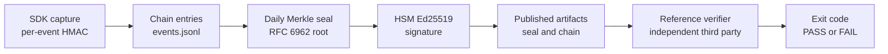

# Chain-of-Custody Specification — Public Review Draft 3 (PRD-3)

> Copyright © 2026 MMPWorks LLC and contributors. Licensed under the Apache License, Version 2.0. See [LICENSE](../LICENSE) and [NOTICE](../NOTICE).

> **Status:** Public Review Draft 3 (PRD-3). Document version `0.3.0`. **This is a draft for public comment, not a finalized standard.** Comments and review are invited per [GOVERNANCE.md](../GOVERNANCE.md). Material changes between PRD-N and PRD-(N+1) are tracked in [CHANGELOG.md](../CHANGELOG.md) and in §12 of this document.
> **Audience:** implementers of conforming SDKs, ledger servers, and verifiers; auditors and examiners reviewing the proposed standard; regulators evaluating whether to adopt it. Stakeholder navigation is at §13.
> **Conformance keywords.** The keywords MUST, MUST NOT, SHOULD, SHOULD NOT, and MAY are to be interpreted as described in [RFC 2119](https://www.rfc-editor.org/rfc/rfc2119) and [RFC 8174](https://www.rfc-editor.org/rfc/rfc8174). The keywords are normative for any future finalized version of this specification; in this draft they preview the conformance bar a finalized version is expected to carry.
>
> **Uppercase-only convention.** Per RFC 8174 §2, the conformance keywords carry normative weight **only when uppercase**. Lowercase occurrences of `must`, `should`, `may`, etc., in this specification are descriptive prose, not normative requirements. Implementers, reviewers, and auditors reading the spec MUST treat the keyword case as the discriminator: uppercase = normative; lowercase = descriptive.

---

## 0. Version policy (informative)

This specification carries **two independent versions** that implementers and reviewers must distinguish:

| Axis | Identifier | Where it appears | What it tracks |
|---|---|---|---|
| **Document version** | `0.2.0` (banner: "Public Review Draft 2 / PRD-2") | This banner; [CHANGELOG.md](../CHANGELOG.md); the filename `chain-of-custody-DRAFT-0.2.0.md` | The state of the specification *document* — its text, its conformance requirements, its public-comment cycle. Increments per draft revision (`0.3.0`, `0.4.0`, …) and finalizes to `1.0.0` when the public-comment process concludes. |
| **Wire-format identifier** | `"v1"` | Every chain entry's `format_version` field; the HKDF salt `b"ffiec.chain-of-custody.v1.salt"`; the HKDF info base `b"ffiec.chain-of-custody.v1.info"`; test-vector inputs and expected outputs | The byte-level construction. A change to the wire-format identifier breaks every test vector and every implementation that parses chain entries. The wire-format identifier is intentionally stable across the draft cycle so implementations can build against PRD-N and have their output remain valid under PRD-(N+1). |

A future incompatible wire-format change ships as a new wire-format identifier (`"v2"`) and a new document version that names the migration. A future additive wire-format change (a new optional field, a new chain-kind value) ships at the same wire-format identifier and a higher document version that names the addition.

The two version axes do not move in lockstep. A document-version revision (e.g., editorial clarification, restructured stakeholder navigation, added informative sections) produces no wire-format change and no test-vector change. A wire-format revision always produces both a document-version revision and a test-vector revision.

## 0.5 How to read this document (informative)

This section is informative. It exists so a first-time reader finds their critical path through PRD-2 in under 30 minutes without reading 2158 lines. Normative content begins at §1.

### 0.5.1 The chain in three paragraphs

**What is captured.** Every AI decision the institution makes — the prompt, the model's response, the tools called, the routing decision, and the operational state at capture. The capture happens at the SDK boundary inside the institution's process. Vendor cooperation is not on the critical path of evidence integrity.

**How it is sealed.** Each captured event is HMAC-chained to the prior event under a tenant-bound session key. At the close of each day, the day's events aggregate into an RFC 6962 Merkle tree, and the root is signed by the institution's HSM. Three independent layers — per-event MAC, daily Merkle root, HSM signature — must be simultaneously compromised to silently tamper a verified chain.

**How it is verified.** An examiner with no access to the vendor or operations team runs the reference verifier (Apache-2.0, §10.26) against the institution's published chain artifacts. The verifier produces an exit code and a structured result that any third party can reproduce against the same bytes. The procedure is at §7. The corpus that defines pass and fail is at `spec/test-vectors/`.

### 0.5.2 The chain at a glance



The four labelled stages map to the four primitives at §4. The verifier procedure that consumes the published artifacts is at §7.

### 0.5.3 Reading paths by role

The §13 stakeholder navigation gives the full per-role reading guide. The table below is a triage view: time budget, the minimum sections to read, and the single supporting document outside the spec that pays back the most.

| Role | Time | Read in this order | Companion document |
|---|---|---|---|
| **Bank executive / Audit Committee chair / Board Risk Committee chair** | 5 min | §1, §1.2, §13 entry | `docs/audit-committee-summary.md` |
| **Bank Model Risk Management (MRM) committee chair** | 45 min | §1.2, §10.20, §10.33, §10.34, §10.37 | `docs/MRM-COMMITTEE-BRIEF.md` |
| **Internal audit team** | 1 hour | §1, §4, §7, §10 | `docs/internal-audit-evidence-pack.md` |
| **SOC 1 / SOC 2 engagement team** | 1 hour | §1, §4, §7, §10, §10.18 | `docs/soc-pack/section-4-template.md` |
| **Bank or Insurer Legal / IR team** | 30 min | §1.1, §1.2, §5.2, §10.11, §10.13, §10.69, §10.70 | `docs/litigation-support.md` |
| **Bank privacy team (GDPR / CCPA / HIPAA)** | 45 min | §1.2, §10.20, §10.22, §10.23, §10.38, §10.69 | `docs/regulator-pack/gdpr-article-25-demonstrability.md` |
| **Bank customer-dispute officer** | 30 min | §10.23, §10.11.1, §10.11, §10.11.2, §10.69, §10.22 | `docs/customer-dispute-procedures.md` |
| **Public-records / FOIA officer** | 30 min | §10.22, §10.51, §10.52, §10.69, §10.72, §3 | `docs/regulator-pack/public-records-overlay.md` (forthcoming) |
| **Insurance underwriting director / pricing actuary** | 45 min | §1.2, §4.4.5, §10.22, §10.43, §10.46, §10.75 | `docs/regulator-pack/naic-market-conduct-overlay.md` |
| **Healthcare HIPAA officer / clinical AI lead** | 45 min | §1.2, §10.22, §10.69, §10.73 | `docs/regulator-pack/healthcare-overlay.md` |
| **EU national DPA / EDPB-coordinated reviewer** | 45 min | §1.2, §4.4.1, §10.22, §10.38, §10.69, §10.74 | `docs/regulator-pack/gdpr-article-25-demonstrability.md` |
| **EU AI Office market-surveillance reviewer** | 45 min | §1.2, §4.4.2, §10.34, §10.50, §10.74 EU AI Act high-risk obligations | `docs/regulator-pack/eu-articulation-extension.md` |
| **Consumer / data subject exercising rights** | 30 min | §1.2, §10.11, §10.11.1, §10.11.2, §10.23, §10.69 | Plain-spoken companion (§0.6) consumer walkthrough |
| **FFIEC IT Examiner / Cybersecurity Specialist Examiner / EIC** | 45 min | §1, §1.1, §4, §7, §10.12 | `docs/regulator-pack/fdic-occ-examination-overlay.md` |
| **FFIEC consumer-protection / CFPB examiner** | 45 min | §1.2, §10.11, §10.22, §10.23 | `docs/regulator-pack/cfpb-overlay.md` |
| **State insurance department examiner** | 45 min | §1.2, §10.11, §10.22 | `docs/regulator-pack/handbook-mapping.md` |
| **Vendor-management officer (SR 21-8 third-party risk)** | 45 min | §10.21, §10.26, §10.18, §10.19, §10.39, §10.40 | `docs/regulator-pack/vendor-management-overlay.md` (forthcoming) |
| **Acquirer-side IT due-diligence** | 1 hour | §1, §4, §7, §10.24 | `docs/m-and-a-handoff.md` |
| **Cryptographic expert (witness, advisory)** | 45 min | §1.2, §1.3, §1.4, §4, §10.5, §10.8, §10.17 | `docs/design/09-threat-model.md` |
| **Security researcher / red-team / vulnerability researcher** | 1 hour | §1.2, §1.4, §9, §10.5, §10.6, §10.8, §10.25, §4.1.2, §4.3.2 | `docs/design/09-threat-model.md` |
| **Implementer (SDK, ledger, or verifier)** | 2-3 hours | §3, §4, §5, §7, §10 | `docs/cryptographic-agility-roadmap.md` |

For other roles (bank chain-operations team, bank chain adopter, bank vendor-management team), the full reading guide is at §13.

### 0.5.4 If you only have five minutes

Read three things in order:

1. The §1.2 lists ("the chain proves" and "the chain does NOT prove"). They bound expectations.
2. The §4 introduction (the four-primitives table). It names the construction.
3. Your §13 stakeholder entry. It points at the deeper reading you actually need.

If the §1.2 lists answer the question you came here with, you are done.

### 0.5.5 What sits outside the spec

The spec is the normative artifact. Three companion artifacts are designed for reading the spec without reading the spec end-to-end.

- **Auditor stories** — scenario walkthroughs at `docs/auditor-stories/`. Each story takes one realistic situation (an examiner challenge, an M&A handover, an adverse-action dispute, a training-data subpoena) and walks through which spec sections answer which question. Stories cite spec sections inline, so a reader can drop into a story and arrive at the relevant normative text already oriented.
- **Question bank** — the public website hosts the common reviewer questions and the spec-cited answers. Every entry shows the spec citation that grounds it.
- **Reference implementation** — the open-source Go reference verifier (Apache-2.0), the test-vector corpus at `spec/test-vectors/`, and the regulator overlays at `docs/regulator-pack/`. An implementer who runs the verifier against the corpus has reproduced the spec's pass/fail definition without reading §7.

The spec, the auditor stories, and the question bank are layered: the spec is precise and dense, the stories are scenario-driven, the question bank is reactive. A reader picks the layer that matches their question and follows the citations down to the spec only when they need byte-level precision.

## 0.6 Navigation and contextual-help URL convention (normative)

This specification ships with an external **plain-spoken companion repository** that hosts scenario walkthroughs (the auditor-stories series), per-section one-line summaries, and a scenario-coverage index keyed by §10.x section number. The companion is not part of the standardization submission; it is a community-facing onboarding asset published alongside the spec under the contextual-help URL convention this section normates.

**Convention (normative).** Each §10.x normative subsection in this specification MAY reference — informatively — the plain-spoken companion's matching scenario walkthrough via a *contextual-help URL*. The URL points to the scenario(s) that exercise the section in production, plus the section's plain-spoken summary line. Two requirements bind any implementation that surfaces the URL:

1. **URL stability.** The companion repository commits to a versioned-stable URL schema. PRD-N spec text references PRD-N-matched companion URLs. Older PRD spec releases continue to reference their matched companion URLs. URL drift between PRD revisions is forbidden; deprecated PRD URLs MUST resolve to a redirect-with-current-PRD-pointer, not to 404.
2. **Citation indirection.** Scenario walkthroughs in the companion repository MAY contain narrative-driven detail (specific institution names, observer-stakeholder framings, personal arcs, recusal-protocol references). Such narrative content MUST NOT appear in this specification's normative text. The companion repository is the authoritative location for narrative-bearing operational grounding; this specification text remains conventional in form.

**Coverage-gap detector (normative for the companion repository's CI).** The companion repository's continuous-integration pipeline runs a coverage-gap detector against this specification's §10.x section enumeration. The detector emits:

- A WARNING when a §10.x normative subsection is not cited in any companion scenario.
- An ERROR when a companion scenario cites a §10.x section that does not exist in the current PRD.
- A RELEASE-BLOCKING ERROR when a §10.x section's plain-spoken summary line is absent or stale.

PRD-N → PRD-(N+1) evolution is gated on full coverage. The detector's output is published as part of the companion repository's release notes; institutions and reviewers reading either artifact can confirm coverage symmetry without manual cross-walk.

**§13 Stakeholder navigation (informative, downstream of §0.6).** §13 of this specification provides stakeholder-keyed entry points by role (bank executive, audit committee chair, MRM committee chair, FFIEC examiner, cryptographic expert, implementer, etc.). Readers entering through §13 are routed to their role's reading order and to the relevant §10.x sections; those readers MAY then follow the contextual-help URL into the companion's matching scenario for operational walkthrough. The two surfaces compose: §13 routes by role; the companion routes by scenario; §10.x is the normative anchor both surfaces cite.

**What the convention does not require.** Implementations of the §7 verifier procedure are unaffected by the companion repository's existence; §7 is verifier-conformant against the spec's normative text and test-vector corpus alone. Working-group reviewers MAY read the spec without ever consulting the companion. The contextual-help URL is an onboarding affordance, not a normative dependency.

---

## 1. Scope

This specification defines a chain-of-custody primitive set for capturing AI-driven decisions in regulated systems. The primitives are designed to satisfy the integrity-of-logging requirements in the FFIEC IT Examination Handbook (Information Security and AIO booklets) and related model-risk-management guidance (SR 11-7, OCC Bulletin 2011-12, and the 2026 consolidated update from OCC, Federal Reserve, and FDIC — OCC Bulletin 2026-13 plus counterpart Federal Reserve and FDIC issuances tracked alongside as those agencies publish; see §1.1's regulator-facing alignment note).

**Applicable agencies (informative).** The chain's evidentiary posture composes across the agencies that supervise AI-driven decision-making in regulated US institutions:

- **FFIEC member agencies.** Federal Reserve Board (FRB), Federal Deposit Insurance Corporation (FDIC), Office of the Comptroller of the Currency (OCC), National Credit Union Administration (NCUA), Consumer Financial Protection Bureau (CFPB), and State Liaison Committee (state banking departments).
- **Securities and Exchange Commission (SEC).** Broker-dealers (Reg S-P, Reg S-ID), registered investment advisers (Advisers Act Marketing Rule), and the books-and-records retention regime under 17 CFR §240.17a-4.
- **State banking departments.** Coordinated through CSBS (Conference of State Bank Supervisors) NCA (Nationwide Cooperative Agreement); NYDFS is the most-named state regime in the spec body but every state-chartered bank's home regulator applies.
- **State insurance departments.** Coordinated through the NAIC (National Association of Insurance Commissioners) for market-conduct and rate-and-form review of AI-driven underwriting / claims / pricing decisions. Per-state DOI regimes apply in parallel (Colorado Reg 10-1-1, NYDFS Circular Letter 7, etc.).
- **International parallels.** EU supervisory authorities (national DPAs coordinated through EDPB; the EU AI Office for market-surveillance under the EU AI Act); UK FCA / PRA; Singapore MAS; Canadian OSFI; Brazilian BCB; Australian ASIC. The chain's cryptographic substrate is regime-neutral; the agency-specific overlays in `docs/regulator-pack/` map the substrate to each regime's evidentiary expectations.

The enumeration is informative; it does not redefine the spec's normative scope. A regulator not named above (e.g., the FHFA, the Farm Credit Administration, FINRA) applies the chain under its own supervisory mandate without spec-amendment.

The primitives are language-neutral, transport-agnostic in their core construction (though a wire-format binding to OTLP is normative), and produce output that can be independently verified by an examiner with no access to the institution's vendor or operations team.

**Scope — decision-time integrity AND training-phase integrity.** This spec covers the integrity of AI agent decisions at inference time: what the model was asked, what it produced, what tools it called, what routing decision led to which provider, what the institution's operational state was at the moment of decision. The spec ALSO covers training-phase integrity for institutions operating training-phase-bearing AI (federated learning, in-house retraining, model-development pipelines): training-data hash binding, gradient compute attestation, aggregation evidence, validation against held-out test sets, and model-artifact production. The training-phase coverage is normative in §10.34 (`audit.training.*` attribute family) and composes alongside the inference-phase chain via cross-anchor patterns. Institutions operating inference-only on third-party-trained models do not emit training-phase events; institutions operating both phases emit both. The chain provides the integrity binding for training-phase events; the substantive correctness of training data, the methodology for validation, and the policy compliance of training decisions are answered by the institution's separate audit programs (training-data labeling, fair-lending review, ECOA / GDPR Article 22 / EU AI Act Article 10 / Treasury FS AI RMF data-integrity coverage) — the chain is the integrity foundation, not the truth foundation, for training as it is for inference.

### 1.1 Daubert four-factor grounding (informative)

The chain's evidentiary posture is structured so the four factors named in *Daubert v. Merrell Dow Pharmaceuticals* (and the *Frye* general-acceptance test in jurisdictions that retain it) each have a concrete answer the institution's expert witness can point at without re-engineering the system.

**The four factors and the spec's response:**

- **Testability.**
 - §7 defines an ordered, byte-exact verification procedure.
 - The reference test-vector corpus (`spec/test-vectors/`) ships positive vectors 001, 002, 003, 008, 010, 015–026 alongside negative vectors N001–N023.
 - Each negative vector exercises an independent threat scenario — cross-chain lift, MAC tamper, fingerprint mismatch, seal forgery, JCS edge-case divergence, and the rest.
 - The procedure and the corpus together let any third party reproduce a verifier's pass/fail result against the same bytes.
 - The integrity claim is falsifiable in the Popperian sense: produce a tampered chain that the §7 procedure does not reject, and the claim is broken.
- **Peer review.**
 - The spec is developed under an FFIEC working-group process; outside-reviewer drops are captured in `docs/feedback/`.
 - The reference implementation is Apache-2.0 and the test-vector corpus is public.
 - Independent experts review both the spec text and the reference code; their comments and the working group's responses are preserved in the feedback record.
 - **Cryptographic peer-review targets (informative).** The spec's cryptographic primitives are reviewed against IETF Crypto Forum Research Group (CFRG) work, NIST publications (FIPS 180-4, FIPS 186-5, FIPS 198-1, SP 800-90A, SP 800-108, SP 800-185), and the Real World Crypto community's published analysis. The spec's deployment-side discipline (HSM custody, key-management lifecycle, multi-target considerations) is reviewed against IETF UTA (Using TLS in Applications) discipline and NIST SP 800-175B. Where the spec's construction deviates from a published peer-reviewed primitive (e.g., novel composition of HMAC-chain + Merkle + Ed25519 in the specific arrangement of §4), the burden is on the spec to defend the construction; the working group operates an explicit-disclaim posture rather than implying broader peer-review than has actually occurred. The current peer-review trail is documented in `docs/feedback/` with named reviewers and their comment dispositions; pre-publication review by external cryptographic experts is scheduled before v1.0 final.
- **Known error rate.**
 - No practical attack is known against HMAC-SHA-256 (FIPS 198-1), the RFC 6962 Merkle construction over SHA-256 (FIPS 180-4), or Ed25519 (FIPS 186-5) under the §10 threat model.
 - **Per-primitive theoretical error bound (informative).** Under the standard cryptographic assumptions:
   - HMAC-SHA-256 existential forgery probability (FIPS 198-1; Bellare 2006 PRF assumption): bounded by `q^2 / 2^256` for `q` chained MAC operations under a fixed key — at `q = 2^48` (an institution-day's events), the bound is `2^-160`.
   - SHA-256 collision probability for a Merkle tree of N leaves (FIPS 180-4; birthday-bound): bounded by `N^2 / 2^256` — at `N = 2^32` daily events, the bound is `2^-192`.
   - Ed25519 existential forgery probability (FIPS 186-5; under EUF-CMA assumption per RFC 8032 §8): bounded below the `2^-128` classical security level over the verifier's adoption horizon.
 - A verifying false-negative requires the simultaneous compromise of three independent custody layers: the tenant's IKM (in HSM/KMS), the institution's ledger storage (append-only with operator-side controls), and the HSM signing key (FIPS 140-2 Level 3 or higher).
 - The three layers are operated by different roles under separation-of-duties controls; compromise of any one alone does not produce a verifying tamper.
 - **Verifier procedural-error rate (informative).** The §7 procedure is deterministic — same bytes in, same pass/fail out. Repeated runs of the same verifier binary against the same input produce byte-identical Verdict-Object output. The verifier's procedural error rate is the implementation-bug rate, not a stochastic property of the cryptographic primitives; the §10.26 reference-verifier distribution (Cosign-signed, reproducible-build, peer-verified by Compliance and SDK implementations against the test-vector corpus) bounds the implementation-bug rate by surfacing divergences against the pinned test vectors.
- **General acceptance.**
 - The cryptographic primitives are NIST-standardized: FIPS 180-4 (SHA-256), FIPS 186-5 (Ed25519), FIPS 198-1 (HMAC), RFC 5869 (HKDF), RFC 8785 (canonical JSON), RFC 6962 (Merkle aggregation).
 - The combination of HMAC-chained event records under a tenant-bound key plus a daily Merkle root signed by an HSM is standard in audit-chain literature and in deployed audit-log systems — Certificate Transparency, Trillian, append-only ledgers in regulated finance and healthcare.

The four-factor grounding is informative — it does not add normative requirements. It exists so an expert witness laying foundation under FRE 702 / *Daubert* can answer the four questions from the shipped artifacts (spec text, test-vector corpus, reference implementation, FIPS standards) rather than from internal documents the institution might not have.

**Verifier-version mismatch cross-examination procedure (informative).** Opposing counsel familiar with cryptographic systems may attempt to undermine the chain's integrity claim by pointing to a verifier-version difference: "the institution's expert witness ran the verifier at version `v1.0b-verifier-2026-05-15`, but the chain was sealed under spec version `v1.0c`; therefore the verifier's PASS output is unreliable." The cross-examination procedure has a structured response anchored in the Verdict-Object's normative schema:

1. **The verdict object carries `verifier_spec_version_supported`.** Per §7's verdict schema, every verifier run emits the spec version the verifier was built against. A verifier running `v1.0b-verifier` against a `v1.0c`-sealed chain reports `verifier_spec_version_supported = "v1.0b"`; the §7 step 11 dispatch table rejects the seal at the floor check (when CC8.1 declares a floor) OR fails at the form-dispatch with `sign_payload_version "v1.0c" not supported by this verifier (running v1.0b)`. Either failure produces exit code 1, not PASS — the chain rejected verification under the wrong-version verifier. The institution's verifier-version posture is therefore self-evident from the verdict object.
2. **Verifier-version upgrade procedure.** When the spec version moves (v1.0a → v1.0b → v1.0c), institutions migrate their verifier binaries through the §10.26 reference-verifier distribution channel. The migration is itself a chain-bound posture-change event under `chain.posture_change_approved` (per §10.2). Cross-examination citing a verifier-version-spec-version mismatch is rebutted by producing the institution's posture-change event showing the migration happened.
3. **PASS under a newer verifier than the seal version.** A v1.0c verifier walking a v1.0a or v1.0b chain produces PASS under the appropriate dispatch (§7 step 11 form-table); v1.0a / v1.0b dispatches are preserved across spec amendments. Cross-examination cannot attack PASS on the grounds of verifier-newer-than-seal; the dispatch is the load-bearing answer.
4. **The cross-examination strawman.** "The verifier could have a bug that produces PASS on tampered chains." Response: the §10.26 reproducible-build + Cosign-signed verifier discipline binds the verifier's behavior to the published test-vector corpus. A verifier bug that produces PASS on a known-bad test vector surfaces immediately under §10.26 release-verification. The cross-examiner who alleges such a bug bears the burden of producing the specific failing test vector; otherwise the allegation is speculative.
5. **The legitimate cross-examination angle.** Where the verifier's `verifier_version` differs from the version cited in the institution's CC8.1, the institution's witness explains the version delta (typical reasons: a Cosign-signed release upgrade since the CC8.1 was last updated; a downstream institution running an older verifier from the §10.26 channel pending migration). The chain's `chain.posture_change_approved` operational event records these moments; cross-examination citing the delta is rebutted with the event reference.

The cross-examination procedure is informative — it documents the procedural answer for the institution's IT witness and counsel. The load-bearing artifact is the Verdict-Object's `verifier_version` and `verifier_spec_version_supported` fields, which are integrity-bound on every verifier run.

**Regulator-facing alignment (informative).** The same artifacts the four-factor grounding rests on — spec text, test-vector corpus, reference implementation, the §7 verification procedure — also answer regulator-facing examination questions framed by the U.S. banking-supervision model-risk-management (MRM) regime:

- The FFIEC IT Examination Handbook (Information Security and AIO booklets).
- SR 11-7 / OCC Bulletin 2011-12 — the 2011 MRM guidance.
- The consolidated 2026 update from OCC, Federal Reserve, and FDIC — OCC Bulletin 2026-13 and counterpart Federal Reserve / FDIC issuances.

The 2026 guidance emphasizes risk-based proportionality, third-party vendor accountability, lineage tracking, "effective challenge," and governance posture over mathematical-purity. The spec answers that emphasis through:

- The `(normative when applicable)` adoption pattern across §10.x.
- The §10.21 cross-vendor model-handover schema, including the contract-binding attributes.
- The §10.34 and §10.66 training and weight-lineage primitives.
- The §10.21.2 parallel-evaluator composition primitive.
- The §10.18 CC8.1 cross-referencing discipline.

These supply the chain-bound substrate that the institution's MRM committee, the SOC engagement team, and the examiner each verify against the same shipped artifacts.

**ISO 27001:2022 Annex A mapping.** Appendix C (informative) cross-walks the chain's primitives and §10.x operational requirements to ISO 27001:2022 Annex A controls (A.5.7 threat intelligence, A.5.23 cloud-service information security, A.5.24 IR planning, A.8.15 logging, A.8.16 monitoring, A.8.17 clock synchronization, A.8.24 cryptography, A.8.28 secure coding, A.8.34 audit testing). Non-US auditors using ISO 27001 as their primary control framework read Appendix C as the bridge into the spec body.

**Proportionality on the extension surface.** The `(normative when applicable)` pattern offers institution-side proportionality on §10.x:

- A community institution adopts §4 + §7 + §10.1–§10.10 and is conformant.
- A Tier-1 institution operating frontier-AI training adds §10.34, §10.63–§10.67, and the hardware-supply-chain family.
- The §4 cryptographic floor (HMAC-chained event records, daily Merkle seal, HSM-rooted root signature) is uniform across institutions and is the proportionality boundary the spec does not relax. Institutions assess whether the §4 floor matches their risk profile before electing the spec.

**Generative AI posture.** The 2026 guidance notes that generative AI is "novel and rapidly evolving" and is not yet covered. Institutions adopting §4.4's OpenTelemetry GenAI namespace, §10.47–§10.50's GenAI-specific operational events, and §10.63–§10.67's training-provenance family operate under a posture the institution can defend in examiner review until prescriptive guidance issues. The 2026 guidance's directional, non-prescriptive framing ("this guidance does not set forth enforceable standards or prescriptive requirements") does not foreclose that posture.

**Foreign-jurisdiction equivalence (informative).** The Daubert / FRE / FRCP framing above is the US-court evidentiary posture. The chain's cryptographic substrate is regime-neutral; comparable foreign-jurisdiction evidentiary frameworks compose with the same artifacts:

- **United Kingdom.** Civil Procedure Rules Practice Direction 31B (Disclosure of Electronic Documents) governs ESI disclosure in UK civil litigation; CPR 35 governs expert evidence (the Daubert analog in UK practice operates differently — the court controls expert evidence through CPR 35 rather than through a Daubert-style threshold). The chain's verifier output (§7), its §10.13 evidentiary artifacts, and its §5.2 best-evidence-equivalent posture under §10.69 customer disclosure compose with PD 31B and CPR 35 without spec text change.
- **European Union — eIDAS.** Regulation (EU) 910/2014 (eIDAS) defines "qualified electronic timestamps" carrying presumptive legal effect on the date and time of data signed under a qualified trust service provider. The chain's §10.14 trusted-time integration (RFC 3161, RECOMMENDED for v1.0) provides the operational hook; institutions deploying eIDAS-grade timestamping anchor the chain's seal records under a qualified TSP, achieving Article 41(2) presumptive legal effect for chain-stamped data.
- **Canada.** The Supreme Court's *R. v. J.-L.J.* (2000) and *R. v. Mohan* (1994) frameworks govern expert evidence admissibility; the four-factor structure parallels Daubert. The chain composes with the Canada Evidence Act ESI provisions and the *Mohan* threshold the same way it composes with FRE 702 — same artifacts, different procedural rules.
- **Australia.** The *Evidence Act 1995* (Cth) and the *Federal Court Rules 2011* govern ESI; §190 admissibility under the rules of evidence parallels FRE 901 authentication. The chain's verifier output and §10.13 artifacts ground the §190 foundation.
- **DORA composition.** EU Regulation 2022/2554 (Digital Operational Resilience Act) governs ICT risk-management for EU-supervised financial institutions; Articles 28-30 cover third-party-risk requirements that compose with the chain's §10.21 cross-vendor handover schema. `docs/regulator-pack/dora-articulation-overlay.md` carries the detailed mapping.

The enumeration is informative; the cryptographic substrate is the load-bearing artifact across every jurisdiction. Institutions operating across jurisdictions cite the same chain artifacts in the procedural framework of each.

### 1.2 Epistemic scope (informative)

The chain proves two things and does not prove four others. Implementers, examiners, and the institution's litigation-support team rely on this distinction.

**The chain proves:**

- **(a) What the AI said at a specific time.** The captured event records the model's response, the prompt that elicited it, the tools called, the routing decision, and the operational state at the moment of capture. The per-event MAC and the daily Merkle seal bind these to the institution's HSM-signed root.
- **(b) That the record was not tampered with after capture.** The §7 verification procedure rejects any modification to the captured bytes after the chain entry was written.

**The chain does NOT prove:**

- **(c) That the AI's statement is factually accurate.** The chain captures what the model said; it makes no claim about whether what the model said is true.
- **(d) That the AI's statement complied with policy.** The chain does not evaluate the captured response against the institution's policy library, fair-lending rules, ECOA / CFPB obligations, or any other compliance regime. Policy-compliance proof requires a separate audit trail — the institution's policy-as-code system, human review records, or a downstream compliance evaluator.
- **(e) That the AI's statement is free of bias.** The chain captures decisions but does not measure their statistical properties. Bias proof requires statistical testing across a population of decisions, training-data audits, and the institution's fair-lending review program.
- **(f) That a customer-disclosure subset is complete with respect to the institution's full chain.** Under §10.69 customer-disclosure mode, a customer holding a derived disclosure key verifies the integrity of the entries the institution disclosed — but the chain does not prove the institution disclosed every entry the customer was entitled to receive. The mechanics:
 - **Mis-categorization is undetectable from the chain alone.** An institution that withholds an entry as an excluded class (`sar`, `litigation_hold`, `privileged_investigation`, or any institution-named exclusion) produces a customer-disclosure packet that PASSes the customer's verifier; the customer cannot detect the mis-categorization from the chain.
 - **The chain proves what was disclosed; it does not prove what was withheld.**
 - **Post-hoc backstop.** The §10.70 access-trail discipline supports disclosure-completeness review when a regulator (typically FinCEN) inspects the institution's privileged-investigation access records. The customer-side chain alone is silent on the omission.
 - **Composition with other regimes.** Institutions composing customer-disclosure evidence with BSA SAR record-retention, litigation-hold custodian discipline, and court-ordered disclosure name the composition in CC8.1.

**Litigation posture.** The institution's IT witness and counsel distinguish clearly between "the chain proves our system said X at time T" — which is what the chain delivers — and "X is true / X complied with policy / X is unbiased" — which are separate questions answered with evidence outside the chain. The chain is the integrity foundation, not the truth foundation.

**Stochastic-output epistemic claim (informative; complements (a)).** Generative AI systems — large language models, diffusion models, GenAI medical-literature synthesizers — produce stochastic outputs. Running the same prompt against the same model twice can produce different output text. Claim (a) above continues to apply, qualified:

- **What the chain proves.** "At time T, the institution presented prompt P to model M (identified by `gen_ai.response.model` version + model-weight hash) under sampling parameters S (seed, temperature, top-p, top-k bound under §10.47's four-tuple) against retrieval context R (Merkle root bound under §10.48), and the model returned output O." The chain binds the full input parameter-set AND the output as a coordinated witness — not just the output text in isolation.
- **What the chain does NOT prove.** "The institution's model would necessarily produce O every time given (P, M, S, R)." Stochastic outputs are bounded by the sampling parameters; the chain proves the bound, not the reproducibility. Two stochastic runs under identical (P, M, S, R) produce statistically-similar but not byte-identical output text; the chain captures each as a distinct integrity-bound observation.
- **Why the parameter-binding matters in cross-examination.** Opposing counsel arguing "the AI could have said something different" cites the model's stochasticity to undercut the chain's integrity claim. The chain's parameter-binding response: "Under the bound parameters at the bound moment, this output IS what the institution captured. The institution does NOT claim the model is deterministic; the institution DOES claim the captured output is the model's actual response under the bound parameters." The distinction is load-bearing: the chain is a witness to a specific stochastic draw, not a model-determinism claim.
- **Reproducibility is out-of-band.** An examiner who can re-run the model with the same seed, parameters, and retrieval set gets a reproducibility check; the chain alone proves that the parameters governing the output were bound at capture, not that the output is reproducible. Examiners requesting reproducibility runs operate outside the chain's scope (the institution's MRM committee runs the reproducibility procedure under the §10.33 model-validation discipline).
- **Spec coverage.** §10.47 (prompt/output four-tuple binding) and §10.48 (stochasticity attestation) normate the parameter-binding for GenAI deployments under chain-of-custody.

The chain remains the integrity foundation; stochastic outputs slot under the same discipline as deterministic ones. The parameter-binding framing closes the Daubert "Known error rate" challenge for stochastic outputs by reframing the question — the chain's "error rate" claim applies to integrity verification (forgery detection, tamper resistance), NOT to model output determinism.

**Public-transparency epistemic claim (informative; complements (a)).** Public-facing transparency layers operate under differential-privacy (DP) bounds — the published aggregate is noised before release because the raw aggregate is too sensitive to publish. The chain's role here is bounded:

- **What the chain integrity-binds.** The noised aggregate (the public-facing form) — NOT the raw aggregate.
- **What the institution attests separately.** The DP mechanism, ε budget, RNG seed, and mechanism-version hash. Named in CC8.1.
- **The integrity claim.** "We published THIS noised value, derived under THIS DP mechanism with THIS ε budget." NOT "the raw aggregate underlying this is X."
- **Two audiences.** Public readers see the noised aggregate plus the chain proof of its DP-bound publication. Regulator-side readers with separate access to the raw substrate verify noise correctness by re-deriving the noisy aggregate from the bound parameters.
- **Applicable regimes.** US FOIA, EU Public Sector Information Directive, Swiss Öffentlichkeitsgesetz, parliamentary-inquiry public-records release.
- **Spec coverage.** §10.51 (public-transparency overlay) normates the DP-bound publication; §10.52 (public model-card binding) normates the model-card publication trail.

The chain is the integrity foundation; DP correctness is the regulator's audit.

**Forward-secrecy non-claim (informative).** The chain does not provide forward secrecy for session keys.

- **The mechanic.** HKDF derivation is deterministic from the IKM; an attacker who compromises the IKM can recompute any past session key for that tenant and forge past events that would verify under MAC verification alone.
- **The layered defence.** A compromised IKM is typically detected via fingerprint mismatches at reconciliation (§10.1), operational anomalies, and incident response. The daily Merkle seal plus HSM signature cover events as they were captured and sealed; retroactive forgery requires altering the seal record, which is bound under the HSM signature whose private key is held under FIPS 140-2 Level 3 custody.
- **Status.** Documented non-claim, not a vulnerability. Institutions needing session-key forward secrecy operate compensating controls outside the chain.
- **Roadmap.** Per-process ephemeral key material or HKDF-based key ratcheting is a candidate v1.x scope addition.

**Application-process compromise as a fourth class (informative; complements §1.1 "Known error rate").** The §1.1 three-layer compromise model names the layers an attacker must simultaneously breach to produce a verifying false-negative: tenant IKM, ledger storage, HSM signing key. A fourth scenario applies inside the SDK's process itself.

- **The scenario.** Compromise of the SDK process holding the live session key (Adversary F per `docs/design/09-threat-model.md` §2.6).
- **What the attacker can do.** Compute valid `payload_hash` values using the legitimate session key derived from the legitimate IKM. Emit chain entries that pass §7 step 8 (fingerprint match) and step 9 (MAC match). The daily Merkle seal signs those entries as a normal seal-day.
- **What is NOT compromised.** IKM, ledger storage, and HSM are all uncompromised — yet the chain produces a verifying record of events the legitimate AI agent did not generate.
- **Window characteristics.** Forward-only. Past chain entries are unaffected and cannot be retroactively altered by a process compromise. The window is bounded by the institution's host-hardening, intrusion-detection, and master-key-rotation controls.
- **Compensating controls.** Anomaly detection on the captured stream, out-of-band agent-behavior monitoring, third-party intrusion detection.

A complete Daubert "Known error rate" answer under FRE 702 names all four scenarios — three layers of custody compromise plus the SDK-process compromise — so the expert witness has the full residual-risk picture under cross-examination. See `docs/design/09-threat-model.md` §2.6 (Adversary F) for the residual-risk posture.

#### 1.2.1 What becoming a chain operator means for discovery (informative)

The chain is a permanent, hash-verifiable record of every AI-driven decision the institution captures. That property is the chain's value to litigation defense AND the property the institution's GC must account for at chain-adoption time. Read the five points below before the institution commits to chain-of-custody:

1. **Hash-verifiable means undeniable.** The institution cannot later claim "the chain entry is wrong" without surfacing a §7 verification failure that is itself a Severe-control-failure event. The chain is harder evidence than logs alone; counsel plans around that.
2. **Redaction is pre-MAC at the SDK only (§10.22).** A post-capture redaction is non-conformant. PII / PHI flowing through AI decisions MUST be redacted before the per-event MAC is computed, OR held outside the chain in the token vault per `privacy-by-design.md`. The institution cannot decide later "we should not have captured that."
3. **Privilege claims must be pre-tagged (§10.70).** Attorney-client / work-product / regulatory-examination / BSA-SAR / institution-named-investigation regimes are dispatched on a per-entry tag. Tagging is at capture; retroactive tagging is non-conformant. Counsel works with the chain-operations team to identify privileged-flow surfaces before the chain enters production.
4. **Litigation-hold and SAR exclusions are categorical, not entry-level (§10.13.3, §10.70).** When a hold is placed, the institution emits a `chain.litigation_hold.placed` event scoping the hold by filter (consumer-id, date range, decision-class, audit-attribute filter). The chain proves the hold is in place; it does NOT identify which specific entries the hold covers to a customer-facing verifier.
5. **The §7 verifier is the institution's affirmative defense AND the opposing party's foundation under FRE 902(13)/(14).** Both sides cite the same artifacts. The §10.13 evidentiary artifacts list is the single citation surface for FRE 901 (authentication), FRE 902(13)/(14) (self-authentication), FRE 803(6) (business records), and FRCP 26(b)(1) (proportionality).

**Joint-account asymmetric-information framing (informative).** Joint accounts (co-signed mortgages, joint deposit accounts, jointly-titled investment accounts) and joint-AI-decision contexts (co-applicants on a single underwriting decision; co-insureds on a single policy decision) present a structural asymmetric-information problem the chain captures but does not resolve. Each joint participant has:

- A §10.69 right to their own portion of the chain (their own attribution rows, their own ECOA reasons, their own packet derived from their own session key).
- NO right to the other joint participant's portion (the other party's attribution rows, their PII, their non-shared decision context).

Practically: in a denied joint mortgage, Alice has standing to challenge her share of the denial reasoning AND to know which reasons were jointly attributed; she does NOT have standing to know Bob's specific credit-history detail that drove Bob's portion of the denial. The chain's joint-decision partition rule (per §10.69) operationalizes this asymmetry — but the institution's GC and the joint participants' counsel must understand that:

- Each joint participant's disclosure packet is partial-by-design. The packet's `disclosure_complete_excepting = ["redacted_per_§10.22"]` declares the partial nature; the redaction protects the OTHER joint participant's privacy, not the institution's.
- A joint participant whose dispute requires the other joint participant's content (e.g., Alice arguing Bob's credit detail was misrepresented) must reach that content through a separate procedural pathway — the other joint participant's voluntary disclosure, a court-ordered production in joint litigation, or a class-disclosure procedure if a class is certified.
- The institution does NOT have authority to unilaterally release one joint participant's PII to the other; the §10.22 redaction discipline binds that constraint.
- When the joint relationship dissolves (divorce, death, account separation), the §10.69 estate / fiduciary procedure (per §10.69) applies to the dissolved relationship's chain history; surviving joint participants retain access to their own portion under the survivorship rules of the underlying account agreement.

The asymmetric-information property is a design feature, not a deficiency — the chain cryptographically enforces what the regulatory regimes (ECOA, FCRA, CCPA, GDPR) require: each consumer's rights apply to their own data, not their joint partner's. Counsel advising a joint participant on chain-of-custody dispute strategy works within this constraint.

**Cross-reference.** §10.13 evidentiary artifacts (the authoritative list); §10.22 redaction discipline; §10.70 privilege regimes; §10.13.3 litigation-hold registry binding; §10.13.1 / §10.13.2 discovery production form + FRCP framing; §5.2 best-evidence posture; §5.2.1 FRE 902(13)/(14) self-authentication; §5.2.2 FRE 803(6) business-records foundation; §10.69 joint-mortgage worked example (the operational form of the asymmetric-information framing); `docs/litigation-support.md` (operational discipline).

### 1.3 Security definitions (informative)

The chain's primitives provide standard cryptographic security properties under widely accepted assumptions. The properties are stated explicitly here so an expert witness, a CFRG-style reviewer, or an academic citation can read the formal claims without inferring them from the construction.

**Standard properties the chain provides:**

- **Per-event MAC — existential unforgeability under chosen-message attack (EUF-CMA).**
 - Primitive: HMAC-SHA-256 (FIPS 198-1).
 - Property: an attacker with oracle access to MAC computations cannot produce a valid `(message, MAC)` pair for a message they have not queried.
 - On the chain: the per-event entry's `payload_hash` carries this property. An attacker cannot forge a chain entry that verifies under the tenant's session key without holding that key.
- **Daily Merkle seal — second-preimage resistance.**
 - Primitive: RFC 6962 Merkle construction over SHA-256 (FIPS 180-4).
 - Property: given a published Merkle root, an attacker cannot find a different set of leaves that produces the same root.
 - Construction detail: the leaf-prefix (`0x00`) and node-prefix (`0x01`) per RFC 6962 §2.1 prevent confusing internal nodes with leaves.
 - The seal does NOT depend on collision resistance — even if SHA-256 collisions were demonstrated, the second-preimage property still prevents retroactive event substitution against a fixed sealed root.
- **HSM signature — EUF-CMA (Ed25519).**
 - Primitive: Ed25519 (FIPS 186-5, RFC 8032).
 - Property: an attacker without the private key cannot produce a signature that verifies under the corresponding public key.
 - Custody: FIPS 140-2 Level 3 or higher per §10.5; the private key is non-extractable, closing the obvious online attack surface.

**Explicit non-claims:**

- **No confidentiality (no IND-CPA).** The chain is not an encryption scheme. Captured events are recorded in cleartext at the ledger; an attacker reading the ledger storage learns the events' contents. Confidentiality at the ledger is the institution's storage-controls responsibility, not the chain's.
- **No collision resistance load-bearing on the Merkle root.** The integrity guarantee depends on second-preimage resistance, not collision resistance. Second-preimage attacks on SHA-256 are believed strictly harder than collision attacks; a future weakening of SHA-256 collision resistance does not by itself break the chain.
- **No forward secrecy at the session-key layer.** Per §1.2's forward-secrecy non-claim, IKM compromise is not bounded by past-key erasure.

**Effective security level — 128 bits.** Set by the weakest layer:

- Ed25519 provides ~128-bit security.
- HMAC-SHA-256 provides 128-bit security against birthday-bound forgery (output is 256 bits, but the attack bound is 2^128 queries).
- SHA-256 provides 128-bit second-preimage resistance.

This is consistent with NIST SP 800-175B's 128-bit security baseline for cryptographic systems processing non-classified government information. The 128-bit level is appropriate for FFIEC banking-regulation horizons (typically 7-year retention) under adversaries constrained by practical computation limits.

**Multi-target security considerations (informative).** The 128-bit single-target bound above degrades under multi-target attacks at scale. A multi-tenant SaaS deployment (§10.1 multi-tenant SaaS vendors serving multiple institutions) concentrates many per-tenant session keys under one verifier-host surface. Standard reductions for multi-target attacks against HMAC and against Ed25519 lose `log2(N)` bits where N is the number of independent targets:

- A SaaS vendor serving 2^10 tenants (~1,000 tenants) operates at approximately `128 − 10 = 118`-bit effective security on the per-tenant HMAC layer.
- A SaaS vendor serving 2^20 tenants (~1,000,000 tenants) operates at approximately `128 − 20 = 108`-bit effective security.
- A SaaS vendor serving 2^30 tenants (~1,000,000,000 tenants — beyond typical institutional scale but relevant to public-cloud-scale platforms) operates at approximately 98-bit effective security.

The chain's per-institution IKM isolation (per §10.1 IKM registry uniqueness) bounds the multi-target surface to one institution's tenant population, not the SaaS platform's global population — so the relevant N is per-institution tenant count, which is typically `2^4` to `2^8` (16 to 256 tenants for typical SaaS contracts). At that scale, the degradation is `128 − 4 = 124` to `128 − 8 = 120` bits, which remains above NIST's 128-bit floor for the standard 7-year FFIEC retention horizon.

Institutions operating at scales where N exceeds `2^16` (65,536 tenants under a single institution's IKM) SHOULD consider the multi-target degradation in their risk-tolerance statement. The institution's CC8.1 names the SaaS-platform multi-target posture explicitly when the institution operates at scales where the degradation reduces effective security below the institution's risk target. The §10.10 IKM rotation cadence is the operational lever: tightening rotation cadence reduces the effective N within any rotation window, restoring the bound.

This analysis is academic-grade honest disclosure of the bound. The 128-bit single-target claim above remains technically accurate for the typical institutional deployment; the multi-target nuance applies to extreme-scale multi-tenant SaaS vendors and is named here for CFRG-track readers and for institutions whose risk-tolerance statement requires the per-deployment degradation analysis.

Institutions requiring 256-bit security — post-quantum migration, multi-decade retention horizons exceeding NIST's 128-bit minimum-security horizon — operate under v1.x extensions:

- Post-quantum signature algorithms: Dilithium per FIPS 204 provides 256-bit security at NIST level 5.
- SHA-3 provides 256-bit second-preimage resistance.

### 1.4 Compositional security (informative)

The chain composes three independent authentication layers. The compositional argument is informal here; a future formal protocol model (TLA+, Tamarin, ProVerif) is a candidate work item but is not load-bearing for v1.0.

**The three layers:**

- **Layer 1 — per-event HMAC (Primitive 1, §4.1).** Proves no wire-level tampering after the SDK emitted the event. A tamper requires forging an HMAC under the tenant's session key.
- **Layer 2 — daily Merkle seal (Primitive 2, §4.2).** Proves no retroactive entry insertion, deletion, or reordering after the seal was published. A tamper requires producing a different Merkle leaf set that yields the same sealed root, which the second-preimage property of SHA-256 forbids.
- **Layer 3 — HSM signature on the daily root (Primitive 3, §4.3).** Proves the Merkle root was sealed by the institution's holder of the HSM private key, not by the ledger server or any other party with ledger-write access. A tamper requires forging an Ed25519 signature under a key the HSM does not release.

**Why the layers are independent.** Breaking any single layer is insufficient to silently tamper with a verified chain:

- **HMAC alone forged.** The attacker must still produce a Merkle root that includes the forged event AND obtain the HSM's signature on that root. The HSM does not sign roots produced by anyone other than the institution's seal job under separation-of-duties controls (§10.5).
- **Ledger storage alone rewritten.** Without the ability to produce HMACs, rewrites surface as MAC mismatches at §7 step 9.
- **HSM signatures alone forged.** Without the IKM, the attacker still cannot produce per-event MACs.

**Defense-in-depth.** A single-layer compromise is insufficient to silently tamper. §1.1's "Known error rate" framing names the three layers as the simultaneous-compromise requirement; §1.2's fourth-class (SDK-process compromise) names the residual scenario in which the legitimate session key is exposed and forward-only forgery is possible until detection.

### 1.5 Decision-event vs state-machine modeling (informative)

The spec models two kinds of captured records — discrete decisions and long-running cases.

**Discrete decisions (the spec body through v1.0).** Each captured event is a self-contained record of one moment: an AI inference, an adverse-action notice, a model handover. The integrity claim is "this decision was made under the named inputs at the named moment by the named authority."

**Long-running cases (the state-machine shape).** A second class of records appears across multiple regulatory regimes and doesn't fit the discrete-decision shape. The entity moves through ordered states under named transitions; each transition carries an actor, a rationale, and (often) an authorizing-policy reference.

Exemplars:

- **Insurance claims.** FNOL → reserve → adjudication → payment → recovery → close.
- **Regulatory disputes.** Filed → discovery → ruling → appeal → close.
- **Customer complaints.** Received → triaged → investigated → resolved.
- **Audit examinations.** Pending → in-progress → findings → response → closed.
- **Litigation holds.** Issued → preserved → released.

The lifecycle has integrity properties — no transition out of a terminal state, certain transitions require a prerequisite state — that are weaker than chain integrity but stronger than nothing.

**Spec sections operating on this shape.** §10.43 (claim-state-machine), §10.46 (bordereau lifecycle), and §10.55 (audit-target challenge-response, forthcoming). They share a thin common substrate at the primitive level (`_state_machine.py` / `StateMachine.cs`):

- A transition validator.
- A chain-entry attribute schema for state transitions.

The state machine is not a re-architecture of the chain. The chain remains the integrity substrate; the state machine is a consumer that uses the chain's append-only property to record an immutable lifecycle history.

**Where the seam lives.** The shared primitive validates two things:

- A transition from state X to state Y is in the institution's CC8.1-named transitions table for this state-machine kind.
- The chain entries naming the transitions form a coherent history with no gaps and no out-of-order arrivals (per §4.4 monotonic seq and §10.36 late-arrival discipline).

The shared primitive does NOT validate domain semantics. Claim adjudication rules, dispute disposition logic, complaint-resolution policies are institution-side. CUPID-Domain-based: the seam is the chain-entry attribute schema and the transition-table walk; everything else is per-section.

**Composition with §10.38 consent.** Consent capture (§10.38) is itself a state-machine pattern (given → referenced → withdrawn → expired) that pre-dates §1.5. The §1.5 framing names what §10.38 was already doing implicitly; future amendments may align §10.38's text with the §1.5 vocabulary without a wire-form change.

## 2. Out of scope

This specification does not define:

- The runtime environment in which AI agents execute
- The semantic meaning of captured events (those follow the OpenTelemetry GenAI semantic conventions, referenced normatively below)
- The retention duration of ledger artifacts (regulatory frameworks set this; implementations support configurable retention)
- The specific HSM model or vendor used for root signing (any FIPS 140-2 Level 3 or higher device is conformant)

## 3. Definitions

| Term | Definition |
|---|---|
| **Event** | A discrete record of one observable AI activity (a model call, a tool call, a decision, a retry). |
| **Run** | A bounded sequence of events sharing one `run_id`, representing one logical agent invocation. |
| **Tenant** | A regulated institution subscribed to a chain-of-custody implementation. Each tenant has independent keys and a separate ledger.<br><br>**`tenant_id` character class.** MUST match `^[A-Za-z0-9_.\-]{1,255}$` — alphanumerics, underscore, hyphen, and dot only; max 255 bytes. The `\|` byte (0x7C) is excluded so the HKDF `info = HKDF_INFO_BASE \|\| "\|" \|\| utf8(tenant_id)` is unambiguously parseable, closing a boundary-confusion attack class.<br><br>**UTF-8 encoding.** `utf8(tenant_id)` is the raw UTF-8 byte encoding — no percent-encoding, no escape sequences. For v1.0 (ASCII-only inputs) `utf8(tenant_id)` and the ASCII byte sequence are byte-identical. The UTF-8 framing anchors any future v2 spec that relaxes the character class to admit non-ASCII codepoints.<br><br>**Enforcement at both ends.** SDKs MUST reject non-conforming `tenant_id` at construct time. Verifiers MUST reject at file-header pre-flight (§7) with `tenant_id violates §3 character class`. Legacy migration: §3.1. |
| **Tenant-day** | The set of events for one tenant within one UTC calendar day, used as the Merkle-seal aggregation unit. |
| **IKM (Input Key Material)** | The long-lived secret bound to one tenant from which session keys are derived via HKDF. Held in tenant-controlled custody (HSM/KMS), never on application hosts. Per §10.6, IKM length MUST be at least 32 bytes. (Synonym in operations contexts: "master key.") |
| **Session key** | A 32-byte HMAC key derived from the IKM via HKDF-SHA-256 with `info = HKDF_INFO_BASE \|\| "\|" \|\| utf8(tenant_id)`. Bound to one tenant. Held in process memory only; never written to disk. |
| **`key_version`** | A non-negative integer (≥ 1) identifying which IKM generation produced a given session key. Recorded on every chain entry so a future verifier knows which IKM generation to look up. |
| **`key_fingerprint`** | A 16-byte public identity binding: the first 16 bytes (the leading half) of `SHA-256(utf8(tenant_id) \|\| ikm)`. The full 32-byte SHA-256 output is computed over the concatenation of `utf8(tenant_id)` and the IKM bytes; the fingerprint is the first 16 of those 32 bytes. Pseudocode in §4.1 expresses this as the slice `SHA-256(...)[:16]`. Stamped on every chain entry. The verifier asserts the looked-up IKM produces this fingerprint BEFORE computing any MAC. |
| **`format_version`** | A short string identifying the chain format (`"v1"` for this spec). Stamped on every chain entry and on every audit-file header so a verifier reading an unrecognised version refuses with the right error. |
| **`chain_kind`** | A short string classifying the chain entry's event class. Required on every chain entry; covered by the per-event MAC via the §5 inclusion list.<br><br>**Closed v1 enumeration.** `"audit"` (default — application audit event), `"model_call"` (LLM invocation), `"tool_call"` (tool invocation), `"routing"` (§4.4.1), `"translation"` (§10.11), `"operational"` (control-evidence operational events). Verifier MUST reject any value outside the set with `chain_kind out of v1 enumeration at seq N`.<br><br>**Distinct from the OTel `kind` field.** OTel's `SpanKind` (`server`, `client`, `internal`, `producer`, `consumer`) is a separate integrity-bound field. Both appear on every entry under the per-event MAC.<br><br>**Why the enumeration is closed.** A closed set lets two SDKs producing the same logical event emit byte-identical canonical bytes. An open or implicit `chain_kind` would let one SDK emit `"audit"` and another `"audit.event"` for the same event and break the cross-vendor byte-identity claim. |
| **`hkdf_inputs_digest`** | `SHA-256(salt \|\| info_for_tenant \|\| length_LE32)`. Recorded in the audit-file header (and in the daily seal record). Lets a future-version verifier detect "this file claims v1 but its HKDF inputs do not match v1." |
| **`mac_computed_at_utc`** | ISO 8601 UTC timestamp recorded on every chain entry at the moment the MAC was computed. Forensic field; the verifier does NOT trust this for security decisions. |
| **`kms_handle_uri`** | A provenance pointer to the IKM's KMS/HSM custody location (e.g. `"aws-kms:arn:aws:kms:..."` or `"plaintext-dev"` for development-only adapters). Recorded on every chain entry. |
| **HSM** | A Hardware Security Module conforming to FIPS 140-2 Level 3 or higher (or Common Criteria EAL4+). Used for daily root signing. |
| **Region** | An institution-defined unit of operational and cryptographic locality for multi-region deployments per §10.15. The institution's CC8.1 names what each region encompasses.<br><br>**Common forms.** Cloud-provider region (e.g., AWS `us-east-1` vs `eu-west-1`); availability zone or sub-region datacenter; on-prem datacenter facility; institution-defined logical grouping that crosses cloud boundaries (cross-cloud, on-prem-plus-cloud, regulator-jurisdiction-bound).<br><br>**What the region governs.** Per-region operational identity — regional ledger endpoint, regional HSM cluster membership, regional public-key registry entry. Also the §10.15 Pattern A reconciliation population (the per-region event-count partition the seal region reconciles against).<br><br>The institution's risk-tolerance statement governs granularity. The spec normates integrity invariants under §10.15; the region's concrete definition is institution-side. |
| **CC8.1 (or equivalent)** | The institution's SOC 2 Trust Services Criteria CC8.1 control description, or the equivalent document under the institution's chosen audit framework (SOC 1 §8, ISAE 3402, COSO-equivalent attestation, or institution-named substitute).<br><br>**Function.** The institution's canonical place for naming which §10.x sections it adopts, which postures it operates, which canonicalization choices it makes within institution-determined latitude, and which RNG / KMS / HSM products it deploys.<br><br>**Cross-referencing discipline (normated in §10.18).** Every operational runbook supporting a normative spec requirement names the spec section number. Every spec adoption is named in CC8.1.<br><br>The phrase "the institution's CC8.1 (or equivalent)" throughout the spec means the document the institution's SOC engagement points the auditor to for the operational evidence corresponding to each chain feature. |
| **Posture** | The institution's declared operational mode for a chain feature dimension. Postures are named in the institution's CC8.1 and dispatched on at chain-write time and at chain-walk time.<br><br>**Conformant postures by dimension.** §4.1.2 vendor-flag vs FFIEC-conformance; §4.3.2 single-algorithm vs dual-algorithm; §10.15 multi-region Pattern A vs Pattern B; §10.27 seal-cadence; §10.53 post-quantum mandate.<br><br>**Discipline.** Each dimension has a closed set of conformant postures. The institution selects one per dimension and records the selection in CC8.1. The verifier dispatches per the declared selection.<br><br>**Integrity binding.** A chain entry's posture appears in the canonical bytes via integrity-bound attributes (e.g., `ffiec.chain.posture`) so the verifier can confirm the chain operated under the declared posture without consulting institution-side state. |
| **PRD-N** | Public Review Draft N — the spec's draft revision identifier across the public-comment cycle (e.g., PRD-1, PRD-2, …). Each PRD-N increment ships a revised document version (`0.1.0-draft.N`) and a corresponding test-vector index (`spec/test-vectors/PRD-N-INDEX.md`). PRD-N labels appear in record-kind addition tables (§4.4 wire-format-kinds), test-vector cross-references, and version-binding notes; they identify which draft introduced a given conformance addition. The PRD cycle concludes when the public-comment process advances the document to `1.0.0`. PRD-N additions within the `format_version = "v1"` wire-form are additive: a new record kind, a new closed-enum value, a new posture under an existing dimension. PRD-N revisions never silently change canonical byte form for existing kinds. |
| **Data subject / consumer / customer** | Three terms the spec uses interchangeably to refer to the individual whose interaction the chain captures. **"Consumer"** is the spec's canonical term (matching US financial-regulation vocabulary in ECOA, FCRA, §1033, CCPA). **"Data subject"** is the GDPR / EU AI Act / international-privacy-regime vocabulary; "the person affected" appears in EU AI Act Article 86. **"Customer"** is the institutional vocabulary (the institution's relationship label). All three terms refer to the same role. The chain attribute `consumer_index.consumer_id_hash` (per §10.23) is the canonical identifier across regimes; institutions operating under GDPR / EU AI Act read it as "data subject identifier" without spec text change. The terminology equivalence is informative; the cryptographic substrate is regime-neutral. |

### 3.1 Legacy tenant identifier handling (normative)

The §3 character class `^[A-Za-z0-9_.\-]{1,255}$` is mandatory for v1.0 — the constraint exists so the HKDF `info` parameter is unambiguously parseable, and relaxing it reopens the boundary-confusion attack class the constraint closes. Many institutions, however, have legacy tenant identifiers from upstream IAM systems, CRM records, or product registries that do not conform: identifiers using slashes (`acme/prod`), colons (`tenant:acme:prod`), Unicode characters (CJK names in Asia-Pacific deployments, accented Latin in European deployments), or lengths exceeding 255 bytes (composite identifiers from federated identity providers). Three migration patterns are conformant; institutions choose the one that best fits their deployment posture and document the choice in their CC8.1 control description.

**Pattern 1 — Opaque hash-of-legacy.** The institution maps each legacy identifier to a conforming opaque identifier via a deterministic hash: `tenant_id = "tnt_" || hex(SHA-256(legacy_identifier_bytes))[:24]`. The 24-hex-character result fits inside the 255-byte limit and uses only conforming characters. The institution maintains a separate registry mapping legacy identifier → conforming `tenant_id`; the registry is institution-internal and is consulted by humans for forensic purposes (e.g., when a customer dispute references the legacy name). The chain captures only the conforming `tenant_id`. Pattern 1 is the cleanest migration: cryptographically deterministic, no character-class compromises, no length issues. It is RECOMMENDED for institutions whose legacy identifiers are infrequently surfaced to humans.

**Pattern 2 — Controlled aliasing.** The institution registers a curated conforming canonical name for each legacy identifier (e.g., legacy `acme/prod` → conforming `acme_prod`). The institution maintains the legacy → canonical mapping in its tenant registry. The chain captures only the canonical name. Pattern 2 is more human-readable than Pattern 1 but requires institution-side governance to ensure the canonical names remain unique and stable across the institution's deployment lifecycle. It is RECOMMENDED for institutions whose legacy identifiers are surfaced to humans frequently (e.g., examiner reports, customer-facing materials).

**Pattern 3 — Reject non-conforming new tenants; legacy tenants remain on legacy systems.** The institution accepts that the chain-of-custody system covers only tenants whose identifiers conform to the §3 class natively. Existing non-conforming tenants are NOT migrated to the chain; they continue under whatever audit-evidence regime the institution operated before adopting v1.0. New tenants must conform at provisioning time (the institution's IAM provisioning enforces the class at registration). Pattern 3 is the conservative migration: it sacrifices coverage for simplicity. It is RECOMMENDED for institutions with a small set of legacy non-conforming tenants and a clear posture-end-date for them.

**Operational requirements (normative).** Whichever pattern an institution chooses:

- The institution's CC8.1 (or equivalent) control description names the chosen pattern, the legacy → conforming mapping mechanism (registry, deterministic hash, etc.), and the tenant-onboarding procedure that enforces the §3 class for new tenants.
- The mapping registry (Patterns 1 and 2) is institution-internal and is itself a control-evidence artifact — the institution's SOC team confirms registry integrity (e.g., via append-only enforcement, version control, or HSM-attested registry signatures).
- A change to a legacy → conforming mapping after the chain has been started under the existing mapping is a chain-discontinuity event analogous to a posture change per §4.1.2. The institution does not silently re-map; the change-management procedure governs.
- Cross-institutional reporting (regulator submissions, customer disclosures) names the conforming `tenant_id` as the primary identifier; the legacy identifier may appear as a secondary reference for human disambiguation but is not the load-bearing identifier in any audit-evidence context.

**Verifier behavior.** The verifier enforces the §3 class against the chain's recorded `tenant_id` (per §7 step 3a). It does NOT consult the institution's legacy registry — the verifier sees only the conforming chain identifier. An institution providing examiner evidence references the conforming `tenant_id` and provides the legacy mapping as ancillary forensic material if needed.

## 4. The four primitives

**Implementation topology (informative).** The four primitives are decomposable. Two topologies are conformant:

- **Monolithic.** SDK, ledger ingest, seal job, and HSM dispatch share a single deployable unit. Chain entries flow between components by direct in-process call.
- **Distributed.** SDK exports over OTLP to a separate ledger service; the ledger dispatches to a separate signing service. Components communicate over the wire.

One reference topology runs distributed (SDK in the application process; ledger and signing components in a separate service). Other implementations MAY co-locate everything in one process.

Both topologies are conformant provided the integrity invariants are preserved:

- Per-event MAC at the moment of capture (§4.1).
- Daily Merkle seal over all events for the tenant-day (§4.2).
- HSM-rooted signature on the daily root (§4.3).
- Integrity-verifiable wire-or-on-disk form (§4.4, §6).

The spec normates byte-level construction and the verifier procedure, not topology.

**Observation is wire-bound (normative).** Regardless of topology, the spec normates observation and verification ONLY on the wire form (or its byte-equivalent on-disk persisted artifact per §6). Implementations MAY compute, buffer, transform, or otherwise hold chain entries in-process. **In-process observation of partially-formed entries is NOT a spec-conformant view.**

Non-conformant observation surfaces include:

- Debugger snapshots of an entry before MAC compute.
- In-memory inspection across an in-process function-call boundary.
- Vendor-internal admin views of intermediate stages (e.g., a live-feed showing canonical bytes before the wrapped form).
- Any other inspection that does not read from a persisted-or-wire artifact.

An observer — verifier, examiner, SOC team, vendor support — MUST establish integrity claims from wire-or-on-disk artifacts only. This rule has two practical consequences:

1. A monolithic implementation that never exports over a network wire still produces persisted on-disk chain entries (per §4.1 "persisted byte-for-byte") and persisted seal records (per §4.2). The verifier walks those on-disk artifacts. The on-disk form is the wire-equivalent observation point; "wire" and "on-disk" are interchangeable from the verifier's perspective.

2. Implementations MAY surface in-process state for operator visibility (live-feed dashboards, debug consoles, admin SPAs that show intermediate stages). Such surfaces are operational tools, NOT integrity-bound observation points. An integrity claim MUST NOT cite an in-process observation as evidence; the same record's wire-or-on-disk form is the citable evidence.

The spec's wire-or-on-disk observation rule is what permits implementation-specific discovery and policy endpoints (e.g., a distributed implementation's per-tenant receiver-policy query) to exist outside spec scope. Such endpoints are observed on the wire when an SDK queries them, and the wire response is the citable form; whether the implementation is monolithic or distributed is invisible to the verifier.

### 4.1 Primitive 1 — HMAC chain at capture (normative)

**Where this primitive lives.** Inside the application process running the SDK, on the bank's host. The MAC is computed at the moment of event capture, before the event leaves the host. The MAC IS the chain entry; it is persisted byte-for-byte. (See §2.1 of `docs/design/00-overview.md` for the attack this primitive defends against.)

**Per-event construction (normative).**

```
ikm = the tenant's IKM (raw bytes; minimum 32 per §10.6)
tenant_id = the event's ffiec.chain.tenant_id (UTF-8 string)
HKDF_SALT = b"ffiec.chain-of-custody.v1.salt" // FFIEC-conformance constant; vendor-flag mode permitted per §4.1.2
HKDF_INFO_BASE = b"ffiec.chain-of-custody.v1.info" // FFIEC-conformance constant; vendor-flag mode permitted per §4.1.2
info_for_tenant = HKDF_INFO_BASE || b"|" || utf8(tenant_id)
session_key = HKDF-SHA-256(IKM=ikm, salt=HKDF_SALT, info=info_for_tenant, length=32)
key_fingerprint = SHA-256(utf8(tenant_id) || ikm)[:16] // 16 raw bytes; the first 16 bytes (leading half) of the SHA-256 output
canonical = canonical_json(event_payload minus chain-stamp fields) // RFC 8785 JCS
prev_hash = 0x00 ... 0x00 (32 zero bytes) for seq=1
 = previous event's payload_hash (raw 32 bytes) for seq > 1
payload_hash = HMAC-SHA-256(session_key, prev_hash || canonical) // raw 32 bytes
```

The `||` operator denotes byte concatenation. `payload_hash` and `prev_hash` are exactly 32 raw bytes. `key_fingerprint` is exactly 16 raw bytes.

**Per-entry stamp (normative).** Every chain entry MUST carry the following fields:

| Field | Type | Source |
|---|---|---|
| `seq` | int64 | Monotonic per `run_id`, starting at 1 |
| `prev_hash` | bytes[32] | Genesis (32 zero bytes) for `seq=1`; previous entry's `payload_hash` thereafter |
| `payload_hash` | bytes[32] | The HMAC-SHA-256 output computed above; persisted byte-for-byte |
| `key_version` | int (≥ 1) | The IKM generation that produced this entry's session key |
| `key_fingerprint` | bytes[16] | Computed above; equals the first 16 bytes (leading half) of `SHA-256(utf8(tenant_id) \|\| ikm)` |
| `format_version` | string | `"v1"` for this spec |
| `mac_computed_at_utc` | RFC 3339 UTC | The writer's wall-clock at MAC compute (forensic; verifier does NOT trust for security) |
| `kms_handle_uri` | string | KMS/HSM provenance pointer (e.g. `"aws-kms:arn:..."`) |

**Inviolate properties (normative).**

1. **Tenant binding via HKDF info.** The tenant_id MUST be bound into the HKDF `info` parameter as shown above. Two tenants whose IKMs are ever swapped (operator typo, KMS misconfig, restored backup pointed at the wrong tenant row) MUST derive verifiably different session keys. Binding tenant_id only into the salt is non-conformant.
2. **Fixed-width prev_hash.** `prev_hash` MUST be exactly 32 raw bytes for every entry, every version. Variable-length or hex-encoded `prev_hash` is non-conformant: the MAC input concatenates `prev_hash || canonical` and a non-fixed boundary admits length-prefix confusion.
3. **Per-entry fingerprint, checked before MAC compute.** Every entry MUST stamp `key_fingerprint`. The verifier asserts the looked-up IKM produces this fingerprint BEFORE computing any MAC (§7 step 8). A botched rotation that re-uses `key_version=1` for a different IKM is detected at the fingerprint check, not buried in a MAC-mismatch storm.
4. **Constant-time comparison.** The verifier MUST use a constant-time equality primitive for both the fingerprint check and the MAC check. Stdlib helpers (`hmac.compare_digest` in Python; `CryptographicOperations.FixedTimeEquals` in .NET; `subtle.ConstantTimeCompare` in Go) are RECOMMENDED.
5. **Genesis hash.** For the first event of any run, `prev_hash` MUST be 32 zero bytes. The audit-file header records the genesis value verbatim so a future format that uses a non-zero genesis is auditable.
6. **MAC IS the chain entry.** `payload_hash` MUST be the raw HMAC-SHA-256 output, persisted byte-for-byte. Implementations that compute the MAC and discard it (persisting a SHA-256 digest of the canonical payload instead) are non-conformant — there is nothing for the verifier to compare against and the chain provides zero tamper-evidence.
7. **Canonical form excludes the chain-stamp fields.** The canonical bytes that go into the MAC MUST exclude every field listed in the per-entry stamp table above (and the OTLP-attribute equivalents in §4.4). The MAC input does not self-reference.

 - **Stated positively.** The MAC input is the canonical JSON of the event's *application content* — the OTel-namespace and `audit.*`-namespace attributes the application emitted (per the §5 inclusion list).
 - **Stated equivalently.** The entry-on-the-wire equals the canonical-form bytes plus the chain-stamp fields appended; the MAC covers only the canonical-form bytes.
 - **Stamp layer.** The chain stamps the entry with `prev_hash`, `payload_hash`, `key_version`, `key_fingerprint`, and `format_version` as a separate layer; these stamp fields are excluded from the canonical form by construction.
 - **Verification by inspection.** A reader implementing this for the first time can verify mechanically: compute the canonical form, observe it does not contain `payload_hash` (which would self-reference), and observe it also does not contain `prev_hash`, `key_version`, `key_fingerprint`, or `format_version`.
8. **Verifier feeds `expected_prev_hash` into MAC recompute.** The verifier MUST pass the structurally-walked `expected_prev_hash` (the previous entry's `payload_hash`) into the MAC recomputation, NOT the entry's claimed `entry.prev_hash`. The structural walk independently rejects entries whose `prev_hash` drifts; feeding the expected value into the MAC compute removes a latent footgun where a future relaxation of the structural check would otherwise let an attacker substitute `prev_hash` and have writer + verifier agree on the same wrong bytes.

**Construction location.** The chain construction MUST occur in the application process at the moment the event is created, before the event leaves the host. The MAC must be persisted (locally to fsync'd storage AND/OR exported over OTLP) before the event's `payload_hash` is disclosed in any way (used as the next event's `prev_hash`, exported, or returned to the caller).

**Cross-run chain isolation (normative).** Each run is an independent chain. Run 2's first event has `prev_hash = 32 zero bytes` (the genesis value) regardless of run 1's last `payload_hash`, even when run 1 and run 2 occur within the same tenant-day. The chain links (`prev_hash`) MUST NOT cross run boundaries — an implementation that lifts run 1's terminal `payload_hash` into run 2's first entry's `prev_hash` is non-conformant. The Merkle seal aggregates `payload_hash` values across all runs in the tenant-day in `(run_id, seq)` ordering per §4.2; the daily seal therefore covers events from every run in the day, but the per-run chain links remain independent. A future test vector `003-multi-run-same-day` pins the byte values for the cross-run case so two implementations produce byte-identical output.

**Mid-write truncation refusal (normative for the verifier).** Implementations that persist chain entries to a line-oriented file format (e.g. NDJSON) MUST terminate every persisted entry with a single `\n` byte. The verifier MUST refuse to verify a file whose last byte is not `\n`: a non-`\n` last byte indicates the writer's last append did not complete (a mid-write crash) and a permissive verifier would silently pass a chain that lost its last entry.

**HKDF salt and info parameter rationale (informative).** The HKDF-SHA-256 construction uses a static `HKDF_SALT` constant across all tenants and a per-tenant `info_for_tenant = HKDF_INFO_BASE || "|" || utf8(tenant_id)`.

**Why this satisfies the standard.** The construction is RFC 5869-compliant and aligns with NIST SP 800-56C §5.4, which approves HKDF as a key-derivation function and requires salt and context to jointly ensure independence of derived keys.

**Why the static salt is acceptable:**

- The salt is a public constant, not a secret.
- The `info` parameter is unique per tenant.
- The tenant_id character class (§3) eliminates boundary-confusion attacks where two distinct tenant identifiers could produce the same `info` byte sequence.

**Why v1.0 chose static over per-tenant.** Per-tenant salts are more conservative under random-oracle modeling and remain a candidate for v1.x. The v1.0 static-salt posture is intentional — it keeps the canonical bytes reproducible across implementations from the `(IKM, tenant_id, length)` triple alone.

**HMAC-SHA-256 key length (informative).** The session key is 32 bytes (256 bits), the natural output length of HKDF-SHA-256. This is shorter than SHA-256's internal block size (512 bits), so HMAC-SHA-256 pads the key with trailing zeros per RFC 2104 §2 before applying the inner/outer hash. The keyed MAC has full 256-bit output and 128-bit security against birthday-bound forgery per FIPS 198-1; HMAC's security is determined by the output length, not the key length, provided the key length meets the algorithm's minimum (RFC 4868 §2 recommends keys at least the size of the hash output for full security, which the 32-byte session key satisfies).

**SHA-256 length-extension audit (informative).** SHA-256 is vulnerable to length-extension attacks: given `SHA-256(m)`, an attacker can compute `SHA-256(m || padding || m')` without knowing `m`. The chain uses SHA-256 in five distinct call sites; each is audited against this attack class:

1. **Merkle leaf hash — `SHA-256(0x00 || payload_hash)`** (§4.2). Safe. The `0x00` prefix is a domain separator per RFC 6962 §2.1; an attacker cannot extend the leaf hash because the domain prefix changes the leading bytes and length extension does not preserve domain-separator semantics.
2. **Merkle internal node — `SHA-256(0x01 || left || right)`** (§4.2). Safe. The `0x01` prefix domain-separates internal nodes from leaves; an attacker cannot present a leaf hash as an internal node nor extend an internal node's hash.
3. **`key_fingerprint` — `SHA-256(utf8(tenant_id) || ikm)[:16]`** (§4.1). Safe. The output is truncated to 16 bytes; length-extension attacks require knowledge of the full digest state, which truncation hides.
4. **`hkdf_inputs_digest` — `SHA-256(HKDF_SALT || info_for_tenant || length_LE32)`** (§3, §4.2). Safe in the way it is consumed. The digest is recorded verbatim and is a constant under the tenant's HKDF inputs; the verifier recomputes from the spec-known constants and compares for equality. There is no extension-attack surface because the verifier never feeds the digest back into another hash.
5. **Empty-day Merkle root — `SHA-256(b"")`** (§4.2). Safe. The RFC 6962 convention for an empty leaf list is the SHA-256 of the empty byte string; the verifier reproduces this constant directly. There is no attacker-controlled input.

The HKDF construction itself uses HMAC-SHA-256 internally (RFC 5869 §2.2 HKDF-Expand applies HMAC iteratively). HMAC is length-extension-resistant by construction. No raw SHA-256 in the chain is applied to attacker-controlled unbounded data without a domain separator or truncation. Future v1.x extensions adding new SHA-256 call sites MUST re-run this audit.

**Per-entry algorithm agility — forward note (informative).** The per-entry HMAC algorithm is implicit `"HMAC-SHA-256"` in v1.0; the `ffiec.chain.algorithm` attribute (§4.4) is OPTIONAL and forensic-only when present. A future v1.1 or v2.0 spec MAY define the attribute as the in-band algorithm identifier for per-event MAC dispatch, defaulting to `"HMAC-SHA-256"` for v1.0 entries and admitting future values (e.g., `"HMAC-SHA-3"`, `"HMAC-BLAKE3"`) for entries produced under future spec versions. v1.0 does not normate per-entry algorithm dispatch because (a) per-entry algorithm negotiation adds operational complexity verifiers must handle uniformly, and (b) if SHA-256 weakens during v1.0's deployment horizon, the §4.3.2 emergency-patch SLA (30-day spec patch, 90-day migration for HMAC/SHA-256 breaks) governs the response. Implementations stamping the optional attribute today with the value `"HMAC-SHA-256"` produce v1.0-conformant chains and v1.1-forward-compatible chains in the same wire form.

**Per-tenant determinism — testable property (informative; expands inviolate property 4 above).** Per-tenant determinism means HKDF-SHA-256 produces the same 32-byte `session_key` and the same 16-byte `key_fingerprint` for the same `(IKM, salt, info, length)` inputs across any two implementations that correctly implement RFC 5869 and FIPS 180-4. This is a property of the algorithms — HKDF and SHA-256 use only integer arithmetic over fixed-width byte sequences with no randomization, no floating-point operations, and no platform-dependent endianness in the HKDF body. The byte-equivalence is testable: the test-vector corpus at `spec/test-vectors/` provides byte-exact expected values for `session_key` and `key_fingerprint` against pinned `(IKM, tenant_id)` inputs (test vector 001 covers the canonical case; 008 covers JCS edge cases that affect the canonical-bytes input to the MAC compute). An implementation that produces a different `session_key` or `key_fingerprint` for the pinned inputs is non-conformant; the divergence is mechanical and surfaceable without semantic interpretation.

**Domain-separation discipline (informative).** The v1.0 spec uses domain-separation tags (DSTs, in the sense of RFC 9380 §3.1) at every site where a hash function is applied to attacker-influenced bytes. Pulling the discipline together so future v1.x extensions can audit against it cleanly:

| Site | Domain-separation tag | Construction | Section |
|---|---|---|---|
| HKDF salt (FFIEC conformance) | `b"ffiec.chain-of-custody.v1.salt"` | Static byte string; named conformance constant | §4.1 |
| HKDF info base (FFIEC conformance) | `b"ffiec.chain-of-custody.v1.info"` | Per-tenant: `HKDF_INFO_BASE \|\| b"\|" \|\| utf8(tenant_id)` | §4.1 |
| Merkle leaf hash | `0x00` byte prefix | `SHA-256(0x00 \|\| payload_hash)` per RFC 6962 §2.1 | §4.2 |
| Merkle internal node | `0x01` byte prefix | `SHA-256(0x01 \|\| left \|\| right)` per RFC 6962 §2.1 | §4.2 |
| Key fingerprint | Truncation to 16 bytes | `SHA-256(utf8(tenant_id) \|\| ikm)[:16]` | §4.1 |
| HKDF-inputs digest | None (verifier constant) | `SHA-256(HKDF_SALT \|\| info_for_tenant \|\| length_LE32)`; consumed only by verifier-side equality check | §3, §4.2 |

The discipline (normative for future additions):

1. **Every new SHA-256 call site added in v1.x MUST adopt a DST.** The DST MUST be a byte string scoped to the call site's purpose, OR a positional prefix byte (Merkle-style), OR truncation (key-fingerprint-style). No raw `SHA-256(attacker_input)` is admitted.
2. **The DST MUST appear in the canonical bytes** — the verifier-side compute uses the same DST construction, byte-for-byte. A DST that differs between writer and verifier is non-conformant.
3. **PQ algorithm-line DSTs (forward note).** When §4.3.3's `sign_payload` admits PQ algorithms (`dilithium3`, `slh_dsa_sha2_192f`, etc.), the per-algorithm signing context (the `ctx` parameter in FIPS 204 / FIPS 205) acts as the DST. v1.0b uses an empty `ctx` for compatibility with the FIPS reference implementations; v1.1 may normate a non-empty `ctx` (e.g., the algorithm name plus the spec version). Forward implementations that set `ctx` to a non-empty value today MUST document the chosen value in their CC8.1.
4. **Truncation-based DSTs are conformant only for fingerprints, not for MACs.** Truncating an HMAC output below FIPS 198-1's minimum (16 bytes for HMAC-SHA-256 under birthday-bound analysis) is non-conformant for the per-event chain MAC. The 16-byte truncation in the key-fingerprint case is admissible because the fingerprint is an integrity check on the IKM lookup, not a MAC.

The discipline composes with the §4.1 length-extension audit (above): the audit checks that no SHA-256 call site exposes a length-extension surface, the DST discipline checks that no SHA-256 call site collides with another. The two audits run independently.

#### 4.1.1 Session-key handshake (normative)

Two delivery models are conformant. In both, the IKM custodian (HSM/KMS) is the only party that ever holds the IKM in cleartext.

**Model A — IKM-delivered.** The custodian transports the IKM bytes to the application process over an authenticated, confidential channel. The SDK derives `session_key` locally via HKDF as specified in §4.1.

**Model B — Session-key-delivered.** The custodian performs HKDF inside the HSM and transports only the 32-byte `session_key` for one specific `tenant_id` to the application process. The SDK never sees the IKM bytes.

**Model B HSM capability note.** Most PKCS#11 HSMs do not expose HKDF as a native mechanism — they expose `CKM_SHA256_HMAC` and the application chains the HKDF Extract+Expand calls itself. Three practical implementations of Model B are conformant:

- **Native HKDF mechanism.** AWS CloudHSM, Azure Managed HSM, and Google Cloud HSM expose vendor-specific HKDF wrappers (or PKCS#11 extension mechanisms); the IKM never leaves the HSM, the session key is computed inside the device.
- **HSM-resident PRK with SDK-side Expand.** The HSM performs HKDF-Extract internally (returning the 32-byte PRK over the authenticated channel), and the SDK performs HKDF-Expand locally to produce the session key. The PRK transits the SDK process briefly under the same memory-protection posture as Model A's IKM. Conformant when the institution documents the PRK-handling posture.
- **HMAC-via-HSM dispatch.** The HSM computes both `payload_hash = HMAC(session_key, ...)` operations on demand; the session key is wrapped under the HSM's master key and never appears in cleartext outside the device. Highest-assurance posture; supported by some on-prem HSMs (Thales Luna, Entrust nShield) and by AWS CloudHSM custom mechanisms.

Implementations targeting Model B MUST document which of the three patterns they implement and the institution's posture against PRK / session-key memory residence. The verifier behavior is identical regardless of pattern — the per-tenant determinism property (§4.1.1 property 4) holds.

**Model B PRK exposure analysis (informative).** The HSM-resident PRK pattern (second of the three Model B patterns above) briefly holds the 32-byte PRK output of HKDF-Extract in SDK process memory between the HSM's Extract call and the SDK's local Expand call.

- **Memory-protection posture during residence.** The PRK is held under the same memory-protection posture as Model A's IKM during that window.
- **If exposed in transit.** A process compromise during the brief residence window lets an attacker derive the same `session_key` values for THAT tenant and any subsequent handshake whose `info` parameter they observe.
- **Bounded scope.** The attacker cannot recover the IKM (the HSM holds it; HKDF-Extract is irreversible). The attacker cannot derive session keys for other tenants (each tenant has a distinct `info_for_tenant` that the attacker would need to know).
- **Transport protection.** The PRK in transit MUST be protected by the §4.1.1 confidentiality requirement (TLS 1.3 or HSM-mediated key wrap). Memory protection at rest is the institution's posture per `docs/design/02-chain-construction.md` §4.2.
- **Standards alignment.** Compliant with NIST SP 800-56C, which assumes authenticated, confidential transport of intermediate KDF values.

The PRK exposure window's bounding scope (one tenant's session keys, no cross-tenant lift) parallels the Adversary F SDK-process compromise scenario (§1.2 fourth class): both produce forward-only forgery for one tenant under the institution's host-hardening defenses, and neither breaks cross-tenant isolation.

The handshake MUST satisfy the following properties regardless of model:

1. **Authentication.** The application process MUST authenticate to the IKM custodian using a cryptographic credential bound to the host or workload identity (mTLS client certificate, SPIFFE/SPIRE identity, HSM-issued bearer token, or equivalent).
2. **Confidentiality.** Transport between the custodian and the application process MUST use an authenticated, confidential channel. TLS 1.3 (or higher) is the minimum; HSM-mediated key wrap is preferred where available.
3. **No-cache at the custodian.** The IKM custodian MUST NOT cache derived session keys across handshakes. Each handshake performs a fresh derivation. (The SDK MAY cache session keys per tenant within a single process; bounded LRU eviction is RECOMMENDED.)
4. **Per-tenant determinism.** Given the same IKM and the same `tenant_id`, the derivation MUST produce a byte-identical `session_key` and `key_fingerprint` across processes, hosts, and time. The verifier depends on this property to recompute MACs from the IKM alone.

SPIFFE/SPIRE is the recommended mechanism for zero-trust deployments. Other mechanisms (mTLS, HSM-issued tokens, hardware-attested workload identity) are conformant if they satisfy the four properties above.

Implementations MUST document their memory-protection posture for session keys (and, in Model A, for IKM bytes in process memory) per the platform-specific guidance in `docs/design/02-chain-construction.md` §4.2. In environments where in-process key storage with `mlock`-equivalent protection is not available, implementations MUST use Model B with hardware-backed key handles (the SDK never holds the IKM, and HMAC operations dispatch through the HSM API).

#### 4.1.2 Vendor-namespaced constants and FFIEC conformance (normative)

Implementations MAY parameterize the `HKDF_SALT` and `HKDF_INFO_BASE` constants at SDK-construct time so a single codebase can serve multiple regulatory regimes (FFIEC, internal vendor namespace, future jurisdictional variants). A chain entry is **FFIEC-conformant** ONLY when it was produced under the constants in §4.1 — `"ffiec.chain-of-custody.v1.salt"` and `"ffiec.chain-of-custody.v1.info"`. Chain entries produced under any other constant pair are non-FFIEC chains; the institution's control description names the regulatory framework (if any) they satisfy.

**Why parameterization rather than a hard byte-lock.** Several vendors shipped HMAC-SHA-256 + HKDF audit chains under their own namespace constants before v1.0 was published; the construction is identical at the function level — only the byte values of two public constants differ.

- **What a hard byte-lock would force.** Every prior-art vendor would flag-day-flip their constants, invalidating years of historical chains and removing their path to non-FFIEC use of the same primitive (internal product telemetry, non-banking deployments, regulator-aligned-but-not-FFIEC jurisdictions).
- **The cost.** Friction without a security payoff — both constant pairs are public, the security property comes from HKDF binding the tenant_id, not from the salt's secrecy.
- **What parameterization buys.** A single codebase supports both modes without a flag day. The institution's control description names which posture is in force at any given time. The §4.1 byte values remain the FFIEC-conformance bar.

**The on-disk witness — `hkdf_inputs_digest`.** Both the audit-file header (§5) and the seal record (§4.2 schema) carry `hkdf_inputs_digest = SHA-256(HKDF_SALT || info_for_tenant || length_LE32)`. This field is the unambiguous on-disk record of which constants were in force when the chain was produced. A verifier walking a chain under FFIEC-conformance posture recomputes `expected_hkdf_inputs_digest` from the §4.1 byte values and constant-time compares against the persisted value (§7 step 2). A chain produced under any namespace other than `ffiec.*` fails this check at the file-header pre-flight with the spec's defined error message — `header HKDF inputs do not match running v1 inputs`. There is no silent mode in which a non-FFIEC chain passes FFIEC verification.

**Binary at the chain-file level.** The conformance question is binary at the audit-file granularity: either the file's events were produced under the §4.1 constants (FFIEC-conformant) or they were not (non-FFIEC). The audit-file header records one constants pair, and every entry under that header inherits the posture. A vendor that needs both postures simultaneously runs two SDK instances side-by-side, producing two separate chain files. There is no per-entry posture flag and no partial-conformance mode. This binary property is intentional — it removes the "is this entry conformant?" ambiguity that a per-entry flag would create, and it lets an institution's SOC engagement reason about a chain file's conformance from the file header alone.

**Verifier posture.** The verifier MUST be invoked with the conformance posture under which it walks chains.

- **FFIEC-conformance posture** asserts the §4.1 byte values.
- **Vendor-conformance posture** asserts the vendor's documented constants.

**Cross-posture verification is non-conformant.** An FFIEC-posture verifier MUST NOT silently accept a vendor-namespaced chain by relaxing the §7 step 2 check, and a vendor-posture verifier MUST NOT silently accept an FFIEC-namespaced chain.

**Practical configuration.** A vendor's SDK / verifier pair exposes the posture as a CLI flag (e.g., `--posture=ffiec` vs `--posture=vendor:herald`) or equivalent. The chosen posture is recorded in the verifier's report so an examiner can confirm the chain was walked against the correct bar.

**Under FFIEC examination**, the verifier MUST be invoked with `--posture=ffiec`; the institution's response to the examiner's verifier-output review confirms the posture flag.

**Institution-side control description.** An institution running an SDK that supports both FFIEC and vendor postures MUST name in its CC8.1 (or equivalent) control description: (a) which posture is in force for FFIEC-supervised activity, (b) the configuration mechanism that selects the posture at SDK-construct time, (c) the change-management procedure governing posture changes. A posture change is a chain-discontinuity event analogous to a master-key rotation crossing the seal boundary per §10.10 — the institution's chain-operations team does not toggle posture in production without going through the documented change-management procedure. A silent posture flip would produce two adjacent days of chains with different `hkdf_inputs_digest` values, which a verifier surfaces as a posture-change anomaly at examination time; the institution's CC7.2 (or equivalent) anomaly response procedure handles the surfacing.

#### 4.1.3 Per-event MAC algorithm agility (RECOMMENDED for v1.0b, candidate-normative for v1.x)

The seal record's signature has a fully-specified dual-algorithm posture under §4.3.2 (Variant B AND-security, the `signatures` list, per-algorithm `sign_payload`). The per-event HMAC has no equivalent in v1.0a — `payload_hash` is a single HMAC-SHA-256 value with no in-band space for a second-algorithm MAC. The NIST reviewer surfaces this as a partial: a 90-day migration across 7-year retention is operationally tight, and a SHA-256 break leaves no in-band cryptographic option for verifying historical chains.

**The recommendation (v1.0b RECOMMENDED, candidate-normative for v1.x).** The per-entry chain-stamp schema (§4.4 attribute table) MAY carry an OPTIONAL `payload_hash_alt` field carrying a second-algorithm MAC computed over the same canonical bytes the primary `payload_hash` covers. The second algorithm is institution-chosen from a small candidate set (HMAC-SHA-3 256, HMAC-BLAKE2b 256, HMAC-BLAKE3) named in the institution's CC8.1 control description. The second algorithm's identifier MUST be stamped on the same chain entry as the OPTIONAL `ffiec.chain.algorithm_alt` attribute (per §4.4) so the verifier dispatches correctly without out-of-band configuration.

**Verifier behavior at v1.0b (informative).** At v1.0b, a verifier walking a chain whose entries carry `payload_hash_alt` MAY check both MACs when the SDK is configured with the corresponding second-algorithm session-key derivation. The "either-passes" disposition is INFORMATIVE-only at v1.0b — the chain's normative integrity claim continues to rest on the primary `payload_hash` (HMAC-SHA-256) under §4.1's normative MAC compute. Verifiers implementing the alt check report an additional working-paper line `payload_hash_alt: PASS-INFORMATIVE` when both MACs verify, or `payload_hash_alt: ANOMALY` when the alt MAC verification fails (which is itself an investigation trigger because divergence between two algorithms over the same canonical bytes indicates a tampering or implementation-drift pattern that the primary MAC may not catch in isolation).

**v1.x candidate-normative posture.** A candidate-normative v1.x extension would lift the alt MAC from informative-only to AND-security analogous to the seal's dual-algorithm posture: a chain entry would be considered integrity-bearing only if BOTH `payload_hash` and `payload_hash_alt` verify under their respective algorithms.

**Conditions for the lift.** The candidate-normative posture is held until BOTH of the following hold:

- One of the candidate alt algorithms reaches NIST-validated parity with HMAC-SHA-256 in FIPS-validated HSMs across at least three vendors.
- Operational experience under the v1.0b RECOMMENDED posture confirms the per-entry compute-and-storage cost is bearable at production volume.

Until both conditions hold, the alt MAC remains a v1.0b RECOMMENDED safety margin rather than a v1.0b normative requirement.

**Composition with §4.3.2 emergency-patch SLA.** The 90-day SLA from §4.3.2 remains the primary migration mechanism; the alt MAC field is an in-band early-warning capability that lets an institution that has been emitting `payload_hash_alt` for years switch to the alt algorithm as the primary at the moment a SHA-256 break is announced, without rebuilding cryptographic foundations from scratch. The two mechanisms compose: §4.3.2 covers the institutional response and timeline; the alt MAC field covers the in-band cryptographic state at the moment the response is required. An institution that adopts the alt MAC at v1.0b and runs it in parallel for the chain's full retention period reduces its post-break migration burden from "90 days to deploy a new algorithm and re-validate all primitives" to "90 days to confirm the alt algorithm survives scrutiny and switch the primary pointer in CC8.1." The cost difference is the practical motivation for the recommendation.

**Reference-implementation status (normative-but-forthcoming).** This section is NORMATIVE in PRD-3 spec text. The Herald.Compliance (C#) and Herald.Py (Python) reference implementations are forthcoming in PRD-3.1; the reference implementation has landed when Herald.Compliance `HmacChainCore.cs` and Herald.Py `_hmac_chain_core.py` emit the optional `payload_hash_alt` field and a dedicated test vector pins the dual-MAC byte form. The spec text is the conformance bar while the reference implementation follows; an institution implementing against this section today reads the cited §-refs and the test-vector corpus to the extent it is materialized.

### 4.2 Primitive 2 — Daily Merkle seal (normative)

**Where this primitive lives.** The ledger server, on the bank's perimeter (or vendor-hosted with per-tenant key segregation). The SDK does NOT produce the Merkle seal. The seal is computed by the ledger server after ingest, before the day closes. (See §2.3 of `docs/design/00-overview.md` for the attack this primitive defends against — server-side or privileged-insider history rewrite.)

For each tenant-day, the ledger server MUST construct a binary Merkle tree over the `payload_hash` of every event captured during that UTC day, ordered by `(run_id, seq)` ascending.

The Merkle tree MUST use SHA-256 with the leaf-prefix and node-prefix scheme of [RFC 6962](https://www.rfc-editor.org/rfc/rfc6962):

```
leaf_hash = SHA-256(0x00 || payload_hash)
internal_hash = SHA-256(0x01 || left || right)
```

Odd-leaf trees MUST be balanced by promoting the unpaired leaf to the next level (the same scheme used by RFC 6962). The Merkle root is the apex hash.

**Merkle ordering (normative).** Events are ordered for Merkle construction by `(run_id, seq)` ascending. Implementations MUST NOT use `received_at`, `captured_at`, or any other receive-or-capture timestamp for Merkle ordering — timestamp-based ordering is non-deterministic across implementations (the same event sequence can produce different Merkle roots depending on which timestamp values the institution stamped) and would break the cross-implementation byte-equivalence the test-vector corpus enforces. The `(run_id, seq)` ordering is deterministic across implementations because both fields are SDK-assigned at capture time and bound under the per-event MAC. Events that arrive at the ledger out of `(run_id, seq)` order (a later-seq event delivered ahead of an earlier-seq event due to network reordering, batched flush, or replication lag) are sorted into `(run_id, seq)` order by the seal job before Merkle construction; arrival order at the ledger does NOT affect the Merkle root.

For a tenant-day with zero events, the Merkle root is `SHA-256(b"")` (the SHA-256 hash of the empty byte sequence) = `e3b0c44298fc1c149afbf4c8996fb92427ae41e4649b934ca495991b7852b855`. This convention is consistent with [RFC 6962 §2.1](https://www.rfc-editor.org/rfc/rfc6962#section-2.1) (the Merkle Tree Hash of an empty list). Zero-activity tenant-days still produce a sealed root on the institution's declared cadence per §4.2.1; the verifier reproduces the empty-tree root mechanically without special-case logic. Every tenant-day MUST receive a seal record, including tenant-days with zero events. The seal is published to maintain continuity of the seal chain — a verifier walking from `seal_date_N` to `seal_date_N+1` finds an unbroken sequence of seals regardless of activity. An institution that omits an empty-day seal produces a gap in the seal sequence that the verifier reports as `missing seal for tenant-day {D}` (control-completeness failure, not chain-integrity failure).

**Empty-day root collision posture (informative).** Multiple empty days produce the same root by design — every empty tenant-day yields `SHA-256(b"")`. This is intentional and is not a collision risk. The Merkle root does not serve as a day identifier on its own; the seal record's `seal_date` field identifies the day, and the seal's `sign_payload` (§4.3) binds **both** `tenant_id` AND `iso8601_date(tenant_day)` together with the Merkle root under the HSM signature. The identical empty-day root across different days (and across different tenants) is deterministic and expected. An attacker cannot present:
- an empty day from `2026-05-06` as if it were `2026-05-07` (different `seal_date` in `sign_payload`),
- an empty day from `tenant-A` as if it were `tenant-B` (different `tenant_id` in `sign_payload`), or
- a `(tenant-A, 2026-05-06)` empty-day root as a `(tenant-B, 2026-05-07)` seal (different both),

without also forging the HSM signature over the new `(tenant_id, seal_date, merkle_root)` triple, which the FIPS 140-2 Level 3 custody posture rules out. The cross-tenant and cross-day collision-substitution defenses BOTH derive from the signature scope, not from the Merkle root itself.

**Merkle second-preimage property (informative).** The chain's Merkle seal depends on second-preimage resistance of SHA-256 (RFC 6962, FIPS 180-4), not collision resistance. An attacker cannot find a different ordered set of `payload_hash` values that produces the same Merkle root as the sealed events. The leaf-prefix (`0x00`) and node-prefix (`0x01`) per RFC 6962 §2.1 ensure an internal node hash cannot be presented as a leaf hash; this prevents trivial second-preimage attacks where an attacker substitutes an internal node for a leaf at the same level. SHA-256 is currently believed secure against practical second-preimage attacks (the best known second-preimage attack on SHA-256 has complexity exceeding 2^254). If a practical second-preimage attack on SHA-256 is demonstrated, the §4.3.2 algorithm-rotation commitment (30-day emergency spec patch, 90-day migration window for SHA-256 breaks) governs migration to SHA-3 or a successor algorithm per NIST guidance. Distinguishing second-preimage resistance from collision resistance matters because the two properties have different attack horizons — a future weakening of SHA-256 collision resistance does not by itself break the chain, while a weakening of second-preimage resistance does and triggers the emergency-patch SLA.

**Seal record schema (normative).** The signed seal record MUST carry the following fields:

| Field | Type | Notes |
|---|---|---|
| `tenant_id` | string | The tenant whose events the seal covers |
| `seal_date` | date (UTC, YYYY-MM-DD) | The tenant-day the seal covers |
| `spec_version` | string | `"v1.0"` for this spec |
| `format_version` | string | `"v1"` for this spec's chain-stamp format |
| `merkle_root` | bytes[32] | Apex hash from the construction above |
| `algorithm` | string | Signature algorithm (`"ed25519"` for v1.0); see §4.3.2 |
| `public_key_id` | string | Identifier resolving to the tenant public key entry that verifies the signature |
| `key_versions` | list of int | The `key_version` values present in the day's chain entries, sorted ascending with distinct values (list form on rotation days; single-element list otherwise; per the within-day key-rotation discipline below) |
| `hkdf_inputs_digest` | bytes[32] | `SHA-256(HKDF_SALT \|\| info_for_tenant \|\| length_LE32)` for the day's chain construction (where `info_for_tenant = HKDF_INFO_BASE \|\| "\|" \|\| utf8(tenant_id)`). Per-tenant; varies by tenant_id. Same value across days for the same tenant under v1. |
| `signature` | bytes[64] | Ed25519 signature; see §4.3 |
| `signatures` | list of `{algorithm, public_key_id, signature}` | Optional list form for the dual-algorithm transitional period (post-quantum coexistence with Ed25519). When present, the seal is co-signed under multiple algorithms; each entry has its own `algorithm` identifier, its `public_key_id` reference, and its raw signature bytes.<br><br>**Inner-object schema (normative).** Each entry MUST be a JSON object with exactly these three keys: `algorithm` (string from §4.3.3 algorithm-identifier registry), `public_key_id` (string referencing the tenant key registry per §10.76), `signature` (string under RFC 4648 base64 with padding per §4.4 OTLP/JSON bytes-encoding rule). Additional keys are non-conformant. Under JCS canonicalisation the inner-object keys sort to `algorithm` → `public_key_id` → `signature` (lexicographic). The conformance witness for the inner-object byte form is `spec/test-vectors/015-dual-algorithm-cosigned-seal/`.<br><br>**Outer-array ordering (normative).** The `signatures` array MUST be sorted in ascending lexicographic order over `algorithm`. Implementations producing an unsorted array (e.g., legacy-first-then-PQ ordering) are non-conformant; the verifier dispatches in array order, and an unsorted array produces a different working-paper trace than a sorted one. Verifiers MUST reject an unsorted array at §7 step 11 with reason `signatures array out of canonical order`.<br><br>**Variant B (REQUIRED).** Each signature in the list MUST cover its own algorithm-bound `sign_payload`. Each algorithm's `sign_payload` is constructed per §4.3 with that algorithm's identifier on its dedicated line. The seal's `sign_payload_version` field selects the reconstruction form (pre-amendment 6-line, amendment 10-line, 12-line, or 13-line).<br><br>**Why Variant A is non-conformant.** A single shared `sign_payload` covering all algorithms leaks the algorithm-confusion defense by letting an attacker present an algorithm-X signature on a payload that names algorithm-Y.<br><br>**Verifier dispatch.** For each entry in `signatures` (in canonical-sorted order), reconstruct the algorithm-specific `sign_payload` under the seal's `sign_payload_version`, then verify the signature against the `public_key_id`-resolved public key.<br><br>**Primary algorithm inclusion.** The `signatures` list MUST INCLUDE the primary algorithm's entry — not just the secondary. The top-level `signature`/`algorithm` fields and the corresponding entry in the list carry byte-identical bytes by design, so a verifier processing only the list is complete.<br><br>Single-algorithm seals OMIT this field. |
| `signed_at` | RFC 3339 UTC | Wall-clock when the HSM signed the root |
| `cadence` | enum | `"hourly"` \| `"daily"` \| `"weekly"`; see §4.2.1 |
| `late_binding_count` | int64 | Count of events included in the next day's seal due to late arrival; see §4.2.2 |
| `hsm_cluster_member` | string | Optional; advisory pointer to which HSM signed |
| `dev_mode` | bool | Optional; `true` only when the seal was signed by a development software-key adapter (see §10.7). The verifier MUST refuse to validate a `dev_mode=true` seal as a production seal under `--strict`. |
| `sign_payload_version` | string | optional | The byte-form generation of the seal's `sign_payload` reconstruction. Pre-amendment seals (produced before 2026-05-07) omit this field; the verifier defaults to the pre-amendment 6-line `sign_payload` form. Amendment seals MUST set this field to one of the spec-defined values: `"v1.0a"` (10-line form), `"v1.0b"` (12-line form binding `key_versions_canon` + `kms_handle_uris_digest`), or `"v1.0c"` (13-line form additionally binding `hex(operational_events_log_root)` per §10.79). New chains adopting §10.79 sibling-log discipline MUST seal under v1.0c; chains not adopting §10.79 continue under v1.0b. Future v1.x amendments that extend `sign_payload` further MUST use a new value (e.g. `"v1.0d"`). The field is bound into the amendment-form `sign_payload` so a tampered value is detected at signature verification. |

**Within-day key rotation and `key_versions` (normative).** When key rotation occurs within a single tenant-day, the seal record's `key_versions` list contains all `key_version` values present in the day's events, in ascending numeric order (e.g., `[1, 2]` for a rotation from v1 to v2 mid-day). The list is therefore single-element on a steady-state day and multi-element on any tenant-day whose events span more than one IKM generation, regardless of whether the rotation crossed the seal boundary (per §10.10) or completed entirely within the day. Test vector 010 (`tenant-ikm-rotation-mid-day`) demonstrates the byte values for the within-day case; the day-after rotation scenario in §10.10 demonstrates the boundary-crossing case. The two scenarios share the same seal-record shape — the verifier handles both via the per-entry `key_version` lookup at §7 step 7 and does not require special-case logic.

**HKDF length encoding in `hkdf_inputs_digest` (normative).** The `hkdf_inputs_digest` field is computed as `SHA-256(HKDF_SALT || info_for_tenant || length_LE32)`. The `length_LE32` operand is the 4-byte little-endian serialization of the integer 32 (the HKDF output length parameter): the byte sequence `0x20 0x00 0x00 0x00`. This is distinct from the HKDF `length` parameter itself, which is the integer 32 passed to HKDF-SHA-256 (§4.1). A naive implementation that hashes the ASCII string `"32"` (bytes `0x33 0x32`), or the big-endian serialization (`0x00 0x00 0x00 0x20`), or any other encoding of the integer 32 produces a different digest and is non-conformant. Test vector 001 pins the byte values for the canonical case; any divergence in the `length_LE32` encoding surfaces at §7 step 2 with the failure mode `header HKDF inputs do not match running v1 inputs`.

**Supplemental per-file envelopes (informative).** Some SDKs ship a per-file integrity envelope alongside the chain (e.g., a per-file RSA-PSS or HMAC envelope sealing each chain file independently as it rolls). Vendors MAY ship such envelopes for institution-internal use cases — per-file integrity at the application host independent of the central ledger, fast-fail file-corruption detection at the SDK/host boundary, vendor-specific deployment topologies.

**FFIEC conformance rests on the §4.2 daily Merkle seal alone.** Per-file envelopes do not satisfy §4.2 and are not interchangeable with the daily seal in any audit context. Three reasons they differ:

- Per-file envelopes operate at file-roll cadence (typically minutes to hours), not at the §4.2.1 cadence (daily / hourly / weekly).
- Per-file envelopes seal one file's contents, not a Merkle root over the tenant-day.
- Per-file envelopes typically use a per-file signature shape that does not match the §4.3 `sign_payload` algorithm-bound construction.

**What audit consumes.** SOC engagements and FFIEC examinations consume the §4.2 daily seal as the seal evidence. Per-file envelopes are supplemental records the institution may retain for incident-response or operations purposes — they are NOT cited as the chain-of-custody seal. An institution that retains per-file envelopes documents in its CC8.1 control description that the envelopes are supplemental and the §4.2 seal is authoritative for FFIEC purposes. Naming a per-file envelope as "the seal" in audit documentation is non-conformant.

#### 4.2.1 Cadence (normative)

The default seal cadence is daily. Implementations MAY support hourly or weekly cadence configured per tenant. Cadence relaxation (daily → weekly, weekly → monthly) requires written examiner approval. Cadence tightening (daily → hourly) requires examiner notification but not approval.

**Examiner-approval content (normative when cadence relaxation requested).** A cadence-relaxation approval request to the institution's primary regulator MUST include, at minimum, the following content for the regulator to render a decision:

- **Institution name and primary regulator.** The institution's legal name and the regulator handling the approval (FFIEC IT Examiner, OCC EIC, FRB supervisor, FDIC examiner, NCUA examiner, state-banking commissioner, NYDFS supervisor — whichever supervises the institution under the §1 applicable-agencies enumeration).
- **Current cadence and requested cadence.** State explicitly: from `daily` to `weekly`, or from `weekly` to `monthly`. Cadence values are drawn from the §10.27 closed enumeration.
- **Justification.** A documented rationale tying the relaxation request to a specific operational or risk-posture driver (e.g., a reduced-volume tenant that produces fewer than 100 chain entries per week; a planned read-only archival posture for a sunset product line). Generic "cost reduction" rationales are non-conformant — the rationale MUST name a specific operational change.
- **Risk-mitigation evidence.** What controls bound the longer detection window. Typically: increased reconciliation cadence per §10.1; tightened CC7.2 anomaly-detection thresholds; documented IR escalation procedures for the longer-cadence posture.
- **Sunset date or review trigger.** The relaxation has a documented end date (typical: 12-24 months) OR a documented trigger that reverts the cadence to default (e.g., "automatic revert if tenant volume exceeds 1,000 entries per day").
- **Examiner signature line.** The examiner's name, role, examination cycle identifier, and the date of approval. The institution MUST emit a `chain.cadence_change_approved` operational event under §10.2 carrying the approval-document SHA-256 once the request is approved.

The `docs/regulator-pack/examiner-approval-template.md` companion provides a fillable template; the institution's CC8.1 names the approval-request retention policy alongside the chain-bound `chain.cadence_change_approved` event.

The seal record MUST carry the cadence value (`hourly` | `daily` | `weekly`) so the verifier confirms the institution's claimed cadence matches the recorded cadence.

#### 4.2.2 Day-boundary semantics (normative)

The day boundary is determined by the ledger's receive timestamp (`received_at`), not the application host's `captured_at`. The verifier partitions events into seals by `received_at` UTC date. The `captured_at` field is retained as advisory and as a clock-skew telemetry signal.

Implementations MUST log clock-skew detection events when `|received_at − captured_at|` exceeds a configurable threshold (default 5 minutes). Application hosts SHOULD be NTP-synchronized.

**Trust posture for `received_at` (normative).** The `received_at` field is stamped by the ledger server upon ingest and stored alongside the captured event; it is NOT part of the SDK-produced canonical bytes that go into the per-event MAC. Binding `received_at` under the SDK's MAC would require the SDK to know its own future `received_at` value, which is operationally impossible — the SDK produces the MAC at capture time, and the ledger stamps `received_at` later when the event arrives at ingest. The verifier consumes `received_at` as institution-trusted ledger-side metadata for day-boundary partitioning. The institution's CC8.1 (or equivalent) control description names the ledger's append-only storage posture and the operational controls preventing post-ingest rewriting of `received_at`. A ledger that mutates `received_at` after ingest is a control failure independent of the chain's cryptographic integrity; SOC engagements test this control via the `audit-procedures.md` storage-integrity sample. The trust posture is intentional: the chain's MAC covers the SDK's at-capture content, the Merkle seal covers the ledger's day-aggregated content, and the institution's append-only storage controls cover the ledger's post-ingest retention — three independent evidence layers, no one of which carries the others' burden.

**Late-arriving events (normative).** Events that arrive at the ledger after the daily seal for their `received_at` UTC date is sealed are recorded with the per-entry attribute `ffiec.chain.late_binding = true` and are included in the NEXT day's seal. The original day's seal MUST NOT be altered to include them — re-issuing a sealed seal record under a different Merkle root is non-conformant; the original seal is the load-bearing record. The `late_binding_count` field on the next day's seal record records the count of late-binding entries included.

**Trust posture for `ffiec.chain.late_binding` (normative).** The `ffiec.chain.late_binding` attribute is determined and stamped by the ledger after ingest — the SDK at capture time cannot know whether its event will arrive at the ledger before or after the seal job for the event's `received_at` UTC date completes. The condition that flags the attribute (the comparison between the entry's `received_at` and the seal status of that UTC day) is observable only at the ledger, not at the SDK. The attribute is therefore NOT part of the SDK-produced canonical bytes that the per-event MAC sealed; the verifier reads `ffiec.chain.late_binding` as institution-trusted ledger-side metadata parallel to `received_at` per the trust posture above. A ledger that mutates the attribute after the entry is appended is a control failure independent of chain integrity; SOC engagements test this control via the `audit-procedures.md` storage-integrity sample. The trust posture is intentional: an implementer reading §4.4 + §5 together might assume any `ffiec.chain.*` attribute is MAC-bound, and this paragraph names the exception so misunderstanding does not leak into the implementation. Tampering with `ffiec.chain.late_binding` is detected only by the institution's storage-integrity controls, not by the chain's cryptographic verification path.

The verifier MUST report late-binding entries explicitly in its output: for each tenant-day verified, the verifier names the count of entries carrying `ffiec.chain.late_binding = true` (with their `(run_id, seq, original_received_at)` triples) so the institution and the examiner can correlate the late binding against the original `seal_date` the events would have belonged to under prompt arrival. Late binding is a normal-operations event, not an integrity violation; the verifier reports it as `Status: PASS` with an anomaly line `late-binding entries: N`.

### 4.3 Primitive 3 — HSM-rooted root signature (normative)

**Where this primitive lives.** The HSM. Custody is outside the ledger server process — this is the load-bearing placement: the seal exists to detect tampering BY the server, so the seal must be unforgeable by the server. The ledger requests a signature; it cannot extract the key.

The daily Merkle root MUST be signed using Ed25519 (or another algorithm dispatched per §4.3.2) in HSM custody. The signature MUST cover the byte form selected by the seal record's `sign_payload_version` field per §4.2 — the pre-amendment 6-line form when the field is absent, the amendment 10-line form (`"v1.0a"`), the amendment 12-line form (`"v1.0b"`), or the amendment 13-line form (`"v1.0c"`) per the amendment forms defined below.

**Amendment form (v1.0a, normative).** Seals produced under v1.0-final-amendment (2026-05-07 onwards) MUST set `sign_payload_version = "v1.0a"` and reconstruct `sign_payload` as:

```
sign_payload (amendment form, v1.0a) =
 "ffiec.chain-of-custody.v1\n" ||
 "v1.0a" || "\n" || // sign_payload_version
 algorithm || "\n" ||
 format_version || "\n" ||
 tenant_id || "\n" ||
 iso8601_date(tenant_day) || "\n" ||
 hex(merkle_root) || "\n" ||
 hex(hkdf_inputs_digest) || "\n" ||
 cadence || "\n" ||
 (dev_mode ? "1" : "0")
```

Where:
- `sign_payload_version` is the ASCII string `"v1.0a"` (the byte sequence `0x76 0x31 0x2E 0x30 0x61`). Binding the version identifier into the second line means a tampered `sign_payload_version` value in the seal record is detected at signature verification — the verifier reconstructs `sign_payload` using the field as written, and a mismatch between the field and the byte form actually used by the signer produces a signature failure.
- `algorithm` is the signature algorithm identifier in force for this seal (`"ed25519"` for v1.0; future post-quantum algorithms dispatch here per §4.3.2).
- `format_version` is the chain-stamp format in force for the day's events (`"v1"` for this spec). Cross-format days are non-conformant; a single seal covers entries of one `format_version`.
- `tenant_id` is the UTF-8 tenant identifier.
- `iso8601_date(tenant_day)` is the YYYY-MM-DD UTC date the seal covers.
- `merkle_root` is the 32-byte Merkle apex from §4.2.
- `hkdf_inputs_digest` is the 32-byte per-tenant digest defined in §3, computed for the day's chain construction.
- `cadence` is the ASCII string `"hourly"`, `"daily"`, or `"weekly"` per §4.2.1. The seal record's `cadence` field MUST equal the value bound here.
- `dev_mode` serializes as a single ASCII byte: `"1"` (0x31) when `dev_mode = true`, `"0"` (0x30) when `dev_mode = false` or absent. The serialization is fixed to a single byte for byte-level reproducibility; implementations MUST NOT emit the literal strings `"true"` / `"false"`, JSON booleans, or any other form here.

Each inter-field separator is a single `\n` (0x0A) byte. The terminal field (`dev_mode`'s single byte) has NO trailing `\n`; the byte length of the amendment-form `sign_payload` is exactly the sum of its field bytes plus nine `0x0A` bytes (the magic line's terminator, plus eight inter-field terminators between the nine fields that follow it). Implementations that append a trailing `\n` to the structure produce a different byte sequence and a different signature.

**Amendment form (v1.0b, normative).** Seals produced under v1.0b MUST set `sign_payload_version = "v1.0b"` and reconstruct `sign_payload` as a 12-line form that extends the v1.0a 10-line form with two additional terminal lines binding the day's distinct `key_versions` and the day's distinct `kms_handle_uri` values. New chains MUST seal under v1.0b; v1.0a chains remain verifiable under their 10-line form for back-compat (per the verifier dispatch below).

```
sign_payload (amendment form, v1.0b) =
 "ffiec.chain-of-custody.v1\n" ||
 "v1.0b" || "\n" || // sign_payload_version
 algorithm || "\n" ||
 format_version || "\n" ||
 tenant_id || "\n" ||
 iso8601_date(tenant_day) || "\n" ||
 hex(merkle_root) || "\n" ||
 hex(hkdf_inputs_digest) || "\n" ||
 cadence || "\n" ||
 (dev_mode ? "1" : "0") || "\n" ||
 key_versions_canon || "\n" || // NEW NIST-G2
 hex(kms_handle_uris_digest) // NEW NIST-G1, terminal (no trailing newline)
```

Where the first ten lines (magic line + `sign_payload_version` + `algorithm` + `format_version` + `tenant_id` + `iso8601_date(tenant_day)` + `hex(merkle_root)` + `hex(hkdf_inputs_digest)` + `cadence` + `dev_mode`) are byte-identical to the v1.0a form except that `sign_payload_version` is `"v1.0b"` (`0x76 0x31 0x2E 0x30 0x62`) instead of `"v1.0a"`. The two new terminal lines bind:

- **`key_versions_canon`** is the ASCII comma-separated ascending decimal list of distinct `key_version` integer values present in the day's chain entries.
 - **Multi-version example.** A day carrying entries under `key_version = 1`, `2`, and `3` produces `"1,2,3"` (four ASCII bytes `0x31 0x2C 0x32 0x2C 0x33`).
 - **Single-version example.** A day under `key_version = 7` only produces `"7"`.
 - **Empty day.** Zero chain entries produces the empty string — zero bytes between the two surrounding `\n` separators.
 - **Fixed canonical form.** ASCII decimal digits, no leading zeros (except the single byte `"0"` if any entry carries `key_version = 0`), no internal spaces, comma-only separator (`0x2C`), strict ascending order, distinct values only (duplicates collapsed).
 - **What this binding closes.** The seal record's `key_versions` cross-check (§7 step 11) is now ALSO bound under the signature, so a tampered seal's `key_versions` rewrite produces a signature failure even before the cross-check runs.
- **`kms_handle_uris_digest`** is the 32-byte SHA-256 over the canonical sorted-distinct-URI form, encoded into `sign_payload` as 64 lowercase ASCII hex characters (per the lowercase-hex normative below).
 - **Canonical form.** ASCII concatenation of the day's distinct `kms_handle_uri` values in code-point ascending order (Unicode code-point order over the UTF-8-decoded string; equivalently, byte-lexicographic order over the UTF-8 bytes for the URI character class — the two coincide because `kms_handle_uri` values are ASCII-only in conformant deployments), joined by single `\n` (0x0A) bytes, with NO trailing `\n`.
 - **Empty day.** `SHA-256(b"") = e3b0c44298fc1c149afbf4c8996fb92427ae41e4649b934ca495991b7852b855`.
 - **Single-URI day.** `SHA-256(utf8(uri))` with no separator.
 - **What this binding closes.** The per-day `kms_handle_uri` distribution is now chain-bound, so a flip from `"plaintext-dev"` to `"aws-kms:arn:..."` (or vice versa) on the seal-day's events produces a signature failure rather than passing through as procedural-only evidence.

Inter-field separator discipline is identical to v1.0a — single `\n` (0x0A) byte between every pair of fields. The terminal field (`hex(kms_handle_uris_digest)`'s 64 ASCII bytes) has NO trailing `\n`. The byte length of the v1.0b `sign_payload` is exactly the sum of its field bytes plus eleven `0x0A` bytes (the magic line's terminator, plus ten inter-field terminators between the eleven fields that follow it). Implementations that append a trailing `\n` to the structure produce a different byte sequence and a different signature, exactly as under v1.0a.

**Why the two new fields are bound under the signature.** The two extensions close two cryptographic gaps in v1.0a — one in `kms_handle_uri` handling, one in `key_versions` handling. Both fields were excluded from the v1.0a `sign_payload` for distinct reasons: `kms_handle_uri` was treated as provenance-only (§5 canonical-form exclusion), and `key_versions` was excluded because variable-length encoding was assumed to complicate signature reproducibility (§7 step 11).

The variable-length argument does not survive scrutiny: `sign_payload` already binds variable-length `tenant_id`, so a deterministic comma-separated-decimal encoding is no harder to reproduce.

**What each binding closes:**

- **`key_versions_canon`** closes the witness-mode-verifier hole where the IKM-bound fingerprint check (§7 step 8) is unavailable and the cross-check becomes the only line of defense.
- **`kms_handle_uris_digest`** closes the procedural-only integrity posture where an attacker with seal-record write access could rewrite the URI without invalidating any signature.

**Amendment form (v1.0c, normative).** Seals produced under v1.0c at the §10.79 sibling-Merkle-log threshold MUST set `sign_payload_version = "v1.0c"` and reconstruct `sign_payload` as a 13-line form that extends the v1.0b 12-line form with one additional terminal line binding the day's operational-events-log Merkle root. The v1.0c form is the conformance bar for institutions adopting §10.79 (operational events sibling Merkle log); institutions not adopting §10.79 continue to seal under v1.0b. v1.0b chains remain verifiable under their 12-line form for back-compat (per the verifier dispatch below).

```
sign_payload (amendment form, v1.0c) =
 "ffiec.chain-of-custody.v1\n" ||
 "v1.0c" || "\n" || // sign_payload_version
 algorithm || "\n" ||
 format_version || "\n" ||
 tenant_id || "\n" ||
 iso8601_date(tenant_day) || "\n" ||
 hex(merkle_root) || "\n" ||
 hex(hkdf_inputs_digest) || "\n" ||
 cadence || "\n" ||
 (dev_mode ? "1" : "0") || "\n" ||
 key_versions_canon || "\n" ||
 hex(kms_handle_uris_digest) || "\n" ||
 hex(operational_events_log_root) // NEW for §10.79; terminal (no trailing newline)
```

Where the first twelve lines (magic line + `sign_payload_version` + `algorithm` + `format_version` + `tenant_id` + `iso8601_date(tenant_day)` + `hex(merkle_root)` + `hex(hkdf_inputs_digest)` + `cadence` + `dev_mode` + `key_versions_canon` + `hex(kms_handle_uris_digest)`) are byte-identical to the v1.0b form except that `sign_payload_version` is `"v1.0c"` (`0x76 0x31 0x2E 0x30 0x63`) instead of `"v1.0b"`. The new terminal line binds:

- **`hex(operational_events_log_root)`** is the 32-byte SHA-256 root of the per-tenant-day operational-events Merkle tree per §10.79, encoded as 64 lowercase ASCII hex characters (per the lowercase-hex normative below).
 - **Empty day.** When the tenant-day produced zero operational events, the root is `SHA-256(b"")` (the empty-tree convention per §4.2): `e3b0c44298fc1c149afbf4c8996fb92427ae41e4649b934ca495991b7852b855`.
 - **Construction.** Per §10.79, the sibling Merkle tree's leaves are SHA-256 of each operational event's canonical-bytes form under the RFC 6962 leaf scheme (`SHA-256(0x00 || operational_event_canonical_bytes)`); internal nodes are `SHA-256(0x01 || left || right)`. The root is computed identically to the captured-event Merkle tree under §4.2.
 - **What this binding closes.** The captured-event Merkle root (§4.2) and the operational-event Merkle root are NOW both bound under a single seal signature. An institution adopting §10.79 produces seals whose `sign_payload` covers both roots; an attacker tampering with operational events (e.g., suppressing a `chain.verification_failure` event) produces a signature failure even when the captured-event Merkle root remains valid.

Inter-field separator discipline is identical to v1.0a / v1.0b — single `\n` (0x0A) byte between every pair of fields. The terminal field (`hex(operational_events_log_root)`'s 64 ASCII bytes) has NO trailing `\n`. The byte length of the v1.0c `sign_payload` is exactly the sum of its field bytes plus twelve `0x0A` bytes (the magic line's terminator plus eleven inter-field terminators between the twelve fields that follow it).

**What v1.0c binds that v1.0b does not.** v1.0b binds the captured-event Merkle root; v1.0c also binds the operational-event sibling Merkle root. The two roots cover disjoint event populations: captured events (chain entries — application AI decisions, model invocations) vs. operational events (master-key rotations, partition ceremonies, posture changes, anomaly observations, verifier runs). Under v1.0b, operational events are emitted as chain entries with `chain_kind = "operational"` and the sibling Merkle log is normative-when-applicable but not bound under the seal's `sign_payload`; under v1.0c, both populations are integrity-bound under one signature.

**Verifier dispatch on `sign_payload_version` (normative — extended).** The verifier reads the seal record's `sign_payload_version` field and dispatches:

- If the seal record has no `sign_payload_version` field → verifier reconstructs the pre-amendment 6-line form (magic line + `algorithm` + `format_version` + `tenant_id` + `iso8601_date(tenant_day)` + `hex(merkle_root)` + `hex(hkdf_inputs_digest)`, with no `cadence`, no `dev_mode`, no `sign_payload_version`). This preserves byte-level verifiability of pre-amendment chains under amendment-aware verifiers.
- If `sign_payload_version = "v1.0a"` → verifier reconstructs the v1.0a 10-line form (binds `algorithm`, `format_version`, `tenant_id`, `seal_date`, `merkle_root`, `hkdf_inputs_digest`, `cadence`, `dev_mode`, and `sign_payload_version` itself). v1.0a chains remain verifiable under this form indefinitely; the form is preserved for back-compat with chains sealed before the v1.0b amendment shipped.
- If `sign_payload_version = "v1.0b"` → verifier reconstructs the v1.0b 12-line form above (which additionally binds `key_versions_canon` and `hex(kms_handle_uris_digest)`).
- If `sign_payload_version = "v1.0c"` → verifier reconstructs the v1.0c 13-line form (which additionally binds `hex(operational_events_log_root)`). The verifier also reads the seal record's `operational_events_log_root` field (per §10.79 seal-record schema extension), recomputes the operational-event Merkle root from the day's `chain_kind = "operational"` entries, and rejects with `operational events log root mismatch — sibling-log contents do not produce sealed root` if the recomputed root differs from the bound value.
- If `sign_payload_version` is present but unrecognized (e.g., `"v1.0d"` produced by a future amendment) → a v1.0c verifier fails at §7 step 11 with reason `sign_payload_version "X" not supported by this verifier (running v1.0c)`.

The dispatch is monotonic: a verifier upgraded to recognize v1.0c retains the v1.0a + v1.0b code paths verbatim. A v1.0b-only verifier reading a v1.0c chain fails fast at §7 step 11 with the unrecognized-version reason rather than reconstructing the wrong byte form. Pre-amendment chains verify cleanly under their original 6-line form; v1.0a chains under their 10-line form; v1.0b chains under their 12-line form; v1.0c chains under their 13-line form. A coordinated forgery rewriting the field value AND any other `sign_payload`-bound field is still caught by signature verification because the field is itself bound into the amendment form's second line — the signer's bytes and the verifier's reconstructed bytes only agree when the field value matches the form actually signed.

All hex-encoded values within `sign_payload` (specifically `hex(merkle_root)` and `hex(hkdf_inputs_digest)`) MUST use lowercase ASCII digits and lowercase a-f; uppercase hex is non-conformant and produces a different signature. The two values MUST be the 64-character lowercase hexadecimal representation of the corresponding 32-byte hash, zero-padded to exactly 64 characters. Implementations that strip leading zeros or otherwise produce a shorter string are non-conformant — the bytes go into the signature, so any difference produces a non-matching signature.

All line terminations in `sign_payload` are the single byte `0x0A` (LF / ASCII newline), never `0x0D 0x0A` (CRLF). Implementations on every platform MUST emit `0x0A` when computing `sign_payload`. Platform-default newline conversion in serialization libraries (e.g., Go's `text/template`, Windows-host text-mode file writers) MUST be disabled on this hot path.

The `iso8601_date(tenant_day)` is the date in `YYYY-MM-DD` form (no time component, no timezone, no fractional seconds). The verifier MUST reject seal records where this field is in any other ISO8601 form. The reference Go implementation produces this with `time.Time.Format("2006-01-02")`; clean-room implementations MUST produce byte-identical output for any given UTC date.

String fields (`algorithm`, `format_version`, `tenant_id`, `iso8601_date`, `cadence`) are UTF-8 encoded with no internal `\n`. The hex-encoded fields use lowercase hex, no separators.

**Why `cadence` and `dev_mode` are bound under the signature.** Extending `sign_payload` to cover these two seal-record fields closes two silent-rewrite paths that the shorter form left open.

- **`cadence` rewrite (e.g., `daily` → `weekly`).** Previously catchable only when the institution's externally-claimed cadence in regulator-approved CC8.1 documents disagreed with the seal record. Binding `cadence` under the HSM signature means a coordinated forgery would now also need to forge the institution's CC8.1 record at the regulator's side — still possible but expensive, and the cryptographic check is now mechanical rather than contingent on cross-document reconciliation.
- **`dev_mode = true → false` rewrite (more serious).** An attacker with seal-record write access could present a chain produced by the §10.7 development software-key adapter as a production chain, defeating the regulator-visible-line guarantee that §10.7 establishes. Binding `dev_mode` under the HSM signature closes that path cryptographically — a `dev_mode` flip now requires forging the HSM signature, which the FIPS 140-2 Level 3 custody posture rules out.

**Why the algorithm, format_version and hkdf_inputs_digest are inside the signature.** Three independent classes of confusion are closed at the signature layer:

- `algorithm` binding closes algorithm-confusion attacks (cf. JWT `alg=none` / SAML algorithm-substitution). When v1.1 ships a second signature algorithm alongside Ed25519, an attacker with a valid Ed25519 signature cannot present it as a Dilithium signature even if `public_key_id` happened to match. Best practice since 2018; cheap to add now.
- `format_version` binding lets a future-version verifier dispatch on the chain construction the seal covers without trusting the seal record's metadata.
- `hkdf_inputs_digest` binding ties the seal to the specific (per-tenant) HKDF inputs in force; mismatch refuses the seal at the verifier's pre-flight (spec §7 step 2) before the signature compute.

**Ed25519 strict canonicalization (normative).** The HSM signature MUST use Ed25519 strict canonicalization per RFC 8032 §8.4 to prevent signature malleability. Some Ed25519 library implementations historically permitted non-canonical encodings of valid signatures (multiple byte sequences decoding to the same valid signature), which would let an attacker present a different signature byte sequence for the same root and confuse forensic evidence or cross-implementation interop. Implementations using cryptographic libraries that permit non-strict Ed25519 signatures MUST add explicit rejection of non-canonical forms — for example, by re-encoding the signature into canonical form and comparing to the received bytes before acceptance, or by configuring the library's strict-mode flag where one is exposed. FIPS 186-5 references RFC 8032; the spec's Ed25519 requirement is interpreted as the strict form. Most FIPS-validated HSMs already enforce strict canonicalization on the signing side; the requirement is also applicable to verifier-side parsing — a verifier accepting a non-canonical signature is non-conformant.

The HSM MUST hold the Ed25519 private key under FIPS 140-2 Level 3 or higher protection. The corresponding public key is published via the institution's tenant key registry (out of scope of this specification, but implementations MUST provide a documented retrieval path).

The signed root MUST be appended to the ledger within 60 minutes of the END of the tenant-day's seal window:

- **daily cadence**: by 01:00 UTC on the day after the tenant-day.
- **hourly cadence**: by H+1:00 UTC, where H is the hour the seal covers — a seal covering 13:00–14:00 UTC must be signed and appended by 15:00 UTC.
- **weekly cadence**: by 01:00 UTC on the day after the seal-week's end (default Monday; institutions MAY declare a different week-end day in their CC8.1 control description, in which case the SLA shifts to 01:00 UTC on the day following the declared week-end).

The 60-minute number is the same across cadences; what differs is the reference moment ("end of the seal window") that the 60 minutes runs from. Implementations MAY publish provisional roots earlier; the final root is the one the examiner verifies.

#### 4.3.1 HSM unavailability and notification (normative)

If the HSM is unavailable, captured events continue to be ingested and chained (the per-event HMAC is independent of the HSM). The seal job retries with exponential backoff. When the HSM is restored, the seal is computed and signed.

Institutions SHOULD notify their primary regulator if the daily seal is delayed beyond 72 hours from the seal day's UTC midnight. The 72-hour threshold accommodates common operational outages (HSM cluster failover, scheduled maintenance, regional cloud-provider incidents) without requiring escalation for every transient failure.

Cyber-incident notification under the FFIEC computer-security incident notification rule (36 hours) applies separately when the HSM unavailability is associated with a suspected security incident. The two notification paths are distinct.

#### 4.3.2 Algorithm rotation and quantum-readiness (normative)

The seal record MUST carry an explicit algorithm identifier (`ed25519` for v1.0). Future spec versions MAY add post-quantum signature algorithms (Dilithium per FIPS 204, SLH-DSA per FIPS 205) alongside Ed25519. The verifier MUST dispatch on the seal record's algorithm identifier.

If a practical attack on Ed25519, HMAC-SHA-256, or SHA-256 is demonstrated, the spec working group commits to publishing an emergency spec patch within 30 days of credible demonstration. Institutions migrate to post-attack algorithms within 180 days for signature breaks and within 90 days for HMAC/SHA-256 breaks. The 30-day publication SLA is a project-side governance commitment recorded in `GOVERNANCE.md`.

**Per-algorithm `sign_payload` under dual-algorithm posture (normative).** Under the dual-algorithm transitional period (§4.2 `signatures` list, Variant B), each algorithm in the `signatures` list is computed over its OWN algorithm-specific `sign_payload` — the `algorithm` field on line 2 reflects that algorithm's identifier. This means a Dilithium signature is over `sign_payload_dilithium` (with `algorithm = "dilithium3"` on line 2), not over `sign_payload_ed25519`. A single shared `sign_payload` covering all algorithms is non-conformant — it leaks the algorithm-confusion defense by letting an attacker present an algorithm-X signature on a payload that names algorithm-Y. The verifier dispatches per-algorithm: for each entry in `signatures`, it reconstructs the algorithm-specific `sign_payload` per §4.3 (substituting that entry's algorithm identifier on line 2) and verifies the signature against that algorithm's public key. Single-algorithm seals continue to use a single `sign_payload` and are unaffected.

**Dual-algorithm AND-security (normative).** Under dual-algorithm posture, a seal record's signature is valid ONLY IF every algorithm listed in the `signatures` array verifies successfully. The semantics are AND-security, not one-out-of-two: an attacker must forge BOTH the Ed25519 signature AND the post-quantum signature to produce a verifying tampered seal. The one-out-of-two model — where a seal would be considered valid if any single algorithm verifies — is rejected because it would permit an attacker who breaks the weaker algorithm in the pair to forge seals while the stronger algorithm's signature remains valid only for legitimate seals. AND-security is conservative and is the v1.x dual-algorithm posture's design intent. The §7 step 11 dispatch tables (cases (a) through (e)) reflect this: case (a) (both signatures present and both valid) is the only PASS disposition; case (e) (one valid + one invalid) is FAIL under `--strict` and PASS-WITH-ANOMALY under non-strict, with the anomaly disposition reflecting that the un-broken algorithm's signature still carries integrity assurance for downstream consumers, NOT that AND-security has been relaxed. Algorithm retirement (when one algorithm in the pair is finally deprecated) requires a transition period during which legacy seals continue to verify under the retiring algorithm alone while new seals are signed under the surviving algorithm only; the institution's CC8.1 control description names the retirement timeline and the verifier's posture during the transition.

**Forward reference (§10.53 lifts dual-algorithm to NORMATIVE-when-applicable).** §4.3.2's dual-algorithm posture is RECOMMENDED for institutions in the general case. §10.53 LIFTS this posture to NORMATIVE-when-applicable for institutions in scope of long-retention regimes (60-year retention horizons such as Swiss federal tax archive law, ICAO Annex 13 incident records, U.S. clinical-trial archival, DFARS export-controlled record provenance). The institution's CC8.1 names the retention-class trigger; institutions in scope MUST emit the `signatures` list in dual-algorithm Variant B form on every seal record, not optionally. The wire form is unchanged from §4.3.2 / §4.2 Variant B; §10.53 is a normative-posture lift, not a schema change. See §10.53 + `docs/regulator-pack/long-retention-overlay.md` for the trigger conditions and the generation-chain composition with §10.54 decadal re-sealing.

#### 4.3.3 PQ parameter-set granularity (normative when applicable)

§4.3 normates Ed25519 as the v1.0 default signing algorithm. §4.3.2 and §10.53 admit dual-algorithm posture with post-quantum (PQ) algorithms alongside Ed25519. The PQ algorithms each carry parameter-set choices that affect NIST security category, signature size, public-key size, and verify performance. §4.3.3 normates the parameter-set table so an institution operating dual-algorithm posture chooses from a documented set rather than from a vendor's marketing materials.

| Algorithm identifier (sign_payload line 2 value) | FIPS standard | NIST security category | Public-key size | Signature size | Verify throughput (relative to Ed25519 baseline) | Test vector |
|---|---|---|---:|---:|---:|---|
| `ed25519` | FIPS 186-5 | n/a (classical 128-bit) | 32 bytes | 64 bytes | 1× (baseline) | 011-ed25519-sign-verify |
| `dilithium3` (ML-DSA-65 under FIPS 204) | FIPS 204 | NIST Category 3 (192-bit PQ) | ~1,952 bytes | ~3,293 bytes | ~5× slower | 015-dual-algorithm-cosigned-seal |
| `dilithium2` (ML-DSA-44 under FIPS 204) | FIPS 204 | NIST Category 2 (128-bit PQ) | ~1,312 bytes | ~2,420 bytes | ~3× slower | (v1.x candidate vector) |
| `dilithium5` (ML-DSA-87 under FIPS 204) | FIPS 204 | NIST Category 5 (256-bit PQ) | ~2,592 bytes | ~4,595 bytes | ~7× slower | (v1.x candidate vector) |
| `slh_dsa_sha2_128s` (SLH-DSA-SHA2-128s under FIPS 205) | FIPS 205 | NIST Category 1 (128-bit PQ) | 32 bytes | ~7,856 bytes | ~50× slower | (v1.x candidate vector) |
| `slh_dsa_sha2_128f` (SLH-DSA-SHA2-128f under FIPS 205) | FIPS 205 | NIST Category 1 (128-bit PQ; faster signing variant) | 32 bytes | ~17,088 bytes | ~30× slower verify | (v1.x candidate vector) |
| `slh_dsa_sha2_192f` (SLH-DSA-SHA2-192f under FIPS 205) | FIPS 205 | NIST Category 3 (192-bit PQ) | 48 bytes | ~35,664 bytes | ~80× slower | (v1.x candidate vector) |
| `slh_dsa_shake_128s` (SLH-DSA-SHAKE-128s under FIPS 205) | FIPS 205 | NIST Category 1 (128-bit PQ) | 32 bytes | ~7,856 bytes | ~50× slower | 015-dual-algorithm-cosigned-seal |

**Recommended pairing for v1.0b dual-algorithm posture.** Institutions deploying dual-algorithm posture (per §4.3.2 + §10.53) SHOULD operate one of two pairings:

- **Ed25519 + ML-DSA-65 (`dilithium3`)** — NIST Category 3 PQ alongside classical Ed25519. Public-key and signature sizes are moderate; verify performance is acceptable for typical institutional seal cadences. Recommended for institutions deploying dual-algorithm in the 2025-2030 window before broader PQ adoption is operationally mature.
- **Ed25519 + SLH-DSA-SHA2-192f (`slh_dsa_sha2_192f`)** — NIST Category 3 PQ with hash-based assumptions (no lattice-based assumption; resistant to algorithmic advances in lattice cryptanalysis). Larger signature size; slower verify. Appropriate for institutions in long-retention regimes (§10.54 decadal re-sealing) where the hash-based assumption resists multi-decade cryptanalytic advances better than lattice-based.

The choice between the two is institution-side per the institution's risk-tolerance statement. The v1.0b spec normates both pairings; institutions choosing other pairings (Ed25519 + Dilithium2 for tighter footprint; Ed25519 + Dilithium5 for higher security category) operate them as institution-named values per §10.70 institution-named-regime discipline, with the algorithm identifier from the table above and the institution's CC8.1 documenting the rationale.

**Verifier dispatch.** §7 step 11 dispatches on the `algorithm` field on line 2 of `sign_payload`. The verifier maintains an internal table mapping each algorithm identifier to its FIPS validation reference and its verify-routine implementation. New algorithm identifiers added per future spec amendments register through the §11.1 IANA Considerations registry. A verifier encountering an algorithm identifier not in its table fails at §7 step 11 with reason `algorithm "<identifier>" not supported by this verifier (running v1.0c)`.

### 4.4 Primitive 4 — OpenTelemetry-native wire (normative)

Events MUST ship over OpenTelemetry Protocol (OTLP) using the OTel GenAI Semantic Conventions for AI-specific attributes. Chain-of-custody fields MUST be encoded as OTLP span attributes under the `ffiec.chain.*` namespace:

| Attribute | Type | Required | Description |
|---|---|---|---|
| `ffiec.chain.spec` | string | yes | Spec version, e.g. `"v1.0"` |
| `ffiec.chain.format_version` | string | yes | Chain-stamp format version, e.g. `"v1"`. Verifier refuses unrecognized values most-specific-first (§7 step 1). |
| `ffiec.chain.canonical_encoding` | string | optional | The encoding format of the canonical bytes that go into `payload_hash`. Default `"rfc8785-jcs"` when absent at `format_version = "v1"` per §5. Values: `"rfc8785-jcs"` (RFC 8785 JCS over JSON; the v1 canonical form). Future `format_version` values that change the canonical form MUST set this attribute explicitly to a non-`"rfc8785-jcs"` value (e.g., `"rfc8949-cbor"` for a hypothetical v2 binding to RFC 8949 CBOR). The verifier MUST fail-closed on any unrecognized value at the running spec version with reason `canonical_encoding "X" not supported by this verifier (running v1)`. |
| `ffiec.chain.chain_kind` | string | yes | Chain-of-custody event class. One of `"audit"` (default — application audit event) \| `"model_call"` (chain entry representing an LLM invocation) \| `"tool_call"` (tool invocation) \| `"routing"` (per §4.4.1) \| `"translation"` (per §10.11 ECOA) \| `"operational"` (control-evidence operational events). The verifier MUST reject any value not in the enumerated set with `chain_kind out of v1 enumeration at seq N`. |
| `ffiec.chain.run_id` | string | yes | The run identifier |
| `ffiec.chain.seq` | int64 | yes | Sequence number within the run, starting at 1 |
| `ffiec.chain.prev_hash` | bytes | yes | 32 raw bytes; previous entry's `payload_hash` (or 32 zero bytes for `seq=1`) |
| `ffiec.chain.payload_hash` | bytes | yes | 32 raw bytes; HMAC-SHA-256 output per §4.1, persisted byte-for-byte. **OTLP/JSON encoding:** RFC 4648 base64 with padding (44 characters), per the "OTLP/JSON encoding for `bytes` fields" normative rule later in this section. NOT base64url; NOT padding-stripped; NOT hex. |
| `ffiec.chain.key_version` | int64 | yes | Integer (≥ 1) identifying the IKM generation that produced this entry's session key |
| `ffiec.chain.key_fingerprint` | bytes | yes | 16 raw bytes; `SHA-256(utf8(tenant_id) \|\| ikm)[:16]`. Verifier asserts looked-up IKM produces this fingerprint BEFORE computing any MAC. |
| `ffiec.chain.tenant_id` | string | yes | The tenant identifier |
| `ffiec.chain.captured_at` | timestamp | yes | UTC timestamp of capture, with nanosecond precision |
| `ffiec.chain.mac_computed_at_utc` | string | optional | RFC 3339 UTC string recorded at MAC compute. Forensic; verifier does NOT trust for security decisions. RECOMMENDED to emit on every entry. |
| `ffiec.chain.kms_handle_uri` | string | optional | Provenance pointer to the IKM's custody location (e.g. `"aws-kms:arn:..."`, `"plaintext-dev"` for development-only). RECOMMENDED to emit on every entry. |
| `ffiec.chain.algorithm` | string | optional | The HMAC algorithm used; default `"HMAC-SHA-256"`. Verifiers MUST handle when present and assume default when absent. **Forensic only** — the verifier does NOT trust this per-entry value for security decisions; the algorithm dispatch happens on the seal record's `algorithm` field at §7 step 11, and the `payload_hash` MAC compute uses the algorithm constant for v1 (HMAC-SHA-256). Parallel to `mac_computed_at_utc` and `kms_handle_uri` in this respect. |
| `ffiec.chain.late_binding` | bool | optional | `true` if this entry's `received_at` falls in a UTC day whose seal was already sealed before this entry arrived; the entry is included in a subsequent day's seal per §4.2.2. The verifier reports late-binding entries explicitly as a PASS-with-anomaly line. Default `false` (or absent — verifier treats absent as `false`). Trust posture per §4.2.2: the attribute is ledger-stamped after ingest and is NOT in the SDK-produced canonical bytes that the per-event MAC sealed. |
| `ffiec.chain.region` | string | required for Pattern A; optional otherwise | The institution's region identifier (per §3 `Region`) under which this entry was captured. SDK-emitted at capture time and bound under the canonical bytes via §5; a tampered value surfaces as a MAC mismatch at §7 step 9. **REQUIRED on every chain entry for institutions operating §10.15 Pattern A** (active-active with seal-region pinning) so the verifier can detect Pattern-A-declared chains whose entries omit the region attribute (a precondition for mechanically detecting run-locality violations from the chain alone). Single-region deployments and §10.15 Pattern B deployments MAY omit the attribute (Pattern B's per-region `tenant_id` segregation provides the locality binding without the attribute; single-region deployments are not multi-region by construction). The verifier does NOT enforce region-locality from this attribute alone — Pattern A's run-locality invariant (§10.15 Pattern A invariant 2) is enforced at the SDK process boundary — but the attribute's required presence on Pattern A chains makes a missing-region attack mechanically surfaceable: a chain whose CC8.1 declares Pattern A but whose entries lack the attribute fails the verifier's Pattern A presence check (see §10.15 Pattern A invariant 7). |
| `ffiec.chain.parent_run_id` | string | optional | For multi-process agent flows: links a child run to its parent. Mutually exclusive with `dag_parents`. |
| `ffiec.chain.parent_seq` | int64 | optional | The parent's seq at handoff. Required when `parent_run_id` is present. |
| `ffiec.chain.dag_parents` | string | optional | For DAG-shaped multi-process flows: comma-separated list of `(run_id, seq)` pairs identifying contributing parents. Mutually exclusive with `parent_run_id`. |
| `audit.channel.kind` | string | optional | The customer-facing channel through which the decision was reached. Closed enum: `"online"` \| `"mobile_app"` \| `"call_center"` \| `"branch"` \| `"in_person_kiosk"` \| `"agent_assisted"` \| `"chatbot"` \| `"api_partner"` \| `"batch_offline"`, or an institution-named channel documented in CC8.1. Lets a customer-dispute officer assemble a single multi-channel disclosure packet (online application → call-center follow-up → branch closing) by walking entries that share `(consumer_id_hash, channel_session_id)` across channels. |
| `audit.channel.session_id` | string | optional, REQUIRED when `audit.channel.kind` is emitted | An institution-issued session identifier that binds entries from the same customer interaction across channels. The verifier walks `(consumer_id_hash, channel_session_id)` to compose a multi-channel view of a single dispute. |
| `audit.channel.handoff_from` | string | optional | When this entry continues a session initiated on another channel, the prior channel's `audit.channel.kind` value. Lets the multi-channel reconstruction follow the handoff sequence (online → call_center: this entry's `handoff_from = "online"`). |
| `ffiec.chain.gen_ai_parameters` | string | optional | JCS-canonical JSON of model sampling and reproducibility parameters for SR 11-7 effective challenge. The institution determines the schema; the chain integrity-binds whatever is recorded. RECOMMENDED contents for chain entries representing a model call: decoding parameters (`temperature`, `top_p`, `top_k`, `seed`, `max_tokens`, `stop_sequences`, `presence_penalty`, `frequency_penalty`, `repetition_penalty`); sampler implementation identifier (vendor + library version); system-prompt content or content-hash with reference to a prompt-version registry; retrieval context (RAG document IDs and content-hashes); intra-run data dependencies (the `(run_id, seq)` of earlier chain entries whose outputs fed this LLM call). |
| `gen_ai.request.model` | string | **REQUIRED on any chain entry that represents a model call** (any entry carrying any `gen_ai.*` attribute). The model identifier the institution requested. The verifier reports `gen_ai_model_identifier_missing at seq N` when absent (spec §7 step 12a). Inherited from OTel GenAI semconv; integrity is bound through the OTel envelope per §5. |
| `gen_ai.response.model` | string | **REQUIRED on any chain entry that represents a model call.** The model identifier the vendor's API actually answered with. Vendors silently re-route between model versions during outages; the response-side model identifier is the load-bearing record for SR 11-7 reproducibility. The verifier reports `gen_ai_model_identifier_missing at seq N` when absent. Inherited from OTel GenAI semconv; integrity is bound through the OTel envelope per §5. |
| `gen_ai.provider_attestation` | bytes or string | optional | The provider's cryptographic attestation that the named model produced the response, as delivered by providers that ship one (Anthropic, OpenAI, Google for some endpoints). Value is either the attestation bytes verbatim, or a JCS-canonical JSON envelope encoding a structured attestation; the discriminator is the companion attribute `gen_ai.provider_attestation_format` (REQUIRED when this attribute is emitted; see below). Opaque to the chain — the attribute is captured byte-for-byte under the OTel envelope per §5 so the institution's attestation-validation worker can consume it later, but the verifier does NOT validate the attestation (provider-side validation is institution-side responsibility, outside the chain's integrity scope). The chain proves recording integrity; the attestation, validated separately, proves provider integrity. The two evidence claims compose without overlap. SDKs that capture the attribute MUST preserve it byte-for-byte across the wire (no transformation, truncation, or re-encoding); ledgers MUST persist it byte-for-byte; verifiers reading a chain that contains the attribute ignore it for chain-integrity decisions. See design 05 §4.1.3 for the validation procedure shape. |
| `gen_ai.provider_attestation_format` | string | REQUIRED when `gen_ai.provider_attestation` is emitted | Closed-enum discriminator for the format of the companion `gen_ai.provider_attestation` attribute. One of: `"raw_bytes"` (the attestation field is opaque vendor-specific bytes — typical for vendors emitting binary attestation tokens), `"jcs_envelope"` (the attestation field is a JCS-canonical JSON envelope encoding a structured attestation with a vendor-defined inner schema — typical for vendors emitting structured attestations the institution's validation worker dispatches on). Without this discriminator, a downstream attestation-validation worker has no normative way to distinguish the two forms; vendors emitting one form and validators expecting the other diverge silently. The discriminator is institution-side metadata about the vendor's emission shape, not chain-integrity-bearing — like `gen_ai.provider_attestation` itself, it is captured under the OTel envelope per §5 but the verifier does not interpret it. |

Implementations MAY emit the optional attributes; verifiers MUST handle them when present and ignore them when absent (except where the attribute is itself a normative ingredient — e.g. `algorithm` defaults to `"HMAC-SHA-256"` when absent).

**SDK per-process region binding (normative; Pattern A enforcement).** When an institution operates §10.15 Pattern A and emits the OPTIONAL `ffiec.chain.region` attribute, SDKs MUST be configured per-region — one SDK process serves events from exactly one region.

- **Multi-region single process is non-conformant.** A multi-region SDK process cannot mechanically refuse to chain across regions because the per-process invariant the run-locality rule depends on does not hold.
- **Multi-region workload pattern.** One SDK process per region (one in `us-east-1`, one in `eu-west-1`, etc.), each pinned to its region's IKM custody endpoint and ledger endpoint.
- **CC8.1 obligation.** The institution's control description names the per-process region binding and the deployment mechanism (container labels, Kubernetes node selectors, configuration management) that enforces it.
- **Why this matters.** §10.15 Pattern A invariant 2 is mechanically enforceable only when the SDK process knows its own region from configuration and refuses to chain entries whose `prev_hash` would link to an event captured in a different region.
- **Pattern B inheritance.** Pattern B deployments (per-region `tenant_id` per §10.15) inherit per-process region binding through tenant binding — each regional tenant has its own SDK instance.

**SDK-side enforcement of `gen_ai.{request,response}.model` (normative).** SDKs MUST refuse to emit a chain entry whose attribute set includes any attribute under the `gen_ai.*` namespace prefix (i.e., the entry represents a model call) AND lacks either `gen_ai.request.model` or `gen_ai.response.model` non-empty. The refusal is at SDK-write time — the entry is rejected before the MAC is computed and before any wire emission. The §7 step 12a verifier check remains as defense-in-depth; the SDK-side refusal closes the source so a misconfigured pipeline cannot silently produce chains that fail at audit time. The discriminator is the `gen_ai.` namespace prefix, identical to the verifier check; entries with `tool.*` or `audit.*` only do NOT trigger the SDK-side refusal. The refusal raises an instrumented exception (e.g., `GenAIModelIdentifierMissing` in language-stdlib idiom) so the application's error path can surface the misconfiguration to the operator immediately.

**In-process attribute names vs wire form (normative).** The `ffiec.chain.*` attribute names are the wire-form contract — the OTLP emission MUST translate to these names. Intermediate in-process representations MAY use vendor-specific naming (e.g., a nested `audit_chain` block on a vendor's in-process `LogEvent.Context` shape) provided the wire encoder produces the `ffiec.chain.*` attribute namespace before transmission. A verifier reads the `ffiec.chain.*` attributes; in-process shapes are vendor-internal and outside the conformance contract. Vendors MUST document the mapping from their in-process names to the wire-form names so an institution's SOC team can mechanically test the mapping under its CC8.1 procedure.

**OTLP/JSON encoding for `bytes` fields (normative).** OTLP-over-HTTP supports a JSON-encoded payload variant alongside the default protobuf. When an OTLP/JSON emission carries a chain attribute typed `bytes` (`ffiec.chain.payload_hash`, `ffiec.chain.prev_hash`, `ffiec.chain.key_fingerprint`, `ffiec.chain.attestation.attestation_document`, etc.), the encoding MUST follow the OpenTelemetry JSON mapping for `bytes`: standard RFC 4648 base64 **with padding** (the canonical `=`-padded form), NOT base64url, NOT padding-stripped variants. Implementations producing OTLP/JSON with `bytes` attributes encoded under base64url, padding-stripped base64, hex, or any other scheme are non-conformant for OTLP/JSON wire emission — the receiver-side decoder would either reject the bytes or decode them to a different value, producing a downstream MAC mismatch the verifier surfaces at §7 step 9. The same rule applies to `payload_hash` consumed by downstream OTLP/JSON readers: 32 raw bytes per §4.1 encode under RFC 4648 base64-with-padding as 44 characters (with one `=` padding character at the end). A test vector materialized under `spec/test-vectors/N036-otlp-json-bytes-encoding/` pins the round-trip for a chain entry's full byte-field set.

**OTLP-collector transformation pass-through (normative).** OpenTelemetry collectors routinely apply transformations between the SDK and the receiver — redaction processors, sampling processors, filter processors, attribute-rewrite processors. The chain attributes (`ffiec.chain.*`) and the integrity-bound payload attributes (`gen_ai.*`, `tool.*`, `audit.*`, the OTel envelope per §5) MUST pass through collector transformations unchanged. Collectors that mutate any of these attributes — including silently rewriting `gen_ai.request.messages` content, redacting fields under `audit.*`, or dropping events under sampling — produce non-conformant output downstream of the mutation; the verifier surfaces the mutation as a MAC mismatch (rewritten attribute) or a chain gap (dropped event). The institution's collector configuration MUST be reviewed against this pass-through requirement; the operator-guide provides a worked configuration example. A collector that needs to redact PII does so on a non-chain pipeline branch (a separate exporter that sees a redacted copy), not by mutating the chain pipeline's events in place.

**Mutation-vs-tampering disambiguation (institution-side discipline; not a chain-walk distinction).** The verifier's surfaced anomaly (`payload_hash MAC mismatch at seq N` or chain gap) does NOT distinguish "collector misconfiguration that mutated a chain attribute" from "active tampering by a chain-write-credential attacker." Both produce identical chain-level evidence. Disambiguation is the institution's incident-response responsibility: the IR program triages the MAC mismatch by inspecting collector configuration history, OTLP collector logs, and the institution's chain-pipeline change-management record per `docs/incident-response-playbook.md` Scenarios 4 (HSM key compromise) and 9 (collector triage). An institution operating extended verifier diagnostics MAY surface heuristic mutation hints (e.g., known collector-rewrite patterns observed in the divergent bytes) as informative diagnostic lines after the normative output (per the §7 `Hint:` / `Detail:` discipline); such hints are above the spec floor and outside the §10.12 closed-enumeration `additional_verifications` array.

**Genesis-block uniqueness (normative).** A `ffiec.chain.prev_hash` value of 32 zero bytes is valid ONLY at `seq = 1`. Two distinct rejection paths protect against misuse:

- **Verifier refusal at `seq > 1`.** A chain entry presenting `prev_hash = 32 zero bytes` at any `seq > 1` is non-conformant. The verifier MUST fail at §7 step 6 (structural walk) with reason `prev_hash is genesis-form (zero bytes) at seq=N where N > 1`.
- **Ledger refusal of duplicate genesis.** A second entry presenting `seq = 1` with `prev_hash = 32 zero bytes` for a `(tenant_id, run_id)` whose chain is already established is a fork attempt. The ledger MUST refuse such an entry at ingestion with reason `genesis already established for (tenant=T, run=R): refusing duplicate genesis`.

**Why these two refusals close the silent-restart attack class.** An attacker with chain-write access cannot silently begin a new chain at `seq = 1` for a run that already exists. Either:

- The ledger refuses ingestion and the attempt never lands in the chain file, OR
- Two chain files exist for the same `(tenant_id, run_id)`, and §10.25 (run resume and chain-tail acquisition) requires the verifier to detect the fork rather than walk either branch silently.

The genesis-form value is reserved for the single point in a run's lifetime where no prior entry exists; any other use is a tampering signal.

**Cross-reference.** §10.25 (the run-resume contract) forces the SDK through the ledger's chain-tail endpoint when local persistence is missing, so an SDK that lost its sidecar cannot mistakenly re-emit a genesis-form entry under a live `(tenant_id, run_id)` keying.

#### 4.4.1 AI routing decisions (normative)

In a multi-provider LLM deployment with failover, circuit breakers, and cost-routing, the **routing decision** — the institution's choice of which provider to call when, why, and what circuit-breaker state was in force at the moment — is itself a model-risk-relevant and audit-relevant event. Two institutions capturing the same downstream LLM call event can produce wildly different chains because Institution A captured the routing decision and Institution B did not. Examiners need a normative reference for what to expect, and MRM committees need a single normative shape for routing visibility across institutions.

**Position (normative).** The chain CAPTURES routing decisions through the standard capture path (the existing chain decorator / pipeline / sink). The router itself does NOT live in the SDK — institutions retain their existing resilience tooling (Polly, Resilience4j, custom-built). What the spec normates is the **schema of the routing event when emitted**, not the implementation surface of the router. An institution that operates a multi-provider deployment MUST emit routing events through the chain. An institution operating a single-provider deployment without failover or circuit-breaker logic has nothing to emit and is unaffected.

**Routing-event chain entries (normative).** When emitted, every routing event is a chain entry of its own (not attributes attached to the downstream LLM call entry). Routing-event chain entries link to the downstream LLM call (when one occurs) via `parent_run_id` / `parent_seq` per §4.4 — the routing decision is the parent; the LLM call is the child. Routing decisions that DO NOT result in a call (circuit-open precludes the attempt; rate-limit kills before retry) are still chained — the absence of a child LLM-call entry is itself evidence about the institution's behavior at that moment.

**Event types (normative).** A routing chain entry carries a span `name` from the following set, OR an `audit.routing.event_type` attribute with the same value:

| Event type | Emitted when |
|---|---|
| `audit.routing.attempt` | The router selects a provider and is about to invoke. |
| `audit.routing.success` | The selected provider returned successfully. |
| `audit.routing.failover` | The previously-attempted provider failed; the router moved to the next provider in the policy. |
| `audit.routing.circuit_state_change` | The router's circuit-breaker state for some provider transitioned (e.g., closed → open after a threshold). |
| `audit.routing.refused` | The router evaluates policy and determines no call can be made (all circuits open, no provider in policy, institution quota exhausted, cost threshold at capacity, or policy override). |
| `audit.routing.classifier_output` | A pre-routing classifier (language detection, intent classification, content category, any classifier whose output drives the routing decision) emitted its decision. The chain entry records the classifier identity, the per-class scores, the chosen output, and the input hash. Emitted BEFORE the `audit.routing.attempt` event it informs, so the chain alone reconstructs why the router selected the provider it did, without dependency on the classifier service's logs. |

The five event types are independent — a single LLM call may produce multiple chain entries (one `attempt`, zero or more `failover`, one terminating `success` or final-failover-with-no-call, or a single terminating `refused` when no call is launched at all). The institution's policy configuration determines which combinations are observable.

The `refused` event type closes the gap where the router evaluates policy and concludes no call can be made — all circuits open, all providers excluded by policy, institution quota at capacity. Without `refused`, the no-call case has nowhere to land mechanically (`circuit_state_change` doesn't fit because no state transitioned at the moment of decision; `failover` doesn't fit because nothing was being failed over from). The chained `refused` entry IS the routing-decision evidence; the absence of a child LLM-call entry confirms no call followed.

**Required event types per call shape (normative).**

- Successful single-provider call: at minimum one `audit.routing.attempt` and one `audit.routing.success` chain entry MUST be emitted.
- Failover-then-success: one `attempt` per provider, one `failover` between each provider boundary, and one terminating `success` MUST be emitted.
- Failover-exhausted (no success): one `attempt` per provider, one `failover` between each provider boundary, and one terminating event (typically a final `failover` with no successor `attempt`) MUST be emitted.
- No-call-launched evaluation: one `audit.routing.refused` event MUST be emitted; no `attempt` is emitted (no provider was selected).

**Why the pairing rule exists.** `audit-procedures.md` P-33 samples for the required pairings above; an institution emitting only `success` events without paired `attempt` events fails P-33 with reason `routing event coupling violation: success without paired attempt`. A bare `success` does not document:

- which provider the router selected,
- what the circuit-breaker state was at the moment of decision, or
- which policy version the decision ran under.

The required-pairing rule closes that gap — a `success` carries decision-evidence only through its paired `attempt`.

**Attribute schema (normative when the event is emitted).**

| Attribute | Type | Required | Description |
|---|---|---|---|
| `audit.routing.event_type` | string | when span `name` does not carry the type | One of the five event types above. |
| `audit.routing.providers_attempted` | string[] | yes | Ordered list of provider identifiers whose call attempts were launched up to and including this event. Single-element on the first `attempt` of a request; grows by one with each subsequent `attempt` after a `failover` (e.g., `["openai-gpt-4o", "anthropic-claude-sonnet"]`). |
| `audit.routing.provider_chosen` | string | yes on `attempt` and `success` | The provider the router selected for the call. Identifier matches the institution's provider registry. Not present on `refused` (no provider was selected). |
| `audit.routing.failover_reason` | string | yes on `failover` | The cause of moving away from the previous provider. One of `timeout` \| `transport_error` \| `provider_error` \| `circuit_open` \| `rate_limit` \| `quota_exhausted` \| `cost_threshold` \| `policy_override` \| `manual_override`. `rate_limit` is provider-side (the provider's API returned 429 or equivalent). `quota_exhausted` is institution-side (the institution's per-tenant or per-customer-tier quota was exhausted before the call left the institution's perimeter). `cost_threshold` is per-call cost guard (not aggregate quota). The three discriminators are distinct because their MRM committee dispositions, customer-dispute responses, and SOC sample-comparison procedures branch on the distinction. Not present on `refused` (no prior provider was being failed over from). |
| `audit.routing.refusal_reason` | string | yes on `refused` | One of `all_circuits_open` \| `no_provider_in_policy` \| `quota_exhausted` \| `cost_threshold_at_capacity` \| `policy_override`. The reason no provider was selected. |
| `audit.routing.circuit_state.<provider>` | string | when state is observed | Per-provider circuit-breaker state at the moment of decision: `closed` \| `half_open` \| `open`. The provider identifier is appended as a sub-key (e.g., `audit.routing.circuit_state.openai-gpt-4o = "open"`). Emit one such attribute per provider in the institution's active routing pool. |
| `audit.routing.decision_at` | timestamp | yes | UTC timestamp (RFC 3339 with nanosecond precision) of the routing decision. Forensic; the chain's normal `captured_at` covers integrity. |
| `audit.routing.policy_version` | string | yes | Version identifier of the institution's routing policy that made this decision. Lets MRM committees correlate routing-behavior change-points with policy changes. |
| `audit.routing.cost_factor` | float | optional | Expected cost per call from the chosen provider (USD or institution-internal currency unit). Optional; present when cost-routing is part of the policy. |
| `audit.routing.bypass_reason` | string | optional | When the routing decision was overridden by a manual operator action or an institution-policy bypass, the reason. Forensic; documented as part of the override procedure in the institution's CC8.1. |
| `audit.routing.classifier_name` | string | yes on `classifier_output` | The classifier service or model that emitted the decision (e.g., `language-detector-v3`, `intent-classifier-mandarin-zh-tw-2026q2`). |
| `audit.routing.classifier_version` | string | yes on `classifier_output` | Version identifier for the classifier (model artifact version, service deployment version, or equivalent). |
| `audit.routing.classifier_input_hash` | string | yes on `classifier_output` | SHA-256 (lowercase hex, 64 chars) of the canonicalized input the classifier evaluated. The input itself MAY be stored separately under retention; the hash binds the chain entry to the input that drove the decision. |
| `audit.routing.classifier_scores` | object | yes on `classifier_output` | JCS-canonical object mapping class identifier to score (float in [0.0, 1.0] or institution-defined score domain). The set of class identifiers MUST match the classifier's published output schema. **Float canonicalisation:** each score is encoded per RFC 8785 §3.2.2.3; implementations using locale-aware float formatting (`,` as decimal separator) or trailing-zero suppression produce a different canonical-bytes input. A worked example is materialized under `spec/test-vectors/008-jcs-edge-cases/classifier-scores/` (stub for PRD-2 Phase 11-14 materialization). |
| `audit.routing.classifier_decision` | string | yes on `classifier_output` | The class identifier the classifier selected. MUST be a key in `audit.routing.classifier_scores`. |
| `audit.routing.classifier_confidence` | float | yes on `classifier_output` | Confidence value in [0.0, 1.0] for the chosen class. May be the score itself or an institution-defined confidence transform of the score distribution. |

**Worked examples — `providers_attempted` semantics.** The list contains every provider whose call attempt was launched, INCLUDING the current attempt. A single-provider success has a single-element list; a one-failover success has a two-element list.

```
Worked example — single-provider success:
 attempt: providers_attempted = ["openai-gpt-4o"], provider_chosen = "openai-gpt-4o"
 success: providers_attempted = ["openai-gpt-4o"], provider_chosen = "openai-gpt-4o"

Worked example — failover-then-success:
 attempt: providers_attempted = ["openai-gpt-4o"], provider_chosen = "openai-gpt-4o"
 failover: providers_attempted = ["openai-gpt-4o"], failover_reason = "timeout"
 attempt: providers_attempted = ["openai-gpt-4o", "anthropic-claude-sonnet"],
 provider_chosen = "anthropic-claude-sonnet"
 success: providers_attempted = ["openai-gpt-4o", "anthropic-claude-sonnet"],
 provider_chosen = "anthropic-claude-sonnet"
```

The attribute set is part of the canonical bytes (the chain MAC covers the routing decision, same as any other `audit.*` namespace). A verifier reading routing chain entries treats them as ordinary chain entries — the routing-attribute schema is institution-emitted content and outside the cryptographic verification path. The §7 step 12a `gen_ai_model_identifier_missing` check does NOT apply to routing entries (they have no `gen_ai.*` attribute by design).

**Capture-completeness audit procedure.** The institution's SOC engagement tests routing-completeness via a sample-comparison procedure (`docs/audit-procedures.md` P-33): sample N LLM-call chain entries per period; for each, confirm the corresponding routing-event chain entry exists at the same `(run_id, near_seq)` with `audit.routing.provider_chosen` matching the LLM call's `gen_ai.response.model` provider. A mismatch is a control-completeness finding (NOT a chain-integrity finding). The procedure also samples `audit.routing.failover` events and confirms each is followed by either an `attempt`/`success` (failover succeeded) or a terminating event with no LLM call (failover exhausted).

**Pre-routing classifier capture (normative when applicable).** When the routing decision is driven by a classifier (language detection, intent classification, content category, or any classifier whose output selects the route), the institution MUST emit an `audit.routing.classifier_output` chain entry BEFORE the `audit.routing.attempt` event the classifier informs.

- **Parent/child linkage.** The two entries are linked by `parent_run_id` / `parent_seq` per §4.4 — the `classifier_output` is the parent of the `attempt`.
- **Why pre-chain the classifier output.** Without the pre-routing entry, reconstructing why a user was routed to a specific provider depends on the classifier service's logs, which typically retain shorter than the chain itself. Pre-chaining makes the rationale recoverable from the chain alone for the chain's full retention period.
- **Who emits.** Institutions with classifier-driven routing MUST emit. Institutions whose routing policy is purely rule-based (no classifier) MAY omit.
- **Attribute coverage.** The `audit.routing.classifier_*` attribute set on the entry carries the classifier's identity, version, input hash, per-class scores, decision, and confidence (per the attribute schema above).
- **Input handling.** The classifier's input itself MAY be stored separately under the institution's retention policy; the input hash on the chain entry is the load-bearing reference.

**Cross-border data transfer basis (REQUIRED when applicable; advisory otherwise).** When a chain entry corresponds to a transaction whose data crosses jurisdictions under a regulator-named privacy regime, the institution MUST emit the `audit.cross_border_transfer.*` attribute set on the chain entry. Outside that trigger, emission remains MAY (advisory).

- **Covered regimes.** PIPA Section 28 (cross-border transfer), PDPA Article 8, GDPR Article 46, CCPA cross-jurisdiction limits, NY DFS Part 500 §500.11 (third-party service-provider posture), NY DFS Part 600 BitLicense cross-border limits, Cal Insurance Code §791 (Insurance Information Privacy), Colorado Reg 10-1-1 cross-border posture, Massachusetts 201 CMR 17.00 cross-border discipline, or any equivalent regime named in the institution's CC8.1 control description.
- **Trigger shape.** Binary at the institution-policy level. Institutions whose CC8.1 names a privacy-regime trigger emit the attribute set whenever the trigger condition holds. Institutions whose CC8.1 does not name a trigger remain in the advisory posture.
- **Why on the chain entry, not parallel evidence.** State-insurance-privacy regulators expect the lawful-basis attribute set on the chain entry at the moment the transfer occurs — not as institution-side parallel evidence the regulator must reconcile against the chain.
- **What the cryptographic linkage buys.** The MAC binds the chain entry to the contract identifier, version, and hash. That makes the audit-evidence-chain testable as a single artifact rather than chain-plus-contract-binder.

In the schema table below, the *Required* column value `when applicable` means: the chain entry is subject to a regulator-named privacy regime named in the institution's CC8.1 control description, per the trigger paragraph above. When the trigger holds for a chain entry, all six attributes are required on that entry; outside the trigger, all six remain advisory.

| Attribute | Type | Required | Description |
|---|---|---|---|
| `audit.cross_border_transfer.contract_id` | string | when applicable | Identifier of the lawful-basis contract (intra-group data transfer agreement, standard contractual clauses, adequacy-decision invocation, etc.) registered with the privacy regulator. |
| `audit.cross_border_transfer.contract_version` | string | when applicable | Version identifier of the contract in force at seal time. Versioning lets auditors detect a contract amendment between two chain entries that share a contract_id but differ in version. |
| `audit.cross_border_transfer.contract_hash_sha256` | string | when applicable | SHA-256 (lowercase hex, 64 chars) of the contract document at the named version. Binds the chain entry to the document; a post-hoc edit of the contract is detectable. |
| `audit.cross_border_transfer.source_jurisdiction` | string | when applicable | ISO 3166-1 alpha-2 country code, uppercase, two letters, validated against the current ISO 3166-1 alpha-2 published list (e.g., `"US"`, `"DE"`, `"SG"`). The chain entry MUST emit a code on the published list at capture time; institution-defined sub-national region identifiers go in the companion `audit.cross_border_transfer.source_region_subdivision` attribute (RECOMMENDED, ISO 3166-2 form when applicable, e.g., `"US-NY"`). |
| `audit.cross_border_transfer.destination_jurisdiction` | string | when applicable | ISO 3166-1 alpha-2 country code, same constraints as `source_jurisdiction` above. Companion `audit.cross_border_transfer.destination_region_subdivision` carries any ISO 3166-2 sub-national identifier (RECOMMENDED). |
| `audit.cross_border_transfer.source_region_subdivision` | string | RECOMMENDED when sub-national region matters for the lawful basis | ISO 3166-2 subdivision code (e.g., `"US-CA"` for California, `"DE-BY"` for Bavaria). Permits sub-national region pinning for state-privacy regimes (CCPA, NY Shield Act) without overloading the country-code field. |
| `audit.cross_border_transfer.destination_region_subdivision` | string | RECOMMENDED when sub-national region matters for the lawful basis | ISO 3166-2 subdivision code (same form as `source_region_subdivision`). |
| `audit.cross_border_transfer.lawful_basis_type` | string | when applicable | One of `intra_group_agreement` \| `standard_contractual_clauses` \| `adequacy_decision` \| `explicit_consent` \| `derogation` \| `binding_corporate_rules`, or an institution-named value documented in CC8.1. |
| `audit.cross_border_transfer.derogation_clause` | string | yes when `lawful_basis_type == "derogation"` | Closed enum for GDPR Article 49(1)(a)-(g) sub-clauses: `"art_49_1_a_explicit_consent"` \| `"art_49_1_b_contract_performance"` \| `"art_49_1_c_contract_third_party"` \| `"art_49_1_d_public_interest"` \| `"art_49_1_e_legal_claims"` \| `"art_49_1_f_vital_interests"` \| `"art_49_1_g_register_inspection"`. Korea PIPA Article 28-8 derogations: `"pipa_28_8_consent"` \| `"pipa_28_8_treaty"` \| `"pipa_28_8_contract_performance"`. Singapore PDPA Section 26 derogations: `"pdpa_26_consent"` \| `"pdpa_26_necessity"` \| `"pdpa_26_business_asset_transaction"`. Brazil LGPD Article 33 derogations: `"lgpd_33_i_adequacy"` \| `"lgpd_33_ii_specific_safeguards"` \| `"lgpd_33_iii_intl_cooperation"` \| `"lgpd_33_iv_protection_of_life"` \| `"lgpd_33_v_anpd_authorization"` \| `"lgpd_33_vi_compromise_compliance"` \| `"lgpd_33_vii_consent"` \| `"lgpd_33_viii_contract_performance"` \| `"lgpd_33_ix_judicial_administrative"`. For regimes not enumerated above, the institution's CC8.1 names the regime-specific enumeration directly. |
| `audit.cross_border_transfer.derogation_justification_hash` | string | yes when `lawful_basis_type == "derogation"` AND the derogation is NOT under an explicit-consent sub-clause | SHA-256 of the canonicalized derogation-justification narrative the institution recorded. GDPR Article 49 derogations (other than explicit-consent) require documented justification per Recital 113 and the EDPB Guidelines 2/2018; PIPA / PDPA / LGPD non-consent derogations have analogous documentation requirements. The hash binds the institution's reasoning to the chain so a national DPA reviewing the chain detects post-hoc rewriting; the plaintext lives in the institution's regulator-submission record. Explicit-consent derogations rely on the consent capture via §10.38 (`audit.consent.*` family); the redundant justification hash is not required when the derogation rides on consent. |
| `audit.cross_border_transfer.supplementary_measures_assessment_id` | string | yes when `lawful_basis_type == "standard_contractual_clauses"` | The institution's reference identifier for the Schrems II-mandated supplementary-measures assessment that travels alongside the SCC. CJEU C-311/18 (July 2020) makes the supplementary-measures assessment a binding pre-condition of SCC-based transfers; the chain captures the identifier so a national DPA reviewing the chain confirms the assessment exists from the chain alone. An SCC-based chain entry omitting this field is non-conformant for the SCC lawful-basis posture. |
| `audit.cross_border_transfer.supplementary_measures_assessment_hash_sha256` | string | yes when `supplementary_measures_assessment_id` is present | SHA-256 of the canonicalized assessment document. Binds the chain entry to the assessment so a post-hoc edit is detectable. |

**Verifier-side validation of ISO 3166-1 codes.** The verifier validates structurally (two-character uppercase ASCII) and does NOT maintain an internal copy of the ISO 3166-1 alpha-2 published list. Validation against the published list at capture time is the institution's responsibility per CC8.1; the verifier accepts any two-uppercase-ASCII-letter string in the field. This decoupling lets the verifier stay forward-compatible with future ISO 3166-1 list amendments (additions, deletions) without recompiling. An institution emitting a code not on the published list at capture time produces a chain that PASSes structural verification but fails the institution's own CC8.1 compliance check; a DPA reviewing the chain identifies the off-list code from the institution's regulator submission, not from the verifier's pass/fail.

**ISO 3166-1 user-assigned codes (normative).** ISO 3166-1 reserves several code ranges for user-assigned use (AA, QM-QZ, XA-XZ, ZZ, plus the AA-FZ range historically). Kosovo (`XK`) is the most common user-assigned code in active production use — the EU's de facto code for Kosovo absent its admission to ISO 3166-1. Institutions whose deployments touch user-assigned codes follow this discipline:

- **Kosovo `XK`** is treated as a normatively-acceptable user-assigned code under §4.4.1. Institutions whose chain entries reference Kosovo as a source or destination jurisdiction MUST use `XK` (the EU's de facto code) unless the institution's CC8.1 names an institution-specific alternative (typically `RS` Republic of Serbia is NOT an acceptable substitute under EU sanctions-and-trade context).
- **Other user-assigned codes (`AA`, `QM`-`QZ`, `XA`-`XZ` excluding `XK`)** are institution-named per CC8.1. The institution's CC8.1 names which user-assigned codes the institution operates under and the jurisdiction-to-code mapping. The chain MAY use user-assigned codes for non-ISO jurisdictions (a disputed territory, an inter-governmental organization treated as a destination under the institution's agreements) provided the CC8.1 mapping is documented.
- **Verifier behavior.** The verifier accepts user-assigned codes (structurally valid two-uppercase-ASCII-letters) identically to ISO-published codes; a DPA reviewing the chain cross-references the institution's CC8.1 to resolve the user-assigned code to the institution-named jurisdiction.

**Cross-border movement scope (normative).** The cross-border-transfer attributes apply to **AI-decision-relevant data movement** — the chain entry's input data, the model invocation's prompt, the model's response, and any downstream-consumed output. The attributes do NOT apply to incidental network movement that does not load-bearingly affect the AI decision:

| Movement kind | Scope | Reason |
|---|---|---|
| AI-decision routing (e.g., institution-US → LLM-vendor-EU) | IN scope — emit cross-border attributes | The routing decision moves AI-relevant data; lawful-basis is load-bearing |
| Pre-decision data normalization service routed cross-border | IN scope — emit cross-border attributes | The normalization output is consumed by the AI decision |
| CDN edge caching of static UI assets (the application's HTML / CSS / JS) | OUT of scope | Static-asset edge caching does not move AI-decision-relevant data |
| Database read-replica geo-distribution for query-locality | OUT of scope unless the replica's data is read by an AI decision | Replicas serving non-AI workloads (analytics, reporting) do not require cross-border attributes; replicas read by AI decisions DO require the attributes when the read crosses the lawful-basis boundary |
| DR backup replication (point-in-time copies to a different region for resilience) | OUT of scope when the backup is operationally-cold and only restored under DR; IN scope when the backup is operationally-warm and routinely read by AI decisions | DR-only data does not move AI-decision-relevant data in the institution's steady state; operationally-warm geo-replication does |
| Cross-region observability / OTel telemetry export | Institution-side determination per CC8.1 | Telemetry typically carries identifiers and metadata, not load-bearing decision content; institution's privacy review determines whether telemetry crosses the cross-border lawful-basis threshold |

The scope clarification closes the v1.0a ambiguity where institutions emitting cross-border attributes for every network hop produced unmanageably noisy chains, AND institutions treating any cross-border attribute as optional under-emitted on AI-routing decisions. The chain captures the cross-border-transfer attributes when AI-decision-relevant data moves; the institution's CC8.1 names the categorization criteria (which network paths count, which don't) so the chain's coverage is testable.

**Routing-induced cross-border transfer (normative when applicable).** When an `audit.routing.attempt` event records a provider whose region (per the institution's CC8.1 provider-region registry) differs from the request-origin region (per §4.4 `ffiec.chain.region` attribute), the chain entry MUST also emit the `audit.cross_border_transfer.*` attribute set on the same entry. The routing decision IS a cross-border transfer at the moment the institution's traffic crosses the regional boundary; emitting the cross-border attribute set on the routing entry binds the lawful basis to the moment of crossing. Without this composition rule, an institution operating multi-region LLM routing could silently absorb routing-induced cross-border transfers without producing the lawful-basis evidence the regulator-named regime requires.

**Adequacy-decision invalidation (informative).** When an adequacy decision named on a historic chain entry (via `lawful_basis_type = "adequacy_decision"`) is subsequently invalidated by a court of competent jurisdiction (e.g., Schrems II's invalidation of the EU-US Privacy Shield in CJEU C-311/18, July 2020), the institution emits a `chain.cross_border_basis_invalidated` operational event under §10.2 referencing the affected `contract_id` and the period the prior basis covered. The event documents the institution's remediation path (re-deriving the lawful basis under SCCs or BCRs; ceasing the transfer; relying on a derogation for a specific narrow category). The original chain entries remain — their lawful-basis attribute reflects the basis the institution relied on at capture time; the operational event records the subsequent invalidation. A DPA reviewing the chain reads both events to understand the institution's response.

**Institutional responsibility and SOC posture.** An institution operating a multi-provider deployment without routing-event capture is operating without the chain's coverage of its multi-LLM behavior. The chain still captures every LLM call, but the *decision path* leading to each call is invisible.

The institution's CC8.1 (or equivalent) control description names:

- the institution's routing-policy versioning and change-management procedure,
- the chain decorator integration that emits the five routing event types,
- the per-provider circuit-breaker state monitoring, and
- the audit procedure cadence (typically aligned with SOC engagement period).

**What the MRM committee looks for.** The committee reviews the chained routing-events for systematic patterns:

- A sudden shift toward Provider B that correlates with a Provider A circuit-state change indicates the policy is functioning as designed.
- A sudden shift with no observable circuit state may indicate an unrecorded vendor-side reroute that warrants investigation.

**IR readiness.** When an incident requires reconstruction of the institution's behavior at time T (regulator inquiry, customer dispute, model-substitution audit), the routing chain entries are part of the reconstructed narrative. Missing routing entries during an incident-investigation window are a Scenario-15 trigger (`docs/incident-response-playbook.md`) — the institution determines whether the missing entries reflect a deployment misconfiguration (the chain decorator was not wired into the router) or an actual gap in routing-decision capture during the incident window.

**Single-provider deployments.** An institution running a single-provider LLM deployment with no failover, no circuit breaker, and no cost-routing has no routing decisions to emit. The §4.4.1 schema is conformant by being silent — the institution's CC8.1 control description names the deployment as single-provider and explains the absence of routing chain entries. An institution that adds a second provider in a future operational change updates its CC8.1 + emits routing events from that point forward.

#### 4.4.2 Deployment-intent capture (normative)

In a multi-LLM deployment, the same `gen_ai.response.model` value can show up in the chain for very different reasons:

- a deliberate A/B test,
- a bounded canary,
- a vendor silently re-routing between model versions during an outage, or
- a multi-region deployment whose regional variants drifted onto different model snapshots.

The four cases have different MRM dispositions. The chain captures the per-event response-model identifier (per §4.4 MUST requirement); the institution's **deployment intent** for each invocation is a separate piece of evidence that lets MRM committees, SOC teams, and examiners disambiguate the four cases mechanically rather than circumstantially.

**Why the spec normates the shape.** Without a normative shape for the deployment-intent record, institution practice varies and the per-model decision-count distribution analysis stays circumstantial — two institutions running the same A/B test produce chains that look identical to two institutions running an unrecorded vendor reroute. The §4.4.2 schema gives MRM committees a single normative shape across institutions.

**Position (normative).** When emitted, deployment-intent attributes attach to the chain entry representing the model invocation (alongside the entry's `gen_ai.*` attributes); they are NOT separate chain entries of their own. The deployment-intent classification is metadata about the institution's deployment posture at the moment of capture, not an independent event. The attributes are part of the canonical bytes — the chain MAC covers the deployment-intent classification, same as any other `audit.*` namespace.

**Attribute schema (normative when emitted).**

| Attribute | Type | Required | Description |
|---|---|---|---|
| `audit.deployment.intent` | string | conditional (institution-level trigger) | The institution's deployment-intent classification for this model invocation, resolved at capture time per the institution's deployment policy. One of `production` \| `ab_test` \| `canary` \| `multi_region_drift` \| `vendor_reroute_observed` \| `regulatory_sandbox` \| `disparate_impact_test_run` \| `unknown`. REQUIRED when the institution operates any of the postures named under "When emission is REQUIRED" below. Once the institution-level trigger fires, **every model invocation** carries this attribute (with `production` for steady-state outside the triggered posture). Optional when the institution operates none of the triggering postures. The `regulatory_sandbox` and `disparate_impact_test_run` values keep the per-decision-count distribution analysis (§4.4.2 MRM dispositions table) clean: without them, sandbox runs and DI test runs bucket under `production` or `ab_test` and the analysis cannot disambiguate them from real applicant traffic. |
| `audit.deployment.rate_filing_id` | string | REQUIRED for state-insurance carriers operating under SERFF | The SERFF (System for Electronic Rate and Form Filing) tracking number under which the model is permitted to operate in state-insurance contexts. Required when the institution operates under SERFF rate-filing regimes (any NAIC member state's DOI). Lets state DOI market-conduct examiners read rate-filing alignment from the chain alone rather than cross-referencing the carrier's separate SERFF mapping data call. Optional for non-insurance institutions (banks, broker-dealers, credit unions). |
| `audit.deployment.actuarial_memo_version` | string | REQUIRED for state-insurance carriers operating under SERFF | Version identifier of the state-approved actuarial memorandum tied to the rate-filing under which the model operates. Cross-reference state-DOI rate-filing regimes (NAIC AI Model Bulletin §4, Colorado Reg 10-1-1, NYDFS Circular Letter 7). Required for insurance carriers operating under SERFF; optional otherwise. |
| `audit.deployment.state_authorization` | object | RECOMMENDED for multi-state insurance carriers | JCS-canonical map of `{state_code: status}` where `state_code` is the USPS two-letter state abbreviation and `status` is closed enum `"approved"` \| `"pending"` \| `"declined"` \| `"withdrawn"` \| `"sandbox_authorized"` \| `"not_applicable"`. Example: `{"CA":"pending","NY":"approved","TX":"approved","CO":"sandbox_authorized"}`. Lets a state DOI examiner read mechanically: "this AI decision was rendered for a California applicant under a model NOT yet approved in California." A pending or declined status in the applicant's state alongside a chain entry that rendered a decision for that applicant is a control finding. |
| `audit.deployment.experiment_id` | string | optional | Identifier of the A/B test or canary experiment. RECOMMENDED when `intent` is `ab_test` or `canary`. Lets MRM committees correlate deployment changes across institutions running similar experiments and lets SOC teams group sample selection by experiment cohort. |
| `audit.deployment.region` | string | optional | The region or zone where the deployment lives (e.g. `us-east-1`, `eu-west-1`). RECOMMENDED when `intent` is `multi_region_drift` to disambiguate version variants across regions. |
| `audit.deployment.canary_traffic_pct` | float | required when `intent` is `canary` | The percentage of traffic routed to the canary at the moment of capture (0.0 to 100.0). Lets MRM committees track the canary's exposure window. A canary entry without this field is a control-completeness gap. |
| `audit.deployment.policy_version` | string | required when any `audit.deployment.*` attribute is present | Version identifier of the institution's deployment policy that classified this invocation. Lets MRM committees correlate policy changes with classification distribution shifts. The conditional requirement applies whenever ANY `audit.deployment.*` attribute is present on the entry — including `audit.deployment.intent` alone. |
| `audit.deployment.vendor_reroute_detection_policy_hash` | string | REQUIRED when the institution's CC8.1 declares vendor-reroute detection posture is operative | SHA-256 of the canonicalized vendor-reroute detection policy in force at decision time. The detection policy is the institution-named rule set (a model-reconciliation cadence, a SHA-256 mismatch threshold, an expected vs observed model-version distribution rule) that classifies invocations as `vendor_reroute_observed` vs `production`. The hash binds the classification to the policy: a post-hoc policy edit changing what counts as a reroute is detectable. When `audit.deployment.intent = "vendor_reroute_observed"`, the chain entry MUST carry this hash; when the detection posture is operative and the intent is `production`, the hash is ALSO REQUIRED on the entry (the chain captures the policy-in-force at every invocation, not just at detection moments, so a regulator-side reviewer can reconstruct the full detection picture). Institutions whose CC8.1 does NOT declare detection posture omit the hash. |

The attribute set is part of the canonical bytes (the chain MAC covers the deployment-intent classification, same as any other `audit.*` namespace). A verifier reading deployment-intent attributes treats them as ordinary chain entries — the deployment-intent schema is institution-emitted content and outside the cryptographic verification path.

**Trigger model — institution-level vs entry-level (normative).** The §4.4.2 emission trigger is **institution-level**, not entry-level.

- **What the trigger requires.** Once an institution operates ANY of the postures named in "When emission is REQUIRED" below — even one A/B test, one canary, one observed vendor reroute — every subsequent model invocation by that institution MUST carry `audit.deployment.intent`. Entries inside the triggered posture carry the matching enum value; entries outside the posture carry `production`.
- **Why every invocation, not just the triggered ones.** A chain that emits `intent` only inside the A/B test (and omits `intent` outside it) cannot disambiguate "this institution doesn't operate A/B testing" from "this institution operates A/B testing and most invocations are production." Two institutions running the same A/B test produce identical decision-count distributions only when both emit `intent` on every invocation regardless of posture.
- **When the trigger fires.** The moment the institution first operates a triggering posture (per the institution's CC8.1 change-management procedure). It does NOT retroactively apply to chain entries before the trigger fired.
- **What the posture-change boundary looks like.** A chain transitioning from "trigger off" to "trigger on" produces a boundary an examiner reads from the institution's CC8.1. Chain entries before the boundary lack `audit.deployment.intent`; entries after carry it on every invocation. The transition is institution-side change-management, not chain-discontinuity.

**When emission is REQUIRED.** Institutions operating any of the following MUST emit `audit.deployment.intent` (and the conditionally-required `audit.deployment.policy_version`) on each model invocation. Per the institution-level trigger above, once any of these postures is operative for the institution, EVERY model invocation carries `audit.deployment.intent` — entries falling under the named posture carry the matching enum value; entries outside the posture carry `production`:

- An A/B test whose validation activity the MRM committee oversees (`intent = ab_test`).
- A canary deployment that exposes a new model version to a bounded fraction of production traffic (`intent = canary`).
- A multi-region deployment whose regional variants are running different model versions or model snapshots (`intent = multi_region_drift`).
- A vendor relationship the institution has determined exposes silent re-routing the institution wants to detect through chain evidence (`intent = vendor_reroute_observed` when the institution's detection logic concludes a reroute occurred).
- A model running under a state DOI regulatory-sandbox authorization not yet covered by an approved rate filing (`intent = regulatory_sandbox`). State insurance departments that operate sandbox programs explicitly admit models outside the standard rate-filing path; the chain entry MUST disambiguate sandbox runs from full-production runs so market-conduct examiners reading the chain understand the model was authorized under sandbox terms.
- A model invocation made for the carrier's own quarterly disparate-impact testing rather than for a real applicant (`intent = disparate_impact_test_run`). DI test runs produce model output the carrier evaluates for AIR (adverse-impact ratio) compliance under NAIC AI Model Bulletin §4.3 and Colorado Reg 10-1-1 §6; the chain entry MUST disambiguate test runs from real applicant invocations so the per-decision-count distribution analysis is not contaminated by test traffic.

**When emission is OPTIONAL.** Institutions running single-version, single-region production deployments with no A/B testing, no canary, and no vendor-side reroute exposure are unaffected by §4.4.2 — the absence of `audit.deployment.*` attributes is itself a valid posture. The institution's CC8.1 control description names the single-version single-region posture and explains the absence of deployment-intent attributes. An institution that adds an A/B test, canary, or multi-region deployment in a future operational change updates its CC8.1 + emits deployment-intent attributes from that point forward.

**MRM dispositions (normative).** The four `intent` values that map to substantive MRM committee action carry the following expected dispositions:

| `audit.deployment.intent` | MRM committee disposition |
|---|---|
| `ab_test` | Deliberate model-validation activity. The committee reviews the experiment's design, the per-cohort decision distribution, and the statistical-power evidence the institution presents for the experiment's outcome. The committee documents the experiment's relationship to the institution's SR 11-7 effective-challenge program. |
| `canary` | Bounded production-validation activity. The committee reviews the canary's traffic-percentage trajectory (`audit.deployment.canary_traffic_pct` over the period), the canary's decision-equivalence record against the production version, and the rollout/rollback decisions the institution made. The committee documents the canary's promotion-or-retraction outcome. |
| `multi_region_drift` | Operational housekeeping. The committee reviews the regional-version drift in conjunction with the institution's regional-config audit (audit-procedures.md P-26 extended) and confirms the drift is intentional (e.g., a phased regional rollout) rather than incidental (e.g., a regional-config-management gap). Drift the institution did not intend triggers a regional-config-management finding. |
| `vendor_reroute_observed` | Control-completeness gap. The committee reviews the institution's vendor-relationship posture: did the institution's contract with the vendor specify the institution would be notified of model-version changes? Did the institution's detection logic surface the reroute through chain evidence rather than through vendor notification? An elevated `vendor_reroute_observed` count in the period triggers a vendor-management escalation per the institution's vendor-management procedure. |

The `production` and `unknown` values are non-substantive for MRM purposes — `production` describes the steady-state posture and `unknown` describes a deployment-intent classification gap (the institution's policy was unable to classify the invocation, which the institution's deployment-policy team investigates as a classification-completeness gap).

**Capture-completeness audit procedure.** The institution's SOC engagement tests deployment-intent completeness via the extended `docs/audit-procedures.md` P-26 (model-inventory composition cross-check, extended for deployment-intent stratification):

1. Sample N model-call chain entries per period.
2. Group by `(gen_ai.response.model, audit.deployment.intent)`.
3. Confirm the distribution matches the institution's documented expected distribution per the deployment policy.

A `vendor_reroute_observed` count higher than expected is a control-completeness signal the SOC team escalates per the institution's vendor-management procedure.

**Cross-references.** The MRM committee's review record for deployment-intent evidence is documented in `docs/MRM-COMMITTEE-BRIEF.md` (the per-model decision-count distribution question). The audit-procedure shape that operationalizes §4.4.2 lives in `docs/audit-procedures.md` P-26 (extended for deployment-intent stratification). The four MRM dispositions above are normative for examiner working-paper purposes; the institution's MRM policy framework MAY refine them per its risk-tolerance statement but MUST NOT contradict them.

#### 4.4.3 OTLP transport identification (normative)

A receiver consuming chain-of-custody OTLP traffic dispatches on Resource attributes that identify the traffic as chain-conformant before parsing per-entry attributes. Without this dispatch the receiver cannot route the traffic to the chain-of-custody pipeline distinct from regular telemetry, and chain entries risk landing in the wrong storage path or being processed under the wrong integrity rules. The Resource-level identification is the load-bearing in-band signal because it survives OTLP collector proxying; HTTP headers and gRPC metadata are recommended for fast pre-decode dispatch but are stripped or rewritten by some collector configurations.

**Required Resource attributes (normative).** Implementations exporting chain entries over OTLP MUST set the following on the OTLP `Resource`:

| Attribute | Type | Required | Description |
|---|---|---|---|
| `ffiec.chain.spec` | string | yes | Spec version, e.g. `"v1.0"`. Same value as the per-entry `ffiec.chain.spec` attribute (§4.4); the Resource-level attribute lets the receiver dispatch once per OTLP request. The per-entry value MUST agree with the Resource value; mismatch is a SDK misconfiguration the receiver rejects with `Resource and entry ffiec.chain.spec disagree`. |
| `service.name` | string | yes | Standard OTel attribute identifying the producing service, e.g. `"herald.py"` for the Herald Python SDK. The receiver uses this to route to vendor-specific handling when the chain operates under vendor-flag mode. |
| `service.version` | string | yes | Standard OTel attribute identifying the SDK version, e.g. `"0.13.0"`. The receiver uses this for compatibility decisions and operational debugging. |
| `ffiec.chain.posture` | string | yes | Conformance posture per §4.1.2. One of `"ffiec"` (FFIEC-conformance posture under the §4.1 byte values) or `"vendor:<name>"` (vendor-flag mode under vendor-specific HKDF constants). The receiver uses this to dispatch to the matching verifier posture. |
| `ffiec.chain.format_version` | string | yes | Same value as the per-entry `ffiec.chain.format_version` attribute. The Resource-level attribute lets the receiver dispatch once per OTLP request before per-entry decode. |

**Recommended HTTP transport headers (when OTLP/HTTP is used).** Implementations SHOULD additionally set:

- `Content-Type: application/x-protobuf` (default for OTLP/HTTP) or `application/json` (OTLP/JSON variant).
- `X-FFIEC-Chain-Spec: v1.0` — out-of-band signal for receivers that route before OTLP body decode. The header value MUST agree with the Resource attribute `ffiec.chain.spec`.
- `X-FFIEC-Chain-Posture: ffiec` (or `vendor:<name>`) — out-of-band posture signal. Mirror of the Resource attribute.

**Recommended gRPC transport metadata (when OTLP/gRPC is used).** Implementations SHOULD attach the equivalent metadata key-value pairs:

- `ffiec-chain-spec: v1.0`
- `ffiec-chain-posture: ffiec` (or `vendor:<name>`)

The metadata keys MUST agree with the Resource attributes; receivers that dispatch on metadata MUST cross-check against the Resource attribute on body decode and reject mismatches.

**Receiver behavior (normative).** A receiver consuming OTLP traffic MUST inspect the OTLP `Resource` for `ffiec.chain.spec` to determine whether the traffic is chain-of-custody-conformant. Traffic without this Resource attribute is regular OTel telemetry and MUST NOT be routed to the chain-of-custody pipeline; traffic with this Resource attribute MUST be routed to the chain-of-custody pipeline. The receiver applies its chain-conformance verification (the §7 procedure) only on traffic with the Resource attribute set. The dispatch decision is integrity-bound through §5: the OTLP `Resource` is part of the canonical bytes, so a tampered Resource attribute would surface as a MAC mismatch at §7 step 9.

#### 4.4.4 Severity for chain-of-custody traffic (normative)

Chain-of-custody traffic must remain visible through the OTel collector pipeline and through receiver-side internal routing. OTLP collectors and receivers routinely apply severity-based filtering — sampling processors, severity-floor filters, log-routing rules — that drop or downsample low-severity traffic by default. Without normative protection, chain-of-custody traffic risks being filtered as routine telemetry and silently dropped, producing chain gaps the verifier surfaces as `chain link broken at seq N`.

**SDK-side severity (normative).** Chain entries exported as OTLP `LogRecord` MAY carry any `SeverityNumber` value (or `SEVERITY_NUMBER_UNSPECIFIED = 0`); the SDK is not required to set a fixed level. Implementations exporting chain entries as OTLP `Span` records have no `SeverityNumber` field; the chain entry's `chain_kind` attribute (§3) carries the FFIEC-specific event class.

**Collector pass-through (normative; reinforcing §4.4 collector rule).** OTLP collectors in the chain pipeline MUST NOT filter, drop, sample, or downgrade chain-of-custody traffic based on `SeverityNumber`. The §4.4 collector pass-through rule already prohibits dropping chain entries; this subsection makes the severity-filter case explicit. A collector that filters by severity in a way that would drop chain-of-custody traffic is non-conformant; the verifier surfaces the resulting gap as `chain link broken at seq N`. Operators configuring collectors MUST exempt chain-of-custody traffic from severity filters (typically by routing the chain pipeline branch through a no-filter exporter; the operator-guide provides a worked configuration example).

**Receiver stamping (normative).** A receiver consuming chain-of-custody OTLP traffic MUST stamp every received `LogRecord` with a non-default `SeverityNumber` so downstream receiver-internal processing — buffering, draining, ledger writes, replication — does not silently drop the record under routine severity-based filtering inside the receiver's own pipeline. The stamped severity is receiver-side metadata; it is NOT bound under the chain MAC (the MAC was computed at the SDK before the receiver saw the record), and the SDK-side severity in the OTLP envelope (which IS in the canonical bytes per §5) is preserved unchanged.

**Receiver level resolution (normative).** The receiver positions the stamped `SeverityNumber` via a level resolver — a per-receiver component that computes the value for each received chain-of-custody record. The resolver MUST produce a `SeverityNumber` in the range `INFO ≤ N ≤ FATAL − 1` (i.e., `9 ≤ N ≤ 20`). Higher-range positioning resists routine severity filters more aggressively; staying below `FATAL = 21` keeps the record from being mis-treated as a system-fatal alert by routine alerting infrastructure. The receiver MUST NOT position chain traffic at TRACE (1-4) or DEBUG (5-8); doing so exposes the records to default severity filters and is non-conformant.

A receiver MAY use a resolver component to position the level dynamically per ingest. The spec does not pin a specific numeric value because the right level is institution-tuned per the institution's resilience program and routine alerting baseline. Other receiver implementations MAY use their own resolver logic, provided the resulting `SeverityNumber` lies in the `9..20` range.

The stamped `SeverityText` MUST be a string identifying the chain-of-custody nature of the record. Implementations MAY use vendor-specific text (e.g., `"OTLP"`, `"FFIEC-CHAIN"`, `"AUDIT-CHAIN"`). Whichever stamping the receiver uses, the institution's CC8.1 control description names the resolver mechanism, the produced `SeverityNumber` range under the institution's policy, and the `SeverityText` value so SOC engagements verify the receiver's filter-resistance posture.

**Audit-procedures cross-reference.** SOC procedure P-38 (cross-region replication-completeness for Pattern A; defined in `audit-procedures.md`) is extended in audit-procedures with a sample-comparison procedure for the receiver-stamping convention: the SOC team confirms the institution's collector configuration exempts chain-of-custody traffic from severity filters AND the receiver stamps the documented custom level on received records.

**File header attributes.** When the chain is persisted to a line-oriented file format (e.g. NDJSON), the first line of each file MUST be a header record, NOT an event. The header carries:

| Field | Type | Required | Description |
|---|---|---|---|
| `format_version` | string | yes | `"v1"` for this spec |
| `tenant_id` | string | yes | The tenant the file's events belong to |
| `chain_id` | string | yes | The `run_id` the file's events belong to (one chain per file) |
| `genesis_hash` | bytes[32] | yes | 32 zero bytes for v1; recorded verbatim so a future format with a non-zero genesis is auditable |
| `hkdf_inputs_digest` | bytes[32] | yes | `SHA-256(HKDF_SALT \|\| info_for_tenant \|\| length_LE32)` for the file's tenant; verifier rejects files whose digest does not match the running constants |
| `opened_at_utc` | RFC 3339 UTC | yes | Wall-clock when the file opened (forensic) |

The verifier MUST run header pre-flight (§7 step 1) before walking any event in the file. An unrecognized `format_version` is refused most-specific-first.

An audit file's first line MUST be the header. A tenant-day file with zero events contains exactly one line — the header — terminated with a single `0x0A` byte. The verifier accepts this as a valid file and computes the empty-tree Merkle root per §4.2 (`SHA-256(b"")`). A file with zero bytes is structurally invalid and rejected at the verifier's file-format pre-flight with reason `"empty file: header missing"`. A file containing only an incomplete header line (no terminating `0x0A`) is rejected by the mid-write truncation refusal (§4.1, §7).

OTLP gRPC and HTTP transports are both conformant. Other transports (Kafka, Kinesis, etc.) MAY be used for delivery but MUST encode the OTLP envelope within their payload.

#### 4.4.5 Underwriting feature recording and disparate-impact testing (normative when applicable)

State insurance market-conduct examiners examining AI/ML in personal-lines underwriting, claims triage, and pricing read the chain for two evidentiary regimes the routing-classifier family does not directly serve: (a) per-decision feature-vector recording on the underwriting decision itself, so a state DOI examiner can mechanically read whether ZIP code, occupation code, vehicle make-model-year, or credit-tier-band drove a decline; (b) per-period disparate-impact / adverse-impact-ratio test artifacts under NAIC AI Model Bulletin Section 4.3 and Colorado Reg 10-1-1 §6. §10.19's generic `audit.external_artifact.*` family covers these mechanically but does not signal to a fellow examiner that a particular chain entry IS the load-bearing underwriting feature record or IS the quarterly DI test report. §10.x normates two attribute families parallel to `audit.routing.classifier_*` so the binding is explicit.

**Attribute family `audit.underwriting.features.*` (normative when applicable,).** REQUIRED on any chain entry whose `chain_kind` is `audit` AND whose event corresponds to a model-driven underwriting / triage / pricing decision per the institution's CC8.1 control description. Optional for non-underwriting model invocations.

| Attribute | Type | Required | Description |
|---|---|---|---|
| `audit.underwriting.features.feature_vector_hash` | string | yes | SHA-256 (lowercase hex, 64 chars) of the canonicalized per-decision feature vector. The vector itself MAY be stored separately under retention (it typically carries customer PII); the hash binds the chain entry to the input that drove the decision. |
| `audit.underwriting.features.feature_store_version` | string | yes | Version identifier of the feature store the per-decision vector was drawn from. Lets MRM committees correlate model-behavior shifts with feature-store version changes. |
| `audit.underwriting.features.feature_categories` | string[] | yes | Array of feature-category identifiers participating in the decision (e.g., `["zip_code", "occupation_code", "vehicle_make_model_year", "credit_tier_band"]`). The category names match the institution's published feature taxonomy; a state DOI examiner reads the categories without parsing the institution's free-form `gen_ai_parameters` schema (§4.4 attribute, "the institution determines the schema"). |
| `audit.underwriting.features.protected_class_proxy_flags` | object | optional | JCS-canonical object mapping protected-class identifier (e.g., `"race"`, `"sex"`, `"national_origin"`) to a boolean flag indicating whether any feature in the vector was identified by the institution's MRM committee as a proxy for that protected class. Lets the examiner read protected-class-proxy attribution mechanically. |
| `audit.underwriting.features.feature_store_as_of_utc` | RFC 3339 UTC | yes | Timestamp identifying the moment in the feature store's history the per-decision vector was drawn from. Distinguishes "feature-store version" (stable across many decisions) from "as-of timestamp" (specific moment within the version). Lets an examiner reconstruct whether a feature-store update between decision time and feature-store query time produced a different feature vector. Required because a feature store updating between decision time and examiner review time would otherwise produce an unreproducible decision. |

**Output-side attributes `audit.underwriting.output.*` (normative when applicable).** §4.4.5 normates the input-side feature recording above. The output-side records what the model recommended, whether a human overrode the recommendation, and what was finally charged:

| Attribute | Type | Required | Description |
|---|---|---|---|
| `audit.underwriting.output.recommended_rate` | number | yes when emitted | The model's recommended premium / rate / pricing-tier numeric output. Currency-unit per institution policy. |
| `audit.underwriting.output.recommended_tier` | string | optional | When the institution operates a discrete rate-tier taxonomy, the model's recommended tier identifier (e.g., `"standard"`, `"preferred"`, `"non-standard"`). |
| `audit.underwriting.output.human_override_applied` | boolean | yes | `true` when a human reviewer (underwriter, call-center agent, branch closer) overrode the model's recommendation before the final rate was applied. `false` when no override occurred. |
| `audit.underwriting.output.human_override_authority` | string | yes when `human_override_applied == true` | Closed enum: `"underwriter"` \| `"senior_underwriter"` \| `"product_manager"` \| `"compliance_officer"` \| `"institution_named"` per CC8.1. The authority level lets a market-conduct examiner read whether a routine underwriter override or an escalated compliance-driven override produced the final rate. |
| `audit.underwriting.output.final_rate` | number | yes when emitted | The rate / premium / pricing-tier finally applied to the applicant. Equal to `recommended_rate` when no override; differs when override applied. |
| `audit.underwriting.output.override_rationale_hash` | string | yes when `human_override_applied == true` | SHA-256 of the canonicalized override-rationale text the reviewer recorded. Binds the override decision to a rationale; the rationale itself MAY be stored separately under retention. |

The output-side attributes close the audit finding that the chain captured what the model said but not what the institution actually charged. A multi-channel-decision example: an online quote produced a `recommended_tier = "non-standard"`; a call-center agent overrode to `"standard"`; the branch closer applied `final_rate = 1,250.00`. The chain captures all three points under the output family; the multi-channel disclosure packet (§10.69 + audit.channel.*) walks the channel sequence.

Without this family, today the examiner takes the carrier's `gen_ai_parameters` schema on faith. The §4.4.5 normative family closes that gap for state-DOI market-conduct examination per NAIC AI Model Bulletin Section 4 ("documentation of data used in AI Systems") and Colorado Reg 10-1-1 quantitative-testing requirements.

**Attribute family `audit.disparate_impact.*` (RECOMMENDED at v1.0b,).** Per-period disparate-impact / adverse-impact-ratio test artifacts. Institutions running quarterly four-fifths-rule tests (or any DI test methodology named in the institution's CC8.1) RECOMMENDED to chain-anchor the test report under this family rather than under the generic `audit.external_artifact.*` family. RECOMMENDED rather than REQUIRED because some institutions test more frequently than the spec can normate uniformly, and some institutions outsource DI testing to specialist consultancies whose report cadence is contract-driven.

| Attribute | Type | Required | Description |
|---|---|---|---|
| `audit.disparate_impact.test_period_start_utc` | timestamp | yes when emitted | UTC timestamp (RFC 3339) of the test period start. |
| `audit.disparate_impact.test_period_end_utc` | timestamp | yes when emitted | UTC timestamp of the test period end. |
| `audit.disparate_impact.methodology` | string | yes when emitted | The test methodology in force. One of `"four_fifths_rule"` \| `"chi_square_test"` \| `"logistic_regression_residual"` \| an institution-named methodology documented in CC8.1. |
| `audit.disparate_impact.protected_class_basis` | string[] | yes when emitted | Array of protected-class identifiers under test (e.g., `["race", "sex", "age", "national_origin"]`). |
| `audit.disparate_impact.air_by_class` | object | yes when emitted | JCS-canonical object mapping protected-class identifier to the numeric AIR (adverse-impact ratio) result for that class. AIR less than 0.80 under the four-fifths rule is the typical examination trigger. |
| `audit.disparate_impact.population_hash` | string | yes when emitted | SHA-256 (lowercase hex, 64 chars) of the canonicalized input population the test ran against. Lets a regulator confirm two carriers running the same test methodology against the same population produce the same numbers. |
| `audit.disparate_impact.remediation_disposition` | string | optional | Institution's remediation posture for any AIR result that fell outside acceptable thresholds. One of `"no_remediation_required"` \| `"remediation_in_progress"` \| `"remediation_completed"` \| `"under_investigation"`, or an institution-named value documented in CC8.1. |

Cross-references: NAIC AI Model Bulletin §4.3, Colorado Reg 10-1-1 §6, NYDFS Insurance Circular Letter No. 7 (2024). For institutions using the `audit.external_artifact.*` family per §10.19 to anchor DI test reports under v1.0a, the v1.0b family is the recommended migration target — the dedicated namespace lets state DOI examiners filter for DI test entries directly without scanning the generic external-artifact bucket.

#### 4.4.6 SaaS-edge connector source attribution (normative when applicable)

When a SaaS-edge mirror connector per §10.16 emits chain entries derived from source-platform events (Salesforce CDC, HubSpot webhooks, Microsoft Dataverse Service Bus, Salesforce Pub/Sub gRPC, similar source-mirroring connectors), the chain entries MUST carry the `audit.connector_source.*` attribute family below so an examiner can cross-reference the chain entry to the source platform's own audit trail and verify completeness independently. Without these attributes the chain proves only that the institution's mirror recorded a record at a given moment; with them the chain proves which source-platform event produced the record and at what source-side commit time, which is the load-bearing evidence for SaaS-edge completeness reconciliation per §10.16.

| Attribute | Type | Required | Description |
|---|---|---|---|
| `audit.connector_source.system` | string | yes on connector-emitted entries | Identifier of the source platform and its change-stream mechanism, e.g., `"salesforce-cdc"`, `"hubspot-webhooks-v3"`, `"dataverse-service-bus"`, `"sf-pubsub-grpc"`. Matches the institution's connector registry naming. |
| `audit.connector_source.replay_id` | string or int | yes when the source platform provides one | The source-side replay or sequence identifier (Salesforce CDC `ReplayId`, Pub/Sub gRPC replay token, Dataverse change-tracking token). Lets the examiner walk the source platform's change stream from the replay point and confirm no records were silently dropped. |
| `audit.connector_source.commit_timestamp` | string (RFC 3339 UTC) | yes when the source platform provides a commit timestamp | The source platform's commit timestamp for the underlying record change, with millisecond or nanosecond precision. Distinct from `received_at` (ledger-stamped) and `captured_at` (mirror-process wall clock); this is the source platform's own clock at the moment the change committed there. |
| `audit.connector_source.commit_user` | string | RECOMMENDED | The source-side actor identifier (Salesforce User ID, HubSpot user GUID, Dataverse user principal name). Lets the examiner correlate a chain entry to the source-platform identity that drove the change. |
| `audit.connector_source.lag_observed_ms` | int | RECOMMENDED | The connector's observation of source-commit-to-chain-MAC lag in milliseconds, measured as `(captured_at − commit_timestamp)`. Per-entry observation that aggregates into the §10.16 `connector.lag_observation` operational event. |
| `audit.connector_source.change_kind` | string | RECOMMENDED | The kind of source-side change that produced the record. One of `"CREATE"`, `"UPDATE"`, `"DELETE"`, or an institution-named value documented in CC8.1. Lets the examiner distinguish a chain-anchored deletion from an absent record. |

**Stable run_id discipline (normative).** The `ffiec.chain.run_id` for connector-emitted entries MUST be derived from a **stable source-side identifier** (the source record's primary key, the source platform's transaction key, a deterministic hash over a stable subset of source-side fields the institution names in CC8.1) rather than from an ephemeral runtime identifier (a per-process UUID, a per-mirror-batch sequence number, an event-handler invocation ID). The stable derivation lets the examiner enumerate every chain entry tied to a given source record by `run_id` alone — a Salesforce Account ID maps to one chain `run_id`, every CDC event for that account chains within the same run, and the per-account history is reconstructable from the chain without depending on the connector's process state. An institution that derives `run_id` from an ephemeral identifier breaks this property: every connector restart starts a new run, and the per-record history fragments across many runs that an examiner cannot mechanically recombine.

**Restart-byte-identicality conformance property (normative).** "Stable" is a testable property: re-derivation of the connector's `run_id` for the same source record across two SDK process restarts MUST produce byte-identical `run_id`. The institution's SOC engagement tests this property under audit-procedures P-3 (or institution-named equivalent): for a sample of source records, restart the connector and confirm the chain entries produced for each tested record carry the same `run_id` as before the restart. A connector whose `run_id` shifts across restart fails this test regardless of whether its derivation rule looks "stable" by inspection — the test is byte-identicality, not derivation-rule plausibility. The restart-byte-identicality property is what closes the conformance gap that the loose phrase "deterministic hash over a stable subset" leaves open: rules that depend on ephemeral state (replay tokens treated as stable, change-stream cursors that re-emit on restart, batch sequence numbers re-issued by the source platform) fail the property under SOC sampling even when the institution claims its rule is "deterministic."

**Recommended canonical derivation form (informative).** Implementations seeking a defaultable conformant derivation MAY use `run_id = "src_" || hex(SHA-256(utf8(<canonical-stable-input>)))[:24]` where `<canonical-stable-input>` is the institution-named byte string assembled from the source record's stable fields (typical: the source primary key concatenated with the institution's tenant identifier under a `\|` separator). The form is not normative — institutions running prior-art connectors with different derivations remain conformant when they pass the restart-byte-identicality property — but is offered as a defaultable form for clean-room implementers building new connectors.

The combination of stable `run_id` + the `audit.connector_source.*` attributes above lets an examiner cross-reference the chain entry to the source platform's audit trail and verify completeness independently of the institution's connector implementation. Cross-reference §10.16 (SaaS-edge connectors and the institution's quantified lag bounds), §10.19 (chain-coverage map naming the SaaS edge as a chain-instrumented institutional system), and §10.25 (run resume — connector restart goes through the ledger's chain-tail endpoint, preserving the per-record run continuity).

## 5. Wire format

The on-the-wire encoding for chain extension fields MUST follow OTLP protobuf encoding. The reference implementation in [`core/otlp/`](../core/otlp/) provides encode and decode functions.

The canonical-JSON form used inside `payload_hash` MUST follow [RFC 8785 (JSON Canonicalization Scheme, JCS)](https://www.rfc-editor.org/rfc/rfc8785). Implementations MUST NOT use the OTLP protobuf encoding itself for hashing &mdash; protobuf is non-deterministic for some field types and is unsuitable as a canonical form.

**Canonical-form exclusion rule (normative).** The canonical bytes input to the MAC MUST EXCLUDE the chain-stamp fields — that is, the verification-relevant fields the MAC itself populates: `prev_hash`, `payload_hash`, `key_version`, `key_fingerprint`, `format_version`, `mac_computed_at_utc`, `kms_handle_uri`, `algorithm`, and `seq`. The MAC input does not self-reference.

**Coverage statement under v1.0a vs v1.0b (normative).** The exclusion set above is the per-event MAC's input boundary; it is unchanged across the amendment. The `kms_handle_uri` and `key_version` fields remain excluded from each event's canonical bytes (their values are integrity-bound at the day-aggregate level, not per-event). Under v1.0a the per-day distributions of these two fields are NOT bound by the seal's `sign_payload` either — `key_versions` is cross-checked but not signed (§7 step 11), and `kms_handle_uri` is provenance-only with no signature binding at all. Under v1.0b (per §4.3 amendment form) the day's distinct `key_version` values bind into `sign_payload` via `key_versions_canon` and the day's distinct `kms_handle_uri` values bind into `sign_payload` via `hex(kms_handle_uris_digest)`. The two fields therefore receive day-level integrity binding under v1.0b that they did not receive under v1.0a; the per-event canonical-form exclusion is preserved in both cases, so existing per-event vectors are unaffected by the amendment. v1.0a chains remain conformant under their original signature; v1.0b chains gain the additional binding at the seal layer.

The fields the MAC DOES cover (and which therefore receive integrity binding):

- The OTel envelope: `trace_id`, `span_id`, `parent_span_id`, `name`, `timestamp_ns`, `duration_ns`, `attributes`, `resource`, `severity`, `kind`, `chain_kind`.
- The GenAI semconv attributes: `gen_ai.*`, `tool.*`.
- The application audit-event payload: `audit.*`.
- The explicit chain metadata: `tenant_id`, `run_id`, `captured_at`.
- **The cross-run linkage fields**: `parent_run_id`, `parent_seq`, `dag_parents`. These describe the event's relationship to other events in other runs and are substantive evidence about the agent's decision graph; they are not chain-stamp fields. Including them in the canonical bytes binds the cross-run linkage under the per-event MAC, so an attacker who can write to the ledger after capture but before seal cannot rewrite the parent linkage without breaking the MAC.
  - **Absent vs. `null` discipline (normative).** When an event has no parent run (a root event), the fields are ABSENT from canonical JSON — JCS omits them. Explicit `null` is non-conformant; SDKs MUST refuse at construct time to emit a literal `null` for these fields. The distinction matters because JCS treats absence and explicit `null` as byte-distinct inputs to the SHA-256 over canonical bytes; an SDK serialising `null` and an SDK omitting produce different `payload_hash` outputs for the same logical event.

**OTel envelope canonical JSON projection (normative).** The OTel envelope fields enumerated above are projected to canonical JSON before RFC 8785 sort + serialization. The projection MUST follow these rules so two implementations produce byte-identical canonical bytes from the same OTLP protobuf input:

| Envelope field | OTLP-protobuf source | Canonical JSON projection |
|---|---|---|
| `trace_id` | 16 raw bytes | 32-character lowercase ASCII hex string (`0x00`-padded; no `0x` prefix; no separators). Implementations writing uppercase hex or stripping leading zeros produce a different MAC input. |
| `span_id` | 8 raw bytes | 16-character lowercase ASCII hex string (same lowercase-zero-padded discipline). |
| `parent_span_id` | 8 raw bytes (may be all-zero for root spans) | 16-character lowercase ASCII hex string. When the span is a root (the OTLP source is 8 zero bytes), the canonical projection is `"0000000000000000"` — emitted as a string, NOT omitted from canonical JSON. Omission and explicit-zero are byte-distinct under JCS; the spec normates explicit-zero. |
| `name` | UTF-8 string | JSON string (RFC 8785 string canonicalisation). |
| `timestamp_ns` | uint64 nanoseconds since Unix epoch | JSON integer (no fractional component; no scientific notation). RFC 8785 §3.2.2.3 admits values in the IEEE-754 double safe-integer range; `timestamp_ns` for any date through year 2554 fits. Values exceeding 2^53−1 are non-conformant for v1.0 (a v1.x extension may admit a string form). |
| `duration_ns` | uint64 nanoseconds | JSON integer (same range rule as `timestamp_ns`). |
| `severity` | OTLP `SeverityNumber` enum (integer) | JSON integer (the raw `SeverityNumber` value, not the text name). |
| `kind` | OTLP `SpanKind` enum (integer) | JSON integer (the raw `SpanKind` value). |
| `chain_kind` | spec-defined string | JSON string (one of the closed-enum values per §3 `chain_kind` definition). |

The conformance witness for the OTel envelope projection is `spec/test-vectors/008-jcs-edge-cases/otel-envelope/` which pins the byte-exact canonical form for a canonical OTel span carrying every envelope field with edge-case values (max-value `timestamp_ns` near 2^53, max-value `duration_ns`, root-span `parent_span_id = "0000000000000000"`, every `SeverityNumber` and `SpanKind` enum value). Implementations producing different bytes for the pinned input are non-conformant; the divergence indicates protobuf-to-JSON projection drift the spec body now closes.

**`attributes` and `resource` canonical projection (normative).** OTLP protobuf encodes `attributes` and `resource.attributes` as repeated `KeyValue` messages where each value is a `oneof` (string / int / bool / double / bytes / array / kvlist). The canonical JSON projection MUST flatten the KeyValue list into a JSON object `{key: typed_value, ...}` (NOT an array of `{key, value}` records) using these per-type rules:

- **string value** → JSON string (RFC 8785 string canonicalisation; no type tag).
- **int value** (int64) → JSON integer (range rules per `timestamp_ns` above).
- **bool value** → JSON `true` / `false`.
- **double value** → JSON number, canonicalised per RFC 8785 §3.2.2.3.
- **bytes value** → JSON string under RFC 4648 base64 with padding (matching the §4.4 OTLP/JSON `bytes` encoding rule).
- **array value** → JSON array; per-element types projected recursively.
- **kvlist value** (nested object) → JSON object; nested keys flattened recursively per the same rules.

Key collision (two `KeyValue` entries with identical `key` strings) is non-conformant; SDKs MUST refuse at construct time. The institution's CC8.1 names the SDK's collision-rejection posture. Under JCS, the outer object's keys are sorted lexicographically (UTF-8 code-point order). The conformance witness is `spec/test-vectors/008-jcs-edge-cases/attributes-substructure/` which pins canonical-bytes outputs for every per-type case plus nested-kvlist depth-3 cases.

Two implementations of v1 MUST produce byte-identical canonical bytes for the same logical event, by following RFC 8785 over the included field set AND the projection rules above. The conformance test vectors at `spec/test-vectors/` enforce this byte-level equivalence. The conformance corpus exercises the JCS edge cases listed in `spec/test-vectors/008-jcs-edge-cases/description.md` (float canonicalization, non-ASCII Unicode, surrogate pairs, NaN/Infinity rejection, very long strings, deeply nested objects, control characters, object-key ordering, numeric edge cases). Implementations MUST pass every case in the test-vector `008-jcs-edge-cases/` corpus. Failure on any case in 008 means the implementation is non-conformant for v1.0, even if it passes every other case in the corpus. The edge cases are load-bearing: they prove the canonical-form property at the boundaries where naive JCS implementations diverge.

**IEEE-754 double range (normative).** Per RFC 8785 §3.2.2.3, all finite IEEE-754 double-precision floating-point values are conformant inputs to the canonical form, including values outside the safe-integer range (`Number.MAX_SAFE_INTEGER` = 2^53 − 1). NaN and ±Infinity are explicitly rejected per RFC 8785 §3.2.2.3. The canonical form's stability across implementations depends on RFC 8785's float-string algorithm being reproduced byte-for-byte; test vector 008 includes float boundary cases as the conformance witness.

**RFC 8785 stability assumption (informative).** The canonical form MUST conform to RFC 8785 (JSON Canonicalization Scheme) as published in January 2020, including any errata or clarifications that do not change the serialized output. The `hkdf_inputs_digest` field (§3, §4.2) is computed from the HKDF inputs and MUST remain consistent with the running canonical-form constants per spec §4.1; a future RFC 8785 revision that altered the canonical representation (for example, a clarification that changed the float-formatting algorithm) would invalidate every chain produced under the v1.0 form and would require a spec patch updating `hkdf_inputs_digest` and `format_version`. Such a change is not anticipated — RFC 8785 is a published Internet Standard whose serialized output the IETF treats as stable — but the spec names the dependency explicitly so the working-group response is documented if it occurs. Institutions are encouraged to test their JCS implementations against the `008-jcs-edge-cases/` test corpus to validate compliance independent of any future RFC version question; passing the corpus byte-for-byte is the conformance witness.

### 5.0.1 Top-level wire-format kinds (normative)

A v1 chain artifact is a sequence of records, each of which carries a *top-level wire-format kind*. The kind is the structural discriminator the verifier uses to dispatch record-walk behavior. The closed enumeration as of PRD-4 is:

| Kind | Introduced | Carrier section | Verifier dispatch |
|---|---|---|---|
| `chain_entry` | PRD-1 v1.0 | §4.1 (per-event), §4.4 (OTel envelope) | Per-event walk steps 4-9 |
| `seal_record` | PRD-1 v1.0 | §4.2 (per-day Merkle), §4.3 (HSM signature) | Per-day Merkle / signature steps 10-12 |
| `anchor_record` | PRD-1 v1.0 | §10.21 (cross-vendor model handover; later extended by §10.21.1, §10.21.2, §10.21.3) | Cross-anchor verification at §7 step 11 anchor-attribute extension |
| `cross_domain_transition` | PRD-4 v1 (additive) | §10.62 red/black separation chain integrity | §10.62 dual-mode dispatch (red-side full walk; black-side hash-equivalence walk) |

Each record carries its kind via the institutional schema attached to its OTLP envelope; the kind is determinable from the record's structure plus its `chain_kind` attribute (§3) where present. Future v1 minor revisions MAY introduce additional top-level kinds; the §7 unknown-wire-format-kind fallthrough rule binds verifier behavior on encountering kinds outside this enumeration.

`format_version` boundary preserved (normative). Adding a new top-level kind to v1 (as PRD-4 does with `cross_domain_transition`) is additive and does NOT increment `format_version`. The wire-format identifier remains `"v1"`. A v2 spec revision that changed the per-event canonical-form rules or the seal-record byte structure would increment `format_version`; introducing new kinds within a version does not.

### 5.1 Transport encryption (normative)

Implementations MUST encrypt OTLP transport between the SDK and the ledger:

- **TLS 1.3 minimum.** TLS 1.2 is acceptable only for legacy environments where the institution documents the exception in its control description. **The TLS 1.2 exception sunsets on 2028-01-01.** After that date, all conforming deployments MUST use TLS 1.3 or higher.
- Server-authenticated TLS is the floor; mutual TLS is required where the institution's posture mandates it (typical for production banking deployments).
- Cipher suites follow the institution's standard policy.

For indirect transports (Kafka, Kinesis), the wire encryption is the broker's encryption-at-rest plus the producer-to-broker and broker-to-consumer encryption-in-transit settings; the institution documents the path in its control description.

**Discovery and policy endpoints inherit the OTLP transport security floor (normative).** Any out-of-band HTTP endpoint a chain-of-custody implementation exposes for SDK or verifier consumption — receiver-policy queries, tenant-config discovery, public-key registry lookups, and similar implementation-specific endpoints — MUST satisfy the same transport-security floor as OTLP transport: TLS 1.3 minimum (TLS 1.2 acceptable only under the §5.1 sunset clause), server-authenticated TLS minimum, mutual TLS where the institution's posture mandates it. Client authentication MUST use one of: short-lived bearer token (rotated per institution policy), mutual-TLS client certificate, or HSM-issued workload identity (SPIFFE/SPIRE or equivalent per §4.1.1 handshake guidance). Plaintext HTTP for any chain-related discovery endpoint is non-conformant. Implementations naming such endpoints in their control description name the chosen authentication mechanism alongside the endpoint URL so SOC engagements verify both. The spec deliberately does not enumerate which endpoints an implementation exposes — that is implementation-specific and out of spec scope per §4 implementation-topology framing — but every such endpoint inherits this transport-security floor.

### 5.2 Best-evidence posture (informative)

**Legal-section index (informative).** Legal practitioners (in-house counsel, outside discovery counsel, regulatory enforcement attorneys, plaintiff class counsel) reading this spec for the first time find the load-bearing legal content distributed across the §5.2.x and §10.13.x clusters. The reading path:

| Topic | Spec section |
|---|---|
| Best-evidence posture (FRE 1001-1004) | §5.2 (this section) |
| Self-authentication (FRE 902(13)/(14)/(11)) | §5.2.1 |
| Business-records foundation (FRE 803(6)) | §5.2.2 |
| Daubert four-factor grounding (FRE 702) | §1.1 |
| Evidentiary artifacts retention | §10.13 |
| Wind-down / decommissioning | §10.13 |
| Discovery production form (Rule 34, FRCP 26(b)(2)(C), SCA §2703(d)) | §10.13.1 |
| FRCP 26(g) certification | §10.13.2 |
| FRCP 37(e) spoliation safe-harbor + vendor-attributable failure | §10.13.2 |
| Cyber-insurance composition (first-party-loss clock) | §10.13.2 |
| Litigation-hold registry binding | §10.13.3 |
| IR-record privilege composition | §10.13 (in this section) |
| Privileged-investigation overlay (BSA SAR, attorney-client, work-product, regulatory-examination) | §10.70 |
| Customer-disclosure subprocedure (1033 / ECOA / FCRA / CCPA / GDPR Article 15) | §10.69 |
| Class-disclosure sub-mode (FRCP 23) | §10.69 class-disclosure |
| Compelled-disclosure backstop (CFPB CID, FTC §57b-1, state-AG, GDPR Article 58) | §10.69 |
| FOIA / state-sunshine release | §10.72 |
| Entity succession (M&A, divestiture, rename) | §10.24, §10.39, §10.83 |
| Cross-vendor model handover | §10.21 |
| Foreign-jurisdiction equivalence | §1.1 |

The canonical bytes are computed deterministically from the captured JSON per RFC 8785. For Federal Rules of Evidence 1001-1004 (best-evidence) purposes, the institution produces both forms in discovery and labels each by its evidentiary role:

- The **captured JSON** is the content-bearing form. It is the human-readable record of what the AI said, what tools it called, and what state the system was in at capture. Examiners, opposing counsel, and the institution's own reviewers read this form to understand the substance of the event.
- The **canonical bytes** are the integrity-bearing form under the per-event MAC. The bytes the verifier feeds into HMAC-SHA-256 are the canonical bytes, not the captured JSON. The MAC verification — and the §7 chain of inferences from per-event MAC up through Merkle root and HSM signature — depends on the canonical bytes being byte-identical to what the writer hashed at capture time.

Under FRE 1001(d) (an "original" of electronically stored information includes any printout or other output readable by sight that accurately reflects the information), both forms are originals. The canonical bytes are the load-bearing evidence for the integrity claim; the captured JSON is the load-bearing evidence for the content claim. An institution producing the chain in discovery produces both, names which form answers which question, and lets the canonical bytes carry the MAC verification while the captured JSON carries the human-readable narrative. Per FRE 1003, duplicates of either form are admissible to the same extent as the original unless a genuine question of authenticity is raised — and the chain's §7 verification is the procedural answer to such a challenge. Cross-reference `docs/litigation-support.md` for the broader litigation posture, including the foundation-testimony framework and the discovery-production checklist.

### 5.2.1 FRE 902(13)/(14) self-authentication posture (normative when applicable)

Federal Rules of Evidence 902(13) and 902(14) (added effective 2017) admit electronically stored information through certified hash verification, dispensing with the live-custodian foundation that FRE 901(b)(9) otherwise requires. The chain's structure satisfies both rules through documented patterns the institution applies in discovery production:

**FRE 902(13) — certified record of a regularly conducted activity.** The institution's qualified custodian (CISO, chain-operations team lead, or institution-named role) certifies under FRE 902(13) that:

- The chain entries produced are records of regularly conducted activity (the institution's AI-driven decision capture).
- The chain entries were made at or near the time of the events by an SDK with knowledge of the events (the SDK's per-event MAC, computed at capture per §4.1).
- The chain was kept in the regular course of the institution's activity.
- Making the records was a regular practice of the activity.

The certification follows the form in `docs/templates/fre-902-certification.md` (Variant 13) and is signed under penalty of perjury per 28 USC §1746. The certified record is admissible without a live custodian-witness.

**FRE 902(14) — certified record from a process generating an accurate result.** When the institution offers the verifier's output (per §7) as evidence of chain integrity, FRE 902(14) admits the verifier output through certification that:

- The process (the §7 verifier procedure) produces an accurate result.
- The certification describes the process by reference to this specification.
- The qualified person (typically the institution's IT custodian or a retained expert) signs the certification under penalty of perjury per 28 USC §1746.

The certification follows the form in `docs/templates/fre-902-certification.md` (Variant 14). The verifier's normative output format (per §7 — `Status: PASS`, optional anomaly lines, `Verdict-Object` trailing line) is the "accurate result" the certification covers. The verdict object's `verifier_version` and `verifier_spec_version_supported` fields (per §7 verdict schema) anchor the certification's process description to a specific spec version and verifier implementation.

**FRE 902(11) — hash-only certification.** For productions where only the hash chain is at issue (the institution produces the verifier output and the chain's seal records but not the captured JSON or canonical bytes themselves), FRE 902(11) admits the hash artifacts through the same custodian-certification pattern. `docs/templates/fre-902-certification.md` Variant 11 documents this narrower production.

The three variants compose: a full discovery production typically attaches all three certifications (902(13) for the chain entries, 902(14) for the verifier output, 902(11) for hash-anchored artifacts). The opposing party may still challenge authentication; the certifications shift the procedural burden but do not foreclose substantive authentication challenge.

### 5.2.2 FRE 803(6) business-records foundation (informative)

Beyond best-evidence and self-authentication, chain entries entering substantive evidence MUST overcome hearsay objection. FRE 803(6) (records of a regularly conducted activity) is the controlling exception — and the chain's structural properties answer each FRE 803(6) element directly:

- **Made at or near the time** — the per-event MAC is computed at capture per §4.1; `mac_computed_at_utc` records the moment.
- **By or from information transmitted by someone with knowledge** — the SDK in the application process has knowledge of the AI-driven event (the model call, the tool call, the decision); §4.4 captures the event's substantive content.
- **Kept in the course of a regularly conducted activity** — the chain is the institution's regularly conducted activity per §10.3 append-only enforcement and §10.13 retention.
- **Making the record was a regular practice of the activity** — chain capture is a regular practice mandated by the institution's CC8.1 control description and exercised continuously.
- **All as shown by the testimony of the custodian or another qualified witness** — the institution's IT custodian provides the foundation. When FRE 902(13)/(14) certification is operative, the foundation testimony reduces to the certified statement.
- **The opponent does not show that the source of information or the method or circumstances of preparation indicate a lack of trustworthiness** — the chain's three-layer integrity discipline (§1.1 Daubert grounding + §1.3 security definitions + §1.4 defense-in-depth) is the affirmative answer to the trustworthiness inquiry.

The chain's properties give the institution's witness affirmative content to read for each element. An opposing party challenging trustworthiness under FRE 803(6)(E) confronts the §7 verifier procedure as the mechanical demonstration of trustworthiness; absent a specific attack the chain's defenses do not address, the FRE 803(6) foundation survives.

### 5.2.3 SEA 17a-4(f) recordkeeping-rule mapping (normative when applicable)

Sections 5.2.1 and 5.2.2 map the chain onto the Federal Rules of Evidence. §5.2.3 maps it onto the SEC's broker-dealer **recordkeeping rule** — 17 CFR §240.17a-4(f) — which FINRA Rule 4511 incorporates by reference for FINRA-member firms. This is the settled-rule anchor for a tamper-evident AI-decision-record product in the securities context.

**Two compliance paths, not one (normative framing).** Before the 2022 amendment, 17a-4(f) required electronic records to be preserved on **WORM** (write-once-read-many) media. SEC Release No. 34-96034 (effective Jan 3 2023, compliance date May 3 2023) added a co-equal **audit-trail alternative**: an electronic recordkeeping system may instead maintain "a complete time-stamped audit trail that includes all modifications to and deletions of a record or any part thereof … to the extent necessary to permit the recreation of the original record if it is altered, over-written, or erased." A conforming system satisfies 17a-4(f) by meeting **either** path. Earlier spec text described the chain only as "WORM-equivalent"; that framing understates the fit. The chain is not WORM storage (it does not render the medium physically non-rewritable) — it is a tamper-*evident* append-only audit trail, which is precisely the shape the audit-trail alternative describes. The audit-trail alternative is therefore the doctrinally-correct and stronger mapping.

**Element-by-element mapping (normative when applicable).** The audit-trail alternative has four load-bearing elements; each maps to a chain primitive a §7 verifier proves mechanically:

| 17a-4(f) audit-trail-alternative element | Chain primitive | How the §7 verifier demonstrates it |
|---|---|---|
| **Complete** — every record, no silent gaps | §4.1 monotonic `seq` (inviolate property 2) + §4.2 daily Merkle seal | §7 chain-linkage step rejects a gap or reorder; the Merkle seal's leaf count binds the day's full set |
| **Time-stamped** | §4.1 `mac_computed_at_utc` (integrity clock) + `captured_at_utc` (forensic wall clock) | Both timestamps are inside the per-event MAC-covered canonical bytes; §7 per-event-MAC step confirms they were bound at capture |
| **Audit trail** — a traceable record chain | The §7 chain of inferences: per-event MAC → daily Merkle root → HSM-rooted Ed25519 seal signature | Each step independently rejects a distinct tamper class; the trail is the ordered §7 procedure itself |
| **Permits recreation of an original record if altered or deleted** | §10.3 append-only enforcement + the Merkle seal (catches deletion) + the per-event MAC (catches alteration) | A deleted entry breaks the recomputed Merkle root against the signed seal; an altered entry breaks its per-event MAC — either surfaces as a named §7 `FAIL`, and the un-tampered canonical bytes remain the recoverable original |

A verifier `Status: PASS` over a chain-of-custody ledger **is** the audit-trail-alternative conformance demonstration for the records that ledger covers: it shows the trail is complete, time-stamped, and that any alteration or deletion would have been detected. The institution's CC8.1 names the retention period (17a-4 sets the durations; the chain is agnostic to duration) and the storage substrate. Note the scope boundary: 17a-4(f) governs *how* records are preserved once they are records; whether a given AI prompt/output is itself a "record … relating to its business as such" under 17a-4(b)(4) is a separate, currently-unsettled question (FINRA RN 25-07, April 2025, requested comment; SEC/FINRA have not definitively answered) that this spec does not resolve — the chain binds whatever the institution captures, and the institution makes the risk-based recordkeeping judgment.

**Cross-reference.** §4.1 per-event MAC; §4.2 daily Merkle seal; §4.3 HSM-rooted seal signature; §7 verification procedure; §10.3 append-only enforcement; §11 references (17 CFR §240.17a-4, FINRA Rule 4511); §13 FINRA-examiner (SRO) stakeholder entry; `docs/regulator-pack/sec-overlay.md` and `docs/regulator-pack/finra-overlay.md` (operational mappings; informative).

## 6. Storage

Implementations MUST persist captured events in append-only form. UPDATE and DELETE operations on stored events are non-conformant. Retention period is set by regulatory framework and tenant configuration.

The Merkle tree's intermediate nodes MAY be re-computed at verification time rather than stored. Storage of the per-day Merkle root and its HSM signature is REQUIRED.

**Chain-stamp preservation (normative).** Storage MUST preserve every chain-stamp field verbatim — `prev_hash`, `payload_hash`, `key_version`, `key_fingerprint`, `format_version`, `mac_computed_at_utc`, `kms_handle_uri` — and MUST NOT canonicalize, normalize, or re-encode the bytes. A storage layer that round-trips bytes through any lossy transformation (e.g. base64 encode/decode without preserving padding) is non-conformant.

**File format header (when applicable).** When chain entries are persisted to a line-oriented file format, the first line of each file MUST be the header record specified in §4.4. The verifier rejects any file whose first line is not a valid header. Every persisted line MUST end with a single `\n` byte; the verifier rejects any file whose last byte is not `\n` (mid-write truncation refusal per §4.1).

**Audit-file header byte-form canonicalization (normative).** The header record is normatively a JCS-canonical JSON object (RFC 8785) containing exactly the fields named in §4.4's header attribute table: `format_version`, `tenant_id`, `chain_id` (the `run_id` the file's events belong to), `genesis_hash`, `hkdf_inputs_digest`, `opened_at_utc`. The JCS canonicalization sorts keys lexicographically and uses no whitespace. The serialized bytes are: (a) the JCS-canonical JSON encoding, (b) UTF-8, (c) terminated by a single `0x0A` byte (the same line terminator the rest of the file uses). Two implementations producing the same header content MUST produce byte-identical header bytes. The verifier reads the header at §7 step 1 (Format-version check) and §7 step 2 (HKDF inputs digest), parsing it as JCS-canonical JSON; implementations producing headers under non-JCS forms (different field ordering, whitespace presence, alternate JSON encoders) are non-conformant for v1.0. A persistence-mode field carrying the producer's persistence-posture declaration (per §4.1 fsync-or-ledger-ACK contract) MAY appear in the header as `persistence_mode` with closed-enum values `"fsync_local_only"` \| `"ledger_ack_only"` \| `"both"`; the field is RECOMMENDED at v1.0 and lets a verifier reading a historic file know which persistence discipline the SDK operated under.

**Empty-file structure (cross-reference).** The empty-file structure (a tenant-day file with zero events containing exactly one header line terminated with `0x0A`) is normated in §4.4. The verifier accepts the empty file as structurally valid and computes the empty-tree Merkle root per §4.2. A file with zero bytes or with an incomplete (un-terminated) header line is rejected per §4.1's mid-write truncation refusal.

## 7. Verification

A conforming verifier MUST execute the following ordered procedure. Each step's failure produces a specific, named failure mode; the verifier reports the most specific reason and stops processing the affected unit (file, day, or seal). The procedure is defense-in-depth: each step independently rejects a different attack class, and the order ensures cheap rejections happen before expensive ones.

**Failure-reason strings are normative byte-for-byte.** The expected reason strings in each step (and in each negative test vector under `spec/test-vectors/negative/`) are the conformance reference. A verifier that produces semantically equivalent but textually different reason strings (e.g., `"MAC mismatch at entry 1"` instead of `"payload_hash MAC mismatch at seq 1"`) is non-conformant. Implementations MAY append additional diagnostic detail after the normative reason string (separated by `: ` or a newline), but the normative prefix MUST appear verbatim.

**Verifier output format (normative).** Verifier output for a failed run MUST include both the failing step number and the reason string. The normative output format is three lines: `Status: FAIL`, `Step: N`, `Reason: <text>`. Field labels are exact (capitalization, colon, single-space separator). Line terminator is `0x0A`. For `PASS` the output is `Status: PASS` (one line, optionally followed by zero or more anomaly lines per §10.x sections that emit anomaly markers under `Status: PASS`). For witness mode (per the witness-verifier subsection below), the output is `Status: PASS-STRUCTURALLY, key-bound verification skipped` (one line). Verifiers exposing a CLI also follow the exit-code contract in §10.12 (PASS = `0`, FAIL = `1`, structural / input error = `2`, configuration error = `3`).

**Verdict-object trailing line (normative).** After the line-oriented form (including any anomaly lines emitted under `Status: PASS`), the verifier MUST append exactly one trailing line of the form `Verdict-Object: <jcs-bytes>`, where `<jcs-bytes>` is the RFC 8785 JCS-canonical encoding of the verdict object schema. The verdict object is the closed-shape machine-readable supplement to the line-oriented form. The schema is normated in §10.12 ("Verdict-object schema (normative)") alongside the exit-code contract; the full field-by-field schema table below is the same normative content reproduced inline so a verifier-implementer reading §7 sees the schema without forward-jumping to §10.12. The four byte-form examples following the schema table are pinned in test vector `036-verdict-additional-verifications` (sub-cases 036d, 036e, 036f, 036g) for byte-equivalent reproduction across implementations. The schema (closed):

| Field | Type | Description |
|---|---|---|
| `additional_verifications` | array of strings | Markers from the closed enumeration in §10.12 (e.g., `"backfill_seal_verified"`, `"component_identity_binding_walk_verified"`, `"unknown_kind_present"`). Empty array on PASS with no bonus verifications and on every non-zero exit code. |
| `exit_code` | integer | The verifier's CLI exit code per §10.12 (one of `0`, `1`, `2`, `3`, or §10.29 streaming-state `4`, `5`, `6`). |
| `posture` | string | The verifier's effective posture for this run — `"ffiec"` for §4.1.2 FFIEC-conformance posture, or `"vendor:<name>"` for vendor-flag mode (per §4.1.2 vendor-namespaced HKDF constants). MUST match the posture declared by the institution's chain-coverage map and the chain's `hkdf_inputs_digest` at file-header pre-flight. The field is non-optional; absence or default-inference is non-conformant. |
| `verifier_version` | string | The verifier implementation's release identifier (e.g., `"v1.0b-verifier-2026-05-15"`). MUST be the reproducible-build release tag per §10.26. Lets a working-paper reader confirm which verifier produced the verdict — relevant when an older verifier produces PASS on a chain whose seal-day post-dates a spec amendment that introduces new normative checks. |
| `verifier_spec_version_supported` | string | The highest spec version the verifier was built against (e.g., `"v1.0b"`). MUST be one of the recognized `sign_payload_version` values the verifier dispatches on. A verifier running against a chain sealed under a `sign_payload_version` newer than `verifier_spec_version_supported` reports FAIL at §7 step 11 with the named reason; the field lets working-paper readers cross-check competence against the chain's seal version. |
| `trust_anchor_manifest_sha256` | string | SHA-256 (lowercase hex, 64 chars) of the canonicalized IKM-registry manifest the verifier validated at startup per §10.76 verifier-side trust-anchor distribution. Empty string when the verifier ran in witness mode (no IKM access) or customer-disclosure mode (no institution-IKM access). Lets a working-paper reader confirm which trust anchor the verifier used; cross-check against the institution's published manifest detects substitution. |
| `operational_events_log_root` | string | OPTIONAL. SHA-256 (lowercase hex, 64 chars) of the operational-events Merkle root bound under §10.79 sibling-log discipline. PRESENT when the seal walked uses `sign_payload_version = "v1.0c"` and the verifier observed the sibling-log root binding; ABSENT (JCS omits) when the seal uses v1.0a / v1.0b. Lets a working-paper reader confirm the institution's operational-event integrity binding without re-running the verifier — the bound root is itself the conformance artifact. |

The verdict object has exactly the fields above. JCS canonicalization sorts keys lexicographically and uses no whitespace; test vector `036-verdict-additional-verifications` pins the byte-form for three sub-cases (empty, one marker, two markers). The `operational_events_log_root` field is OPTIONAL — present under v1.0c seals, absent (omitted from canonical JSON; not emitted as `null`) under v1.0a / v1.0b. Implementations producing a verdict object missing any non-optional field are non-conformant.

**Byte-level Verdict-Object examples (normative).** Three canonical-byte examples for the most common verdict shapes:

```
Verdict-Object: {"additional_verifications":[],"exit_code":0,"posture":"ffiec","trust_anchor_manifest_sha256":"7c2a5f9b1d3e8c6a4b2f1e9d7c5a3b1f8e2d6c4a9b7e5d3c1a8f6e4d2c0b9a8e","verifier_spec_version_supported":"v1.0b","verifier_version":"v1.0b-verifier-2026-05-15"}
```

(PASS, no bonus verifications, FFIEC posture.)

```
Verdict-Object: {"additional_verifications":["backfill_seal_verified"],"exit_code":0,"posture":"ffiec","trust_anchor_manifest_sha256":"7c2a5f9b1d3e8c6a4b2f1e9d7c5a3b1f8e2d6c4a9b7e5d3c1a8f6e4d2c0b9a8e","verifier_spec_version_supported":"v1.0b","verifier_version":"v1.0b-verifier-2026-05-15"}
```

(PASS with one bonus verification.)

```
Verdict-Object: {"additional_verifications":["class_disclosure_subtree_verified","cohort_coverage_attestation_verified"],"exit_code":0,"posture":"ffiec","trust_anchor_manifest_sha256":"7c2a5f9b1d3e8c6a4b2f1e9d7c5a3b1f8e2d6c4a9b7e5d3c1a8f6e4d2c0b9a8e","verifier_spec_version_supported":"v1.0b","verifier_version":"v1.0b-verifier-2026-05-15"}
```

(PASS on a class-disclosure packet with two bonus verifications.)

```
Verdict-Object: {"additional_verifications":["sibling_log_root_verified"],"exit_code":0,"operational_events_log_root":"3e9f7c2a8b1d5e6c4a2f9e1d8c7b5a3f1e8d6c4a9b7e5d3c1a8f6e4d2c0b9a8e","posture":"ffiec","trust_anchor_manifest_sha256":"7c2a5f9b1d3e8c6a4b2f1e9d7c5a3b1f8e2d6c4a9b7e5d3c1a8f6e4d2c0b9a8e","verifier_spec_version_supported":"v1.0c","verifier_version":"v1.0c-verifier-2026-05-15"}
```

(PASS under v1.0c with sibling-log root binding. The `operational_events_log_root` field appears only on v1.0c seal walks; v1.0a / v1.0b walks omit the field per the JCS-absent rule.)

Line terminator is a single `0x0A`. The byte sequence above the terminator is the JCS-canonical encoding (keys lexicographic, no whitespace). Two conformant verifiers running the same chain MUST produce byte-identical Verdict-Object lines (assuming identical verifier_version, identical spec version supported, identical trust-anchor manifest).

The trailing line is emitted on every verifier run regardless of exit code or verifier mode, including:
- `Status: PASS` (strict mode, full-IKM verification)
- `Status: FAIL` (strict mode, integrity failure)
- `Status: PASS-STRUCTURALLY, key-bound verification skipped` (witness mode, no IKM)
- `Status: PASS-CUSTOMER-DISCLOSURE, institution-IKM verification skipped` (customer-disclosure mode per §10.69)
- §10.29 streaming-state non-terminal outputs (codes 4-6)

The label `Verdict-Object: ` (capitalization, hyphen, colon, single-space separator) is exact; line terminator is `0x0A`. Implementations MAY append further diagnostic lines (e.g., `Hint: ...`, `Detail: ...`) after the verdict-object line; the verdict-object line itself is the last normative line and harnesses parsing the verdict object scan for the `Verdict-Object: ` prefix anchored after the line-oriented form. Existing examiner harnesses parsing the first three lines and ignoring the rest remain conformant under this discipline; new harnesses obtain the structured verdict deterministically by prefix match without flag dependency.

**`sign_payload_version` floor check (normative when applicable).** Institutions whose CC8.1 names a `sign_payload_version` floor (the minimum seal version the verifier accepts; e.g., `v1.0b` floor means seals carrying `v1.0a` are rejected before dispatch) declare the floor via one of the four declaration sources the §7 step 11 case (c) framing permits: (i) a flat file at an institution-controlled URL or filesystem path; (ii) a registry entry in the institution's tenant key registry (`min_sign_payload_version` field per tenant); (iii) a field in the seal record (the seal carries `declared_sign_payload_floor` alongside `sign_payload_version`); or (iv) an inline declaration in the verifier's invocation parameters (`--min-sign-payload-version v1.0b`). Whichever source the institution chooses, the institution's control description names the source, the source's authentication, and the change-management procedure governing floor changes. The verifier reads the floor at startup; the comparison runs once per seal during step 11 BEFORE dispatching to the reconstruction form. A seal carrying `sign_payload_version` strictly below the declared floor is rejected with reason `sign_payload_version "X" below institution-declared floor "Y" (CC8.1-named source: <source>)` and exit code 1. The check has no per-event cost (it runs once per seal, before form dispatch) and is data-driven — the floor is a single string comparison against the seal's declared version using the ordered v1.0a < v1.0b < v1.0c relation. Feature detection: when no floor is declared (the institution's CC8.1 is silent, AND no `--min-sign-payload-version` is passed), the verifier behaves identically to v1.0a/v1.0b/v1.0c behavior without the floor check (the dispatch proceeds per the §7 step 11 form-table). This preserves backwards compatibility for old verifier invocations.

**Pre-flight JCS self-test (normative).** Before any chain verification, the verifier MUST canonicalize a baked-in fixture and assert byte-for-byte equality with a baked-in expected output. The fixture is the minimum element of the `008-jcs-edge-cases/` corpus (per §5 line referring to test vector 008); the expected output is the corresponding canonical bytes pinned in the fixture. The verifier compiles both the fixture JSON and the expected canonical bytes into the verifier binary at build time so the self-test is independent of any runtime configuration or external file. On startup (or, equivalently, before processing the first chain), the verifier runs its JCS implementation over the baked-in fixture and constant-time compares the output against the baked-in expected bytes. Equality → proceed to chain verification. Inequality → the verifier MUST report `verifier JCS self-test failed: canonicalization implementation does not conform to RFC 8785` and exit with code 3 (configuration error per §10.12), rejecting all chain processing for the run. The self-test catches an implementer who shipped a verifier with a non-conformant JCS path and has been silently passing all-ASCII chains; divergence would otherwise surface only on the first non-ASCII event years later. The self-test runs once per verifier process invocation, not per file or per chain entry, so the cost is negligible. Implementations MAY cache the self-test result across files within a single process invocation; the result MUST NOT be cached across process invocations because a binary patch or library upgrade between invocations could change the JCS implementation. The self-test is normative — a verifier that omits it is non-conformant regardless of whether its JCS implementation happens to be correct.

**Observed-value rendering in §7 reason strings (normative).** Several §7 reason strings embed a value the verifier observed on the wire — the claimed `format_version`, the claimed `sign_payload_version`, the claimed `canonical_encoding`, a declared floor version. Whenever a reason string renders an observed string value, the verifier MUST wrap that value in ASCII double-quotes (`0x22`). The quoted form is `format_version "v2" not supported by this verifier (running v1)`, NOT the bare `format_version v2 not supported by this verifier (running v1)`. The quotes are part of the normative reason text; they are not stylistic.

Two reasons make the quoted form the rule. First, quoting disambiguates observed values that contain spaces or are empty: `format_version "" not supported` reads cleanly where a bare empty value collapses into a double space an examiner cannot distinguish from a typo, and `format_version "v1 beta" not supported` stays one token where the bare form reads as two. Second, the quoted form is what the rest of §7 already uses — the `sign_payload_version "X"`, `canonical_encoding "X"`, and floor-version `"X"`/`"Y"` reasons in this section all quote — so the rule unifies the whole section under one convention rather than leaving step 1 as the lone bare-token exception.

The rendered quotes carry the literal observed bytes between them. A header claiming uppercase `"V1"` produces `format_version "V1" not supported by this verifier (running v1)`; the verifier does not lowercase, trim, or otherwise normalize the value before rendering it. The reason string is human-facing diagnostic output and is never signed, so quoting it has no effect on `sign_payload` reconstruction or signature verification — the byte-level `format_version` discipline (the header field is bound under the seal per §4.3) is a separate concern from how the rejection reason is printed. A verifier MAY append further `: detail` diagnostic text after the normative reason prefix per the prefix rule above; the quoted observed value is part of that normative prefix.

**File header pre-flight (per file).**

**Empty-file pre-flight.** Before the byte-level seek check, the verifier MUST stat the file or determine its size. A zero-byte file fails immediately with `empty file: header missing` (exit code 2, structural input error per §10.12). The byte-level seek check (per §4.1's mid-write truncation refusal) executes only on non-empty files. The empty-file case is a structural input error, not a §7 step failure, and is reported with the file-format-pre-flight reason rather than a §7 step reason.

1. **Format-version check.** Assert `header.format_version == "v1"` (or the running version of the verifier). Most-specific-first: a v2 file fails HERE with `format_version not supported by this verifier`, not later with a HKDF or MAC mismatch. Format-version values are compared for exact equality. A v1.0 verifier accepts only `format_version = "v1"`. Variant strings (`"v1.0"`, `"v1.1"`, `"v2"`) are refused at this step with `format_version "X" not supported by this verifier (running v1)`, where `"X"` is the literal observed value rendered per the observed-value rendering rule above (e.g. a `"v2"` header produces `format_version "v2" not supported by this verifier (running v1)`). v1.x extensions that reuse the v1 wire format MUST keep the format-version byte string identical to `"v1"`; v1.x extensions that change the wire format MUST use a different format-version value.
2. **HKDF inputs digest.** Recompute `expected_hkdf_inputs_digest = SHA-256(HKDF_SALT || info_for_header_tenant || length_LE32)` and constant-time compare against `header.hkdf_inputs_digest`. Mismatch → `header HKDF inputs do not match running v1 inputs`.

 A mismatched `hkdf_inputs_digest` indicates the file was produced under different HKDF constants. Three operator-side possibilities to consider: (a) the file is a genuine non-FFIEC chain (vendor-flag mode under different `HKDF_SALT` / `HKDF_INFO_BASE` byte values per §4.1.2) — route to vendor-flag analysis; (b) the verifier was built or configured with stale constants — confirm the verifier's running constants match the institution's posture, then re-verify; (c) an adversary supplied a chain produced under different constants intending to evade FFIEC-posture verification — the rejection IS the institution's defense; the IR procedure for adversarial supply lives in `incident-response-playbook.md`.

 The header `hkdf_inputs_digest` validation is unconditional — it runs in both strict and non-strict modes; a mismatch is always FAIL with the reason above. There is no witness-mode equivalent for header validation — a mismatched header signals a non-FFIEC-posture file (or a misconfigured verifier), neither of which is recoverable by relaxing the check. The strict/non-strict split applies only to steps requiring IKM access (7, 8, 9) and to the cadence/dev-mode/gen_ai-completeness checks (12, 12a).
3. **Genesis-hash check.** Assert `header.genesis_hash == 32 zero bytes`. Mismatch → `header genesis_hash does not match v1 constant`.
3a. **Tenant-id character-class check.** Assert `header.tenant_id` matches the §3 character class `^[A-Za-z0-9_.\-]{1,255}$`. Mismatch → `tenant_id violates §3 character class`. This catches a chain produced by an SDK that did not enforce the class at construct time (older or non-conforming SDK), or a tampered file whose header was rewritten with an arbitrary string. The check executes after the format-version and HKDF-inputs checks because a v2 file's tenant_id might use a different class; v2 verifiers handle that case under their own §3 definition.

**Per-event walk (in `(run_id, seq)` order within the file).**

4. **Per-entry binding.** Assert `event.tenant_id == header.tenant_id` and `event.run_id == header.chain_id`. Mismatch on either → `cross-chain lift detected at seq N`. This is the cross-chain-lift defence; events lifted from another tenant or another run fail before any MAC compute.

 **Replay attack prevention (informative).** Cross-tenant and cross-run replay attacks are prevented at two layers and surface at two distinct §7 steps. First, the per-tenant session key — derived from the tenant's IKM and the tenant_id-bound HKDF info parameter (§4.1) — ensures an event captured under Tenant A's MAC cannot verify under Tenant B's session key; an attacker who lifts a Tenant-A entry into a Tenant-B chain sees MAC verification fail at step 9 with `payload_hash MAC mismatch at seq N`. Second, the cross-chain-lift check at this step (4) rejects entries whose `tenant_id` does not match the header's `tenant_id` and whose `run_id` does not match the header's `chain_id`, before any MAC compute — so an attacker who replays a Tenant-A event into a chain file headered for Tenant B fails here, cheaply, with `cross-chain lift detected at seq N`. Replay across runs within the same tenant fails at step 6 (structural walk: `chain link broken at seq N` because the chained `prev_hash` does not match the expected previous payload_hash). Replay across institutions is structurally impossible because each institution operates its own IKM registry and its own verifier — a Tenant-A event at Institution X has no IKM available at Institution Y to recompute the MAC against. The two-layer defense is intentional: the cheap structural check catches the common case (lift attempts surface as header mismatches), and the MAC compute provides a cryptographic backstop against any structural-check bypass.
5. **Per-entry format check.** Assert `entry.format_version == header.format_version`. Mismatch → `format_version mismatch at seq N`.
6. **Structural walk.** Assert `entry.seq == expected_seq` (starts at 1, increments by 1) and `entry.prev_hash == expected_prev_hash` (32 zero bytes for `seq=1`; the previous entry's `payload_hash` thereafter). Mismatch → `chain link broken at seq N` or `seq out of order at seq N`.
7. **IKM lookup.** Resolve `ikm = ikm_lookup(event.tenant_id, entry.key_version)` against the verifier's IKM registry. A null result → `unknown key_version: no IKM for (tenant=T, key_version=V) at seq N`. **No MAC compute happens on lookup miss.**
8. **Fingerprint check.** Recompute `expected_fingerprint = SHA-256(utf8(event.tenant_id) || ikm)[:16]` and constant-time compare against `entry.key_fingerprint`. Mismatch → `key_fingerprint mismatch at seq N: looked-up IKM does not match the entry's recorded fingerprint`. **No MAC compute happens on fingerprint mismatch.** This catches the botched-rotation failure mode at lookup time.
9. **MAC recompute.** Derive `session_key = HKDF-SHA-256(IKM=ikm, salt=HKDF_SALT, info=info_for_tenant, length=32)`. Recompute `expected_mac = HMAC-SHA-256(session_key, expected_prev_hash || canonical_bytes)`. **The MAC input MUST use `expected_prev_hash` (the structurally walked value), NOT `entry.prev_hash`** — this removes a latent footgun where a relaxation of the structural check would otherwise let an attacker substitute `prev_hash` and have writer + verifier agree on the same wrong bytes. Constant-time compare against `entry.payload_hash`. Mismatch → `payload_hash MAC mismatch at seq N`.

**Per-day Merkle and signature (per tenant-day).**

10. **Merkle recomputation.** Stream the day's events in `(run_id, seq)` order; compute the streaming RFC 6962 Merkle root from each event's `payload_hash`. Compare against `seal.merkle_root`. Mismatch → `merkle root mismatch — ledger contents do not produce sealed root`.
11. **Signature verification.** **Floor pre-dispatch check.** When the institution's CC8.1 declares a `sign_payload_version` floor (per the pre-flight discipline above), the verifier first compares the seal's `sign_payload_version` against the declared floor: seals strictly below the floor are rejected with reason `sign_payload_version "X" below institution-declared floor "Y" (CC8.1-named source: <source>)`. The floor check runs once per seal before dispatch. When no floor is declared, this check is skipped (back-compat with chains under unbounded posture). **Reconstruction dispatch.** Reconstruct `sign_payload` per §4.3, dispatching on the seal record's `sign_payload_version` field: absent → pre-amendment 6-line form; `"v1.0a"` → v1.0a 10-line form (binds `algorithm`, `format_version`, `tenant_id`, `seal_date`, `merkle_root`, `hkdf_inputs_digest`, `cadence`, `dev_mode`, and `sign_payload_version` itself); `"v1.0b"` → v1.0b 12-line form (additionally binds `key_versions_canon` and `hex(kms_handle_uris_digest)` per §4.3 v1.0b amendment); `"v1.0c"` → v1.0c 13-line form (additionally binds `hex(operational_events_log_root)` per §4.3 v1.0c amendment + §10.79; the verifier also recomputes the operational-event Merkle root from `chain_kind = "operational"` entries and rejects with `operational events log root mismatch — sibling-log contents do not produce sealed root` if the recomputed root differs from the bound value); unrecognized value → fail with `sign_payload_version "X" not supported by this verifier (running v1.0c)`. Verify the signature against the tenant public key, dispatching on `algorithm`. Mismatch → `signature verification failed`. If the seal's `algorithm` does not match the public key's algorithm (e.g. the seal claims `"ed25519"` but the resolved public key is a Dilithium key), report `algorithm/key-type mismatch at signature verification` rather than the generic message.

 **Dual-algorithm transitional period (v1.x post-quantum).** When the institution operates dual-algorithm posture (Ed25519 + a post-quantum algorithm coexisting per §4.3.2), the verifier's behavior is dispatched on the seal record's `signatures` list (§4.2 schema):

 - **(a) Both signatures present and both valid.** Report PASS. The seal carries co-signed integrity under both algorithm assumptions; both signature validations are recorded in the verifier output for the working-paper trail.
 - **(b) Single algorithm signature on a seal during dual-algorithm posture.** Under `--strict`: report PASS-WITH-ANOMALY with `partial-coverage seal: single-algorithm signature during institution's declared dual-algorithm posture`. Under non-strict: PASS-WITH-ANOMALY same anomaly type. The seal is integrity-bearing under the present algorithm; the institution's declared posture commitment is incomplete on this seal-day, which the institution investigates as a control-completeness finding (NOT a chain-integrity finding).
 - **(c) Seal carrying an algorithm not on the institution's declared algorithm-posture list.** Under `--strict`: FAIL with `algorithm not on institution's declared posture list at seal_date {D}`. Under non-strict: PASS-WITH-ANOMALY with the same reason. The institution's declared posture MUST be named in the institution's CC8.1 (or equivalent) control description with one of the following resolution sources, picked by the institution and documented unambiguously: (i) a flat file at a specific institution-controlled URL or filesystem path that the verifier is configured to read at startup; (ii) a registry entry in the institution's tenant key registry (typically a `posture` field per tenant); (iii) a field in the seal record itself (the seal carries `declared_algorithms = ["ed25519", "dilithium3"]` alongside `algorithm` and `signatures`); or (iv) an inline declaration in the verifier's invocation parameters (the institution provides the posture list as a CLI argument at examination time). Whichever source the institution chooses, the institution's control description names the source, the source's authentication (how the verifier confirms it is reading the institution's authoritative posture, not a tampered copy), and the change-management procedure that governs posture changes. Two verifiers walking the same seal record under the same institution's posture MUST reach the same case (a)/(b)/(c)/(d)/(e) disposition; if they disagree, the cause is one of the verifiers reading the wrong source — the institution's control description disambiguates which source is authoritative.
 - **(d) Single-algorithm posture (default for v1.0).** The dual-algorithm dispatch reduces to single-algorithm verification; PASS / FAIL on the single signature.
 - **(e) Both signatures present, one valid + one invalid.** Under `--strict`: FAIL with `co-signed seal failure: algorithm X validated, algorithm Y did not`. Under non-strict: PASS-WITH-ANOMALY with the same reason. **The severity of case (e) is Severe regardless of bracket** — the PASS-WITH-ANOMALY disposition under non-strict reflects the spec's posture that the un-broken algorithm's signature still provides integrity assurance for downstream consumers, NOT that the failure is itself low-severity. Examiners writing up case (e) findings cite `regulator-pack/finding-language.md` row "11 (dual-algo) co-signed seal failure" (Severe MRA) regardless of which bracket the verifier reported. This is a load-bearing case: a seal where one of the two algorithms validated and the other did not indicates EITHER (i) one of the algorithms has been broken (in which case the un-broken algorithm's signature still provides integrity assurance and the institution coordinates with the regulator on the broken-algorithm migration timeline), OR (ii) one of the seals is forged under a compromised algorithm-specific signing key (in which case the un-broken algorithm's signature confirms the un-compromised half of the chain custody). The verifier does NOT attempt to interpret which case applies; the institution's IR program does the interpretation per IR Scenario 12. The working paper records BOTH the valid-algorithm validation and the invalid-algorithm failure so the regulator has the full picture.

 **Examiner working-paper convention (under any dual-algorithm case).** The verifier output MUST record both algorithms' validation results (PASS / FAIL / NOT-PRESENT per algorithm) when the seal record carries `signatures`. The examiner's working paper carries both rows; the examination report cites both algorithm validations. This convention applies during the multi-year transitional period; once the institution retires one algorithm, the convention reverts to single-algorithm reporting.

 **`key_versions` cross-check (normative).** After signature validation, the verifier MUST cross-check the seal record's `key_versions` list against the actual `key_version` distribution observed in the day's chain entries: `seal.key_versions == sorted(set(entry.key_version for entry in day_events))`. Mismatch → `seal.key_versions does not match per-event key_version distribution`. The cross-check's role differs by `sign_payload_version`: under the pre-amendment 6-line form and the v1.0a 10-line form, `seal.key_versions` is NOT bound under the signature, so the cross-check is the only line of defense against a silent rewrite of `seal.key_versions` (a coordinated forgery rewriting both the seal's `key_versions` and a per-entry `key_version` is still caught by step 8 fingerprint mismatch). Under the v1.0b 12-line form, `key_versions_canon` IS bound under the signature, so a tampered `seal.key_versions` produces a signature failure earlier in the same step 11. The cross-check still runs on v1.0b chains as defense-in-depth — it catches the case where `seal.key_versions` is consistent with `key_versions_canon` (so signature passes) but diverges from the per-event distribution (which would mean the per-event `key_version` values were tampered with in a way that step 8 should already catch). Two independent failures (signature + cross-check, or step 8 + cross-check) provide the strongest forensic narrative; the cross-check is cheap and adds no signature-dependent state.

 The `key_versions` cross-check executes after signature dispatch in ALL cases (a)–(e), regardless of signature outcome, because the cross-check is a distinct integrity property not contingent on signature validation. A coordinated forgery rewriting `key_versions` AND a per-entry `key_version` is caught by step 8 fingerprint check; the cross-check is cheap and adds no signature-dependent state. A verifier that short-circuits the cross-check on signature failure (case (c)/(e) under `--strict`, for example) misses the silent-rewrite catch the cross-check is designed for.
12. **Cadence and dev-mode check.** Assert `seal.cadence` matches the institution's claimed cadence (per §4.2.1) and (under `--strict`) refuse `seal.dev_mode == true`. Mismatch → `cadence mismatch` or `dev-mode seal in production verification — refused`.

12a. **GenAI model identifier completeness check (per-event, when applicable).** For each chain entry that carries any attribute under the OTel `gen_ai.*` namespace prefix (i.e., the entry represents a model call per OpenTelemetry GenAI Semantic Conventions; the discriminator is the literal namespace `gen_ai.` — entries with `tool.*` or `audit.*` only do NOT trigger this check), assert that BOTH `gen_ai.request.model` and `gen_ai.response.model` are present and non-empty per spec §4.4 normative requirement. Missing either → report `gen_ai_model_identifier_missing at seq N: {field_name} required for chain entries representing model calls`. Under `--strict`: FAIL. Under non-strict: PASS-WITH-ANOMALY (control-completeness for SR 11-7 reproducibility, NOT chain-integrity). The check fires only on chain entries representing model calls; entries with no `gen_ai.*` attribute (e.g., tool calls, audit-only events) are unaffected. The check executes inline during the per-event walk (after step 9, before the verifier moves to the per-day step 10) — implementations MUST NOT defer it to a second pass; deferral makes the check observable-at-scale (memory-overhead and latency for the deferred queue) and is non-conformant.

**Late-binding entry reporting (normative).** The verifier MUST scan each tenant-day's events for entries carrying `ffiec.chain.late_binding = true`. For each late-binding entry, the verifier reports the entry's `(run_id, seq)`, the entry's `received_at`, and the entry's `captured_at` so an examiner can identify the day the entry would have belonged to under prompt arrival. The verifier's output appends `late-binding entries: N` as an anomaly line under `Status: PASS`. Late-binding is normal-operations behavior, not integrity violation; the verifier does not FAIL on late-binding entries.

**Unknown wire-format kind fallthrough (normative — minor-version forward compatibility).** Within a single `format_version` (e.g., `"v1"`), later minor revisions of this specification MAY introduce new top-level wire-format kinds — record kinds beyond the chain-entry / seal-record / anchor-record set established in earlier revisions of v1. The §10.62 cross-domain transition record (introduced in PRD-4) is the canonical example. To preserve forward compatibility, every conforming v1 verifier MUST honor the following discipline when it encounters a record whose `format_version == header.format_version` (i.e., the record IS a v1 record) but whose top-level kind is NOT one the verifier was built to walk:

1. The verifier MUST NOT silently treat the unknown record as a chain entry; the chain-walk steps 4-9 MUST NOT execute against it.
2. The verifier MUST NOT FAIL the entire run on the unknown kind alone.
3. The verifier MUST emit an anomaly line under `Status: PASS` of the form `unknown wire-format kind present: <kind_string> (count: N)` listing each unknown kind observed and the count of records of that kind.
4. The verifier output MUST also surface the unknown-kind anomaly in `additional_verifications` as `additional_verifications: ['unknown_kind_present']` so downstream tooling and examiner harnesses can dispatch on the marker programmatically.
5. Verifier exit code remains `0` (PASS) when only unknown-kind anomalies are present and all other §7 steps pass, consistent with the §10.12 additional-verifications discipline (PASS-with-bonus-or-condition reports the condition via the array, not via a new exit code). Tooling that wants to dispatch "PASS with unknown kinds present" distinctly from a fully-known-kinds PASS reads the `additional_verifications` array for the `'unknown_kind_present'` marker; institutions requiring stricter posture MAY configure their pipeline to treat that marker as a non-PASS condition out-of-band, but the verifier's exit code remains `0` per §10.12.
6. The verifier MUST recompute the per-day Merkle root and the §11 signature verification against the day's full leaf sequence including the unknown-kind records — Merkle integrity holds across all v1 records regardless of whether the verifier walks the kind. The chain remains integrity-bound; the verifier acknowledges that a portion of the chain has semantic interpretation it cannot offer.

The fallthrough rule applies symmetrically to PRD-3 verifiers ingesting PRD-4 chains and to any future PRD-(N+1) verifier ingesting PRD-N+2 chains, provided `format_version` remains `"v1"`. A verifier that silently mis-handles unknown kinds is non-conformant. The rule is back-portable to PRD-3.1; institutions running PRD-3 verifiers SHOULD upgrade to a PRD-3.1 (or later) verifier release before any PRD-4 record kinds appear in their chain stream.

The fallthrough rule does NOT apply across `format_version` boundaries. A v1 verifier ingesting a v2 record (different `format_version`) fails at §7 step 1 (Format-version check) per the existing normative text; the unknown-kind fallthrough is an intra-`format_version` discipline only.

**CC8.1-declared-kinds tightening (normative when applicable).** The fallthrough rule above is the default forward-compatibility posture — unknown kinds pass with anomaly. Institutions operating elevated-strictness postures (regulated finance under heightened-standards regimes, government-AI deployments under explicit declared-set discipline) MAY require their CC8.1 to enumerate the expected wire-format kinds for the institution's chain. When the institution's CC8.1 declares an expected-kinds set, the verifier's behavior dispatches on whether an observed unknown kind is in the declared set:

- **Unknown kind on the declared set.** The verifier emits the `unknown_kind_present` anomaly as above (PASS with marker). The CC8.1 set permits the kind; the verifier acknowledges semantic interpretation is delegated.
- **Unknown kind NOT on the declared set.** The verifier emits `kind not in declared set at seq N: <kind_string>` as an anomaly under PASS for institutions in the default posture, OR as an integrity finding (`Status: FAIL`, exit 1) for institutions whose CC8.1 names `--declared-kinds-strict`. The strict variant lets institutions reject silent introduction of unrecognized kinds at the verifier boundary — an attacker injecting a malformed unknown kind hits FAIL rather than a PASS anomaly an examiner reading only `Status:` line might miss.

The CC8.1-declared-kinds tightening is opt-in per institution; the default `--allow-unknown-kinds` posture is the v1.0 baseline.

**Forward-compatibility — verifier fault tolerance (normative).** A v1.0Y verifier reading a chain that includes constructs from a later v1.x amendment (a new `sign_payload_version`, a new wire-format kind, new optional attributes the verifier does not recognize, new `additional_verifications` markers, new optional seal-record fields, a new `canonical_encoding`) MUST handle each construct gracefully — either dispatching to a named failure mode with a reason string examiners can read, or passing with the unknown construct surfaced as an anomaly. A verifier that crashes, hangs, segfaults, infinite-loops, or produces undefined behavior on any of the constructs below is non-conformant. The spec's **principle of forward compatibility** is that future v1.x amendments are additive within `format_version = "v1"`; v1.0Y-1 verifiers reading v1.0Y chains MUST either fail closed at a named dispatch or PASS with anomaly, never abort. The specific dispatches:

1. **Unknown `sign_payload_version`** — fail closed at §7 step 11 with named reason `sign_payload_version "<X>" not supported by this verifier (running v1.0Y)`. MUST NOT crash.
2. **Unknown wire-format kinds** within `format_version = "v1"` — apply the §7 unknown-wire-format-kind fallthrough (PASS with anomaly line + `additional_verifications: ['unknown_kind_present']`). MUST NOT crash.
3. **Unknown OTel attributes on chain entries** — the per-event MAC layer is byte-level over canonical bytes (§5 JCS); MAC verification succeeds regardless of whether the verifier interprets the attribute semantically. The verifier MUST NOT reject a chain entry solely because it does not recognize an attribute name; it MAY skip semantic interpretation of unrecognized attributes (the §10.12 `additional_verifications` array reports only markers this verifier emitted; markers a future version would emit are simply absent from this verifier's output). MUST NOT crash on unknown attribute names or types.
4. **Unknown `additional_verifications` markers** in upstream verifier output (e.g., when a downstream tool reads a v1.0Y verifier's output through a v1.0Y-1-aware harness) — the harness MUST treat unknown strings as opaque diagnostic output per §10.12's closed-enumeration discipline (closed at issuance for emission; opaque-on-read for unknown values). MUST NOT crash.
5. **Unknown seal-record fields** — a v1.x amendment that adds optional fields to the seal record (e.g., the v1.0b `key_versions_canon` and `hex(kms_handle_uris_digest)` additions to v1.0a's 10-line `sign_payload`) does NOT break a v1.0Y-1 verifier reading a v1.0Y seal. The verifier dispatches on `sign_payload_version` to determine the signed scope; ignores fields outside that scope; verifies the signature over the scope it knows. When `sign_payload_version` is one the verifier knows (e.g., a v1.0b-aware verifier reading a v1.0a-stamped chain), additional fields on the seal record are ignored and the verifier produces normal PASS output. MUST NOT crash on unrecognized seal-record fields.
6. **Unknown `canonical_encoding`** — fail closed with named reason `canonical_encoding "<X>" not supported by this verifier (running v1)` per the §4.4 attribute table normative dispatch. MUST NOT crash.

The forward-compatibility principle is what makes the spec deployable across the multi-year v1.x timeline without forcing every institution to upgrade verifiers in lock-step. A regulator running a v1.0a-built verifier in 2027 against a v1.0b chain produced today either gets a graceful fail at the signature step (the regulator's institution coordinates the verifier upgrade) or a PASS with anomaly (when the v1.0b additions don't intersect what the v1.0a verifier dispatches on). Neither outcome is a crash; neither outcome leaves the regulator without a named reason to act on.

**Step ordering — normative for data-dependent steps.** The step order is normative for steps with data dependencies. Specifically: step 7 (IKM lookup) MUST precede step 8 (fingerprint check) MUST precede step 9 (MAC compute), because step 9's expected MAC depends on the IKM resolved by step 7 and confirmed against the fingerprint by step 8. Reordering steps 7-9 would let cross-tenant or botched-rotation attacks be misreported as MAC failures. Steps 1-6 are sequential because each establishes preconditions for steps 7+. Steps 10, 11, and 12 (and 12a when applicable) operate on day-level or per-event data with no dependency on each other; implementations MAY execute them in any order relative to each other, provided each step's failure reason is reported with its correct step number. An implementation that skips a step entirely (rather than reordering) is non-conformant.

**Streaming vs in-memory Merkle (normative).** The Merkle root MUST be reproducible from the ordered leaf sequence; implementations are free to use streaming construction (constant memory) or in-memory tree construction, provided the final root matches the test-vector expectation byte-for-byte. Both strategies are conformant. The conformance contract is the root, not the construction. Tier-1 institutions implementing streaming Merkle for cost reasons are unaffected by this clause; clean-room v1.x implementers reading §7 know the contract is byte-level on the root only.

**Witness-verifier mode (normative).** Witness-verifier mode (no `--master-key`, non-strict). The verifier MUST execute steps 1, 2, 3, 3a, 4, 5, 6, 10, 11, 12, and 12a (when applicable). It MUST skip steps 7, 8, and 9 — these require IKM access. The output is `Status: PASS-STRUCTURALLY, key-bound verification skipped` if all executed steps pass; `FAIL` with the specific step's reason string if any executed step fails. Institutional self-verification MUST use `--master-key` and execute all 12 (or 13 with 12a) steps. An implementation that skips additional steps in witness mode (e.g., omitting Merkle recomputation) is non-conformant.

**Witness-mode applicability across §10.x verifier dispatches (normative).** Many §10.x sections normate verifier-side cross-anchor or cross-walk dispatches that compose alongside the §7 base procedure (PASS markers in the `additional_verifications` array, anomaly lines under `Status: PASS`). Witness-mode applicability for these dispatches turns on whether the dispatch requires IKM access. The following table normates witness-mode applicability for the §10.x dispatch surface; sections marked "witness-applicable" execute their dispatch in both strict and witness modes; sections marked "strict-only" require IKM access and are skipped under witness mode.

| §10.x section | Verifier dispatch | Witness-mode applicability |
|---|---|---|
| §10.21.1 sample-based attestation | Cross-anchor walk + sample-disposition discrimination | witness-applicable (no IKM access required for cross-anchor walks; the dispatch validates hashes and binding artifacts) |
| §10.21.2 parallel-evaluator anchor | Cross-anchor walk + cardinality coverage check | witness-applicable |
| §10.21.3 registry-discovery cross-anchor | Registry walk + state discrimination | witness-applicable |
| §10.31 per-cohort subtree disclosure (issuing-bank-side) | RFC 6962 audit-path verification against signed root, using institution-held disclosure key | strict-only when verifying with the institution's full IKM; witness-applicable when verifying audit-path structure alone (Merkle path + signature) |
| §10.31 per-cohort subtree disclosure (customer-side) | RFC 6962 audit-path verification against signed root, using customer-disclosure key per §10.69 | customer-disclosure mode (the customer holds a §10.69-derived disclosure key for their own subset's MAC verification; the partial-disclosure walk is structural Merkle + signature work that composes with whichever IKM-tier the customer's disclosure key represents) |
| §10.42 backfill seal | Backfill-manifest Merkle recompute + dual-signature verification | witness-applicable (signature work; the institution's IKM does not gate the backfill manifest's structural verification) |
| §10.44 cession-cohort recursive subtree disclosure | Recursive subtree Merkle audit-path verification | witness-applicable |
| §10.49 retrieval-set Merkle | Per-document anchor walk + Merkle root recompute | witness-applicable |
| §10.54 decadal re-sealing | Re-seal signature verification + previous-anchor cross-walk | witness-applicable |
| §10.58 component cryptographic identity (binding-walk) | Binding-hash recompute + per-event MAC binding check | strict-only for the per-event MAC binding check (step 9 IKM-dependent); the binding-hash structural recompute itself is witness-applicable in isolation, but §10.58 binding-walk's normative output combines both |
| §10.58 component cryptographic identity (challenge-walk) | Live component challenge | strict-only (component-in-hand requirement; out of witness scope) |
| §10.62 red-side full walk | Releasable-hash projection re-run + per-event MAC | strict-only (red-side IKM access required for the underlying chain-walk steps 7-9) |
| §10.62 black-side hash-equivalence walk | Hash equivalence at boundary; no red-side IKM | witness-applicable (this is the canonical witness-mode-style walk for cross-domain integrity; the spec's red/black separation discipline exists precisely to make black-side verification possible without red-side IKM) |
| §10.66 model-weight lineage walk | Lineage DAG walk + Merkle root recompute | witness-applicable |
| §10.69 customer-disclosure subset walk | See *Customer-disclosure verifier mode* below — neither full strict nor witness | customer-disclosure mode (third mode; see below) |

Sections not listed in this table inherit the default: a §10.x dispatch executes in both strict and witness modes unless its normative text explicitly requires IKM access. New §10.x sections normating verifier dispatch MUST name their witness-mode applicability in the dispatch paragraph.

**Customer-disclosure verifier mode (normative).** §10.69 introduces a third verifier mode, distinct from strict (full IKM) and witness (no IKM). In customer-disclosure mode, the verifier holds a §10.69-derived per-customer disclosure key (NOT the institution's IKM) and walks a customer-side disclosure packet that comprises only the chain entries belonging to that customer. The verifier MUST execute steps 1, 2, 3, 3a, 4, 5, 6, 10, 11, 12, and 12a (when applicable) per the witness-mode shape, AND additionally executes steps 7, 8, 9 against the disclosure key (NOT the institution's IKM): step 7 resolves the disclosure key from the §10.69-named customer-disclosure registry; step 8 verifies the per-entry fingerprint against the disclosure-derived expected fingerprint; step 9 recomputes the per-event MAC against the disclosure-derived session key. Successful execution of all listed steps (including 7-9 against the disclosure key) confirms the customer's disclosed subset is integrity-bound to the institution's chain. The output is `Status: PASS-CUSTOMER-DISCLOSURE, institution-IKM verification skipped` (parallel to PASS-STRUCTURALLY) when all executed steps pass; `FAIL` with the specific step's reason string if any executed step fails. The mode is invoked via `--customer-disclosure-key <key>` (or equivalent configuration mechanism); the institution's CC8.1 names the customer-disclosure-key derivation registry per §10.69. Implementations MUST NOT silently fall back from strict mode to customer-disclosure mode (or vice versa); the invocation flag is explicit.

**Concurrent seal signing — verifier robustness (normative).** Concurrent ingestion during seal signing is institution-side ledger semantics, not a verifier concern. The verifier reads the persisted seal record's `merkle_root` and recomputes Merkle over the events whose `received_at` falls within the seal-date UTC day. Late-binding events (per §4.2.2) belong in the next day's seal; the institution's ledger is responsible for cutover discipline. The verifier MUST NOT attempt to detect cutover anomalies — its scope is the persisted seal-and-events; institution-side cutover is exercised by the SOC team's storage-integrity sample (`audit-procedures.md`).

**Seal-day boundary discipline (normative when applicable).** Institutions operating sub-daily cadences (per §10.27 streaming-mode seal at `per_hour` or shorter) face a boundary-ambiguity risk: a seal job spanning the UTC midnight transition (or any cadence-boundary) sees `received_at` values straddling the cutover. The §4.2.2 day-boundary semantics resolve the partition in theory (events partition by `received_at` UTC date), but operational guidance is necessary to keep seal jobs from straddling cutover at scale:

- **Don't start a seal job within 60 seconds of the cadence boundary.** A seal-job started at 23:59:30 UTC at hourly cadence has high probability of touching events whose `received_at` rolls past 00:00:00. Institutions SHOULD operate seal-job scheduling with a 60-second deadband on either side of the boundary.
- **Use a barrier mechanism.** Before producing the seal record for cadence-window N, the ledger MUST close ingestion for window N (a barrier write that prevents new events from claiming `received_at` within window N's date). Events with later `received_at` route to window N+1. The barrier is institution-side; the §10.36 late-arriving-entry seal discipline handles the corner case of events that legitimately straddle (network delay, replication lag).
- **Atomic seal commit.** The seal record's persistence (writing the seal file, recording the operational event `seal.job_completed`) MUST be atomic with respect to the cadence boundary — either the seal is fully committed before the boundary expires for the next window, or the seal is retried under the next-window discipline. Partial commits across cadence boundaries are non-conformant; the institution's CC8.1 names the atomic-commit mechanism (typically a transactional storage layer or a two-phase commit with the ledger).

The institution's CC8.1 names the boundary discipline, the deadband size, and the barrier mechanism. SOC engagements test the discipline through `audit-procedures.md` sample-comparison procedures.

**Fail-closed semantics.** If any step cannot be evaluated unambiguously, the affected unit is reported as FAILED. Specifically: an absent IKM (verifier has no master key) is a `--strict` FAIL when the verifier was invoked without `--master-key`; otherwise the verifier reports `structurally consistent, key-bound verification skipped` and the day is reported as PASS-WITH-ANOMALY.

**Mid-write truncation.** When verifying a line-oriented file, the verifier MUST refuse any file whose last byte is not `\n` (per §4.1). A truncated file is reported as FAILED with `audit file ends mid-line — possible mid-write crash`, not silently passed.

**Implementation note (normative).** Stdlib line readers in common languages — Python's `for line in file:` (and `file.readline()`), .NET's `StreamReader.ReadLine()`, Go's `bufio.Scanner.Scan()`, Java's `BufferedReader.readLine()` — strip the terminator from each returned line and silently tolerate a final-line-without-newline. A verifier that walks the file using only such a reader will MISS the truncation case and incorrectly PASS a truncated chain. Verifiers MUST therefore perform an out-of-band byte-level check on the file before delegating to a line reader: open the file at byte level, seek to the last byte (e.g., `seek(-1, SEEK_END); read(1)` in POSIX terms; `fs.Seek(-1, io.SeekEnd)` in Go; `stream.Seek(-1, SeekOrigin.End)` in .NET), and assert the byte equals `0x0A`. The byte-level check executes once per file at pre-flight time before any line walk; the cost is one syscall regardless of file size. A verifier that omits the byte-level check is non-conformant regardless of which stdlib reader subsequently walks the file. The §10.2 operational event `audit_file.truncation_detected` is emitted on a confirmed truncation; the operational guidance for triaging recurring truncations lives in `docs/incident-response-playbook.md` Scenario 9.

## 8. Conformance test vectors

[`test-vectors/`](test-vectors/) contains the canonical conformance corpus. A conforming implementation produces output identical to the test vectors for the cases they cover. Implementations SHOULD extend the corpus when they add features.

## 9. Security considerations

The detailed threat model lives in [`docs/design/09-threat-model.md`](../docs/design/09-threat-model.md); the summary below names the adversary classes the spec considers so a security reviewer reads the threat surface from the shipped artifact without consulting the companion. The auditor's lens applies throughout: any change that weakens an integrity property is a normative break, not an implementation choice.

### 9.1 Adversary taxonomy (informative)

The spec's residual-risk posture is bounded by the adversary classes named here. Each class names the capability the attacker brings, the chain's defense, and the residual surface.

| Class | Capability | Chain defense | Residual surface |
|---|---|---|---|
| **A — Passive network observer** | Reads OTLP traffic in transit | §5.1 transport-encryption floor (TLS 1.3 minimum, TLS 1.2 sunset 2028-01-01); §1.3 no confidentiality claim — the chain is integrity-bearing, not encrypting | Operational metadata visible to a wire observer (timing, traffic volume); the chain does not promise traffic confidentiality |
| **B — Active network attacker** | MITM, packet injection | TLS 1.3 with server authentication; §5.1 discovery-endpoint transport-security inheritance | If TLS is bypassed (cert-store substitution at the client), MITM is feasible — the institution's certificate-pinning discipline is the layer the chain inherits from |
| **C — Ledger storage attacker** | Reads or rewrites the persisted chain on disk | Per-event MAC (§4.1); cross-chain lift defense (§7 step 4); silent-restart prevention (§4.4 genesis-block uniqueness + §10.25 chain-tail acquisition); fingerprint mismatch defense (§7 step 8) | An attacker with ledger-storage write access cannot forge new entries (no session key) but can drop entries; the resulting gap surfaces at §7 step 6 as `chain link broken at seq N` |
| **D — HSM compromise** | Holds the HSM signing key | Three-layer defense-in-depth: per-event MAC + daily Merkle seal + HSM signature; even with HSM compromise, the per-event MAC chain remains intact because the HSM never holds the IKM | Forge daily seal records; produce signed seals over arbitrary Merkle roots. The HSM key is held under FIPS 140-2 Level 3 custody per §10.5; physical compromise is the threat boundary |
| **E — IKM compromise** | Holds the tenant IKM | Forward-only damage (per §1.2 forward-secrecy non-claim); the Merkle seal + HSM signature continue to cover events as captured and sealed; an attacker with the IKM can forge past session keys but cannot retroactively alter sealed entries without also compromising the HSM | A compromised IKM enables forgery of historic chain entries from that tenant; detection is via §10.1 fingerprint reconciliation, operational anomalies, IR response, and the §10.10 master-key-rotation rotation discipline |
| **F — SDK-process compromise** | Compromises the SDK process holding the live session key | Forward-only damage; the §10.5 host-hardening + §10.10 master-key-rotation cadence bounds the dwell time | An attacker who breaches the SDK process emits chain entries that pass §7 step 8 (fingerprint) and step 9 (MAC) — the chain captures events the legitimate AI agent did not produce. Detection requires anomaly-detection on the captured stream, out-of-band agent-behavior monitoring, or third-party intrusion detection. Past events are unaffected |
| **G — Verifier-side trust-anchor substitution** | Substitutes the verifier's IKM registry | §10.x verifier-side trust-anchor distribution discipline (added in this draft) — HSM-signed manifest validated at verifier startup; per-invocation fingerprint recording in the Verdict-Object | A verifier whose trust-anchor manifest is replaced silently could pass a chain forged under attacker-controlled IKMs; the discipline's signature check catches the substitution at startup |
| **H — Collector mutation** | OTLP collector rewrites chain attributes | §4.4 collector pass-through rule (mutation produces non-conformant downstream output); §4.4 mutation-vs-tampering disambiguation framing | Mutation produces a MAC mismatch identical in shape to tampering; the institution's IR program triages between the two via collector-configuration history and change-management records |
| **I — Insider with chain-write authority** | Privileged operator (ledger admin, HSM custodian, SDK-process admin) | §10.5 separation-of-duties (HSM admin and seal-job operator are different roles where operationally feasible); §10.10 master-key-rotation cadence; §10.17 HSM partition ceremony attestation; §10.18 CC8.1 documentation discipline | Collusive compromise (multiple insiders cooperating) is the residual the spec acknowledges; dual-control attestation under §10.5 + §10.17 bounds the surface |
| **J — Prompt-injection adversary** | Crafts inputs that subvert AI behavior | Chain captures the prompt and the response under §4.4; the attack manifests in the captured output, not in chain integrity | The chain proves what the AI was asked and what it said; substantive output evaluation (was the output induced, was it misleading) is an institution-side analysis outside the chain |

The adversary classes compose: a complete defense argument names the layers an attacker must simultaneously breach. The §1.1 Daubert four-factor grounding maps the "Known error rate" prong to this taxonomy.

## 10. Operational requirements (normative)

### 10.1 Key-fingerprint reconciliation

Institutions SHOULD operate key-fingerprint reconciliation at no more than weekly cadence. The reconciliation matches every `(tenant_id, key_version, key_fingerprint)` triple observed on captured events against the institution's roster of authorized IKM generations and recomputes the expected fingerprint for each row. Any observed fingerprint that does not match the IKM-roster's expected fingerprint is a high-priority alert (potential cross-tenant configuration drift, botched rotation, or compromised IKM).

The reconciliation bounds the master-compromise detection window to at most one week, plus the time between observation and remediation. Institutions with elevated risk profile MAY operate reconciliation at higher frequency (daily, hourly, or continuous).

Reconciliation evidence is emitted as the `master.reconciliation_completed` operational event (§10.2) with `unmatched_count` recording the number of fingerprint mismatches. Per the audit-procedures sample (P-6), the SOC team and FFIEC examiner cross-check this evidence against the institution's IKM roster.

**Tenant-id uniqueness enforcement at the IKM-registry layer (normative).** The HKDF `info` parameter binds `tenant_id` per §4.1, and the chain's per-tenant session-key isolation depends on `info` byte uniqueness across all derivations under the same IKM. Uniqueness of `tenant_id` MUST be enforced at the IKM-registry layer, not by institutional discipline alone. The registration process MUST reject a `tenant_id` that is already registered under the institution's IKM registry; an institution that permits duplicate `tenant_id` values under the same institution is non-conformant because two tenants whose `info_for_tenant` byte sequences match would derive identical session keys and break per-tenant isolation. For multi-tenant SaaS vendors serving multiple institutions on a shared platform, the IKM registry MUST enforce uniqueness globally across `(institution, tenant_id)` pairs — a duplicate `tenant_id` registered under different institutions is conformant (each institution has its own IKM) but a duplicate `tenant_id` registered twice under the same institution is non-conformant. The registry implementation MAY be a centralized registry service (e.g., a managed-KMS metadata table), a database with a uniqueness constraint, or a documented allocation procedure under change management — whichever the institution chooses, its CC8.1 control description names the registry, the uniqueness-enforcement mechanism, and the registration procedure SOC engagements test.

**Multi-deployment uniqueness enforcement (normative).** Institutions operating multiple deployments — on-premises plus cloud, multiple cloud regions under §10.15 Pattern A or Pattern B, hybrid topologies — MUST maintain a single global IKM registry covering every deployment, NOT a per-region or per-instance registry. The registry MUST enforce `tenant_id` uniqueness across all deployments (under the same institution, per the previous paragraph). Acceptable implementations include: (1) a centralized registry service (AWS Secrets Manager with cross-region replication, Azure Key Vault with multi-region failover, Google Cloud Secret Manager) configured so all deployments read from a single source of truth; (2) a database shared across regions with a uniqueness constraint on `(institution, tenant_id)`; (3) a documented allocation procedure where the central team approves all `tenant_id` allocations before any deployment uses them — typically a change-control ticket that reserves the identifier in the central registry, then the deployment provisions the IKM under the reserved identifier. Institutions that permit independent `tenant_id` generation in each deployment without cross-deployment coordination, and allow duplicate `tenant_id` values across deployments under the same institution, are non-conformant. For cloud-native topologies using managed KMS with multi-region replication, the KMS's replication serves as the authoritative registry; the institution names the KMS as the load-bearing registry in its CC8.1 control description. The verifier does not inspect the registry directly — uniqueness is an institution-side discipline whose violation surfaces as cross-tenant key confusion at chain-verification time (a session-key collision would produce MAC matches against the wrong tenant's IKM, which the §7 step 8 fingerprint check catches before the MAC compute).

### 10.2 Operational events

Implementations MUST emit operational events for control evidence per the schema documented in `docs/soc-pack/control-evidence-events.md`. The events include:

- Ledger lifecycle: `ledger.startup`, `ledger.hsm_session_opened`
- Seal job lifecycle: `seal.job_started`, `seal.job_completed`, `seal.job_failed`
- Chain integrity: `chain.verification_failure`
- Audit file integrity: `audit_file.truncation_detected` (emitted by the verifier when a file's last byte is not `\n`; see §4.1 mid-write truncation refusal)
- HSM operations: `hsm.operation_success`, `hsm.operation_failure`, `hsm.tamper_detected` (emitted when the HSM reports a tamper signal — physical-tamper switch tripped, attestation-chain failure, vendor-side tamper-evident-seal anomaly; the seal-job pauses, isolates the signing-key handle, and emits this event under §10.17 ceremony-attestation discipline)
- Configuration: `config.reload`
- Master-key events: `master_key.rotated`, `master_key.rotation_observed`, `master_key.retired` (the latter when an IKM is removed from the registry per §10.9)
- Reconciliation: `master.reconciliation_completed`
- Multi-region replication: `master.cross_region_replication_completed` (per-tenant per-day per-source-region replication evidence; per §10.15 Pattern A reconciliation)
- Regulator-held fingerprint lifecycle (institution-defined; per `09-threat-model.md` §2.9 Adversary I reception procedure): `regulator_fingerprint.rotation_received`, `regulator_fingerprint.rotation_validated`, `regulator_fingerprint.installed`
- SaaS-edge mirror connectors (per §10.16): `connector.lag_observation` (recorded at the institution's named cadence, typically every 60 seconds), `connector.outage` (start/end timestamps, back-log count, recovery action)
- HSM partition ceremony attestation (per §10.17): `chain.partition_ceremony_attended` (ceremony type, partition handle, optional customer-bank id, started/completed UTC timestamps, signatories array, witness, SHA-256 hash of scanned attendance-log PDF, optional PDF-holder, optional partition-PIN-change flag)
- Chain-coverage map publication (per §10.19,): `chain.coverage_map_published` (`coverage_map_version`, `effective_utc`, `coverage_map_sha256`). Emitted whenever the institution publishes or updates the §10.19 chain-coverage map. The event is the cryptographic anchor that lets an acquirer-side auditor running an 18-month lookback determine which map version was in force on a given date.
- Consumer-correlation index attestation (per §10.23 Shape 2,): `consumer_index.attestation` (`index_snapshot_sha256`, `consumer_count`, `coverage_period_start_utc`, `coverage_period_end_utc`). Emitted by institutions operating §10.23 Shape 2 (index-attestation rather than chain-anchored index entries). The CFPB's verifier independently recomputes the index hash from the chain and compares against this attestation. Institutions operating §10.23 Shape 1 (each CUEC entry as its own chain entry) do not emit this event.
- Entity succession (per §10.24,): `chain.entity_succession` (`from_entity_legal_name`, `to_entity_legal_name`, optional `from_entity_lei`, optional `to_entity_lei`, `effective_utc`, `kind`, optional `regulator_filing_id`, `dual_signatures` array following §10.17 schema, optional `from_tenant_id` / `to_tenant_id` when `tenant_id` is renamed at succession). Emitted when the chain experiences a legal-entity change of operator (merger, acquisition, divestiture, rename, subsidiary transfer). Bound under the seal of the transfer-day per §4.3 sign_payload v1.0b.
- Model validation attestation (per §10.33): `audit.model_validation.attestation` (`model_id`, `model_version`, `validator_identity`, `validator_independence_class` ∈ `developer-team` \| `independent-internal` \| `independent-external`, `methodology_hash`, `validated_at_utc`, `validator_signature` per §10.17 signatory schema). Binds the validation event under the seal; the SR 11-7 effective-challenge claim becomes chain-verifiable rather than institution-attested-only.
- MRM disposition (per §10.33): `audit.mrm_disposition.recorded` (`disposition_id`, `model_id`, `model_version`, `lifecycle_event` ∈ `initial_approval` \| `reapproval` \| `monitoring_review` \| `validation_outcome_review` \| `performance_drift_review` \| `retirement_review` \| `reactivation_review` \| `institution_named`, `outcome` ∈ `approved` \| `approved_with_conditions` \| `declined` \| `deferred_pending_evidence` \| `escalated_to_board`, `committee_meeting_at_utc`, `committee_minutes_sha256`, `signatory_role_hash`, optional `conditions_hash`, optional `evidence_required_hash`). Records the MRM committee's per-model disposition under the seal; `audit.model_update.activate` REQUIRES a reference to a corresponding disposition with `outcome ∈ {approved, approved_with_conditions}`.
- HSM custody posture (per §10.5): `hsm.custody_posture_declared` (`tenant_id`, `hsm_model`, `fips_cmvp_certificate_number`, `fips_level` ∈ `140-2-Level-3` \| `140-3-Level-3` \| `140-2-Level-4` \| `140-3-Level-4`, `separation_of_duties_posture` ∈ `full_separation` \| `dual_control_compensating` \| `institution_named`, `chain_operations_staff_count`, `declared_at_utc`, `effective_at_utc`, `signed_by_role` ∈ `ciso` \| `hsm_administrator` \| `chain_operations_lead`, `signed_by_identity_hash`). The institution's posture-of-record for HSM custody; emitted on initial posture declaration and on any posture change. Lets a SOC engagement team confirm posture transitions from the chain alone.
- Incident closure attestation (per §10.82): `incident.closure_attested` (`incident_id`, `closed_at_utc`, `closure_basis` ∈ `remediation_complete` \| `risk_accepted_documented` \| `false_positive` \| `superseded_by_subsequent_incident` \| `institution_named`, `remediation_summary_sha256`, `signed_by_role` ∈ `incident_response_lead` \| `ciso` \| `compliance_officer`, `signed_by_identity_hash`, optional `risk_acceptance_authority_hash` when `closure_basis == "risk_accepted_documented"`). Records the institution's incident-closure moment under the seal so a Board Risk Committee or supervisory authority reads open-vs-closed incidents from the chain alone.
- Model retirement (per §10.33): `audit.model_update.retire` (`model_id`, `model_version`, `retired_at_utc`, `retirement_reason` ∈ `superseded` \| `failed_validation` \| `regulatory_directive` \| `vendor_discontinued`, `last_decision_seq`, `mrm_disposition_run_id` and `mrm_disposition_seq` REQUIRED when `retirement_reason ∈ {failed_validation, regulatory_directive}` and RECOMMENDED for other reasons). Records when an institution stops serving decisions under a model so a post-retirement chain-walk reconstructs the decision-coverage window from the chain alone.
- Model inventory snapshot: `model_inventory.snapshot` (`inventory_snapshot_sha256`, `model_count`, `effective_utc`, optional `inventory_artifact_uri`). Emitted at the institution's named cadence (typically quarterly) anchoring the institution's model inventory at a point in time. The MRM committee replaying the chain across periods compares snapshot hashes to reconstruct inventory composition.
- Deployment-intent classifier identity (per §4.4.2): `audit.deployment.classifier_identity` (optional attribute on §4.4.2 entries; not a standalone operational event). Names the first-line role or system that classified the intent (`automated_classifier_v2.1`, `mrm-committee-decision-2026Q1`, institution-named per CC8.1) so accountability for `unknown` classifications traces back to the classifying authority.
- Change-management approvals (per §4.1.2, §4.2.1, §10.10): `chain.posture_change_approved` (`from_posture`, `to_posture`, `change_kind` ∈ `posture_flip` \| `cadence_relaxation` \| `cadence_tightening` \| `strict_mode_toggle`, `approval_document_sha256`, `effective_utc`, `approver_identity_hash`, `approver_role`). Binds change-management approval under the seal; an examiner reading the chain reconstructs the approval-chain for any posture / cadence / strict change.
- Incident notification: `incident.notification_filed` (`notification_kind` ∈ `ffiec_36_hour` \| `nydfs_72_hour` \| `bsa_sar_30_day` \| `bsa_ctr` \| `hipaa_breach_60_day` \| `gdpr_72_hour` \| `dora_24_hour` \| `sr_11_7_model_failure` \| `institution_named`, `regulator_filing_id`, `filed_at_utc`, `signed_by_role` ∈ `ciso` \| `risk_officer` \| `compliance_officer` \| `general_counsel`, `signed_by_identity_hash`, optional `incident_id_cross_reference`). The chain-bound record of when the institution notified a regulator and under what authority; the BRC's quarterly review reads `notification_filed` events count over the period.
- Board attestation: `board.quarterly_attestation` (`period_start_utc`, `period_end_utc`, `verifier_pass_rate`, `anomaly_count_by_class`, `posture_changes_in_period`, `mrm_disposition_count_by_outcome` — JCS-canonical map of `audit.mrm_disposition.recorded.outcome` value → count over the period (e.g., `{"approved": 12, "approved_with_conditions": 3, "declined": 1, "deferred_pending_evidence": 2, "escalated_to_board": 1}`), `incidents_open_at_period_end_count`, `incidents_closed_in_period_count`, `signed_by_role` ∈ `risk_officer` \| `audit_committee_chair` \| `board_risk_committee_chair`, `signed_by_identity_hash`, `signature` per §10.17). The chain-bound quarterly digest the Board Risk Committee consumes; lets a regulator confirm board-level oversight from the chain alone.
- Model reconciliation: `model_reconciliation_completed` (`reconciliation_cadence` ∈ `weekly` \| `monthly` \| `daily`, `models_expected_count`, `models_observed_count`, `vendor_reroute_observed_count`, `reconciliation_period_start_utc`, `reconciliation_period_end_utc`). Emitted at the institution's documented cadence for vendor-reroute detection per §4.4.2; the first-line model owner reconciles `gen_ai.response.model` distribution against expected.
- Verifier run completion: `verifier.run_completed` (`verifier_version`, `run_started_utc`, `run_completed_utc`, `status` ∈ `PASS` \| `FAIL` \| `PASS-STRUCTURALLY` \| `PASS-CUSTOMER-DISCLOSURE`, `exit_code`, `entries_walked_count`, `additional_verifications` array per §10.12, `trust_anchor_manifest_sha256`, REQUIRED `launcher_invocation_parameters_hash` — SHA-256 of the canonicalized verifier-launcher invocation parameters (the institution's CC8.1-named parameter set: trust-anchor path, posture flag, strict-mode flag, sign_payload_version floor, attestation-trust-root path, role-claim values, and any other invocation-time parameters the institution names; the hash binds the chain entry to the exact parameter set the verifier ran under), REQUIRED `launcher_identity_hash` — SHA-256 of the canonical verifier-launcher identity (the executing identity authorized to invoke the verifier, per the institution's named identity registry), optional `invocation_context_hash`). Emitted by the institution's verifier-execution wrapper (NOT by Core's verifier library itself, which is read-only). Binds verifier-run evidence into the chain for ISO 27001 A.8.34 audit-testing-protection compliance. The launcher-invocation binding closes the gap where a SOC engagement could not confirm the verifier ran under the institution's CC8.1-named parameter set without consulting institution-internal logs.
- Posture-change detection: `master.posture_change_detected` (`detected_at_utc`, `from_hkdf_inputs_digest`, `to_hkdf_inputs_digest`, `affected_tenants[]`, `severity` ∈ `expected` \| `unexpected` \| `vendor_downgrade_suspected`). Emitted when adjacent days of chains show different `hkdf_inputs_digest` values per §4.1.2 silent posture-flip detection. The institution's CC8.1 names the alerting threshold and escalation path.
- Vendor entity succession (per §10.21.4 vendor-side analog to §10.24): `vendor.entity_succession` (`succession_kind` ∈ `legal_entity` \| `key_only` \| `channel_only` \| `rebrand` \| `dissolution`, `vendor_legal_name_from`, `vendor_legal_name_to`, optional `vendor_lei_from`, optional `vendor_lei_to`, `effective_utc`, `hsm_key_fingerprint_continuity` ∈ `same` \| `dual_key_rotation` \| `re_keying_in_progress` \| `retained_historical`, `verifier_release_key_transition_id`, `customer_notification_at_utc`). Emitted when a vendor's legal entity, HSM key, distribution channel, or product brand changes; the deployer institution anchors this event in its own chain to bind continuity through vendor changes. The `succession_kind` discriminator determines which other attributes are REQUIRED vs RECOMMENDED per §10.21.4.
- Vendor dissolution (per §10.21.4 Chapter 7 sub-case): `vendor.dissolution_observed` (`vendor_legal_name`, `dissolution_proceeding_id`, `dissolution_effective_utc`, `hsm_key_fingerprint_at_dissolution`, optional `last_signed_artifact_sha256`, `institution_migration_path_documented`). Emitted when a vendor is wound down with no successor (Chapter 7 liquidation, regulatory dissolution order); the deployer institution anchors the event and treats subsequent operation under §10.82 transitional non-conformance until the migration path closes.
- Vendor dissolution anchoring (deployer-side per §10.21.4): `chain.vendor_dissolution_anchored` (`vendor_legal_name`, `vendor_dissolution_observed_sha256` binding the anchored vendor event, `institution_anchored_at_utc`, `institution_remediation_target_utc`). The deployer's own-chain record of dissolution awareness; an examiner walking the deployer's chain finds the dissolution timeline without consulting the vendor's chain.

Operational events MUST be retained at least as long as the chain events they relate to.

### 10.3 Append-only enforcement

Implementations MUST enforce append-only semantics at two layers:

- **Application level.** The codebase contains no UPDATE or DELETE statements on the events or daily_seals tables.
- **Database role level.** The database role used by the ledger writer SHOULD be granted INSERT and SELECT only; UPDATE, DELETE, and TRUNCATE permissions SHOULD be revoked.

The Merkle seal catches deletion regardless of which layer it occurs at; the role-level enforcement is defense in depth.

### 10.4 Time synchronization

Application hosts and ledger servers SHOULD be NTP-synchronized. The day-boundary semantics (§4.2.2) use the ledger's receive timestamp as authoritative; application-host clock drift is a clock-skew anomaly the verifier reports rather than an integrity failure.

**Leap-second and NTP step-back behavior (normative).** When a leap second is inserted or an NTP step-back adjusts the application host's wall clock, `captured_at_utc` values on consecutive chain entries within the same `run_id` MAY appear non-monotonic (a later entry's `captured_at` precedes the prior entry's by up to ~1 second for a leap second, or by larger increments for an NTP step-back). The verifier MUST NOT fail on backwards-`captured_at` within the §10.4 5-minute clock-skew threshold. The chain's ordering invariant is the `seq` field (which is monotonic by §4.1 inviolate property 2), not `captured_at`; SDKs SHOULD use a monotonic clock for `mac_computed_at_utc` ordering within a run (the OS-level monotonic clock is unaffected by leap seconds and NTP step-back), and the wall-clock `captured_at` is forensic-only per §4.1. A leap-second test vector is materialized under `spec/test-vectors/N037-leap-second-captured-at/` pinning the expected verifier behavior. NTP step-backs exceeding the 5-minute skew threshold surface as clock-skew anomaly lines under `Status: PASS` (the threshold itself is configurable per §4.2.2 with CC8.1-named rationale).

### 10.5 HSM custody

The signing key MUST be held in a FIPS 140-2 Level 3 (or higher) HSM, with the private key non-extractable. Acceptable HSM products at v1.0 publication include AWS CloudHSM Classic (FIPS 140-2 Level 3), AWS CloudHSM v2 (FIPS 140-2 Level 3), Azure Managed HSM (FIPS 140-2 Level 3), Azure Dedicated HSM (FIPS 140-2 Level 3), and Google Cloud HSM (FIPS 140-2 Level 3). AWS KMS without CloudHSM backing (the multi-tenant managed-key service; FIPS 140-2 Level 2) is not conformant. Azure Key Vault Standard (FIPS 140-2 Level 1) and Azure Key Vault Premium (FIPS 140-2 Level 2 with software-protected keys) are not conformant. The Azure Key Vault Premium "HSM-protected key" feature uses Azure Managed HSM under the covers and IS conformant. See `docs/cloud-hsm-guide.md` for per-provider provisioning.

The seal-job operator role MUST grant `sign` only; `extract`, `delete`, and `import` MUST require separate authorization. Separation of duties between the seal-job operator and the HSM administrator is REQUIRED at institutions where role separation is operationally feasible; small institutions MAY use documented dual-control as a compensating control. The "operationally feasible" threshold is **three or more dedicated chain-operations staff** — institutions with three or more named individuals in role-separated chain-operations responsibilities MUST operate separation of duties; institutions with fewer than three named individuals MAY substitute documented dual-control where every chain-altering operation requires two named approvers regardless of role. The institution's CC8.1 names the chosen posture and the staffing rationale.

**HSM device-class conformance procedure (normative).** The HSM-product list above names devices conformant at v1.0 publication. New HSM device classes (a vendor's newer model, a class of device — YubiHSM2, AWS Nitro Enclaves attestation, on-prem nCipher nShield 5c — not on the original list) are conformant under the spec when they satisfy three structural requirements:

1. **FIPS 140-2 Level 3 (or higher) validated.** The device's NIST CMVP certificate number is named in the institution's CC8.1 control description. FIPS 140-3 Level 3 devices are also conformant. FIPS 140-2 Level 2 or lower is not conformant.
2. **Non-extractable signing key.** The Ed25519 (or §4.3.2 dispatched-algorithm) private key MUST be generated inside the HSM and MUST NOT be extractable through any operator-accessible interface. Devices that admit private-key export under any operator workflow are non-conformant.
3. **Model A or Model B handshake support.** The device supports the §4.1.1 session-key handshake — either Model A (the HSM hands the IKM out under FIPS-validated wrap to the SDK process) or Model B (the HSM holds the IKM and exposes per-tenant session-key derivation on demand).

An institution adopting a new HSM device class names the device in CC8.1 with the CMVP certificate number, attaches the vendor's FIPS validation documentation, and runs the §10.5 SOC engagement against the new device. The new device class does not require a spec amendment.

**Cryptographic key management lifecycle.** Appendix D (informative) cross-walks the chain's IKM and HSM-signing-key lifecycle — generation → registration → derivation → rotation → retirement → destruction — to ISO 27001:2022 A.8.24 (use of cryptography). An ISO 27001 lead auditing the institution's key-management controls reads Appendix D as the consolidated map of which spec section covers each lifecycle phase. The map composes with §10.6 (IKM minimum length), §10.6.1 (IKM generation), §10.9 (IKM registry retention), §10.10 (rotation across the seal boundary), and this section.

**Cross-cloud signing-key migration (normative when applicable).** When an institution migrates the seal-signing key from one HSM (e.g., AWS CloudHSM) to another (e.g., Azure Managed HSM), the non-extractable-key property means the migration is operationally a **dual-key rotation across `public_key_id`** rather than a literal key transfer. The procedure:

1. The institution provisions a new HSM partition in the destination cloud, generates a new Ed25519 (or §4.3.2 algorithm) keypair inside the destination HSM, and publishes the new public key under a new `public_key_id`.
2. The institution operates an overlap window where both HSMs co-sign daily seals — the source HSM signs under the existing key (existing `public_key_id`), the destination HSM signs under the new key (new `public_key_id`). The §4.3.2 dual-algorithm `signatures` list carries both signatures during the overlap.
3. After the overlap window's closing date, the institution retires the source HSM's key per §10.10 master-key rotation discipline. The retirement is itself a chain-bound `master_key.retired` event under §10.2.
4. Post-retirement, the source HSM's public key MUST be retained in the institution's tenant key registry for as long as any seal record signed under that key is retained (per the parallel §10.9 IKM retention rule applied to HSM keys).

The institution's CC8.1 names the migration window length (typically 30-90 days), the dual-signature pattern (§4.3.2 Variant B applies), and the post-migration retention schedule. Cross-cloud migration does NOT require a spec amendment; it operates under existing §10.10 and §4.3.2 disciplines.

**Fault-injection attack residual risk (informative).** Fault-injection attacks (FIA) — also known as differential fault attacks (DFA) — induce timing or computational errors in HSM signing operations to leak fragments of the private key. FIPS 140-2 Level 3 devices are not required to certify DFA resistance; the FIPS 140-2 standard's tamper-resistance requirements address physical attack but not all classes of side-channel and fault-injection attacks. FIPS 140-3 strengthens this posture: SP 800-108 names DFA resistance as a requirement for certain key-derivation algorithms, and FIPS 140-3 Level 3 and higher devices have stronger physical-security requirements that incidentally raise the cost of fault injection. The spec accepts FIA as a residual risk under the v1.0 baseline of FIPS 140-2 Level 3 physical tamper-resistance. The institution's incident-response procedure covers detection and recovery if a fault-injection attack succeeds in the field. Institutions deploying in jurisdictions with threat models that include nation-state attackers SHOULD select HSMs with documented DFA countermeasures (Common Criteria EAL5+ certifications, vendor-published fault-injection-resistance reports, or FIPS 140-3 Level 4 devices where available); the v1.0 conformance bar does not require this elevation, but the institution's CC8.1 control description SHOULD name the institution's posture against the FIA threat class so SOC engagements record the institution's residual-risk acceptance.

**DFA detection through re-sign-and-compare (normative when applicable).** Institutions whose CC8.1 names DFA as an active threat (typical for institutions deploying in high-adversary jurisdictions or operating cross-jurisdictional infrastructure under heightened threat models) SHOULD operate seal-job **re-sign-and-compare** on a documented fraction of seals: every Nth daily seal is signed twice on independent HSM cluster members (or under documented dual-HSM redundancy), and the two signatures are compared off-HSM. A DFA-induced fragment leak in one HSM produces a signature divergence that the comparison detects; the institution emits a `hsm.signature_divergence_observed` operational event under §10.2 and triggers IR procedure. The institution's CC8.1 names N (typical: every 10th seal, or per-Nth seal with random selection within a documented sampling discipline). The discipline elevates FIA from an undetectable residual to an observable anomaly; without it, DFA's signature in the chain is silent until catastrophic key compromise surfaces through other channels.

### 10.6 IKM minimum length

The IKM MUST be at least 32 bytes (256 bits) of cryptographic entropy. Shorter IKMs are non-conformant.

This minimum closes two attacks. First, RFC 4868 §2 requires HMAC-SHA-256 keys to match the hash output size (32 bytes) for full security; shorter IKMs degrade HMAC strength. Second, the public 16-byte `key_fingerprint = SHA-256(utf8(tenant_id) || ikm)[:16]` is offline-grindable against a low-entropy IKM — an attacker observing chain entries could brute-force the IKM from the fingerprint if the IKM had less than ~64 bits of entropy. The 32-byte minimum makes this attack computationally infeasible.

Implementations SHOULD enforce the minimum at IKM-provisioning time (refuse to register an under-length IKM in the tenant key registry) and MUST enforce it at SDK-configure time (refuse to start the chain writer with a short IKM).

**IKM minimum-length grounding (informative).** The 32-byte (256-bit) minimum is grounded in two cryptographic-engineering references. RFC 4868 §2 specifies HMAC-SHA-256 keying recommendations: keys at least the size of the hash output (256 bits) are required for the HMAC to retain its full security margin against birthday-bound forgery attacks; shorter keys reduce the effective security level below SHA-256's 128-bit baseline. NIST SP 800-132 (password-based key derivation) names 256-bit keys as the conservative posture for derived cryptographic material. A 32-byte IKM provides 256 bits of input entropy to HKDF-SHA-256, which yields a 32-byte session key with full 256-bit input security; a 16-byte IKM (128-bit) is below the cryptographic security level the SHA-256 family targets and is non-conformant. The per-entry `key_fingerprint` is not brute-forceable under the 32-byte IKM: an offline attacker observing fingerprints from a chain cannot reverse-engineer the IKM via brute force because the search space is 2^256, infeasible under any practical compute budget. An attacker with online access to the HKDF derivation function (e.g., via a compromised HSM or KMS endpoint accepting derive-on-demand calls) could attempt key enumeration through repeated derivation queries; this is why the spec requires HSM custody under FIPS 140-2 Level 3 (§10.5) — the HSM rate-limits and authenticates derivation requests, denying the online enumeration path.

**16-byte fingerprint truncation analysis (informative).** The `key_fingerprint = SHA-256(utf8(tenant_id) || ikm)[:16]` truncates the 32-byte SHA-256 output to 16 bytes (128 bits). Two questions arise: (1) does truncation introduce a collision-attack surface, and (2) is the 16-byte length load-bearing for security?

For collisions, the birthday bound on 128-bit truncated SHA-256 is 2^64 — within reach of well-funded adversaries over multi-decade horizons in adversarial scenarios. The fingerprint, however, is not load-bearing for cryptographic security. The verifier checks the fingerprint at §7 step 8 BEFORE computing any MAC; an attacker exploiting a fingerprint collision would need to simultaneously present two different IKMs as if they produced the same fingerprint, which the per-entry MAC check immediately detects (a colliding-IKM substitution would compute a different `payload_hash` under the substituted IKM's session key, and the §7 step 9 MAC compare would fail). The fingerprint serves operational audit (§10.1 P-6 reconciliation) and pre-flight rejection of botched rotations (§7 step 8); cryptographic properties depending on collision resistance use the full 32-byte SHA-256 output (the Merkle leaf hash, the `hkdf_inputs_digest`, and the chain's per-event MAC).

For the length choice, 16 bytes was selected for human-readable forensic familiarity — operators inspecting chains by eye, fingerprint values appearing in regulator working papers, and 16-byte identifiers being the conventional length for content-addressed forensic identifiers (UUIDs, GitHub commit SHAs truncated to 16 hex characters). Institutions with extreme-scale deployments (petabyte-scale ledgers under multi-decade retention horizons exceeding 50 years) MAY consider proposing the full 32-byte fingerprint as a v1.x option if the birthday bound becomes operationally relevant; v1.0 retains 16 bytes as the conformance bar because the security argument above does not depend on the fingerprint's collision resistance.

### 10.6.1 IKM generation requirements (normative)

The IKM MUST be generated from a FIPS-validated cryptographic random-number generator approved per NIST SP 800-90A, NIST SP 800-90B (entropy sources), or NIST SP 800-90C (RNG construction). The choice of generator MUST be documented in the institution's CC8.1 (or equivalent) control description, alongside the operational evidence that confirms the generator's posture (vendor FIPS validation certificate, OS-distribution CSPRNG documentation, HSM RNG self-test logs).

Three RNG patterns are conformant:

- **HSM internal RNG.** The IKM is generated inside the HSM by the HSM's internal CSPRNG. This is the highest-assurance posture; the HSM's RNG is validated as part of the FIPS 140-2 Level 3 (or higher) certification. AWS CloudHSM, Azure Managed HSM, Google Cloud HSM, Thales Luna, and Entrust nShield all expose IKM-generation operations that satisfy this pattern.
- **OS-level CSPRNG.** The IKM is generated by an OS-level cryptographic random-number generator: `/dev/urandom` on Linux (which is CSPRNG-quality on modern kernels per Linux 5.18+ documentation), `CryptGenRandom` on Windows, `SecureRandom` on Java, `secrets.token_bytes` on Python (which calls into `os.urandom`), `crypto.randomBytes` on Node.js, the .NET `RandomNumberGenerator` class. These primitives derive entropy from kernel-managed entropy pools that draw from hardware sources where available and are FIPS-validated on supported platforms. This pattern is acceptable for institutions whose IKM custody posture admits software-host generation.
- **Dedicated CSPRNG hardware.** A dedicated CSPRNG device (TRNG with FIPS validation, RDRAND/RDSEED on conforming Intel platforms when configured under FIPS-validated mode) feeds the IKM-generation routine. Conformant when the device's FIPS validation is documented in the institution's CC8.1.

Weak RNG sources are non-conformant. The following patterns MUST NOT be used to generate IKM material:

- System time, monotonic counters, or other low-entropy sources concatenated and hashed.
- Sequential identifiers (`tenant-001`, `tenant-002`) hashed under SHA-256 — the hash output is deterministic from a known input.
- Hash of configuration files or environment variables — the inputs are not unpredictable to an attacker with read access to the deployment.
- Language-stdlib non-cryptographic RNGs: Python's `random.random()`, JavaScript's `Math.random()`, Java's `java.util.Random` (NOT `SecureRandom`), C's `rand()`, .NET's `Random` (NOT `RandomNumberGenerator`). These RNGs produce predictable output and are explicitly NOT cryptographic.

Implementations SHOULD provide explicit RNG-source configuration so the institution selects the pattern at IKM-provisioning time. The `master_key.generated` operational event (§10.2) MUST record the RNG type used for the IKM (e.g., `"hsm.cloudhsm-classic"`, `"os.linux-urandom"`, `"os.windows-cryptgenrandom"`) so the audit trail captures the RNG-source decision; SOC engagements consume this evidence under the institution's CC8.1 procedure to confirm the institution's IKM-generation posture matches the documented control.

A weak-RNG IKM defeats the entire chain — the per-tenant session-key isolation, the offline-non-grindability of the fingerprint, and the layered authentication of §1.4 all depend on IKM unpredictability. The 32-byte length minimum (§10.6) is necessary but not sufficient: a 32-byte value drawn from a predictable source provides no security regardless of length.

### 10.7 Software-key adapter exclusion in production

Implementations MAY ship a software-key adapter for development and test (the IKM lives as bytes in a config file or environment variable, NOT in an HSM). The software adapter MUST:

- **Be unreachable in production deployments through any combination of build-flag, packaging, and configuration that a normal misconfigured deployment cannot bypass at run time.** The intent is that no run-time-only flag can resurrect the adapter in a production build. Two patterns satisfy this requirement, and others equally strict are conformant:
 - **Compile-time exclusion (the strictest pattern).** Production release builds compile out the adapter — a build-flag, conditional-compilation directive, or feature-set switch removes the adapter source code from the binary entirely. A run-time environment variable cannot resurrect what was never compiled in.
 - **Packaging exclusion.** Production builds ship without the adapter assembly, package, or module on disk. The institution's deployment pipeline asserts the adapter artifact is absent in the production image (registry-side check, cosign-verified content manifest, or deployment-gating control). Configuration cannot resurrect an artifact that is not present.
 - **Equally-strict alternatives.** A vendor that demonstrates an alternative (e.g., signed-binary attestation that names the adapter as excluded; runtime-attestation under a confidential-computing posture that refuses to load the adapter image) MUST document the mechanism in its control description and the institution's CC8.1 procedure tests the bypass-resistance property.

 Run-time-only environment-variable gating is NOT sufficient. A deployment that flips a single environment variable to bring the software adapter online in production is non-conformant regardless of which intent the operator declared, because the failure mode (an operator typo, a leaked credential, a config-management regression) is too cheap an attack against a regulator-visible line.

- Stamp every chain entry it produces with `kms_handle_uri = "plaintext-dev"` (or another agreed prefix beginning with `"plaintext-"`).
- Cause the verifier to refuse the produced chain under `--strict` mode (verifier rejects any seal whose `dev_mode` is `true` or whose `kms_handle_uri` begins with `"plaintext-"`).

The double-protection is a regulator-visible line: development-only key material cannot accidentally ship to production via configuration drift, AND a chain that the dev adapter produced is structurally rejected at verification time even if it somehow reached production storage.

**Institution-side CC8.1 verification.** The institution's CC8.1 (or equivalent) control description names which exclusion pattern its SDK uses and the procedural test that confirms the adapter is absent in production. SOC team's annual procedure (P-N analog) inspects the production binary or production image and asserts the adapter is unreachable — by code-search for the adapter symbol (compile-time exclusion), file-search for the adapter artifact (packaging exclusion), or the equivalent test for an equally-strict alternative.

### 10.8 Constant-time comparison

Implementations MUST use a constant-time equality primitive for the `key_fingerprint` check (§7 step 8) and the `payload_hash` MAC check (§7 step 9). `hmac.compare_digest` in Python, `CryptographicOperations.FixedTimeEquals` in .NET, and `subtle.ConstantTimeCompare` in Go are stdlib helpers that satisfy this requirement. Naive byte-by-byte comparison leaks timing information that lets an attacker forge MACs against a running verifier.

A custom constant-time compare is acceptable only if the implementation has verified it is constant-time against the platform's timing side-channels (e.g., the implementation has been measured under a CI harness that asserts compare-time independence from the position of the first byte mismatch). A plain byte-equality (Go's `bytes.Equal`, Python's `==` on bytes objects, .NET's `Span<byte>.SequenceEqual` without the cryptographic-equality variant) is NOT constant-time and is non-conformant — these helpers leak early-mismatch position via timing. The constant-time discipline is a cryptographic requirement, not a performance optimization.

Constant-time comparison applies to BOTH the fingerprint and the MAC even though the fingerprint is publicly stamped on every entry — the discipline carries, and a future maintainer extending the verifier does not reach for `==` on the MAC compare.

### 10.9 IKM registry retention

The tenant key registry MUST retain every IKM generation for at least as long as any chain entry stamped with that `key_version` is retained. An institution that retires an IKM out of recoverability while chain entries that reference it still exist loses the ability to verify those entries; the verifier reports `unknown key_version: no IKM for (tenant=T, key_version=V)` per §7 step 7 and the affected days FAIL key-bound verification.

Implementations SHOULD enforce the retention coupling at the registry layer: a request to retire an IKM whose `key_version` is still referenced by retained chain entries MUST require an explicit override and MUST be logged as a `master_key.retired` operational event. The institution's IKM-retirement procedure MUST be documented in its control description and reviewed by SOC and FFIEC examiners against the chain-event retention.

Cloud KMS providers' default retention behavior varies (AWS CloudHSM keys can be marked for deletion with a 7-30-day pending-window; Azure Managed HSM and Google Cloud HSM offer similar windows). Institutions document the configured retention window per IKM generation; the conservative posture is to retain IKMs for the longer of (a) the retention period of any chain entry referencing them, and (b) the institution's regulatory minimum (typically 7 years for FFIEC chain-of-custody data).

**HSM signing-key retention (normative).** The IKM-retention rule above applies to per-tenant Input Keying Material. The HSM signing keys (the Ed25519 or §4.3.2 dispatched-algorithm keys that sign daily seals) follow the parallel rule: **the institution's tenant key registry MUST retain HSM signing public keys for at least as long as any seal record signed under that key is retained.** An institution that decommissions an HSM partition and destroys the signing public key without retaining it in the tenant key registry loses the ability to verify historic seals — the verifier reports `signature verification failed: public key for public_key_id="X" not found in registry` per §7 step 11 and the affected seal-days FAIL key-bound verification. The retention coupling is symmetric with the IKM rule: per-tenant signing-key retention is bounded by the longest-retained seal record under that key. The §10.78 trust-anchor rotation event records the moment a signing key transitions; the retiring key's public key MUST be retained in the registry past the retirement date for the duration of the seal-record retention window. The institution's CC8.1 names the signing-key retention schedule alongside the IKM retention schedule.

### 10.10 Rotation crossing the seal boundary

A master-key rotation that completes near a seal-time boundary (UTC midnight + delay per §4.2.1) admits a transient window where late-arriving events under the old IKM are included in the next day's seal as late-binding entries. The day-after seal's `key_versions` field MUST list both the new generation (for events freshly captured under the new IKM) and the old generation (for the late-binding entries). The verifier handles this case by per-entry `key_version` lookup; no special-case logic is required.

Implementations MUST emit a `master_key.rotation_observed` operational event when a chain entry under a new `key_version` first appears at the ledger, and the seal job MUST record `key_versions = [old, new]` in the day-after seal record when both versions appear. The verifier's anomaly section SHOULD report `master_key_rotation_observed` for the rotation day and the day after; this is normal-operations PASS-with-anomaly behavior, not a failure.

#### 10.10.1 Hourly cadence (normative)

The reasoning above is daily-cadence-shaped. For institutions operating hourly cadence (per §4.2.1, configurable per tenant), an IKM rotation can cross MULTIPLE seal boundaries within a single day. The same per-entry `key_version` lookup handles each crossing mechanically — there is no special verifier path. The seal job MUST record `key_versions = [old, new]` on EVERY hourly seal whose events span both versions until the rotation completes. The institution's chain-operations runbook documents the expected number of `key_versions = [old, new]` seals during a rotation window (a typical hourly-cadence rotation in a high-throughput tenant produces 2–4 mixed-version seals before the next-event-under-old-IKM tail closes). Operators monitoring the rotation can confirm completion by observing the first hourly seal with `key_versions = [new]` only.

For weekly cadence (institution-approved relaxation per §4.2.1), an IKM rotation typically completes inside a single seal window. The day-after rules for daily cadence apply directly: the seal whose window contains the rotation transition records `key_versions = [old, new]`; the next seal records `key_versions = [new]` only.

#### 10.10.2 Within-day algorithm rotation (normative)

§4.3.2 names the seal-record `algorithm` field as the dispatch identifier for the signature algorithm. An institution rotating from Ed25519 to a post-quantum algorithm (Dilithium per FIPS 204, SLH-DSA per FIPS 205) at a within-day boundary (e.g., noon UTC on a Tuesday) follows one of two conformant patterns:

- **Pattern A — same-day cosign.** The institution's seal job operates dual-algorithm posture per §4.3.2 throughout the rotation day. Every seal that day is co-signed under both algorithms; the verifier's `signatures` list dispatch handles the seal correctly. The rotation is not visible at the chain-stamp layer (every chain entry's per-event MAC is unaffected — algorithm rotation is signature-only). On the day-after, the institution may continue dual-algorithm posture or retire the legacy algorithm per its declared posture progression. This pattern is RECOMMENDED for institutions with mature dual-algorithm tooling.

- **Pattern B — split-day with two seal records.** The institution's seal job produces TWO seal records for the rotation day: one covering events RECEIVED before the algorithm-rotation boundary (signed under the old algorithm), one covering events RECEIVED after (signed under the new algorithm). Each seal records its own `merkle_root` over its event subset. The day-boundary semantics (§4.2.2) apply to BOTH seals — they share `seal_date` but split the day's events by `received_at` time. The institution's chain-operations runbook documents the split-time so the verifier knows to expect two seal records for the day. This pattern is acceptable for institutions whose tooling does not yet support dual-algorithm cosign, but the institution's CC8.1 control description names the split-day pattern explicitly and the institution's MRM committee reviews the algorithm-rotation evidence as a control-completeness item.

**Pattern B partition mechanism (normative).** Under Pattern B, both seal records for the rotation day carry two additional fields binding the event subset each seal covers:

| Field | Type | Required | Description |
|---|---|---|---|
| `covers_received_at_min` | RFC 3339 UTC | required for Pattern B | Inclusive lower bound of the half-open `received_at` window the seal covers. |
| `covers_received_at_max` | RFC 3339 UTC | required for Pattern B | Exclusive upper bound of the half-open `received_at` window the seal covers. |

The two fields name a half-open time window. Events whose `received_at` falls in `[covers_received_at_min, covers_received_at_max)` belong to that seal's Merkle tree. The two seals' windows MUST be contiguous and non-overlapping; together they MUST cover the entire UTC day from `00:00:00.000000Z` (inclusive) to `24:00:00.000000Z` (exclusive, expressed as the next day's `00:00:00.000000Z`). The institution's algorithm-rotation boundary determines the split timestamp; the institution's chain-operations runbook records the decision.

Both fields are bound into `sign_payload` for Pattern B seals. Pattern B composes with both v1.0a and v1.0b base forms — the verifier dispatches on `sign_payload_version` (per §7 step 11) to determine the base form, then appends the two partition fields after the base form's terminal field. The two Pattern B forms:

**Pattern B v1.0a (12-line form).** Builds on the v1.0a 10-line form (per §4.3 amendment) and extends it with two additional lines after `dev_mode`:

```
 (dev_mode ? "1" : "0") || "\n" ||
 covers_received_at_min || "\n" ||
 covers_received_at_max
```

Under Pattern B v1.0a, `dev_mode` is no longer the terminal field — it gains a trailing `\n` separator, and `covers_received_at_max` becomes the terminal field with NO trailing `\n`. Total separator count: eleven `0x0A` bytes (one after magic + eight inter-field separators of the v1.0a base + two new separators introduced by the extension).

**Pattern B v1.0b (14-line form).** Builds on the v1.0b 12-line form (per §4.3 v1.0b amendment, which extends v1.0a by binding `key_versions_canon` and `hex(kms_handle_uris_digest)` as terminal fields). Pattern B v1.0b extends the 12-line form with the same two partition fields after `hex(kms_handle_uris_digest)`:

```
 key_versions_canon || "\n" ||
 hex(kms_handle_uris_digest) || "\n" ||
 covers_received_at_min || "\n" ||
 covers_received_at_max
```

Under Pattern B v1.0b, `hex(kms_handle_uris_digest)` is no longer terminal — it gains a trailing `\n` separator, and `covers_received_at_max` becomes terminal with NO trailing `\n`. Total separator count: thirteen `0x0A` bytes (one after magic + ten inter-field separators of the v1.0b base + two new separators).

**Verifier dispatch (normative).** A verifier reading a seal record with `sign_payload_version = "v1.0a"` AND `covers_received_at_min` present reconstructs the Pattern B v1.0a 12-line form. A verifier reading a seal record with `sign_payload_version = "v1.0b"` AND `covers_received_at_min` present reconstructs the Pattern B v1.0b 14-line form. The two are byte-distinct; signature verification fails closed if the verifier reconstructs the wrong form. Institutions migrating from v1.0a to v1.0b under Pattern B operate v1.0b base form for new seals; existing v1.0a Pattern B seals remain verifiable indefinitely under their original 12-line form.

These two partition lines appear ONLY on Pattern B seals (in either v1.0a or v1.0b form). Pattern A cosigned same-day seals and single-algorithm steady-state seals do NOT carry the partition fields and do NOT extend `sign_payload` beyond the v1.0a or v1.0b base. The verifier dispatches on the seal record's schema: when `covers_received_at_min` is present, the verifier reads it, partitions events accordingly, and includes both fields in `sign_payload` reconstruction at §7 step 11.

A verifier reading two seal records both with the same `seal_date` and neither carrying `covers_received_at_*` fields treats the situation as a malformed Pattern B and FAILS with reason `Pattern B partition fields missing on multi-seal-day`. The institution's posture under §10.10.2 governs the response.

**Pattern B `key_versions` cross-check (normative).** Under Pattern B, each seal's `key_versions` field lists the versions present in THAT seal's event subset (`covers_received_at_min..max`), NOT the full day. The §7 step 11 cross-check applies per-subset: for each Pattern B seal, `seal.key_versions == sorted(set(entry.key_version for entry in the subset whose received_at falls within [covers_received_at_min, covers_received_at_max)))`. Per-subset is the right reading because it preserves the cross-check's purpose (catch silent rewrites of `key_versions` against actual per-event distribution); a full-day reading would force one seal's `key_versions` to misrepresent its actual subset. The verifier MUST partition events by the seal's `covers_received_at_*` window before computing the expected `key_versions` set; a Pattern B verifier that uses the full-day distribution misreports both seals.

Pattern A is preferred because it preserves the "one seal per tenant-day" invariant that downstream consumers (SOC engagements, FFIEC examinations, customer-dispute reproduction) rely on. Pattern B is conformant but introduces a transient operational complication. Neither pattern affects the per-event chain integrity — the algorithm rotation is at the seal-signature layer only. The verifier handles both patterns mechanically: Pattern A via `signatures` list dispatch (§7 step 11); Pattern B via the documented two-seal-records-per-day convention with the partition fields above (the verifier reads both, validates each independently, reports both in the working paper).

### 10.11 Adverse-action notice translation (ECOA and state-insurance analog)

Chain entries for ECOA adverse-action notices MUST chain the customer-language translation step per [`docs/customer-dispute-procedures.md`](../docs/customer-dispute-procedures.md) §"Adverse-action notices (ECOA)". The translation entry binds to the AI's original response via `parent_run_id` / `parent_seq` per §4.4 so the customer-side disclosure produces a coherent narrative.

The translation discipline applies by analogy to **state-insurance-law adverse-action notices** (declination, non-renewal, rate-up tier assignment) under several states' insurance privacy laws (NY DFS Insurance Circular Letter No. 7 (2024), CA Insurance Code §791.10, CO Reg 10-1-1, MA 211 CMR 134.00). The §10.11 attribute schema is conformant for those use cases by analogy — a state DOI examiner cites this section in an examination report without filing a separate clarification request.

**Translation-entry attribute schema (normative).**

| Attribute | Type | Required | Description |
|---|---|---|---|
| `audit.ecoa.translation.target_language` | string | yes | BCP 47 language code the translation produced (e.g., `es-US`, `zh-CN`). |
| `audit.ecoa.translation.source_language` | string | RECOMMENDED | BCP 47 language code of the original AI response. |
| `audit.ecoa.translation.translator_kind` | string | yes | One of `human` \| `llm` \| `translation_api` \| `glossary_lookup`. The institution's translation method. |
| `audit.ecoa.translation.translator_id` | string | conditional | Required when `translator_kind = "llm"`: the model identifier (matches `gen_ai.response.model` shape). Optional otherwise. |
| `audit.ecoa.translation.glossary_version` | string | conditional | When the institution operates a regulated-language glossary the translation conforms to: the glossary version. |
| `audit.ecoa.translation.output_hash` | string | yes | Lowercase hex SHA-256 of the customer-facing translated text. The text itself MAY be customer-PII; the hash binds the translation under the chain without binding the PII. |
| `audit.ecoa.translation.delivery_method` | string | RECOMMENDED | One of `mail` \| `secure_message` \| `email` \| `phone` \| `in_person`. Method of delivery to the customer. |
| `audit.ecoa.translation.delivery_timestamp` | RFC 3339 UTC | conditional | REQUIRED on any translation entry where `audit.ecoa.translation.delivery_method` is also recorded; RECOMMENDED otherwise. UTC time at delivery. elevated the conformance posture: the two attributes together form the within-window evidence (the 30-day ECOA clock check; per `docs/customer-dispute-procedures.md` §109), so making one REQUIRED while the other remained RECOMMENDED left the window-check optional in practice. |

The attributes are part of the canonical bytes — the chain MAC covers them, same as any other `audit.*` namespace. The translation entry's `chain_kind` (per §3) is `"translation"`.

The translation entry binds to the AI's original response via `parent_run_id` / `parent_seq` (§4.4). The original response and the translation form a pair: the original is integrity-bound by its own chain entry; the translation is integrity-bound by the translation entry; the link between them is integrity-bound by the canonical-bytes inclusion of `parent_run_id` / `parent_seq` (§5).

**Delivery confirmation.** The delivery event itself (the "this letter was mailed" event) is institution-tracked separately and is not required to be a chain entry. `audit.ecoa.translation.delivery_method` and `audit.ecoa.translation.delivery_timestamp` on the translation entry are the chain-of-custody record of the institution's delivery commitment; the institution's customer-dispute-procedures (`docs/customer-dispute-procedures.md`) names the operational evidence that confirms delivery occurred (postal tracking, secure-message receipt, email logs).

A CFPB / ECOA examiner answering "did this customer receive the adverse-action notice in their preferred language within the regulatory window?" answers from these attributes alone, without the institution surfacing supplementary evidence.

#### 10.11.1 ECOA adverse-action reasons schema (normative)

The §10.11 translation entry has a normative attribute schema; the underlying adverse-action entry that the translation binds to (via `parent_run_id` / `parent_seq`) has its own normative reasons schema below. §10.11.1 normates the `audit.ecoa.adverse_action.*` family parallel to §10.11's translation schema.

**Attribute family `audit.ecoa.adverse_action.*` (normative).** REQUIRED on the underlying adverse-action entry that the §10.11 translation step references via parent linkage. Optional on entries unrelated to ECOA adverse-action workflows.

| Attribute | Type | Required | Description |
|---|---|---|---|
| `audit.ecoa.adverse_action.reasons` | string[] | yes | Array of the listed reasons sent to the consumer, in the order they appear on the adverse-action notice. Each entry is the institution's structured reason identifier (a code from the institution's reasons taxonomy, NOT free-form prose). The customer-facing text is in the §10.11 translation entry; this attribute is the integrity-bound list of reasons. |
| `audit.ecoa.adverse_action.feature_attributions` | object | optional | JCS-canonical object mapping feature identifier to numeric attribution weight (e.g., SHAP value, LIME weight, native-model coefficient). Optional because some institutions' models do not expose attribution at decision time; when available the attribution lets a CFPB examiner answer "do the listed reasons match the model's actual weights?" mechanically. |
| `audit.ecoa.adverse_action.model_explanation_method` | string | yes | The institution's named method for deriving listed reasons from model output. One of `"shap_top_k"` \| `"lime_top_k"` \| `"native_model_reasons"` \| `"manual_mapping"` \| `"rule_based_overlay"`, or an institution-named method documented in CC8.1. The method name is the load-bearing record for the explanation discipline; an examiner reading the chain confirms the institution's explanation method against its CC8.1 control description. |
| `audit.ecoa.adverse_action.prior_offer_run_id` | string | conditional | The `run_id` of a prior marketing-offer or pre-qualification chain entry whose AI-driven scoring informed this adverse-action decision. REQUIRED when `prior_offer_status = "linked"`; absent otherwise. The parent-linkage pattern is identical to §10.11's translation→decision parent-linkage; the verifier walks from the credit-decision entry back to the prior-offer entry via the run_id reference. The prior offer's chain entry MAY live under a different vendor (legacy marketing-AI vendor whose handover is bound under §10.21) or under a different tenant inherited via §10.39 (post-M&A cross-tenant case) — the verifier dispatches transitively across §10.21 / §10.40 anchors to reach it. |
| `audit.ecoa.adverse_action.prior_offer_seq` | integer | conditional | The `seq` of the prior marketing-offer chain entry within `prior_offer_run_id`. REQUIRED when `prior_offer_run_id` is present; absent otherwise. Same `(run_id, seq)` parent-linkage shape §10.11 establishes. |
| `audit.ecoa.adverse_action.prior_offer_status` | string | yes | Closed-enum discriminator that integrity-binds the *absence* (or presence) of the two `prior_offer_*` linkage attributes above. One of: `"linked"` (a prior marketing offer informed the decision; `prior_offer_run_id` and `prior_offer_seq` MUST both be present), `"none_applicable"` (no prior marketing offer informed this decision; the two linkage attributes MUST both be absent), `"suppressed_per_cc81"` (a prior marketing offer exists but the institution's CC8.1 documents a suppression rationale — rare; reserved for regimes where the institution names an integrity-bound suppression policy), or an institution-named value documented in CC8.1. The verifier MUST cross-check consistency: when `prior_offer_status == "linked"`, the two linkage attributes MUST be present; when `prior_offer_status ∈ {"none_applicable", "suppressed_per_cc81"}`, the two linkage attributes MUST be absent; mismatch surfaces as the named anomaly `prior_offer_status / prior_offer_* linkage presence inconsistent at seq N` under `Status: PASS` (control-completeness anomaly, NOT chain-integrity failure). The discriminator follows the §10.21 `contract_status` precedent: integrity-binding the absence forecloses the selective-emission attack vector where an institution emits the linkage opportunistically and omits it when convenient. |

**Composition with §10.11 translation step.** The translation step's `output_hash` binds the customer-facing text without binding the PII; the `audit.ecoa.adverse_action.reasons` array is the integrity-bound structured-reasons record the translation derives from. A CFPB examiner reads both entries together: the underlying entry shows what reasons the model produced; the translation entry shows what text the customer received. The integrity binding makes the chain answer "do the listed reasons match the model's actual weights?" rather than the prior posture of "the bank says reason X."

**Cross-reference.** Reg B §1002.9(a)(2)(i) requires the bank's notice to disclose the "principal reason(s) for the adverse action." Under §10.11.1 the chain entry IS the integrity-bound record of those principal reasons; the §10.11 translation entry IS the integrity-bound record of the customer-facing text. The two together form the four-piece evidence package referenced in `docs/customer-dispute-procedures.md` §"Adverse-action notices (ECOA)".

#### 10.11.2 FCRA §611 reinvestigation timing (normative)

§10.11 normates the ECOA 30-day adverse-action clock; §10.11.1 normates the underlying adverse-action reasons schema. The parallel FCRA framework operates when an institution is a furnisher or a consumer reporting agency and a consumer disputes information under FCRA §611 (15 USC §1681i): the institution is bound by a 30-day reinvestigation clock, extended to 45 days under §611(a)(3) when the consumer supplies additional relevant information during the reinvestigation period. §10.11.2 normates an `audit.fcra.reinvestigation.*` event family parallel to §10.11's translation schema so the chain proves the dispute timing as well as the underlying decision.

**Position (normative).** Each FCRA §611 reinvestigation MUST emit a chain entry with `chain_kind = "audit"` carrying the `audit.fcra.reinvestigation.*` attribute family below. The entry binds to the original adverse-action decision via `audit.fcra.reinvestigation.parent_decision_run_id` and `audit.fcra.reinvestigation.parent_decision_seq` (the decision the consumer is disputing) — the dispute trail and the underlying decision form a chained pair the same way §10.11's translation step chains to its parent decision.

**Attribute schema (normative).**

| Attribute | Type | Required | Description |
|---|---|---|---|
| `audit.fcra.reinvestigation.dispute_received_at` | RFC 3339 UTC | yes | UTC timestamp when the institution received the consumer's dispute. The §611(a)(1) 30-day clock starts at this moment; the chain entry is the integrity-bound record of clock-start. |
| `audit.fcra.reinvestigation.additional_info_received_at` | RFC 3339 UTC | RECOMMENDED | UTC timestamp when the consumer supplied additional relevant information during the reinvestigation. Presence of this attribute extends the §611(a)(1) clock to 45 days per §611(a)(3); absence keeps the clock at 30 days. RECOMMENDED rather than required because not every reinvestigation involves additional consumer-supplied information; emission when applicable is the integrity-bound record of the clock extension. |
| `audit.fcra.reinvestigation.furnisher_notified_at` | RFC 3339 UTC | conditional | REQUIRED when a furnisher exists (the institution is a CRA forwarding the dispute to a data furnisher; or the institution is a furnisher receiving notice from a CRA). UTC timestamp when the furnisher received the notice. §611(a)(2) requires the CRA to notify the furnisher within 5 business days; the chain entry is the integrity-bound record of that notification timing. |
| `audit.fcra.reinvestigation.reinvestigation_completed_at` | RFC 3339 UTC | yes | UTC timestamp when the institution completed its reinvestigation. The within-window check is `(reinvestigation_completed_at − dispute_received_at) ≤ 30 days` (or ≤ 45 days when `additional_info_received_at` is present). |
| `audit.fcra.reinvestigation.consumer_notified_at` | RFC 3339 UTC | yes | UTC timestamp when the institution notified the consumer of the reinvestigation outcome. §611(a)(6) requires consumer notification within 5 business days of completion; the chain entry is the integrity-bound record of consumer-side closure. |
| `audit.fcra.reinvestigation.outcome` | string | yes | One of `verified` (the disputed information was confirmed accurate) \| `corrected` (the institution modified the disputed information) \| `deleted` (the institution removed the disputed information). The outcome enumeration is load-bearing — a CFPB examiner reading the chain alone reconstructs the §611 disposition mechanically rather than circumstantially. |
| `audit.fcra.reinvestigation.parent_decision_run_id` | string | yes | The `run_id` of the original adverse-action decision the consumer is disputing. Lets the verifier walk from the dispute trail back to the decision under §10.11.1's reasons schema. |
| `audit.fcra.reinvestigation.parent_decision_seq` | integer | yes | The `seq` of the original adverse-action decision within `parent_decision_run_id`. Same parent-linkage discipline §10.11 applies for translation entries. |

The attributes are part of the canonical bytes — the chain MAC covers them, same as any other `audit.*` namespace.

**Composition with §10.11 and §10.11.1.** §10.11.1's `audit.ecoa.adverse_action.*` is the integrity-bound record of what the institution decided and which reasons it sent the consumer. §10.11's `audit.ecoa.translation.*` is the integrity-bound record of the customer-facing translated text. §10.11.2's `audit.fcra.reinvestigation.*` is the integrity-bound record of the dispute-trail timing when the consumer subsequently disputes the decision under FCRA §611. The three families together let a CFPB examiner reconstruct the full lifecycle — decision → translation → dispute → reinvestigation outcome — from the chain alone. The audit procedure paralleling §10.11's P-35 is `docs/audit-procedures.md` P-56 (FCRA reinvestigation timing audit).

**Cross-reference.** FCRA §611 (15 USC §1681i) for the reinvestigation procedure; §611(a)(3) for the 45-day extension; §611(a)(2) for furnisher-notification timing; §611(a)(6) for consumer-notification timing; §10.11 for the ECOA 30-day cousin-clock pattern; §10.11.1 for the underlying adverse-action reasons schema this entry chains back to; `docs/audit-procedures.md` P-56 for the SOC sample-comparison procedure that tests the reinvestigation-completeness against this schema.

### 10.12 Verifier CLI exit-code contract (normative)

Verifiers exposing a CLI MUST use the following exit codes:

- `0` — PASS or PASS-STRUCTURALLY (witness mode). The verifier completed and the chain (or the structural subset under witness mode) verified.
- `1` — FAIL. The chain failed integrity verification at one of the §7 steps. The reason and step number appear on stdout per the normative output format (§7). Includes §7 step 1 (`format_version` not supported), §7 step 2 (HKDF inputs digest mismatch), and every other named §7 step.
- `2` — Structural / input error. The verifier could not BEGIN the §7 procedure: file unreadable, JSON malformed, mandatory header field missing entirely (distinct from an invalid value), or the file is empty. When the verifier can begin §7 — even if §7 step 1 immediately rejects on an unsupported `format_version` value — the exit code is 1.
- `3` — Configuration error. The verifier was invoked without a required argument (e.g., `--master-key` under `--strict`), the algorithm is unknown, or the posture flag does not match the chain's posture.

The discriminator between exit codes 1 and 2 is "could the §7 procedure begin?" — yes → exit 1 (a §7 step rejected the chain on its merits); no → exit 2 (the verifier never reached §7). This matters in examiner harnesses and SOC sample-comparison scripts that branch on the distinction: an exit-2 result is a deployment / artifact problem (the institution provided a malformed file or an empty file), while an exit-1 result is an integrity finding (the chain reached §7 and failed a named step).

Implementations MAY define additional exit codes ≥ 4 for vendor-specific diagnostics; the conformance contract is codes 0-3. Examiner harnesses and SOC sample-comparison scripts MUST treat exit codes ≥ 4 as opaque diagnostic output and MUST NOT branch on them; the normative reason string on stdout is the load-bearing signal.

**Verdict-object schema (normative).** The exit code is one of two signals a verifier produces; the other is the structured verdict object emitted on stdout's trailing `Verdict-Object: <jcs-bytes>` line per §7. The verdict-object's full schema is reproduced here because the exit-code contract above and the verdict-object schema are read together — an exit code is only one field of the same machine-readable result. A verifier that emits a conformant exit code but a non-conformant verdict-object is non-conformant overall; the two signals are paired.

| Field | Type | Required | Description |
|---|---|---|---|
| `additional_verifications` | array of string | REQUIRED | Markers from the closed enumeration below. Empty array (`[]`) on PASS with no bonus verifications AND on every non-zero exit code. MUST NOT be omitted; absence is non-conformance. |
| `exit_code` | integer | REQUIRED | The verifier's CLI exit code: one of `0`, `1`, `2`, `3`, or §10.29 streaming-state `4`, `5`, `6`. |
| `operational_events_log_root` | string (lowercase hex, 64 chars) | OPTIONAL — PRESENT under v1.0c seal walks only | SHA-256 of the operational-events Merkle root bound under §10.79 sibling-log discipline. Under v1.0a / v1.0b seal walks the field is OMITTED from the JCS-canonical output; implementations emitting `null` or `""` for the absent case are non-conformant. |
| `posture` | string | REQUIRED | The verifier's effective posture: `"ffiec"` for §4.1.2 FFIEC-conformance posture, or `"vendor:<name>"` for vendor-flag mode. Absence or default-inference is non-conformance. |
| `trust_anchor_manifest_sha256` | string (lowercase hex, 64 chars, OR empty string) | REQUIRED | SHA-256 of the canonicalized IKM-registry manifest the verifier validated at startup per §10.76. Empty string (`""`) under witness mode or customer-disclosure mode where no IKM-registry access was available. Field is REQUIRED even when empty — the empty-string sentinel is the conformant signal for "no manifest validated," distinct from "field forgotten." |
| `verifier_spec_version_supported` | string | REQUIRED | The highest spec version the verifier was built against (e.g., `"v1.0a"`, `"v1.0b"`, `"v1.0c"`). MUST be one of the recognized `sign_payload_version` values the verifier dispatches on. |
| `verifier_version` | string | REQUIRED | The verifier implementation's reproducible-build release identifier per §10.26 (e.g., `"v1.0b-verifier-2026-05-15"`). Lets a working-paper reader confirm which verifier produced the verdict. |

**JCS lexicographic ordering note.** JCS canonicalization (RFC 8785) sorts keys lexicographically. The byte-form ordering the verifier produces is therefore: `additional_verifications`, `exit_code`, `operational_events_log_root` (when PRESENT), `posture`, `trust_anchor_manifest_sha256`, `verifier_spec_version_supported`, `verifier_version`. Implementers MUST NOT rely on insertion order or any other ordering convention; the JCS lexicographic order is the only conformant order. Test vector `036-verdict-additional-verifications` sub-case 036g demonstrates the v1.0c-PRESENT `operational_events_log_root` field's lexicographic position between `exit_code` and `posture`.

**Absent-field discipline (normative).** The optional `operational_events_log_root` field is OMITTED from the JCS-canonical output under v1.0a / v1.0b seal walks. A verifier emitting `"operational_events_log_root": null` or `"operational_events_log_root": ""` for an absent v1.0b walk is non-conformant — the field-omission discipline distinguishes "this walk did not bind an operational-events log" (absence) from "this walk bound an empty log" (the empty-string sentinel, which is not a defined state for this field). The empty-string sentinel applies only to `trust_anchor_manifest_sha256`, where it carries the documented "no manifest validated" meaning.

**Empty-array-NOT-absent rule (normative).** The `additional_verifications` field is REQUIRED on every verdict object regardless of exit code. On PASS with no bonus verifications and on every non-zero exit code (FAIL, structural-error, configuration-error, streaming-state), the verifier emits the empty array `[]`. A verifier that omits the field on PASS-no-bonus or on non-zero exit codes is non-conformant. The empty-array-not-absent discipline lets a consumer detect "no bonus verifications" deterministically without conflating it with "field missing."

**Schema cross-reference (informative).** §7 lines 1574-1586 cross-reference this schema with four byte-form examples (v1.0b PASS, v1.0b PASS-with-one-bonus, v1.0b PASS-with-two-bonuses, v1.0c PASS-with-sibling-log). Test vector `036-verdict-additional-verifications` reproduces all four byte forms byte-identically as sub-cases 036d, 036e, 036f, and 036g, alongside three structural-subset sub-cases (036a, 036b, 036c) that pin the array-shape rules in isolation. The schema, the §7 byte-form examples, and the §10.12 enumeration are the single normative source — implementers reading the spec see the schema, the byte-form examples, and the enumeration in one place, and validate against the test vector to confirm byte-equivalence.

**Additional-verifications discipline (normative).** When a verifier exits 0 (PASS) and additionally completed one or more bonus verifications beyond the §7 base procedure (the §10.42 backfill-seal verification, the future hybrid-PQ dual-signature verification per the cryptographic-agility roadmap, and similar additive integrity checks), the verifier MUST report the bonus verifications via an `additional_verifications` array on the structured verdict object, NOT via additional exit codes. Each entry in the array is a spec-named string from the closed enumeration table below; future enumerations land here as the corresponding spec sections normate them. Bonus-verification reporting is additive — exit 0 stays exit 0 regardless of the array's content; the array is empty when no bonus verifications applied. The discipline is what saves the §10.12 exit-code contract from combinatorial blow-up across the §10.27-§10.55 wave: every "PASS + ⟨condition⟩" reports the condition in the array rather than claiming a new exit code, and the integrator's 0-vs-non-zero contract is preserved. The §10.29 streaming-state codes 4-6 are unchanged by this discipline (they signal non-terminal state, not bonus-verification metadata). The verdict object's `additional_verifications` field is documented in `docs/design/07-verifier-design.md`; test vector `036-verdict-additional-verifications` pins the structured shape. The verdict object is emitted via §7's normative `Verdict-Object: <jcs-bytes>` trailing line on stdout, alongside the line-oriented Status / Step / Reason form, so machine consumers obtain the structured verdict deterministically without flag dependency. Implementations MAY additionally offer flag-controlled output modes (e.g., a `--json` flag emitting structured-only output to stdout, or a sidecar file per implementation-side discipline) above the spec-floor trailing-line discipline, provided the trailing line is always emitted on the default invocation.

**Closed `additional_verifications` enumeration (normative).** The valid marker values are scattered across the spec sections that normate the corresponding bonus verifications. The consolidated table below is the single normative source — implementers MUST validate every emitted marker against this enumeration, and the verifier MUST reject any marker not on the list as a non-conformance (output: `additional_verifications marker "<value>" not in v1.0 enumeration`).

| Marker | Source section | Emitted when |
|---|---|---|
| `backfill_seal_verified` | §10.42 | Backfill seal's baseline-manifest hash validates against the seal's bound digest |
| `sample_based_attestation_via_lot_verified` | §10.21.1 | Per-part chain entry resolves to a §10.21.1 lot attestation cross-anchor |
| `parallel_evaluator_anchor_verified` | §10.21.2 | §10.21.2 cross-anchor's hash-binding to the evaluator chain entry succeeds |
| `cross_anchor_unbound` | §10.21.3 | Registry-discovery cross-anchor surfaces a non-participating counterparty |
| `unknown_kind_present` | §7 | Verifier observed a top-level wire-format kind it was not built to walk |
| `customer_disclosure_subtree_verified` | §10.69 | §10.69 disclosure-packet Merkle subtree verifies against bound roots |
| `customer_disclosure_key_derivation_verified` | §10.69 | §10.69 per-customer HKDF derivation validates against bound `consumer_id_hash` |
| `class_disclosure_subtree_verified` | §10.69 | Class-disclosure cohort subtree verifies (Rule 23 commonality production) |
| `cohort_coverage_attestation_verified` | §10.69 | Cohort-level `consumer_index.coverage_attestation` event validates |
| `foia_release_subtree_verified` | §10.72 | §10.72 FOIA release subtree verifies against bound roots |
| `foia_release_key_derivation_verified` | §10.72 | §10.72 per-request HKDF derivation validates |
| `privileged_investigation_full_content_returned` | §10.70 | SAR-cleared reader walk completed; full content returned |
| `privileged_investigation_redacted_with_existence_attestation` | §10.70 | Non-cleared reader walk completed; existence-attestation form returned |
| `cross_institution_chain_verified` | §10.71 | Fedwire / ACH cross-institution cross-anchors bound on both sides |
| `device_revoked_seen_at_seq_N` | §10.32 | Verifier observed a `device.revoked` event during chain walk |
| `cross_vendor_handover_verified` | §10.21 | §10.21 cross-vendor model-handover dispatch confirmed: `audit.model_handover.model_artifact_sha256` validates against the artifact bytes, `audit.model_handover.contract_status` is consistent with the contract-attribute triple's presence/absence, and (where present) the `provider_chain_entry_id` cross-anchor resolves |
| `partial_coverage_pattern_2_verified` | §10.19 | §10.19 chain-coverage map declares `pattern_2_partial_coverage_with_named_scope` per the coverage-pattern enumeration AND the verifier walked the chain entries within the named scope without finding entries outside it; the institution's CC8.1 names the scope and out-of-scope systems |
| `customer_disclosure_cross_tenant_inheritance_verified` | §10.69 | §10.69 disclosure subtree spans a cross-tenant §10.39 inheritance boundary AND the §10.40 cross-anchors binding the inherited tenant resolve cleanly under the unified per-customer-disclosure key derivation; emitted alongside `customer_disclosure_subtree_verified` |
| `attestation_chain_validated` | §10.77 | Verifier observed host-attestation artifacts (Intel TDX / AMD SEV-SNP / AWS Nitro / vTPM) bound to one or more chain entries AND validated the attestation evidence against the institution's published trust roots; institution declares the discipline operational in CC8.1 per §10.77 |
| `sibling_log_root_verified` | §10.79 | v1.0c seal walk's bound `operational_events_log_root` matches the verifier-recomputed Merkle root over the chain's `chain_kind = "operational"` entries; emitted alongside the PRESENT `operational_events_log_root` field per the v1.0c verdict-object shape |
| `communication_principal_preapproval_verified` | §10.84 | A `retail` communication event has a parent-linked `registered_principal` §10.50 approval whose `signed_at_utc` is at or before the parent-linked §14.8 send's `applied_at_utc` (approval preceded send) |

The enumeration is closed at each document version; extending requires a document-version revision per §0 Version policy (the wire-format identifier `"v1"` is intentionally stable across draft revisions, but the §10.12 marker enumeration evolves with the document). A verifier emitting a marker not on this list is non-conformant. Vendor-specific markers MAY appear in the parallel `additional_diagnostics` field (which is opaque and NOT closed-enumerated) but MUST NOT contaminate `additional_verifications`.

**Anomaly-line shape convention (normative).** Anomaly lines emitted under `Status: PASS` (control-completeness anomalies that do not break chain integrity) and reason strings emitted under `Status: FAIL` (chain-integrity failures) follow a canonical shape: `<feature> <noun-phrase> at seq N[: <specific-divergence-detail>]`. The leading `<feature>` is the spec section's normative concept (e.g., `parallel-evaluator`, `releasable_hash projection`, `red-black hash equivalence`, `unknown wire-format kind present`). The `<noun-phrase>` names what was found (e.g., `coverage incomplete`, `diverges`, `unresolved`, `broken`). The `at seq N` anchor is mandatory for any anomaly tied to a specific chain entry — `at seal_date YYYY-MM-DD` substitutes for tenant-day anomalies; `at chain` substitutes for whole-chain anomalies. The trailing `<specific-divergence-detail>` (after `: `) is optional but RECOMMENDED for byte-level divergences (include both observed and expected hex hashes; cardinality counts; identifier values; etc.). Two implementations producing the same anomaly type produce byte-identical anomaly-line text under this convention; cross-implementation byte-equivalence at the verifier-output level depends on the convention being followed verbatim. Marker strings in `additional_verifications` follow the parallel convention `<feature>_<verb-or-state>_verified` for completed-action markers, with state-suffix variants `_present`, `_unbound`, and `_bound` for state markers per the §10.x sections that introduce them. The four suffixes (`_verified`, `_present`, `_unbound`, `_bound`) are the closed enumeration of marker terminations under v1.0; new marker terminations require a §10.12 amendment. Adding a new normative anomaly line in any §10.x section that does not follow this convention is a non-conformance against §10.12.

**REQUIRED-with-soft-enforcement pattern (normative).** Several normative requirements in this spec use the pattern "REQUIRED, with verifier-side detection emitting an anomaly line under `Status: PASS` rather than failing the chain." Examples: §10.15 Pattern A invariant 7 (`ffiec.chain.region` REQUIRED on every chain entry; verifier emits `Pattern A declared but ffiec.chain.region absent at seq N` under PASS); §10.21 `audit.model_handover.contract_status` cross-check (consistency REQUIRED; mismatch surfaces as PASS-with-anomaly, not FAIL); §10.21.2 cardinality coverage (the dynamic-cardinality regime emits coverage anomalies under PASS). This pattern is a deliberate design choice — the affected requirements bear on **operational attestation completeness** rather than **cryptographic chain integrity**, and the chain's `Status: PASS` / `Status: FAIL` distinction is reserved for chain-integrity outcomes. A chain that is structurally intact but missing an institution-side attestation attribute (or carrying an inconsistent declaration) PASSes integrity verification while the verifier surfaces the operational gap as an anomaly line that examiners and SOC engagements review per audit-procedures. The "REQUIRED-with-soft-enforcement" pattern preserves the integrity-vs-completeness distinction §1.2 establishes; it is NOT an indication that the requirement is optional. A verifier that silently ignores a soft-enforcement anomaly is non-conformant; the anomaly MUST appear in the line-oriented output (under `Status: PASS`) AND in the `additional_verifications` array's anomaly-marker enumeration where applicable.

**Institution-named extensions to closed enumerations (normative).** Several §10.x schemas allow institution-named values alongside the spec's closed enumeration (e.g., `audit.deployment.intent` enum; `audit.model_handover.contract_status` enum's institution-named third value; `audit.parallel_evaluator.evaluator_role` institution-extension provision; the `additional_verifications` array's vendor-specific strings). Where the spec defines a cross-check on a closed enumeration (e.g., `contract_status` consistency with the contract triple's presence/absence), the cross-check applies UNIFORMLY across spec-named AND institution-named values UNLESS the institution explicitly opts the institution-named value out, with rationale named in the institution's CC8.1 control description. The opt-out discipline: an institution that declares an institution-named value (e.g., `contract_status = "intra_group_no_dpa"` for an unusual handover regime not covered by the spec's two main values) MUST EITHER (a) document in CC8.1 that the value follows the spec's cross-check rules (the `external_contract_bound` or `internal_no_external_contract` rule whichever is closer), OR (b) document the alternate cross-check rule the institution operates and the rationale. Without the opt-out discipline, an institution-named value is an escape hatch from the cross-check; with it, institution-named values inherit the integrity-binding the cross-check provides. The verifier does NOT enforce CC8.1's text directly (the verifier reads chain entries, not control descriptions); the SOC engagement and examiner review confirm CC8.1 names the discipline.

### 10.13 Evidentiary artifacts (informative)

Institutions whose chain entries may enter litigation MUST retain the following documentary evidence for the chain-data retention period (or longer if a litigation hold extends it):

- SDK version manifest (the build identifier of the SDK in production during the period).
- SDK source-code hash (a content-addressed reference to the source that produced the build, e.g., a Git commit hash) and the build reproducibility evidence (SLSA attestation when available).
- HSM configuration (the model, FIPS level, signing-key rotation history, separation-of-duties roster).
- Daily seal-job logs (success/failure for each seal, timestamps, the HSM-signed `signed_at` value).
- Change-management records covering any configuration change to the SDK, ledger, or HSM during the period.
- Verifier output for the period showing PASS for each tenant-day, or documenting any anomaly with the institution's IR record.

These artifacts substantiate FRE 901(b)(9) authentication of the process — the chain's verifier output proves the result; these artifacts prove the process. The institution's IT witness lays foundation from them at deposition without re-engineering the system. See `docs/litigation-support.md` §3 for the foundation-testimony framework.

**SR 11-7 model-risk-management composition (normative when applicable).** Institutions operating chain-of-custody on AI/ML decisioning surfaces under Federal Reserve SR 11-7 (and analogous OCC / FDIC model-risk-management guidance) compose the §10.13 evidentiary artifacts into the **four-piece SR 11-7 model-risk evidence composition** (distinct from the four-piece ECOA evidence package referenced in §10.11.1 cross-references): (1) chain entries covering the model-decisioning events under §10.11.1 and `audit.model_handover.*` (per §10.21), (2) verifier output documenting chain integrity over the model's deployment window, (3) the §10.13 evidentiary artifacts above (SDK manifest, source-code hash, HSM configuration, seal-job logs, change-management records), and (4) the institution's SR 11-7 workpaper covering model risk management (model inventory, model validation, model performance monitoring, ongoing review). The first three pieces are chain-bound and verifier-reproducible; the fourth is the institution's SR 11-7 program artifact. A Federal Reserve / OCC examiner reading the SR 11-7 model-risk evidence composition reconstructs the model-risk posture mechanically: the verifier output and §10.13 artifacts answer "did the model operate as the SR 11-7 workpaper claims it operated?" and the chain entries answer "what decisions did the model produce, and for whom?" The institution's CC8.1 names the SR 11-7 workpaper-to-chain composition; the chain entries ARE the integrity-bound evidentiary substrate the SR 11-7 program rests on for any chain-covered model.

**Wind-down / decommissioning discipline (normative when applicable).** When an institution permanently winds down chain-of-custody operations (the institution exits the business line, the institution is acquired and the chain merges into the acquirer's per §10.39, the institution dissolves), the wind-down moment is itself a chain-bound event with retention obligations that survive the institution. The discipline:

1. **Final seal.** The institution emits a final daily seal record at the wind-down's effective UTC moment. The seal carries `seal.final_seal = true` (a new optional discriminator paralleling `seal.backfill_at_close`), `seal.wind_down_effective_utc`, `seal.wind_down_reason` (closed enum: `"business_line_exit"` \| `"acquisition_merged_to_acquirer"` \| `"dissolution"` \| `"regulatory_withdrawal"` \| `"institution_named"`), and `seal.dual_control_attestation` per §10.82 with `operation_kind = "chain_decommission"`. The verifier walking the chain past the final seal recognizes the chain is terminated and emits `additional_verifications: ['chain_final_seal_observed']` on PASS.
2. **Public decommission manifest.** The institution publishes a `decommission_manifest.json` document signed by the institution's HSM at decommission-effective time. The manifest enumerates: the institution's `tenant_id` values whose chains are being decommissioned, the wind-down effective UTC, the `seal.final_seal` SHA-256 for each tenant, the chain-coverage map version in force at decommission, the §10.76 trust-anchor manifest at decommission, the institution-named successor (if any, per `wind_down_reason`), and the retention obligation period. The manifest is distributed through the same channel as the institution's §10.76 trust-anchor manifest distribution (institution-controlled URL, regulator-side mirror, decommission-related regulator filing).
3. **Retention obligation.** Chain artifacts (entries, seals, IKMs, HSM public keys, trust-anchor manifests, verifier binaries the institution distributed) MUST be retained for the longer of (a) the institution's documented retention schedule, (b) the litigation-hold horizon for any active hold at decommission moment, (c) any regime-specific retention floor (HIPAA 6-year, SEC 17a-4 6-year + 3-year accessible, ECOA 25-month, institution-named per CC8.1). The retention obligation survives the institution: a dissolved institution's successor (per §10.83 receivership) OR the named retention custodian (institution-named per CC8.1 — typically the parent holding company, a court-appointed retention agent, or a regulator-designated custodian) holds the artifacts under the retention obligation.
4. **`chain.decommission_anchored` operational event.** Any institution to which the decommissioned chain's artifacts transfer (an acquirer, a receiver, a retention custodian) anchors the decommission moment into its OWN chain via `chain.decommission_anchored` (per §10.2) carrying the predecessor institution's legal name, the predecessor's `tenant_id` values, the predecessor's final-seal SHA-256, and the retention-obligation expiry. The composition lets a future regulator walking the successor's chain reconstruct the decommissioned predecessor's posture without consulting institution-internal records.

**IR-record privilege composition (normative when applicable).** Internal incident-response records — the IR investigation memos, the privileged communications between IR responders and inside/outside counsel, the post-incident debriefs — frequently fall under attorney-client privilege or attorney work-product protection. The chain captures the incident lifecycle through `incident.notification_filed` and `incident.closure_attested` events; the underlying IR-record content does not enter the chain. When discovery reaches IR-record content (a regulator-issued CID, an opposing-party Rule 34 request, a court-ordered production), the institution composes §10.13's evidentiary-artifacts production with §10.70's privileged-investigation regime via three patterns:

| Pattern | When applied | Mechanism |
|---|---|---|
| **Chain-only production.** | Default. The institution produces chain entries (`incident.notification_filed`, `incident.closure_attested`) and the operational-event-derived integrity evidence. The underlying privileged content is NOT produced. | The chain entries carry the integrity-bound timestamps + filing identifiers + signatory hashes; the privileged content remains outside the chain. The producing party's privilege log enumerates the withheld IR memos under attorney-client / work-product protection. |
| **Privileged scope-filter with cleartext-under-privilege.** | When a court-supervised in-camera review requires substantive IR-record review. | The institution produces the chain entries AND the privileged IR records under a court-ordered protective order. The chain entries carry the `audit.privileged_investigation.regime = "attorney-work-product"` (or `"attorney-client"`) tag per §10.70; the underlying cleartext flows to the court under the protective order. The producing party files a `chain.compelled_disclosure_produced` event (per §10.2) recording the compelled IR-record production. |
| **Hash-and-narrative production.** | When the institution wants to bind specific IR-records to chain entries without producing cleartext (e.g., to confirm an IR investigation occurred at a specific moment without disclosing the investigation's content). | The institution emits `audit.ir_record_hash.bound` on the chain entry carrying a SHA-256 of the canonicalized IR-record content. The hash binds the IR-record's existence and integrity to the chain without disclosing the content. The producing party shows the chain entry; the underlying record remains privileged. If the court orders disclosure, the producing party produces the cleartext and the SHA-256 confirms no post-hoc edit. |

The institution's CC8.1 names the IR-record privilege posture (typically pattern 1 as default; pattern 3 for institutions wanting per-incident chain anchoring without privilege waiver). A regulator or court of competent jurisdiction may compel pattern 2 production under the §10.70 privilege-invocation challenge procedure.

### 10.13.1 Discovery production form (normative when applicable)

When chain entries are produced in response to a Rule 34 discovery request, a regulator-issued Civil Investigative Demand, or analogous compulsory process, the production form MUST include the artifacts below. The shape lets opposing counsel re-run the verifier against the produced material and reach byte-identical output — the deterministic-reproducibility property is the chain's load-bearing answer to authentication challenges under FRE 901 and FRE 902.

| Artifact | Form | Purpose |
|---|---|---|
| Captured JSON entries | NDJSON (one JSON object per line, terminated by `0x0A`) | Human-readable content per §5.2 best-evidence (content-bearing form) |
| Canonical bytes | Binary, one file per entry named `seq-{N}.bin` under `canonical-bytes/` | Integrity-bearing form per §5.2 (the bytes the per-event MAC covers) |
| Seal records | One file per tenant-day named `seal-{YYYY-MM-DD}.json` under `seals/` | The institution's HSM-signed daily seal records covering the production period |
| Verdict-Object | One file per verifier run named `verdict-{run_id}.txt` carrying the verifier's normative output (Status / Step / Reason / `Verdict-Object: <jcs-bytes>` trailing line) | The §7 verifier output for the produced chain |
| Trust-anchor manifest | JSON file `trust-anchor-manifest.json` | The §10.76 manifest the verifier validated at startup — opposing counsel re-runs the verifier against this manifest to reach byte-identical output |
| HSM public key reference | File `hsm-public-keys.json` listing the institution's HSM public keys covering the production period | The verifier validates seal signatures against these keys per §10.78 retention |
| Production manifest | JCS-canonical JSON file `production_manifest.json` enumerating every file in the production, with SHA-256 per file, the spec version, the verifier version, the institution's CC8.1 reference for the period | Cross-check against tampering between production and re-verification |

Two implementations re-running the §7 verifier against the produced material under the same verifier version MUST produce byte-identical Verdict-Object lines. The institution MAY include vendor-specific diagnostic files alongside the spec-required artifacts; opposing counsel reads the spec-required artifacts as the load-bearing production. The institution emits a `chain.discovery_production_emitted` operational event under §10.2 binding the production-manifest SHA-256, the recipient identity, and the production timestamp.

**SCA §2703(d) composition (normative when applicable).** When chain entries are produced under a Stored Communications Act court order (18 USC §2703(d) — "specific and articulable facts showing that there are reasonable grounds to believe that the contents of a wire or electronic communication, or the records or other information sought, are relevant and material to an ongoing criminal investigation"), the institution's production composes §10.13.1's shape with §2703(d)'s authority. Three operational dispositions follow:

1. **Records-only production under §2703(c)(2).** When the §2703(d) order seeks subscriber-identifying records and chain-entry metadata (NOT content), the institution produces chain entries' header fields and operational events without the captured-JSON content; the §2703(c)(2) production is narrower than the §10.13.1 default and the producing party documents the narrower scope in the production manifest's `disclosure_complete_excepting` field with value `"sca_2703c_records_only"`.
2. **Content production under §2703(a)/(b).** When the order seeks content under §2703(a) (warrant-required content) or §2703(b) (court-order content for older records), the institution produces the full §10.13.1 shape including captured JSON and canonical bytes. The producing party emits a `chain.compelled_disclosure_produced` event (per §10.2) recording the §2703 authority, the court docket, and the production scope.
3. **Provider's obligation NOT to notify the subscriber (normative when applicable).** Where the §2703(d) order includes a non-disclosure provision under 18 USC §2705(b), the institution does NOT notify the chain entry's subscriber (the data subject whose chain entries are produced). The chain captures the non-disclosure obligation via `audit.privileged_investigation.regime = "sca_2705b_non_disclosure"` on the produced entries; subsequent §10.69 customer-disclosure requests from the affected subscriber surface the categorical exclusion via `disclosure_complete_excepting = ["privileged_investigation"]` without disclosing the §2703 production.

The composition closes the SCA / chain-of-custody gap where institutions previously had to operate §2703 productions outside the chain's evidentiary framework.

**FRCP 26(b)(2)(C) ESI proportionality (normative when applicable).** FRCP 26(b)(2)(C) requires the court to limit discovery when "the burden or expense of the proposed discovery outweighs its likely benefit." For chain-of-custody productions where the volume of chain entries is significant (institutions emitting 100M+ chain entries per period), the institution's production response composes with §10.13.1 via the ESI volume disclosure + sampling-procedure pattern:

| Element | Required content |
|---|---|
| **ESI volume disclosure** | The producing party discloses the total chain-entry count for the request's scope, the storage size (bytes), the seal-day count, and the verifier-run estimated wall-clock to produce the full set. The disclosure is JCS-canonical and bound under the chain via `chain.esi_volume_disclosure` operational event (per §10.2 — emitted at the production planning moment). |
| **Proposed sampling procedure** | When the producing party proposes sampling rather than full production (proportionality grounds under 26(b)(2)(C)(iii)), the production manifest carries the sampling discipline: (a) the sampling-frame definition (the cohort filter per §10.69 cohort-disclosure framing); (b) the sample-size determination (statistical power calculation, institution-named cadence, court-named target); (c) the random-seed binding (a cryptographic random seed the institution commits to PRIOR to applying the sample, bound under `audit.discovery_sampling.random_seed_sha256`); (d) the sample's chain-entry list bound by `audit.discovery_sampling.sample_manifest_sha256`. |
| **Court-ordered scope adjustment** | When the court orders a scope adjustment (narrowing the cohort filter, widening the date range, adding specific identifiers), the producing party emits a `chain.discovery_scope_adjusted` operational event recording the order's docket, the new scope, and the SHA-256 of the canonicalized scope filter. |

The discipline gives opposing counsel and the court documented evidence of the producing party's volume + sampling choices, supporting 26(b)(2)(C) review without requiring the producing party to defend the choices through deposition.

A test vector pinning the production-packet shape is materialized under `spec/test-vectors/N038-discovery-production-form/`.

### 10.13.2 FRCP 26 / 37(e) framing (normative)

**FRCP 26(b)(1) proportionality and 26(g) certification.** When chain entries are subject to a discovery request, FRCP 26(b)(1) proportionality applies: the scope of production is "any nonprivileged matter that is relevant to any party's claim or defense and proportional to the needs of the case." The §10.19 chain-coverage map IS the producing party's proportionality showing — it names the systems the chain reaches and the systems the chain does not reach, giving the requesting party and the court a documented scope for the production. Non-chain-reached systems carry the institution's separate retention discipline and are produced under the institution's normal e-discovery procedures, not under chain-of-custody.

FRCP 26(g) certifications signed by counsel — that the discovery response is complete and correct to the best of counsel's knowledge — compose with the chain's `consumer_index.coverage_attestation` event (per §10.69 customer-disclosure SLA) and the production manifest from §10.13.1. The chain's cryptographic substrate gives counsel a documented basis for the 26(g) certification; the §1.2(f) mis-categorization residual remains the limit (counsel certifies what the institution disclosed, not what the institution withheld, per §1.2 epistemic scope).

**FRCP 37(e) spoliation safe-harbor (normative).** FRCP 37(e)(1) permits the court to order curative measures only on a finding of prejudice from the loss of ESI; 37(e)(2) requires a finding of intent to deprive before sanctions reach the level of adverse-inference instruction or dismissal. The chain's structural properties give the institution affirmative defenses against both findings:

- **The institution took reasonable steps to preserve.** The chain's §10.3 append-only enforcement + §10.9 IKM retention + the §10.13 evidentiary artifacts list documents reasonable preservation. An institution operating chain-of-custody under §10 disciplines has prima facie reasonable preservation; specific deficiencies (a chain-of-coverage gap per §10.19; a failed reconciliation per §10.1; a verifier FAIL with documented IR response) become the specific points the opposing party must show prejudice on.
- **The institution operated routine, good-faith ESI management.** Routine retention-policy expiration of un-held entries is the 37(e)(1) "should have been preserved" baseline. The institution names its retention schedule in CC8.1; routine expiration following the documented schedule, in the absence of a litigation hold, falls within 37(e)(1) safe harbor.
- **No intent to deprive (37(e)(2)).** The chain's three-layer integrity discipline (per-event MAC + daily Merkle + HSM signature) makes covert manipulation cryptographically infeasible. An institution that operates chain-of-custody as documented does not deprive an opposing party of evidence through intent; specific manipulation claims must point at specific chain integrity failures that pass §7 verification. The §7 verifier's FAIL output IS the affirmative answer to manipulation claims; PASS is the institution's affirmative defense.
- **Vendor-attributable failure (normative when applicable).** When a chain-coverage gap arises from a vendor-attributable failure (the vendor's verifier release-key channel was unavailable; the vendor's SDK release shipped a defect the institution applied a regulator-notified workaround for; the vendor's HSM cloud service experienced an outage covered by the vendor's SLA), the institution's 37(e) posture distinguishes vendor-attributable from institution-attributable causes. The institution emits `audit.discovery_gap.vendor_attributable` (a new chain entry attribute family) carrying: `gap_identifier` (institution-issued), `gap_window_start_utc`, `gap_window_end_utc`, `vendor_legal_name`, `vendor_incident_reference_hash` (SHA-256 of the canonicalized vendor IR record / outage post-mortem / SLA-violation acknowledgment), `gap_remediation_at_utc`. The chain-bound vendor-attributable record gives the institution a documented basis for the 37(e)(1) safe-harbor argument: the loss was vendor-attributable, the institution took reasonable institution-side steps (named in CC8.1 vendor-incident response procedure), and the institution's preservation discipline operated as documented during the gap window. The court adjudicates the proportional allocation between institution and vendor; the chain captures the institution-side documentation.

**Cyber-insurance composition (normative when applicable).** Cyber-insurance policies routinely impose a first-party-loss notification clock (typically 72 hours from incident discovery), an IR-firm-engagement obligation, and a retain-the-claims-evidence requirement. The chain composes with cyber-insurance posture via the existing `incident.notification_filed` event family extended for cyber-insurance:

| Attribute | Type | Required | Description |
|---|---|---|---|
| `incident.notification_filed.cyber_insurance_carrier_id` | string | yes when carrier was notified | The institution's cyber-insurance carrier identifier (typically the carrier's NAIC code or institution-assigned carrier reference). |
| `incident.notification_filed.cyber_insurance_first_party_loss_clock_started_at_utc` | RFC 3339 UTC | yes when cyber-insurance applies | The clock-start moment under the carrier's first-party-loss notification clause (typically discovery of the incident). |
| `incident.notification_filed.cyber_insurance_clock_hours` | integer | yes when cyber-insurance applies | The carrier's named notification clock in hours (typically 72; institution-named per policy terms). |
| `incident.notification_filed.cyber_insurance_filed_at_utc` | RFC 3339 UTC | yes when filed | UTC timestamp the institution's notification reached the carrier. |
| `incident.notification_filed.cyber_insurance_ir_firm_engaged` | boolean | yes when applicable | `true` when the carrier-approved IR firm was engaged; `false` when the institution operated IR internally (waiving carrier-IR coverage). |

A regulator-supervised insurance examination or a coverage-dispute proceeding reads the chain-bound clock from the institution's notification.filed event without consulting the carrier's separate claim file. The composition closes the cyber-insurance / chain-of-custody gap where institutions previously had separate (and frequently inconsistent) clock-tracking in chain-side IR logs and carrier-side claim records.

The institution emits `chain.litigation_hold.placed` operational events at hold placement (per §10.13.3 below). Routine retention is paused for the held entries; release of the hold via `chain.litigation_hold.released` resumes the retention clock for the released subset.

**Multi-regime SLA composition — tightest cap controls (normative).** When a single chain-detected event triggers more than one regulatory clock simultaneously (e.g., the same incident classification fires FFIEC 36-hour notification, NYDFS Part 500 §500.17(a) 72-hour notification, GDPR Article 33 72-hour data-breach notification, AND HIPAA 60-day breach-notification when PHI is implicated), the **tightest applicable clock controls**. The institution's IR program MUST file notification under the tightest clock and MAY satisfy looser clocks with the same filing if the regulator-side reporting format accepts it. The institution MUST NOT extend the de facto clock to the loosest applicable regime; an institution operating under multi-regime exposure that files at hour 65 when FFIEC 36-hour applies (alongside NYDFS 72-hour) is non-conformant on the FFIEC clock regardless of the NYDFS posture.

The `incident.notification_filed` operational event (§10.2) records `regimes_applied[]` as a closed-enum array enumerating every applicable regulatory clock for the chain-detected event. A reviewer reconstructs the institution's posture: which clocks fired, which was tightest, and whether the filing moment satisfied the tightest. Institutions whose CC8.1 names a clock-tightening sequence (an internal escalation that compresses the de facto clock below the regime's statutory cap) emit the tightening event under `chain.posture_change_approved` (§10.2) so the chain captures both the statutory floor and the institution-tightened ceiling.

### 10.13.3 Litigation-hold registry binding (normative when applicable)

When an institution receives a litigation-hold notice (anticipated litigation, attorney-issued preservation letter, regulator-issued preservation demand, court-issued preservation order, or institution-internal preservation policy), the chain entries within scope are subject to retention beyond the institution's routine retention period. The litigation-hold registry MUST be chain-bound through three operational events under §10.2:

| Event | When emitted | Required attributes |
|---|---|---|
| `chain.litigation_hold.placed` | At hold placement | `hold_id`, `placed_at_utc`, `scope_filter` (JCS-canonical filter expression — `consumer_id_hash` list, date range, decision-class, or `audit.*` attribute filter), `triggering_event_kind` (closed enum: `litigation_filed` \| `pre-suit_preservation_letter` \| `regulator_preservation_demand` \| `court_preservation_order` \| `institution_internal_policy`), `triggering_event_reference` (case caption, letter date, regulator filing ID, court docket — the institution-named identifier), `placed_by_role_hash`, `hold_inheritance_kind` (REQUIRED when the hold inherits from a predecessor entity or hold registry — see hold-inheritance discipline below) |
| `chain.litigation_hold.scope_extended` | When the hold's scope grows | `hold_id`, `extended_at_utc`, `additional_scope_filter`, `extension_rationale_hash` |
| `chain.litigation_hold.released` | At hold release | `hold_id`, `released_at_utc`, `release_basis` (closed enum: `litigation_resolved` \| `regulator_inquiry_closed` \| `court_order_lifted` \| `institution_internal_release`), `released_by_role_hash` |
| `chain.litigation_hold.inherited` | At entity succession or hold-registry merger | `hold_id`, `inherited_at_utc`, `predecessor_entity_id`, `predecessor_hold_id`, `hold_inheritance_kind`, `inheritance_rationale_hash`, `inheriting_role_hash` |

**Hold-inheritance discipline (normative when applicable).** When an institution acquires, merges with, or otherwise succeeds another institution (per §10.24 entity succession, or per §10.83 receivership), pre-existing litigation holds on the predecessor institution's chain artifacts MUST continue under the successor institution's hold registry. The successor's hold registry inherits the predecessor's holds via the `chain.litigation_hold.inherited` event with `hold_inheritance_kind` drawn from the closed enum:

| Value | Meaning | Operational posture |
|---|---|---|
| `entity_succession_inherited` | The successor inherits the predecessor's full hold roster via §10.24 entity succession (M&A, divestiture closing, subsidiary transfer). The successor's preservation duty extends to every entry under each inherited hold's scope. | The successor emits one `chain.litigation_hold.inherited` event per inherited hold within 30 calendar days of the §10.24 effective date. The institution's CC8.1 names the inheritance review procedure. |
| `receivership_inherited` | A receiver inherits an institution's hold roster under §10.83 receivership. The receiver's preservation duty extends per the receivership's statutory authority. | The receiver emits one `chain.litigation_hold.inherited` event per inherited hold within the receivership's documented intake window (typically 60 calendar days). |
| `bankruptcy_estate_inherited` | A trustee or debtor-in-possession inherits the debtor institution's hold roster under Title 11 reorganization or liquidation. | The trustee emits one `chain.litigation_hold.inherited` event per inherited hold within the bankruptcy court's preservation-order timeline. |
| `originated_no_predecessor` | The hold is original to the institution; no predecessor binding. | Default value when the hold is placed in the institution's normal operations without prior-entity inheritance. The field is OPTIONAL in this case (the absence implies originated-no-predecessor); when explicitly emitted, the field serves as a positive control-evidence assertion. |
| `cross_jurisdictional_inherited` | An institution operating across jurisdictions inherits a hold from a foreign-jurisdiction predecessor (e.g., a US subsidiary inheriting a UK parent's holds under cross-border succession). | The institution emits one `chain.litigation_hold.inherited` event per inherited hold with `inheritance_rationale_hash` binding the cross-border discovery-cooperation order or analogous instrument. |

The inheritance event preserves the unbroken preservation duty: an entry held under a predecessor's hold remains held under the successor's hold from the §10.24 / §10.83 effective date, with no preservation gap. The chain-bound `inherited_at_utc` and `predecessor_hold_id` let a court reviewing successor-institution discovery reconstruct the hold's full history without consulting the predecessor's defunct hold registry. An institution that fails to emit `chain.litigation_hold.inherited` events within the named windows surfaces a control-completeness anomaly under §10.81; the absence is itself a spoliation-risk surface under FRCP 37(e).

**Retention coupling (normative).** Chain entries within an active hold's scope remain retained beyond the institution's routine retention schedule. The §10.9 IKM-retention rule and §10.13.2 routine-expiration rule are both suspended for held entries — the IKM whose `key_version` is referenced by a held entry MUST be retained until ALL holds covering entries under that key are released. The institution's CC8.1 names the hold-registry implementation (a database, a workflow system, a documented manual procedure) and the SOC-engagement procedure that tests hold-coverage completeness against the chain.

**Composition with §10.69 customer-disclosure.** §10.69's `disclosure_complete_excepting` closed enumeration includes `litigation_hold` as a documented exception category; the customer's disclosure packet carries the categorical-existence statement but not the held content. The composition closes the customer-side discovery surface while the held content remains preserved for the original litigation matter.

**Cross-reference.** §10.9 IKM retention; §10.13.2 FRCP 37(e) safe-harbor (the spoliation framework the hold registry composes with); §10.69 disclosure_complete_excepting; FRCP 26 (discovery scope); FRCP 37(e) (spoliation); `docs/litigation-support.md`.

**Reference-implementation status (normative-but-forthcoming).** This section is NORMATIVE in PRD-3 spec text. The Herald.Compliance (C#) and Herald.Py (Python) reference implementations are forthcoming in Phase 14 (Story 20 wave); the reference implementation has landed when the `audit.litigation_hold.*` attribute family parser ships in Herald.Compliance and Herald.Py and test vectors 077-083 materialize under `spec/test-vectors/`. The spec text is the conformance bar while the reference implementation follows; an institution implementing against this section today reads the cited §-refs and the test-vector corpus to the extent it is materialized.

### 10.14 Trusted-time integration (informative)

For institutions requiring maximum timestamp credibility in high-stakes disputes (litigation anticipated, regulator-supervised dispute resolution), RFC 3161 trusted-timestamp integration is RECOMMENDED but NOT REQUIRED for v1.0 conformance. A future v1.x extension MAY define a normative `audit.timestamp.rfc3161_token` attribute (Base64-encoded RFC 3161 TimeStampToken for the entry's `captured_at` value) to provide an independent time-authority attestation alongside the institution's NTP-synchronized clock.

**EU eIDAS lift (normative when applicable).** For institutions in scope of EU Regulation 910/2014 (eIDAS) operating under the EU AI Act high-risk overlay per §10.74 — where chain entries serve as evidence under EU member-state procedural rules and the institution's deployment falls within EU AI Act Article 6 high-risk classifications — RFC 3161 trusted timestamping is LIFTED to normative-when-applicable. The timestamping authority (TSA) MUST be a qualified trust service provider per eIDAS Article 3(20) operating under Annex I requirements; the resulting timestamp tokens carry the Article 41(2) presumptive legal effect of accuracy of date and time and of integrity of the data the timestamp covers. Institutions in scope name their qualified TSA in CC8.1 with the TSP identifier and the EU Trusted List entry reference; the chain's `audit.timestamp.qualified_tsa_id` attribute records the per-entry TSA used so a member-state DPA or court reviewing the chain confirms the qualified-trust-service posture without consulting institution-internal state.

**v1.0 wire form for eIDAS lift (normative).** The v1.0 wire form for the eIDAS-lift trusted-timestamp binding is **post-MAC sidecar** by default. The institution emits the qualified-TSA token via the `audit.timestamp.qualified_tsa_token_sidecar_uri` attribute on the chain entry, which references a sidecar artifact retained per the institution's CC8.1-named retention discipline; the sidecar artifact's SHA-256 is bound under `audit.timestamp.qualified_tsa_token_sha256` on the same chain entry. The sidecar shape was chosen as the v1.0 default because pre-MAC TSA binding adds a per-event TSA round-trip on the hot path (typical eIDAS-qualified TSAs operate at sub-second response times but the round-trip exceeds the latency budget of high-volume institutions); the post-MAC sidecar decouples hot-path latency from TSA availability.

**Pre-MAC opt-in (normative).** Institutions whose decision-window latency budget admits the per-event TSA round-trip MAY opt into pre-MAC binding by emitting the qualified-TSA token directly via `audit.timestamp.qualified_tsa_token_b64` (Base64-encoded RFC 3161 TimeStampToken). When the attribute is present on a chain entry, the token's bytes ARE part of the canonical bytes the per-event MAC covers; tampering with the token surfaces as a MAC mismatch at §7 step 9. The institution's CC8.1 names the chosen posture (pre-MAC vs post-MAC sidecar) and MUST operate the chosen posture consistently per chain — mixing pre-MAC and post-MAC binding in the same chain produces inconsistent integrity evidence. The verifier dispatches on the presence of `audit.timestamp.qualified_tsa_token_b64` (pre-MAC walk; token validated against the institution's TSA trust root inline) vs `audit.timestamp.qualified_tsa_token_sidecar_uri` (post-MAC walk; sidecar fetched and validated against the bound SHA-256, then against the TSA trust root).

For v1.0, the timestamp foundation outside the eIDAS lift is NTP discipline per §10.4. The institution's IT witness testifies to NTP synchronization (audit procedure P-7 verification) as the foundation for timestamp reliability. See `docs/litigation-support.md` §12 for the trusted-timestamp posture.

**Attribute schema for eIDAS lift.**

| Attribute | Type | Required | Description |
|---|---|---|---|
| `audit.timestamp.qualified_tsa_id` | string | yes when eIDAS lift is operative | The EU Trusted List identifier for the qualified TSA. |
| `audit.timestamp.qualified_tsa_token_b64` | string | yes when CC8.1 declares pre-MAC posture; mutually exclusive with sidecar form | Base64-encoded RFC 3161 TimeStampToken. Inclusion in canonical bytes makes the token part of the per-event MAC. |
| `audit.timestamp.qualified_tsa_token_sidecar_uri` | string | yes when CC8.1 declares post-MAC sidecar posture; mutually exclusive with pre-MAC form | URI referencing the sidecar artifact (institution-controlled URL or filesystem path; the institution's CC8.1 names the retention discipline). |
| `audit.timestamp.qualified_tsa_token_sha256` | string | yes when post-MAC sidecar form is used | SHA-256 of the canonicalized sidecar artifact bytes. Bound under the chain entry's per-event MAC; binds the sidecar to the chain so a post-hoc sidecar edit is detectable. |

### 10.15 Multi-region resilience (normative)

A single `tenant_id` MAY operate across multiple geographic regions for resilience. The chain's integrity invariants compose with multi-region deployment provided the institution operates one of two conformant patterns documented in `docs/design/00-overview.md` §6.4: Pattern A (active-active with seal-region pinning) or Pattern B (per-region `tenant_id`). The patterns are mutually exclusive per tenant; the institution's CC8.1 control description names the chosen pattern and the operational discipline that supports it.

**Pattern A — integrity invariants (normative).**

1. **Per-event MAC is region-agnostic.** A given `tenant_id` derives the same `session_key` from the same IKM in any region — per-event MACs are byte-identical for byte-identical inputs regardless of capture region. The HKDF binding (§4.1) is region-blind.

2. **Run-locality (v1.0).** A run MUST start and end in the same region. The SDK MUST NOT compute a chain entry whose `prev_hash` references an event captured in a different region. Cross-region run continuation (an agent migrating mid-run between regions) is deferred to v1.1. An institution operating a workload that requires cross-region run continuation routes the workload to a single region or operates under Pattern B. **SDK per-process region binding is the conformant enforcement model**: one SDK process serves events from exactly one region (per §4.4 SDK per-process region binding). Serving events from multiple regions in a single SDK process is non-conformant for run-locality enforcement because a multi-region SDK process cannot mechanically know its own region from configuration and cannot refuse to chain across regions. Institutions with multi-region workloads operate one SDK process per region, each pinned to its region's IKM custody endpoint and ledger endpoint per the institution's deployment mechanism. The OPTIONAL `ffiec.chain.region` attribute (§4.4) records the region under MAC binding for incident-response reconstruction; the attribute is advisory evidence — the load-bearing run-locality enforcement is the per-process region binding, not the attribute's presence.

   **Multi-tenant within a single region (normative).** The per-region SDK process pinning above leaves open whether a single SDK process in `us-east-1` MAY serve multiple tenants in `us-east-1`. Both shapes are conformant:

   - **Per-region per-tenant SDK process.** One SDK process per `(region, tenant_id)` pair. The strongest isolation; each tenant's IKM and session keys live in their own process boundary. Operational footprint scales with `regions × tenants`. Appropriate for high-trust-boundary tenants (regulated subsidiaries, separately-supervised business lines).
   - **Per-region shared SDK process.** One SDK process per region serves all tenants whose chain operations route through that region. The HKDF derivation produces per-tenant session keys from the shared IKM registry; per-tenant isolation is cryptographic rather than process-boundary. Operational footprint scales with `regions` only. Appropriate for SaaS-style multi-tenant deployments where the chain operator is a single legal entity and tenants are customers.

   The institution's CC8.1 names the chosen shape. Per-region per-tenant is the stricter posture; per-region shared is the lower-footprint posture. The chain's cryptographic invariants hold under both — the per-tenant HKDF binding (§4.1) is the discriminator. SaaS vendors operating under §10.1 multi-tenant uniqueness MUST name which shape they operate so customer-bank auditors reading vendor-management overlays understand the isolation model.

3. **Single seal region per tenant per `seal_date`.** Exactly one region's ledger ("seal region") aggregates events from all regions for the tenant-day, computes the daily Merkle root in `(run_id, seq)` ordering, and produces the HSM-signed seal. The institution's CC8.1 names the seal region per tenant.

4. **Day-boundary at the seal region.** The `received_at` partition (§4.2.2) is the seal region's `received_at`. Events captured in replication regions and replicated to the seal region after the seal region's UTC-day boundary belong to the next `seal_date` (late-binding per §4.2.2 day-boundary semantics).

5. **Replication-loss detection.** Pattern A deployments MUST operate per-region event-count reconciliation per tenant-day: each region reports event count; the seal region's count MUST equal the sum of regional counts. A mismatch is a control failure (replication did not deliver all events to the seal region) — separate from chain integrity. The seal accurately seals what's in the seal region's ledger; the missing events are a regional ingest issue. The `master.cross_region_replication_completed` operational event records per-region replication evidence (per-region count, replication-completion timestamp, the seal region the replication targets). The per-region count and replication-completion timestamp in the event MUST reflect the replication pipeline's actual state at the moment the event is emitted, not a cached representation. Implementations that read these fields from a poll-cached store are non-conformant if the cache may lag the replication pipeline at emission time, even when the cache freshness window is well-bounded; the staleness creates a window in which the event diverges from the replication pipeline's actual state, breaking the event's role as authoritative replication evidence. Acceptable implementations include a synchronous read against the replication pipeline's state at emission time, a push-update from the replication pipeline that the event publisher reads before emission, or any equivalent mechanism the institution's CC8.1 control description names. Where seal cadence is hourly or sub-hourly, the synchronous-read requirement is load-bearing — a five-minute cache lag against a one-hour seal cycle is a partial conformance: the count and timestamp are within freshness bounds for slow-cadence tenants but unreliable for fast-cadence tenants where the cache lag exceeds the half-cadence boundary.

6. **Seal-region failover.** The institution's CC8.1 names the seal-region failover procedure. If the seal region becomes unavailable before seal-time, the institution promotes a replication region to seal-region status. The promoted region MUST have all events for the tenant-day before producing the seal. The institution's tenant key registry resolves the public key per signing entity through the seal record's `public_key_id`; multiple HSM endpoints under the same `tenant_id` are conformant when each is named in the registry.

7. **Region-attribute presence (normative — verifier-enforced).** Every chain entry on a Pattern A chain MUST carry the `ffiec.chain.region` attribute (per §4.4). When a verifier walks a chain whose institution's CC8.1 declares Pattern A and finds an entry missing the attribute, the verifier MUST emit the anomaly line `Pattern A declared but ffiec.chain.region absent at seq N` under `Status: PASS` (control-completeness anomaly, NOT chain-integrity failure — the chain itself is structurally intact; the gap is in the operational attestation surface). The verifier obtains Pattern A declaration from a posture source the institution's CC8.1 names per §10.18 (typical: a per-tenant posture flag in the tenant key registry, or an inline declaration in the verifier's invocation parameters). Without this invariant, an SDK that violates run-locality and silently omits the region attribute is undetectable from the chain alone; the invariant closes the unfalsifiable-absence gap that the v1.0a OPTIONAL framing of `ffiec.chain.region` would otherwise leave open.

**Pattern A — verifier behavior (normative).** The verifier walks the seal region's ledger as a normal single-tenant verification. Per-event MAC verification works because the session_key is region-agnostic. Merkle recomputation works because the seal region has all events for the tenant-day. Signature verification works against the seal region's (or the per-day signing entity's) HSM-signed root. Cross-region replication-loss is detected by the institution's reconciliation, not by the verifier directly — the verifier's output is silent on replication completeness.

The verifier's working-paper output for a Pattern A tenant references the institution's `master.cross_region_replication_completed` operational events (§10.2) for the seal-date as supporting evidence. An examiner reviewing the verifier's `Status: PASS` output cross-checks against the per-region event counts the institution reported in those operational events: the sum of per-region counts MUST equal the seal region's count for the tenant-day. A failover with incomplete replication produces a count mismatch at the institution's reconciliation (§10.15 Pattern A invariant 5) and is recorded in the operational events; the verifier's output is silent on the gap (a chain that seals an incomplete view of the day still passes integrity verification because the seal accurately seals what the seal region holds), but the institution's reconciliation evidence makes the gap visible at the next layer of audit. This makes the institution-side reconciliation a named link in the audit-evidence chain rather than ambient process knowledge — the examiner reading the verifier output knows where to find the replication-completeness evidence and how to interpret a PASS in the context of the institution's multi-region posture.

**Pattern B — integrity (normative).** When the institution operates Pattern B, the chain integrity is exactly single-tenant per regional tenant. Each regional tenant has its own IKM, seals, verifier runs. Cross-region correlation is institution-side. The verifier runs once per regional tenant.

**Pattern selection.** Pattern A reduces verifier-run count to one per audit period (the seal region's chain) and aggregates multi-region evidence into one seal — the lower-cost option for institutions whose risk posture admits cross-region replication trust. Pattern B preserves per-region cryptographic isolation — appropriate for institutions whose regional regulatory regimes mandate in-region key custody, or whose risk posture treats cross-region replication as an unacceptable trust boundary. The institution's risk-tolerance statement governs the choice.

### 10.16 SaaS-edge capture connectors (normative)

Some institutions capture customer-interaction data on SaaS platforms (CRM, helpdesk, ticketing, email) where the SDK does not run inside the SaaS application's own process. The chain extends to the SaaS edge through a **mirror connector**: a process the institution operates that subscribes to the SaaS platform's change stream, replicates each captured record into the institution's chain-instrumented store, and emits the chain entry from that store. The SaaS platform itself is not chain-instrumented; the institution's mirror is.

A mirror connector introduces a capture-to-seal lag distinct from in-process SDK capture. Documenting the lag with imprecise wording such as "near real-time" or "low-latency mirror" is non-conformant. The institution's CC8.1 control description for any SaaS-edge mirror connector MUST quantify the lag with at least the following numbers, measured continuously and reported per tenant-day:

1. **Median lag** between the SaaS platform's change-stream timestamp for a record and the chain entry's `received_at` for that record. Reported in seconds.
2. **95th-percentile lag** over a rolling 30-day window, reported in seconds. The institution's CC8.1 names the 95th-percentile lag bound the connector is designed to meet (the **lag SLO**). Typical bounds are 60-180 seconds for a CRM mirror; the bound an institution chooses depends on the SaaS platform's change-stream characteristics and the institution's downstream consumers.
3. **Alerting threshold** above which the institution's operations team is paged. The threshold MUST be strictly greater than the 95th-percentile bound (so transient-but-within-SLO lag does not page) and SHOULD be no more than 2× the bound (so an early signal arrives before the lag becomes a control gap). For a 90-second 95th-percentile bound, an alerting threshold between 120 and 180 seconds is typical.
4. **Recovery time objective (RTO)** for connector outage. If the connector stops replicating, how quickly does the institution restore replication? RTO is named in seconds or minutes; the institution's CC8.1 names the procedure.

The mirror connector MUST emit a `connector.lag_observation` operational event at the cadence the institution's CC8.1 names (typically every 60 seconds during steady-state operation). The event records: the connector identifier, the SaaS platform identifier, the tenant under chain, the median lag observed in the measurement window, the 95th-percentile lag observed in the measurement window, the count of records replicated in the window, and the count of records the SaaS platform's change stream emitted (so the connector's completeness can be reconciled against the SaaS platform's own counters). A connector that emits no `connector.lag_observation` events for more than two consecutive measurement windows is in a non-observable state and MUST be treated as down for control purposes.

The mirror connector MUST also emit a `connector.outage` operational event when the connector fails to replicate (the SaaS platform's change-stream subscription dropped, the institution's destination store rejected writes, the connector process crashed). The event records: the connector identifier, the outage start timestamp, the outage end timestamp (or `null` if still ongoing), the count of records the SaaS platform's change stream emitted during the outage window (so the institution can quantify the back-log), and the recovery action taken. An outage longer than the institution's RTO is a control failure surfaced in audit-procedures P-3 (control-completeness sample) at the next audit cycle.

The verifier does not directly observe SaaS-edge lag. The chain entries the verifier walks were emitted by the institution's chain-instrumented store after the mirror replicated the SaaS-platform record into it; the verifier's `Status: PASS` confirms chain integrity over the mirror's output, not over the SaaS platform's source. Examiners reviewing a SaaS-edge deployment cross-check the verifier's PASS against the institution's `connector.lag_observation` and `connector.outage` operational events: a PASS over a tenant-day during which the connector was in outage for 6 hours means the chain integrity holds for the records that *did* arrive, but the institution's reconciliation against the SaaS platform's source-side counter is the load-bearing evidence that no records were lost. The institution's CC8.1 names the source-side counter, the reconciliation cadence (typically per seal-cycle), and the procedure for investigating any count mismatch.

**Imprecise lag wording is non-conformance, not cosmetic (normative).** Any runbook or CC8.1 control description that describes connector lag without citing the four quantified bounds (median, 95th-percentile SLO, alerting threshold, RTO) by number is non-conformant. Examples of non-conformant phrasings include but are not limited to: `"near real-time"`, `"low-latency"`, `"low-latency mirror"`, `"fast"`, `"swift"`, `"prompt"`, `"responsive"`, `"minimal lag"`, `"minimal delay"`, `"minimally-delayed"`, `"sub-second"` (without a numeric upper bound), `"sub-minute"` (without a numeric upper bound), `"within seconds"` (without a numeric upper bound), `"within minutes"` (without a numeric upper bound), `"as fast as practical"`, `"best-effort"`, `"streaming"` (used as a lag descriptor without numbers), `"continuous"` (used as a lag descriptor without numbers), `"live"` (used as a lag descriptor), and any synonym, paraphrase, or rephrasing that conveys speed-by-adjective rather than speed-by-number. The list is non-exhaustive — the **principle** is that any wording describing lag without citing the four numbers is non-conformant by default.

**Severity classification (normative).** Imprecise lag wording in a runbook or CC8.1 control description is **never** a Nit. It is a **non-conformance** and MUST be classified by the engagement team as such. Auditor reports, examiner workpapers, SOC 2 engagement findings, and internal-audit reports MUST NOT downgrade this finding to a Nit, a documentation observation, or a recommendation. The wording IS the testable claim; an institution whose runbook does not name the four numbers has not made a testable claim, and an examiner cannot test what the institution has not committed to. Remediation is required before the next engagement cycle; remediation status is tracked in the engagement's findings register.

Examiners and SOC 2 engagement teams are entitled to test the connector against the institution's stated bounds; an institution whose runbook does not name a bound has failed at the precondition for testing — there is nothing to test against. The four-number requirement is the entry-fee for SaaS-edge mirror conformance; absence of the four numbers is non-conformance even when the connector itself is operating well.

### 10.17 HSM partition ceremony attestation (normative)

Institutions operating an HSM partition under dual-control or witnessed-control procedures (per §10.5 HSM custody) MUST emit a chain-coupled attestation event for each ceremony that affects the partition's load-bearing state. The event makes the audit-evidence trail for the dual-control attendance integrity-bound to the same chain that the institution presents to examiners and customer-bank auditors as the chain's authoritative artifact. Without this binding, the chain's integrity claim ("no operator role can retrieve a customer's IKM") rests on a paper-and-PDF document with different integrity properties from the chain itself, leaving a procedural seam that a sophisticated adversary could exploit and a careful examiner would surface as a Partial.

**Ceremonies in scope.** At minimum, the institution MUST emit `chain.partition_ceremony_attended` for: partition creation, partition wipe, IKM rotation, partition-PIN reset, controlling-person rotation, and any ceremony the institution's CC8.1 control description names as a load-bearing dual-control event. Routine maintenance ceremonies that do not affect partition state (firmware updates that the HSM vendor's procedure handles single-control with vendor-side attestation) MAY be excluded from chain coupling provided the institution's CC8.1 names the exclusion and the SOC 2 engagement team accepts the rationale.

**Event schema.** `chain.partition_ceremony_attended` carries:

- `ceremony_type` — REQUIRED. One of `partition_created`, `partition_wiped`, `ikm_rotated`, `partition_pin_reset`, `controlling_person_rotated`, or an institution-named value documented in CC8.1.
- `partition_handle` — REQUIRED. The HSM-vendor-issued partition identifier. For multi-tenant SaaS vendors per §10.1, this is the per-customer-bank partition handle.
- `customer_bank_id` — OPTIONAL. Present for multi-tenant SaaS vendors per §10.1. Names the customer-bank under which the partition is held. Absent for single-institution deployments.
- `ceremony_started_at_utc` — REQUIRED. ISO 8601 UTC timestamp of ceremony start.
- `ceremony_completed_at_utc` — REQUIRED. ISO 8601 UTC timestamp of ceremony completion. Equal to `ceremony_started_at_utc` for instantaneous ceremonies.
- `signatories` — REQUIRED. JCS-canonical array of objects, each with `role` (e.g., `customer_bank_ciso`, `vendor_ciso`, `controlling_person`), `name` (the named individual signing in ink), and `entity_affiliation` (the signatory's legal-entity affiliation at signature time, REQUIRED per). The `entity_affiliation` field is load-bearing under entity-change scenarios — when the same individual signs Day -1 under Target authority and Day +1 under Acquirer authority, the chain MUST distinguish the two; the affiliation is the discriminator. The institution's CC8.1 names the required signatory roster per `ceremony_type`.
- `witness` — REQUIRED. JCS-canonical object with `role` (e.g., `colocation_engineer`), `name`, and `entity_affiliation` (REQUIRED per, same rationale as `signatories`). The witness MUST be a separate party from the signatories. A ceremony without a witness signature is a control failure independent of the chain event.
- `attendance_pdf_sha256` — REQUIRED. SHA-256 hash (lowercase hex, 64 chars) of the scanned attendance-log PDF. The PDF itself is retained per the institution's CC8.1 retention period (typically in the institution's compliance vault) but the chain entry binds the hash so any post-hoc edit of the PDF is detectable.
- `attendance_pdf_holder` — OPTIONAL. Names the party retaining the original paper attendance-log document (e.g., the colocation provider). The original-document custody arrangement is part of the dual-control posture; the institution's CC8.1 names the holder and retention period.
- `partition_pin_change` — OPTIONAL. Boolean; `true` if the ceremony involved a partition-PIN change. The actual PIN MUST NOT appear in the chain entry. The fact of the change is sufficient for examiner traceability.
- `hsm_attestation_token_b64` — RECOMMENDED at v1.0b, candidate-normative for v1.x. HSM-emitted attestation token bound to the ceremony, encoded as Base64. The token shape is HSM-vendor-specific: Thales SafeNet HSMs expose ceremony-bound attestation tokens through their attestation API; Entrust nShield exposes ceremony-attested key blocks signed under the HSM's attestation key; AWS CloudHSM exposes attestation tokens through the attestation client tool. The institution's CC8.1 control description names the HSM model, the attestation mechanism the model exposes, and the verification path examiners use to confirm the token's authenticity against the HSM vendor's published attestation root. The token's role is to bind the chain event ("the chain says the ceremony happened at time T with these signatories") to HSM-side evidence ("the HSM agrees the ceremony happened at time T"). Without the token, the chain event proves only what the institution's chain-emitting code believed at emission time; the token closes the gap by adding HSM-side cryptographic agreement. Cross-reference §10.5 HSM custody. The candidate-normative posture is held until the three major HSM vendors stabilize on a common attestation profile (currently each vendor's profile is distinct enough that a normative MUST would require the spec to enumerate three forms or pick one as the conformance bar — both options have acceptance friction at v1.0b). Until that convergence happens, RECOMMENDED is the load-bearing posture: institutions emitting the token today produce v1.0b-conformant chains and v1.x-forward-compatible chains in the same wire form.

**Composition with §10.5 HSM custody.** The paper-and-PDF attendance log remains the dispute-resolution record for ink-signed authenticity (handwriting analysis, witness deposition, traditional document forensics). The chain event is the integrity-bound attestation that the ceremony occurred at the recorded time with the recorded signatories. A discrepancy between the paper-and-PDF record and the chain event is a control failure surfaced through audit-procedures P-6 (anomaly review). The two records together form a stronger evidence package than either alone.

**Verifier behavior.** The verifier walks include the event the same way as any other operational event under §10.2; the event is sealed under the institution's tenant-day Merkle seal. Verifier output records the event's presence but does not interpret its semantic contents. The partial-disclosure verifier mode (design 07-verifier-design.md §10) MAY produce an attendance-event-only disclosure for examiner workflows that need to confirm a specific ceremony occurred without exposing other chain entries.

**Cross-language CC8.1 discoverability for multi-tenant vendors.** For multi-tenant SaaS vendors per §10.1 serving customers in multiple jurisdictions, the institution's CC8.1 control description for partition-ceremony procedures MUST be available in a language the customer-bank auditor can read. If operational runbooks supporting the ceremony are maintained in a different language (e.g., the vendor's local-jurisdiction language), the CC8.1 control description MUST cross-reference the runbook by title, table-of-contents structure, and the named sections that describe ceremony procedures — so that a customer-bank auditor without the local-language can identify and request translations of the relevant sections. The cross-reference itself is a CC8.1 control element; its omission is a discoverability gap surfaced by SOC 2 vendor-management testing as a discoverability gap (not a partial-conformance finding — the control is correctly executed; the documentation is not discoverable to non-local-language readers).

### 10.18 CC8.1 and runbook cross-referencing (normative)

Operational runbooks supporting normative spec requirements MUST cross-reference the spec section number from which the requirement derives. A runbook section that describes IKM registration without naming §10.1, a runbook section that describes Merkle seal aggregation without naming §4.2, a runbook section that describes HSM custody procedures without naming §10.5, a runbook section that describes multi-region failover without naming §10.15, a runbook section that describes partition ceremony procedures without naming §10.17, a runbook section that describes SaaS-edge mirror connector lag handling without naming §10.16 — each is a CC8.1 control-element discoverability gap surfaced as a discoverability gap by SOC 2 engagement teams and customer-bank vendor-management auditors.

The cross-reference is a one-line addition; its omission does not affect chain integrity but breaks the verification path a reviewer needs to walk: from the runbook section to the spec requirement to the audit-procedure that tests the requirement. A reviewer reading a runbook section titled "Multi-Tenant Operations" needs the spec section number (§10.1 in that case) to determine whether the runbook satisfies the binding requirement; without the cross-reference, the reviewer's path is "read the runbook, then read the entire spec, then attempt to map," which is testable as a discoverability deficiency.

The cross-reference MAY be inline in the runbook section heading (e.g., "Multi-Tenant Operations (per spec §10.1)"), as a footnote, as a runbook-wide table mapping each runbook section to its supporting spec section, or in any equivalent form the institution's CC8.1 names. The institution's CC8.1 names the cross-reference style; the SOC 2 engagement team tests for the cross-reference in the runbook sections that touch normative spec elements.

The cross-referencing requirement is bidirectional in spirit — the spec already cross-references its supporting design documents (`docs/design/02-chain-construction.md`, `docs/design/07-verifier-design.md`, etc.) and audit procedures (`docs/audit-procedures.md`) by relative path. The institution's runbook completes the loop by cross-referencing the spec section it derives from. The result is a discoverable evidence chain: runbook → spec → design → audit procedure → SOC engagement → examiner workpaper.

**CC8.1 obligations index.** Appendix B (informative) lists every CC8.1 obligation surfaced across §3, §4, §7, and §10 in one place. An institution producing its CC8.1 from scratch reads Appendix B rather than walking the spec end-to-end; SOC 2 / ISAE 3402 engagement teams use it as the discoverability checklist.

### 10.19 Chain-coverage boundary documentation (normative)

The institution's CC8.1 control description MUST include a chain-coverage map naming the systems the chain reaches and the systems the chain does not reach. The map answers, for each system the institution's data flows through: (a) is the system chain-instrumented; (b) is it the institution's system or a third party's; (c) is it under institutional contractual access for inspection; (d) what evidentiary substitute exists where the chain does not reach; (e) what the institution's posture is at that boundary.

Without an explicit chain-coverage map, the audit-evidence chain has implicit boundaries that an examiner discovers per-finding. Explicit mapping makes the boundaries discoverable, testable, and accountable to a vendor-management auditor reviewing the institution's chain-of-custody control.

**Version-stamping and chain-anchoring (normative).** The chain-coverage map MUST be version-stamped and chain-anchored. Each published map carries a `coverage_map_version` identifier (institution-issued, monotonically incrementing or otherwise unambiguously orderable) and an `effective_utc` timestamp naming when the version takes effect. Every publication or update of the map emits the §10.2 `chain.coverage_map_published` operational event carrying `coverage_map_version`, `effective_utc`, and `coverage_map_sha256` (SHA-256 over the canonical bytes of the published map). The chain anchor is what lets an 18-month-lookback auditor (typical for M&A IT due-diligence) determine which map version was in force on a given date — without the version stamp and the chain anchor, the seller can produce a current map that does not describe the system as it operated 14 months ago, and the acquirer has no cryptographic way to confirm the map's lookback alignment. The event MAY be re-emitted on every seal day to provide continuous evidence of the map version in force; institutions whose map is stable across long periods MAY emit only on actual map changes plus a periodic re-emission cadence (typically monthly or quarterly) so an auditor sampling any month finds at least one anchor event.

**Chain-coverage map content (normative).** The map MUST enumerate at minimum:

1. **Chain-instrumented institutional systems.** The systems where the institution's SDK runs in-process and chain entries are emitted at capture. Each named system documents its tenant_id and service.name binding.

2. **Institutional systems not yet chain-instrumented.** Systems the institution operates that are not yet under the chain. The institution's CC8.1 names the rollout posture (planned, in-progress, deferred) and the evidentiary substitute (e.g., legacy WORM-storage logs, paper-and-PDF records).

3. **Third-party systems under contractual inspection.** Systems operated by third parties (CROs, contract factories, customs brokers, colocation providers) where the institution holds contractual rights to inspect logs, audit records, or access-control state. The map names the third party, the contract clause, and the institution's substitute audit procedure.

4. **Third-party systems out of contractual inspection reach.** Systems operated by third parties where the institution does not have contractual access. The map names the institutional substitute (e.g., supplier code-of-conduct attestation, third-party SOC 2 report reliance, regulator-side chain-of-custody — CBP bonded-carrier manifest in the maritime leg, for example).

5. **External evidentiary artifacts the institution may want to hash-anchor.** Artifacts that originate outside the chain but the institution wants to bind cryptographically — CES inspection notices, broker case-management state snapshots, contract-factory access-log extracts, third-party signed PDFs. Hash-anchoring is via the `audit.external_artifact.*` attribute family below.

**Coverage-pattern enumeration (normative).** The chain-coverage map MUST declare the institution's coverage posture via the closed enumeration `coverage_pattern`:

- `pattern_1_full_coverage` — every institutional system that processes in-scope data is chain-instrumented. The map enumerates the systems (per item 1 above) and the absence of any item-2 entries is itself the integrity-bound claim of full coverage.
- `pattern_2_partial_coverage_with_named_scope` — the chain is in production but covers a named subset of the institution's in-scope systems (typical for new deployments mid-rollout, or for institutions whose CC8.1 explicitly scopes the chain to a specific operational surface such as AI-decisioning, marketing, or treasury). The map's item-1 enumeration is the *in-scope* set; the item-2 enumeration is the *out-of-scope* set; the institution's CC8.1 names the rollout posture (planned, in-progress, deferred) and the evidentiary substitute. A `pattern_2_partial_coverage_with_named_scope` declaration is spec-conformant within the named scope and is NOT a non-conformance — the explicit naming of the scope is itself the integrity claim. The verifier walking entries within the declared scope emits `partial_coverage_pattern_2_verified` per §10.12 alongside exit code 0; entries observed outside the declared scope surface as a control-completeness anomaly under `Status: PASS`.
- `pattern_3_legacy_residual` — the chain operates alongside legacy non-chain evidentiary substrates (signed daily-roll-up PDFs, baseline-diary records, paper-and-PDF retention) that the institution has not yet retired. The map's item-2 enumeration includes the legacy substrate; the institution's CC8.1 names the retirement posture. Used when an institution operates the chain but inherits a pre-chain legacy substrate it intends to keep producing for a defined period (regulatory grandfathering, retention-policy carve-out, etc.).
- An institution-named value documented in CC8.1, for rare coverage postures the spec's three main values do not cover.

The `coverage_pattern` value is part of the `chain.coverage_map_published` operational event's canonical bytes (the chain MAC covers it). A coverage-map publication that omits `coverage_pattern` is a control-completeness anomaly the verifier surfaces under `Status: PASS`; **the absence carries no implied coverage claim** (the institution's CC8.1 inherits the burden of declaring the coverage posture in subsequent emissions). Verifiers walking entries under a coverage-map publication that lacks `coverage_pattern` MUST NOT emit `partial_coverage_pattern_2_verified` (the marker requires a positive `pattern_2_partial_coverage_with_named_scope` declaration, never absence). Pre-amendment chain.coverage_map_published events emitted before this enumeration shipped retain their original posture — absence is treated as "the institution had not yet adopted §10.19's coverage-pattern enumeration", not as an implied full-coverage claim. Transitions between patterns (Phase A `pattern_2` → `pattern_1`, for instance) are themselves chain anchor events under §10.19's version-stamping discipline.

**Attribute family `audit.external_artifact.*` (informative, advisory).** The institution MAY hash-anchor an external evidentiary artifact by emitting a chain entry with the following attribute set. The artifact itself is stored externally per the institution's retention policy; the chain entry binds the hash so a post-hoc edit of the artifact is detectable.

| Attribute | Type | Required | Description |
|---|---|---|---|
| `audit.external_artifact.kind` | string | yes | Institution-named kind of artifact (e.g., `ces_inspection_notice`, `customs_broker_state_snapshot`, `factory_access_log_extract`, `third_party_signed_pdf`, `cpsia_certificate`, `bonded_carrier_manifest`). The institution's CC8.1 names the kinds it uses. |
| `audit.external_artifact.identifier` | string | yes | The identifier the external system uses for the artifact (CBP CES notice number, broker case ID, factory log file name, etc.). Lets a reviewer correlate the chain entry to the source artifact in the third party's system. |
| `audit.external_artifact.sha256` | string | yes | SHA-256 (lowercase hex, 64 chars) of the canonicalized artifact bytes. Binding hash. |
| `audit.external_artifact.received_at_utc` | timestamp | yes | When the institution received the artifact, in RFC 3339 UTC. Lets the timeline be reconstructed even when the external system's own timestamps are not authoritative. |
| `audit.external_artifact.source_party` | string | when applicable | The party that produced the artifact (e.g., `cbp_los_angeles`, `customs_broker_<name>`, `factory_<name>`, `bureau_veritas`). Forensic. |
| `audit.external_artifact.evidentiary_role` | string | when applicable | Why this artifact matters in the audit-evidence chain (e.g., `regulatory_compliance`, `chain_of_custody_handoff`, `contract_performance`, `recall_readiness`). Documented in CC8.1. |
| `audit.external_artifact.intermediate_state` | boolean | optional | `true` if the artifact represents an intermediate workflow state (e.g., a customs-broker case snapshot at moment-of-save before the final ABI submission). Distinguishes intermediate-state captures from end-state captures. Helps reviewers reconstruct workflow timelines from the chain alone. |

**Worked example — customs-broker intermediate state.** A US importer's customs broker manually adds country-of-origin detail to a Section 321 de-minimis filing. The broker saves the case at T1; the broker submits the final ABI filing at T2. Without intermediate-state capture, the chain has only the T2 hash (the final submission). With intermediate-state capture per `audit.external_artifact.*`, the broker emits a hash-anchored snapshot at T1 (broker case ID + canonical-bytes hash + intermediate_state = true), and the institution's chain has both T1 and T2. A CBP enforcement inquiry into the manual addition step has a chain-bound timeline rather than a broker-case-management-system-bound timeline.

**Worked example — CES inspection notice.** CBP issues a Container Examination Station notice when it opens a container in transit. The institution receives the notice at T1. Hash-anchoring at T1 (`kind = ces_inspection_notice`, `identifier = CBP CES notice number`, `received_at_utc = T1`, `source_party = cbp_los_angeles`, `evidentiary_role = chain_of_custody_handoff`) binds the notice to the chain at the moment of receipt. The notice itself is retained per the institution's retention policy (typically 7+ years for CBP records); the chain entry is the integrity-bound attestation that the institution received the named notice on the named date.

**Composition with chain-coverage map.** External-artifact hash anchors land on the chain-coverage map under "external evidentiary artifacts hash-anchored." The map names which artifact kinds the institution hash-anchors, the cadence (per-receipt for CES notices; per-save for broker cases; per-batch for factory access logs), and the retention posture for the source artifacts. SOC 2 engagement teams test the chain-coverage map against the chain entries to confirm the map describes what the chain actually does.

### 10.20 Training-data retention vs deployment-window discipline (normative)

When an institution operates an AI/ML model under chain-of-custody and a separate party (in-house team, partner consultancy, or model-development vendor) retains the training-data shards from which the model was built, the training-data retention period MUST be at least as long as the longest active deployment window of any model trained on that data. A training-data retention policy shorter than the active deployment window leaves the institution unable to retrace, investigate, or attribute a regression detected later than the retention boundary; the chain detects the regression but the regression's root cause cannot be retrieved beyond the retention window.

**Worked example.** A model-development consultancy delivers a model to a deployer. The consultancy retains training-data shards for 90 days post-delivery under a privacy-data-minimization policy. The deployer runs the model in production for 9-18 months. A regression appears six months after deployment. The chain detects the regression (post-deployment inference scores diverge from validation-set expectations); the manifest hash and the manifest document are retained, so the chain identifies which model version is regressing; but the underlying training shards are gone. The regression's root cause (which training shards' content drove the model's behavior in the regressed direction) cannot be retrieved.

**Required retention floor.** The party retaining training-data shards (the model provider in EU AI Act terms; the in-house ML team in single-organization deployments) MUST set the retention floor at the longest active deployment window across all models trained on the data, plus an investigation buffer (typically 60-90 days). The deployer's CC8.1 control description names: (a) the longest active deployment window the institution operates, (b) the training-data retention floor the model provider commits to, (c) the contractual mechanism (data-processing addendum, model-supply contract clause, or in-house retention policy) that binds the model provider to the floor.

**GDPR data-minimization tension and resolution.** The retention floor will often exceed what a strict data-minimization reading of GDPR Article 5(1)(c) might suggest. The resolution is documented in the institution's GDPR Article 6 lawful-basis determination: the legitimate interest in retaining training-data shards for the model's deployment lifetime, plus the investigation buffer, is the data-controller's stated purpose; the retention is purpose-limited (training-data retention beyond the buffer is not permitted) and the data is held under appropriate access controls. Article 6(1)(f) (legitimate interests) supports the floor when the deployer's regulatory obligations (EU AI Act Article 12 logging, post-market surveillance, model-card lineage requirements) require the retention. The institution's DPIA (Article 35) names the training-data retention as a processing activity with the longest-deployment-window justification.

**Bidirectional cross-vendor anchor implication.** Where the chain extends across a model-provider/deployer boundary via cross-vendor anchors (the deployer's chain entry references the provider's chain entry by ID and hash), the retention floor on the provider side governs the chain's forensic depth on the deployer side. A 90-day retention floor at the provider with an 18-month deployment window at the deployer is a partial conformance under §10.20: the chain proves what was deployed, but the chain's forensic reach into the training-data root-cause path is bounded by the provider's retention.

### 10.21 Cross-vendor model-handover schema (normative when applicable)

When a model is delivered from one party to another under chain-of-custody (an external model-development consultancy delivers to a deployer; a model-marketplace publishes a model into a deployer's pipeline; an in-house ML platform team delivers to a downstream business unit), the deployer's chain MUST include a model-handover entry binding the delivered artifact to the provider's chain. The handover entry uses the `audit.model_handover.*` attribute family below.

| Attribute | Type | Required | Description |
|---|---|---|---|
| `audit.model_handover.provider` | string | yes | Provider identifier (e.g., `lumiere-ai`, `internal-ml-platform`, `huggingface-org/model-name`). The deployer's CC8.1 names the provider taxonomy. |
| `audit.model_handover.model_id` | string | yes | Provider-issued model identifier. Stable across model versions; the version field below distinguishes versions. |
| `audit.model_handover.model_version` | string | yes | Provider-issued version of the delivered model. Lets the deployer track upgrades and link a downstream inference to a specific delivered version. |
| `audit.model_handover.model_artifact_sha256` | string | yes | SHA-256 (lowercase hex, 64 chars) of the canonicalized model artifact (weights file, model archive, or institution-defined canonicalization). Binds the deployer's chain to the bytes the deployer received. |
| `audit.model_handover.model_card_sha256` | string | yes | SHA-256 of the model card document at delivery. The model card describes the model's intended use, performance characteristics, and known limitations. |
| `audit.model_handover.fairness_audit_report_sha256` | string | when applicable | SHA-256 of the fairness-audit report associated with the delivered version. Required for high-risk AI systems under EU AI Act Article 11/12. |
| `audit.model_handover.audit_report_languages` | string[] | when applicable | Array (NOT singular) of language codes (ISO 639 or BCP 47) for which translations of the audit report are available. The primary language appears first; subsequent entries are translations. Multilingual audit reports are common when the model crosses jurisdictions or when downstream customers (e.g., automotive OEMs) include multilingual examiner audiences. The plural form discovers all available languages from a single chain entry; reviewers without the primary language find the available translations through the chain itself. |
| `audit.model_handover.provider_chain_entry_id` | string | when applicable | The provider's chain-entry identifier corresponding to this handover. Lets a verifier (with the provider's read credentials) traverse the cross-vendor anchor and confirm what the provider says it delivered matches what the deployer says it received. |
| `audit.model_handover.training_data_retention_floor_days` | integer | when applicable | The provider's training-data retention floor in days, per §10.20. Lets the deployer's CC8.1 evidence the floor commitment without dependence on the underlying contract document at audit time. |
| `audit.model_handover.training_shard_manifest_sha256` | string | optional | SHA-256 (lowercase hex, 64 chars) over the provider's canonical sorted list of training-shard hashes (newline-joined ASCII, no trailing newline). Per: §10.20's `training_data_retention_floor_days` is an integer commitment but provider adherence is contractual, not cryptographic. Binding the manifest hash on the chain at handover lets the post-close auditor recompute the manifest from the surviving shards and confirm the provider delivered what was committed. The provider MAY publish the manifest separately (typically alongside the model card); the chain entry anchors the hash so a post-hoc edit of the manifest is detectable. Closes the deal-window-lookback gap where the chain proved provider delivery but did not bind the enumerated shard list. |
| `audit.model_handover.contract_id` | string | when applicable | Institution-determined identifier of the model-supply contract or DPA (data-processing addendum) under which the handover occurred. Required when applicable per. "Applicable" means: any model handover under a written supply contract or DPA. Internal-only handovers within a single legal entity (in-house ML platform team delivering to a downstream business unit under a single corporate authority) MAY omit when the institution's CC8.1 names the absence of an external contract. Follows the §4.4.1 cross_border_transfer precedent — the contract identifier is institution-determined, not a registry lookup. |
| `audit.model_handover.contract_version` | string | when applicable | Version identifier of the contract in force at handover time. Required when `audit.model_handover.contract_id` is present. Versioning lets a post-close auditor detect a contract amendment between two handovers that share a `contract_id` but differ in version — the same versioning discipline §4.4.1 applies for cross-border-transfer contracts. |
| `audit.model_handover.contract_hash_sha256` | string | when applicable | SHA-256 (lowercase hex, 64 chars) of the canonicalized contract bytes at the named version. Required when `audit.model_handover.contract_id` is present. Binds the handover entry to the contract document; a post-hoc edit of the contract is detectable. The cryptographic linkage between the handover entry and the contract is what advances the post-close evidence posture from chain-plus-contract-binder (procedural — the acquirer trusts that the seller's contract binder describes what was actually in force) to chain-plus-bound-contract (cryptographic — the chain proves which contract version was in force at each delivery). Closes: the acquirer post-close answers "which contract version governed this delivery?" from the chain alone, without dependence on the seller's binder. |
| `audit.model_handover.contract_status` | string | yes | Closed-enum discriminator that integrity-binds the *absence* (or presence) of the three contract attributes above. One of: `"external_contract_bound"` (handover is under a written external supply contract or DPA; `contract_id`, `contract_version`, `contract_hash_sha256` MUST all be present); `"internal_no_external_contract"` (handover is internal-only within a single legal entity; the three contract attributes MUST all be absent); or an institution-named value documented in CC8.1 (rare; reserved for handover regimes the spec's two main values do not cover). amendment: under v1.0a / v1.0b without this field, an acquirer post-close auditing a handover entry that omits the contract triple cannot distinguish (a) internal handover with valid omission from (b) external handover with non-conformant omission — the absence is unfalsifiable from the chain alone. The `contract_status` enum closes the gap by integrity-binding the declaration. The verifier MUST cross-check consistency: when `contract_status == "external_contract_bound"`, the three contract attributes MUST be present; when `contract_status == "internal_no_external_contract"`, the three contract attributes MUST be absent; mismatch surfaces as the named anomaly `contract_status / contract-attribute presence inconsistent at seq N` (control-completeness anomaly under `Status: PASS`, NOT chain-integrity failure). |

**Cross-border transfer composition.** When the model handover crosses jurisdictions (provider in Paris, deployer in Stuttgart; provider in San Francisco, deployer in Tel Aviv; provider in Singapore, deployer in Taipei), the institution SHOULD also emit the `audit.cross_border_transfer.*` attribute set on the same chain entry to make the cross-jurisdiction transfer explicit. Within-EU transfers (e.g., France-to-Germany) DO NOT require the attribute set under GDPR — the regime is the same end-to-end — but the attribute set IS recommended for examiner-readability for non-EU regulators or vendor-management auditors who are unfamiliar with the GDPR-internal model. The cross-vendor case is the exemplar: implicit within-EU transfer is GDPR-compliant; explicit attribution is examiner-friendlier for the BMW joint-supplier audit and for any non-EU vendor-management read.

**Contract binding.** When the handover happens under a written supply contract or DPA — which is the common case for any external model-development consultancy delivery, model-marketplace publication, or in-house delivery across legal entities — the institution MUST also emit `contract_id`, `contract_version`, and `contract_hash_sha256` on the same handover entry. The three attributes follow the §4.4.1 cross-border-transfer precedent: institution-determined identifier, version stamp, SHA-256 of the canonicalized contract bytes. Internal-only handovers within a single legal entity (in-house ML platform team delivering to a downstream business unit under a single corporate authority) MAY omit when the institution's CC8.1 names the absence of an external contract. The acquirer-side use case is load-bearing: post-close, the acquirer asks "which contract version governed this delivery?" and answers from the chain alone — no dependence on the seller's contract binder.

**NYDFS Part 500 §500.11 composition (informative).** NYDFS 23 NYCRR Part 500 §500.11 requires covered entities to implement written policies and procedures designed to ensure the security of information systems and nonpublic information accessible to or held by third-party service providers. When the handover involves an NYDFS-covered entity contracting with a third-party service provider whose system holds nonpublic information, the §10.21 cross-vendor handover schema satisfies the §500.11 evidence requirement: `audit.model_handover.contract_id` / `contract_version` / `contract_hash_sha256` bind the third-party agreement (which incorporates the §500.11(b) contractual cybersecurity requirements) under the chain. The institution's CC8.1 names the §500.11 third-party-service-provider posture; the chain entry IS the §500.11 evidence artifact.

**HIPAA Business Associate Agreement (BAA) composition.** When the handover involves a covered entity contracting with a business associate to process PHI under HIPAA's BAA framework (45 CFR §164.504(e)), the BAA IS the contract the three `contract_*` attributes bind. The institution emits the BAA's tracking identifier as `contract_id`, the BAA's version stamp as `contract_version`, and the SHA-256 of the canonicalized BAA bytes as `contract_hash_sha256` — no separate attribute family required. Per §10.73 HIPAA composition, this reuse is the DRY-preferring posture; institutions preferring a HIPAA-specific attribute family MAY emit `audit.baa.*` as a parallel set but the §10.21 reuse pattern is the default. An HHS OCR investigator reading the chain entry confirms the BAA binding from the same `contract_*` fields used for any other model-supply contract.

**Cross-anchor verification.** The deployer's chain entry references the provider's chain entry by `audit.model_handover.provider_chain_entry_id`. Bidirectional verification proceeds: the deployer runs the verifier on its chain entry; the verifier confirms chain integrity (HMAC, Merkle, signature). With provider-side read credentials, the deployer (or a third-party auditor) runs the provider's verifier against the referenced provider chain entry; the verifier confirms provider-side chain integrity. The two verifier outputs together establish that the delivered artifact matches what the provider says it delivered. The hash equalities (model_artifact_sha256, model_card_sha256, fairness_audit_report_sha256) are independently verifiable from the artifact bytes themselves.

**Audit-report languages worked example.** A deployer using a tri-lingual EU joint-supplier audit report records `audit.model_handover.audit_report_languages = ["en", "de", "fr"]`; the primary language appears first. A vendor-management auditor without German finds the English translation through the chain itself; the same chain entry serves all three audiences without separate per-language attribute emissions.

**Inference-event chain entries (informative).** §10.21 normates the *handover* of a model — the moment the artifact crosses a vendor boundary. The *inference events* a deployed model subsequently produces (a marketing offer scored by a deployed marketing-AI; a credit-decision recommendation produced by a deployed underwriting model; a clinical decision-support output produced by a deployed model under §10.50) are emitted by the deployer as chain entries under an institution-named family (`audit.marketing.inference.*`, `audit.underwriting.inference.*`, etc.; the institution's CC8.1 names the family) carrying the parent `audit.model_handover.model_id` and `audit.model_handover.model_version` as references to the handover entry. The verifier walks from any inference entry back to the handover entry via the model_id/model_version reference; the model artifact's hash, the model card, and the contract binding flow transitively from the handover entry. §10.11.1's `prior_offer_run_id` / `prior_offer_seq` parent-linkage points at the inference entry, not the handover entry, when an adverse-action decision was informed by a prior model-inference event. The inference-event family is institution-named rather than spec-normated because the inference-event content varies by AI surface (marketing-offer texts vs. underwriting score arrays vs. clinical-decision text) and a single normative family would be procrustean; the chain integrity binding is in the parent linkage, not in the inference-event family name.

#### 10.21.1 Sample-based-attestation cross-anchor pattern (normative when applicable)

The §10.21 cross-anchor pattern binds a single artifact's hash to a chain entry. Some operational regimes attest to *populations* of artifacts via destructive or sample-based testing — anti-counterfeit verification under SAE AS6171, DARPA SHIELD chiplet attestation, lot-acceptance testing for pharmaceutical or medical-device lots, environmental-compliance sampling for industrial products. In these regimes the artifact tested is by construction not the artifact installed (destructive test) or is a representative subset of the lot (sampling). §10.21.1 normates the *sample-based-attestation* cross-anchor variant for these populations.

**Schema (normative).** Sample-based-attestation cross-anchors carry the standard §10.21 attribute set plus the following additions:

| Attribute | Type | Required | Description |
|---|---|---|---|
| `audit.sample_attestation.lot_identifier` | string | yes | Institution-named lot identifier the attestation extends to. The chain entry binds the attestation hash to the lot; per-part chain entries (§10.56 HBOM, §10.59 RMA) reference the lot identifier and inherit the attestation transitively. |
| `audit.sample_attestation.sample_size` | integer | yes | Number of items sampled from the lot. |
| `audit.sample_attestation.lot_population` | integer | yes | Total population of the lot. The institution's CC8.1 names the sampling discipline; statistical inference is the institution's program, not a chain claim. |
| `audit.sample_attestation.sample_disposition` | string | yes | Enumerated value: `destructive` (samples consumed in test), `non-destructive` (samples returned to lot post-test), `non-destructive-isolated` (samples held separately under audit). |
| `audit.sample_attestation.attestation_authority` | string | yes | The independent third party that performed the test (e.g., `bureau-veritas`, `sgs`, `darpa-shield-program`, `as6171-laboratory-name`). |

The §10.21.1 cross-anchor extends to the lot, not to the installed part. A verifier walking a per-part chain entry under §10.56 (HBOM) discovers the §10.21.1 lot-attestation via the lot_identifier reference; the verifier records `additional_verifications: ['sample_based_attestation_via_lot_verified']` on PASS (the `_verified` suffix matches the §10.12 marker-namespace convention). The institution-side responsibility is the sampling discipline; the chain-side responsibility is the integrity binding of the attestation hash to the lot.

**Anti-counterfeit composition (informative).** §10.60 (anti-counterfeit cross-anchor) is the canonical institutional consumer of §10.21.1; institutions running AS6171 or DARPA SHIELD attestation publish the attestation document via a §10.21 cross-anchor and discriminate the sample-based-vs-direct binding via §10.21.1's `sample_disposition` field.

#### 10.21.2 Independent-evaluator parallel-chain composition (normative when applicable)

A single subject (a model deployment, a hardware lot, a clinical decision-support output, a reinsurance claim) may be evaluated by *multiple* independent parties, each operating its own chain. The cedent's chain and the reinsurer's chain (§10.43-§10.46) compose at the cession boundary; the lab's evaluation chain and the AI Safety Institute's evaluation chain (§10.67) compose at the target-model-weights boundary; the deployer's chain and an independent third-party adjuster's chain (§10.45) compose at the claim-handover boundary; the institutional clinical chain and the Cleveland Clinic observer's clinical chain (§10.50) compose at the output-grounding boundary. §10.21.2 normates the *parallel-evaluator* composition pattern that all four cases share.

**Schema (normative).** Parallel-evaluator chain entries carry the standard §10.21 attribute set plus the following additions:

| Attribute | Type | Required | Description |
|---|---|---|---|
| `audit.parallel_evaluator.evaluator_identity` | string | yes | Stable identifier of the evaluator (e.g., `aisi-program-evaluation`, `bureau-veritas-as6171`, `cleveland-clinic-clinical-observer`, `lloyds-syndicate-{name}`, `independent-adjuster-{firm}`). The institution's CC8.1 names the evaluator-identity registry. |
| `audit.parallel_evaluator.evaluator_role` | string | yes | Enumerated value: `regulatory-equivalent`, `independent-third-party`, `co-evaluator`, `observer`. The role determines downstream verifier dispatch. |
| `audit.parallel_evaluator.target_anchor_chain_entry_id` | string | yes | The chain-entry identifier of the subject being evaluated (the target-model-weights chain entry, the claim-handover chain entry, the output-grounding chain entry). The cross-anchor binds the parallel-evaluator chain to the subject. |
| `audit.parallel_evaluator.evaluator_chain_entry_id` | string | when applicable | The evaluator's chain-entry identifier. Required when the evaluator runs a chain conformant to this specification; absent when the evaluator's attestation lives in a non-chain artifact (in which case the artifact's hash is bound via §10.21 standard cross-anchor). |
| `audit.parallel_evaluator.cardinality` | integer or string | yes | Number of independent evaluators expected for the subject (positive integer ≥ 1) for known-cardinality regimes (lab + AISI = 2; cedent + reinsurer + retrocessionaire = 3), OR the literal string `"dynamic"` for dynamic-cardinality regimes where the evaluator count is institution-determined and varies per subject. **REQUIRED on every §10.21.2 cross-anchor entry**. The `"dynamic"` value is integrity-bound on the chain; the institution's CC8.1 documents the dynamic-cardinality regime's out-of-band coverage evidence per §10.18. |

**Verifier dispatch (normative).** A verifier walking a §10.21.2 cross-anchor discovers the parallel-evaluator chain (or attestation artifact) and validates the binding hash. The verifier emits `additional_verifications: ['parallel_evaluator_anchor_verified']` on PASS. When `cardinality` is present and the discovered evaluators are fewer than `cardinality`, the verifier emits an anomaly line under `Status: PASS` of the form `parallel-evaluator coverage incomplete: declared cardinality {N}, observed {M}` so an examiner can identify the missing evaluator(s). When `cardinality == "dynamic"` (the positive declaration of the dynamic-cardinality regime per the schema), the verifier MUST NOT perform an inline coverage check (an inline check would emit false-negative anomalies whenever the institution's regime legitimately admits a variable evaluator count, undermining the marker's signal value); the institution's CC8.1 documents the dynamic-cardinality discipline and any out-of-band coverage evidence the institution relies on. When `cardinality` is ABSENT (a non-conformant chain entry per the schema's REQUIRED designation), the verifier emits the anomaly line `parallel-evaluator cardinality absent at seq N: schema requires integer or "dynamic"` under `Status: PASS` (control-completeness anomaly per the §10.12 REQUIRED-with-soft-enforcement pattern; not chain-integrity failure). The marker `'parallel_evaluator_anchor_verified'` is emitted on PASS regardless of `cardinality` presence; the field gates only the inline coverage-completeness anomaly. Exit code is `0` per §10.12's additional-verifications discipline.

**Failure paths (normative).** Two cross-anchor failure modes surface under §7's byte-for-byte normative-reason-string discipline as control-completeness anomalies under `Status: PASS` (the cross-anchor walk found a divergence; the chain itself remains structurally intact; the `'parallel_evaluator_anchor_verified'` PASS marker is omitted on the affected entry):

- **Target anchor unresolved.** When `audit.parallel_evaluator.target_anchor_chain_entry_id` resolves to a chain entry that does not exist in the verifier's reachable chain corpus (the anchor target is a dangling reference), the verifier emits `parallel-evaluator target unresolved at seq N: target_anchor_chain_entry_id="<id>" not found`. The institution's CC8.1 names the cross-chain-corpus the verifier walks (typical: institution-side registry of reachable evaluator chains) and the IR procedure for unresolved anchors.
- **Hash-binding mismatch.** When the evaluator's chain entry exists in the corpus but its computed hash-binding (per the institution's CC8.1-named binding-hash construction) does not byte-equal the value bound on the §10.21.2 cross-anchor entry, the verifier emits `parallel-evaluator hash mismatch at seq N: cross-anchor binding 0x<hex>, evaluator chain entry 0x<hex>`. The mismatch indicates either an unauthorized post-hoc edit of the cross-anchor binding or evaluator-chain-side tampering.

**Composition with §10.45, §10.50, §10.60, §10.67 (informative).** §10.45 (independent third-party adjuster) is the original §10.21.2 instance. §10.50 (output-grounding event) carries §10.21.2 attribution when an external clinical observer (e.g., Cleveland Clinic) runs a parallel chain. §10.60 (anti-counterfeit cross-anchor) carries §10.21.2 when the AS6171 attestation is one of multiple independent attestations. §10.67 (pre-deployment evaluation chain) carries §10.21.2 when the lab and the AISI run parallel evaluation chains anchored at the target-model-weights chain entry.

#### 10.21.3 Registry-discovery pattern for cross-institution cross-anchors (normative when applicable)

Some cross-institution chains compose via a *registry* — a third-party-operated discovery surface where participating institutions publish their cross-anchors and counterparts retrieve them. The Federal Reserve's voluntary cross-institution-anchor registry for Fedwire and ACH (§10.71) is the canonical instance; future analogs include SWIFT-mediated international-wire registries, FedNow instant-payment registries, FINRA broker-dealer trade-reporting registries, CCP-cleared-derivatives chain registries, and credit-bureau-mediated cross-institution-correlation registries. §10.21.3 normates the *registry-discovery* cross-anchor pattern.

**Schema (normative).** Registry-discovery cross-anchors carry the standard §10.21 attribute set plus the following additions:

| Attribute | Type | Required | Description |
|---|---|---|---|
| `audit.registry_discovery.registry_identity` | string | yes | Stable identifier of the registry operator (e.g., `federal-reserve-fedwire-registry`, `swift-cbpr-registry`, `fednow-instant-registry`, `finra-trade-reporting-registry`). The institution's CC8.1 names the participating-registry list. |
| `audit.registry_discovery.registry_publication_id` | string | yes | The registry-issued identifier under which the cross-anchor is published. Lets a counterpart institution retrieve the cross-anchor mechanically. |
| `audit.registry_discovery.registry_publication_at_utc` | timestamp | yes | RFC 3339 UTC timestamp of registry publication (typically within institution-named SLA of the originating chain event). |
| `audit.registry_discovery.counterpart_institution` | string | when applicable | Stable identifier of the counterpart institution (the receiving institution for an outbound wire, the sending institution for an inbound wire). The institution's CC8.1 names the counterpart-identity registry. |
| `audit.registry_discovery.cross_anchor_state` | string | yes | Enumerated value: `published-pending-counterpart` (originating side published; counterpart not yet published or non-participating), `bound` (both sides published; cross-anchor verifiable), `unbound` (counterpart institution non-participating in the registry; documented residual). |

**Verifier dispatch (normative).** A verifier walking a §10.21.3 cross-anchor performs registry-discovery against the named registry: when `cross_anchor_state == "bound"`, the verifier confirms both sides' chain entries are present and hash-equivalent at the registry; verifier emits `additional_verifications: ['registry_cross_anchor_verified']`. When `cross_anchor_state == "published-pending-counterpart"`, the verifier emits an anomaly line under `Status: PASS` indicating the binding is in flight. When `cross_anchor_state == "unbound"`, the verifier emits `additional_verifications: ['cross_anchor_unbound']` and the institution's CC8.1 documents the receiving-institution non-participation as a residual.

**Registry SLA (institution-side discipline).** The institution's CC8.1 names the registry's publication SLA (typically 90 seconds post-settlement for Fedwire; varies by registry). Registries SHOULD provide replay-resistant publication APIs (signed publication receipts, idempotent publish-by-publication-id semantics); institutions verifying registry-published cross-anchors verify the registry's signature where the registry signs publications.

**Composition with §10.45 / §10.71 (informative).** §10.45 (independent third-party adjuster anchor) is a §10.21.2 case where the adjuster is *not* registry-mediated; §10.71 is the §10.21.3 case where Fedwire / ACH cross-anchors are registry-mediated. The pattern distinction is structural: §10.21.2 covers parallel-chain composition where parties know each other directly; §10.21.3 covers cross-institution cross-anchors where parties discover each other via a third-party registry.

#### 10.21.4 Vendor-side entity succession (normative when applicable)

§10.24 covers institution-side entity succession — when the *deploying institution* changes legal entity (merger, acquisition, divestiture, receivership). §10.21.4 covers the parallel vendor-side case: when a *vendor* whose chain artifacts the institution relies on (SDK supplier, verifier maintainer, model-handover counterparty, HSM operator, ledger SaaS) changes legal entity. The institution operating chain-of-custody against that vendor needs cryptographic continuity through the vendor's change.

**Trigger conditions.** A vendor-side entity-succession event is emitted by the vendor and anchored by the deployer institution when ANY of the following occur at the vendor:

1. Legal-entity change (acquisition, merger, divestiture, bankruptcy reorganization under Chapter 11).
2. HSM-key custody change (vendor migrating between HSM clusters, between cloud providers, or between key-management vendors).
3. Verifier release-key transition (vendor rotating the Cosign key that signs `§10.26` verifier binaries).
4. SDK-distribution channel change (vendor changing the PyPI / NuGet / GitHub Releases publishing identity).
5. Rebrand — legal entity unchanged, product name and/or release-signing identity changed (e.g., the vendor renames a product line and rotates the verifier-release Cosign key alongside).

**Operational event (normative).** The vendor emits the `vendor.entity_succession` event into the chain (per §10.2 operational-events list) at the moment of the succession, carrying:

| Attribute | Type | Required | Description |
|---|---|---|---|
| `succession_kind` | string | yes | Closed enum: `legal_entity` (Chapter 11 reorganization, acquisition, merger, divestiture); `key_only` (HSM-key custody change without legal-entity change); `channel_only` (SDK-distribution channel change without legal-entity change); `rebrand` (legal entity unchanged; product name + release-signing identity changed); `dissolution` (vendor wound down with no successor — see Chapter 7 sub-case below). The discriminator determines which other attributes are REQUIRED vs RECOMMENDED. |
| `vendor_legal_name_from` | string | yes when `succession_kind == "legal_entity"`; RECOMMENDED otherwise | The vendor's legal name in force before the succession. For non-legal-entity successions (key/channel/rebrand), this MAY repeat the post-succession value (legal entity unchanged). |
| `vendor_legal_name_to` | string | yes when `succession_kind == "legal_entity"`; RECOMMENDED otherwise | The vendor's legal name in force after the succession. |
| `vendor_lei_from` | string | RECOMMENDED when `succession_kind == "legal_entity"` | ISO 17442 LEI for the pre-succession entity, when available |
| `vendor_lei_to` | string | RECOMMENDED when `succession_kind == "legal_entity"` | ISO 17442 LEI for the post-succession entity, when available |
| `effective_utc` | RFC 3339 UTC | yes | Wall-clock at which the succession takes effect |
| `hsm_key_fingerprint_continuity` | string | yes | Closed enum: `same` (HSM key custody unchanged), `dual_key_rotation` (post-succession entity holds new HSM key; §4.3.2 dual-algorithm overlap window in force), `re_keying_in_progress` (HSM-key rotation underway; institutional consumers verify against both old and new public keys during overlap), `retained_historical` (vendor dissolution case — see below; the prior key remains valid for historic chain entries but no successor key takes over) |
| `verifier_release_key_transition_id` | string | yes when verifier release-key rotates | Institution-assigned identifier for the verifier-binary-signing key rotation event, paired with the vendor's published key-rotation manifest |
| `customer_notification_at_utc` | RFC 3339 UTC | yes | Wall-clock at which the vendor notified affected deployer institutions |

**Vendor dissolution-without-successor sub-case (normative).** When a vendor files Chapter 7 liquidation with no successor entity acquiring the vendor's chain artifacts (verifier-release keys, SDK distribution, model-handover obligations), the institution operating chain artifacts against that vendor faces a continuity break. The vendor (or the institution acting on the vendor's behalf at receivership) emits a `vendor.dissolution_observed` operational event under §10.2 carrying:

| Attribute | Type | Required | Description |
|---|---|---|---|
| `vendor_legal_name` | string | yes | The dissolved vendor's legal name |
| `dissolution_proceeding_id` | string | yes | The Chapter 7 case docket number, regulator dissolution order ID, or analogous official identifier |
| `dissolution_effective_utc` | RFC 3339 UTC | yes | The dissolution's legal effective date |
| `hsm_key_fingerprint_at_dissolution` | string | yes | The vendor's HSM-signing key fingerprint at the moment of dissolution (retained-historical) |
| `last_signed_artifact_sha256` | string | RECOMMENDED | The SHA-256 of the last verifier binary / SDK release / chain artifact the vendor signed before dissolution; the institution's CC8.1 names which artifact the institution treats as the last conformant release |
| `institution_migration_path_documented` | boolean | yes | `true` when the institution has documented in CC8.1 the migration path to a successor vendor or an in-house substitute; `false` when the institution is in transitional non-conformance and the CC8.1 names the remediation timeline |

The deployer institution anchors `vendor.dissolution_observed` into its own chain and emits a `chain.vendor_dissolution_anchored` event recording the institution-side awareness. Subsequent verifier runs against historic chain artifacts continue to validate under the dissolved vendor's `hsm_key_fingerprint_at_dissolution` (retained in the institution's tenant key registry per §10.5 + §10.76 manifest). New chain entries cannot rely on the dissolved vendor's continuing signature; institutions in this state operate under §10.82's "non-conforming chain operator with documented operator-side compensating controls" tier (per §10.83 community-institution-minimum) until the migration path is completed.

**Deployer anchoring (normative).** Every deployer institution operating chain artifacts under a vendor that emits a `vendor.entity_succession` event MUST anchor the event into its own chain (per §10.21 cross-vendor model-handover schema) within the institution-named SLA documented in CC8.1. **Floor SLAs (normative):** the institution's CC8.1-named SLA MUST NOT exceed (a) 1 business day for HSM-key-custody-change successions (`succession_kind = "key_only"` OR `legal_entity` with `hsm_key_fingerprint_continuity ≠ "same"`); (b) 5 business days for all other successions; (c) 2 hours for `dissolution` events (the vendor is gone and the institution must immediately freeze its tenant-key-registry posture). Institutions running tighter SLAs (e.g., same-day for HSM-key transitions) tighten in CC8.1; institutions running looser SLAs are non-conformant. The deployer's anchor entry binds the vendor's succession to the deployer's chain so an examiner walking the deployer's chain finds the cryptographic record of the vendor change without consulting the vendor's chain directly.

**Verifier dispatch.** A verifier walking a deployer chain that contains a `vendor.entity_succession` anchor checks (a) the anchor's vendor-side seal signature was produced by the pre-succession HSM key when `hsm_key_fingerprint_continuity == "same"`; (b) under `dual_key_rotation` or `re_keying_in_progress`, both old and new vendor public keys appear in the institution's tenant-key registry per §10.5; (c) the post-succession entity's continuing chain entries (model handovers, verifier release-key updates) verify under the new key. The verifier emits `additional_verifications: ['vendor_succession_anchored']` on PASS.

**Composition with §10.24.** When BOTH the deployer institution AND the vendor undergo successions in the same period (e.g., joint divestiture of a vendor unit), both events are emitted independently and the §10.21.4 anchor + §10.24 entity-succession event compose on the deployer's chain. The institution's CC8.1 names the composition order; the chain proves both successions occurred and the cryptographic continuity holds across both.

**Cross-reference.** §10.21 (cross-vendor model-handover schema); §10.24 (institution-side entity succession); §10.26 (verifier distribution); §10.2 (`vendor.entity_succession` operational event); `docs/regulator-pack/sr-21-14-third-party.md` (SR 21-14 vendor-management alignment).

### 10.22 Redaction discipline (normative)

The chain captures every AI-driven decision under the per-event MAC, but the captured content may include PII or PHI the institution cannot ship to downstream consumers in raw form. The examiner question — "what did the institution redact, where, and how do I verify the redaction did not conceal a decision driver?" — needs a normative answer the institution and the examiner can both rely on. The §5.2 best-evidence posture names the captured JSON as the content-bearing form; §4.4 forbids OTLP-collector pass-through mutation of chain attributes; redaction therefore MUST happen pre-MAC at the SDK or post-MAC on a sidecar with cross-anchor. §10.22 normates the posture statement and the `audit.redaction.*` attribute family.

**Posture statement (normative).** Redaction MUST happen pre-MAC at the SDK boundary. A chain entry's canonical bytes (which the per-event MAC covers) are the redacted content; an attacker or insider who reads the chain after capture sees only the redacted form. Post-MAC sidecar redaction produces a non-conformant chain UNLESS the sidecar is itself a separate chain that points to a parent unredacted chain via §10.21-style cross-anchor (the parent unredacted chain lives under stricter access controls, typically a regulator-mediated escrow or court-controlled IKM custody, and the sidecar's chain entries reference the parent by `audit.model_handover.provider_chain_entry_id`-shaped attributes per institution CC8.1). The posture statement is binary: either redaction is pre-MAC at the SDK (conformant) or post-MAC via a parent-anchored sidecar (conformant only with the cross-anchor) — there is no "post-MAC sidecar without cross-anchor" conformant form.

**Attribute family `audit.redaction.*` (normative when emitted).** Bound under the per-event MAC (the attribute is part of the canonical bytes). REQUIRED on any chain entry whose content was redacted at the SDK boundary; emission lets an examiner read the redaction posture mechanically rather than inferring it from architecture.

| Attribute | Type | Required | Description |
|---|---|---|---|
| `audit.redaction.policy_id` | string | yes when emitted | Identifier of the institution's redaction policy. Lets the examiner correlate a chain entry's redaction to the policy in force at capture time. |
| `audit.redaction.policy_version` | string | yes when emitted | Version identifier of the policy. Versioning lets auditors detect a policy change between two chain entries that share `policy_id` but differ in version. |
| `audit.redaction.redacted_field_paths` | string[] | yes when emitted | Array of JSONPath-style identifiers (e.g., `["$.gen_ai.request.messages[*].content"]`, `["$.audit.customer.ssn", "$.audit.customer.dob"]`) naming the fields that were redacted. Lets the examiner confirm the redaction policy was applied to the named fields without inspecting the captured JSON. |
| `audit.redaction.redaction_method` | string[] | yes when emitted | Array of redaction methods applied (one per redacted field path in the same order). Each entry is one of `"sha256_hash"` \| `"deterministic_token"` \| `"length_preserving_pad"` \| `"static_replacement"` \| `"format_preserving_encryption"`, or an institution-named method documented in CC8.1. |
| `audit.redaction.disposition` | string | yes when emitted | One of `"redacted_at_sdk"` (the conformant pre-MAC posture) \| `"redacted_post_mac_sidecar"` (the conformant cross-anchor posture per §10.21-style sidecar). Implementations producing any other value are non-conformant. |
| `audit.redaction.protected_class_disposition` | string | yes when any redacted field path names a protected-class attribute (per the institution's CC8.1 protected-class enumeration) | One of `"redacted_for_privacy"` \| `"redacted_for_anti_discrimination"` \| `"retained_with_disparate_impact_test"` \| `"not_a_protected_class"`. Lets a fair-lending examiner distinguish redaction-as-privacy-control from redaction-as-decision-driver-concealment. The CC8.1 enumeration names which fields the institution treats as protected-class. **Minimum protected-class floor (normative).** The institution's CC8.1 enumeration MUST include at least the published proxy list from the relevant supervisory regime: CFPB ECOA / Reg B fair-lending proxies (Bureau guidance plus the published HMDA proxy methodology), HUD published fair-housing proxies, OCC Bulletin 2026-13 named protected-class proxies, and for state insurance carriers the relevant state-DOI bulletins (NAIC AI Model Bulletin §4, NYDFS Insurance Circular Letter No. 7, Colorado Reg 10-1-1). Institutions MAY extend the enumeration (broader is conformant); institutions MUST NOT contract the enumeration below the published floor. ZIP code, occupation code, surname, and university-of-graduation are explicit examples of well-settled proxies that MUST appear; a CC8.1 enumeration that excludes one of these is non-conformant. The discipline closes the self-serving-CC8.1 attack where an institution declares only direct-attribute fields (race, sex, religion) protected and treats well-documented proxies as outside the §10.22 scope. |
| `audit.phi.disposition` | string | yes when the chain entry is subject to HIPAA scope per the institution's CC8.1 (hybrid-entity health-care-component tenant or PHI-bearing AI workflow) | One of `"redacted_at_sdk"` (PHI was redacted at the SDK boundary before MAC compute), `"tokenized_via_vault"` (PHI tokenized through the institution's `privacy-by-design.md` vault; the chain entry holds the token, the vault holds the raw PHI), `"excluded_from_capture"` (PHI was never captured into the chain entry; the institution operates a chain-bypass discipline for PHI-bearing fields), or `"no_phi_handling"` (this chain entry never handled PHI; emitted as a positive control-evidence assertion when the institution's CC8.1 names PHI scope but the specific entry was non-PHI). Lets an HHS OCR investigator read minimum-necessary determination mechanically per §10.73 HIPAA composition. |

**Composition with §5.2 best-evidence.** Under §5.2 the captured JSON is the content-bearing form; under §10.22 the captured JSON IS the redacted form (by the pre-MAC posture statement). For a CFPB examiner reproducing a decision from the chain alone, the captured JSON's redacted content is the load-bearing record — the examiner cannot reproduce the decision from the chain alone if the redaction concealed a decision driver, which is exactly what the `audit.redaction.*` attributes let the examiner detect. The discipline is bidirectional: the institution names what was redacted; the examiner reads what was redacted; a discrepancy is a control failure surfaced through audit-procedures P-6 (anomaly review). Cross-reference `docs/privacy-by-design.md` for the broader privacy-program shape and `docs/customer-dispute-procedures.md` for the consumer-facing redaction discipline.

**Composition with §4.4.5 disparate-impact discipline (normative).** When a chain entry carries `audit.redaction.protected_class_disposition = "redacted_for_anti_discrimination"`, the institution MUST also emit `audit.disparate_impact_test.*` evidence on the same model the redaction protects, within a CC8.1-named cadence (typical: quarterly per §4.4.5's RECOMMENDED four-fifths-rule cadence). The redaction-for-anti-discrimination claim ("we redacted this field to prevent discrimination") is otherwise an honor-system assertion the chain cannot verify; the disparate-impact composition turns the claim into a testable obligation. A regulator-side fair-lending review reads:
- The chain entry's `audit.redaction.protected_class_disposition = "redacted_for_anti_discrimination"` claim (the assertion).
- The institution's `audit.disparate_impact_test.*` events on the same model within the CC8.1-named cadence (the evidence the assertion was matched by post-hoc testing).
- The disparate-impact test's `air_by_class` (four-fifths-rule result) — the substantive outcome the redaction was meant to support.

An institution emitting the disposition value without emitting the disparate-impact test family within the cadence is non-conformant; SOC engagement P-6 anomaly review catches the missing-composition case. The verifier surfaces the composition gap as `audit.redaction.protected_class_disposition = "redacted_for_anti_discrimination" without paired audit.disparate_impact_test.* evidence within institution's CC8.1-named cadence` under §10.81 anomaly taxonomy.

**Public-attestation discipline (normative when applicable).** Institutions operating §10.22 redaction at meaningful scale (more than 100 chain entries per quarter carry `audit.redaction.*` attributes) MUST publish a quarterly redaction-discipline attestation. The attestation is a Compliance-hosted artifact (a JCS-canonical JSON document published at a stable URL named in CC8.1) carrying:

| Field | Type | Required | Description |
|---|---|---|---|
| `redaction_attestation.tenant_id` | string | yes | The institution's tenant identifier. |
| `redaction_attestation.period_start_utc` | RFC 3339 UTC | yes | Quarter start. |
| `redaction_attestation.period_end_utc` | RFC 3339 UTC | yes | Quarter end. |
| `redaction_attestation.entries_redacted_count` | integer | yes | Count of chain entries during the period that emitted `audit.redaction.*`. |
| `redaction_attestation.counts_by_method` | object | yes | JCS-canonical map: `redaction_method` enum value → count. Counts cover the four spec-named values plus any institution-named methods declared in CC8.1. |
| `redaction_attestation.counts_by_protected_class_disposition` | object | yes | JCS-canonical map: `protected_class_disposition` enum value → count. Lets a fair-lending watchdog observe per-period distribution shifts mechanically. |
| `redaction_attestation.merkle_root_sha256` | string | yes | SHA-256 of a Merkle tree built over the period's redaction-event chain-entry payload hashes (each leaf is `SHA-256(0x00 || payload_hash)` per the §4.2 leaf-hash construction; the tree binds the attestation to the chain). |
| `redaction_attestation.attestation_signature` | object | yes | JCS-canonical signature object per §10.17 signatory schema. Signed by the institution's HSM under the same key as the daily seal. |

A class plaintiff, fair-lending watchdog, or state-AG investigator reads the public attestation, recomputes the Merkle root from the chain (which they have under §10.69 / §10.31 access), and confirms the institution's published counts match the chain. A discrepancy is a fair-lending finding the institution's CC8.1 anomaly-response procedure must address.

### 10.23 Consumer-correlation index integrity (normative)

The chain is keyed by `(tenant_id, run_id, seq)` (per §3 and §4.1), which is correct for integrity but leaves consumer-keyed retrieval — the kind a CFPB Civil Investigative Demand asks for ("produce all adverse-action decisions for consumers in [ZIP X] during Q1 2026") — dependent on the institution's customer-correlation index (CUEC). Without normative shape, the CUEC is institution-internal and unchained, and a CID response built off it is asymmetric evidence the bank could regenerate at production time, quietly omitting consumers without a cryptographic record. §10.23 normates the CUEC's shape, integrity, and reproducibility, closing the asymmetric-evidence path.

**Posture statement (normative).** Institutions operating a CUEC for any chain-bound consumer-facing decision class MUST operate one of two shapes for index integrity. The shapes are alternatives — the institution names which it operates in CC8.1 per the §10.18 cross-referencing rule.

**Shape 1 — Chain-anchored index (recommended).** Each CUEC entry is itself a chain entry under `chain_kind = "operational"` (per §3 enumeration). The append-only property of the chain (per §10.3) makes the index append-only by construction: any rebuild of the index produces a new chain entry, never mutates an existing one. A CFPB verifier reading the chain reconstructs the index at any historical moment by replaying the operational events through the period in question; the chain alone is the integrity-bound retrieval substrate.

| Attribute | Type | Required | Description |
|---|---|---|---|
| `consumer_index.consumer_id_hash` | string | yes | Lowercase hex SHA-256 of the canonicalized consumer identifier per the institution's policy (institution names the canonicalization in CC8.1 — typical: lowercased email, normalized SSN, lowercased federal-tax-ID, or a stable institution-issued consumer ID). The hash binds the consumer-side identifier without binding the PII into the chain entry. |
| `consumer_index.run_id` | string | yes | The chain `run_id` the consumer's decision is recorded under. |
| `consumer_index.seq` | integer | yes | The `seq` within `run_id` of the consumer's decision entry. |
| `consumer_index.relationship` | string | yes | One of `"applicant"` \| `"co_applicant"` \| `"authorized_user"` \| `"guarantor"` \| `"beneficiary"` \| `"successor"`, or an institution-named relationship documented in CC8.1. Lets a CID response distinguish primary applicants from co-applicants without a separate institution-side lookup. The `"successor"` value covers identity transitions during the dispute lifecycle (death and estate transition, guardianship, joint-account survivorship, divorce-related account separation) — see the successor-binding attribute below. |
| `consumer_index.successor_of` | string | yes when `relationship == "successor"` | The `consumer_id_hash` of the prior consumer whose identity transitioned into this consumer. Lets a §10.69 disclosure walk reach both halves of the transitioned relationship (the executor's verifier resolves the predecessor's entries via the successor binding). The binding is one-directional (a successor names their predecessor); a predecessor with no entries after transition simply doesn't carry an outgoing pointer. |
| `consumer_index.successor_event_utc` | RFC 3339 UTC | yes when `relationship == "successor"` | UTC timestamp of the identity transition (death certificate effective date, divorce decree effective date, guardianship-order effective date, joint-account survivorship effective date). Bound under the chain entry's MAC for forensic reconstruction. |
| `consumer_index.successor_kind` | string | yes when `relationship == "successor"` | One of `"death_estate"` \| `"guardianship"` \| `"joint_account_survivorship"` \| `"divorce_account_separation"` \| `"corporate_acquisition"` \| `"institution_named"`. The kind discriminates the legal mechanism so the §10.69 disclosure walk renders the right cover letter and so a customer-dispute officer reading the chain understands which procedural posture applies. |

**Shape 2 — Index attestation (acceptable).** The institution emits a daily `consumer_index.attestation` operational event under §10.2 carrying the index's snapshot hash, the consumer count covered, and the period the snapshot covers. The CFPB's verifier independently recomputes the index hash from the chain (replaying the consumer-decision entries through the period) and compares against the attestation. A mismatch is a control-completeness finding surfaced through audit-procedures P-6.

| Attribute | Type | Required | Description |
|---|---|---|---|
| `consumer_index.attestation.index_snapshot_sha256` | string | yes | Lowercase hex SHA-256 of the canonicalized index snapshot (the institution's CC8.1 names the canonicalization — typical: JCS-canonical sorted array of `(consumer_id_hash, run_id, seq, relationship)` tuples). Binds the index hash on the chain at attestation time so a post-hoc edit of the index is detectable. |
| `consumer_index.attestation.consumer_count` | integer | yes | Count of distinct `consumer_id_hash` values covered by the snapshot. Lets the CFPB's verifier sample the count against expected population sizes for the period. |
| `consumer_index.attestation.coverage_period_start_utc` | RFC 3339 UTC | yes | Start of the period the snapshot covers. |
| `consumer_index.attestation.coverage_period_end_utc` | RFC 3339 UTC | yes | End of the period the snapshot covers. |

**Shape selection.** Institutions whose decision volume permits per-consumer chain entries SHOULD operate Shape 1 — it is the stronger posture (the chain alone IS the integrity-bound retrieval substrate, with no separate attestation step the verifier must trust). Institutions whose decision volume is too high for per-consumer chain entries to be cost-effective MAY operate Shape 2 (the daily attestation is a single event regardless of consumer count). The institution's CC8.1 names the chosen shape and the rationale; a CFPB examiner reads the named shape and tests against the corresponding shape's evidence.

**Composition with `docs/customer-dispute-procedures.md` "CFPB-specific procedures".** The customer-dispute-procedures doc previously named the CUEC as the institution-internal retrieval substrate without normating its integrity. close-out updates the customer-dispute doc to remove the institution-internal-trust-only language and to reference §10.23 for the CFPB's verifiable retrieval path. CID-class production is now testable from the chain alone under either shape.

**Cross-reference.** §3 `chain_kind` enumeration (operational events); §10.2 operational events list (the daily attestation event under Shape 2); §10.3 append-only enforcement; §10.18 CC8.1 cross-referencing rule (institution names chosen shape in CC8.1); §10.19 chain-coverage map (a CUEC operating under §10.23 is named in the chain-coverage map under the chain-instrumented institutional systems category); `docs/customer-dispute-procedures.md` "CFPB-specific procedures" (Bureau-side production discipline that consumes §10.23).

### 10.24 Entity succession (normative)

When an acquirer buys a target on date D and operates the same chain (same `tenant_id`, or a renamed `tenant_id`) from D onward, the spec needs a normative procedure governing the handoff. Without one, the continuity discipline lives only in informative companion docs that seller's counsel resists in representation drafting because informative docs do not bind. §10.24 normates the entity-succession procedure as spec text so the acquirer's representation can cite a normative section by number.

**Position (normative).** When a chain operating under `(tenant_id, run_id)` keying experiences a legal-entity change of the operator (merger, acquisition, divestiture, rename, subsidiary transfer), the institution MUST emit a `chain.entity_succession` operational event under §10.2 marking the legal-entity transition. The chain itself stays under the same `(tenant_id, run_id)` keying — the succession event is the integrity-bound record of the legal-entity change, not a re-keying of the chain. Chain entries from before the succession remain verifiable under the original entity's binding; chain entries from after the succession are bound under the successor entity's signature on the transfer-day seal.

**Event schema.** `chain.entity_succession` carries:

| Attribute | Type | Required | Description |
|---|---|---|---|
| `chain.entity_succession.from_entity_legal_name` | string | yes | The legal name of the from-entity (the entity operating the chain through D-1). |
| `chain.entity_succession.to_entity_legal_name` | string | yes | The legal name of the to-entity (the entity operating the chain from D forward). |
| `chain.entity_succession.from_entity_lei` | string | RECOMMENDED | The from-entity's RFC 9101 Legal Entity Identifier (20-character LEI per ISO 17442). Lets a regulator-side or counterparty-side reader resolve the entity unambiguously without depending on the institution's CC8.1 entity registry. |
| `chain.entity_succession.to_entity_lei` | string | RECOMMENDED | The to-entity's LEI per RFC 9101. Same rationale. |
| `chain.entity_succession.effective_utc` | RFC 3339 UTC | yes | UTC timestamp of the legal-entity-change effective moment. The transfer-day seal (the seal whose `seal_date` covers `effective_utc`) is the seal under which the succession event is bound; the to-entity's signature on that seal is what completes the chained handoff. |
| `chain.entity_succession.kind` | string | yes | One of `"merger"` \| `"acquisition"` \| `"divestiture"` \| `"rename"` \| `"subsidiary_transfer"`, or an institution-named kind documented in CC8.1. The kind discriminates the legal mechanism the change operated under — different mechanisms have different regulatory-filing footprints (bank merger applications, FDIC merger applications, OCC bank merger filings, divestiture closing certificates) and different downstream evidence-trail expectations. |
| `chain.entity_succession.regulator_filing_id` | string | when applicable | The regulator's filing identifier for the change (e.g., FDIC application number, OCC merger filing, FRB Y-3 / Y-4 filing identifier). Required when a regulator filing exists; absent for changes that do not involve a regulator filing (intra-corporate rename without regulator approval). Lets a post-close regulator inquiry resolve the change against the regulator's own filing record. |
| `chain.entity_succession.dual_signatures` | array | yes | JCS-canonical array of exactly two signature objects per the §10.17 signatory schema. The first signature object is the from-entity's authorized signer (CISO, board-authorized officer, or institution-named role per CC8.1) signing the succession; the second is the to-entity's authorized signer signing acceptance. Both signatures are REQUIRED. Each signature object carries `role`, `name`, and `entity_affiliation` per §10.17 (the entity_affiliation field is load-bearing under the succession scenario — the discriminator between the from-entity signature and the to-entity signature). Both signatures are bound under the seal of the transfer-day per §4.3 sign_payload v1.0b — the seal's HSM-rooted root signature anchors the dual signatures the same way it anchors any other event the seal covers. |
| `chain.entity_succession.from_tenant_id` | string | when tenant_id is renamed | When the `tenant_id` itself is renamed at the succession (the from-entity's `tenant_id = "northbridge-bank"`, the to-entity operates as `tenant_id = "heritage-pacific-northbridge"`), the from-entity's prior `tenant_id` is recorded here. The chain entries before the succession remain under the from-entity's `tenant_id`; the chain entries after the succession are under the to-entity's `tenant_id`. Absent when the succession preserves the original `tenant_id`. |
| `chain.entity_succession.to_tenant_id` | string | when tenant_id is renamed | Same as above for the to-entity. The `tenant_id` change is verifiable across the boundary because both `tenant_id` values are recorded on the succession event itself, both of which are bound under the seal of the transfer-day. |

**Continuity discipline.** The chain stays under the same `(tenant_id, run_id)` keying across the succession unless the institution's succession explicitly renames `tenant_id`. When `tenant_id` is preserved, the chain entries before and after the succession verify under the same tenant binding; the legal-entity change is recorded on the succession event without breaking chain integrity. When `tenant_id` is renamed at succession, both the old and new `tenant_id` values are recorded on the succession event; the old chain remains verifiable under the from-entity's binding; new entries seal under the new `tenant_id`. The verifier walks both chains independently using the per-`tenant_id` HKDF binding (§4.1).

**Cross-vendor-target subcase (composition with §10.39 / §10.42).** The continuity discipline above presumes the *target* operated a Herald-conformant chain that the acquirer can directly continue. The cross-vendor-target subcase — where the acquired entity operated a different vendor's chain (or no chain at all, only baseline-diary records) — produces a *chain discontinuity* the §10.24 dual_signatures alone cannot bridge: there is no acquired-side chain to continue under the same `(tenant_id, run_id)` keying. In this subcase, the institution MUST emit, alongside the §10.24 `chain.entity_succession` event under the day-of-close seal, a §10.39 `chain.successor_attestation` event recording the cryptographic inheritance of the target's pre-acquisition records. When the inherited records are under a non-chain shape (baseline-diary records, paper-and-PDF retention, internal audit logs), the institution MUST also emit a §10.42 backfill seal at acquisition close producing a chain-shaped integrity envelope retroactively over the inherited records. When the inherited records are under a foreign vendor's chain, the institution SHOULD anchor the foreign-vendor roll-up artifacts using the §10.40 cross-anchor pattern.

The three-section composition (§10.24 + §10.39 + §10.42 with §10.40 as the foreign-chain alternative) is the cross-vendor-target form of entity succession. The §10.24 event remains load-bearing — the acquirer's representation cites §10.24 by section number for the legal-entity transition — and §10.39 / §10.40 / §10.42 are the cryptographic-inheritance complements the cross-vendor-target subcase requires. A target operating a Herald-conformant chain that the acquirer can directly continue does NOT need §10.39 or §10.42; the §10.24 event suffices.

The cut-over window during which the §10.39 attestation and §10.42 backfill seal MUST be emitted is the institution's CC8.1-named window per §10.41 (the chain-coverage-map M&A temporal-slice extension). The window discipline — typically 4-12 weeks — is what an 18-month-lookback auditor reads to reconstruct the migration state at any moment of the cut-over.

**Wire-form preservation.** The succession event does NOT modify the v1.0a or v1.0b `sign_payload` byte-form. The event is an `audit.*`-namespace operational event under §10.2, sealed under the day's normal seal record. The v1.0b 12-line `sign_payload` continues to bind the succession event the same way it binds any other event the day's seal covers. The locked wire form is unchanged.

**Promotion of `docs/m-and-a-handoff.md`.** The companion document `docs/m-and-a-handoff.md` is promoted from informative to normative-supplement. The doc provides operational shapes (merger / acquisition / divestiture / spin-off / vendor-change scenarios) anchored against §10.24; the spec section is the binding requirement and the supplement is the operational realization. Acquirer's counsel cites §10.24 in representation; the supplement provides the operational detail the institution's CC8.1 names per §10.18.

**Cross-reference.** §10.17 (signature shape — the dual_signatures array follows the §10.17 signatory schema including the `entity_affiliation` field that discriminates from-entity and to-entity signers); §10.18 (CC8.1 runbook discipline — the institution's CC8.1 cross-references §10.24 for the succession procedure); §10.19 (chain-coverage map — the succession boundary is named in the map's enumeration, and the `chain.coverage_map_published` event re-emits across the boundary so the post-succession coverage map is anchored on the to-entity's chain); §4.3 sign_payload v1.0b (the dual signatures bind under the v1.0b seal); `docs/m-and-a-handoff.md` (operational supplement); `docs/audit-procedures.md` P-57 (the SOC sample-comparison procedure that tests the succession-event completeness).

### 10.25 Run resume and chain-tail acquisition (normative)

A run is opened with a `(tenant_id, run_id)` pair and is expected to continue monotonically — every subsequent entry under that pair carries the next `seq` value and a `prev_hash` that links to the previous entry's `payload_hash`. The chain's integrity claim depends on the SDK never silently breaking this monotonic continuation across process boundaries. NIST cryptographic reviewer (Q8) surfaced the silent-restart attack class as the open question this section closes: an SDK that lost its local state, or an attacker with chain-write access who synthesizes a fresh state, must be prevented from emitting a second `seq = 1` entry for a run that already exists. §10.25 names the resume contract that the SDK and the ledger jointly enforce.

**The resume contract (normative).** Once a run is opened with `(tenant_id, run_id)`, the SDK MUST acquire the run's chain tail before emitting the next entry, regardless of whether the run is fresh, in-process, or being resumed across a process boundary. The chain tail is the triple `(latest_seq, latest_payload_hash, key_version)` plus optional metadata (`last_commit_utc`, `kms_handle_uri`) for diagnostics. The SDK's next entry uses `seq = latest_seq + 1` and `prev_hash = latest_payload_hash`; a fresh run uses `seq = 1` and `prev_hash = 32 zero bytes` per §4.4 genesis-block uniqueness. The SDK MUST NOT emit any entry until the tail is acquired or the SDK has confirmed by exhaustion of the three mechanisms below that the run is genuinely new.

**Three-place tail acquisition (normative).** Acceptable mechanisms are listed below. The SDK MAY use any one, or any combination in priority order (in-memory first, sidecar second, ledger third):

1. **In-memory state.** When the run is open in the same process, the tail is held in the SDK's per-run state. This is the steady-state path during a run's active lifetime.
2. **Local persistence sidecar.** A per-`(tenant_id, run_id)` state record (a file in the SDK's state directory, a SQLite row, or an equivalent local persistence mechanism) carrying `(latest_seq, latest_payload_hash, key_version, last_commit_utc)`. The sidecar is updated after every successful commit; the SDK fsyncs the update before disclosing the entry's `payload_hash` (per §4.1's "MAC must be persisted before the payload_hash is disclosed" rule). The sidecar MUST be file-locked or row-locked so a single writer per run is enforced at the local layer (see the single-writer-per-run rule below).
3. **Ledger query (rejoin path).** When local persistence is missing or corrupted — a fresh container with no sidecar, a disk lost in DR failover, a region failover without state replication — the SDK queries the ledger's chain-tail endpoint for the run and resumes from the returned tail. The query authenticates with the SDK's tenant credential. The endpoint is implementation-specific; the institution's CC8.1 names the URL, the authentication mechanism, and the change-management procedure governing endpoint configuration. Network access is required; the rejoin path is the cold-start path, not the steady-state path.

**Genesis vs resume disambiguation (normative).** If none of the three mechanisms find a tail for `(tenant_id, run_id)`, the run is genuinely new and the next entry uses `seq = 1` with `prev_hash = 32 zero bytes` per §4.4. SDKs MUST NOT silently start at `seq = 1` if any of the three mechanisms found a tail with `seq ≥ 1`. The genesis-form value is reserved for runs that have never been written; restart-after-state-loss MUST go through the ledger rejoin path and pick up the existing tail, never through silent re-genesis. An SDK that starts at `seq = 1` after losing its sidecar without first querying the ledger is non-conformant — the §4.4 genesis-block uniqueness rule plus the ledger's ingestion cross-check below catch the resulting fork at the ledger layer, but the SDK is the first line of defense and the local check is cheaper.

**Single-writer-per-run rule (normative).** At most one writer per `(tenant_id, run_id)` MAY emit chain entries at a time. Implementations MUST enforce this at the local-persistence sidecar layer through file locks, advisory locks, SQLite write transactions, or an equivalent mechanism that produces a hard refusal — not a best-effort warning — when a second writer attempts to acquire the lock. Two writers for the same run produce a fork that the ledger SHOULD detect at flush per the ingestion cross-check below; the local lock is the first line of defense and prevents the fork from ever leaving the SDK boundary in the common case (a misconfigured deployment that started two SDK processes for the same run). The institution's CC8.1 names the lock mechanism the SDK uses and the deployment-side discipline that prevents two processes from racing for the same run identifier in the first place.

**Intra-process concurrency contract (normative).** The single-writer rule above is the cross-process discipline. Inside a single SDK process, the in-memory tail is itself a mutual-exclusion region — two threads racing on MAC compute for the same `(tenant_id, run_id)` would produce undefined `seq` interleaving. Implementations MUST protect the per-run in-memory tail with a mutex; conformant primitives include `threading.Lock` (Python), `asyncio.Lock` (Python asyncio), `sync.Mutex` (Go), `Monitor` / `SemaphoreSlim` (.NET), `std::sync::Mutex` (Rust). Emit ordering under contention is FIFO (the order of `lock-acquire-and-emit` operations); SDKs MAY guarantee strict FIFO under documented backpressure or MAY accept arrival-order non-determinism, but the rule is binary at the local level: per-run emission is serialized inside the process.

**Chain-tail endpoint contract (normative).** The ledger's chain-tail endpoint (the rejoin path above) operates under three normative requirements regardless of implementation specifics:

1. **Transport-security floor inheritance.** The endpoint MUST satisfy the §5.1 transport-encryption floor (TLS 1.3 minimum; TLS 1.2 sunset 2028-01-01) the same way OTLP transport does. The endpoint authenticates with the SDK's tenant credential (typically a Bearer token or mTLS client cert; the institution's CC8.1 names the mechanism).
2. **Idempotency.** Repeated queries for the same `(tenant_id, run_id)` MUST return byte-identical tail data when no new entries have arrived between queries. The endpoint MUST NOT add or remove fields based on query-time state; the response is the ledger's authoritative view of the run's tail, not a query-context-dependent projection.
3. **Rate-limit semantics.** A 429 response to a panicking SDK trying to rejoin produces a refuse-to-emit cascade per the §10.25 DR discipline (no genesis silent-fallback). Ledgers MAY rate-limit; the institution's CC8.1 names the rate-limit threshold and the SDK-side backoff procedure. The SDK MUST NOT silently fall through to genesis on rate-limit; the only conformant response is to wait, retry, or refuse to emit until the operator authorizes a new `run_id`.

**Ledger-side chain-tail attestation (normative when applicable; closes Adversary G subclass at §9).** A naïve chain-tail endpoint returns the tail unauthenticated. An attacker controlling the ledger software could return a stale tail to a rejoining SDK, causing the SDK to emit entries that collide with the legitimate tail (the next seal would catch the collision via Merkle, but the SDK has already disclosed forged `payload_hash` values to downstream consumers). Institutions operating chain-of-custody under elevated threat models MUST deploy chain-tail attestation:

1. The SDK signs the rejoin request with the run's session key (the same key it would use for MAC compute). The signature binds `(tenant_id, run_id, requested_at_utc, nonce)`.
2. The ledger responds with the chain tail PLUS a tail-attestation signed by the ledger's seal-signing key. The attestation binds `(tenant_id, run_id, latest_seq, latest_payload_hash, attested_at_utc, sdk_request_nonce)`.
3. The SDK validates the attestation under the institution's published HSM public key (per §10.26 release-key channel) before emitting any entry under the returned tail.

A malicious ledger returning a stale tail fails attestation validation because the attested `latest_payload_hash` (signed by the HSM) won't match the ledger's silently-rewritten tail. The attestation pattern composes the existing HSM signature primitive (no new cryptographic primitive); the institution's CC8.1 names whether attestation is operative and the SDK's behavior when attestation validation fails (typical: refuse to emit, escalate as IR event).

**Ledger ingestion cross-check (normative).** The ledger MUST cross-check the first entry of each ingested batch against the run's known tail. The batch's claimed `prev_hash` MUST equal the ledger's last-known `payload_hash` for the run, and the batch's claimed `seq` MUST equal the ledger's last-known `seq + 1`. Mismatch → the ledger refuses the batch with reason `chain-tail mismatch for (tenant=T, run=R): ledger expected prev_hash=X at seq=N+1, batch claimed prev_hash=Y at seq=M`. The cross-check runs at ingest, before the batch is appended to the chain file. Combined with the §4.4 genesis-block uniqueness rule, the cross-check closes the silent-restart attack class at the ledger layer: an attacker who synthesizes a fresh state and emits an entry claiming `seq = 1` with `prev_hash = 32 zero bytes` for an existing run hits the genesis-form anti-spoof refusal below; an attacker who synthesizes a non-genesis entry hits the monotonicity check.

**Genesis-form anti-spoof at ingestion (normative).** Per §4.4 genesis-block uniqueness, the ledger MUST refuse any incoming entry whose `prev_hash = 32 zero bytes` if the run's known tail is non-empty. This applies even when the entry claims `seq = 1` — a "silent restart" attempt that tries to reset the run by claiming a fresh start. The refusal reason is `genesis already established for (tenant=T, run=R): refusing duplicate genesis` per §4.4. The check runs as the first cross-check on any ingested entry whose `prev_hash` is the genesis-form value, before the monotonicity check above.

**Disaster-recovery rejoin discipline (normative).** When local persistence is permanently lost — disk corruption, container disposal, region failover without state replication — the SDK MUST query the ledger's chain-tail endpoint before emitting the next entry under the affected `(tenant_id, run_id)`. The rejoin mechanism MUST NOT degrade silently to genesis if the ledger is unreachable. If the ledger is unreachable and local persistence is missing, the SDK MUST refuse to emit until the tail is acquired OR until an operator explicitly authorizes a fresh genesis under a NEW `run_id`. A fresh genesis under the SAME `run_id` is non-conformant; the institution's CC8.1 names the operator authorization procedure for the new-run-id case and ties it to a documented incident-response trigger. The discipline closes the failure mode where a careless DR rebuild produces a forked chain — the SDK's refusal-to-emit forces the operator into the documented procedure rather than letting the chain quietly diverge.

**Steady-state ledger back-pressure (normative).** During normal operation (local persistence intact, run open in-memory), the SDK accumulates a small in-process buffer of MAC'd entries awaiting ledger-side ingest acknowledgment. When the ledger becomes unreachable mid-run — network partition, ledger-side overload returning 429 / 5xx, transit-side outage — the buffer fills. SDKs MUST operate one of three saturation policies, named in the institution's CC8.1:

- **`refuse_to_emit`** (default; recommended for high-integrity deployments). When the buffer reaches its configured threshold, the SDK refuses new emission calls — the application's chain-write code path receives a documented exception (e.g., `ChainBackpressure` in language-stdlib idiom). The application MUST decide how to handle: degrade gracefully (run the model without chain capture, knowing the run is non-conformant), retry, or escalate. The chain itself remains intact; the gap is in coverage, not integrity.
- **`drop_oldest`**. When the buffer fills, the SDK evicts the oldest un-acknowledged entry to make room for the new one. The dropped entry MUST be reported in a `audit.sdk.buffer_drop_observed` operational event (when network connectivity returns) carrying the dropped entry's `(run_id, seq)` and reason. This policy preserves liveness at the cost of coverage gaps; the chain reports the gap explicitly via the operational event, so the verifier walks the gap as `chain link broken at seq N` and the institution's IR program disambiguates.
- **`block_caller`**. The SDK blocks the application's chain-write call until buffer space frees (ledger reconnects, in-flight entries acknowledge). The application's hot path stalls; the chain remains complete. Appropriate for latency-tolerant workloads where coverage completeness matters more than throughput.

The SDK's behavior is binary: the configured policy fires when the buffer reaches the threshold, the SDK MUST NOT silently switch policies mid-outage. The buffer-saturation threshold and the chosen policy are both institution-side configuration the CC8.1 control description names. The `audit.sdk.buffer_saturation_observed` operational event (when network returns) records the saturation moment regardless of policy choice; downstream consumers (SOC engagement, SRE incident review, capacity-planning) read the event count over a period as a back-pressure-frequency metric.

The institution's monitoring infrastructure MUST alert on buffer-saturation events at a threshold the CC8.1 names — sustained saturation is a capacity or connectivity issue the SRE team owns. Per-event MAC compute itself is unaffected by ledger reachability (the MAC is computed locally per §4.1); ledger reachability gates emission, not capture, so the SDK's local persistence sidecar continues to record entries even while the ledger is unreachable. The §10.36 edge-buffering discipline applies the same three-policy pattern at higher staleness windows.

**Fork-detection responsibility (normative).** Two chain files sharing `(tenant_id, run_id)` but diverging at `seq = N` each verify under §7 in isolation — the per-event MAC, the structural walk, and the seal signature all check correctly within each branch because each branch is internally consistent. Fork detection at the ledger level is closed by the ingestion cross-check above: the ledger never accepts the fork-creating second batch in the first place, so a fork in storage requires an attacker with privileged write access to the ledger storage itself. Fork detection at the verifier level when presented with two chain files for the same run is the verifier-tooling concern: verifiers SHOULD detect duplicate `(tenant_id, run_id)` ingest at the file-discovery layer (the verifier walks a directory tree and notices two files claiming the same run) and report the fork rather than walking either branch silently. The reference verifier reports the fork with reason `duplicate (tenant_id, run_id) detected: two chain files claim the same run identifier — possible fork or unauthorized duplicate genesis` and refuses to walk either branch under `--strict`. Under non-strict mode the verifier MAY walk both branches and report each separately, leaving disambiguation to the institution's IR program.

**Cross-reference.** §4.4 (chain envelope and genesis-block uniqueness — the SDK-side and verifier-side rule that genesis form is valid only at `seq = 1`); §4.1 (per-event MAC — the integrity layer the resume contract sits underneath); §7 step 6 (structural walk — where a fork-by-prev_hash-mismatch surfaces during verification); §7 step 9 (verifier `expected_prev_hash` discipline — the verifier walks the chain link from the previous entry's `payload_hash`, not from the entry's claimed `prev_hash`); §10.18 (CC8.1 runbook cross-referencing — the institution's CC8.1 names the chosen tail-acquisition mechanism, the sidecar location and lock mechanism, the ledger chain-tail endpoint URL, and the DR rejoin procedure); §10.10 (IKM rotation across the seal boundary — legitimate restarts cross the seal boundary under documented rotation procedure rather than under silent re-genesis).

### 10.26 Reference verifier distribution (normative)

The §7 verification procedure is the cryptographic substrate; the reference verifier is the implementation that walks the procedure on shipped artifacts. Examiners, institutions, and counterparties read a verifier's output as authoritative evidence of chain integrity, so the verifier's distribution discipline is itself part of the conformance bar. §10.26 lifts the distribution discipline to normative spec text so an institution citing "the verifier" in CC8.1 knows what claim it is making and a regulator reading the citation knows what to test.

**Repository separation (normative).** The reference verifier ships in a repository SEPARATE from the spec, under an OSI-approved license (Apache 2.0 is the typical choice and is the license the reference implementation uses). The separation lets the verifier cycle through patch releases, security fixes, and platform-binary additions without touching the spec text, and lets a clean-room implementer write a second verifier against the spec without inheriting the reference verifier's source. The spec is the binding contract; the verifier is one conformant realization of it.

**Per-release artifact discipline (normative).** Each verifier release MUST provide:

- **Reproducible builds.** The build process MUST be deterministic — two independent builders starting from the same source commit and the same toolchain produce byte-identical binaries. Reproducibility lets an institution or examiner rebuild the binary from source and confirm the published artifact has not been tampered with.
- **Signed release artifacts.** Cosign signatures (or an equivalent signature scheme tied to a published verification key) MUST cover every published binary, archive, and manifest. The verification key is published through the project's release-key channel and the institution's CC8.1 names the key fingerprint it accepts.
- **Per-platform binaries.** At minimum, Linux x86_64 and Linux ARM64; Windows x86_64 and macOS (x86_64 + ARM64) are RECOMMENDED. Examiner laptops are typically Windows or macOS; institutional production verifiers typically run Linux.
- **SHA-256 and SHA-512 manifests.** Every release artifact MUST be listed in a manifest carrying both SHA-256 and SHA-512 hashes. The manifest is itself signed.
- **SBOM.** A CycloneDX or SPDX software bill of materials MUST be published per release, naming every transitive dependency and its version. The SBOM lets the institution's vendor-management process inspect supply-chain composition without rebuilding from source.

**Spec-version pinning (normative).** Each spec version pins the reference verifier's release version in §11 References. An institution operating under a given spec version cites the pinned verifier version as the conformance reference; later verifier releases that maintain back-compat are acceptable, but the pinned version is the floor for conformance.

**Conformance for other implementations (normative).** Other implementations of the §7 verifier procedure are conformant if they pass the spec's test-vector corpus per the Q-28 vendor-conformance attestation procedure (`docs/vendor-conformance-attestation.md`). The reference verifier is one conformant implementation; it is not the only conformant implementation. An institution operating a clean-room verifier that passes the corpus is operating a conformant verifier under §10.26 even when it does not use the reference binary.

**CC8.1 citation discipline (normative).** An institution citing "the verifier" in CC8.1 MUST name (a) the implementation it is referencing (the reference verifier, a named clean-room implementation, or a vendor-shipped implementation), (b) the version, and (c) the verification key the institution uses to authenticate the binary at the moment it runs the verifier. Without these three names, "the verifier" is ambiguous — different examiners reading the institution's CC8.1 could land on different implementations, different versions, and different trust posture for the binary. The three-name citation lets an examiner reading the CC8.1 reproduce the institution's verifier invocation byte-identically.

**Verifier-output authentication for discovery production (normative when applicable).** §10.26 covers the verifier binary's distribution discipline. The verifier *output* — the Status / Step / Reason lines plus the Verdict-Object trailing line — is itself an artifact that lands in discovery productions, regulator examinations, and audit working papers. When the verifier output is produced as evidence (not merely consumed by the institution's IR team), the producing party MUST attach the verifier-output authentication package:

1. **HSM-signed output bundle.** The institution signs the verifier-output file under the same HSM key that signs daily seals. The signature covers the canonical bytes of the verifier output (the Status / Step / Reason / `Verdict-Object:` line concatenation, JCS-canonical and `0x0A`-terminated).
2. **Verifier binary SHA-256.** The producing party records the SHA-256 of the verifier binary that produced the output, alongside the Cosign signature anchoring the binary to the §10.26 release-key channel. Opposing counsel re-downloads the binary from the release-key channel, validates the Cosign signature, computes the SHA-256, and confirms byte-equality with the produced reference.
3. **Verdict-Object JCS bytes.** The verdict object's JCS bytes ARE the cryptographic anchor; opposing counsel re-runs the verifier against the produced chain artifacts (per §10.13.1) and reaches byte-identical Verdict-Object output, given identical verifier_version + identical spec version + identical trust-anchor manifest.

The three-element authentication package lets opposing counsel mechanically reproduce the institution's verifier verdict; a discrepancy between the institution's produced output and opposing counsel's reproduction is itself a finding (potential evidence-production tampering OR a real discrepancy in verifier behavior — disambiguated through the §10.13.1 production manifest cross-check).

**SDK distribution discipline (normative when applicable).** The discipline above covers the verifier binary. The SDK — the library that runs in the institution's process and produces the chain entries the verifier later walks — is equally load-bearing for chain integrity: an attacker who compromises the SDK supply chain (typosquatting in pip/NuGet/Maven, malicious PR in the reference repo, build-pipeline compromise) gains MAC-write capability without a chain anomaly. Institutions consuming SDK distributions MUST evaluate the SDK against the same five-element discipline §10.26 applies to verifier distributions:

1. **Reproducible builds.** The SDK's build process MUST be deterministic; two independent builders produce byte-identical artifacts.
2. **Signed release artifacts.** Every SDK release artifact (wheel, NuGet package, jar, npm package) MUST be Cosign-signed (or signed under an equivalent scheme tied to a published verification key).
3. **Per-platform / per-runtime artifacts.** SDKs ship per-platform binaries OR pure-language packages with explicit runtime version targeting; the institution's CC8.1 names the accepted set.
4. **SHA-256 / SHA-512 manifests.** Every artifact carries a manifest carrying both hashes; the manifest is itself signed.
5. **SBOM.** A CycloneDX or SPDX SBOM accompanies each SDK release.

Institutions citing "the SDK" in CC8.1 apply the same three-name discipline: implementation, version, verification key. The discipline lets the SOC engagement test supply-chain integrity for both halves of the chain — what writes it and what reads it.

**Sigstore alignment (informative).** The Cosign-signature discipline above is conformant with Linux Foundation Sigstore policy. An institution operating its verifier and SDK releases under Sigstore — Cosign-signed artifacts validated against a Sigstore root of trust, with release records anchored in the Rekor transparency log — satisfies the §10.26 distribution discipline by construction. The institution's CC8.1 MAY cite "Sigstore-conformant release" as shorthand for the five-element discipline (reproducible builds, signed artifacts, per-platform binaries, SHA-256 + SHA-512 manifests, SBOM) provided the Rekor anchor is identified. Sigstore is one conformant realization; equivalent signature schemes tied to a published verification key (HSM-rooted enterprise PKI, vendor-internal release-key channels with documented retention) are also conformant when they meet the five-element discipline. The discipline binds, not the tool — Sigstore reduces operational friction without being a normative requirement.

**Cross-reference.** §7 (the verification procedure the verifier implements); §10.12 (CLI exit-code contract — `0`/`1`/`2`/`3`, `≥4` vendor-specific); §10.18 (CC8.1 cross-referencing — the verifier citation appears in the institution's CC8.1 alongside the spec section pointers); §11 References (the pinned reference-verifier version per spec version); `docs/vendor-conformance-attestation.md` (the test-vector-corpus-passing procedure that lets a clean-room implementation claim conformance).

### 10.27 Configurable seal cadence (normative)

The default seal cadence is daily per §4.2.1. Implementations MUST support cadence configurable at any value from per-second through weekly. The cadence is recorded in every seal record's `cadence` field; supported normative values: `"per_second"`, `"per_minute"`, `"per_hour"`, `"hourly"`, `"daily"`, `"weekly"`. Cadence at sub-daily granularity (`"per_second"`, `"per_minute"`, `"per_hour"`) is the **streaming-mode** seal. The institution's CC8.1 control description names the cadence in force and the change-management procedure governing cadence changes.

Streaming-mode institutions operate with two-layer integrity (per-event MAC plus seal record) from the cadence-interval boundary onwards rather than waiting for end-of-UTC-day. The seal record's `cadence` field is bound under the §4.3 `sign_payload` form so a tampered cadence value is detected at signature verification. The verifier confirms the seal records cover the period continuously without gaps under the institution's claimed cadence.

**HSM throughput.** Sub-second cadence requires HSM signing throughput proportional to `1 second / cadence_interval`. FIPS 140-2 Level 3 HSMs typically support tens of thousands of Ed25519 signatures per second, accommodating sub-second cadence at typical institution scale. The institution's CC8.1 names the HSM model and its signing throughput, and the change-management procedure verifies throughput before transitioning to a tighter cadence.

**Cross-reference.** §4.2.1 cadence (the default and tightening posture this section extends); §4.3 sign_payload form (binds the cadence value); §10.28 streaming-mode rotation; §10.30 trusted-time normative for streaming; test vector `020-streaming-seal-cadence-1s` exercises 1-second cadence.

### 10.28 Streaming-mode IKM rotation discipline (normative)

For institutions operating sub-daily cadence per §10.27, IKM rotation crossing a cadence-interval boundary follows the §10.10 boundary-crossing discipline at the cadence interval rather than the daily boundary. The cadence-interval crossing the rotation event is sealed under both the prior and new key generations; the seal records covering the crossing interval list both `key_version` values in `key_versions`. The verifier dispatches per-entry `key_version` lookup at §7 step 7 across the rotation interval; both key generations remain valid for the chain entries they signed.

Operational events (`master.rotation.completed` per §10.2) are emitted at rotation time regardless of cadence. The institution's CC8.1 names the cadence-aware rotation procedure.

### 10.29 Streaming-mode verifier procedure (normative)

The §7 verification procedure operates in two modes: batch mode (the default; consumes a complete tenant-day or chain-file) and **streaming mode** (consumes the chain stream incrementally as it ships). Streaming-mode verifiers produce per-event PASS/FAIL on the per-event MAC, per-cadence-interval PASS/FAIL on streaming seal records, and an incremental verdict.

The §10.12 verifier CLI exit-code contract extends with streaming-state codes:

- `4` — streaming, all-pass-so-far (verifier is consuming a live stream and has not detected an anomaly)
- `5` — streaming, anomaly-detected (the verifier has detected an integrity anomaly in the stream; the institution's IR program engages)
- `6` — streaming, key-rotation-pending-confirmation (the verifier observed a rotation event and is awaiting the next seal under the new key)

Streaming-mode verification is conformant under any cadence; the procedure is identical to batch verification on a per-event and per-seal-record basis but is invoked incrementally rather than at end-of-day. Test vector `022-streaming-verifier-incremental` pins the incremental verdict shape.

**Cross-reference.** §7 verification procedure; §10.12 exit codes; §10.27 configurable cadence.

### 10.30 Trusted-time integration normative for streaming-mode (normative)

Per §10.14, RFC 3161 trusted-timestamp integration is RECOMMENDED. For institutions operating streaming-mode cadence per §10.27 (sub-daily cadence), trusted-time integration is **normative**: the institution MUST integrate a trusted-time source (NIST, USNO, GPS-disciplined, or RFC 3161 timestamp authority) for chain entries and seal records, and the institution's CC8.1 names the source.

The operational-events catalog gains `clock.drift_detected` per §10.2 — emitted whenever clock drift exceeds the institution's CC8.1-named threshold (typical: 100 ms for streaming-mode institutions). The streaming-mode verifier consults the `clock.drift_detected` event stream when validating temporal claims at §10.14's pre-MAC vs post-MAC choice.

**Cross-reference.** §10.14 trusted-time integration; §10.2 operational events; §10.4 NTP discipline (the floor for non-streaming institutions).

### 10.31 Per-cohort subtree disclosure (normative)

Per §4.2's Merkle inclusion proof posture, the daily seal covers all events for the tenant-day. Multi-tenant SaaS vendors and payments networks operating chains where downstream consumers (issuing banks, sponsor banks, regulator-jurisdiction-bound subgroups) require per-cohort visibility MUST support **subtree disclosure**: the institution selects the leaves matching a cohort filter (per-issuer slice, per-region slice, per-model-version slice) and produces a Merkle audit path showing those leaves are part of the sealed root. The verifier's partial-disclosure mode (per `docs/design/07-verifier-design.md` §10) validates the cohort-bounded subtree against the seal's signed root.

The cohort-filter expression is institution-side: the chain entries' `audit.routing.*` / `audit.deployment.*` / `audit.connector_source.*` attributes provide the filter substrate. The institution's CC8.1 names the supported cohort filters and the audit-path encoding used for production. Subtree disclosure does NOT alter the seal — the original Merkle root signed by the HSM is the authoritative seal; the disclosure is a verifiable-window-into-the-sealed-tree, not a re-seal.

Test vector `023-merkle-inclusion-proof-rfc6962` pins the per-leaf audit-path encoding the cohort disclosure relies on (every leaf of a 5-leaf RFC 6962 tree round-trips to the signed root); cohort-filter logic itself is institution-side, exercised against the chain entries' attribute substrate above.

**Cross-reference.** §4.2 daily Merkle seal; vector 017 (existing partial-disclosure inclusion proof for individual entries); `docs/design/07-verifier-design.md` §10 partial-disclosure verifier mode.

**Role-aware recursive extension (normative when applicable — §10.44).** Multi-party flows (insurance cession: cedent → reinsurer → retrocessionaire; supply chain: importer → broker → CBP) MAY layer per-cohort subtrees through §10.37 hierarchical Merkle aggregation with a role attribute per level. The role attribute family `audit.disclosure.role.*` carries:

| Attribute | Type | Required | Description |
|---|---|---|---|
| `audit.disclosure.role.party_role` | string | yes | One of `"cedent"` \| `"reinsurer"` \| `"retrocessionaire"` \| `"independent_third_party_adjuster"` \| `"importer"` \| `"customs_broker"` \| `"regulator_observer"`, or an institution-named role documented in CC8.1. |
| `audit.disclosure.role.party_identifier` | string | yes | Stable institution-issued identifier of the party at this role at this disclosure level. Lets a verifier traverse the role boundary with a bounded credential. |
| `audit.disclosure.role.parent_role` | string | when nested | The role at the next level up (cedent appears as `parent_role` for the reinsurer subtree's disclosure entry). Enables verifier-side reconstruction of the role hierarchy without out-of-band metadata. |

Role-aware disclosure is implementation-additive — the §10.31 single-level subtree path is unchanged; multi-party deployments opt in by emitting the attribute family alongside the existing cohort filter. The verifier dispatches per role at chain-walk time. Test vector `041-role-aware-recursive-disclosure` is planned for v1.x.

**Cross-reference (role-aware).** §10.37 hierarchical Merkle aggregation (the depth>1 substrate); §10.45 adjuster anchor (the bidirectional-anchor sibling pattern); `docs/regulator-pack/naic-market-conduct-overlay.md` (operational mapping for insurance multi-party flows).

### 10.32 Per-device session key derivation (normative when applicable)

Edge-deployed institutions operating per-device chain capture (field officer tablets, point-of-sale terminals, IoT sensors emitting chain entries) MUST derive a per-device session key from the institution's tenant-bound IKM via HKDF with the device identifier bound into the `info` parameter:

```
info_for_device = HKDF_INFO_BASE || b"|" || utf8(tenant_id) || b"|" || utf8(device_id)
session_key = HKDF-SHA-256(IKM=ikm, salt=HKDF_SALT, info=info_for_device, length=32)
```

The `device_id` is a stable institution-issued identifier conforming to the §3 `tenant_id` character class (`^[A-Za-z0-9_.\-]{1,255}$`). Each device's session key is independent — a compromised device's session key cannot forge entries for any other device. The institution's CC8.1 names the device-id issuance and revocation procedure; the chain entry stamps `ffiec.chain.device_id` per §4.4.

**`device_id` uniqueness scope (normative).** Within a single `(institution, tenant_id)` pair, `device_id` values MUST be unique. Two devices registered under the same institution and tenant MAY NOT share a `device_id` — the `info_for_device` byte sequences would match, producing identical session keys and breaking per-device isolation. Cross-tenant or cross-institution `device_id` collisions are conformant (each tenant has its own IKM and `info_for_tenant` prefix) but the institution's CC8.1 names the per-tenant device-id registry so SOC engagements test the uniqueness control. The §10.1 IKM-registry uniqueness rule applies analogously to the per-tenant device-id registry.

**Device revocation events (normative when applicable).** When a device is decommissioned, lost, stolen, or suspected compromised, the institution emits a `device.revoked` operational event under §10.2 binding the revocation moment under the daily seal:

| Attribute | Type | Required | Description |
|---|---|---|---|
| `device.revoked.device_id` | string | yes | The revoked device's identifier. |
| `device.revoked.revoked_at_utc` | RFC 3339 UTC | yes | Timestamp the institution recorded the revocation. |
| `device.revoked.revocation_reason` | string | yes | Closed enum: `"lost"` \| `"stolen"` \| `"decommissioned"` \| `"suspected_compromise"` \| `"replaced"` \| `"institution_named"` per CC8.1. |
| `device.revoked.replacement_device_id` | string | when applicable | The new device's identifier when the revoked device is replaced (typical for stolen-and-replaced field hardware). |

The institution's IKM registry retires the `(tenant_id, device_id, key_version)` tuple at the revocation moment. Subsequent emissions from the revoked device's old session key fail at §7 step 7 (`unknown key_version: no IKM for (tenant=T, device=D, key_version=V)`). The verifier walking past a `device.revoked` event accumulates the revocation into its running state; subsequent entries reference the revoked device through their `ffiec.chain.device_id` attribute. Historical entries from before the revocation remain valid (they were valid at capture time). The verifier emits `additional_verifications: ['device_revoked_seen_at_seq_N']` per revocation observed.

The discipline carries zero memory pressure for revocation lookups: the verifier walks revocations as ordinary chain entries during its normal §7 walk, with `O(log N)` lookup against an in-memory revoked-device set populated as the walk progresses. At 10M-device fleets with 0.1% active-revocation rate (10K entries × 32 bytes ≈ 320 KB), the revocation-set footprint is negligible.

Single-tenant non-edge institutions continue under the §4.1 derivation (`info_for_tenant = HKDF_INFO_BASE || "|" || utf8(tenant_id)`); the per-device extension is opt-in via the institution's published configuration the verifier consults at chain-walk time. Test vector `024-per-device-derivation` pins the derivation byte values.

**Cross-reference.** §4.1 per-tenant HKDF binding (the base derivation); §4.4 `ffiec.chain.device_id` attribute; §10.35 edge-attestation (the device-integrity layer that composes with per-device key derivation).

### 10.33 Model-update events (normative)

Institutions deploying AI models that update on a cadence (federated-learning aggregations, monthly-pushed retrains, vendor-pushed model versions) MUST emit chain entries for the model-update lifecycle boundary moments. The `audit.model_update.*` family covers four events:

| Event | When emitted | Required attributes |
|---|---|---|
| `audit.model_update.push` | Central server pushes the new model artifact to deployment | `model_artifact_sha256`, `model_id`, `model_version_from`, `model_version_to`, `signed_by_party` |
| `audit.model_update.pull` | Edge device or deployment target pulls the model artifact | `pulled_at_utc`, `model_artifact_sha256`, `device_id` (if per-device per §10.32) |
| `audit.model_update.verify` | Pulling target verifies the institution's signature on the artifact | `signature_verified`, `signing_key_fingerprint`, `verified_at_utc` |
| `audit.model_update.activate` | Pulling target begins serving decisions under the new model | `activated_at_utc`, `prior_model_version`, `new_model_version`, `validation_attestation_run_id` (REQUIRED — references the §10.2 `audit.model_validation.attestation` operational event that approved this activation), `validation_attestation_seq` (REQUIRED — the seq of the referenced validation attestation), `mrm_disposition_run_id` (REQUIRED — references the §10.2 `audit.mrm_disposition.recorded` event that records the MRM committee's disposition for this activation), `mrm_disposition_seq` (REQUIRED — the seq of the referenced MRM disposition) |

The four events form a parent-linked chain via `parent_run_id` / `parent_seq` per §4.4. Subsequent decision entries from the activated target carry the new `audit.deployment.model_version` per §4.4.2, integrity-bound by the activation event. Federated-learning aggregator-side events (gradient combination, validation, hyperparameter selection) are training-phase events covered by §10.34.

**Validation-precedes-activate ordering rule (normative).** The `audit.model_update.activate` event's referenced `audit.model_validation.attestation` MUST appear earlier in the chain than the activate event (the validation's `(run_id, seq)` MUST be strictly less than the activate's `(run_id, seq)` in chain-walk order). The verifier walking past an `audit.model_update.activate` event recomputes the ordering and emits the anomaly line `model validation does not precede activation at seq N: activate references validation at seq M where M > N (or M not yet seen)` under `Status: PASS` (control-completeness anomaly) when the ordering is violated. The rule closes the SR 11-7 effective-challenge gap where an institution could activate first and validate later as a post-hoc rationalization.

**`audit.mrm_disposition.recorded` operational event (normative when applicable).** A new operational event under §10.2 binding the MRM committee's disposition for a model lifecycle moment:

| Attribute | Type | Required | Description |
|---|---|---|---|
| `audit.mrm_disposition.recorded.disposition_id` | string | yes | Institution-issued identifier for the MRM disposition record. |
| `audit.mrm_disposition.recorded.model_id` | string | yes | The model the disposition covers. |
| `audit.mrm_disposition.recorded.model_version` | string | yes | The version the disposition covers. |
| `audit.mrm_disposition.recorded.lifecycle_event` | string | yes | Closed enum: `"initial_approval"` \| `"reapproval"` \| `"monitoring_review"` \| `"validation_outcome_review"` \| `"performance_drift_review"` \| `"retirement_review"` \| `"reactivation_review"` \| `"institution_named"`. |
| `audit.mrm_disposition.recorded.outcome` | string | yes | Closed enum: `"approved"` \| `"approved_with_conditions"` \| `"declined"` \| `"deferred_pending_evidence"` \| `"escalated_to_board"`. |
| `audit.mrm_disposition.recorded.committee_meeting_at_utc` | RFC 3339 UTC | yes | Timestamp of the MRM committee meeting recording the disposition. |
| `audit.mrm_disposition.recorded.committee_minutes_sha256` | string | yes | SHA-256 of the canonicalized MRM committee minutes for the meeting; binds the chain entry to the meeting record. |
| `audit.mrm_disposition.recorded.signatory_role_hash` | string | yes | SHA-256 of the canonical signatory role (MRM committee chair, model owner, validator). |
| `audit.mrm_disposition.recorded.conditions_hash` | string | yes when `outcome == "approved_with_conditions"` | SHA-256 of the canonicalized conditions text. The plaintext lives in the institution's MRM-meeting record; the hash binds the conditions to the chain. |
| `audit.mrm_disposition.recorded.evidence_required_hash` | string | yes when `outcome == "deferred_pending_evidence"` | SHA-256 of the canonicalized evidence-required text. |

The event composes with `audit.model_update.activate` (via the REQUIRED `mrm_disposition_run_id` / `_seq` references on the activate event) so the chain captures the MRM disposition trail without consulting the institution's separate MRM-meeting documentation system.

**Model-retirement MRM attestation discipline (normative when applicable).** The §10.2 `audit.model_update.retire` event carries `retirement_reason` from a closed enum. When `retirement_reason ∈ {"failed_validation", "regulatory_directive"}` (the two reasons that imply an adverse finding required MRM committee disposition), the retirement event MUST reference an `audit.mrm_disposition.recorded` event whose `lifecycle_event = "retirement_review"` AND whose `outcome ∈ {"approved", "approved_with_conditions"}`. The chain captures the MRM disposition that authorized the retirement; an institution emitting `retirement_reason = "failed_validation"` without a referenced MRM disposition surfaces a control-completeness anomaly under §10.81 (the retirement was institution-side-only without MRM record). For other retirement reasons (`superseded`, `vendor_discontinued`), the MRM disposition is RECOMMENDED but not REQUIRED.

A test vector pinning the four-event sequence is planned for v1.x; institutions and verifier implementers exercise the schema against the attribute table above until the byte-level fixture lands.

**Cross-reference.** §4.4 attribute namespace; §4.4.2 deployment-intent (downstream consumers); §10.34 training-phase integrity (the parent of the model-update lifecycle); §10.2 `audit.mrm_disposition.recorded` (the MRM disposition record); §10.81 control-completeness anomaly framing.

### 10.34 Training-phase integrity (normative)

The chain covers training-phase activity for AI-based models in addition to inference-phase activity. Training-phase events comprise the `audit.training.*` family:

| Event | When emitted | Required attributes |
|---|---|---|
| `audit.training.local_gradient` | Edge device computes a local gradient on local data (federated learning) | `local_data_hash`, `gradient_hash`, `device_id` (if per-device per §10.32), `attestation_token` (per §10.35 if applicable) |
| `audit.training.aggregation` | Central aggregator combines gradients into a candidate global update | `contributing_devices`, `aggregation_method`, `candidate_model_hash` |
| `audit.training.validation` | Validation pass against held-out test set | `test_set_hash`, `validation_method`, `validation_outcome`, `metrics_snapshot_hash` |
| `audit.training.model_artifact` | Final model artifact production after validation passes | `model_artifact_hash`, `model_card_hash`, `hyperparameter_set_hash`, `training_environment_attestation` |

The four events form a per-training-cycle chain. The training-phase chain composes alongside the deployment-phase chain via cross-anchor patterns analogous to §10.21 — a deployment-phase `audit.model_update.activate` references the training-phase `audit.training.model_artifact` via parent-linkage, so an examiner walking from a decision entry traverses model_update → model_artifact → validation → aggregation → local_gradient.

Privacy-preserving binding: `local_data_hash` is the cryptographic hash of the local training data (not the data itself); the chain carries the hash for integrity binding without carrying the data. Federated-learning institutions retain the underlying data per their separate retention regime; the chain proves what the gradient was computed against, not what the data was.

The §1 scope explicitly includes training-phase integrity per this section. Institutions operating training-phase-bearing AI (federated learning, in-house retraining, model-development pipelines) emit the family. Institutions operating inference-only on third-party-trained models do not emit it.

Test vectors pinning the training-phase byte values (a per-device local-gradient fixture and an aggregator-side aggregation-and-validation fixture) are planned for v1.x; the schema above is the conformance contract until the byte-level fixtures land.

**Cross-reference.** §1 scope; §10.21 cross-vendor model-handover (the cross-anchor between deployment and training phases); §10.32 per-device key derivation; §10.35 edge-attestation.

### 10.35 Edge-attestation primitive (normative when applicable)

Institutions operating edge-deployed chain capture per §10.32 MUST bind chain entries to the device's hardware-attestation document. The device's TEE / TPM / Secure Enclave produces an attestation document at chain-entry production time; the document attests the device's hardware-integrity state (verified-boot state, attestation chain, attestation timestamp). The attestation document is bound to the chain entry via the `ffiec.chain.attestation` attribute (per §4.4) carrying:

- `attestation_format` — `"android-keystore"` | `"apple-secure-enclave"` | `"tpm-2.0"` | `"intel-sgx"` | institution-named format per CC8.1
- `attestation_document` — base64-encoded attestation document bytes
- `attestation_chain` — base64-encoded certificate chain rooting in the platform-vendor attestation CA

The verifier at §7 step 12 (extended) verifies the attestation chain against the platform-vendor's attestation root certificate **as it was at the chain entry's `captured_at_utc` moment**, not at the verifier's wall-clock time. A failed attestation chain is an integrity anomaly; the verifier reports it under the §10.12 streaming-mode `5` exit code or the §7 verification-failed posture.

**Cert-lifetime vs chain-retention discipline (normative).** Device-attestation certificates carry validity windows shorter than typical chain retention. Android Keystore attestation certificates have ~5-year lifetimes; chain entries retain 7+ years under FFIEC obligations. A 6-year-old chain entry's attestation cert may be expired at verifier-walk time despite being valid at capture time. The verifier MUST validate the attestation chain at the entry's `captured_at_utc` (treating the certs as historic — accepting "valid then" even if "expired now"); validating at wall-clock time would produce false-negative integrity findings on legitimate historic chains. The institution's CC8.1 names the historic-validation procedure including the institution's retention of the platform-vendor's attestation root certificates (so the verifier can re-validate the historic chain years later). When a platform-vendor revokes an attestation root certificate retroactively (a vendor-side trust event), the verifier surfaces the revocation as an anomaly line `attestation_root_retroactively_revoked at seq N` under `Status: PASS` — the historic chain remains integrity-bound under the institution's records, but the platform-vendor's trust assertion changed.

The institution's CC8.1 names the device-class attestation requirement (e.g., "Knox-enrolled Android with verified-boot, attestation-chain rooted in Google's Android Keystore CA"). Devices that fail the attestation requirement are non-conformant and MUST be excluded from chain-entry production until remediated.

Test vector `025-attestation-android-keystore` pins the attestation envelope byte values for the Android Keystore platform; an Apple-Secure-Enclave companion vector is planned for v1.x.

**Cross-reference.** §1.2 SDK-process compromise residual (this primitive narrows the residual at the edge); §10.32 per-device key derivation; §4.4 `ffiec.chain.attestation` attribute; design 09-threat-model.md §2.7 Adversary F (the residual class).

### 10.36 Late-arriving-entry seal discipline (normative)

Per §4.2.2, late-arriving events are sealed in the next day's seal under `ffiec.chain.late_binding = true`. Streaming-mode and edge-deployed institutions experience late arrivals at higher frequency (offline-first edge devices uploading after multi-day no-cellular periods, sub-second cadence with arrival-skew). The institution chooses one of two normative patterns and names the choice in CC8.1:

- **Pattern A — Supplemental seal**: The day-N+1 seal record includes a "supplemental" sub-record covering late-arriving day-N entries, with its own Merkle root and signature. The supplemental seal binds the day-N late-arrivals into the day-N integrity envelope retroactively; the original day-N seal is unchanged.
- **Pattern B — Rolling seal window**: The day-N seal stays open for a defined late-arrival window (e.g., 7 days) during which late-arriving day-N entries are sealed under the day-N root via supplemental seal records emitted within the window. After window-expiry, late-arriving entries are sealed under a "post-cutoff" supplemental seal.

The verifier dispatches on the seal record's pattern indicator (`seal.late_pattern = "supplemental" | "rolling_window"`) and reconciles late-arrivals against the institution's window discipline. Test vectors pinning the supplemental-seal and rolling-seal-window byte values are planned for v1.x.

**Edge-device offline buffering contract (normative).** Edge devices operating §10.36 patterns over intermittent connectivity MUST honor a normative SDK-side buffering contract:

- **Buffer-size bound.** The institution's CC8.1 names a per-device buffer-size ceiling (event count or byte count). Devices exceeding the ceiling MUST emit a local `audit.sdk.buffer_saturation_observed` operational event (when network connectivity returns) before any post-saturation entries; the event records the saturation moment, the dropped/refused event count, and the recovery action. SDKs MAY operate one of three saturation policies, named in CC8.1: `"refuse_to_emit"` (the SDK halts capture until the buffer drains), `"drop_oldest"` (FIFO eviction of un-uploaded entries; the chain reports the gap explicitly), `"block_caller"` (the SDK blocks the caller's chain-write call until buffer space frees). The default is `"refuse_to_emit"` — the institution's CC8.1 names the chosen policy.
- **Offline replay format.** When network returns, the device uploads its buffered entries via the standard OTLP transport per §5; entries carry `ffiec.chain.late_binding = true` per §4.2.2 if their `received_at` falls into an already-sealed day. The SDK MUST NOT batch-upload buffered entries under a synthetic single-shot "replay" framing; each entry retains its original `captured_at` and OTLP envelope, and the ledger seals it under the per-day discipline.
- **Re-attach contract.** A device returning from extended offline (multi-hour to multi-day disconnection) re-acquires its chain tail per §10.25 (ledger query rejoin) before emitting the first post-reconnection live entry. The buffered offline entries upload separately under the §10.36 late-arrival pattern. A device MUST NOT silently merge buffered offline entries with new live entries under the same OTLP batch — the verifier disambiguates them via `late_binding` attribution.
- **Bounded staleness window.** The institution's CC8.1 names the maximum offline-buffer staleness (typical: 7-30 days for fielded hardware). Beyond the staleness window, the SDK MUST refuse to upload the buffered entries silently; an operator-side IR procedure decides whether to admit the stale entries as late-arrivals or to declare them lost per the institution's documented retention policy.

The contract closes the embedded-engineer finding from the audit pass: edge implementations no longer need to invent the offline-buffer protocol per deployment. The institution chooses the policy; the SDK enforces it; the chain proves what was buffered and what was admitted.

**Cross-reference.** §4.2.2 day-boundary semantics (the base late-binding posture this section extends); §10.27 configurable cadence (streaming-mode amplifies late-arrival frequency); §10.25 run resume and chain-tail acquisition (the re-attach mechanism); `docs/edge-and-federated-ai.md` (the operational companion for edge deployments).

### 10.37 Hierarchical Merkle aggregation (normative when applicable)

Edge-deployed institutions with bandwidth-constrained connectivity MAY operate **hierarchical Merkle aggregation**: the per-device SDK computes a per-device Merkle root over its locally-buffered entries; the central server includes the per-device Merkle root as a leaf in the daily seal's Merkle tree. The aggregation is two-level (or N-level for very high-fan-out deployments). The seal record names its hierarchy depth and structure via `seal.hierarchy = N` and `seal.hierarchy_metadata`.

The verifier walks the hierarchy: for a chain entry at the leaf level, it produces a Merkle audit path to the per-device root, then a Merkle audit path from the per-device root to the daily root. Both paths verify against the seal's signed apex root.

Bandwidth efficiency: the device uploads its per-device root and the inclusion proofs for chain entries the central server hasn't seen yet (hash-only, not full payloads). Chain entries themselves can be uploaded on a longer cadence; integrity claims close via the Merkle root. Test vector `026-hierarchical-merkle-aggregation` pins the hierarchy byte values (a two-level tree: 4 subtrees with varying leaf counts, each leaf round-trips to the apex root via concatenated audit paths).

**Cross-reference.** §4.2 daily Merkle seal; §10.32 per-device key derivation; §10.35 edge-attestation.

### 10.38 Consent capture (normative when applicable)

Institutions operating under privacy regimes that require consent records bound to data-processing decisions (Indian DPDP Act 2023 §6, GDPR Article 6(1)(a) consent basis, CCPA §1798.120 right-to-opt-out, Korean PIPA Article 15, Brazilian LGPD Article 7(I), etc.) MUST emit `audit.consent.*` attributes on chain entries representing decisions covered by the regime. The family covers four event shapes:

| Event | When emitted | Required attributes |
|---|---|---|
| `audit.consent.given` | Subject grants consent for a defined processing purpose | `consent_id`, `subject_id_hash`, `purpose_code`, `granted_at_utc`, `legal_basis` (e.g. `"dpdp_act_2023_§6"`, `"gdpr_article_6_1_a"`), `consent_text_hash` (SHA-256 of the canonical consent prose presented to the subject), `consent_text_language` (REQUIRED BCP 47 language tag identifying the language the consent prose was presented in — e.g., `"en"`, `"en-US"`, `"cy"` for Welsh, `"ar"` for Arabic, `"zh-Hant"` for Traditional Chinese; an institution presenting multilingual consent emits one `audit.consent.given` event per language with the matching `consent_text_hash`), `consent_text_presentation_role` (REQUIRED closed enum naming the role the consent prose played in the subject's interaction — see presentation-role discipline below), optional `consent_text_translations_manifest_hash_sha256` (SHA-256 over a JCS-canonical sorted array of `(language_tag, consent_text_hash)` pairs when the institution maintains a translations manifest binding all presented languages under a single artifact) |
| `audit.consent.referenced` | A processing decision references an existing consent | `consent_id`, `purpose_code` (matched against `granted_at_utc` consent purpose), `decision_run_id`, `decision_seq` |
| `audit.consent.withdrawn` | Subject withdraws previously-granted consent | `consent_id`, `withdrawn_at_utc`, `effective_at_utc` (when withdrawal takes effect; may differ from `withdrawn_at_utc` for delayed-effect regimes) |
| `audit.consent.expired` | Time-bound consent reaches its expiration | `consent_id`, `expired_at_utc`, `original_granted_at_utc`, `validity_period_days` |

The four events form a per-consent lifecycle chain. A processing decision under a consent that has been withdrawn or expired is detectable at chain-walk time: the verifier surfaces the inconsistency as a control-completeness anomaly (the institution's IR program engages). The `subject_id_hash` is the cryptographic hash of the subject identifier (not the identifier itself); the chain carries the hash so consent-lifecycle integrity is provable without binding the subject's PII into the chain. The institution's token vault (per the privacy-by-design pattern in `docs/privacy-by-design.md`) maps the hash back to the subject identifier under controlled access.

The `legal_basis` attribute identifies the regime under which consent was captured; the verifier does NOT validate the regime's substantive requirements (the institution's privacy program does that), but the verifier DOES confirm the chain entries form a coherent lifecycle (no `referenced` after `withdrawn` or `expired`; `withdrawn` only after `given`; etc.).

**Lawful basis beyond consent (normative when applicable).** GDPR Article 6 enumerates six lawful bases (a)-(f) for personal-data processing; consent (Article 6(1)(a)) is one. The remaining bases — contract (b), legal obligation (c), vital interests (d), public-interest task (e), legitimate interests (f) — apply to processing decisions where consent is not the load-bearing basis. Institutions operating under a non-consent basis MUST emit `audit.lawful_basis.*` attributes on the chain entry representing the decision:

| Attribute | Type | Required | Description |
|---|---|---|---|
| `audit.lawful_basis.basis_code` | string | yes when emitted | Closed enum: `"art_6_1_a"` (consent — typically composes with `audit.consent.referenced`) \| `"art_6_1_b"` (contract) \| `"art_6_1_c"` (legal obligation) \| `"art_6_1_d"` (vital interests) \| `"art_6_1_e"` (public-interest task) \| `"art_6_1_f"` (legitimate interests). For non-GDPR regimes, the institution's CC8.1 maps the regime's basis enumeration to GDPR-equivalent codes OR names the regime-specific basis via `institution-named:<label>`. |
| `audit.lawful_basis.purpose_code` | string | yes when emitted | The institution's purpose-code for the processing (e.g., `"credit_underwriting"`, `"fraud_detection"`, `"AML_screening"`, `"marketing_personalization"`). The institution's CC8.1 names the purpose-code registry. |
| `audit.lawful_basis.legitimate_interest_assessment_id` | string | yes when `basis_code == "art_6_1_f"` | The institution's LIA (Legitimate Interest Assessment) document identifier. Article 6(1)(f) demands the institution document the LIA; this attribute binds the chain entry to the LIA so a DPA reviewing the chain can request the assessment by identifier. |
| `audit.lawful_basis.dpia_id` | string | yes when the processing is subject to a Data Protection Impact Assessment under Article 35 | The institution's DPIA document identifier. Lets the supervisory authority correlate per-decision chain entries with the DPIA conclusions. |
| `audit.lawful_basis.controller_identity` | string | yes when emitted | The controller's identifier (typically LEI per RFC 9101, or the institution's `tenant_id`). Identifies the GDPR Article 4(7) controller for the processing decision. |

The `audit.lawful_basis.*` family is the extension §10.38 needed to cover the full Article 6 enumeration. Consent capture (Article 6(1)(a)) continues to ride under the existing `audit.consent.*` lifecycle; the other five bases ride under `audit.lawful_basis.*`. The two families compose: an entry can emit `audit.consent.referenced` (binding to the existing consent lifecycle) and `audit.lawful_basis.basis_code = "art_6_1_a"` (declaring the basis code on the entry itself) — they reinforce each other.

**`consent_text_presentation_role` discipline (normative).** The presentation role distinguishes how the consent prose reached the subject so a regulator-side reviewer reading the chain knows the subject's interaction context. Closed enum:

| Value | Meaning |
|---|---|
| `"primary_consent_screen"` | The consent prose was the subject's primary consent moment — the load-bearing interaction (account opening, app-onboarding, service-activation). |
| `"renewal_screen"` | A renewal of previously-given consent (regime-required re-consent under DPDP Act §6(4), CCPA opt-in renewal under §1798.135(c)(4), or institution-named cadence). |
| `"granular_purpose_toggle"` | Per-purpose toggle within a broader consent surface (e.g., a privacy-preferences UI where the subject toggles individual purposes on/off). |
| `"contextual_just_in_time"` | A contextual notice presented at the moment of data collection (e.g., an in-app modal at the moment a new sensor is accessed). |
| `"layered_notice_short_form"` | A short-form layered-notice surface above a fuller legal text (the subject confirmed the short form; the fuller text was linked, not displayed inline). |
| `"layered_notice_full_form"` | The fuller legal text under a layered-notice scheme (the subject explicitly opened and reviewed the full text). |
| `"reaffirmation_post_change"` | A re-affirmation after a material change to the institution's processing (per GDPR Article 13(3) and Article 14(4)). |
| `"institution_named"` | Institution-named per CC8.1 for surfaces not captured above. |

A regulator-side reviewer reading distributions across presentation roles identifies institutions whose consent posture relies primarily on short-form layered notices (a CCPA / GDPR sufficiency-of-notice question) versus institutions whose primary consent moments dominate. The role does NOT discriminate consent's legal validity (that's a regulator-side determination); it surfaces the operational shape of consent capture.

**Article 35 DPIA trigger discipline (normative when applicable).** GDPR Article 35 requires a Data Protection Impact Assessment (DPIA) when processing "is likely to result in a high risk to the rights and freedoms of natural persons" — Article 35(3)(a) names "systematic and extensive evaluation ... based on automated processing, including profiling" as a triggering condition. AI-driven decision-making in high-risk deployments (per the §4.4.2 `audit.deployment.intent` enum's high-risk values: `production` for protected-class-affecting decisions, `disparate_impact_test_run`, institution-named high-risk values) routinely triggers Article 35.

The chain captures the DPIA discipline via two composing requirements:

1. **REQUIRED DPIA-id when basis_code names legitimate interests AND deployment intent is high-risk.** When `audit.lawful_basis.basis_code == "art_6_1_f"` AND the chain entry's `audit.deployment.intent` (per §4.4.2) is in the institution's CC8.1-named high-risk-deployment set, the chain entry MUST emit `audit.lawful_basis.dpia_id` referencing the institution's DPIA document for the processing. A chain entry meeting both conditions but omitting `dpia_id` is a control-completeness anomaly under §10.81 (the institution operated a high-risk profiling activity under legitimate-interests basis without recording the DPIA reference).
2. **DPIA prior-consultation discipline.** Article 35(11) and Article 36 require prior consultation with the supervisory authority when the DPIA indicates the processing would result in high residual risk. When the institution's DPIA reaches the prior-consultation threshold, the chain entry's `audit.lawful_basis.*` family also emits `audit.lawful_basis.dpa_prior_consultation_id` (the supervisory-authority case reference) and `audit.lawful_basis.dpa_prior_consultation_decision_utc` (the supervisory-authority decision timestamp). Lets a national DPA confirm prior consultation from the chain.

A test vector pinning the four-event byte values and the cross-event referencing under `parent_run_id` / `parent_seq` per §4.4 is planned for v1.x; institutions exercise the schema against the attribute table above until the byte-level fixture lands.

**Cross-reference.** §10.11 ECOA adverse-action translation (the consumer-rights cousin in the family); §10.23 consumer-correlation-index integrity (the consumer-side integrity floor that consent capture composes alongside); `docs/privacy-by-design.md` (the tokenization layer that holds subject-identifier-to-hash mapping); `docs/regulator-pack/dpdp-overlay.md` and `docs/regulator-pack/gdpr-lawful-basis.md` (regulator-overlay treatment of specific regimes).

### 10.39 Institutional successor-attestation (normative when applicable)

Under the §10.24 `chain.entity_succession` event, the chain stays under the same `(tenant_id, run_id)` keying when the *target* operated a Herald-conformant chain. The cross-vendor-target subcase — where the acquired entity operated a different vendor's chain (or no chain at all, only baseline-diary records) — produces a *chain discontinuity* the §10.24 dual_signatures alone cannot bridge. §10.39 closes the discontinuity by binding an acquirer-HSM signature over the acquired institution's pre-acquisition baseline manifest. The acquirer's chain carries a successor-attestation event recording what was inherited, what its hash is, and which acquirer-side authority signed the inheritance.

**Position (normative).** When an acquirer absorbs a target whose pre-acquisition records are not under a Herald-conformant chain that the acquirer can directly continue, the acquirer's chain MUST emit a `chain.successor_attestation` operational event under §10.2 within the cut-over window the institution's CC8.1 names per §10.41. The event is sealed under the acquirer's day-of-close seal alongside the §10.24 `chain.entity_succession` event; the two events compose (succession records the legal-entity change; successor-attestation records the cryptographic inheritance of the target's pre-acquisition records).

**Event schema.** `chain.successor_attestation` carries:

| Attribute | Type | Required | Description |
|---|---|---|---|
| `chain.successor_attestation.acquired_entity_legal_name` | string | yes | Legal name of the acquired institution (matches the from-entity on the paired §10.24 event). |
| `chain.successor_attestation.acquired_entity_lei` | string | RECOMMENDED | LEI per RFC 9101. Same rationale as §10.24. |
| `chain.successor_attestation.baseline_manifest_sha256` | string | yes | Lowercase hex SHA-256 (64 chars) of the JCS-canonical bytes (per §5) of the acquired-institution baseline manifest. **The manifest is normatively a JSON array of objects, each object carrying `kind` (institution-named per the inherited record's source), `identifier` (institution-named per the inherited record's primary key), and `sha256` (lowercase hex of the inherited artifact's content hash). Array elements MUST be ordered lexicographically ascending by `(kind, identifier)`.** The manifest itself is an artifact retained per the institution's retention policy and independently fetchable; the chain entry binds the JCS-canonical hash so a post-hoc edit of the manifest is detectable. The institution's CC8.1 names *what records* the manifest enumerates (e.g., prior-vendor daily-roll-up PDFs, baseline-diary records); the canonicalization itself is normated here, not in CC8.1, so two implementations verifying the same baseline manifest produce byte-identical SHA-256. |
| `chain.successor_attestation.baseline_manifest_kind` | string | yes | One of `"prior_vendor_chain"` \| `"prior_vendor_signed_pdfs"` \| `"baseline_diary"` \| `"mixed"`, or an institution-named kind documented in CC8.1. The kind discriminates what shape the inherited records take and binds the verifier's expected verification path. The `prior_vendor_chain` and `prior_vendor_signed_pdfs` kinds REQUIRE §10.40 cross-anchor entries (per the normative MUST below). The `baseline_diary` kind REQUIRES a §10.42 backfill-seal record. The `mixed` kind REQUIRES both §10.40 anchors AND a §10.42 backfill-seal record. |
| `chain.successor_attestation.acquirer_hsm_key_fingerprint` | string | yes | Lowercase hex SHA-256 (64 chars) of the acquirer-HSM public key under which the successor-attestation is signed. The fingerprint is the integrity-bound identifier of the HSM root the acquirer-side authority used at attestation time; the institution's CC8.1 names the fingerprint and the change-management procedure governing its rotation. |
| `chain.successor_attestation.effective_utc` | RFC 3339 UTC | yes | UTC timestamp of the attestation moment. The day-of-close seal (the seal whose `seal_date` covers `effective_utc`) is the seal under which the attestation event is bound. |
| `chain.successor_attestation.dual_signatures` | array | yes | JCS-canonical array of exactly two signature objects per the §10.17 signatory schema, identical in shape to §10.24 `chain.entity_succession.dual_signatures`. The first signature is the acquired-institution's authorized signer (CISO, board-authorized officer, or institution-named role per CC8.1) signing acceptance of the integrity claim over the inherited manifest; the second is the acquirer's authorized signer signing the inheritance. Both signatures are REQUIRED. The `entity_affiliation` field per §10.17 discriminates from-entity and to-entity signers as in §10.24. |
| `chain.successor_attestation.companion_backfill_seal_run_id` | string | when applicable | When the institution emits a §10.42 backfill seal as the cryptographic complement of the successor-attestation, the `run_id` of the backfill-seal record is recorded here. Required when `baseline_manifest_kind` is `"baseline_diary"` or `"mixed"`. The companion linkage lets a verifier traverse from the attestation event to the backfill seal record without depending on institution-side metadata. |

**Cross-anchor and backfill-seal emission requirements (normative).** The verifier dispatches on `baseline_manifest_kind` to determine which cryptographic-inheritance complement is required:

- When `baseline_manifest_kind ∈ {"prior_vendor_chain", "prior_vendor_signed_pdfs"}`, the institution MUST emit a §10.40 cross-anchor entry (under §10.19's `audit.external_artifact.*` family) per foreign-vendor roll-up artifact within the cut-over window the institution's CC8.1 names per §10.41. The §10.40 entries' SHA-256 digests MUST appear in the canonicalized baseline manifest covered by `baseline_manifest_sha256`. A `chain.successor_attestation` event with one of these kinds and no §10.40 entries on the chain is a control-completeness anomaly the verifier surfaces under audit-procedures P-6.
- When `baseline_manifest_kind ∈ {"baseline_diary", "mixed"}`, the institution MUST emit a §10.42 backfill-seal record at acquisition close, and `companion_backfill_seal_run_id` MUST reference that record's run_id. The bidirectional linkage is enforced by §10.42's verifier-dispatch path step 5.
- When `baseline_manifest_kind = "mixed"`, the institution MUST emit BOTH §10.40 cross-anchor entries (covering the foreign-vendor-chain period) AND a §10.42 backfill-seal record (covering the baseline-diary period).

**Substrate-agnostic HSM-fingerprint semantics (normative).** `chain.successor_attestation.acquirer_hsm_key_fingerprint` is a SHA-256 of the acquirer-HSM public key. The value is substrate-agnostic: any FIPS 140-2 Level 3+ HSM per §10.5 — AWS CloudHSM, Azure Key Vault Managed HSM, GCP Cloud HSM, on-premises nCipher / Thales / Utimaco — produces a public-key fingerprint whose SHA-256 is treated equivalently regardless of substrate. A successor-attestation where the acquirer's HSM operates on a different cloud substrate than the target's prior HSM is conformant; the fingerprint comparison and verifier dispatch under §7 step 11 (HSM signature verification) are substrate-independent. The institution's CC8.1 names the HSM substrate and the change-management procedure governing key rotation; substrate equivalence at the cryptographic layer is normated here, not in CC8.1.

**Wire-form preservation.** The successor-attestation event does NOT modify the v1.0a or v1.0b `sign_payload` byte-form. The event is an `audit.*`-namespace operational event under §10.2, sealed under the day-of-close seal record. The locked wire form is unchanged.

**Cross-reference.** §10.17 (signature shape — the dual_signatures array follows the §10.17 signatory schema); §10.21 cross-vendor-handover schema (the model-handover sibling — successor-attestation is the institution-handover analog); §10.24 entity succession (the legal-entity-change paired event); §10.40 cross-vendor chain-merge cross-anchor (the prior-vendor-chain inheritance kind); §10.41 chain-coverage-map M&A temporal-slice extension (the cut-over window discipline that bounds when the attestation is emitted); §10.42 backfill-seal (the cryptographic complement when baseline records are under a non-chain shape); test vector `034-successor-attestation` pins the byte values; `docs/m-and-a-handoff.md` (operational supplement covering acquirer-target inheritance scenarios).

### 10.40 Cross-vendor chain-merge cross-anchor (normative when applicable)

When §10.39 emits with `baseline_manifest_kind ∈ {"prior_vendor_chain", "prior_vendor_signed_pdfs", "mixed"}`, the institution MUST anchor the foreign chain's roll-up artifacts (typically the foreign vendor's signed daily-roll-up PDFs or signed seal records) using the §10.19 `audit.external_artifact.*` attribute family. The acquirer's chain entry binds the SHA-256 of each foreign-vendor roll-up artifact at the moment of inheritance; a post-hoc edit of the foreign artifact is detectable from the acquirer's chain alone, without dependence on the foreign verifier. The §10.40 anchors are the cryptographic substrate the §10.39 attestation event references via `baseline_manifest_sha256` (the SHA-256 of the canonicalized list of inherited artifacts).

The pattern generalizes the §10.21 cross-vendor model-handover schema for the institutional-succession case: §10.21 anchors the *delivery* of an artifact across a vendor boundary; §10.40 anchors the *inheritance* of an artifact across an entity-and-vendor boundary at acquisition close. The acquirer's chain becomes the integrity-bound retrieval substrate for the foreign-vendor roll-ups even after the foreign vendor's service is decommissioned, provided the underlying artifact bytes are retained per the institution's retention policy.

**Composition with §10.39.** When `chain.successor_attestation.baseline_manifest_kind = "prior_vendor_chain"` or `"prior_vendor_signed_pdfs"`, the institution emits a §10.40 cross-anchor entry per foreign-vendor roll-up (typically per daily PDF) under §10.19's `audit.external_artifact.*` family. The successor-attestation's `baseline_manifest_sha256` covers the canonicalized list of these anchors; the individual anchors are independently verifiable from the acquirer's chain at chain-walk time.

**Substrate-agnostic semantics (normative).** The §10.40 anchor mechanism is SHA-256 byte-hash binding under §10.19's `audit.external_artifact.*` family. The mechanism is substrate-agnostic by construction: the SHA-256 of an artifact's canonical bytes is identical regardless of whether the artifact is stored on AWS S3, Azure Blob Storage, Google Cloud Storage, on-premises object storage, or any combination, and regardless of which HSM (AWS CloudHSM, Azure Key Vault Managed HSM, GCP Cloud HSM, on-premises nCipher / Thales / Utimaco — any FIPS 140-2 Level 3+ HSM per §10.5) signed the foreign chain's roots. The acquirer's chain MAY bind a foreign chain's roll-up artifacts produced under a different cloud substrate, a different HSM vendor, or a different operational topology than the acquirer operates. Cross-cloud chain consolidation at M&A close (AWS↔Azure, Azure↔GCP, on-premises↔cloud, and any other substrate pairing) is the same operation as same-cloud consolidation, exercises the same verifier dispatch path under §7, and emits the same verifier markers — no separate "cross-cloud extension" primitive is required at the chain layer. The institution's CC8.1 names the cross-substrate inheritance posture and any §10.41 chain-coverage-map substrate transitions in the cut-over partition; substrate equivalence at the cryptographic layer is normated here, not in CC8.1, so two implementations consolidating chains across different substrate pairings produce byte-identical SHA-256 bindings.

**Cross-reference.** §10.19 `audit.external_artifact.*` family (the anchor mechanism); §10.21 cross-vendor model-handover (the model-handover sibling pattern); §10.39 successor-attestation (the institution-handover composition point); §10.42 backfill-seal (the cryptographic complement when baseline records are not under a foreign chain); §10.5 HSM custody (substrate-equivalence floor — any FIPS 140-2 Level 3+ HSM qualifies).

### 10.41 Chain-coverage-map M&A temporal-slice extension (normative when applicable)

Under §10.19 the chain-coverage map is a single integrity-bound document describing what the chain reaches at the moment of publication. Under M&A, the institution's coverage *changes across the cut-over window*: pre-acquisition, the acquirer's coverage map describes only acquirer-side systems; during the cut-over window, target-side systems migrate onto the acquirer's chain in named tranches; post-cut-over, the unified coverage map describes the merged institution. A single pre-cut-over or post-cut-over snapshot does not let an 18-month-lookback auditor reconstruct what was chain-instrumented at each moment of the migration. §10.41 closes the gap by requiring three named partitions in the chain-coverage map during the cut-over window the institution's CC8.1 names.

**Position (normative).** When an institution undergoes an M&A succession per §10.24 with cross-vendor-target onboarding per §10.39, the chain-coverage map MUST identify three temporal partitions:

1. **Pre-acquisition partition.** Systems that were chain-instrumented under the acquirer's chain *before* the day-of-close. The `coverage_map_version` covering this partition is the acquirer's standing pre-acquisition map.
2. **Cut-over window partition.** Systems migrating onto the acquirer's chain during the cut-over window. Each entry in this partition names the system, the migration tranche, and the date the system's chain-instrumentation activated. Per §10.19 the map is re-emitted via `chain.coverage_map_published` at each tranche so an auditor sampling any week of the cut-over window finds an anchor event for that week's migration state.
3. **Post-cut-over partition.** Systems chain-instrumented under the unified institution's chain *after* the cut-over window closes. The `coverage_map_version` covering this partition is the merged institution's standing post-cut-over map.

The institution's CC8.1 names the cut-over window's start and end dates (typically 4-12 weeks), the migration tranches, and the systems in each tranche. Each partition MAY also reference the §10.40 cross-anchor entries for foreign-vendor artifacts inherited at close.

**Cross-reference.** §10.19 chain-coverage map (the base section this extends); §10.24 entity succession (the legal-entity-change paired event); §10.39 successor-attestation (the cryptographic inheritance the temporal-slice extension complements); `docs/m-and-a-handoff.md` (operational supplement covering tranche planning).

### 10.42 Backfill seal discipline (normative when applicable)

When the acquired institution's pre-acquisition records are under a non-chain shape (baseline-diary records, internal audit logs, paper-and-PDF retention) — that is, `chain.successor_attestation.baseline_manifest_kind = "baseline_diary"` or `"mixed"` — the §10.39 attestation event records the inheritance but does NOT cover the *pre-acquisition records' chain-shaped integrity*. §10.42 closes the gap with a one-time *backfill seal* at acquisition close: the acquirer's HSM signs a seal record over the Merkle root of the canonicalized baseline manifest, producing a chain-shaped integrity envelope retroactively over the inherited records. The pre-acquisition records remain under their original retention; the backfill seal is the cryptographic substrate that lets a post-close verifier confirm "the records the acquirer inherited at close are byte-identical to what the chain says they were."

**Position (normative).** When §10.39 emits with `baseline_manifest_kind ∈ {"baseline_diary", "mixed"}`, the institution MUST also emit a backfill seal record under §4.3 `sign_payload` v1.0b within the cut-over window. The backfill seal is a v1.0b seal record with the additional attributes named below; it does NOT cover live chain entries (it covers the pre-acquisition baseline manifest only) and is emitted once at acquisition close, not periodically. The companion linkage from §10.39 (`companion_backfill_seal_run_id`) anchors the attestation event to the backfill seal so a verifier can traverse between them.

**Backfill-seal attributes (normative).** A backfill-seal record is a v1.0b seal record carrying:

| Attribute | Type | Required | Description |
|---|---|---|---|
| `seal.backfill_at_close` | boolean | yes | MUST be `true`. The boolean discriminator that identifies the seal as a backfill seal under §10.42 versus a normal day-end seal under §4.2 versus a supplemental-seal under §10.36. The verifier dispatches per the boolean's value: `true` → §10.42 backfill verification path; absent or `false` → §4.2 / §10.36 path. |
| `seal.backfill_window_start_utc` | RFC 3339 UTC | yes | Earliest UTC timestamp covered by the backfill manifest (typically the acquired institution's earliest baseline-diary record). |
| `seal.backfill_window_end_utc` | RFC 3339 UTC | yes | Latest UTC timestamp covered by the backfill manifest (typically the day-of-close UTC moment). |
| `seal.backfill_baseline_manifest_sha256` | string | yes | Lowercase hex SHA-256 (64 chars) of the canonicalized baseline manifest. MUST equal `chain.successor_attestation.baseline_manifest_sha256` on the paired §10.39 event; mismatch is a control-completeness anomaly the verifier surfaces. |
| `seal.backfill_companion_attestation_run_id` | string | yes | The `run_id` of the §10.39 successor-attestation event this backfill seal complements. The cross-reference is bidirectional with §10.39's `companion_backfill_seal_run_id`. |
| `seal.dual_signatures` | array | yes | JCS-canonical array of exactly two signature objects per the §10.17 signatory schema, identical in shape to §10.24 / §10.39. The first signature is the acquired-institution's authorized signer; the second is the acquirer's authorized signer. Both signatures are REQUIRED. |

**Verifier dispatch (normative).** When the verifier encounters a seal record with `seal.backfill_at_close = true`, it dispatches to the §10.42 backfill verification path:

1. Recompute the Merkle root over the canonicalized baseline manifest. **Canonicalization rule (normative).** The baseline manifest MUST be encoded as a JCS-canonical JSON array (RFC 8785) of objects, each object carrying `kind`, `identifier`, and `sha256` fields. Array elements MUST be ordered lexicographically ascending by `(kind, identifier)`. **Note on inner-object key order.** The prose lists the fields in semantic order (`kind`, `identifier`, `sha256`), but JCS sorts keys lexicographically per RFC 8785: the canonical bytes are `{"identifier":"<id>","kind":"<kind>","sha256":"<hash>"}` — `identifier` first, `kind` second, `sha256` third. Implementations following the prose order produce a different canonical-bytes input and a different SHA-256, so the spec normates the lex-sort outcome explicitly. The manifest's serialized bytes are: (a) the JCS-canonical JSON encoding (lex-sorted keys per the rule above), (b) UTF-8, (c) terminated by a single `0x0A` byte. Two implementations producing the same manifest content MUST produce byte-identical canonical bytes. The manifest is retained per the institution's retention policy and is independently fetchable.
2. Confirm the recomputed Merkle root matches the seal's apex root.
3. Confirm `seal.backfill_baseline_manifest_sha256` matches the SHA-256 of the canonicalized baseline manifest.
4. Confirm both `dual_signatures` verify under their declared signing keys per §10.17.
5. Confirm the companion §10.39 successor-attestation event exists and its `companion_backfill_seal_run_id` references this seal's run_id.

On all five steps PASS, the verifier records `backfill_seal_verified` in the verdict's `additional_verifications` array (per the §10.12 amendment; lowercase snake_case per the §10.12 marker-namespace convention) and returns exit code 0. Failure at any step records the spec-named anomaly reason and returns the §10.12 exit code corresponding to the failure class (typically exit 1 for an integrity finding, exit 2 if the manifest is unreachable).

**Wire-form preservation.** The backfill seal is a v1.0b `sign_payload` record — the locked 12-line wire form is unchanged. The new attributes are sealed under the same per-event MAC and HSM signature discipline as any other seal record. No new top-level wire-format kind is introduced; the attribute discriminator is the dispatch surface.

**Composition with §10.36 supplemental-seal pattern.** §10.36 covers late-arriving entries within an active operational period (institutional steady-state); §10.42 covers a one-time inheritance at acquisition close (institutional transition). Both follow the "annotated-seal-record + verifier-dispatch-on-attribute" pattern and both preserve the v1.0b wire form. An institution operating both patterns simultaneously (a normal operational supplemental seal for late arrivals and a one-time backfill seal at close) emits two distinct seal records, each carrying its own discriminating attribute (`seal.late_pattern` for §10.36; `seal.backfill_at_close` for §10.42).

**Cross-reference.** §4.2 daily Merkle seal (the base seal-record substrate); §4.3 sign_payload v1.0b (the wire form the backfill seal occupies); §10.17 signatory schema (the dual_signatures shape); §10.24 entity succession (the legal-entity-change paired event); §10.36 late-arriving-entry seal discipline (the supplemental-seal precedent §10.42 follows); §10.39 successor-attestation (the companion attestation event); §10.40 cross-vendor chain-merge cross-anchor (the alternative pattern when baseline records are under a foreign vendor's chain); test vector `035-backfill-seal` pins the byte values; `docs/m-and-a-handoff.md` (operational supplement).

### 10.43 Claim-state-machine chain entries (normative when applicable)

Long-running insurance claims (FNOL → reserve-set → adjudication → payment → recovery → close) are state machines per §1.5 — the entity moves through ordered states under named transitions; each transition is a chain-bound event with attribution and rationale. §10.43 normates the chain-entry attribute family `audit.claim_state.*` for institutions operating chain-of-custody on claim-management workflows.

**Position (normative).** When an institution operates chain-of-custody on claim records (primary insurer, reinsurer, retrocessionaire, claims-administrator), each transition between claim states MUST emit a `chain.claim_state.transition` operational event under §10.2. The chain stays under the same `(tenant_id, run_id)` keying for the claim's lifetime; the `run_id` MAY be the claim identifier. The state-machine integrity discipline is the §1.5 substrate; §10.43 names the chain-entry schema.

**Lifecycle enumeration (normative).** §10.43 normates a closed *high-level* lifecycle enumeration — the four states a verifier dispatches on for lifecycle-coherence:

| State | Meaning |
|---|---|
| `opened` | Claim is under intake / investigation. Includes FNOL, triage, reserve-setting, evidence-gathering. |
| `pending` | Claim is under decision processing. Includes adjudication, third-party-adjuster review, internal escalation, multi-party reconciliation. |
| `decided` | Claim has reached a substantive decision. Includes paid, denied, partially-paid, recovery-initiated, settled. |
| `closed` | Claim has reached a terminal state. Includes paid-and-closed, denied-and-closed, recovery-completed, statute-of-limitations-expired. |

The institution names domain-specific *substates* in CC8.1 — the substates carry full institutional shape. A US health insurer's substates differ from a Lloyd's syndicate reinsurer's; the high-level enum is what the verifier dispatches on cross-institution. The substates discriminate on the institution's operational reporting (CMS measure, NAIC market-conduct exam, internal claim-cycle KPI) but do not change the §10.43 chain-walk discipline.

**Event schema.** `chain.claim_state.transition` carries:

| Attribute | Type | Required | Description |
|---|---|---|---|
| `audit.claim_state.from` | string | yes | The high-level lifecycle state being left. One of the §10.43 enumeration. |
| `audit.claim_state.to` | string | yes | The high-level lifecycle state being entered. One of the §10.43 enumeration. The transition MUST be in the institution's CC8.1-named transitions table for this claim kind. |
| `audit.claim_state.from_substate` | string | when applicable | The institution-named substate at the moment of transition (e.g. `"reserve_set_initial"`, `"adjudication_committee_review"`). Empty when the institution does not name substates for the from-state. |
| `audit.claim_state.to_substate` | string | when applicable | The institution-named substate the transition enters. Same shape as `from_substate`. |
| `audit.claim_state.actor` | string | yes | Identifier of the authority making the transition (claim adjuster ID, internal committee identifier, regulatory examiner ID). Per §10.17 if a signing authority is named. |
| `audit.claim_state.rationale` | string | yes | Free-form rationale for the transition. The institution's CC8.1 names the rationale taxonomy if one applies. |
| `audit.claim_state.authorizing_policy_id` | string | when applicable | Institution-issued identifier of the policy or procedure authorizing the transition (claim-handling manual section, settlement-authority delegation matrix entry). Lets a regulator-side reviewer correlate the transition to the institution's policy framework. |
| `audit.claim_state.authorizing_policy_sha256` | string | when applicable | SHA-256 of the canonicalized policy document version at transition time. Binds the transition to the policy bytes; a post-hoc edit of the policy is detectable. Required when `authorizing_policy_id` is present. |
| `audit.claim_state.transition_utc` | RFC 3339 UTC | yes | UTC timestamp of the transition moment. |

**Lifecycle integrity (normative).** The verifier walks `chain.claim_state.transition` events for a claim's `run_id` and confirms: (a) the first event's `from` is `opened` (claim opens at FNOL); (b) every subsequent event's `from` matches the prior event's `to` (no gaps in the lifecycle); (c) every transition is in the institution's CC8.1-named transitions table; (d) no transition out of `closed` (terminal state). A walk that violates any of these is a control-completeness anomaly the verifier surfaces under audit-procedures P-6.

**Wire-form preservation.** §10.43 events do NOT modify the v1.0a or v1.0b `sign_payload` byte-form. They are `audit.*`-namespace operational events under §10.2, sealed under the day's normal seal record. The locked wire form is unchanged.

**Cross-reference.** §1.5 (decision-event vs state-machine modeling — the framing this section instantiates); §10.17 signatory schema (when actors carry signing authority); §10.34 training-phase integrity (the recurring-computation sibling pattern, applicable to actuarial reserves per the recurring-computation note in §10.46); §10.46 bordereau integrity (the multi-party reconciliation companion event family); §10.55 audit-target challenge-response (forthcoming; the government-decision-making sibling); test vector `038-claim-state-lifecycle` pins the byte values; `docs/regulator-pack/naic-market-conduct-overlay.md` (operational mapping for insurance multi-party flows).

### 10.44 Cession-cohort recursive subtree disclosure (normative when applicable)

§10.31 normates per-cohort subtree disclosure at a single level. Multi-party insurance flows (cedent → reinsurer → retrocessionaire) and supply-chain flows (importer → broker → CBP) operate recursive role-aware disclosure: the cedent's cohort subtree is itself the ROOT of the reinsurer's cohort subtree; the reinsurer's subtree is itself a leaf of the retrocessionaire's subtree. The recursion is depth-N hierarchical Merkle aggregation per §10.37 with role attribution per level per the §10.31 role-aware extension above.

This section is the spec-section anchor for the §10.31 role-aware recursion (the implementation discipline lives in §10.31's role-aware extension above; §10.44 is the cross-reference target for institutions naming the discipline in CC8.1). Multi-party institutions name in CC8.1: (a) the role hierarchy operating, (b) the per-level cohort filter, (c) the depth of recursion. The verifier walks the role hierarchy at chain-walk time using the §10.31 role attribute family + the §10.37 hierarchical Merkle path.

**Cross-reference.** §10.31 (the cohort-subtree substrate; the role-aware extension lives there); §10.37 hierarchical Merkle aggregation (the depth>1 substrate); §10.45 adjuster anchor (the bidirectional-anchor sibling pattern for independent third parties); test vector `041-role-aware-recursive-disclosure` planned for v1.x.

### 10.45 Independent third-party adjuster anchor (normative when applicable)

§10.21 normates cross-vendor *model* handover (one-way: provider → deployer). §10.40 normates cross-vendor *chain-merge* anchor (one-way: foreign-vendor roll-up artifacts inherited at acquisition close). Independent third-party adjusters in insurance flows operate a different shape: the SAME adjuster processes claims under BOTH the cedent's chain and the reinsurer's chain, with bidirectional cross-anchor entries on each side. §10.45 normates the bidirectional anchor.

**Position (normative).** When a chain-of-custody-bound claim involves an independent third-party adjuster (the institution does not directly employ the adjuster; the adjuster's claim-handling activity is integrity-bound on multiple parties' chains simultaneously), each affected party MUST emit a `chain.adjuster_anchor` operational event under §10.2 binding the adjuster's identity, the adjuster's signed activity record, and the cross-anchor identifiers of the other parties' corresponding entries.

**Event schema.** `chain.adjuster_anchor` carries:

| Attribute | Type | Required | Description |
|---|---|---|---|
| `audit.adjuster_anchor.adjuster_id` | string | yes | Stable institution-issued identifier of the adjuster. The institution's CC8.1 names the issuance and revocation procedure. |
| `audit.adjuster_anchor.adjuster_legal_name` | string | yes | Legal name of the adjuster firm (e.g., `"Marsh Adjusting Services LLC"`). |
| `audit.adjuster_anchor.adjuster_role` | string | yes | One of `"loss_adjuster"` \| `"investigative_adjuster"` \| `"medical_independent_examiner"` \| `"third_party_administrator"`, or an institution-named role per CC8.1. |
| `audit.adjuster_anchor.activity_record_sha256` | string | yes | SHA-256 of the canonicalized adjuster activity record (claim-file note, IME report, investigation summary). The activity record itself is retained per the institution's retention policy; the chain entry binds the hash. |
| `audit.adjuster_anchor.activity_record_signature_b64` | string | when applicable | Base64-encoded signature by the adjuster over the activity record. The institution's CC8.1 names the signature scheme and the adjuster's public-key registry. Required when the adjuster carries signing authority per the engagement contract. |
| `audit.adjuster_anchor.peer_party_chain_entries` | array | yes | JCS-canonical array of objects, each carrying `{party_role, party_identifier, peer_run_id, peer_seq}`. Names every other party's chain entry that anchors the SAME adjuster activity. Lets a verifier traverse the bidirectional cross-anchor without out-of-band metadata. The `party_role` values are drawn from §10.31's role-aware extension enumeration. |
| `audit.adjuster_anchor.activity_utc` | RFC 3339 UTC | yes | UTC timestamp of the adjuster activity moment (when the adjuster signed the activity record, NOT when the institution received it). |

**Bidirectional verifier dispatch.** The verifier walks `chain.adjuster_anchor` events and confirms: (a) `peer_party_chain_entries` is non-empty (a unilateral anchor without peer references is a control-completeness anomaly); (b) for each peer entry the verifier can reach (with the peer's read credentials), the peer's `chain.adjuster_anchor` event references this party's entry back via its own `peer_party_chain_entries`; (c) the `activity_record_sha256` is consistent across all parties' entries (every party hashes the same canonical activity record). Mismatch on (c) is a chain-integrity anomaly.

**Composition with §10.21 / §10.40.** §10.21 covers deliverer→recipient handover (one-way model delivery); §10.40 covers foreign-vendor roll-up inheritance (one-way at acquisition close). §10.45 covers bidirectional independent-party anchoring. The three sections share the cross-anchor *cross-reference-by-chain-entry-identifier* pattern but encode different directionality and different scopes.

**Wire-form preservation.** §10.45 events do NOT modify the v1.0a or v1.0b `sign_payload` byte-form. They are `audit.*`-namespace operational events under §10.2, sealed under the day's normal seal record.

**Cross-reference.** §10.21 cross-vendor model-handover (deliverer→recipient sibling); §10.21.2 independent-evaluator parallel-chain composition (the generalized primitive §10.45 is now an instance of, lifted in PRD-4); §10.31 role-aware recursive disclosure (the role enumeration §10.45 reuses); §10.40 cross-vendor chain-merge cross-anchor (one-way inheritance sibling); §10.43 claim-state-machine (the lifecycle context the adjuster activity sits within); §10.46 bordereau integrity (the periodic-reconciliation companion); test vector `039-adjuster-anchor-bidirectional` pins the byte values.

### 10.46 Bordereau integrity (normative when applicable)

A *bordereau* is a periodic risk-cession statement — typically monthly — naming all claims, premiums, and movements ceded between parties in a reinsurance arrangement during the period. Both parties (cedent and reinsurer) reconcile against the bordereau document; discrepancies surface in NAIC market-conduct exams and Lloyd's market-bureau audits. §10.46 normates the chain-entry event family for bordereau lifecycle integrity.

**Position (normative).** When a chain-of-custody-bound institution operates a reinsurance arrangement under bordereaux (or any equivalent periodic risk-cession statement), each party MUST emit `chain.bordereau.*` operational events under §10.2 covering the bordereau's lifecycle. The bordereau document itself is an external artifact hash-anchored under §10.19's `audit.external_artifact.*` family; the §10.46 events bind the bordereau's lifecycle to the chain.

**Lifecycle event family.** Four events form the bordereau lifecycle (mirroring §10.38 consent's lifecycle pattern):

| Event | When emitted | Required attributes |
|---|---|---|
| `audit.bordereau.published` | Cedent publishes the bordereau for the period. | `bordereau_id`, `period_start_utc`, `period_end_utc`, `bordereau_sha256`, `published_at_utc`, `cedent_party_identifier` |
| `audit.bordereau.received` | Reinsurer (or other downstream party) receives the bordereau. | `bordereau_id`, `received_at_utc`, `receiving_party_identifier`, `bordereau_sha256` (cross-binding to the published event) |
| `audit.bordereau.reconciled` | The receiving party completes reconciliation against its own claim records. | `bordereau_id`, `reconciled_at_utc`, `reconciling_party_identifier`, `reconciliation_outcome` (one of `"clean"` \| `"discrepancy"`), `reconciliation_record_sha256` (SHA-256 of the canonicalized reconciliation report) |
| `audit.bordereau.discrepancy_resolved` | Where reconciliation outcome was `"discrepancy"`, both parties record the resolution. | `bordereau_id`, `resolved_at_utc`, `resolution_record_sha256`, `resolving_parties` (array of party identifiers) |

**Lifecycle integrity (normative).** The verifier confirms: (a) `received` events follow `published` for the same `bordereau_id`; (b) `reconciled` events follow `received` for the same party; (c) when `reconciliation_outcome = "discrepancy"`, a `discrepancy_resolved` event eventually appears for the same `bordereau_id`; (d) `bordereau_sha256` is consistent across `published`, `received`, and `reconciled` events (every party hashes the same canonical bordereau document). Mismatch on (d) is a chain-integrity anomaly.

**Cross-binding to §10.43 claim-state.** Each claim referenced in a bordereau SHOULD have a `chain.claim_state.transition` event (per §10.43) with `audit.claim_state.bordereau_id` naming the bordereau the transition was reflected in. The cross-binding lets a NAIC market-conduct examiner trace from a bordereau back to the per-claim transitions that produced it. The cross-binding attribute is institution-side (cedents emit it on the cession-recording transition; reinsurers emit it on the inclusion-recording transition).

**Recurring-computation note — actuarial reserve-calculation integrity.** Recurring computations (actuarial reserves, model retraining cycles, periodic risk-aggregation) produce ongoing balance updates rather than one-time decisions. The §10.34 training-phase integrity primitive (already normative for AI/ML training loops) is the existing cryptographic substrate for any recurring-computation integrity claim. An institution operating reserve-calculation under chain-of-custody MAY emit `audit.reserve.*` events with `methodology_hash`, `input_hashes`, `output_balance`, `period_start_utc`, `period_end_utc`, and a §10.34-shaped reconciliation against the period's bordereau. The discipline is informative for v1.0; a future amendment may graduate it to normative-when-applicable when an actuary-driven engagement provides the operational driver.

**Wire-form preservation.** §10.46 events do NOT modify the v1.0a or v1.0b `sign_payload` byte-form. They are `audit.*`-namespace operational events under §10.2.

**Cross-reference.** §1.5 decision-event vs state-machine modeling; §10.19 `audit.external_artifact.*` family (the bordereau-document hash-anchor substrate); §10.34 training-phase integrity (the recurring-computation substrate the recurring-computation note cites); §10.38 consent capture (the lifecycle-pattern sibling); §10.43 claim-state-machine (the per-claim cross-binding context); §10.45 adjuster anchor (the bidirectional-anchor companion); test vector `040-bordereau-lifecycle` pins the byte values; `docs/regulator-pack/naic-market-conduct-overlay.md` (operational mapping).

### 10.47 Generation prompt/output four-tuple binding (normative when applicable)

Institutions operating generative AI systems (large language models, diffusion models, GenAI medical-literature synthesizers, regulatory-summarization assistants) under chain-of-custody MUST bind every generation event to a *four-tuple* of canonical hashes: the system-prompt, the user-prompt, the retrieval-set Merkle root (per §10.49), and the output. The four-tuple is the per-inference integrity claim the chain commits to per §1.2's stochastic-output epistemic discipline.

**Position (normative).** When an institution emits a generation event under chain-of-custody, the chain entry MUST carry the `audit.generation.*` attribute family below. The chain entry's `chain_kind` (per §3) is `"generation"`. The four hashes are bound under the per-event MAC (§4.1) as part of the canonical bytes; tampering with any of them surfaces at §7 step 9.

**Event schema (normative).** `audit.generation.*` carries:

| Attribute | Type | Required | Description |
|---|---|---|---|
| `audit.generation.system_prompt_sha256` | string | yes | Lowercase hex SHA-256 (64 chars) of the canonical-bytes form of the system prompt at inference time. The system prompt is the institution's policy preamble (e.g., "You are a clinical decision support assistant. Cite PMIDs for every claim. Refuse to diagnose."); binding the hash lets a regulator confirm the system-prompt-version-in-force matches the institution's CC8.1-named version. |
| `audit.generation.user_prompt_sha256` | string | yes | Lowercase hex SHA-256 of the canonical user prompt bytes at inference time. The user prompt may be customer-PII; the hash binds the prompt without binding the PII. |
| `audit.generation.retrieval_set_merkle_root_sha256` | string | RECOMMENDED | Lowercase hex SHA-256 of the Merkle root over the retrieval set per §10.49. REQUIRED when the institution operates RAG; absent (with `retrieval_set_merkle_root_sha256` deliberately omitted) when the institution does not retrieve. The Merkle root composes with §10.31 cohort subtree disclosure for selective retrieval-set audit. |
| `audit.generation.output_sha256` | string | yes | Lowercase hex SHA-256 of the canonical output bytes (the model's response). For chunked / streaming outputs, the hash covers the *complete* output as assembled at stream-finish time; one chain entry per stream-finish event, not per chunk. |
| `audit.generation.model_id` | string | yes | Institution-issued or vendor-issued model identifier (e.g., `"openai-gpt-4o-2024-08-06"`, `"anthropic-claude-sonnet-4.6"`, `"meta-llama-3.1-70b-instruct"`). The institution's CC8.1 names the model registry. |
| `audit.generation.inference_at_utc` | RFC 3339 UTC | yes | UTC timestamp of the inference moment (the moment the model was invoked, NOT the moment the chain entry was sealed). |

The four canonical hashes (system_prompt, user_prompt, retrieval_set_merkle_root, output) form the tuple bound under the chain entry's MAC. A regulator, examiner, or downstream litigation-support team holding the canonical input bytes (or their hashes) can verify they correspond to the chain-bound generation moment without accessing the institution's internal infrastructure.

**Stochasticity attestation (§10.48 — extension).** When the institution operates under stochasticity attestation (clinical decision support, regulatory summarization, FDA-warning-letter-shaped review of a competitor's GenAI), the §10.47 entry MAY also carry the §10.48 stochasticity-attestation fields. See §10.48.

**Wire-form preservation.** §10.47 events do NOT modify the v1.0a or v1.0b `sign_payload` byte-form. They are `audit.*`-namespace operational events under §10.2.

**Cross-reference.** §1.2 stochastic-output epistemic claim; §3 `chain_kind = "generation"`; §10.31 cohort subtree disclosure (composes with the retrieval-set Merkle root); §10.48 stochasticity attestation (the optional extension); §10.49 retrieval-source integrity (the retrieval-set substrate); §10.50 output-grounding event family (the human-review composition); test vector `041-generation-four-tuple` pins the byte values; `docs/regulator-pack/healthcare-genai-overlay.md` (operational mapping).

### 10.48 Stochasticity attestation (normative when applicable — §10.47 extension)

Generative AI outputs are stochastic per §1.2: running the same prompt against the same model twice can produce different output text. The reproducibility claim the chain delivers is "the AI said X at time T given seed S, temperature T, top-p P, top-k K, model version V, model weight hash W" — NOT "the AI necessarily would say X every time." §10.48 normates the additional fields the §10.47 generation event carries when the institution operates under stochasticity attestation.

**Position (normative when applicable).** Institutions operating GenAI under regimes that require reproducibility-bound integrity claims (clinical decision support, regulatory summarization for examiner correspondence, AI-assisted underwriting) MUST emit the §10.48 stochasticity attestation fields on every §10.47 generation event. Institutions operating GenAI under non-reproducibility-bound regimes (institutional-internal exploratory tooling, draft-stage content generation) MAY omit the fields. The institution's CC8.1 names which regime applies and the §10.48 fields' presence-or-absence per regime.

**Stochasticity attestation fields (extension to §10.47).**

| Attribute | Type | Required | Description |
|---|---|---|---|
| `audit.generation.temperature` | number | when applicable | Sampling temperature (typically 0.0-2.0). Required when stochasticity attestation applies. |
| `audit.generation.top_p` | number | when applicable | Nucleus sampling probability (typically 0.0-1.0). Required when stochasticity attestation applies AND the model exposes top-p. |
| `audit.generation.top_k` | integer | when applicable | Top-k sampling cutoff (≥ 0). Required when stochasticity attestation applies AND the model exposes top-k. |
| `audit.generation.seed` | integer | when applicable | RNG seed under which the inference was performed. REQUIRED for reproducibility — without a bound seed, the inference is not deterministically reproducible even with all other parameters bound. |
| `audit.generation.model_version` | string | when applicable | Vendor-issued or institution-named model version (more specific than `model_id`; e.g., `model_id = "openai-gpt-4o"` + `model_version = "2024-08-06"` + weights pinned by `model_weight_hash` below). |
| `audit.generation.model_weight_hash` | string | when applicable | Lowercase hex SHA-256 of the canonical model-weight-bundle bytes at inference time. For closed-weight vendor models, this is institution-supplied (the institution's CC8.1 names how the weight hash is obtained — typically an attestation from the vendor). For open-weight models running in-institution, this is the hash of the on-disk weight files. The hash is the strongest reproducibility binding — a regulator running the model with the same seed, parameters, and weight bundle obtains the same output up to floating-point determinism per the institution's CC8.1-named numerics-determinism posture (CUDA-determinism flags, BF16 vs FP32, etc.). |

**Verifier dispatch (normative).** The §7 verifier validates that §10.48 fields are *bound* — present, of the right type, within stated bounds (e.g., `temperature ∈ [0.0, 2.0]`). The verifier does NOT validate reproducibility — that is an out-of-band test the regulator runs against the bound parameters. The chain's role is integrity-binding the parameters; reproducibility under those parameters is the institution's posture and the regulator's audit.

**Wire-form preservation.** §10.48 fields are additive to §10.47 events; the canonical-bytes shape stays the v1.0b sign_payload-bound chain entry. No wire-form change.

**Cross-reference.** §1.2 stochastic-output epistemic claim; §10.47 four-tuple binding (the parent event); test vector `041-generation-four-tuple` pins the byte values for both §10.47 and §10.48 (single combined fixture); `docs/regulator-pack/healthcare-genai-overlay.md` (the FDA-warning-letter-context operational mapping).

### 10.49 Retrieval-source integrity (normative when applicable)

Retrieval-Augmented Generation (RAG) systems retrieve a set of documents at inference time and pass them to the model alongside the user prompt. For chain-of-custody-bound GenAI, every retrieved document MUST be hash-bound to the inference event so a regulator can confirm "what documents were retrieved AND used in this inference?" from the chain alone. §10.49 normates two integrity surfaces: a retrieval-set Merkle root bound on the §10.47 generation event, AND per-document anchor events emitted alongside.

**Position (normative when applicable).** Institutions operating RAG under chain-of-custody MUST: (a) compute a retrieval-set Merkle root over the canonical-bytes hashes of the documents retrieved at inference time and bind it as `audit.generation.retrieval_set_merkle_root_sha256` on the §10.47 generation event; (b) emit `audit.retrieval.document_anchor.*` events as separate chain entries for every document in the retrieval set, cross-bound to the generation event via `parent_run_id` / `parent_seq` (per §4.4).

**Retrieval-set Merkle root construction (normative).** The Merkle root is computed under canonical RFC 6962 (per §4.2 / §10.37) over leaves where each leaf is `SHA-256(0x00 || document_canonical_bytes)` — the RFC 6962 §2.1 leaf scheme with the `0x00` domain-separator prefix. Internal nodes follow the RFC 6962 internal-node scheme `SHA-256(0x01 || left || right)`. Raw `SHA-256(document_canonical_bytes)` without the `0x00` prefix is NON-CONFORMANT (it admits a leaf-vs-internal-node confusion attack that the prefix scheme blocks). **Leaves MUST be ordered lexicographically ascending by `document_sha256` (the leaf's own hash, lowercase hex compared as bytes).** Lexicographic ordering is byte-deterministic across implementations and independent of the institution's retrieval-relevance ranking; the ranking itself is preserved on each per-document anchor event via `audit.retrieval.document_anchor.retrieval_relevance_score`, so the ranking remains integrity-bound at the per-document layer without entering the Merkle ordering. Two implementations reconstructing the retrieval-set Merkle root from the same set of retrieved documents produce byte-identical `retrieval_set_merkle_root_sha256`; this preserves §5's two-implementation byte-identicality invariant for §10.47-bound retrieval roots. The Merkle root composes with §10.31 cohort subtree disclosure: a regulator asking "show me retrieval sets for cardiology inferences only" can request a subtree of the per-day chain that includes only those inferences.

**Per-document anchor event schema.** `audit.retrieval.document_anchor.*` carries:

| Attribute | Type | Required | Description |
|---|---|---|---|
| `audit.retrieval.document_anchor.document_sha256` | string | yes | Lowercase hex SHA-256 of the canonical-bytes form of the retrieved document. MUST appear as a leaf in the retrieval-set Merkle root tree of the parent §10.47 event. |
| `audit.retrieval.document_anchor.canonical_identifier_kind` | string | when applicable | One of `"pmid"` (PubMed ID, for medical literature) \| `"doi"` (Digital Object Identifier, for scholarly publications) \| `"isbn"` (book) \| `"institutional_doc_id"` (institution-internal document) \| `"fda_label_id"` (FDA prescribing-label identifier), or an institution-named kind documented in CC8.1. The kind binds the document to a globally-canonical identifier when one exists; lets a regulator-side reader cross-reference against the canonical source. |
| `audit.retrieval.document_anchor.canonical_identifier_value` | string | when applicable | The canonical identifier value (PMID number, DOI string, etc.). Required when `canonical_identifier_kind` is present. |
| `audit.retrieval.document_anchor.retrieval_relevance_score` | number | RECOMMENDED | The retrieval system's relevance score for this document at this query (typical: 0.0-1.0). Lets a regulator audit whether the retrieval system ranked the document appropriately for the query. |
| `audit.retrieval.document_anchor.retrieved_at_utc` | RFC 3339 UTC | yes | UTC timestamp of the retrieval moment. Same value across all per-document anchor events for the same inference (the retrieval is one batch). |

**Cross-binding to §10.47.** Each `audit.retrieval.document_anchor.*` event MUST cross-reference the parent §10.47 generation event via `parent_run_id` / `parent_seq`. The verifier confirms (a) every per-document anchor's `document_sha256` is in the retrieval-set Merkle tree of the cross-referenced parent; (b) the `retrieved_at_utc` matches across the per-document anchors; (c) the count of per-document anchors matches the leaf count of the Merkle tree.

**Verifier dispatch (normative).** When the verifier encounters an `audit.generation.*` event with `retrieval_set_merkle_root_sha256` present, it MUST: (1) walk to the per-document anchor events cross-bound via `parent_run_id` / `parent_seq`; (2) reconstruct the Merkle root over the canonical-bytes leaves (per the institution's CC8.1-named ordering); (3) confirm the recomputed root matches the bound root. Mismatch is a chain-integrity anomaly.

**Wire-form preservation.** §10.49 events do NOT modify the v1.0a or v1.0b `sign_payload` byte-form. They are `audit.*`-namespace operational events under §10.2.

**Cross-reference.** §4.2 / §10.37 RFC 6962 Merkle construction (the substrate); §10.31 cohort subtree disclosure (the selective-audit composition); §10.40 cross-vendor cross-anchor (the foreign-vendor-anchor sibling — when retrieved documents are from external sources, the canonical_identifier_kind plays the role of the foreign-vendor-anchor's external-artifact identifier); §10.47 generation (the parent event); test vector `042-retrieval-set-merkle` pins the byte values.

### 10.50 Output-grounding event family (normative when applicable)

Generative AI outputs in regulated contexts (clinical decision support, regulatory summarization, AI-assisted adjudication) are typically subject to *human review* — a clinician reviews a synthesis, a regulator-side analyst reviews a summarization, an underwriter reviews an AI-assisted decision. §10.50 normates the chain-entry event family for output-review integrity, composing the §1.5 state-machine primitive with the human-in-the-loop signed-review primitive.

**Position (normative when applicable).** When an institution operates GenAI under a human-review regime (the regime is named in CC8.1), every §10.47 generation event MUST be paired with a §10.50 review event recording the human reviewer's outcome. The pair forms a state-machine: the generation event is `pending_review`; the review event records the transition to `reviewed[outcome]`.

**Lifecycle (state-machine; per §1.5).**

```
pending_review -> reviewed
reviewed -> (terminal)
```

The review event's `outcome` attribute distinguishes the review's substantive result. Reviews are terminal — the institution's CC8.1 names whether a re-review under a different reviewer is operated as a NEW state-machine instance (new `run_id`) or as an institution-extended transition (which MUST be named in CC8.1).

**Review-outcome enumeration (normative).** §10.50 normates four canonical outcomes:

| Outcome | Meaning |
|---|---|
| `clinician_edit` | Human reviewer edited the AI output. The edited output's hash is bound on the review event; the original output remains bound on the §10.47 generation event. |
| `grounding_pass` | Human reviewer confirmed the AI output is grounded in the retrieval set (RAG hallucination check passed). |
| `grounding_fail` | Human reviewer rejected the AI output as not grounded in the retrieval set (the retrieval set is good, but the model fabricated content). |
| `hallucination_detected` | Human reviewer detected a hallucination in the AI output: a claim, citation, or fact that is not in the retrieval set and is not factually accurate against an external authoritative source. |

The institution names additional domain-specific outcomes in CC8.1 (e.g., `clinician_concurred_no_edit`, `regulator_observer_flagged_for_followup`, `insufficient_grounding_more_retrieval_needed`). The four canonical outcomes are the verifier-dispatch surface; institution-named outcomes ride alongside.

**Event schema (composes the HITL primitive).** §10.50 review events carry:

| Attribute | Type | Required | Description |
|---|---|---|---|
| `audit.review.parent_run_id` | string | yes | The `run_id` of the §10.47 generation event being reviewed. |
| `audit.review.parent_seq` | integer | yes | The `seq` within `parent_run_id` of the §10.47 generation event. Together with `parent_run_id` forms the cross-binding per §4.4. |
| `audit.review.outcome` | string | yes | One of the §10.50 canonical outcomes above, OR an institution-named outcome documented in CC8.1. |
| `audit.review.edited_output_sha256` | string | when applicable | SHA-256 of the canonical bytes of the edited output. REQUIRED when `outcome = "clinician_edit"`; absent otherwise. |
| `audit.review.review_rationale_hash` | string | RECOMMENDED | SHA-256 of the canonical bytes of the reviewer's free-form rationale (the rationale itself MAY contain customer-PII; the hash binds without binding). |
| `audit.review.signed_review` | object | yes | Signed-review-event object per the human-review primitive (see `docs/design/14-generation-and-hitl.md`). Carries reviewer_id, reviewer_role, signed_at_utc, signature_b64, and the reviewer-key-fingerprint binding. |
| `audit.review.role` | string | yes | Closed enum identifying the reviewer's organizational role for the review: `"clinician"` \| `"legal"` \| `"compliance"` \| `"business"` \| `"underwriter"` \| `"agent"` \| `"registered_principal"` \| `"institution_named"` per CC8.1. Lets downstream consumers (verifier, MRM committee, examiner) distinguish a clinical-grounding review from a legal-review-of-counsel from a business-line override. The role discriminator is institution-meaningful: a `compliance` review carries different audit weight than a `business` review in regulatory contexts. The `registered_principal` value is the FINRA Rule 2210 registered-principal approver whose pre-approval ordering §10.84 verifies. Per DRY, this attribute replaces the proposed audit.human_review.* parallel family — §10.50 IS the human-review event family; the role attribute extends the existing schema. |

**Composition with §1.5 state-machine.** The review-state lifecycle (pending_review → reviewed) is validated through the shared `_state_machine.py` primitive Phase 6 normated under §1.5. §10.50 emits the pending_review state implicitly (a §10.47 generation event without a paired §10.50 review is `pending_review`) and the reviewed state explicitly via the §10.50 event itself. The institution's CC8.1 names the review-window SLA; reviews not closed within the SLA are control-completeness anomalies surfaced by audit-procedures P-6.

**Composition with HITL primitive.** The signed-review-event object inside `audit.review.signed_review` is the primitive's output. The reviewer signs the canonical bytes of the review event (excluding the signature itself) under their per-reviewer signing key; the institution's CC8.1 names the reviewer-key registry and the rotation procedure. The verifier dispatches at chain-walk time: looks up the reviewer's public key by reviewer_id, verifies the signature, confirms the signed bytes match the reviewer-canonicalized form. Mismatch is a chain-integrity anomaly.

**Wire-form preservation.** §10.50 events do NOT modify the v1.0a or v1.0b `sign_payload` byte-form. They are `audit.*`-namespace operational events under §10.2.

**Cross-reference.** §1.5 decision-event vs state-machine modeling; §1.2 stochastic-output epistemic claim; §10.11 ECOA adverse-action notice translation (the existing HITL-shaped sibling — §10.11's `translator_kind = "human"` is the precedent §10.50 generalizes); §10.21.2 independent-evaluator parallel-chain composition (the generalized primitive when an external clinical observer runs a parallel review chain anchored at the §10.50 review event; lifted in PRD-4); §10.43 claim-state-machine (the §1.5-substrate sibling); §10.47 generation (the parent event being reviewed); §10.55 audit-target challenge-response (forthcoming Phase 8; the government-decision-making sibling that consumes the same HITL primitive); test vector `043-output-grounding-review` pins the byte values; test vector `044-human-review-primitive` pins the signed-review-event byte form; `docs/regulator-pack/healthcare-genai-overlay.md` (operational mapping); GDPR Article 22 (right not to be subject to automated decision-making — §10.50 HITL signature establishes the human-in-the-loop the Article 22 exception requires).

### 10.51 Public-transparency overlay (normative when applicable)

Public-facing transparency layers — regulator transparency portals, FOIA-equivalent disclosures, parliamentary-inquiry public-records release, civic-AI auditability dashboards — publish *aggregate* counts derived from underlying chain-bound decisions. The aggregates MUST be *differentially-private* (DP-noised) before publication so the un-noised raw aggregate (which may contain sensitive personally-identifying information about audit targets, claim populations, taxpayer subsets, etc.) is never exposed publicly. §10.51 normates the chain-bound publication record for DP-noised aggregates.

**DP foundation (informative).** Differential privacy is the mathematical framework that bounds how much any single record can influence a published statistic. The foundational reference is Dwork, McSherry, Nissim & Smith, "Calibrating Noise to Sensitivity in Private Data Analysis" (Theory of Cryptography Conference 2006). NIST SP 800-188 ("Trustworthy and Responsible AI" framework for de-identification, 2022 final) names DP as the canonical de-identification framework for statistical disclosures. The ε (epsilon) budget parameter the §10.51 schema below records is the DP-mechanism's privacy-budget parameter from Dwork et al.; smaller ε produces more noise (stronger privacy, less utility); larger ε produces less noise (weaker privacy, more utility). The institution's CC8.1 names the ε budget the institution operates under.

**Position (normative when applicable).** When an institution operates a public-transparency layer over its chain-of-custody-bound decisions, every published aggregate MUST emit a `chain.public_transparency.published` operational event under §10.2 binding the noised aggregate, the DP mechanism, the ε budget, the RNG seed, and the mechanism-version hash. The event's chain-bound integrity claim is *the published aggregate is THIS noised value, derived under THIS mechanism with THIS budget* — per §1.2's public-transparency epistemic-claim addition. The chain does NOT bind the raw aggregate; that is the regulator's separate audit substrate.

**Event schema.** `chain.public_transparency.published` carries:

| Attribute | Type | Required | Description |
|---|---|---|---|
| `audit.public_transparency.aggregate_published_value` | number | yes | The DP-noised aggregate value the institution publishes. Numeric (count, sum, average, percentage); the institution's CC8.1 names the units. The chain integrity-binds this value byte-for-byte under JCS — a verifier, an examiner, or a member of the public reading the institution's transparency portal can confirm the published value matches what the chain says was published. |
| `audit.public_transparency.aggregate_kind` | string | yes | Institution-named aggregate kind documented in CC8.1 (e.g., `"vat_audits_initiated_count"` for a tax authority, `"adverse_action_notices_issued"` for a lender, `"clinical_decision_support_inferences_for_cardiology"` for a hospital). The kind discriminates the aggregate's domain so a reader knows what it counts. |
| `audit.public_transparency.coverage_period_start_utc` | RFC 3339 UTC | yes | Start of the period the aggregate covers. |
| `audit.public_transparency.coverage_period_end_utc` | RFC 3339 UTC | yes | End of the period the aggregate covers. |
| `audit.public_transparency.dp_mechanism` | string | yes | The differential-privacy mechanism applied. One of the canonical four: `"laplace"` \| `"gaussian"` \| `"discrete_laplace"` \| `"discrete_gaussian"`, or an institution-named mechanism documented in CC8.1. The verifier dispatches on the canonical four for cross-institution lifecycle integrity. |
| `audit.public_transparency.dp_epsilon` | number | yes | The ε privacy budget consumed by this publication (typical: 0.1-10.0 for Laplace; smaller is more private). |
| `audit.public_transparency.dp_delta` | number | when applicable | The δ relaxation parameter. REQUIRED for approximate-DP mechanisms (Gaussian, Discrete Gaussian; typical: 1e-9 to 1e-5); MUST be absent for pure-DP mechanisms (Laplace, Discrete Laplace). |
| `audit.public_transparency.dp_seed` | integer | yes | RNG seed under which the noise was sampled. Required for reproducibility — without a bound seed, an auditor with the raw substrate cannot reproduce the noise application. |
| `audit.public_transparency.dp_mechanism_version_sha256` | string | yes | Lowercase hex SHA-256 of the canonicalized DP-mechanism implementation (the specific noise-sampling code that produced the noised value). Lets an auditor confirm the noise was sampled under the institution-named mechanism version, not under a divergent implementation. |
| `audit.public_transparency.published_at_utc` | RFC 3339 UTC | yes | UTC timestamp of the publication moment. |

**Cross-binding to underlying chain-bound decisions.** The institution MAY (and SHOULD when feasible) include `audit.public_transparency.cohort_subtree_root_sha256` — the §10.31 / §10.44 cohort-subtree Merkle root over the chain entries the aggregate was computed from. This lets a regulator-side auditor (with the underlying chain-read access) reconstruct the aggregate raw value from the named subtree, apply the bound DP mechanism with the bound seed, and confirm the published value matches. Without the cohort-subtree root, the raw-aggregate-to-published-aggregate trace is institution-side-only.

**Verifier dispatch (normative).** The §7 verifier validates §10.51 events for *publication integrity* — every named field is bound, types are correct, ε is in the institution's CC8.1-named bounded range. The verifier does NOT validate noise correctness — that is an out-of-band test the regulator runs against the bound parameters with separate access to the raw substrate. Same shape as §10.48 stochasticity attestation: bind the parameters, audit reproducibility separately.

**Wire-form preservation.** §10.51 events do NOT modify the v1.0a or v1.0b `sign_payload` byte-form. They are `audit.*`-namespace operational events under §10.2.

**Cross-reference.** §1.2 public-transparency epistemic claim; §10.31 / §10.44 cohort-subtree disclosure (the optional cohort-root cross-binding); §10.52 public model-card binding (the companion publication-trail discipline); test vector `045-public-transparency-dp-aggregate` pins the byte values; `docs/regulator-pack/civic-ai-overlay.md` (operational mapping for civic-AI / parliamentary-inquiry contexts).

### 10.52 Public model-card binding (normative when applicable)

When an institution operates an AI model under chain-of-custody and publishes a public *model card* (a markdown or structured document describing the model's intended use, performance characteristics, training-data provenance, fairness-audit results, and known limitations), the institution MUST hash-anchor the model card on the chain whenever it is published or updated. §10.52 normates this discipline.

**Position (normative when applicable — narrative wrapper around §10.19).** §10.52 does NOT introduce a new attribute family. Institutions publishing model cards MUST emit a §10.19 `audit.external_artifact.*` chain entry with the institution-named kind value `"model_card"` whenever the published model card changes. The §10.19 schema (kind, identifier, sha256, received_at_utc, source_party, evidentiary_role) carries the model-card publication trail; the `kind = "model_card"` discriminator lets a verifier or auditor select model-card events from the chain without out-of-band metadata.

**Required §10.19 attribute values for model-card events.** When `audit.external_artifact.kind = "model_card"`:

| §10.19 attribute | Required value or shape |
|---|---|
| `audit.external_artifact.kind` | MUST be `"model_card"`. |
| `audit.external_artifact.identifier` | The institution-issued model identifier the model card describes (e.g., `"helvetian-vat-audit-target-model-2026-04"`). |
| `audit.external_artifact.sha256` | SHA-256 of the canonicalized model-card document bytes (the institution's CC8.1 names the canonicalization — typical: SHA-256 of UTF-8 markdown bytes for born-digital documents; SHA-256 of JCS-canonical structured-extract for parsed forms). |
| `audit.external_artifact.received_at_utc` | The model-card publication moment. |
| `audit.external_artifact.source_party` | The institution publishing the model card (typical: the chain operator itself). |
| `audit.external_artifact.evidentiary_role` | RECOMMENDED value `"public_model_card_publication"`. |

The institution's CC8.1 names the model-card canonicalization, the publication cadence, and the change-detection procedure. Every model-card change emits a new chain entry; the chain provides the publication-history audit trail.

**Composition with §10.21 cross-vendor model-handover.** §10.21 binds `audit.model_handover.model_card_sha256` at the moment of model delivery between provider and deployer. §10.52 binds the *publication* trail of the model card — every public update produces a chain entry. The two compose: the §10.21 handover hash is the model-card-at-delivery; the §10.52 hash chain is the model-card-publication-history. A reader interested in "what version of the model card was public on date X?" reads §10.52; a reader interested in "what version of the model card was delivered to the deployer at handover?" reads §10.21.

**Wire-form preservation.** §10.52 events use the §10.19 wire form unchanged; no schema additions, no wire-format identifier change.

**Cross-reference.** §10.19 `audit.external_artifact.*` (the substrate); §10.21 cross-vendor model-handover (the handover-time companion); §10.51 public-transparency overlay (the publication-trail sibling); test vector `046-public-model-card-binding` pins the byte values; `docs/regulator-pack/civic-ai-overlay.md` (operational mapping).

### 10.52.1 C2PA Content Credentials composition (normative when applicable)

When an institution operates an AI model that produces user-facing artifacts subject to media-provenance disclosure regimes — generative-AI image output, generative-AI document drafts, AI-generated synthetic audio or video, AI-assisted financial-report drafts subject to public disclosure — the resulting artifact MAY carry a C2PA Content Credentials manifest per the Coalition for Content Provenance and Authenticity specification. §10.52.1 normates how a C2PA-bearing artifact composes with the chain.

**Position.** §10.52.1 does NOT redefine the C2PA manifest; the manifest's wire form, signature scheme, and content-binding rules are defined by C2PA Technical Specification 1.4 (or later) and are out of scope for the chain. §10.52.1 normates the *chain-side binding* — the moment an AI-generated artifact leaves the chain entry that produced it, the chain entry MUST record the C2PA manifest hash so the two integrity artifacts (chain entry + C2PA manifest) are mutually anchored.

**Required attributes (normative when applicable).** When an `audit` chain entry produces an artifact carrying a C2PA manifest:

| Attribute | Type | Required | Description |
|---|---|---|---|
| `audit.c2pa.manifest_hash_sha256` | string | yes when artifact bears a C2PA manifest | SHA-256 (lowercase hex, 64 chars) of the canonicalized C2PA manifest JUMBF box bytes. Binds the chain entry to the manifest; a post-hoc edit of either is detectable from the other. |
| `audit.c2pa.content_credentials_jumbf_uri` | string | OPTIONAL | The URI under which the C2PA Content Credentials manifest is retrievable (typically the artifact's hosted location). Forensic-only; the verifier does NOT fetch this URL. |
| `audit.c2pa.spec_version` | string | RECOMMENDED | The C2PA spec version the manifest was generated against (e.g., `"1.4"`). |
| `audit.c2pa.manifest_signer_identity` | string | RECOMMENDED | The X.509 subject or DID of the C2PA manifest signer; lets a reader cross-check the manifest signing identity against the institution's expected signer set. |

**Composition with §10.13 evidentiary artifacts.** When a chain-bound AI-generated artifact is produced in discovery, the §10.13.1 production manifest names the artifact AND the C2PA manifest as parallel evidence. The C2PA manifest carries the content-integrity claim (the artifact has not been edited since generation); the chain entry carries the decision-integrity claim (the AI decision that produced the artifact was logged with cryptographic integrity at the moment of capture). Together they answer two adjacent evidentiary questions: *what did the AI produce, and was the AI's decision-making record integrity-bound at the moment of production?*

**Composition with §10.69 customer-disclosure.** When an artifact is delivered to a consumer (an AI-generated decision letter, a synthesized fraud-evaluation summary), the §10.69 disclosure packet MAY include the artifact's C2PA manifest in the packet shipment. The customer-side verifier validates both the chain entry's §10.69 cohort-disclosure proof AND the C2PA manifest's content-credentials signature; a discrepancy between the two surfaces as an integrity anomaly the customer's counsel can pursue independently.

**Composition with §10.22 redaction.** A C2PA manifest that records an artifact's edit history could expose redaction details that §10.22 mandates be stripped pre-MAC. Institutions operating both regimes MUST normate the redaction posture in CC8.1: either (a) the C2PA manifest is generated post-redaction so the manifest binds only the post-redaction artifact, OR (b) the C2PA manifest is bound to the pre-redaction artifact and the chain entry records the redaction event separately under §10.22. The two postures answer different evidentiary questions; the institution's CC8.1 names which posture it operates per decision class.

**Position relative to media-provenance industry adoption.** Adobe Content Authenticity Initiative, Microsoft, BBC, Sony, the New York Times, AP, and Reuters are among the industry adopters of C2PA. §10.52.1 lets a regulated financial institution that produces AI-generated artifacts under chain-of-custody compose with the media-provenance industry's standard without modifying either the C2PA manifest or the chain's wire form. The chain entry is the institution-side integrity claim; the C2PA manifest is the artifact-side integrity claim; the two together close the "what did the AI produce, and is the artifact tamper-evident at the consumer's end?" question.

**Cross-reference.** [C2PA Technical Specification](https://c2pa.org/specifications/specifications/1.4/) (1.4 or later); §10.19 `audit.external_artifact.*` (alternative substrate for binding non-C2PA artifacts); §10.13 evidentiary artifacts (production-time composition); §10.69 customer-disclosure mode (consumer-facing composition); §10.22 redaction discipline (redaction composition); `docs/regulator-pack/media-provenance-overlay.md` (operational mapping; informative).

### 10.53 Hybrid post-quantum seal mandate (normative when applicable)

§4.3.2 normates the dual-algorithm posture (Variant B AND-security, the `signatures` list, per-algorithm `sign_payload`) as a v1.0b RECOMMENDED migration mechanism for institutions transitioning to post-quantum cryptography. The mechanism has been substrate-complete since PRD-2 (test vector `015-dual-algorithm-cosigned-seal` pins the byte form; §7 step 11 dispatches the verifier). §10.53 LIFTS the posture from RECOMMENDED to NORMATIVE-WHEN-APPLICABLE for institutions operating long-retention regimes (60-year tax archive law, multi-decade pension records, NARA-equivalent government records) during the NIST PQC migration window.

**Position (normative when applicable).** Institutions operating chain-of-custody under regimes that require integrity assurance beyond the projected NIST PQC migration deadline (institution's CC8.1 names the deadline; current planning anchors at **2030-12-31** per NIST IR 8547 and the FIPS 140-3 PQC algorithm parameter set) MUST emit seal records under dual-algorithm posture for every seal during the migration window. The migration window opens when the institution begins dual-signing (institution-named per CC8.1) and closes at the institution's CC8.1-named retirement date for the legacy algorithm (typically Ed25519 retired some years after the dual-window opens).

**Required dual-algorithm posture (normative when applicable).** During the §10.53 migration window:

1. Every seal record MUST carry the §4.2 `signatures` list with at least two entries: a legacy-algorithm entry (Ed25519) AND a post-quantum entry (ML-DSA Dilithium-3 per NIST FIPS 204, or institution-named PQC algorithm documented in CC8.1).
2. Each algorithm in the `signatures` list MUST be computed over its own algorithm-specific `sign_payload` per §4.3.2 (Variant B). The `algorithm` field on line 2 of `sign_payload` reflects that algorithm's identifier.
3. AND-security per §4.3.2: a seal is integrity-bearing only if BOTH signatures verify. Single-algorithm seals during the migration window are PASS-WITH-ANOMALY per §7 step 11 case (b).
4. The institution's CC8.1 names the migration-window opening date, the legacy-algorithm retirement date, and the change-management procedure governing the transition.

**No new wire form.** §10.53 introduces NO new sign_payload variant, NO new wire-format identifier, NO new top-level seal-record kind. The `signatures` list per §4.2 (PRD-2 substrate) is the dual-algorithm carrier; §4.3.2 normates the construction; §7 step 11 dispatches the verifier. §10.53 lifts the OPTIONAL posture to NORMATIVE-WHEN-APPLICABLE — the wire-format-identifier `"v1"` is unchanged.

**Cross-binding to §10.54 decadal re-sealing.** Institutions operating both dual-algorithm posture AND decadal re-sealing (for 60-year retention regimes) emit re-seal events under whichever cryptographic suite is current at each re-seal generation. §10.54's `seal.resealed_under_algorithm` attribute names the algorithm in force at the re-seal moment; an auditor reading the chain in 2086 understands the migration generations the chain has crossed.

**Cross-reference.** §4.3.2 (the substrate); §4.2 `signatures` list (the wire carrier); §7 step 11 (the verifier dispatch); §10.10 IKM rotation (sibling rotation discipline); §10.54 decadal re-sealing (the long-retention companion); §11 References (lifts `cryptographic-agility-roadmap.md` from informative to normative — cryptographic-agility roadmap closure); test vector `015-dual-algorithm-cosigned-seal` pins the byte values (the existing PRD-2 vector becomes the §10.53 normative pin); `docs/regulator-pack/long-retention-overlay.md` (operational mapping for 60-year-retention regimes).

**Reference-implementation status (normative-but-forthcoming).** This section is NORMATIVE in PRD-3 spec text. The Herald.Compliance (C#) and Herald.Py (Python) reference implementations are forthcoming in PRD-3.1; the reference implementation has landed when Herald.Compliance `ChainVerifier.cs` and the Herald.Py verifier dispatch on the institution-named migration window per §10.53 requirement 3. The spec text is the conformance bar while the reference implementation follows; an institution implementing against this section today reads the cited §-refs and the test-vector corpus to the extent it is materialized.

### 10.54 Decadal re-sealing discipline (normative when applicable)

Long-retention regimes (Swiss tax archive law mandating 60-year retention; pension administrators retaining records for participant lifetimes; real-estate title records retained in perpetuity; NARA-equivalent government records) face a multi-generational cryptographic-integrity challenge: a chain sealed under cryptographic suite X at year T must remain verifiable at year T+50 even though X may have been deprecated, broken, or replaced by year T+50. §10.54 normates a *re-sealing* discipline — at each decadal cadence (institution's CC8.1 names the cadence; typical 10 years), the institution emits a re-seal record under the *then-current* cryptographic suite covering the prior period's seal records.

**Position (normative when applicable).** Institutions operating chain-of-custody under retention regimes that require integrity beyond the cryptographic lifetime of the original signing algorithm MUST emit `seal.resealed_at_decadal_boundary = true` seal records at the institution's CC8.1-named cadence. Each re-seal covers the Merkle root over the prior generation's seal records under the then-current cryptographic suite. The original seals are preserved unchanged on the chain; the re-seal is an *additive* attestation that the prior generation's integrity has been re-asserted under modern cryptography.

**Re-seal attributes (normative — annotated seal record per §10.42 precedent).** A re-seal record is a v1.0b sign_payload-bound seal record (no new wire-format kind) carrying:

| Attribute | Type | Required | Description |
|---|---|---|---|
| `seal.resealed_at_decadal_boundary` | boolean | yes | MUST be `true`. The boolean discriminator that identifies the seal as a §10.54 decadal re-seal vs a normal day-end seal vs a §10.42 backfill seal vs a §10.36 supplemental seal. |
| `seal.resealed_window_start_utc` | RFC 3339 UTC | yes | Earliest UTC timestamp covered by the re-seal manifest (the start of the prior generation's coverage). |
| `seal.resealed_window_end_utc` | RFC 3339 UTC | yes | Latest UTC timestamp covered by the re-seal manifest (typically the decadal boundary itself). |
| `seal.resealed_baseline_manifest_sha256` | string | yes | Lowercase hex SHA-256 of the canonicalized baseline manifest (a JCS-canonical sorted array of the prior generation's seal records' content hashes). |
| `seal.resealed_under_algorithm` | string | yes | The cryptographic-suite identifier for the algorithm signing this re-seal (e.g., `"dilithium3"` for the 2030s NIST PQC migration generation; `"ml_dsa_2"` for a future migration). The institution's CC8.1 names the suite-identifier registry. |
| `seal.resealed_generation_index` | integer | yes | Monotonically increasing index naming the re-seal generation (0 = original seal generation, 1 = first decadal re-seal, 2 = second decadal re-seal, etc.). Lets a verifier reading the chain at year T+N reconstruct the migration history. |
| `seal.resealed_previous_generation_anchor_sha256` | string | when applicable | Lowercase hex SHA-256 of the prior generation's terminal seal record (the last seal of the previous decadal generation). Required for `seal.resealed_generation_index >= 1`; absent for the original seal generation. Forms the re-seal generation linkage. |

**Verifier dispatch (normative).** When the verifier encounters a seal record with `seal.resealed_at_decadal_boundary = true`, it dispatches to the §10.54 re-seal verification path: (1) recompute the baseline manifest hash from the prior generation's seal-record content hashes; (2) confirm the recomputed hash matches `seal.resealed_baseline_manifest_sha256`; (3) verify the re-seal's algorithm-bound signature under the algorithm's public key; (4) confirm `seal.resealed_previous_generation_anchor_sha256` references a seal-record that exists on the chain and is the last seal of the prior generation.

**Composition with §10.42 backfill seal.** §10.42 covers a one-time backfill at acquisition close (institutional transition). §10.54 covers periodic re-sealing across multi-decade retention (institutional steady-state under long-retention). Both follow the "annotated-seal-record + verifier-dispatch-on-attribute" pattern; both preserve the v1.0b wire form. An institution operating long-retention chain-of-custody emits §10.54 re-seals AT EACH decadal boundary; the chain accumulates a re-seal generation chain over 60 years.

**Composition with §10.53 hybrid PQ.** When the institution operates dual-algorithm posture per §10.53, the re-seal record itself is co-signed under both legacy and PQC algorithms (the seal record carries the `signatures` list per §4.2). The `seal.resealed_under_algorithm` attribute names the *primary* algorithm at the re-seal moment; the dual-algorithm `signatures` list provides AND-security per §4.3.2.

**Wire-form preservation.** §10.54 events use the v1.0b sign_payload byte form unchanged. NO new wire-format kind. The §10.42 precedent applies: discriminating attributes route the verifier; the seal-record substrate is the existing v1.0b form.

**Cross-reference.** §4.3 sign_payload v1.0b (the wire form); §10.36 supplemental-seal pattern (the precedent §10.42 / §10.54 follow); §10.42 backfill seal (the one-time-signing sibling); §10.53 hybrid PQ seal mandate (the dual-algorithm composition); test vector `047-decadal-resealing` pins the byte values; `docs/regulator-pack/long-retention-overlay.md` (operational mapping).

### 10.55 Audit-target challenge-response procedure (normative when applicable)

Government-decision-making contexts that operate AI-assisted decisions affecting individuals (tax-authority audit-target selection, regulatory enforcement-action prioritization, civic-benefit eligibility scoring) MUST provide individuals with a *challenge-response* procedure: when an individual is selected for audit / enforcement / benefit-determination by an AI-assisted decision, the individual can challenge the decision; the agency reviews the challenge and issues a disposition (uphold, overturn, modify, withdraw). §10.55 normates the chain-bound integrity for the challenge-response lifecycle.

**Position (normative when applicable).** Institutions operating government-AI-decision contexts under chain-of-custody MUST emit `audit.challenge_response.*` operational events for every challenge filed against an AI-assisted decision. The challenge-response lifecycle is a state machine (per §1.5: `filed → triaged → disposed[outcome]`, with `filed → disposed` permitted when triage is operationally skipped); the disposition is signed by an authorized reviewer under the HITL primitive. §10.55 is the civic-AI sibling of §10.50 (clinical decision support output review).

**Lifecycle (state-machine; per §1.5).**

```
filed -> triaged | disposed
triaged -> disposed
disposed -> (terminal)
```

`filed → disposed` is permitted as a direct edge for cases where triage is operationally skipped (e.g., immediate withdrawal by the challenger before the agency triages, or summary disposition under the institution's CC8.1-named expedited-disposition policy). The `triaged` state is the default path: the agency receives the challenge, assigns it to a reviewer, and the reviewer reaches disposition. The institution names CC8.1-discipline whether re-challenge under new evidence operates under a NEW state-machine instance (new `run_id`, fresh challenge filing) or as an institution-extended transition. Default: new instance.

**Disposition-outcome enumeration (normative — closed canonical four).** §10.55 normates four canonical outcomes:

| Outcome | Meaning |
|---|---|
| `upheld` | The challenge was reviewed and the original AI-assisted decision was confirmed unchanged. |
| `overturned` | The challenge succeeded; the original decision was reversed. The institution's downstream procedures (cancel the audit, withdraw the enforcement action, restore the benefit) are operational follow-through. |
| `modified` | The challenge succeeded in part; the original decision was modified (audit scope reduced, enforcement penalty reduced, benefit-determination adjusted). The institution's CC8.1 names the modification-shape registry. |
| `withdrawn` | The challenger withdrew the challenge before disposition (typically: information requested in the challenge resolved the dispute out-of-band). |

The institution names additional domain-specific outcomes in CC8.1 (e.g., `"escalated_to_external_review"`, `"forwarded_to_legal_counsel"`); the four canonical outcomes are the verifier-dispatch surface for cross-institution lifecycle integrity.

**Event schema (composes the state-machine + HITL).** §10.55 challenge-response events carry:

| Attribute | Type | Required | Description |
|---|---|---|---|
| `audit.challenge_response.original_decision_run_id` | string | yes | The `run_id` of the chain entry recording the original AI-assisted decision being challenged. |
| `audit.challenge_response.original_decision_seq` | integer | yes | The `seq` within `original_decision_run_id` of the original decision entry. Together forms the cross-binding per §4.4. |
| `audit.challenge_response.outcome` | string | yes | One of the §10.55 canonical outcomes above, OR an institution-named outcome documented in CC8.1. |
| `audit.challenge_response.rationale_hash` | string | RECOMMENDED | SHA-256 of the canonical bytes of the disposition rationale (the rationale itself MAY contain individual-identifying information; the hash binds without binding). |
| `audit.challenge_response.modified_decision_sha256` | string | when applicable | SHA-256 of the canonical bytes of the modified decision. REQUIRED when `outcome = "modified"`; absent otherwise. |
| `audit.challenge_response.signed_disposition` | object | yes | Signed-review-event object per the human-review primitive (see `docs/design/15-civic-ai-and-post-quantum.md`). The disposing reviewer signs the canonical bytes of the disposition (excluding the signature itself) under their per-reviewer signing key. |

**Composition with §1.5 state-machine.** The challenge-response lifecycle (filed → triaged → disposed; or filed → disposed when triage is skipped) is validated through the shared `_state_machine.py` primitive Phase 6 normated under §1.5. The `filed` state is the initial state recorded when the challenge is filed (a `chain.challenge_state.transition` event with `to_state = "filed"` per §10.43-style transition events); `triaged` is recorded when the agency assigns the challenge to a reviewer; `disposed` is the terminal state, recorded via the §10.55 disposition event. The institution's CC8.1 names the disposition-window SLA; challenges not disposed within the SLA are control-completeness anomalies.

**Composition with HITL primitive.** The signed-disposition object inside `audit.challenge_response.signed_disposition` is the primitive's output. The disposing reviewer (administrative-law judge, agency review officer, parliamentary inquiry committee chair) signs under their per-reviewer signing key; the institution's CC8.1 names the reviewer-key registry — typically tied to the agency's identity-management infrastructure or to a parliamentary-inquiry credential registry.

**Wire-form preservation.** §10.55 events do NOT modify the v1.0a or v1.0b `sign_payload` byte-form. They are `audit.*`-namespace operational events under §10.2.

**Cross-reference.** §1.5 decision-event vs state-machine modeling; §10.43 claim-state-machine (the §1.5-substrate sibling); §10.50 output-grounding event family (the clinical-decision-support sibling — §10.55 is the civic-AI analog); test vector `048-challenge-response-disposition` pins the byte values; `docs/regulator-pack/civic-ai-overlay.md` (operational mapping for civic-AI / parliamentary-inquiry contexts); GDPR Article 22 (right not to be subject to automated decision-making — §10.55 disposition serves the same role for government-decision-making that §10.50 serves for clinical decisions).

### 10.56 Hardware bill-of-materials chain integrity (normative when applicable)

Institutions whose chain-of-custody scope includes physical hardware components — defense-electronics primes, medical-device manufacturers, automotive-electronics suppliers, semiconductor designers — operate a *hardware bill of materials* (HBOM) that names every component down to the chip level, the lot of origin, the packaging house, the incoming-test result, and the integration into a higher-level field-replaceable unit. §10.56 normates a chain-bound HBOM family that integrity-binds the per-component lifecycle from incoming test through field deployment, depot return, and disposition.

**Position (normative when applicable).** Institutions operating chain-of-custody coverage that includes physical hardware MUST emit `audit.hbom.*` chain entries for every component admitted to the institution's bill of materials. The minimum trigger event is the incoming-test pass; subsequent events (FRU integration, depot return, RMA disposition) are emitted per the institution's CC8.1-named HBOM coverage map.

**Event schema (normative).** §10.56 defines three primary event kinds:

| Event kind | When emitted | Required attributes |
|---|---|---|
| `audit.hbom.incoming_test` | Component passes incoming-test at the institution's test bench | `part_number`, `serial_number`, `cryptographic_identity` (per §10.58), `lot_origin.fab_id`, `lot_origin.lot_id`, `lot_origin.fab_attestation_hash` (cross-anchor per §10.21), `packaging_origin.house_id`, `packaging_origin.traveler_hash`, `test_origin.test_bench_id`, `test_origin.test_program_version`, `test_origin.test_result_hash` |
| `audit.hbom.fru_integration` | Component installed into a higher-level field-replaceable unit | `parent_serial_number` (the FRU), `child_serial_number` (this component), `original_incoming_test_chain_entry_id` (cross-anchor to the §10.56 incoming_test event), `integration_test_result_hash` |
| `audit.hbom.depot_return` | Component removed from a deployed FRU and returned for disposition | `parent_serial_number`, `child_serial_number`, `original_incoming_test_chain_entry_id`, `depot_return_reason`, `disposition_pending: true` (subsequent §10.59 event carries the final disposition) |

**Cross-reference to §10.58.** The `cryptographic_identity` attribute on `audit.hbom.incoming_test` is the §10.58 component cryptographic identity primitive's output; §10.58 enumerates identity-kinds (PUF response, SEAL chiplet attestation, factory-provisioned key, serial+lot hash) and the verifier's binding-walk vs challenge-walk dispatch. §10.56's incoming_test entry binds the identity to the chain at admission; subsequent events reference the identity transitively via `original_incoming_test_chain_entry_id`.

**Verifier dispatch (normative).** A verifier walking the `audit.hbom.*` family produces a per-component lifecycle verdict: traversing `incoming_test → fru_integration → ... → depot_return → §10.59 disposition` produces an integrity-bound timeline of the component's life. The verifier emits `additional_verifications: ['hbom_lifecycle_verified']` on PASS. Lifecycle anomalies (orphan `fru_integration` without a prior `incoming_test`; `depot_return` without a corresponding integration; duplicate `incoming_test` for the same `cryptographic_identity` under different `serial_number`) are flagged per §10.59's duplicate-binding-anomaly framework.

**Cross-reference.** §10.21 / §10.21.1 cross-anchor patterns; §10.58 component cryptographic identity; §10.59 RMA / sustainment chain re-entry; §10.60 anti-counterfeit cross-anchor; `docs/design/16-hardware-supply-chain.md`; test vectors 054-055; `docs/regulator-pack/defense-cleared-environment-overlay.md`; SAE AS6171; DARPA SHIELD program; CMMC 2.0 SR-family controls.

### 10.57 Firmware-attestation chain across supplier tiers (normative when applicable)

Institutions whose hardware ships with firmware — and whose supply chain includes sub-tier suppliers who build firmware artifacts the institution loads onto its hardware — face a chain-integrity gap between the supplier's build environment and the institution's firmware-load event. §10.57 normates a firmware-attestation chain that binds the build-time integrity to the deployment-time chain entry, with cross-anchor support for sub-tier suppliers running their own conformant chains and §10.21-style hash-anchor support for suppliers running signed-engineering-attestation regimes.

**Position (normative when applicable).** Institutions operating chain-of-custody coverage that includes hardware firmware MUST emit `audit.firmware.build` and `audit.firmware.activate` events for every firmware artifact loaded onto institution-controlled hardware. Firmware built internally by the institution emits both events directly; firmware built by sub-tier suppliers emits `audit.firmware.activate` directly and references the supplier's `audit.firmware.build` chain entry (when the supplier runs a chain conformant to this specification) or a §10.21 cross-anchor to the supplier's signed attestation document (when the supplier does not).

**Event schema (normative).** §10.57 defines two event kinds:

| Event kind | When emitted | Required attributes |
|---|---|---|
| `audit.firmware.build` | Firmware artifact produced by a build pipeline (internal or supplier) | `firmware_id`, `firmware_version`, `build_environment_attestation` (TEE attestation document, optional cross-anchor), `build_inputs_hash` (canonical hash over source-code commit, build-tool versions, build-config), `build_output_hash` (SHA-256 of the firmware artifact bytes), `build_environment_kind` (`internal` \| `sub-tier-supplier` \| `oem` \| `open-source-component`) |
| `audit.firmware.activate` | Firmware artifact loaded onto institution hardware and activated | `firmware_id`, `firmware_version`, `target_serial_number` (§10.56 child_serial_number), `build_chain_entry_id` (cross-anchor to the `audit.firmware.build` event when same chain) OR `build_anchor_hash` (§10.21 cross-anchor when supplier-side build), `activation_at_utc` |

**Sub-tier supplier composition (normative when applicable).** When the firmware build occurs at a sub-tier supplier, the institution chooses one of two compositions:

1. **Supplier runs a conformant chain.** The institution emits `audit.firmware.activate` with `build_chain_entry_id` referencing the supplier's `audit.firmware.build` chain entry. The institution's verifier (with supplier-side read credentials) walks the cross-chain anchor and confirms build-time integrity.
2. **Supplier runs signed-engineering-attestation regime.** The institution emits `audit.firmware.activate` with `build_anchor_hash` set to the SHA-256 of the supplier's canonical signed attestation document. The institution's CC8.1 names the supplier-side attestation regime; the chain integrity at activation binds to the attestation; build-time integrity is the supplier's contractual commitment.

**Verifier dispatch (normative).** A verifier walking `audit.firmware.*` events composes with §10.56 (the `target_serial_number` is the §10.56 child_serial_number) and produces a firmware-history timeline per FRU. The verifier emits `additional_verifications: ['firmware_attestation_chain_verified']` on PASS. Firmware-update events (post-activation re-load of new firmware) are emitted as additional `audit.firmware.activate` events; the timeline composes.

**TPM / TEE state evolution (informative).** Hardware whose chain entries carry §10.35 edge-attestation primitives (TPM PCR state) experience PCR evolution as firmware activates. The §10.65 expected-state-evolution profile (when applicable) names the institution's expected evolution; PCR shifts that match the profile are operational events, PCR shifts that don't are anomalies.

**Cross-reference.** §10.21 cross-anchor; §10.35 edge-attestation primitive; §10.56 HBOM chain; §10.65 hyperscale fleet attestation (the parallel pattern for compute-fleet chassis attestation); `docs/design/16-hardware-supply-chain.md`; test vectors 056-057; CMMC 2.0 SI-family controls; NIST SP 800-193 firmware integrity guidelines.

### 10.58 Component cryptographic identity primitive (normative when applicable)

Hardware components vary in the cryptographic identity surface they expose. Some components carry on-die physically unclonable functions (PUFs); others carry chiplet-level attestation under DARPA SHIELD or equivalent programs; others carry factory-provisioned keys (e.g., Apple Secure Enclave provisioning keys, smartcard manufacturer keys); legacy or commodity components have only a serial number plus a lot identifier. §10.58 normates a unified component-identity primitive that enumerates the identity-kinds and dispatches verifier behavior based on whether the component is in-hand at audit time.

**Position (normative when applicable).** Institutions operating chain-of-custody coverage that includes physical hardware components MUST select, per component class, an identity-kind from the §10.58 enumeration and emit it in §10.56 `incoming_test` chain entries. The institution's CC8.1 names which identity-kind is operative for which component class.

**Identity-kind enumeration (normative — closed canonical four).**

| Identity kind | Description | Verifier-mode applicability |
|---|---|---|
| `puf-response` | Physically unclonable function challenge-response. Component is challenged at incoming test; the response is captured and bound to the chain. | Both binding-walk (always available) and challenge-walk (component-in-hand). |
| `seal-chiplet-attestation` | DARPA SHIELD program chiplet attestation document, signed by the SHIELD-program authority. | Binding-walk only (attestation document is bound at incoming test; the chiplet itself need not be re-challenged at audit time). |
| `factory-provisioned-key` | Manufacturer-provisioned key whose public component is published by the manufacturer's certificate authority (Apple Secure Enclave, smartcard CSCA chain, etc.). | Binding-walk (always available); challenge-walk only when the manufacturer's CA chain is reachable at audit time and the component is online. |
| `serial-lot-hash` | Fallback for components without on-die identity. The binding-hash is derived from `(serial_number, lot_id)` per the *Binding-hash construction* table below. | Binding-walk only (the identity is by construction not challenge-able). |

**Binding-hash construction (normative).** For every chain entry carrying a §10.58 `cryptographic_identity`, the 32-byte binding-hash is `SHA-256(JCS(canonical_binding_input))` where `canonical_binding_input` is a JSON object carrying the identity-kind tag plus per-kind payload fields, and `JCS(...)` denotes the RFC 8785 JSON Canonicalization Scheme bytes per §5.

Reusing §5's universal canonicalization eliminates boundary-confusion: a separator-delimited construction would admit collisions when an identifier contains the separator byte (e.g., `(serial_number=A, lot_id=B|C)` and `(serial_number=A|B, lot_id=C)` would produce identical concatenated bytes), but JCS encodes each field as a typed JSON value with proper string quoting, so two distinct field-value tuples always produce distinct canonical bytes regardless of identifier content. The kind tag inside the JSON object provides domain separation across identity-kinds.

The `canonical_binding_input` JSON object per identity-kind:

| Identity kind | canonical_binding_input JSON object |
|---|---|
| `puf-response` | `{"identity_kind": "puf-response", "component_id": <string>, "puf_challenge_id": <string>, "puf_response_hex": <lowercase-hex string of the raw response bytes>}` |
| `seal-chiplet-attestation` | `{"identity_kind": "seal-chiplet-attestation", "shield_program_authority_id": <string>, "attestation_document_sha256": <lowercase 64-character hex of the SHIELD-program attestation document SHA-256>}` |
| `factory-provisioned-key` | `{"identity_kind": "factory-provisioned-key", "manufacturer_id": <string>, "public_key_fingerprint": <string; the institution's CC8.1 names the fingerprint canonical form — typical: lowercase hex SHA-256 of the SubjectPublicKeyInfo DER, but the institution may name an alternate form per manufacturer convention>}` |
| `serial-lot-hash` | `{"identity_kind": "serial-lot-hash", "serial_number": <string>, "lot_id": <string>}` |

The construction is byte-deterministic: two implementations applying §5 JCS to the same `canonical_binding_input` JSON object produce byte-identical canonical bytes and therefore byte-identical 32-byte SHA-256 binding-hash. JCS handles UTF-8 encoding, key sorting, string escaping, and number canonicalization; implementations MUST NOT use ad-hoc serialization (the verifier rejects with `binding-hash mismatch at seq N: canonical_binding_input non-conformant` when the recomputed hash does not match the chain-entry-stamped hash). Test vector 050 (`component-cryptographic-identity-puf-binding-walk`) pins the `puf-response` byte form and vector 058 (`component-identity-seal-chiplet-attestation`) pins the `seal-chiplet-attestation` byte form per `spec/test-vectors/PRD-4-INDEX.md`. Vectors covering `factory-provisioned-key` and `serial-lot-hash` binding are follow-up budget items per the PRD-4 vector-coverage matrix.

**Verifier-mode dispatch (normative).** Two verifier modes are normative for §10.58:

- **Binding-walk** — the verifier walks the chain entry's identity-binding hash and confirms the binding is structurally present and integrity-bound by the per-event MAC. The component need not be in-hand. Available for all four identity-kinds. Exit code on success: `0` (PASS) with `additional_verifications: ['component_identity_binding_walk_verified']`.
- **Challenge-walk** — the verifier challenges the component directly (PUF challenge-response, manufacturer-CA online verification) and confirms the chain entry's identity-binding matches the live component. The component must be in-hand. Available for `puf-response` (always) and `factory-provisioned-key` (when CA is online). Exit code on success: `0` (PASS) with `additional_verifications: ['component_identity_challenge_walk_verified']`. The marker is the dispatch surface for tooling that requires challenge-walk for a particular regulatory regime.

A verifier invoked without the component (the typical remote-walk case) executes binding-walk only; an attempt to challenge-walk without the component fails with `Reason: challenge-walk requested but component not present` (exit code 3, configuration error per §10.12).

**Composition with §10.56 / §10.59 / §10.60 / §10.65 (informative).**

- §10.56 (HBOM): the `incoming_test` chain entry's `cryptographic_identity` attribute carries the §10.58 identity-kind enumeration plus the binding hash.
- §10.59 (RMA): on re-entry, the verifier may run challenge-walk against the returning component to detect identity-vs-incoming-test mismatch (the duplicate-binding-anomaly trigger).
- §10.60 (anti-counterfeit): when AS6171 testing identifies a duplicate-binding anomaly via §10.58, the §10.60 cross-anchor records the anti-counterfeit attestation that follows.
- §10.65 (hyperscale fleet attestation): the chassis-level TPM is the §10.58 identity-kind for compute-fleet nodes; per-GPU TEEs (when present) are a finer-granularity §10.58 identity.

**Cross-reference.** §10.21 cross-anchor; §10.35 edge-attestation primitive (the parallel for tablet-class TEE attestation); §10.56 HBOM chain; §10.59 RMA chain re-entry; §10.60 anti-counterfeit cross-anchor; §10.65 hyperscale fleet attestation; `docs/design/16-hardware-supply-chain.md`; test vectors 050-051 (PUF binding-walk and challenge-walk) plus 058-059 (SEAL chiplet attestation and factory-provisioned key) per `spec/test-vectors/PRD-4-INDEX.md`; DARPA SHIELD program documentation; ISO/IEC 20897 (PUF security requirements).

### 10.59 RMA / sustainment chain re-entry discipline (normative when applicable)

Hardware components removed from deployed systems — for repair, depot maintenance, cannibalization, scrap, or RMA disposition — re-enter the institution's chain. §10.59 normates the re-entry discipline so that the component's full life (admission → integration → field deployment → return → disposition) is integrity-bound; duplicate bindings, orphan re-entries, and identity-re-verification failures are detectable mechanically.

**Position (normative when applicable).** Institutions operating chain-of-custody coverage that includes physical hardware components MUST emit `audit.rma.*` chain entries for every component re-entry event. The minimum trigger is depot return (the §10.56 `audit.hbom.depot_return` precursor); subsequent events carry the final disposition.

**Event schema (normative).** §10.59 defines four re-entry event kinds, plus a parent-children pattern for cannibalization:

| Event kind | When emitted | Required attributes |
|---|---|---|
| `audit.rma.depot_return` | Component returned for assessment, no disposition yet | `serial_number`, `cryptographic_identity`, `original_incoming_test_chain_entry_id`, `return_reason`, `disposition_pending: true` |
| `audit.rma.repair_complete` | Component repaired and re-admitted | `serial_number`, `cryptographic_identity` (re-verified per §10.58), `repair_actions_hash`, `re_admission_test_result_hash` |
| `audit.rma.cannibalized` | Component removed from a failed parent FRU; sub-components dispositioned individually | (parent event) `parent_serial_number`, `child_serial_numbers[]` (the sub-components removed); each sub-component then carries its own `audit.rma.*` event with its disposition |
| `audit.rma.scrapped` | Component removed permanently from inventory | `serial_number`, `cryptographic_identity`, `scrap_reason`, `scrap_authority` (institution-named scrap-disposition authority) |

**Duplicate-binding-anomaly framework (normative).** A §10.59 verifier walking the chain MUST flag the following anomalies:

1. **Identity-re-verification failure.** A `repair_complete` or `depot_return` event whose `cryptographic_identity` does not match the component's `original_incoming_test_chain_entry_id` identity. Cause: component was swapped, restickered, or re-provisioned between original admission and return.
2. **Duplicate binding.** A `cryptographic_identity` value bound to multiple `audit.hbom.incoming_test` chain entries under different `serial_number` values. Cause: a previously-rejected component was re-stickered with a new serial number and re-submitted to incoming test (the canonical anti-counterfeit-resistance failure mode that §10.60 addresses via independent third-party attestation).
3. **Orphan re-entry.** An `audit.rma.*` event without a corresponding `audit.hbom.incoming_test` chain entry referencing the same `cryptographic_identity` or `serial_number`. Cause: component was field-installed without going through institutional incoming test (out-of-process insertion).

The verifier emits each anomaly as an anomaly line under `Status: PASS` with the anomaly type, the affected serial_numbers, and the cross-referenced chain entries; per §10.59, identity-re-verification failure and orphan re-entry are control-completeness anomalies (NOT chain-integrity failures); duplicate binding is a control-completeness anomaly that triggers a §10.60 anti-counterfeit referral per the institution's CC8.1.

**Cannibalization parent-children pattern (normative).** When a component fails and the institution dispositions sub-components individually, the failure event is recorded as `audit.rma.cannibalized` (parent event) and each sub-component receives its own `audit.rma.*` event with its disposition. The parent event's `child_serial_numbers[]` list is the dispatch surface; the verifier walks each child's disposition. A sub-component with no child event under the parent is a control-completeness anomaly.

**Cross-reference.** §10.21 cross-anchor; §10.56 HBOM chain; §10.58 component cryptographic identity (re-verification source); §10.60 anti-counterfeit cross-anchor (referral path on duplicate-binding); `docs/design/16-hardware-supply-chain.md`; test vectors 060-061.

### 10.60 Anti-counterfeit cross-anchor (normative when applicable — extends §10.21.1)

Institutions whose hardware supply chain includes anti-counterfeit risk — defense-electronics primes (under SAE AS6171), DARPA SHIELD program participants, pharmaceutical / medical-device lot-acceptance regimes, semiconductor industrial-supply customers — operate independent third-party attestation programs that test populations of components for authenticity. The attestation outputs (signed test reports, signed attestation documents) need to be integrity-bound to the chain in a way that respects the sample-based-vs-direct testing distinction. §10.60 normates the anti-counterfeit cross-anchor by extending the §10.21.1 sample-based-attestation pattern.

**Position (normative when applicable).** Institutions operating anti-counterfeit attestation programs MUST emit a §10.21.1 sample-based-attestation cross-anchor entry on the chain for every attestation event. The cross-anchor binds the attestation document hash to the lot identifier; per-component chain entries (§10.56 incoming_test) reference the lot identifier and inherit the attestation transitively.

**Schema (composes §10.21 + §10.21.1).** §10.60 cross-anchors carry the standard §10.21 attribute set plus the §10.21.1 sample_attestation extensions. §10.60-specific naming:

| Field source | §10.60 binding |
|---|---|
| `audit.cross_anchor.kind` | `"anti_counterfeit_attestation"` |
| `audit.cross_anchor.attestation_authority` | The independent third-party laboratory (e.g., `as6171-laboratory-{name}`, `darpa-shield-program`, `bureau-veritas-as6171`) |
| `audit.sample_attestation.sample_disposition` | Typically `destructive` (AS6171 destructive testing) or `non-destructive-isolated` (SHIELD chiplet attestation on a separate sample held under audit) |

**Composition with §10.59 duplicate-binding anomaly (normative).** When §10.59's duplicate-binding anomaly fires (the same `cryptographic_identity` bound to multiple incoming_test entries under different serials), the institution's CC8.1 names §10.60 as the resolution path: the institution refers the suspect lot to the AS6171 laboratory, and the resulting attestation lands as an `audit.rma.disposition` event referencing the §10.60 cross-anchor. The composition closes the duplicate-binding-anomaly loop with cryptographic discipline.

**Cross-reference.** §10.21 cross-anchor; §10.21.1 sample-based-attestation pattern; §10.21.2 independent-evaluator parallel-chain composition (when AS6171 testing is one of multiple independent attestations against the same lot); §10.56 HBOM; §10.58 cryptographic identity; §10.59 RMA chain re-entry (the duplicate-binding-anomaly trigger); `docs/design/16-hardware-supply-chain.md`; test vector 062 per `spec/test-vectors/PRD-4-INDEX.md`; SAE AS6171 standard family; DARPA SHIELD program documentation.

### 10.61 CMMC 2.0 / NIST 800-171 / NIST 800-161 regulator-pack overlay framework (normative when applicable)

Defense-electronics primes, defense contractors, and Department of Defense supply-chain participants operate under Cybersecurity Maturity Model Certification 2.0 (CMMC 2.0), NIST SP 800-171, and NIST SP 800-161 supply-chain risk-management requirements. The chain-of-custody primitives map mechanically onto specific control items in these regimes; §10.61 normates a *regulator-pack overlay framework* that institutions deploy as a versioned overlay per CMMC release.

**Position (normative when applicable).** Institutions operating under CMMC 2.0 (and successor versions) MAY deploy the §10.61 regulator-pack overlay framework. The overlay is published in `docs/regulator-pack/cmmc-overlay.md` as a sub-overlay under §10.61, versioned per CMMC release (the operative CMMC 2.0 sub-overlay today; future CMMC releases land as additional sub-overlays under the same §10.61 anchor), and provides control-by-control PASS/FAIL verifier dispatch against the chain.

**Versioning and deprecation discipline (normative).** Each CMMC release version (CMMC 2.0, the next CMMC release, etc.) is mapped via a release-versioned sub-overlay under §10.61. Institutions MUST cite the operative sub-overlay version in CC8.1; deprecated CMMC versions remain verifiable with a `sunset_attestation` marker emitted by the verifier when the institution operates under the deprecated mapping (the institution's CC8.1 names the sunset rationale; typical reason: the institution has not yet migrated to the new CMMC release's overlay).

**Source-regulation amendment / vacatur discipline (normative).** Overlay sub-files operating under §10.61 reference source regulations (CMMC final rule, NIST SP 800-171/800-161, DFARS clauses). When a source regulation is amended (a new revision is published), partially vacated by a court, withdrawn by the regulator, or otherwise changed in scope, the overlay's posture is one of three named status values declared in the overlay's frontmatter:

| Overlay status | Meaning | Operational posture |
|---|---|---|
| `current` | The overlay tracks the source regulation as currently in force. Default value for active overlays. | Institutions citing the overlay operate under the live regulation. |
| `superseded_pending_remap` | The source regulation has been amended; a successor overlay sub-file is in preparation but not yet published. | Institutions MAY continue to cite the superseded overlay for a transition window the overlay's frontmatter names (typically 90 calendar days); after the window, institutions MUST migrate to the successor overlay or document the gap in CC8.1. |
| `vacated_or_withdrawn` | The source regulation has been vacated by a court, withdrawn by the regulator, or otherwise rendered legally inoperative. | The overlay is retained for historic chain-walk purposes (validating chains sealed during the regulation's force period) but new chain entries MUST NOT cite the vacated overlay. Institutions whose chain entries pre-date vacatur retain the historic citation; entries post-vacatur cite either a successor overlay or operate without the overlay (documented in CC8.1). |

The overlay sub-file's frontmatter (the markdown YAML header per §0.5.4 documentation convention) carries `overlay_status`, `source_regulation_effective_date`, `source_regulation_last_amendment_date`, `successor_overlay_reference` (when applicable). A regulator-side reviewer reading the chain reconstructs whether the institution's overlay citation was operative at the chain entry's `captured_at_utc` without consulting the institution's overlay-version registry. The discipline applies uniformly across §10.61 sub-overlays AND all other regulator-pack overlays under `docs/regulator-pack/`.

**Control-mapping scope (informative).** The CMMC 2.0 sub-overlay maps to Level 3 controls including AC.L3-3.1.4, MA.L3-3.7.5, SC.L3-3.13.2, SI.L3-3.14.6, and the supply-chain-risk-management family. NIST 800-171 §§3.4 (Configuration Management), 3.7 (Maintenance), 3.10 (Physical Protection), 3.13 (System & Communications Protection), 3.14 (System & Information Integrity) and NIST 800-161 SR-1 through SR-12 are mapped alongside; DFARS 252.204-7012 incident-response binding is covered. The overlay's verifier produces control-by-control PASS/FAIL.

**Cross-reference.** §10.56-§10.60 (the chain-of-custody surface the CMMC 2.0 sub-overlay maps); `docs/regulator-pack/cmmc-overlay.md` (the operative overlay); `docs/regulator-pack/defense-cleared-environment-overlay.md` (the cleared-facility companion overlay); CMMC 2.0 final rule (32 CFR Part 170); NIST SP 800-171 Rev 3; NIST SP 800-161r1.

### 10.62 Red/black separation chain integrity (normative when applicable)

Cleared-environment systems operating under NSA / NIST cross-domain discipline maintain *red/black separation* between plaintext-classified ("red") subsystems and encrypted-or-unclassified ("black") subsystems. AI-bearing systems whose inference happens on the red side and whose outputs traverse the red/black boundary via a Type-1 cross-domain cryptographic module need the chain to respect the separation: red-side chain entries carry classified content; black-side chain entries carry releasable-form content; the cross-domain transition is integrity-bound by hash equivalence without leaking red-side content into black-side chain entries.

**Position (normative when applicable).** Institutions operating chain-of-custody coverage across a red/black boundary MUST emit a *cross-domain transition record* on the red side at every red-to-black crossing. The transition record binds the source red chain entry, the deterministic releasable-hash projection, and the cross-domain module's attestation. Black-side chain entries carry the same releasable-hash and are verifiable by a black-side verifier without sight of red-side content.

**Cross-domain transition record (new wire-format kind in v1, governed by the §7 unknown-kind fallthrough rule).** §10.62 introduces a new top-level wire-format kind `cross_domain_transition` alongside the existing chain-entry / seal-record / anchor-record kinds. The record schema:

| Attribute | Type | Required | Description |
|---|---|---|---|
| `audit.cross_domain_transition.red_chain_entry_id` | string | yes | The chain-entry identifier of the source inference event on the red side. |
| `audit.cross_domain_transition.releasable_hash` | string (SHA-256) | yes | The deterministic releasable-form projection of the red-side payload. Constructed via the institution's named per-program releasability filter (§10.62.2). |
| `audit.cross_domain_transition.releasability_filter_version` | string | yes | Institution-named version identifier of the releasability filter applied. The filter's contract is normative (deterministic; no red-side-content leakage into the projection); the per-program filter implementation is institution-determined. |
| `audit.cross_domain_transition.cross_domain_module_attestation` | object | yes | §10.21 cross-anchor to the Type-1 cross-domain crypto module's NSA-issued evaluation result and per-airframe / per-deployment serial number. |
| `audit.cross_domain_transition.red_to_black_transition_at_utc` | timestamp | yes | RFC 3339 UTC timestamp of the cross-domain transition. |
| `audit.cross_domain_transition.black_chain_entry_id` | string | when applicable | The chain-entry identifier of the corresponding black-side chain entry. ABSENT when the black-side chain is operated under separate institutional authority and the binding is by `audit.cross_domain_transition.releasable_hash` equivalence only. |

The transition record is bound under the red-side tenant session key and sealed under the red-side HSM. The `audit.cross_domain_transition.releasable_hash` is the public projection that black-side chain entries reference; the verifier confirms hash equivalence at the boundary without seeing red-side content. The `audit.cross_domain_transition.*` namespace prefix matches the spec's house-style convention for §10.x cross-anchor and cross-domain attribute families (parallel to `audit.parallel_evaluator.*`, `audit.registry_discovery.*`, `audit.model_handover.*`); future minor-version additions to the cross-domain wire kind extend this namespace without colliding with other §10.x families.

**Verifier-mode dispatch (normative — verifier exit codes).** §10.62 defines two verifier modes:

- **Red-side full walk.** Operated inside the cleared area with full red-side IKM access. Walks both red-side chain entries and the cross-domain transition record's full payload; confirms releasable-hash projection determinism (re-runs the institution's named filter against the red-side payload and compares to the bound releasable_hash). Exit code on success: `0` (PASS) with `additional_verifications: ['red_black_red_side_full_walk_verified']`.
- **Black-side hash-equivalence walk.** Operated outside the cleared area with no red-side IKM access. Walks black-side chain entries and the cross-domain transition record's bound releasable_hash; confirms each black-side chain entry's payload hash matches the cross-domain transition record's releasable_hash for the corresponding transition. The verifier never sees red-side content; the integrity claim spans the red/black boundary via hash equivalence. Exit code on success: `0` (PASS) with `additional_verifications: ['red_black_black_side_hash_equivalence_verified']`. The marker is the dispatch surface for tooling that needs to discriminate black-side-only verification from full-walk verification, consistent with §10.12's array discipline.

**Failure paths (normative).** The verifier surfaces the following named anomaly lines under §7's byte-for-byte normative-reason-string discipline. All three are control-completeness anomalies emitted under `Status: PASS` (the chain itself is structurally intact; the §10.62 cross-walk found a divergence) — exit code remains `0` per §10.12; the `additional_verifications` PASS marker is omitted on the affected transition record:

- **Releasable-hash projection divergence (red-side full walk only).** When the verifier re-runs the institution's named releasability filter against the red-side payload and the resulting projection bytes do not byte-equal the bound `audit.cross_domain_transition.releasable_hash`, the verifier emits `releasable_hash projection diverges at seq N: re-run produces 0x<hex>, chain-bound 0x<hex>`. The divergence indicates either (a) an unauthorized post-hoc edit of the bound hash, (b) the named filter version drifted from the version operative at transition emission, or (c) the red-side payload was edited after the projection was bound. The institution's IR program disambiguates per `docs/incident-response-playbook.md`.
- **Cross-domain module attestation invalid.** When the verifier walks the §10.21 cross-anchor in `audit.cross_domain_transition.cross_domain_module_attestation` and the attestation document's hash-binding does not resolve, the verifier emits `cross-domain module attestation invalid at seq N: attestation cross-anchor unresolved`. The institution's CC8.1 names the cross-domain-module attestation registry (typically NSA-issued Type-1 evaluation results) and the IR procedure for unresolved attestations.
- **Red/black hash-equivalence broken (either walk).** When the black-side chain entry's payload hash does not byte-equal the corresponding `audit.cross_domain_transition.releasable_hash`, the verifier emits `red-black hash equivalence broken at seq N: red-side hash 0x<hex>, black-side hash 0x<hex>`. The divergence indicates the black-side and red-side chains report different content for the same transition.

#### 10.62.1 Red/black-aware chain entry tagging (normative)

Every chain entry on a §10.62-conformant institution's chain MUST carry the `audit.color_classification` attribute set:

| Attribute | Type | Required | Description |
|---|---|---|---|
| `audit.color_classification.side` | string | yes | Enumerated: `red` (full classified payload) \| `black` (releasable-form payload) \| `cross-domain` (the cross-domain transition record itself). |
| `audit.color_classification.classification_level` | string | when applicable | Institution-named classification level (per institution's CC8.1; e.g., `secret`, `top-secret`, `unclassified-cui`, `unclassified`). The black side typically carries `unclassified`; the red side carries the institution's mission-classified levels. |

Verifiers walking a chain mixing red and black entries dispatch on `audit.color_classification.side` to determine which entries are walkable in which verifier mode.

#### 10.62.2 Releasability-projection contract framework (normative)

The releasable-hash projection is the load-bearing primitive that prevents red-side content leakage across the boundary. §10.62.2 normates the *contract* the per-program filter must satisfy; the per-program filter implementation is institution-determined.

**Contract (normative).** Every conformant releasability-projection filter MUST satisfy:

1. **Determinism.** Given the same red-side payload, the filter produces the same projection on every invocation.
2. **No red-side content leakage.** The projection MUST NOT contain (verbatim or by inference) any field, value, or summary derived from the red-side payload's classified content. Acceptable projection content: institution-named releasable categories (e.g., classification kind, decision class, releasable timestamp), counters (e.g., decision sequence number), and constants from the institution's releasable-content catalog.
3. **Versioning.** The filter is referenced by version. PRD-N spec text references PRD-N-matched filter versions; institution-named filter version updates are tracked in CC8.1 with change-management discipline.
4. **Test-vector grounding.** Each conformant per-program filter SHIPS WITH at least one byte-identical test vector demonstrating the deterministic projection for a fixture red-side payload. The vector lands under `spec/test-vectors/` with the institution's program name in the vector identifier.

The reference projection (PRD-4) is the TALON-X program filter, vector `063-red-black-projection-talon-x`. Per-program filters added by other institutions land alongside and are normatively conformant when they satisfy §10.62.2.

**Cross-reference.** §10.21 cross-anchor (the cross-domain module attestation); §7 unknown-wire-format-kind fallthrough rule (governs PRD-3 verifier handling of the §10.62 transition record kind); §10.12 verifier exit-code contract (additional-verifications discipline — both verifier modes exit `0` (PASS) with marker strings `red_black_red_side_full_walk_verified` and `red_black_black_side_hash_equivalence_verified` respectively); `docs/design/17-red-black-separation.md`; test vector `063-red-black-projection-talon-x`; NSTISSAM TEMPEST/2-95; CNSSI 7000; NSA cross-domain-solution evaluation framework; CMMC 2.0 (for institutions cleared facility under §10.61); `docs/regulator-pack/defense-cleared-environment-overlay.md`.

### 10.63 Training-corpus provenance chain (normative when applicable)

Frontier-AI training laboratories — and any institution whose deployment includes a model trained on a corpus the institution itself curated — operate a corpus-build pipeline that takes raw data (web crawl, licensed datasets, in-house data) and produces an indexed corpus through deduplication, license screening, safety filtering, and indexing. §10.63 normates a chain-bound training-corpus provenance family that integrity-binds every transformation from raw shard ingest to final indexed corpus.

**Position (normative when applicable).** Institutions operating chain-of-custody coverage that includes corpus-bearing model training MUST emit `audit.training_corpus.*` chain entries at corpus-build time. The minimum trigger event is the indexed-corpus production; institutions running deeper corpus-build instrumentation emit shard-ingest, dedup-decision, and filter-pass events at the granularity their CC8.1 names.

**Event schema (normative).** §10.63 defines four event kinds (build-time chain — emits during corpus build, not during training):

| Event kind | When emitted | Required attributes |
|---|---|---|
| `audit.training_corpus.shard_ingested` | Per shard admitted to the corpus-build pipeline | `shard_id`, `content_hash` (SHA-256 of canonical shard bytes), `source_attribution` (institution-named source; e.g., `commoncrawl-2026-01`, `licensed-dataset-{id}`, `in-house-{program}`), `license_class` (institution-named license category; e.g., `creative-commons-by`, `commercial-licensed`, `proprietary-internal`), `ingested_at_utc` |
| `audit.training_corpus.dedup_decision` | Per dedup pass | `input_hash` (canonical hash over input shard set), `output_hash` (canonical hash over deduplicated shard set), `dedup_algorithm_version`, `dedup_threshold`, `removed_shard_count` |
| `audit.training_corpus.filter_pass` | Per filter pass (license / safety / quality / domain-specific) | `filter_kind` (institution-named; e.g., `license-screen`, `safety-classifier`, `quality-threshold`), `filter_version`, `filter_decision_hash` (canonical hash over per-shard pass/fail decisions), `passed_count`, `rejected_count` |
| `audit.training_corpus.index_built` | Final indexed corpus production | `indexed_corpus_content_hash`, `indexed_corpus_manifest_hash`, `build_environment_attestation` (cross-anchor or §10.21), `corpus_size_bytes`, `corpus_size_shards` |

**Cross-anchor to source-license attestations (informative).** Licensed datasets carry license-attestation documents from the upstream licensor. §10.63 chain entries for licensed shards SHOULD cross-anchor the license-attestation document via §10.21; the institution's CC8.1 names the license-binding posture.

**Verifier dispatch (normative).** A verifier walking the `audit.training_corpus.*` family produces a per-indexed-corpus-version integrity verdict. The verifier emits `additional_verifications: ['training_corpus_provenance_verified']` on PASS. Indexed-corpus content_hash equivalence is the load-bearing claim downstream §10.64 chain entries reference.

**Cross-reference.** §10.21 cross-anchor (license attestations); §10.34 federated-learning training-phase integrity (the federated counterpart for distributed-gradient regimes); §10.64 training-run code-and-config chain (the runtime consumer of indexed-corpus version); §10.66 model-weight lineage (deployed-weights cite indexed-corpus version transitively); `docs/design/18-frontier-ai-training-provenance.md`; test vectors 065-066 per `spec/test-vectors/PRD-4-INDEX.md`; NIST AI RMF 1.0 MAP-2 (data-provenance); NIST AI 800-218 (secure software development practices for AI).

### 10.64 Training-run code-and-config chain with per-step Merkle aggregation (normative when applicable)

Frontier-scale model training runs span months and process billions of training steps across thousands of compute nodes. §10.64 normates a chain-bound training-run family that captures the run's launch (code commit, hyperparameter config, indexed-corpus version, fleet manifest), per-step gradient aggregation as a Merkle root over per-chassis contributions, and final completion bound to the deployed model weights.

**Position (normative when applicable).** Institutions operating chain-of-custody coverage that includes training runs MUST emit `audit.training_run.*` chain entries for every named training run. The minimum trigger events are launch and completion; per-step checkpoint events are emitted per the institution's CC8.1-named cadence (typically every N steps; default cadence: every 25 minutes for a frontier-scale run).

**Event schema (normative).** §10.64 defines three event kinds:

| Event kind | When emitted | Required attributes |
|---|---|---|
| `audit.training_run.launch` | Run kickoff | `run_id`, `code_commit_hash` (institution-named monorepo commit), `hyperparameter_config_hash`, `indexed_corpus_version` (cross-anchor to §10.63 indexed_corpus_content_hash), `fleet_manifest_hash` (cross-anchor to §10.65 fleet attestation), `build_environment_attestation`, `launched_at_utc` |
| `audit.training_run.checkpoint` | Per-checkpoint cadence event | `run_id`, `step_id`, `checkpoint_content_hash` (SHA-256 of canonical model-weight bytes at checkpoint), `chassis_set_attestation_summary` (cross-anchor to §10.65 chassis attestations active at checkpoint time), `gradient_aggregation_proof_hash` (Merkle root over per-chassis gradient contributions for the step set covered by the checkpoint) |
| `audit.training_run.completed` | Run termination | `run_id`, `final_checkpoint_hash`, `model_card_hash` (cross-anchor to §10.52 published model card), `completed_at_utc` |

**Per-step Merkle aggregation (normative).** The `gradient_aggregation_proof_hash` is a Merkle root over per-chassis gradient contributions for the step. Each leaf is the SHA-256 of the per-chassis gradient contribution; leaves are sorted by chassis-id (canonical lexicographic ordering) before Merkle construction; the construction follows RFC 6962 (consistent with §4.2 daily seal Merkle). The leaf set is the §10.65 chassis attestation set active at the step; chassis attestation evolution across the run is bound through the Merkle leaf evolution.

**Cross-implementation byte equivalence (normative).** The Merkle aggregation output MUST be byte-identical across conforming implementations for the test-vector fixtures (vectors 067-068 per `spec/test-vectors/PRD-4-INDEX.md`). Implementations are free to use streaming or in-memory Merkle construction (consistent with §7's existing flexibility); the conformance contract is the root, not the construction.

**Verifier dispatch (normative).** A verifier walking `audit.training_run.*` events produces a per-run integrity verdict. The verifier emits `additional_verifications: ['training_run_chain_verified']` on PASS. Per-checkpoint walks compose with §10.65 chassis-attestation walks to confirm chassis-state evolution across the run; per-checkpoint hash equivalence is the load-bearing claim downstream §10.66 model-weight lineage references.

**Cross-reference.** §10.21 cross-anchor; §10.34 federated training-phase integrity; §10.52 public model-card binding; §10.63 training-corpus provenance; §10.65 hyperscale GPU-fleet attestation (Merkle leaf source); §10.66 model-weight lineage; §10.67 pre-deployment evaluation chain; `docs/design/18-frontier-ai-training-provenance.md`; test vectors 067-068 per `spec/test-vectors/PRD-4-INDEX.md`; RFC 6962 (Merkle construction).

### 10.65 Hyperscale GPU-fleet attestation (normative when applicable)

Frontier-scale training operates on GPU fleets numbering tens of thousands of cards across hundreds of chassis. §10.65 normates a chain-bound hyperscale fleet attestation family that integrity-binds chassis admission, per-chassis daily attestation, scheduler quarantine on attestation shifts, and decommissioning. Composes with §10.64 training-run Merkle leaves and with §10.58 cryptographic identity at the chassis level.

**Position (normative when applicable).** Institutions operating chain-of-custody coverage that includes hyperscale compute fleets MUST emit `audit.fleet.*` chain entries for every chassis lifecycle event. The minimum trigger events are admission and daily attestation; quarantine and decommissioning events are emitted as they occur.

**Event schema (normative).** §10.65 defines four event kinds:

| Event kind | When emitted | Required attributes |
|---|---|---|
| `audit.fleet.chassis_admitted` | Chassis admitted to the fleet | `chassis_id`, `tpm_attestation` (full chassis-level TPM attestation document; cross-anchor per §10.21 to the platform-vendor root), `boot_state` (TPM PCR state at admission), `cryptographic_identity` (per §10.58; chassis-level TPM identity-kind) |
| `audit.fleet.chassis_attested` | Per-chassis daily re-attestation | `chassis_id`, `pcr_state`, `drift_seen` (boolean: did the PCR state diverge from the institution's expected-state-evolution profile?), `attested_at_utc` |
| `audit.fleet.chassis_quarantined` | Scheduler quarantines chassis on attestation shift | `chassis_id`, `reason` (`tpm_drift_unexpected` \| `boot_state_change_unauthorized` \| `attestation_chain_broken` \| institution-named), `scheduler_dispatch_blocked: true` |
| `audit.fleet.chassis_decommissioned` | Chassis permanently removed | `chassis_id`, `disposition` (`replaced` \| `scrapped` \| `returned-to-vendor`), `replacement_chassis_id` (when `disposition == replaced`) |

#### 10.65.1 Composition with §10.58 (chassis-level cryptographic identity)

Chassis-level TPM is the institution's §10.58 component-cryptographic-identity primitive applied at the chassis granularity. The `cryptographic_identity` attribute on `audit.fleet.chassis_admitted` carries the §10.58 identity-kind (typically `factory-provisioned-key` for TPM 2.0 endorsement keys). Per-GPU TEEs (when present in next-generation fleets) extend the §10.58 identity surface to per-GPU granularity; the institution's CC8.1 names the operative identity-granularity.

#### 10.65.2 Expected-state-evolution profile (normative)

PCR state changes across the run as kernel modules load, drivers update, monitoring agents update. Without an *expected-state-evolution profile*, every routine kernel update produces a chain anomaly. §10.65.2 normates the profile schema.

**Position (normative).** Institutions emitting `audit.fleet.chassis_attested` events MUST publish an expected-state-evolution profile to the chain via the new event kind `audit.fleet.profile_updated`. The profile names the institution's expected PCR-state evolution per chassis class; the chain entry's `drift_seen` field is set when the actual evolution diverges from the published profile.

**Profile event schema (normative).**

| Attribute | Type | Required | Description |
|---|---|---|---|
| `audit.fleet.profile_updated.profile_id` | string | yes | Institution-named profile identifier (e.g., `h100-cluster-blackwell-supplemental-2026q1`). |
| `audit.fleet.profile_updated.profile_version` | string | yes | Versioned identifier within the profile_id namespace. Each update increments the version. |
| `audit.fleet.profile_updated.expected_pcr_evolution_hash` | string | yes | SHA-256 of the canonical bytes of the expected-PCR-evolution rule set. The rule set itself is institution-published per CC8.1. |
| `audit.fleet.profile_updated.applies_to_chassis_class` | string | yes | The chassis class this profile applies to (institution-named class taxonomy). |
| `audit.fleet.profile_updated.published_at_utc` | timestamp | yes | RFC 3339 UTC timestamp of profile publication. |

**Verifier dispatch (normative).** Verifiers walking `audit.fleet.chassis_attested` events look up the operative `profile_updated` event for the chassis-class at the attestation time and discriminate `drift_seen`. When `drift_seen == false`, attestation evolution matches expectations (operational event, not anomaly). When `drift_seen == true`, attestation evolution diverges from the expected profile (control-completeness anomaly; institution investigation per CC8.1).

**Public-verifier accessibility.** The profile event is *chain-published*, not stored only in CC8.1, so public verifiers (running outside the institution's IKM access) can perform the `drift_seen` discrimination by walking the chain. This is the load-bearing distinction from a CC8.1-only attachment: profile evolution is verifiable by any conformant verifier with chain access; institutions cannot retroactively claim a different "expected" profile after the fact.

**Cross-reference.** §10.21 cross-anchor (TPM platform-vendor root); §10.35 edge-attestation primitive (the parallel for tablet-class TEE attestation); §10.58 component cryptographic identity; §10.64 training-run Merkle leaves; §10.66 model-weight lineage (chassis-attestation set context); `docs/design/18-frontier-ai-training-provenance.md`; test vectors 069-071 per `spec/test-vectors/PRD-4-INDEX.md`; TCG TPM 2.0 specification; NIST SP 800-155 (BIOS/firmware integrity).

### 10.66 Model-weight lineage across multi-month runs (normative when applicable)

Frontier models go through a multi-stage life — pre-training run, supervised fine-tuning (SFT), reinforcement learning from human feedback (RLHF) or direct preference optimization (DPO), evaluation and red-team passes, deployment. §10.66 normates a chain-bound model-weight lineage family that captures every transition from base weights to deployed weights as a directed acyclic graph (DAG) with per-transition cross-anchor to §10.64 producing runs.

**Position (normative when applicable).** Institutions operating chain-of-custody coverage that includes frontier model lifecycle MUST emit `audit.model_weights.*` chain entries for every weight transition. Linear lineage (sequential SFT, RLHF, evaluation) and merge-pattern lineage (interpolation between checkpoints, branch merges) are both supported.

**Event schema (normative).** §10.66 defines two event kinds:

| Event kind | When emitted | Required attributes |
|---|---|---|
| `audit.model_weights.transition` | Per weight transition | `parent_weights_hashes[]` (one or more parent checkpoints; multiple for merges/interpolations), `child_weights_hash`, `transition_kind` (enumerated: `pretrain` \| `sft` \| `rlhf` \| `dpo` \| `merge` \| `interpolation`), `transition_run_id` (cross-anchor to §10.64 run that produced the child weights) |
| `audit.model_weights.deployed` | Final deployed model | `model_id`, `deployed_weights_hash`, `lineage_root_hash` (Merkle root over the full lineage DAG; institution computes by traversing all `transition` events from deployed weights back to pre-training root) |

**Lineage DAG (informative).** The lineage forms a DAG: pre-training root has no parents; each subsequent transition has one or more parents (one for linear chains; multiple for merges/interpolations); the deployed-weights node is the DAG sink. The verifier walks the DAG from the deployed node back to roots and produces an integrity-bound lineage report.

**Lineage Merkle construction (normative).** The `lineage_root_hash` is computed under canonical RFC 6962 (per §4.2 / §10.37) over leaves where each leaf is the SHA-256 of the JCS-canonical bytes (per §5) of the JSON object `{"child_weights_hash": <hex>, "parent_weights_hashes": [<hex>, …], "transition_kind": <enum>, "transition_run_id": <string>}` for one `audit.model_weights.transition` event in the DAG. Within each leaf object, the `parent_weights_hashes` array MUST be sorted lexicographically ascending; across leaves, leaves are ordered lexicographically ascending by `child_weights_hash`. Both orderings are byte-deterministic across implementations: two institutions reconstructing the lineage from the same set of transition events produce byte-identical `lineage_root_hash`. This preserves §5's two-implementation byte-identicality invariant for §10.66-bound lineage roots.

**Retention-of-weights commitment (normative).** The institution's CC8.1 MUST name the retention horizon for the actual weight artifacts. The chain binds the content_hash; the institution holds the weights in cold storage. Recommended horizon: 60 months for frontier models, aligning with §10.54 decadal re-sealing posture for long-retention regimes.

**Verifier dispatch (normative).** A verifier walking `audit.model_weights.*` events produces a per-deployed-model lineage-integrity verdict. The verifier emits `additional_verifications: ['model_weight_lineage_verified']` on PASS. Lineage gaps (a `deployed` event whose lineage walk back to roots is incomplete) are control-completeness anomalies; the verifier surfaces the gap location.

**Cross-reference.** §10.52 public model-card binding (the deployed model's model-card is bound at the same commit boundary); §10.54 decadal re-sealing (long-retention discipline for the chain itself); §10.64 training-run chain (per-transition source); §10.67 pre-deployment evaluation chain (per-transition evaluation cross-anchor); `docs/design/18-frontier-ai-training-provenance.md`; test vectors 072-073 per `spec/test-vectors/PRD-4-INDEX.md`.

### 10.67 Pre-deployment evaluation chain (normative when applicable)

Frontier models undergo pre-deployment evaluation by the institution's internal evaluation team and (under voluntary partnership regimes such as the AI Safety Institute Reference Evaluation Program) by external regulator-equivalent evaluators. §10.67 normates a chain-bound evaluation family that captures the evaluation run, results, and disposition; supports parallel-evaluator composition via §10.21.2 for lab-side and AISI-side parallel chains anchored at the target-model-weights boundary.

**Position (normative when applicable).** Institutions operating chain-of-custody coverage that includes pre-deployment evaluation MUST emit `audit.evaluation.*` chain entries for every named evaluation cycle. The minimum trigger events are evaluation run, result, and disposition; cross-anchor to §10.66 model-weight lineage and (under multi-evaluator regimes) to parallel evaluator chains via §10.21.2 is REQUIRED when applicable.

**Event schema (normative).** §10.67 defines three event kinds:

| Event kind | When emitted | Required attributes |
|---|---|---|
| `audit.evaluation.run` | Evaluation cycle initiated | `eval_id`, `evaluation_corpus_hash` (the evaluation set's content hash), `evaluation_code_hash` (the evaluator code's commit hash), `target_model_weights_hash` (cross-anchor to §10.66 deployed-weights or transition checkpoint), `eval_environment_attestation`, `evaluator_identity` (per §10.21.2; e.g., `lab-internal-eval`, `aisi-program-evaluation`) |
| `audit.evaluation.result` | Evaluation completion | `eval_id`, `per_metric_results_hashes` (per-metric canonical-bytes hashes), `aggregated_score`, `evaluator_attestation_signature` (the evaluator's signed attestation over the result canonical bytes) |
| `audit.evaluation.disposition` | Deployment decision | `eval_id`, `deployment_decision` (`ship` \| `block` \| `revise`), `decision_rationale_hash`, `decision_authority` (institution-named decision-making body) |

**Parallel-evaluator composition (normative when applicable).** When an institution operates multiple evaluator chains (lab-side + AISI-side), each evaluator's chain emits §10.67 events independently; the chains compose at the target-model-weights boundary via §10.21.2 cross-anchor. The verifier walks both chains and produces per-evaluator integrity-bound results, plus a cross-evaluator coverage check (per §10.21.2's cardinality discipline).

**Verifier dispatch (normative).** A verifier walking `audit.evaluation.*` events produces a per-eval_id integrity verdict. The verifier emits `additional_verifications: ['evaluation_chain_verified']` on PASS, plus `additional_verifications: ['parallel_evaluator_anchor_verified']` when §10.21.2 cross-anchor is present and resolves successfully.

**Cross-reference.** §10.21 / §10.21.2 cross-anchor (parallel-evaluator composition); §10.50 output-grounding event family (the inference-time grounding analog; §10.67 is the pre-deployment counterpart); §10.66 model-weight lineage (target-model-weights anchor source); §10.68 AISI submission overlay (the regulator-pack consumer of §10.67); `docs/design/18-frontier-ai-training-provenance.md`; test vectors 074-075 per `spec/test-vectors/PRD-4-INDEX.md`; NIST AI RMF 1.0 MEASURE-1, MEASURE-2 (evaluation discipline).

### 10.68 AI Safety Institute Reference Evaluation Program regulator-pack overlay (normative when applicable)

Institutions participating in voluntary pre-deployment evaluation under the US AI Safety Institute (NIST AISI) Reference Evaluation Program operate a structured submission framework. §10.68 normates a regulator-pack overlay that binds the §10.63-§10.67 family into the AISI submission framework, mapping NIST AI RMF 1.0 functions and NIST AI 800-218 secure-software-development practices onto chain entries with control-by-control PASS/FAIL verifier dispatch.

**Position (normative when applicable).** Institutions submitting models for voluntary pre-deployment evaluation under regulator-equivalent observer programs (the AISI Reference Evaluation Program is the canonical PRD-4 instance) MAY deploy the §10.68 overlay. The overlay is published in `docs/regulator-pack/aisi-overlay.md` (versioned per program release) and provides chain-integrity-bound submission packets a participating program MAY consume via the overlay's verifier dispatch as part of its submission processing. Specific program-acceptance posture is institution-side and depends on the program's published intake format; the spec normates the overlay framework and its verifier dispatch, not the participating program's acceptance commitment.

**Versioning and deprecation discipline (normative).** Each AISI Reference Evaluation Program release version is mapped via a §10.68.X overlay. Institutions MUST cite the operative §10.68.X in CC8.1; deprecated AISI-program versions remain verifiable with a `sunset_attestation` marker.

**Cross-anchor reciprocity (normative when applicable).** AISI's evaluation results — when AISI itself runs a §10.67 evaluation chain under the parallel-evaluator framework — are cross-anchored back into the lab's chain via §10.21 cross-anchor. The submission packet thus contains both the lab's evaluation chain and the cross-anchor to AISI's evaluation chain, closing the evaluation loop bidirectionally.

**Cross-reference.** §10.21 cross-anchor (AISI evaluation cross-anchor); §10.21.2 parallel-evaluator composition; §10.63-§10.67 (the chain-of-custody surface §10.68 binds); `docs/regulator-pack/aisi-overlay.md` (the operative overlay); `docs/regulator-pack/civic-ai-overlay.md` (the parliamentary/civic-AI sibling); NIST AI RMF 1.0; NIST AI 800-218; AISI Reference Evaluation Program documentation.

### 10.69 Per-customer audit-trail subset disclosure (normative when applicable)

**Terminology breadcrumb.** This section uses **customer**, **consumer**, **data subject**, and **disputing party** interchangeably per §3 Definitions, which establishes equivalence across the regimes named below: a §1033 "consumer", a GDPR "data subject", a CCPA "consumer", a PIPA / PDPA / LGPD "data subject", and an institution-named "disputing party" are the same natural-person entity holding rights under their operative regime. The spec uses whichever term is idiomatic in context; the rights flow to the same natural person regardless of the term.

Customers exercising rights under the CFPB Personal Financial Data Rights rule (12 CFR Part 1033, finalized October 2024) — and analogous customer-data rights under GDPR Article 15, CCPA / CPRA, PIPA, PDPA, and similar regimes — request not only their data but the audit trail of how their data was used. §10.69 normates a chain-bound per-customer subset-disclosure subprocedure that produces an integrity-bound, customer-side independently-verifiable disclosure packet.

**Position (normative when applicable).** Institutions operating chain-of-custody coverage subject to §1033 (or analogous customer-data-rights regimes) MAY deploy the §10.69 subprocedure. The subprocedure walks every chain entry whose `consumer_index.consumer_id_hash` (per §10.23) matches the requesting customer's index value, produces a per-customer Merkle subtree-disclosure proof, derives a per-customer-disclosure key, and packages the disclosure with documented exclusions for §10.70 privileged-investigation entries.

**Per-customer-disclosure key derivation (normative).** §10.69 introduces a new HKDF derivation specifically for customer-side independent verification:

```
session_key_customer_disclosure = HKDF-SHA-256(
 IKM=ikm,
 salt=HKDF_SALT,
 info=HKDF_INFO_BASE || '|' || utf8(tenant_id) || '|' || utf8('customer-disclosure') || '|' || utf8(consumer_id_hash),
 length=32
)
```

Where `consumer_id_hash` is the value of the requesting customer's `consumer_index.consumer_id_hash` attribute from §10.23 (a lowercase-hex SHA-256, 64 chars). The hash form — not the raw consumer identifier — is what binds into the HKDF `info` parameter. This prevents the consumer's PII from leaking into the key-derivation surface and keeps the `info` byte sequence size-bounded.

The disclosed packet includes the per-event MAC-verifications under this customer-disclosure session key (the institution provides the key fragments to the customer; the customer computes the canonical hashes and verifies against the bound MAC). Customer-side independent verification proceeds without any access to the institution's IKM; the customer-disclosure session key is bound to one customer index and reveals nothing about other customers' chain entries.

**Joint-decision partition rule (normative).** When a single chain entry's `run_id` is referenced by multiple `consumer_id_hash` values — co-applicants on a single loan application, joint account holders, authorized users on a primary's card — the customer-disclosure subset for each customer contains ONLY the entries where that customer's hash appears in the chain entry's consumer-index references. A co-applicant on a denied joint mortgage receives their own §10.69 packet covering only their participation; the primary applicant's separate packet covers the primary's participation. The rule preserves the §10.69 cryptographic invariant: each customer's session key reveals only their own subset. Test vectors 077-078 include a joint-decision fixture pinning the partition byte-form.

**Cross-tenant disclosure across §10.39 inheritance (normative when applicable).** When an institution inherits a foreign tenant via §10.39 successor-attestation — typically at M&A close where the acquirer absorbs the target's chain coverage — a §1033 disclosure request from a customer whose history spans pre-close and post-close MUST produce a unified per-customer audit trail across the inheritance boundary. The §10.69 verifier dispatches across two `tenant_id` values (the target's pre-close `tenant_id` and the acquirer's post-close `tenant_id`) under the §10.40 cross-anchor that bound the target's chain into the acquirer's chain at close. The disclosure subtree is the union of (a) the post-close acquirer-side chain entries referencing the customer's `consumer_id_hash` and (b) the pre-close target-side chain entries that are §10.40-anchored from the acquirer's chain and reference the same customer's `consumer_id_hash`. The verifier MUST traverse cross-tenant subtrees when the disclosure manifest declares non-empty `inherited_tenants`. The unified disclosure packet's `disclosure_manifest.json` lists the inherited tenant under `inherited_tenants` and the §10.40 anchor SHA-256 set under `cross_tenant_anchor_set` so a customer (or a regulator) can independently confirm the inheritance binding. The cross-tenant verifier emits `additional_verifications: ['customer_disclosure_cross_tenant_inheritance_verified']` on PASS alongside the standard `customer_disclosure_subtree_verified` marker per §10.12.

**IKM-dispatch across the inheritance boundary (normative).** Per-event MAC verifications and per-customer-disclosure key derivations on inherited chain entries require the predecessor tenant's IKM that was in force at the moment each entry was sealed; entries sealed after the inheritance boundary verify under the acquirer's IKM. Because two IKM eras span a single unified disclosure packet, the institution MUST emit a per-IKM-era set of per-customer-disclosure key fragments in the packet: one fragment derived under the predecessor's IKM (binding the pre-close subset) and one fragment derived under the acquirer's IKM (binding the post-close subset). The packet's `disclosure_manifest.json` records (a) the IKM-era boundary as `inheritance_boundary_utc` (typically the §10.39 `effective_utc`), (b) the predecessor tenant's IKM fingerprint as `predecessor_ikm_fingerprint` (a lowercase hex SHA-256 of the IKM's public-attestation form per §10.6.1), and (c) the per-fragment HKDF-info bytes per IKM era so the customer-side verifier reproduces both derivations byte-identically. The customer-side verifier dispatches per-entry: entries sealed at or before `inheritance_boundary_utc` verify under the predecessor's disclosure-key fragment; entries sealed after verify under the acquirer's. The cross-anchor entry at the inheritance boundary (the §10.40 entry the acquirer emits at close) MUST carry the predecessor's IKM fingerprint as an institution-extension attribute on the §10.19 `audit.external_artifact.*` envelope (institution-named field; the institution's CC8.1 names the field used). The acquirer SHALL retain the predecessor's IKM-public-attestation form (NOT the IKM itself, which is destroyed under standard rotation discipline; only the public attestation needed for fingerprint verification) for the retention period required by the merged institution's retention policy plus any extension required by an active litigation hold per §10.13.3. The disclosure packet is byte-equality-reproducible across the inheritance boundary; two implementations issuing the disclosure produce byte-identical fragments under the IKM-era discipline normated here.

**Joint-mortgage worked example (informative).** A denied joint mortgage application illustrates the partition rule's operational shape. Alice and Bob jointly apply for a mortgage; the institution's AI-driven underwriting denies the application; both Alice and Bob are entitled to ECOA adverse-action notices and §1033 disclosure rights.

The institution's chain entry for the denial decision (single `(run_id, seq)` pair) references both consumers via the consumer-correlation index:

```
audit.adverse_action.applicants[0] = {
  consumer_id_hash: "alice_hash_64chars...",
  relationship: "applicant"
}
audit.adverse_action.applicants[1] = {
  consumer_id_hash: "bob_hash_64chars...",
  relationship: "co_applicant"
}
audit.adverse_action.principal_reasons[0..3] = [
  "high_debt_to_income_ratio",      // 12 CFR §1002.9(b)(2) ECOA reason
  "insufficient_collateral",
  "credit_history_late_payments",
  "limited_credit_history"
]
audit.adverse_action.attribution[0..3] = [
  "joint",  // DTI is computed against combined income
  "joint",  // collateral is the joint property
  "alice",  // late-payment reason attributed to Alice's credit file
  "bob"     // limited-history reason attributed to Bob's credit file
]
```

When Alice requests her §10.69 disclosure packet, the institution produces:
- Chain entries referencing Alice's `consumer_id_hash` (the denial entry above, plus any Alice-attributable preceding entries — credit-pull, application-receipt, etc.).
- The denial entry's full content INCLUDING the joint attribution rows AND Alice's specific attribution rows; Bob's specific attribution rows ARE redacted per §10.22 (`audit.redaction.redacted_field_paths` names the `attribution[3]` index where Bob's reason lived, and `audit.redaction.protected_class_disposition = "redacted_for_privacy"` because Bob's credit history is Bob's PII).
- The packet's `disclosure_manifest.json` carries `disclosure_complete_excepting = ["redacted_per_§10.22"]` and the coverage attestation carries `entries_excluded_count_by_category = {"redacted_per_§10.22": 1}` (the one redacted field).
- Alice's ECOA principal reasons (joint + Alice-specific) survive in plaintext — the §10.22 protected-class redaction does NOT absorb the ECOA reasons Alice was entitled to know; only Bob's specific reasons are redacted as Bob's privacy.

When Bob makes the parallel request, Bob's packet mirrors the shape with the attribution rows swapped (Bob's specific reasons in plaintext; Alice's redacted). The chain's per-customer session keys (per the §10.69 HKDF) are bound to the per-consumer `consumer_id_hash`, so Alice's verifier cannot decrypt Bob's redacted content and Bob's verifier cannot decrypt Alice's.

The worked example shows three composition rules in action: (a) joint-decision partition preserves each consumer's right to their own ECOA reasons; (b) §10.22 redaction protects each co-applicant's PII from the other's view; (c) the coverage attestation surfaces the categorical fact of redaction so each consumer knows their packet is partial-by-design rather than partial-by-omission.

**Estate / fiduciary / guardianship disclosure procedure (normative when applicable).** When the requesting party is not the natural-person consumer themselves but a legally-authorized representative — the executor of a deceased consumer's estate, a court-appointed guardian or conservator, a holder of durable financial power of attorney, a trustee under a revocable or testamentary trust, or a similar fiduciary — the institution executes the §10.69 disclosure subprocedure under a fiduciary-authority overlay. The disclosed packet covers the underlying consumer's chain entries (the fiduciary stands in the consumer's shoes for disclosure-rights purposes) but the institution binds the fiduciary-authority instrument under the chain so a regulator or successor fiduciary reading the chain reconstructs the chain-of-fiduciary-authority cryptographically.

The institution emits an `audit.fiduciary_disclosure_request` chain entry alongside the disclosure-packet preparation:

| Attribute | Type | Required | Description |
|---|---|---|---|
| `audit.fiduciary_disclosure_request.request_id` | string | yes | Institution-issued identifier for the fiduciary disclosure request. |
| `audit.fiduciary_disclosure_request.subject_id_hash` | string | yes | The underlying consumer's `consumer_index.consumer_id_hash` per §10.23. |
| `audit.fiduciary_disclosure_request.fiduciary_id_hash` | string | yes | SHA-256 of the canonical fiduciary identifier (the executor's, guardian's, or trustee's identity). |
| `audit.fiduciary_disclosure_request.fiduciary_role` | string | yes | Closed enum: `estate_executor` \| `estate_administrator` \| `court_appointed_guardian` \| `court_appointed_conservator` \| `durable_financial_poa_holder` \| `revocable_trust_trustee` \| `testamentary_trust_trustee` \| `irrevocable_trust_trustee` \| `bankruptcy_trustee` \| `institution_named` per CC8.1. |
| `audit.fiduciary_disclosure_request.authority_instrument_kind` | string | yes | Closed enum: `letters_testamentary` \| `letters_of_administration` \| `letters_of_guardianship` \| `letters_of_conservatorship` \| `durable_financial_poa` \| `revocable_trust_certification` \| `testamentary_trust_order` \| `bankruptcy_appointment_order` \| `institution_named`. |
| `audit.fiduciary_disclosure_request.authority_instrument_sha256` | string | yes | SHA-256 of the canonicalized authority-instrument document (the executor's letters testamentary, the guardian's letters of guardianship, the durable financial power of attorney, the trust certification — the operative legal instrument). |
| `audit.fiduciary_disclosure_request.authority_jurisdiction` | string | yes | The jurisdiction whose courts or law govern the authority instrument (state-of-probate, country-of-trust-administration, etc.) under ISO 3166-1 + optional ISO 3166-2 subdivision. |
| `audit.fiduciary_disclosure_request.authority_effective_at_utc` | RFC 3339 UTC | yes | The authority's effective date (the probate court's letter-issuance date, the trust's creation date, the POA's effective date). |
| `audit.fiduciary_disclosure_request.authority_expires_at_utc` | RFC 3339 UTC | RECOMMENDED when applicable | The authority's stated expiration (e.g., a guardianship with a review date, a POA with a sunset clause). Absent for indefinite fiduciary roles. |

The session-key derivation uses the underlying consumer's `consumer_id_hash`, NOT the fiduciary's identifier — the cryptographic disclosure remains the consumer's own subset; the fiduciary's authority binds at the access-control layer (the institution verifies the authority instrument before producing the packet) and at the chain layer (the fiduciary-authority record is integrity-bound under the audit chain). Estate executors of deceased consumers receive the consumer's full §10.69 packet covering the consumer's lifetime chain entries; guardians of incapacitated consumers receive the consumer's ongoing §10.69 packet covering the chain entries the guardianship's authority covers (the jurisdiction's guardianship law governs the scope).

When the fiduciary's authority is challenged — a contested probate, a contested guardianship, a successor-trustee dispute — the institution treats the contest as a mid-dispute succession event (see below) and the chain captures the contest's procedural posture.

**Mid-dispute succession composition (normative when applicable).** When a §10.69 disclosure request or §10.69 customer-dispute lifecycle is in progress AND a succession event reaches the institution mid-process — the disputing consumer dies and the executor steps in; the consumer is declared incapacitated and a guardian takes over; the consumer transfers their account-relationship to a divorce-settlement designee; the consumer's account passes by joint-survivorship; the vendor servicing the institution's chain undergoes §10.21.4 succession; the institution itself undergoes §10.24 succession — the dispute lifecycle continues without dropping the chain-bound record of the succession's procedural impact.

The institution emits a `chain.dispute_succession_observed` operational event under §10.2 carrying:

| Attribute | Type | Required | Description |
|---|---|---|---|
| `dispute_succession.dispute_id` | string | yes | The institution-issued dispute identifier (case number, request identifier). |
| `dispute_succession.succession_kind` | string | yes | Closed enum: `consumer_death_estate` \| `consumer_incapacity_guardianship` \| `consumer_divorce_separation` \| `consumer_joint_survivorship` \| `vendor_entity_succession` (per §10.21.4) \| `institution_entity_succession` (per §10.24) \| `institution_receivership` (per §10.83) \| `institution_named` per CC8.1. |
| `dispute_succession.observed_at_utc` | RFC 3339 UTC | yes | When the institution observed the succession event in the dispute context. |
| `dispute_succession.successor_id_hash` | string | yes | SHA-256 of the canonical successor identifier (the executor, the guardian, the joint-survivor consumer, the acquiring vendor, the receiver). |
| `dispute_succession.authority_instrument_sha256` | string | yes when an authority instrument applies | The succession-authority instrument's hash (per the fiduciary-disclosure schema above when consumer-side; per the §10.24 succession event's `effective_utc` when institution-side; per the §10.21.4 vendor event's `effective_utc` when vendor-side). |
| `dispute_succession.dispute_clock_action` | string | yes | Closed enum: `paused_pending_authority_validation` (the institution pauses the §10.69 dispute clock until the successor's authority is validated, then resumes from the pause moment); `continued_uninterrupted` (the succession does not affect the dispute clock; the successor's authority is auto-recognized — typical for joint-survivor scenarios where the surviving joint owner inherits dispute standing automatically); `terminated_dispute_moot` (the succession moots the dispute — typical for deceased-consumer disputes where the executor declines to continue). The institution's CC8.1 names the per-succession-kind clock-action default; the institution MAY deviate per case with documented rationale. |
| `dispute_succession.dispute_clock_resumed_at_utc` | RFC 3339 UTC | yes when `dispute_clock_action == "paused_pending_authority_validation"` | When the institution resumed the dispute clock after authority validation. The dispute-clock days consumed pre-pause carry forward to the resumption; days the dispute clock was paused do NOT count against the regime's clock. |

The composition preserves the dispute's chain integrity through succession events: the original disputing consumer's chain entries remain bound under the original `consumer_id_hash`; the successor's disclosure access (per the fiduciary-disclosure schema above) is bound under a separate chain entry that the dispute-disclosure walk references. A class plaintiff's counsel reviewing the chain reconstructs the succession's procedural path without consulting the institution's internal case-management system.

When the succession is institution-side or vendor-side (rather than consumer-side), the dispute clock is normally paused per the operative event's effective date until the successor's chain-operations posture stabilizes; the institution's CC8.1 names the institution-named vs vendor-named pause-resume protocol. The `dispute_succession.dispute_clock_action = "paused_pending_authority_validation"` value applies symmetrically to either side.

**Disclosure packet (normative).** The §10.69 disclosure packet ships with a fixed manifest so a customer-side reader can locate every artifact without institution-side guidance:

1. **`README.txt`** — plain-language summary naming the spec version, the verifier version, the invocation command, and the receipt the customer should obtain from the verifier on PASS.
2. **`entries.ndjson`** — the chain entries matching the customer's `consumer_index.consumer_id_hash`, one per line, in the captured-JSON form (for content reading).
3. **`canonical-bytes/`** — directory of one binary file per entry, named `seq-{N}.bin`, holding the canonical bytes for integrity verification per §5.
4. **`inclusion-proofs.ndjson`** — the §10.31-style Merkle subtree-disclosure proofs binding each entry to the daily seal's signed root, one per line.
5. **`seals/`** — directory of the institution's published seal records covering every day the disclosure window touches.
6. **`session-key.json`** — the per-customer-disclosure session-key fragments (the customer's tenant_id binding and `consumer_id_hash` value); the customer computes the session key per the HKDF derivation above.
7. **`disclosure_manifest.json`** — JCS-canonical metadata file binding the packet: spec-version, verifier-version, posture (FFIEC vs vendor-flag per §4.1.2), `disclosure_complete_excepting` (per the closed enumeration below), per-category excluded counts, packet preparation timestamp, institution's CC8.1 reference for the customer-dispute lifecycle.
8. **`verifier/`** (when applicable) — the customer-runnable verifier binary or a stable URL to download it. See "Consumer-runnable verifier requirement" below.

Implementations MUST ship every named file. A packet missing any required file is non-conformant; a customer's verifier run reports the missing file as a structural error and exits with the §10.12 streaming-mode exit code `2`.

**Consumer-runnable verifier requirement (normative).** A §10.69 disclosure packet MUST ship with — or normatively reference — a consumer-runnable verifier the customer can execute against the packet without operations-team support. Two patterns satisfy the requirement:

- **Bundled verifier.** The packet's `verifier/` directory contains a per-platform binary (Linux / macOS / Windows / WebAssembly) signed under the §10.26 release-key channel. A SHA-256 of every shipped binary is recorded in the disclosure manifest.
- **Referenced verifier.** The packet's `README.txt` cites a versioned-stable URL for the §10.26 reference verifier or an equivalent consumer-runnable build, including the binary's SHA-256, the version, and the Cosign signature reference.

The plain-spoken companion repository (§0.6) hosts the consumer-facing quick-start: an English-language reader with no cryptographic background completes a §10.69 verifier run in under 30 minutes against the bundled binary or the referenced one. The institution names the verifier-delivery pattern in its CC8.1 alongside the §10.69 customer-dispute lifecycle.

**Customer-runnable verifier error-message floor (normative).** The customer-runnable verifier's normative output (per §7 normative format) is engineered for examiners and SOC engagement teams. When a consumer-grade customer (a data subject without cryptographic background, a senior on a fixed income disputing an adverse credit decision, a non-English-primary speaker reviewing their disclosure) encounters a verifier error, the §7 reason string alone is insufficient for the customer to know what to do. The verifier's customer-mode output MUST therefore include a plain-language explanation pane alongside the normative reason string, drawn from a closed enumeration the spec normates so error-language drift across implementations does not surface as a consumer-confusion vector:

| Normative reason string (anchor) | Plain-language explanation (customer-mode floor) |
|---|---|
| `Status: PASS` | "Your packet was verified successfully. The chain entries match the institution's published seal. Save the verifier's output file as your proof of verification." |
| `Status: FAIL` (any §7 reason) | "Your packet did not verify. This is unusual. Do not interpret this as proof of wrongdoing — it may indicate a corrupted download, a packet-preparation error, or a real integrity problem. Contact the institution's customer dispute office (named in the packet's README.txt) to request a re-issued packet. If a re-issued packet also fails, escalate per the escalation pathway in §10.69." |
| `Status: PASS-STRUCTURALLY, key-bound verification skipped` (witness mode) | "Your packet's structural integrity was verified, but the per-event MAC validation was skipped because the verifier did not have access to the institution's key material. This is normal for some customer-mode runs; the chain's seal and Merkle path were verified." |
| File-missing / structural-error reasons (exit code 2) | "Your packet is missing a required file or has an unreadable file. The expected files are: README.txt, entries.ndjson, canonical-bytes/, inclusion-proofs.ndjson, seals/, session-key.json, disclosure_manifest.json. Contact the institution to request a complete packet." |
| Configuration-error reasons (exit code 3) | "Your verifier was invoked with a missing or incorrect parameter. The README.txt names the correct invocation. If you used the invocation from README.txt and still see this error, report it to the institution and to the consumer-dispute office named in the packet." |

The customer-mode explanation pane is emitted as an `Explanation:` line after the normative `Status:` / `Step:` / `Reason:` / `Verdict-Object:` lines. The institution's CC8.1 names whether the plain-language explanation is in the customer's primary language (typically derived from the consent record's `consent_text_language` per §10.38) or in the institution's default operating language; multilingual institutions ship the customer-runnable verifier with a `--language` flag the README.txt invocation specifies.

A test vector pinning the customer-mode explanation byte-form is planned for v1.x; institutions implementing the customer-runnable verifier in v1.0 produce the explanation language from the table above verbatim.

**Evidence-pack SLA (normative).** The institution MUST complete `entries.ndjson` assembly, `inclusion-proofs.ndjson` generation, redaction (per §10.22), packet assembly, and packet delivery to the customer within a bounded fraction of the applicable regulatory clock:

- Under ECOA / Regulation B (12 CFR §1002.9, 30-day adverse-action response): the disclosure-pack MUST be available to the customer within 14 calendar days of the customer's request.
- Under FCRA §611(a)(1) (30-day reinvestigation, 45-day extension): the pack MUST be available within 14 calendar days of receipt of the dispute notice, or within 21 days when §611(a)(3) extension applies.
- Under §1033 (typical 45-day response): the pack MUST be available within 21 calendar days of the customer's request.
- Under CCPA / CPRA (Cal. Civ. Code §1798.130(a)(2)(B), 45-calendar-day response with one 45-day extension under §1798.145(g)(1)): the pack MUST be available within 21 calendar days of receipt of the verifiable consumer request, or within 35 calendar days when the institution invokes the §1798.145(g)(1) extension. The institution's CC8.1 names the verifiable-consumer-request authentication procedure (Cal. Code Regs. tit. 11 §7060) and binds the chain-bound receipt moment under `audit.consumer_rights_request.received_at_utc` so the regime clock starts from the integrity-bound timestamp rather than from institution-internal routing time.
- Under GDPR Article 12 (one-month response, two-month extension): the pack MUST be available within 14 calendar days of the data-subject request.

**Multi-regime simultaneous coverage (normative).** When a single consumer request reaches the institution under more than one applicable regime (e.g., a California resident's request reaches the institution under both CCPA AND GDPR because the institution operates in both jurisdictions, or a §1033 request also triggers ECOA adverse-action disclosure obligations), the tightest applicable SLA cap controls per §10.13.2's multi-regime SLA rule. The institution MUST NOT stack the regimes against the consumer; the consumer receives delivery within the shortest applicable clock. The `consumer_index.coverage_attestation` event records the regime set that applied (`regimes_applied[]`) so an examiner reconstructing the institution's posture sees every regime-clock the institution was bound to.

The remaining days inside each clock are reserved for institution review, redaction discipline (§10.22), and customer-communication packaging — not for chain-walk and packet build, which the SLA caps. An institution that misses the SLA emits a `chain.disclosure_sla_missed` operational event under §10.2 with the case identifier, the missed-day count, and the customer-notification record.

**Coverage attestation (normative when applicable).** Alongside the disclosure packet, the institution MUST emit a `consumer_index.coverage_attestation` operational event under §10.2 binding the per-customer coverage metadata under the seal signature:

| Attribute | Type | Required | Description |
|---|---|---|---|
| `consumer_index.coverage_attestation.consumer_id_hash` | string | yes | The `consumer_index.consumer_id_hash` the packet covers. |
| `consumer_index.coverage_attestation.entries_covered_count` | integer | yes | Count of chain entries delivered in the packet. |
| `consumer_index.coverage_attestation.entries_excluded_count_by_category` | object | yes | JCS-canonical map of exclusion category → count. Keys are drawn from the closed enumeration in `disclosure_complete_excepting`. Categorical existence-attestation: the customer learns there are excluded entries (the categorical fact) without learning content. |
| `consumer_index.coverage_attestation.coverage_period_start_utc` | RFC 3339 UTC | yes | Start of the disclosure window. |
| `consumer_index.coverage_attestation.coverage_period_end_utc` | RFC 3339 UTC | yes | End of the disclosure window. |
| `consumer_index.coverage_attestation.packet_manifest_sha256` | string | yes | SHA-256 of the canonicalized `disclosure_manifest.json` shipped in the packet. |

The attestation closes the §1.2(f) gap for the consumer-disclosure surface as far as the surface can be closed cryptographically: a class plaintiff verifying the attestation against the packet manifest cryptographically detects EXISTENCE of withheld entries (the categorical count), even though the chain alone cannot reveal which specific entries are withheld or whether the institution's per-category categorization was correct. The class-disclosure sub-mode below extends the attestation to cohort-level production.

**Documented-exception list (normative — REQUIRED, closed enumeration).** Every §10.69 disclosure packet MUST carry a `disclosure_complete_excepting` field on `disclosure_manifest.json` enumerating the categories under which entries were withheld. The field is REQUIRED on every packet — an empty array (zero exclusions) is a valid value and is itself a per-category-completeness statement. Values are drawn from the closed enumeration:

| Exclusion | Source | Disclosure posture |
|---|---|---|
| `sar` | §10.70 BSA SAR / privileged-investigation | Excluded from §10.69 packet; verifier dispatches per §10.70 access mode. |
| `litigation_hold` | Institution's litigation-hold registry | Excluded; institution's CC8.1 names the litigation-hold registry. |
| `privileged_investigation` | §10.70 (broader than SAR; includes attorney-client, attorney work-product, regulatory examination privilege) | Excluded; reciprocal §10.69 / §10.70 composition. |
| `redacted_per_§10.22` | §10.22 redaction discipline | The chain entry IS in the packet but with redaction-discipline-bound content; customer sees the redacted form. |

The closed enumeration is normative — institutions MUST NOT introduce ad-hoc categories. A category beyond the four above is non-conformant; a customer's verifier surfaces an unknown-category value as a structural error (exit code `2`). Extensions to the enumeration go through the spec-amendment process (per §0 version policy) and arrive in the verifier's recognized set at the same time as the spec-version bump.

Per-category counts live on the `consumer_index.coverage_attestation` event (above), not on the manifest itself — the counts ride under the seal signature, where they are cryptographically bound. The manifest names the categories; the attestation binds the counts.

**Multi-exclusion counting (normative).** When a single chain entry is excluded under multiple categories simultaneously (e.g., the entry is under both a `litigation_hold` AND `privileged_investigation = "attorney-work-product"` AND `redacted_per_§10.22`), the entry increments the count for EVERY applicable category. The institution does NOT pick a single "primary exclusion reason" and assign the entry to one category. A multi-excluded entry contributes:
- +1 to `entries_excluded_count_by_category["litigation_hold"]`
- +1 to `entries_excluded_count_by_category["privileged_investigation"]`
- +1 to `entries_excluded_count_by_category["redacted_per_§10.22"]`

The sum of `entries_excluded_count_by_category` values MAY therefore exceed the total count of excluded entries; the customer (or plaintiff counsel reading the attestation) learns the per-category exclusion landscape, with multi-excluded entries counted under each applicable category. This makes two implementations producing the same attestation byte-identical, and prevents an institution from masking dual-purpose exclusions by assigning them to a single under-reported category. The `consumer_index.coverage_attestation.entries_excluded_distinct_count` field (REQUIRED) carries the count of DISTINCT excluded entries (each excluded entry counted exactly once regardless of how many categories apply), so a reader can derive both the per-category landscape and the actual entry-count.

**Verifier dispatch (normative).** A verifier walking a §10.69 disclosure packet (institution-side or customer-side) emits `additional_verifications: ['customer_disclosure_subtree_verified', 'customer_disclosure_key_derivation_verified']` on PASS. The institution's CC8.1 names the §10.69 customer-dispute lifecycle (intake, decision identification, translation, reinvestigation timing, disclosure packet preparation, redaction, communication) and the customer-side verification quick-start (§0.6 plain-spoken companion). The Evidence-pack SLA above is normative; the §1033 / §611 / Article 12 clocks are normative; institution-side packet preparation MUST fit inside the SLA caps named above.

**Compelled-disclosure backstop (normative when applicable).** The §10.69 subprocedure assumes the institution provides the disclosure key fragments to the requesting customer. When an institution refuses, delays beyond the SLA, or produces fragments that don't validate, the customer's only chain-side remedy is the institution's own goodwill — the customer cannot derive the disclosure key independently. To close the institution-non-cooperation gap, a court of competent jurisdiction OR a supervisory authority operating under named statutory power (GDPR Article 58 investigative powers, NYDFS Part 500 §500.6 examination authority, CFPB Civil Investigative Demand under 12 USC §5562, FTC compulsory process under 15 USC §57b-1, EU AI Act Article 74 market-surveillance, or analogous regime authority) MAY compel the institution to:

- Produce the disclosure-key fragments directly to the customer (the standard remedy), OR
- Produce the fragments to the supervisory authority under regulator-mediated escrow, which then delivers them to the customer under the regulator's chain-of-custody, OR
- Produce the fragments to the court under court-controlled escrow, with court-controlled delivery to the customer.

The institution emits a `chain.compelled_disclosure_produced` operational event under §10.2 recording the compelling authority's identifier (court docket number, supervisory authority order identifier, etc.), the compelled-at-utc timestamp, the produced-to-party identifier, and the delivery-method (direct / regulator-escrow / court-escrow). The event composes with the existing §10.69 disclosure events to give the institution's legal team a single integrity-bound trail of the compelled-disclosure pathway.

The compelled-disclosure backstop is the institution-non-cooperation residual the §1.2(f) framing acknowledges does not close from the chain alone. Cryptographically, a regulator or court receiving disclosure-key fragments under compelled-disclosure validates them against the institution's IKM registry (per §10.76 verifier-side trust-anchor distribution) and re-derives the customer's session key; the customer's verifier runs against the delivered packet identically to the cooperative-institution path.

**Disputing-consumer plain-language quick-start (informative).** A consumer disputing an automated decision — receiving an adverse-action notice, filing a §1033 personal-data-rights request, invoking GDPR Article 15 or Article 22 rights, filing a state-DOI complaint — should be able to act without depending on a separate plain-spoken-companion repository. The five-step quick-start lives in the spec so a consumer reading the spec section in their packet's README.txt knows the operational shape:

1. **Request your packet.** Contact the institution's customer-dispute office (named in the packet's README.txt, or on the institution's website at the "consumer-rights" page named per CC8.1). The institution has a regime-specific clock to deliver your packet (§10.69 Evidence-pack SLA — typically 14 to 35 calendar days depending on the regime and any extension).
2. **Verify your packet.** When you receive the packet, run the verifier per the packet's README.txt invocation. The verifier produces `Status: PASS` on integrity success; on FAIL or structural error, see the customer-runnable verifier error-message floor above and follow the named escalation.
3. **Read your entries.** The packet's `entries.ndjson` is the human-readable form of every chain entry covering your decision history with the institution. Each entry includes the AI's decision content, the institution's reasoning, and any redactions (clearly marked per the redaction discipline).
4. **Read the coverage attestation.** The packet's `disclosure_manifest.json` carries `disclosure_complete_excepting` — a list of categories under which entries were withheld from your packet. The four named categories are documented above; an empty array means no entries were withheld.
5. **Escalate if needed.** If the institution fails to deliver the packet within the regime clock, refuses to deliver, or delivers an incomplete or invalid packet, follow the escalation pathway below.

**Consumer escalation pathway (normative when applicable).** When the institution's §10.69 customer-dispute lifecycle fails — non-delivery, late delivery beyond the regime cap, invalid packet, refusal to honor the request — the consumer's escalation pathway is documented in the spec so consumers know their options without relying on institution-internal direction. The pathway is per-regime; consumers operating under multiple regimes may pursue the strongest escalation:

| Regulatory regime | First-line escalation | Second-line / supervisory | Compulsory authority |
|---|---|---|---|
| ECOA / Regulation B (12 CFR §1002.9) | Consumer Financial Protection Bureau (CFPB) Office of Consumer Response — file at consumerfinance.gov/complaint | CFPB enforcement under 12 USC §5562 (Civil Investigative Demand) | Federal court action under 15 USC §1691e (ECOA private right of action) |
| FCRA §611 reinvestigation | Consumer Financial Protection Bureau / Federal Trade Commission (FTC) | FTC compulsory process under 15 USC §57b-1 | Federal court action under 15 USC §1681n (FCRA private right of action) |
| CFPB §1033 personal-data-rights (12 CFR Part 1033) | CFPB Office of Consumer Response | CFPB enforcement under 12 USC §5562 | Federal court action under §1033's private-right-of-action provisions |
| CCPA / CPRA (Cal. Civ. Code §1798.100 et seq.) | California Privacy Protection Agency (CPPA) | California Attorney General | Private right of action under §1798.150 for security incidents; CPPA enforcement action |
| GDPR (EU 2016/679) | National Data Protection Authority (DPA) in the consumer's member state | European Data Protection Board (EDPB) Article 65 dispute resolution | DPA investigative powers under Article 58; member-state court action |
| State-DOI insurance regimes (NAIC AI Model Bulletin, NYDFS Circular Letter 7, Colorado Reg 10-1-1) | State Department of Insurance (DOI) consumer-complaint hotline | State DOI examination authority | State court action under the applicable state insurance code |
| HIPAA (45 CFR §164.530(d)) | HHS Office for Civil Rights (OCR) — file at hhs.gov/ocr/complaints | OCR investigative authority | OCR civil-monetary penalty proceedings |

The institution's CC8.1 names which escalation pathways are reachable from the institution's geographical footprint (US-only institutions name federal + state pathways; EU institutions name DPA + EDPB; multi-jurisdictional institutions name all). The institution's customer-dispute office MUST inform the consumer of the applicable escalation pathway when a packet is delivered or denied (per the consumer-rights notice requirements of each regime).

The consumer's choice of escalation pathway is per-regime independent; pursuing one pathway does NOT waive the others where the regimes overlap.

#### Class disclosure — Rule 23 commonality and multi-subject production (normative when applicable)

When a court of competent jurisdiction orders production of chain entries for an identified consumer class (Federal Rule of Civil Procedure 23(b)(2) injunctive class, 23(b)(3) damages class, or analogous class certification under state class-action rules), the institution produces a **class-disclosure packet** composing §10.69 with §10.31 per-cohort subtree disclosure. The packet's shape mirrors §10.69's per-customer packet, with cohort-level adaptations:

- **Cohort filter.** The court order defines the cohort: a list of `consumer_id_hash` values, a date range, a state-resident filter, a protected-class proxy, or an institution-name-keyed cohort. The institution applies the filter to derive the cohort's chain entries.
- **Per-customer subset preserved.** Each class member's entries remain partitioned per the joint-decision rule above. The class-disclosure packet contains every class member's slice, each cryptographically separable. A class member can extract their own slice and run the §10.69 verifier against it independently of the class production. Per-customer session keys are derived per the §10.69 HKDF; each class member's key is bound to their own `consumer_id_hash`, not to a class-wide derivation.
- **Cohort Merkle subtree proof.** The institution emits the §10.31-style cohort subtree disclosure proof binding the cohort's entries to the daily seals over the disclosure window. The proof is per-cohort, anchored to the class production's date range.
- **Cohort-level coverage attestation.** Alongside the class packet, the institution emits a cohort-level `consumer_index.coverage_attestation` operational event whose `consumer_id_hash` field is the **JCS-canonical SHA-256 of the sorted cohort hash list** (so a class plaintiff verifying the cohort-level attestation cryptographically binds the institution's cohort selection to the court's named class).
- **Sealed bills of materials.** The packet ships with a `cohort_manifest.json` listing every `consumer_id_hash` covered. The manifest's SHA-256 binds into the cohort-level `consumer_index.coverage_attestation`.

The verifier walking a class-disclosure packet emits `additional_verifications: ['class_disclosure_subtree_verified', 'cohort_coverage_attestation_verified']` on PASS. The marker is closed-enumeration per §10.12.

**Class-disclosure operational SLA (normative).** The institution MUST complete class-disclosure packet preparation within the timeline named in the court order or, when the order is silent, within 30 calendar days of the production-order entry date. The Evidence-pack SLA caps above (the per-customer 14/21-day caps under ECOA / FCRA / §1033 / GDPR) do NOT apply to class production; class-production timelines are governed by the court order and the institution's discovery-response posture under FRCP 26.

**Class-disclosure operational event.** The institution MUST emit a `chain.class_disclosure_produced` operational event under §10.2 binding the class-production case identifier, the court order's filing identifier, the cohort-manifest SHA-256, the produced-at timestamp, and the institution's class-action defense team identity. The event composes with the §10.69 customer-side disclosure events to give the institution's IR and litigation teams a single integrity-bound trail.

A class-disclosure cohort-mode sub-fixture lives alongside §10.69's per-customer disclosure vectors (077-078) and pins the byte form of the cohort-level coverage-attestation event and the cohort-manifest canonicalization rule.

**Cross-reference.** §10.21 cross-anchor; §10.22 redaction discipline; §10.23 consumer-correlation-index integrity (the `consumer_index.consumer_id_hash` attribute that drives the §10.69 HKDF binding); §10.31 per-cohort subtree disclosure (regulator-side parallel, composed into the class-disclosure sub-mode above); §10.32 per-device session key derivation (the parallel HKDF derivation pattern); §10.2 operational events (`consumer_index.coverage_attestation`, `chain.disclosure_sla_missed`, `chain.class_disclosure_produced`); §10.70 BSA SAR / privileged-investigation overlay (the reciprocal exclusion source); §1.2(f) epistemic-scope (the mis-categorization residual the coverage-attestation closes existence-attestation-wise); §0.6 plain-spoken companion (consumer-facing quick-start for the customer-runnable verifier); `docs/design/19-customer-disclosure.md`; `docs/customer-dispute-procedures.md` (the operational lifecycle the SLA caps bind into); test vectors 077-078 per `spec/test-vectors/PRD-4-INDEX.md`; `docs/regulator-pack/cfpb-1033-overlay.md`; 12 CFR Part 1033; ECOA / Regulation B (12 CFR §1002.9, 30-day adverse-action response); FCRA §611 (30-day reinvestigation, 45-day extension under §611(a)(3)); GDPR Article 12 (response timelines) and Article 15 (data-subject access right); Federal Rule of Civil Procedure 23 (class-action commonality and predominance).

**Reference-implementation status (normative-but-forthcoming).** This section is NORMATIVE in PRD-3 spec text. The Herald.Compliance (C#) and Herald.Py (Python) reference implementations are forthcoming in Phase 14 (Story 20 wave); the reference implementation has landed when the per-customer HKDF derivation ships in Herald.Compliance and Herald.Py and test vectors 077-078 materialize under `spec/test-vectors/`. The spec text is the conformance bar while the reference implementation follows; an institution implementing against this section today reads the cited §-refs and the test-vector corpus to the extent it is materialized.

### 10.70 Bank Secrecy Act SAR / privileged-investigation overlay (normative when applicable)

Suspicious Activity Reports (SARs) and Currency Transaction Reports (CTRs) filed under 31 USC §5318(g) and 31 CFR Part 1020 are bound by privilege: the customer cannot be told they are filed; chain entries supporting the SAR must be integrity-bound for FinCEN review and law-enforcement subpoena; but the SAR-filing event itself cannot be exposed to the customer under §10.69 customer disclosure. §10.70 normates a privileged-investigation overlay that tags SAR-related (and broader privileged-investigation) chain entries with role-based verifier dispatch.

**Position (normative when applicable).** Institutions operating chain-of-custody coverage subject to BSA / FinCEN obligations (or analogous privilege regimes) MAY deploy the §10.70 overlay. Entries tagged `audit.privileged_investigation = true` are excluded from §10.69 customer disclosure; verifier dispatch on the role-based authorization context returns full content for SAR-cleared readers (BSA officer, FinCEN reviewer, subpoena-cleared law enforcement) and redacted-with-existence-attestation for non-cleared readers.

**Tag schema (normative).** §10.70 introduces two new attributes on existing chain entry kinds (NOT a new wire-format kind; the §7 fallthrough rule does not apply):

| Attribute | Type | Required | Description |
|---|---|---|---|
| `audit.privileged_investigation` | boolean | yes when emitted | `true` when the chain entry is part of a privileged investigation. Institution's CC8.1 names the privilege regimes (BSA SAR, attorney-client, attorney work-product, internal investigation under privilege, regulatory examination privilege). |
| `audit.privileged_investigation.regime` | string | yes when `privileged_investigation == true` | Enumerated. Spec-named values: `bsa-sar` \| `bsa-ctr-narrative` \| `ofac-investigation` \| `314a-information-sharing` \| `attorney-client` \| `attorney-work-product` \| `internal-investigation` \| `regulatory-examination-privilege` \| `hipaa-psychotherapy-notes` \| `hipaa-proceeding-compilation` \| `hipaa-peer-review` \| `foia-exemption-5-deliberative-process` \| `foia-exemption-7-law-enforcement` \| `grand-jury-6e` \| `sec-investigation-active` \| `state-sunshine-deliberative`. Or `institution-named:<label>` per the institution-named regime discipline below. |
| `audit.privileged_investigation.regime_first_used_utc` | RFC 3339 UTC | yes | When this regime value was first invoked by the institution. For spec-named values, the value is the first chain entry on which the institution applied the regime; for `institution-named:<label>` values, the value is recorded at the institution's CC8.1 first-use moment, NOT at the per-entry emission moment. The field exists to detect post-hoc regime invocation aimed at hiding inconvenient entries from a known dispute: an institution that suddenly invokes a regime on entries from before the dispute filing date but with a `regime_first_used_utc` later than the entries' `captured_at` produces an integrity-bound signal a class plaintiff or regulator can challenge. |

**Role-based verifier dispatch (normative).** §10.70 verifier dispatches on the verifier's *authorization context* — a structured input the verifier accepts at invocation time describing the reader's authorized role-claims (e.g., `--role-claim bsa-sar-cleared`, `--role-claim attorney-client-cleared`). The dispatch is binary per role-claim: cleared readers receive full content; non-cleared readers receive redacted-with-existence-attestation. Multiple role-claims compose by union (a reader cleared for SAR but not for attorney-client receives full SAR content and redacted attorney-client content).

**Verifier modes (normative).**

- **SAR-cleared reader walk.** Verifier invoked with the appropriate role-claim. Returns full chain entry content. Exit code: `0` (PASS) with `additional_verifications: ['privileged_investigation_full_content_returned']`.
- **Non-cleared reader walk.** Verifier invoked without the role-claim (or with a non-matching role-claim). Returns redacted-with-existence-attestation form: confirms entries exist, are integrity-bound (per-event MAC verified, sealed under daily Merkle), and are tagged `privileged_investigation = true` with the specified regime, but does NOT return content. Exit code: `0` (PASS) with `additional_verifications: ['privileged_investigation_redacted_with_existence_attestation']`. The marker is the dispatch surface for tooling that requires existence-attestation discrimination, consistent with §10.12's array discipline.

**`regulatory-examination-privilege` discipline (normative).** The `regulatory-examination-privilege` regime value carries a tighter binding than the other enum values to prevent post-hoc invocation aimed at hiding inconvenient entries from a known dispute. When an institution invokes `regime = "regulatory-examination-privilege"` on a chain entry, three requirements MUST hold:

1. **Statutory basis named.** The institution's CC8.1 names the statutory authority under which examination-privilege is asserted (e.g., 12 CFR §4.32 for OCC bank-examiner privilege; 12 CFR §261.20 for FRB examiner-information privilege; 12 USC §1828(x) for FDIC examiner-information; state-banking-department analog under the institution's state regime; SEC examiner privilege under 17 CFR §200.83). The institution MUST NOT invoke `regulatory-examination-privilege` without a named statutory basis; a "privilege we declare ourselves" posture is non-conformant.
2. **Active examination requirement.** The institution MUST be under active regulatory examination at the time the tag is placed. The institution's CC8.1 names the active-examination evidence (an open examination-cycle identifier from the regulator, a current supervisory letter, a regulator-issued document request). The chain entry's `audit.privileged_investigation.regime_first_used_utc` (per the regime-first-used discipline above) MUST fall within the active-examination window. Tag invocation after the examination closes is non-conformant.
3. **First-use timestamp surfaces post-hoc invocation.** Combined with `regime_first_used_utc`, this discipline lets a reviewing court (or a class plaintiff under appropriate discovery) detect retroactive invocation: an entry with `captured_at = 2025-01-15` carrying `regime = "regulatory-examination-privilege"` AND `regime_first_used_utc = 2026-08-01` is, by definition, a post-hoc invocation — the entry pre-dates the privilege assertion. The chain bound `regime_first_used_utc` makes this challengeable in court.

The cabined discipline prevents `regulatory-examination-privilege` from functioning as a general-purpose escape hatch. The institution operates under the named statutory framework; the chain proves the statutory framework was operative at the moment of tagging.

**Institution-named regime discipline (normative).** When an institution invokes a regime value of the form `institution-named:<label>`, five requirements apply:

1. **Pre-registration in CC8.1.** The institution's CC8.1 control description MUST enumerate every `<label>` the institution may use, with the legal basis (statute, regulation, contract, court order) backing the invocation. An institution that emits a chain entry with `institution-named:<label>` for a `<label>` not previously enumerated in CC8.1 is non-conformant; SOC engagements test this control under the audit-procedures.md privileged-investigation review.
2. **Regulator visibility before first use.** The institution's primary regulator (FFIEC examiner-in-charge, state-DOI examiner, or equivalent) MUST be on notice of the regime label before its first invocation. Notice is given through the institution's normal regulator-correspondence channel — written notification, examination cycle disclosure, or analogous. The institution's CC8.1 records the notice date.
3. **`regime_first_used_utc` bound under the seal.** The first chain entry to invoke a new `institution-named:<label>` regime carries `audit.privileged_investigation.regime_first_used_utc = <captured_at_utc>`. Subsequent entries under the same label carry the same `regime_first_used_utc` value. The discipline lets a regulator-side or class-action reviewer detect retroactive-tagging attempts (an entry with `captured_at = 2026-01-15` carrying `regime_first_used_utc = 2026-06-01` is, by definition, a post-hoc regime invocation).
4. **Substantive reach limitation (normative).** Institution-named regimes MUST NOT cover the underlying decision the chain entry records, nor its principal reasons. They are limited to deliberative-process content **adjacent to** a captured decision: the institution's internal weighing of the decision, draft formulations, contemporaneous reviewer commentary, internal counsel memoranda, and similar pre-decisional material that does NOT itself constitute the decision sent to the consumer. A credit-decision chain entry tagged `institution-named:loan-committee-deliberative = true` that excludes the §10.11.1 ECOA adverse-action reasons themselves is non-conformant; the reasons MUST remain visible in §10.69 disclosure packets even when the deliberative-process commentary that surrounds them is excluded. A regulator-side reviewer reading a chain whose institution-named exclusion absorbs the decision's principal reasons cites this rule and the exclusion is invalid. The discipline closes the §1.2(f) escape hatch — `institution-named` cannot absorb §10.11.1's normative content.
5. **`regime_scope_filter_sha256` bound at first use (normative).** The first chain entry invoking a new `institution-named:<label>` regime ALSO carries `audit.privileged_investigation.regime_scope_filter_sha256 = SHA-256(<canonical-bytes of the institution's CC8.1-named scope filter for this regime>)`. The scope filter is the institution's own description of which decision types, consumer cohorts, and content categories the regime covers; it lives in CC8.1 as a JCS-canonical JSON object naming `decision_class`, `consumer_cohort_filter`, `content_category`, and `excluded_attributes`. Subsequent entries under the same regime MUST carry the same `regime_scope_filter_sha256` value. The discipline closes the scope-creep attack the `regime_first_used_utc` timestamp alone does not catch: an institution that invokes the regime narrowly at examination start and then quietly broadens scope to include adjacent entries produces a hash mismatch the verifier surfaces as `regime_scope_filter_sha256 mismatch at seq N: regime expanded mid-use` (a control-completeness anomaly under §10.81). Institutions widening the scope in a documented update MUST emit a fresh regime invocation (a new `regime_first_used_utc` AND a new `regime_scope_filter_sha256`); the prior regime's entries retain their bound hash.

The five-requirement discipline closes the §10.70 institution-named open-extension point: the regime label is open per the institution's needs, but invocation requires pre-registration AND regulator visibility AND integrity-bound first-use timing AND substantive reach limitation AND scope-filter binding. An institution cannot quietly invent a regime to hide entries from a known dispute, nor absorb decision-content under the regime, nor expand scope mid-use.

**Privilege-invocation challenge procedure (normative when applicable).** When a regulator (CFPB, state AG, FinCEN, DPA, or court of competent jurisdiction) challenges an institution-named regime invocation — alleging the named statutory basis is colorable but invalid, the scope filter is overbroad, or the regime substantively covers the underlying decision — the regulator MAY compel:

1. **Statutory-basis production.** Under CFPB Civil Investigative Demand (12 USC §5562), state AG investigative authority, or analogous compulsory process, the institution produces (a) the CC8.1 record of the regime's pre-registration including the named legal basis, (b) the regulator-notice record from §10.70 requirement 2, (c) the JCS-canonical bytes of the regime-scope-filter the `regime_scope_filter_sha256` binds, and (d) every chain entry the institution invoked under the regime.
2. **Active-examination evidence (for `regulatory-examination-privilege`).** When the regime is `regulatory-examination-privilege`, the institution also produces evidence the §10.70 statutory-basis examination was active at the moment of each tagged entry's `captured_at_utc`. Tagged entries whose `captured_at_utc` falls outside a documented active-examination window are non-conformant under §10.70 and the privilege does not attach.
3. **Court adjudication of validity.** A court rules on whether the statutory basis is valid, whether the scope filter is overbroad, and whether the regime substantively absorbs decision content the §10.70 substantive-reach limitation forbids. The court's adjudication is the dispositive authority; the chain proves the integrity-bound posture (the bytes are what the institution committed to), and the court resolves the legal sufficiency.

The chain proves the institution's posture; the procedural mechanism above lets a regulator overcome an invalid invocation without re-running the chain's cryptographic verification. The §10.69 compelled-disclosure backstop composes: when a court orders disclosure under an overcome regime, the institution produces the previously-excluded chain entries under the §10.69 disclosure-packet shape with `disclosure_complete_excepting` reflecting the now-narrower exclusion set.

**Compelled privilege-release sub-procedure (normative when applicable).** When a court of competent jurisdiction adjudicates a privilege invocation as invalid AND orders the institution to produce previously-excluded chain entries, the institution operates the compelled-release sub-procedure. The procedure parallels §10.69's compelled-disclosure backstop but applies specifically to privileged-investigation entries that the court has determined were improperly tagged. Five-step path:

1. **Court-ordered scope of release.** The court order names the scope of release — which regime invocations are overcome, which chain entries fall within the order, whether the release is to the requesting party only or to the public. The institution's CC8.1 names the order-receipt and order-validation procedure (typically the legal-affairs office reviews and confirms order validity before the institution operates the release).
2. **Re-classification of affected entries.** The institution emits `audit.privileged_investigation.regime_overcome` (a new attribute on the affected chain entries) carrying: `overcome_court_docket_id`, `overcome_at_utc`, `original_regime` (the regime value the court overcame), `overcome_basis` (closed enum: `"colorable_but_invalid_statutory_basis"` \| `"scope_filter_overbroad"` \| `"regime_substantively_absorbs_decision_content"` \| `"active_examination_not_in_force"` \| `"institution_named"`). The original tags remain on the chain entries (chain is append-only); the new attribute records the court's overcoming. The verifier walking past an overcome entry surfaces the original regime AND the overcome attribute, so a future reviewer reads the full procedural history.
3. **Production form.** The institution produces the now-overcome chain entries under the §10.13.1 discovery production form, with the production manifest's `disclosure_complete_excepting` updated to reflect the now-narrower exclusion set. The production manifest cites the court order and the overcome basis.
4. **Distribution to the requesting party.** The institution delivers the production to the requesting party named in the court order (typically opposing counsel under a protective order; for FOIA exemption-5 deliberative-process overcomes, the requesting public-records requester; for grand-jury 6(e) overcomes, the court-supervised investigation). The delivery follows the same chain-of-custody discipline as a §10.69 disclosure packet (signed manifest, integrity-bound delivery, retention obligation on the receiving party named in the court order).
5. **Operational event.** The institution emits `chain.privilege_release_compelled` under §10.2 binding: `court_docket_id`, `overcome_regime`, `entries_released_count`, `released_to_party_id_hash`, `released_at_utc`, `protective_order_sha256` (when applicable). The event is the institution's integrity-bound record of the compelled release; a future regulator examination reads the event from the chain alone.

The five-step procedure applies symmetrically to all §10.70 regime values — BSA SAR overcomes are rare (the §1020.320(e) confidentiality is strongly protected and is overcome only in narrow circumstances under FinCEN-coordinated court orders); attorney-client / work-product overcomes are more frequent (under crime-fraud exception, waiver, or in-camera review findings); FOIA exemption-5 deliberative-process overcomes are routine under judicial review of agency FOIA denials; regulatory-examination-privilege overcomes are very rare and typically follow appellate review of the privilege assertion.

The procedure preserves the chain's integrity invariants — the original chain entries remain bound under their original MACs; the court's overcome is itself integrity-bound through the new attributes and the operational event.

**Reciprocal §10.69 / §10.70 composition (normative).** §10.69 disclosure packets exclude §10.70-tagged entries; the `disclosure_complete_excepting` field documents the exclusion. The customer learns there are excluded entries (the categorical fact of exclusion) but cannot determine which entries (specific content). The institution's CC8.1 names the regimes the institution applies; the verifier dispatches consistently. The §10.69 coverage attestation (per the §10.69 normative section) records per-category excluded counts under the seal signature — closing the existence-attestation gap §1.2(f) acknowledges.

**Access-trail attestation (normative).** Reading §10.70-tagged content produces additional chain entries under `audit.privileged_investigation_access`:

| Attribute | Type | Required | Description |
|---|---|---|---|
| `audit.privileged_investigation_access.reader_role_claim` | string | yes | The role-claim under which the access occurred. |
| `audit.privileged_investigation_access.reader_identity_hash` | string | yes | SHA-256 of canonical reader identity (institution-named identity registry). |
| `audit.privileged_investigation_access.accessed_entry_ids[]` | string[] | yes | The chain-entry identifiers accessed in this read session. |
| `audit.privileged_investigation_access.accessed_at_utc` | timestamp | yes | RFC 3339 UTC timestamp of access. |

The access-trail entries are themselves chain entries (NOT tagged `privileged_investigation`); they are visible to FinCEN reviewers and to compliance-internal audit. The institution's CC8.1 names the access-trail review cadence.

**Cross-institution-wire composition with §10.71 (normative).** §10.71 normates cross-institution wire (Fedwire / ACH) chain anchors. §10.70 privileged-investigation tags MUST NOT propagate across the §10.71 cross-institution registry — each institution's SAR-tagging is local, per the 31 CFR §1020.320(e) SAR confidentiality rule prohibiting one institution from disclosing SAR filing to another. The §10.71 registry-discovery cross-anchor exchanges per-wire hash data and the high-level wire metadata (IMAD/OMAD, amount, timing); it does NOT exchange `audit.privileged_investigation` tags. Implementations that propagate the tag are non-conformant. The institution's compliance team operates its own SAR-tagging independently of any counterpart institution's tagging.

**BSA SAR clock binding (normative when applicable).** Suspicious Activity Reports filed under 31 USC §5318(g) and 31 CFR §1020.320 carry a 30-day filing clock from the moment of detection (60 days when no suspect is identified). The chain MUST bind the detection-clock-start moment under the `audit.bsa.sar.*` attribute family. Entries tagged `audit.privileged_investigation = true` with `regime = "bsa-sar"` carry the family:

| Attribute | Type | Required | Description |
|---|---|---|---|
| `audit.bsa.sar.detection_at_utc` | RFC 3339 UTC | yes | UTC timestamp the institution recorded suspicious-activity detection. The 30-day clock starts here. |
| `audit.bsa.sar.subject_known` | boolean | yes | `true` when a specific suspect identifier is known at detection (the 30-day clock applies); `false` when no specific subject is identified (the 60-day extension applies per §1020.320(b)(3)). |
| `audit.bsa.sar.sar_filed_at_utc` | RFC 3339 UTC | yes when filed | UTC timestamp the institution submitted the SAR to FinCEN. |
| `audit.bsa.sar.sar_filing_id` | string | yes when filed | FinCEN tracking number (BSA E-Filing System filing identifier). |
| `audit.bsa.sar.narrative_hash` | string | yes when filed | SHA-256 of the canonicalized SAR narrative submitted. Binds the chain entry to the narrative without binding the narrative content into the chain (the narrative carries customer PII; the hash binds the integrity claim). |

The family closes the BSA-officer finding that SAR-tagged entries did not bind the detection-moment timestamp that the 30-day clock runs from. A FinCEN reviewer reading the chain reconstructs the 30/60-day clock mechanically; an institution that misses the clock surfaces as a control-completeness gap.

**BSA CTR clock binding (normative when applicable).** Currency Transaction Reports filed under 31 CFR §1010.311 carry a 15-day filing clock and a $10,000+ aggregate threshold. The `audit.bsa.ctr.*` attribute family parallels the SAR family:

| Attribute | Type | Required | Description |
|---|---|---|---|
| `audit.bsa.ctr.transaction_at_utc` | RFC 3339 UTC | yes | UTC timestamp of the transaction triggering the CTR. The 15-day filing clock starts at this moment. |
| `audit.bsa.ctr.aggregate_amount_usd` | number | yes | The aggregate currency-transaction amount (typically ≥ $10,000.01 to trigger). |
| `audit.bsa.ctr.ctr_filed_at_utc` | RFC 3339 UTC | yes when filed | UTC timestamp the institution submitted the CTR to FinCEN. |
| `audit.bsa.ctr.ctr_filing_id` | string | yes when filed | FinCEN tracking number for the CTR. |

CTR filings carry weaker confidentiality than SAR filings — the institution MAY disclose the CTR to the subject. The institution's CC8.1 names whether the chain entry's CTR attribution is included in §10.69 customer-disclosure packets (institution-policy choice) or excluded per the §10.70 `regime = "bsa-ctr"` exclusion.

**Cross-reference.** §10.22 redaction discipline (the post-MAC vs pre-MAC binding distinction); §10.23 consumer-correlation-index integrity (privileged-investigation entries still carry the customer index for institution-side cross-referencing); §10.69 per-customer disclosure (the reciprocal exclusion source); §10.71 cross-institution wire chain integrity (the composition rule above); `docs/design/20-privileged-investigation.md`; test vectors 079-080 per `spec/test-vectors/PRD-4-INDEX.md`; `docs/regulator-pack/bsa-sar-overlay.md`; 31 USC §5318(g); 31 CFR Part 1020; 31 CFR §1010.311; FinCEN Form 111 (SAR-FI); FinCEN Form 104 (CTR).

**Reference-implementation status (normative-but-forthcoming).** This section is NORMATIVE in PRD-3 spec text. The Herald.Compliance (C#) and Herald.Py (Python) reference implementations are forthcoming in Phase 14 (Story 20 wave); the reference implementation has landed when the privileged-investigation tag schema with role-based verifier dispatch ships in Herald.Compliance and Herald.Py and test vectors 079-080 materialize under `spec/test-vectors/`. The spec text is the conformance bar while the reference implementation follows; an institution implementing against this section today reads the cited §-refs and the test-vector corpus to the extent it is materialized.

### 10.71 Cross-institution Fedwire / ACH chain integrity (normative when applicable)

When an institution originates a Fedwire or ACH transaction to another financial institution, the chain entries on the originating side benefit from cross-institution integrity binding to the receiving institution's chain. §10.71 normates a chain-bound cross-institution wire family that uses the Federal Reserve's voluntary cross-institution-anchor registry (per §10.21.3 registry-discovery pattern) to compose the originating and receiving chains.

**Position (normative when applicable).** Institutions operating chain-of-custody coverage that includes Fedwire or ACH origination MAY deploy the §10.71 family. Participation in the Federal Reserve's voluntary cross-institution-anchor registry is institution-side; non-participating receiving institutions surface as `cross_anchor_unbound` documented residuals.

**Event schema (normative).** §10.71 defines four event kinds:

| Event kind | When emitted | Required attributes |
|---|---|---|
| `audit.wire.fedwire_originated` | Fedwire transaction sent | `imad` (Fedwire Input Message Accountability Data), `omad` (Output Message Accountability Data when accepted), `originating_institution_id`, `receiving_institution_id`, `amount`, `originated_at_utc`, registry-discovery cross-anchor per §10.21.3 |
| `audit.wire.fedwire_received` | Fedwire transaction received | `imad`, `omad`, `originating_institution_id`, `receiving_institution_id`, `amount`, `received_at_utc`, registry-discovery cross-anchor per §10.21.3 |
| `audit.ach.originated` | ACH transaction sent | `ach_trace_number`, `ach_company_entry_id`, `originating_institution_id`, `receiving_institution_id`, `amount`, `originated_at_utc` |
| `audit.ach.received` | ACH transaction received | `ach_trace_number`, `ach_company_entry_id`, `originating_institution_id`, `receiving_institution_id`, `amount`, `received_at_utc` |

**Voluntary cross-institution-anchor registry (per §10.21.3).** §10.71's discovery mechanism presupposes a voluntary cross-institution-anchor registry — operated by the Federal Reserve or by another mutually-trusted third party — under §10.21.3. Where such a registry operates, participating institutions publish their chain-entry hashes for outbound and inbound Fedwire / ACH events to the registry within institution-named SLA (typically 90 seconds post-settlement). Counterparts retrieve the cross-anchors mechanically; the verifier walks the registry-discovery cross-anchor and confirms hash equivalence. Non-participating receiving institutions surface as `cross_anchor_unbound` (per §10.21.3 schema). Where no such registry operates, §10.71 cross-institution events emit `cross_anchor_unbound` for every transaction and the institution's CC8.1 documents the unbound posture as the operative residual until a registry materializes. Specific registry framing (operator identity, participant count, publication SLA cadence) lives in `docs/regulator-pack/fedwire-cross-institution-overlay.md` and the plain-spoken companion repository walkthrough; the spec normates the discovery mechanism, not the registry's existence.

**Verifier dispatch (normative).** A verifier walking `audit.wire.*` and `audit.ach.*` events with §10.21.3 registry-discovery cross-anchors emits `additional_verifications: ['cross_institution_chain_verified']` on PASS when both originating and receiving sides bind. When `cross_anchor_unbound` is observed (receiving institution non-participating), the verifier emits `additional_verifications: ['cross_anchor_unbound']` and the institution's CC8.1 documents the non-participation as a residual.

**ACH variant note (informative).** ACH transactions follow a different settlement window than Fedwire (next-day or two-day vs. same-day final settlement). The §10.21.3 registry-discovery SLA is institution-named per cadence; ACH publishers typically commit to publication within the ACH settlement-day window rather than the 90-second Fedwire window. Institutions running both surfaces emit both event kinds under one §10.71 deployment.

**Cross-reference.** §10.21 / §10.21.3 registry-discovery cross-anchor (the discovery mechanism); `docs/design/21-cross-institution-wire.md`; test vectors 081-083 per `spec/test-vectors/PRD-4-INDEX.md`; `docs/regulator-pack/fedwire-cross-institution-overlay.md`; Federal Reserve Operating Circular 6 (Fedwire); NACHA Operating Rules (ACH); 12 CFR Part 210 (Regulation J).

### 10.72 FOIA and state-sunshine public-records release (normative when applicable)

When a public agency operates chain-of-custody on AI-driven licensing, benefits adjudication, regulatory enforcement, or other public-record decisions, the chain is subject to release under FOIA (5 USC §552), state sunshine laws (Cal. Public Records Act, NY FOIL, TX PIA, FL Ch. 119, and the rest), and equivalent transparency regimes. §10.72 normates a public-release subprocedure that parallels §10.69 customer disclosure: a topic/date-range/decision-class filter selects the releasable subset; a derived release key lets external readers verify the subset independently; the §10.70 privileged-investigation overlay carries the redaction discipline for FOIA exemptions and grand-jury secrecy.

**Position (normative when applicable).** Public agencies operating chain-of-custody under FOIA or analogous transparency regimes MAY deploy the §10.72 subprocedure. The subprocedure walks every chain entry whose topic / date-range filter matches the request, produces a per-request Merkle subtree-disclosure proof, derives a per-request release key, and packages the disclosure with documented exclusions for §10.70 privileged-investigation entries under the FOIA-exemption regime values.

**Per-request release key derivation (normative).** §10.72 introduces an HKDF derivation for public-records release:

```
session_key_foia_release = HKDF-SHA-256(
 IKM=ikm,
 salt=HKDF_SALT,
 info=HKDF_INFO_BASE || '|' || utf8(tenant_id) || '|' || utf8('foia-release') || '|' || utf8(release_request_id),
 length=32
)
```

Where `release_request_id` is the agency-assigned identifier for the FOIA / state-sunshine request (the agency's tracking number; not a content-bearing field; the institution's CC8.1 names the canonicalization). The release key is bound to one request; a journalist or requester verifying the disclosure can confirm integrity without access to the agency's IKM. The agency provides the release-key fragments alongside the released subset.

**Cohort filter (normative).** The request defines the cohort filter:

- **Topic filter.** Decision classes matching one or more institution-named topic labels (e.g., `"licensing.tobacco_retail"`, `"benefits.snap_eligibility"`).
- **Date-range filter.** An RFC 3339 UTC start and end window the released entries' `received_at` must fall within.
- **Decision-class filter.** The `chain_kind` enumeration filtered to public-record-bearing kinds (typically `audit` and `operational`).
- **Subject filter.** When the FOIA request names specific subjects (the requester is a journalist investigating a named program), a list of `consumer_id_hash` values OR a filter expression matching `audit.*` attributes.

The filter is JCS-canonical and bound under the release-request's coverage attestation.

**Release packet (normative).** Mirrors the §10.69 packet shape with the public-release adaptations:

1. **`README.txt`** — plain-language summary naming the spec version, the verifier version, the release-request identifier, the cohort filter, and the requester's contact for follow-up.
2. **`entries.ndjson`** — the chain entries matching the cohort filter, one per line, in captured-JSON form (after FOIA-exemption redaction per §10.22 and §10.70).
3. **`canonical-bytes/`** — per-entry canonical bytes for integrity verification.
4. **`inclusion-proofs.ndjson`** — §10.31-style Merkle subtree-disclosure proofs binding each entry to the daily seal.
5. **`seals/`** — daily seal records over the disclosure window.
6. **`release-key.json`** — release-key fragments + the canonicalized cohort filter that drove the derivation.
7. **`disclosure_manifest.json`** — JCS-canonical metadata: spec-version, verifier-version, posture, release-request identifier, cohort filter, `disclosure_complete_excepting` (FOIA exemption regime values from §10.70), per-category exclusion counts.
8. **`verifier/`** — release-runnable verifier or stable URL reference (per §10.69 consumer-runnable verifier discipline; same release-key channel).

**Verifier dispatch (normative).** A verifier walking a §10.72 release packet emits `additional_verifications: ['foia_release_subtree_verified', 'foia_release_key_derivation_verified']` on PASS. The marker is closed-enumeration per §10.12.

**`tenant_id` releasability classification (normative).** §3 normates the `tenant_id` character class and form, but does not classify the field's releasability under public-records regimes. §10.72 closes the gap with a binary classification the agency declares in CC8.1:

| Classification | Posture | Typical regime mapping |
|---|---|---|
| `tenant_id.public` | The agency's `tenant_id` is releasable verbatim in FOIA responses. | Public agency operating in the open; `tenant_id` is the agency's own name or program identifier. |
| `tenant_id.pseudonymized` | The agency releases a pseudonymized derivative (`SHA-256(tenant_id || release_request_id)[:16]` in lowercase hex, or an institution-named canonicalization). | Public agency whose `tenant_id` carries trade-secret-equivalent or personal-privacy concerns (FOIA exemption 4 trade secret, exemption 6 personal privacy, state-sunshine analogs). |

The agency's CC8.1 names which classification applies. An agency operating multiple `tenant_id` values across programs MAY classify per-tenant — some public, some pseudonymized. The pseudonymized form is itself bound under the per-request release-coverage attestation (`tenant_id_release_form_sha256`) so a requester reading two releases under different request identifiers cannot trivially correlate the pseudonymized tenants (each request produces a different pseudonymized form because `release_request_id` enters the SHA-256 input).

**Per-request coverage attestation (normative).** Alongside the release packet, the agency emits a `foia_release.coverage_attestation` operational event under §10.2:

| Attribute | Type | Required | Description |
|---|---|---|---|
| `foia_release.coverage_attestation.release_request_id` | string | yes | The agency's tracking number. |
| `foia_release.coverage_attestation.cohort_filter_sha256` | string | yes | SHA-256 of the JCS-canonical cohort filter. Binds the filter to the attestation; a post-hoc filter rewrite is detectable. |
| `foia_release.coverage_attestation.entries_covered_count` | integer | yes | Count of entries released. |
| `foia_release.coverage_attestation.entries_excluded_count_by_category` | object | yes | JCS-canonical map of FOIA-exemption category → count (drawn from §10.70 regime enum). |
| `foia_release.coverage_attestation.coverage_period_start_utc` | RFC 3339 UTC | yes | Start of the disclosure window. |
| `foia_release.coverage_attestation.coverage_period_end_utc` | RFC 3339 UTC | yes | End of the disclosure window. |
| `foia_release.coverage_attestation.tenant_id_release_form_sha256` | string | yes when tenant is pseudonymized | The pseudonymized `tenant_id` for the release. |
| `foia_release.coverage_attestation.packet_manifest_sha256` | string | yes | SHA-256 of the canonicalized `disclosure_manifest.json` shipped in the packet. |

A requester (journalist, watchdog, opposing party in an administrative proceeding) verifies the attestation, recomputes the cohort filter hash, and confirms the agency's published counts match the chain. A discrepancy is a transparency finding under the agency's public-records procedure.

**Release-discipline operational SLA (normative).** The agency MUST complete §10.72 release packet preparation within the timeline named in the applicable regime. The closed table below pins the per-regime clock; agencies operating across multiple regimes simultaneously (federal + state filings) apply the tightest cap per §10.13.2's multi-regime SLA rule.

| Regime | Statute | Initial response clock | Extension authority | Clock-start trigger |
|---|---|---|---|---|
| Federal FOIA | 5 USC §552(a)(6)(A)(i) | 20 business days | 10 additional business days under "unusual circumstances" (5 USC §552(a)(6)(B)(i)) | Receipt of the request |
| California Public Records Act | Cal. Gov't Code §7922.535 (§7920 et seq. recodified 2023) | 10 calendar days (notice of determination); reasonable extension for production | Up to 14 additional calendar days under §7922.535(b) for unusual circumstances | Receipt of the request |
| New York FOIL | NY Public Officers Law §89(3)(a) | 5 business days (acknowledgment); 20 business days (response or statement of reason for further delay) | Reasonable extension stated in writing per §89(3)(a) | Receipt of the request |
| Texas Public Information Act | TX Gov't Code §552.221(a) | 10 business days (initial production OR statement of need for AG ruling); §552.301 30 business days for AG-ruling referral | §552.221(d) reasonable delays for specified circumstances | Receipt of the request |
| Florida Public Records Act | FL Stat. Ch. 119.07(1)(a) | "Reasonable" time, no fixed days — typically interpreted as days-to-weeks for non-exempt records | None statutorily; courts measure reasonableness against the request's complexity | Receipt of the request |
| Illinois FOIA | 5 ILCS 140/3(d) | 5 business days | 5 additional business days under specified grounds | Receipt of the request |
| Washington Public Records Act | RCW 42.56.520 | 5 business days (acknowledgment or production); reasonable estimate for full production | Reasonable estimate stated in writing | Receipt of the request |

An agency that misses its applicable regime's SLA emits a `chain.disclosure_sla_missed` operational event (the same event family §10.69 uses) with the request identifier, the regime applied, the named clock, and the missed-day count. The clock-start trigger is normatively "receipt of the request" across all named regimes; agencies operating an internal-routing pipeline where requests land at a central FOIA officer before reaching the chain operator MUST treat the clock as starting at the agency's first-receipt moment (per the regime's text), not at the chain-operator's notification moment. The institution's CC8.1 names the operative regime for each program, the receipt-tracking discipline, and the chain-operator notification SLA inside the regime's clock so the chain-operator preparation does not blow the regime cap.

**Cross-reference.** §10.22 redaction discipline (the redaction shape applied to released entries); §10.31 per-cohort subtree disclosure (the subtree-proof primitive §10.72 composes); §10.51 public-transparency overlay (the DP-bound aggregate-publication complement); §10.69 customer-disclosure subprocedure (the per-customer parallel); §10.70 BSA SAR / privileged-investigation overlay (the FOIA-exemption regime values flow through §10.70's enumeration); `docs/regulator-pack/public-records-overlay.md` (forthcoming companion); 5 USC §552 (FOIA); Cal. Government Code §7920 et seq. (Cal. PRA); NY POL §84 et seq. (FOIL); TX Gov't Code §552 (Texas PIA); FL Ch. 119 (Florida sunshine law).

### 10.73 HIPAA composition (normative when applicable)

**Terminology breadcrumb.** In HIPAA scope, the rights-holder is a **patient** (45 CFR §164.501) or **individual** (45 CFR §164.502); the spec uses **patient** interchangeably with **customer**, **consumer**, and **data subject** per §3 Definitions — the rights flow to the same natural person under whichever regime is operative.

When a covered entity (per 45 CFR §160.103) or business associate operates chain-of-custody on PHI-adjacent AI workflows — clinical decision support, claims-AI in health-plan administration, AI-mediated patient communications, AI-assisted medical record review — the chain composes with HIPAA Privacy, Security, and Breach Notification Rules through the patterns named here. The cryptographic substrate is regime-neutral; this section names what HIPAA-specific binding the chain captures.

**Position (normative when applicable).** Institutions operating chain-of-custody coverage subject to HIPAA (45 CFR Parts 160, 162, 164) MUST deploy the §10.73 disciplines below. Institutions whose chain-of-custody operation never touches PHI MAY skip this section; the institution's CC8.1 names the determination ("our chain operates over financial-decision data only; PHI never enters chain capture") so an examiner reading the CC8.1 confirms scope.

**Business Associate Agreement (BAA) binding.** When a covered entity contracts with a business associate to process PHI under a BAA, the BAA's contractual obligations (45 CFR §164.504(e)) compose with the chain's vendor-management surface via §10.21 cross-vendor model-handover. The §10.21 `audit.model_handover.contract_id`, `contract_version`, and `contract_hash_sha256` attributes carry the BAA reference when the handover involves a PHI-bearing relationship — the BAA IS the contract those fields bind. Institutions emit the BAA's SHA-256 under `contract_hash_sha256` so a post-hoc BAA edit is detectable. Alternative posture: where a covered entity prefers a HIPAA-specific attribute family rather than reusing §10.21's contract attributes, the institution MAY emit `audit.baa.baa_id`, `audit.baa.baa_version`, `audit.baa.baa_hash_sha256`, `audit.baa.covered_entity_id`, `audit.baa.business_associate_id`, `audit.baa.workflow_scope[]` as a parallel attribute set — but §10.21 reuse is the default and DRY-preferring posture.

**BAA workflow_scope (normative when emitted).** When the parallel `audit.baa.*` family is in use, `audit.baa.workflow_scope[]` is a JCS-canonical lex-sorted array of closed-enum workflow values the BAA covers. Closed values: `"clinical_decision_support"` \| `"claims_adjudication_ai"` \| `"prior_authorization_ai"` \| `"patient_communication_ai"` \| `"clinical_record_review_ai"` \| `"medical_imaging_inference"` \| `"clinical_documentation_assistance"` \| `"care_management_routing"` \| `"phi_de_identification_service"` \| institution-named per CC8.1. A BAA covering more than one workflow lists every covered workflow; an HHS OCR investigator reading the chain entry confirms the BAA's scope without consulting the BAA document directly. The chain entry's actual workflow MUST be in the BAA's `workflow_scope`; a mismatch is a control-completeness anomaly under §10.81 (the business associate operated a workflow outside the BAA's documented scope).

**Minimum-necessary disposition.** The HIPAA minimum-necessary rule (45 CFR §164.502(b)) limits PHI use and disclosure to the minimum necessary for the purpose. The chain captures the institution's minimum-necessary determination through `audit.phi.disposition` (added to §10.22 redaction discipline). Reading a chain entry's `audit.phi.disposition` value, an HHS OCR investigator confirms whether PHI was redacted at SDK boundary, tokenized via the institution's vault, excluded from capture entirely, or whether the chain entry never handled PHI.

**Per-disclosure minimum-necessary determination (normative when applicable).** The minimum-necessary rule is not a one-time policy declaration; 45 CFR §164.502(b) requires the determination to be made per disclosure. The chain captures per-disclosure determinations via three additional attributes on PHI-bearing chain entries:

| Attribute | Type | Required | Description |
|---|---|---|---|
| `audit.phi.minimum_necessary.determination_id` | string | yes when PHI flows | Institution-issued identifier for the specific minimum-necessary determination governing this disclosure. The institution's CC8.1 names the determination registry; common shapes include a policy-version identifier, a per-workflow protocol identifier, or a per-disclosure deliberation case number. |
| `audit.phi.minimum_necessary.determination_at_utc` | RFC 3339 UTC | yes when PHI flows | UTC timestamp the determination was made. Lets an HHS OCR investigator confirm the determination preceded the disclosure (post-hoc determination is non-conformant per §164.502(b)). |
| `audit.phi.minimum_necessary.determination_actor_role` | string | yes when PHI flows | Closed enum: `"compliance_officer"` \| `"privacy_officer"` \| `"clinical_lead"` \| `"automated_policy_engine_with_human_oversight"` \| `"automated_policy_engine_without_human_oversight"` \| institution-named per CC8.1. The `automated_policy_engine_without_human_oversight` value is the chain-bound acknowledgment that the determination was rule-engine-only; an HHS OCR investigator reads the distribution across roles to identify institutions whose determinations are uniformly automated (a finding the OCR investigator considers under §164.502(b) reasonableness). |

The three attributes compose with the existing `audit.phi.disposition` value; a chain entry with `audit.phi.disposition = "tokenized_via_vault"` AND the determination triple binds the disclosure's minimum-necessary posture without the institution maintaining a parallel HIPAA documentation system.

**60-day breach notification clock.** The Breach Notification Rule (45 CFR §§164.400-414) imposes a 60-day-from-discovery clock on PHI-breach notification to affected individuals. When a chain anomaly triggers a suspected PHI breach (per §10.5 HSM custody anomaly, §10.22 redaction-discipline failure, §10.70 unauthorized access), the institution's IR program runs the 60-day clock alongside the existing FFIEC 36-hour clock (§4.3.1) and the NYDFS 72-hour clock (per §10.18-named CC8.1 binding). The chain captures the clock-start moment via the institution's `incident.notification_filed` operational event under §10.2; the HIPAA 60-day breach-notification window is one of the named regulatory clocks the event records.

**Breach-discovery moment distinct from chain anomaly (normative).** HIPAA §164.404(a)(2) starts the 60-day clock at the institution's **discovery** of the breach, NOT at the moment a chain anomaly is captured. A chain anomaly observed at `captured_at_utc = T0` may not be a confirmed breach until the institution's IR investigation reaches breach-determination at a later moment `T1`. The clock starts at `T1`, not `T0`. The institution emits `incident.notification_filed` with two distinct timestamps:

| Attribute | Type | Required | Description |
|---|---|---|---|
| `incident.notification_filed.chain_anomaly_captured_at_utc` | RFC 3339 UTC | yes when chain anomaly is the discovery source | The UTC timestamp of the chain anomaly that initiated the institution's IR investigation. May equal `breach_discovery_at_utc` when the anomaly itself constitutes discovery under the institution's IR procedure. |
| `incident.notification_filed.breach_discovery_at_utc` | RFC 3339 UTC | yes when HIPAA regime applies | The UTC timestamp the institution reached breach-determination. This IS the §164.404(a)(2) clock-start moment. |

The chain captures both moments so an HHS OCR investigator reconstructs the institution's IR timeline without ambiguity. An institution whose `breach_discovery_at_utc` is materially later than `chain_anomaly_captured_at_utc` without a documented IR investigation explaining the delay surfaces as a control-completeness anomaly under §10.81 (potential IR-discipline finding).

**Hybrid-entity discipline.** A covered entity operating as a hybrid entity (45 CFR §164.103) designates "health care components" inside the legal entity that fall under HIPAA, with the remainder outside HIPAA scope. The chain's §10.19 chain-coverage map MUST name the hybrid-entity boundary explicitly: which `tenant_id` values are health-care-component coverage, which are non-health-care-component coverage. An examiner reading the chain-coverage map confirms HIPAA scope without consulting the institution's separate hybrid-entity designation document.

**Per-entry hybrid-entity discriminator (normative when applicable).** When a single `tenant_id` operates across BOTH health-care-component and non-health-care-component workflows (typical for institutions whose chain spans a single legal entity but whose hybrid-entity designation splits within the tenant), each chain entry carries `audit.hipaa.healthcare_component_role` as a per-entry discriminator. Closed enum: `"healthcare_component"` (the chain entry is HIPAA-scoped) \| `"non_healthcare_component"` (the chain entry is outside HIPAA scope; emitted as a positive control-evidence assertion) \| `"shared_function"` (the chain entry serves both components under §164.103's shared-function discipline; the institution's CC8.1 names the shared-function posture). The per-entry discriminator lets an HHS OCR investigator filter the chain to HIPAA-scoped entries without consulting the institution's separate hybrid-entity designation; an institution that operates a single-tenant_id-per-component posture (`tenant_id_healthcare` separate from `tenant_id_other`) MAY omit the per-entry discriminator and rely on the chain-coverage map alone, with the omission noted in CC8.1.

**Categorical PHI exclusions.** §10.70 privileged-investigation overlay includes `hipaa-psychotherapy-notes`, `hipaa-proceeding-compilation`, and `hipaa-peer-review` as regime values for entries categorically excluded from §10.69 patient-disclosure even when the patient is the requesting party. The categorical fact of exclusion is disclosed (per §10.69 `disclosure_complete_excepting` REQUIRED field); the content is not.

**Psychotherapy-notes "kept separately" attestation (normative when applicable).** 45 CFR §164.501 defines psychotherapy notes as PHI that is "kept separately from the rest of the individual's medical record." The "kept separately" requirement is operational: psychotherapy notes co-mingled with the general medical record lose the §164.508(a)(2) heightened-protection status. The chain captures the kept-separately posture via `audit.hipaa.psychotherapy_notes.kept_separately` (boolean; REQUIRED on chain entries carrying psychotherapy-notes-bearing decisions or disclosures). `true` declares the notes are operationally separate from the general medical record (separate storage system, separate access-control, separate retention); `false` declares co-mingled storage (the heightened protection does NOT attach; the institution operates the notes under general-PHI discipline). An HHS OCR investigator reads the attestation across psychotherapy-notes-bearing entries to confirm the institution's kept-separately discipline is in force.

**Cross-reference.** §10.21 (cross-vendor handover and BAA contract binding); §10.22 (redaction discipline and `audit.phi.disposition` attribute); §10.69 (patient-disclosure subprocedure parallel to consumer disclosure); §10.70 (HIPAA categorical exclusions); §10.19 (hybrid-entity boundary in chain-coverage map); §4.3.1 (incident notification clocks); 45 CFR Parts 160 / 162 / 164; HIPAA Privacy Rule §164.502(b) minimum-necessary; HIPAA Security Rule Part 164 Subpart C; HIPAA Breach Notification Rule §§164.400-414; `docs/regulator-pack/healthcare-overlay.md`.

### 10.74 GDPR, EU AI Act high-risk, and CCPA / CPRA consumer-rights overlay (normative when applicable)

**Terminology breadcrumb.** Under GDPR, the rights-holder is a **data subject** (Article 4(1)); under CCPA / CPRA, the rights-holder is a **consumer** (Cal. Civ. Code §1798.140(i)); under the EU AI Act, the affected party is generally referred to as an **affected person** (Articles 14, 86) or **deployer end user**. The spec uses **customer**, **consumer**, and **data subject** interchangeably per §3 Definitions — the rights flow to the same natural person under whichever regime is operative.

When an institution operates chain-of-custody coverage subject to the EU General Data Protection Regulation (GDPR), to the EU AI Act's high-risk AI system obligations, OR to the California Consumer Privacy Act / California Privacy Rights Act consumer-rights framework, the chain composes with each regime through the patterns named here. The cryptographic substrate is regime-neutral; this section names the regime-specific binding the chain captures. The section is structured in three parts: GDPR / EU AI Act (subsections "GDPR Article 22" through "EU supervisory cooperation"); CCPA / CPRA additional rights surface (its own subsection block); the deletion-request schema (shared across regimes).

**Position (normative when applicable).** Institutions whose AI-decision-making is subject to GDPR (Regulation (EU) 2016/679), the EU AI Act (Regulation (EU) 2024/1689, high-risk systems under Annex III), OR the CCPA / CPRA (Cal. Civ. Code §1798.100 et seq.) MUST deploy the §10.74 disciplines applicable to the operative regime. Institutions whose chain operates exclusively outside ALL three regimes' jurisdictional reach MAY skip this section; the institution's CC8.1 names the determination.

**Reading-path note (informative).** GDPR-only operators read the subsections from "GDPR Article 22" through "EU supervisory cooperation" + the shared deletion-request schema. CCPA / CPRA-only operators read the "CCPA / CPRA additional rights surface" subsection + the shared deletion-request schema. Operators in both regimes (a California institution with EU operations; a multi-jurisdictional SaaS vendor) read the whole section and operate the GDPR and CCPA paths in parallel under the multi-regime simultaneous-coverage rule (§10.69 Evidence-pack SLA).

#### GDPR Article 22 — right to explanation and human intervention

Article 22 grants data subjects the right not to be subject to a solely automated decision producing legal or similarly significant effects, with rights to obtain human intervention, contest the decision, and receive meaningful explanation of the logic involved (Article 15(1)(h)). When an institution operates AI-driven decision-making subject to Article 22, it MUST emit the `audit.gdpr.article_22.*` attribute family on each Article 22-bound decision and on each downstream consumer-rights interaction:

| Attribute | Type | Required | Description |
|---|---|---|---|
| `audit.gdpr.article_22.trigger` | string | yes when emitted | Closed enum: `"solely_automated_decision"` (the decision is in scope of Article 22) \| `"human_in_the_loop"` (human review meaningfully reviews the automated output, per the Article 22(2)(a)-(c) exemption framework) \| `"out_of_scope"` (the decision does NOT meet the Article 22 threshold; emitted as a positive control-evidence assertion). |
| `audit.gdpr.article_22.human_intervention_requested_at_utc` | RFC 3339 UTC | yes when consumer invoked the right | Timestamp the data subject's Article 22(3) human-intervention request was received. |
| `audit.gdpr.article_22.reviewer_identity_hash` | string | yes when human review occurred | SHA-256 of the canonical reviewer identity (institution-named registry). Identifies the human reviewer without binding PII into the chain entry. |
| `audit.gdpr.article_22.reviewer_role` | string | yes when human review occurred | The reviewer's role (e.g., `"loan_officer"`, `"underwriter"`, `"clinical_reviewer"`, institution-named per CC8.1). |
| `audit.gdpr.article_22.reviewer_decision` | string | yes when human review occurred | Closed enum: `"affirmed_automated"` \| `"overrode_automated"` \| `"escalated_for_further_review"`. |
| `audit.gdpr.article_22.contest_received_at_utc` | RFC 3339 UTC | yes when consumer contested | Timestamp the data subject's contestation was received. |
| `audit.gdpr.article_22.contest_rationale_hash` | string | yes when consumer contested | SHA-256 of the canonicalized contestation text the data subject submitted. Lets the institution re-verify the contestation was received as the subject submitted it. |
| `audit.gdpr.article_22.response_completed_at_utc` | RFC 3339 UTC | yes when institution responded | Timestamp the institution's Article 22 response was completed. Bounds the institution-side response clock for examiner review. |
| `audit.gdpr.article_22.explanation_text_hash` | string | yes when human review occurred OR institution provided Article 15(1)(h) "meaningful information about the logic involved" | SHA-256 of the canonicalized explanation text the institution delivered to the data subject (the rationale for the automated decision; the human reviewer's reasoning when applicable). Binds the institution's explanation to the chain so a post-hoc edit is detectable. The plaintext lives in the institution's communication record under §10.69 retention discipline; only the hash binds into the chain. |
| `audit.gdpr.article_22.explanation_language` | string | yes when `explanation_text_hash` is present | BCP 47 language tag (per RFC 5646) of the explanation. A French data subject's explanation is `"fr"`; a Swiss-German subject's explanation is `"gsw-CH"`. Lets a national DPA reviewing the chain confirm the language matches the subject's stated preference. |
| `audit.gdpr.article_22.reviewer_kind` | string | yes when human review occurred | Closed enum: `"natural_person"` (a flesh-and-blood human reviewer in the institution's named role) \| `"ai_agent_with_human_oversight"` (an AI agent rendering a review under documented human-in-the-loop oversight; the human oversight is the §10.50 output-grounding event family). The distinction is load-bearing under Article 22(2)(a)-(c): only a `natural_person` review satisfies the Article 22 human-intervention exemption. An institution emitting `ai_agent_with_human_oversight` is NOT relying on Article 22(2)(a)-(c); the human-oversight discipline lives in the §10.50 event family the regulator separately reviews. |
| `audit.gdpr.article_22.review_duration_ms` | integer | RECOMMENDED when human review occurred | Milliseconds the reviewer spent on the case. A regulator-side reviewer reading durations across cases identifies rubber-stamp patterns (sub-second reviews on complex denials). The institution's CC8.1 names the review-duration measurement discipline. |
| `audit.gdpr.article_22.reviewer_competence_attestation_id` | string | RECOMMENDED when human review occurred | Institution-named identifier for the reviewer's training / competence attestation in force at review time. The chain entry references the attestation; the attestation itself is in the institution's HR system bound to a documented competence framework. |

The structure parallels §10.11.1 ECOA adverse-action reasons and §10.11.2 FCRA §611 reinvestigation — Article 22 IS the EU analog. EU AI Act Article 86 (right to explanation for high-risk AI) composes with the same attribute family; institutions subject to both regimes emit one set of attributes covering both rights.

**SCHUFA-aligned framing (informative).** The Court of Justice of the European Union's December 2023 decision in *SCHUFA Holding AG* (C-634/21) clarified that an automated credit-scoring system produces "automated individual decision-making" within Article 22(1) when the resulting score "plays a determining role" in a downstream user's decision, even when the user nominally makes the final call. The decision tightens the Article 22 scope materially:

- **Determining-role test.** A model-generated score that a downstream party relies on as the load-bearing input to a credit / housing / employment / insurance decision IS in Article 22 scope, NOT outside it. The "human in the loop" exemption under Article 22(2) is narrowed: the human must conduct meaningful review with the discretion AND the competence AND the actual time to override; rubber-stamp review does NOT satisfy the exemption.
- **Implication for `audit.gdpr.article_22.trigger` values.** Institutions whose models produce determining-role scores MUST emit `trigger = "solely_automated_decision"`, not `trigger = "out_of_scope"`, even when a downstream party makes the formal final decision. The institution's CC8.1 names the SCHUFA-applicability determination criteria (the model's role in downstream decision-making) so a national DPA reviewing the chain confirms the institution's posture.
- **Implication for `reviewer_kind` AND `review_duration_ms` AND `reviewer_competence_attestation_id`.** SCHUFA's narrowing makes the rubber-stamp-detection attributes load-bearing: a national DPA reading the chain identifies institutions whose human-review pattern is uniformly sub-30-second under `review_duration_ms` distribution (a strong rubber-stamp indicator) AND whose `reviewer_competence_attestation_id` references a competence framework that does not include credit-decision substantive review. The chain captures the evidence; the DPA adjudicates the Article 22(2)(a)-(c) exemption applicability.
- **Cross-reference.** CJEU Case C-634/21 (December 7, 2023); the EDPB Guidelines on automated individual decision-making and profiling (WP251); the German Federal Court (BGH) follow-on jurisprudence under the SCHUFA framework.

Institutions operating in Germany or under broader EU-court reach for credit / housing / employment / insurance scoring deployments calibrate Article 22 scope under the SCHUFA framework. The chain's `audit.gdpr.article_22.*` family is the integrity-bound surface a national DPA reads to confirm posture.

#### GDPR Article 17 — right to erasure

Article 17 grants data subjects the right to erasure of personal data under specified grounds. The chain is append-only by design (§10.3); literal deletion of chain entries is non-conformant. Article 17 compliance follows a **crypto-erasure** pattern: the data subject's identifying information (PII) is held outside the chain in the institution's token vault per `privacy-by-design.md`; the chain entry holds only the cryptographic token. Article 17 erasure unbinds the token-vault entry, after which the chain entry's token resolves to no PII; the chain's integrity remains intact (the entries themselves are not modified) while the data subject's PII is rendered unrecoverable.

**Erasure procedure (normative when applicable).** When an institution accepts an Article 17 request:

1. The institution emits an `audit.deletion_request.*` chain entry recording the request, the subject's `consumer_index.consumer_id_hash`, the disposition (`fulfilled` / `partially_fulfilled` / `denied`), and any denial basis (from the closed enumeration mapping Article 17(3)(a)-(e) and CCPA §1798.105(d)(1)-(9)).
2. The institution unbinds the token-vault entries corresponding to the subject's `consumer_id_hash`. Token-vault unbinding is itself a chain-bound event under `vault.tokenization_event` (per §10.38 consent / lawful-basis state machine) so the unbinding moment is integrity-bound.
3. The chain entries themselves remain. Their per-event MAC verifies; the tokens they hold resolve to no PII post-unbinding.

The cryptographic-erasure pattern preserves chain integrity (Merkle roots, signatures, MAC chain) while honoring the data subject's right. An institution unable to operate token-vault separation (PII bound directly into chain bytes pre-MAC) cannot honor Article 17 from the chain alone — its CC8.1 names the resulting Article 17 posture (typically: institution operates exclusively over non-PII-bearing data, OR institution acknowledges Article 17 as a residual outside chain scope).

**Token-vault integrity contract (normative when applicable).** The crypto-erasure pattern above depends on the institution's token vault being integrity-bound to the chain. Without an integrity binding, an attacker (or a compromised insider) who selectively re-binds vault entries after Article 17 erasure can resurrect the PII the chain claims was erased. The chain captures vault state-transitions via `vault.tokenization_event` (per §10.2):

| Attribute | Type | Required | Description |
|---|---|---|---|
| `vault.tokenization_event.event_id` | string | yes | Institution-issued identifier for the vault operation. |
| `vault.tokenization_event.subject_id_hash` | string | yes | `consumer_index.consumer_id_hash` for the vault entry affected. |
| `vault.tokenization_event.change_kind` | string | yes | Closed enum: `"bound"` (initial token-to-PII binding) \| `"unbound"` (Article 17 erasure; CCPA deletion; analogous) \| `"rebound"` (PII corrected and re-bound under same token; tracks correction requests per §1798.106) \| `"vault_migrated"` (the vault entry moved to a different vault under §10.21.4 vendor succession or §10.24 institution succession). |
| `vault.tokenization_event.vault_entry_hash_before` | string | yes when `change_kind ∈ {"unbound", "rebound", "vault_migrated"}` | SHA-256 of the JCS-canonical vault entry bytes BEFORE the change. Lets a regulator detect post-hoc resurrection: an unbound entry's `vault_entry_hash_before` is the chain-bound integrity witness that the institution can NOT silently re-bind under the same hash. |
| `vault.tokenization_event.vault_entry_hash_after` | string | yes | SHA-256 of the JCS-canonical vault entry bytes AFTER the change. For `unbound` events, this is the SHA-256 of the empty entry-shape (a normative empty form: `{"subject_id_hash":"<hash>","state":"unbound","unbound_at_utc":"<RFC 3339 UTC>"}`); identical empty-form bytes across institutions let a regulator confirm the unbound shape is the spec's normative empty form, not an institution-specific placeholder that could later be re-populated. |
| `vault.tokenization_event.occurred_at_utc` | RFC 3339 UTC | yes | When the vault transition took effect. |
| `vault.tokenization_event.vault_state_after_unbind_hash` | string | yes when `change_kind == "unbound"` | SHA-256 of the JCS-canonical vault snapshot covering the affected entry plus its immediate vault-table neighbors (the institution's CC8.1 names the snapshot-neighborhood discipline — typically the affected entry and zero adjacent entries, snapshot-after-erasure). Lets a forensic auditor sample-walk vault snapshots and confirm the unbind persisted across snapshot moments. |
| `vault.tokenization_event.operator_role_hash` | string | yes | SHA-256 of the canonical operator-role identifier (the institution-side actor authorized to perform the vault operation). |

The integrity contract closes Article 17 from the chain alone: an institution that emits `vault.tokenization_event` with `change_kind = "unbound"` AND publishes the chain entry's MAC under the daily seal CANNOT silently rebind the same subject_id_hash without producing a fresh `vault.tokenization_event` with `change_kind = "rebound"` that is itself chain-bound. A regulator-side reviewer reading the chain reconstructs the vault state transitions; a discrepancy between the chain's claim ("entry unbound at T") and the live vault state ("entry present after T with PII") is integrity evidence the institution must explain.

**Estate-succession Article 17 erasure composition (normative when applicable).** When a data subject dies, GDPR's national-law transposition determines whether Article 17 survives the subject. Many member states extinguish data-subject rights at death (recital 27); others permit the estate executor to invoke Article 17 on the decedent's behalf within a statutory window. When the institution's CC8.1 names the operative national law and an executor's Article 17 request is in scope, the institution composes §10.74 with §10.69's estate/fiduciary disclosure procedure:

1. The executor invokes Article 17 under the fiduciary-disclosure procedure (per §10.69 estate-disclosure schema). The institution emits `audit.fiduciary_disclosure_request` AND the standard `audit.deletion_request.*` chain entry, with the deletion request's `subject_id_hash` set to the decedent's `consumer_index.consumer_id_hash` and the request bound under the fiduciary-authority instrument.
2. The token-vault unbinding proceeds as the standard `vault.tokenization_event` with `change_kind = "unbound"`. The decedent's PII is rendered unrecoverable identically to a live-subject erasure.
3. When the operative national law extinguishes Article 17 rights at death, the institution emits `audit.deletion_request` with `disposition = "denied"` and `denial_basis_code = "national_law_post_mortem_extinction:<ISO 3166-1 alpha-2>"` (the institution-named per CC8.1 denial-basis pattern); the chain captures the denial under the same integrity discipline as a fulfilled request.

The composition lets a successor fiduciary or a national DPA reviewing the chain reconstruct the post-mortem rights-handling without consulting the institution's separate estate-management system.

**Cross-reference.** `docs/privacy-by-design.md` (the token-vault architecture); §10.22 redaction discipline (pre-MAC redaction shape); §10.38 consent / lawful-basis state machine (the vault unbinding event source); §10.69 customer-disclosure subprocedure (the rights-fulfillment delivery path; estate-succession Article 17 composition).

#### Deletion-request schema

The `audit.deletion_request.*` attribute family normates the erasure-request shape across GDPR Article 17, CCPA §1798.105, CPRA equivalents, PIPA Section 35, PDPA Article 18, and analogous regimes:

| Attribute | Type | Required | Description |
|---|---|---|---|
| `audit.deletion_request.request_id` | string | yes | Institution-issued identifier for the request. |
| `audit.deletion_request.subject_id_hash` | string | yes | `consumer_index.consumer_id_hash` per §10.23 — the SHA-256 of the canonicalized subject identifier. |
| `audit.deletion_request.regime` | string | yes | The named regime under which the request was filed. Closed enum: `"gdpr_article_17"` \| `"ccpa_1798_105"` \| `"cpra_1798_105"` \| `"vcdpa_59_1_577"` (Virginia Consumer Data Protection Act §59.1-577) \| `"cpa_6_1_1306"` (Colorado Privacy Act §6-1-1306) \| `"ctdpa_42_517"` (Connecticut Data Privacy Act §42-517) \| `"ucpa_13_61_201"` (Utah Consumer Privacy Act §13-61-201) \| `"tdpsa_chapter_541"` (Texas Data Privacy and Security Act Chapter 541) \| `"fdbr_501_703"` (Florida Digital Bill of Rights §501.703) \| `"pipa_section_35"` \| `"pdpa_article_18"` \| `"lgpd_article_18"` \| `"pipeda_section_4_5"` (Canadian PIPEDA Section 4.5 retention/erasure principle) \| `"appi_article_30"` (Japan APPI Article 30 cessation of use) \| `"popi_section_24"` (South Africa POPI Section 24) \| institution-named per CC8.1. |
| `audit.deletion_request.received_at_utc` | RFC 3339 UTC | yes | Timestamp the request was received. |
| `audit.deletion_request.disposition` | string | yes | Closed enum: `"fulfilled"` \| `"partially_fulfilled"` \| `"denied"`. |
| `audit.deletion_request.denial_basis_code` | string | yes when `disposition == "denied"` or `"partially_fulfilled"` | The basis code under the applicable regime. For GDPR: `art_17_3_a` (freedom of expression) \| `art_17_3_b` (legal obligation / public-interest task) \| `art_17_3_c` (public-health) \| `art_17_3_d` (archiving / research / statistics) \| `art_17_3_e` (legal claims). For CCPA: `1798_105_d_1` through `1798_105_d_9`. For other regimes, the regime's enumeration applies per the institution's CC8.1. |
| `audit.deletion_request.denial_rationale_hash` | string | yes when `disposition ∈ {"denied", "partially_fulfilled"}` | SHA-256 of the canonicalized denial-rationale narrative the institution delivered to the data subject. The narrative explains in plain language why the regime's enumerated denial-basis code applies to this specific request (a CCPA §1798.105(d)(1) "complete the transaction" denial cites which transaction; a GDPR Article 17(3)(b) "legal obligation" denial cites which obligation). Binds the institution's denial reasoning to the chain so a regulator-side reviewer detects post-hoc rationale revision; the plaintext lives in the institution's communication record. |
| `audit.deletion_request.effective_at_utc` | RFC 3339 UTC | yes when `disposition` is fulfilled or partially fulfilled | Timestamp the erasure (token-vault unbinding) took effect. |
| `audit.deletion_request.downstream_propagation[]` | array of objects | yes when applicable | CCPA §1798.105(c) requires the institution to direct service providers and contractors to delete the consumer's personal information; GDPR Article 17(2) requires reasonable steps to inform other controllers processing data the institution made public. Each entry is `{"downstream_party_id_hash": "<SHA-256 of canonical downstream-party identifier>", "instruction_kind": "deletion_directed" \| "deletion_acknowledged" \| "public_takedown_requested" \| "public_takedown_acknowledged", "instructed_at_utc": "<RFC 3339 UTC>", "acknowledged_at_utc": "<RFC 3339 UTC \| null>", "downstream_party_role": "service_provider" \| "contractor" \| "third_party_processor" \| "public_controller"}`. Empty array `[]` when no downstream propagation applies. JCS-canonical (lex-sorted object keys; lex-sorted by `downstream_party_id_hash` for array elements). Lets a regulator confirm the institution operated the downstream-propagation obligation; a CCPA §1798.155 enforcement audit reads the array against the institution's service-provider registry. |

#### Controller / processor distinctions

GDPR Article 26 (joint controllers) and Article 28 (controller-processor) demand that the chain record under whose authority a processing decision was made. The chain entry's controller binding is lifted to REQUIRED for entries in GDPR scope (per the institution's CC8.1-named scope determination), with the family below carrying the per-entry binding:

| Attribute | Type | Required | Description |
|---|---|---|---|
| `audit.controller.controller_identity` | string | yes for GDPR-scope chain entries | The controller's identifier. Default value is the institution's `tenant_id` (per §3) when the institution operates as a single controller. Joint-controller and processor-side entries emit a distinct value (LEI per RFC 9101, GS1 GLN, or institution-named identifier per CC8.1). |
| `audit.controller.controller_count` | integer | yes for GDPR-scope chain entries | The count of controllers operating jointly over the chain entry. `1` for single-controller posture (the default). `2` or more for Article 26 joint-controller posture; the value MUST match the `audit.controller.identity_list` length when present. |
| `audit.controller.identity_list` | array of strings | yes when `controller_count > 1` | JCS-canonical lex-sorted array of controller identifiers operating jointly. When present, the array's length MUST match `controller_count`. |
| `audit.controller.processor_identity` | string | yes when the chain entry is emitted by a processor on a controller's behalf | The processor's identifier. The Article 28 controller-processor instruction reference rides under the existing `audit.model_handover.contract_id` / `contract_version` / `contract_hash_sha256` attributes — the controller-processor agreement IS the contract that family binds. |

The lift to REQUIRED closes the Article 26 / Article 28 traceability finding: an examiner reading a GDPR-scope chain entry knows from the chain alone who the operative controller was and whether the entry was processor-emitted. Institutions whose chain entries are NOT in GDPR scope (per the institution's CC8.1 scope determination) MAY omit the family; entries within GDPR scope MUST emit it.

#### CCPA / CPRA additional rights surface

The CCPA / CPRA framework grants rights beyond deletion: correction (§1798.106), right to know categories and specific pieces (§1798.110, §1798.115), right to limit sensitive-PII use (CPRA §1798.121), and right to opt-out of automated decision-making (CPRA §1798.185). The chain captures each via a parallel attribute family:

**Correction-request family (`audit.correction_request.*`).** When a consumer invokes CCPA §1798.106 right to correct inaccurate personal information:

| Attribute | Type | Required | Description |
|---|---|---|---|
| `audit.correction_request.request_id` | string | yes | Institution-issued identifier. |
| `audit.correction_request.subject_id_hash` | string | yes | `consumer_index.consumer_id_hash` per §10.23. |
| `audit.correction_request.regime` | string | yes | Closed enum aligned with the §10.74 deletion-request regime enum (CCPA / CPRA / state-regime / GDPR Article 16 / institution-named). |
| `audit.correction_request.received_at_utc` | RFC 3339 UTC | yes | Receipt timestamp. |
| `audit.correction_request.field_path` | string | yes | The data field the consumer asserts is inaccurate (JCS-canonical path expression — e.g., `"contact.email"`, `"income.annual_usd"`). The institution's CC8.1 names the path-canonicalization discipline. |
| `audit.correction_request.before_hash` | string | yes | SHA-256 of the canonicalized PRE-correction value (proves what the consumer disputed). |
| `audit.correction_request.after_hash` | string | yes when correction was applied | SHA-256 of the canonicalized POST-correction value. |
| `audit.correction_request.disposition` | string | yes | Closed enum: `"corrected"` \| `"denied"` \| `"partially_corrected"`. |
| `audit.correction_request.denial_basis_code` | string | yes when denied | Regime-specific basis (CCPA §1798.106(c) exemptions; GDPR Article 16 exception conditions). |
| `audit.correction_request.denial_rationale_hash` | string | yes when denied | SHA-256 of the institution's denial narrative (parallels `audit.deletion_request.denial_rationale_hash`). |

**Right-to-know family (`audit.right_to_know.*`).** When a consumer invokes CCPA §1798.110 (categories) or §1798.115 (specific pieces):

| Attribute | Type | Required | Description |
|---|---|---|---|
| `audit.right_to_know.request_id` | string | yes | Institution-issued identifier. |
| `audit.right_to_know.subject_id_hash` | string | yes | `consumer_index.consumer_id_hash` per §10.23. |
| `audit.right_to_know.request_kind` | string | yes | Closed enum: `"categories"` (§1798.110 categories of personal information) \| `"specific_pieces"` (§1798.115 specific data pieces) \| `"both"`. |
| `audit.right_to_know.received_at_utc` | RFC 3339 UTC | yes | Receipt timestamp. |
| `audit.right_to_know.response_packet_sha256` | string | yes when fulfilled | SHA-256 of the JCS-canonical response packet the institution delivered. The packet itself follows §10.69 disclosure-packet shape when applicable; the hash binds the delivered content. |
| `audit.right_to_know.disposition` | string | yes | Closed enum: `"fulfilled"` \| `"denied"`. |

**Sensitive-PII-limit family (`audit.sensitive_pii_limit.*`).** When a consumer invokes CPRA §1798.121 right to limit use and disclosure of sensitive personal information:

| Attribute | Type | Required | Description |
|---|---|---|---|
| `audit.sensitive_pii_limit.request_id` | string | yes | Institution-issued identifier. |
| `audit.sensitive_pii_limit.subject_id_hash` | string | yes | `consumer_index.consumer_id_hash` per §10.23. |
| `audit.sensitive_pii_limit.received_at_utc` | RFC 3339 UTC | yes | Receipt timestamp. |
| `audit.sensitive_pii_limit.categories_limited[]` | array of strings | yes | Closed enum of CPRA §1798.140(ae) sensitive-PII categories the consumer limited (e.g., `"government_identifier"`, `"financial_account_credentials"`, `"precise_geolocation"`, `"racial_or_ethnic_origin"`, `"religious_or_philosophical_beliefs"`, `"contents_of_communications"`, `"genetic_data"`, `"biometric_information"`, `"health_information"`, `"sex_life_or_sexual_orientation"`). |
| `audit.sensitive_pii_limit.effective_at_utc` | RFC 3339 UTC | yes | When the limitation took effect; the institution's downstream-processing systems honor the limit from this moment forward. |

The three families parallel the deletion-request shape and compose with the token-vault integrity contract: a correction-request `change_kind = "rebound"` event in the vault tokenization log binds the chain-side correction-request entry to the vault-side state-transition.

#### EU AI Act high-risk obligations

The EU AI Act's high-risk AI systems (Annex III) carry obligations the chain composes with:

- **Article 10 — data and data governance.** Training data quality and governance binding. The chain composes via §10.20 training-data retention vs deployment-window discipline + §10.34 training-phase integrity + §10.63 training-corpus provenance chain. Institutions deploying high-risk AI emit the §10.34 / §10.63 attribute families when applicable.
- **Article 12 — record-keeping.** Logging obligations. The chain IS the record-keeping discipline for AI-decision capture; §4 four primitives + §6 storage + §10.3 append-only enforcement satisfy Article 12's "automatic recording of events" requirement directly.
- **Article 14 — human oversight.** Human-in-the-loop for high-risk AI. The chain captures human oversight via §10.50 output-grounding event family (when applicable) and the `audit.gdpr.article_22.reviewer_*` attributes (above). EU AI Act Article 14 and GDPR Article 22's human-review requirement are operationally adjacent; the same attribute set serves both.
- **Article 86 — right to explanation.** Right of affected persons to receive explanation. Composes with `audit.gdpr.article_22.*` and §10.11 adverse-action notice translation. The institution emits one explanation-bearing attribute set covering both regimes.

**Article 86 explicit alias family (normative when applicable).** Institutions whose chain entries fall in EU AI Act Article 86 scope but NOT GDPR Article 22 scope (the chain entry's processing is high-risk AI but is not "solely automated" under Article 22's threshold; an institution operating an Article 86 chain without GDPR exposure) MAY emit the `audit.ai_act.article_86.*` alias family in lieu of the `audit.gdpr.article_22.*` family. The alias family carries the same shape — `trigger`, `human_intervention_requested_at_utc`, `reviewer_identity_hash`, `reviewer_role`, `reviewer_decision`, `contest_received_at_utc`, `contest_rationale_hash`, `response_completed_at_utc`, `explanation_text_hash`, `explanation_language`, `reviewer_kind`, `review_duration_ms`, `reviewer_competence_attestation_id` — with the namespace shifted from `audit.gdpr.article_22.*` to `audit.ai_act.article_86.*`. The two namespaces are mutually exclusive on a single chain entry: an entry carrying both namespaces is non-conformant (the institution declares which regime is operative). Institutions subject to BOTH GDPR and EU AI Act emit ONLY `audit.gdpr.article_22.*` (the DRY-preferring posture) since Article 22's coverage subsumes Article 86's for solely-automated decisions; the alias family is for institutions whose AI deployments are high-risk-but-not-solely-automated and therefore Article 86-only.

#### EU supervisory cooperation extensions

**EDPB joint-investigation order cross-anchor (normative when applicable).** When an EDPB-coordinated joint investigation under GDPR Article 60 (one-stop-shop) or Article 65 (dispute resolution) issues a joint-investigation order across multiple national DPAs, the institution operating under the investigation composes the order with the §10.21.3 registry-discovery cross-anchor pattern. The institution emits `audit.edpb_joint_investigation.order_anchored` (a new attribute family on the chain entry corresponding to the order receipt) carrying:

| Attribute | Type | Required | Description |
|---|---|---|---|
| `audit.edpb_joint_investigation.order_id` | string | yes | The EDPB-issued order identifier (typically the EDPB case reference). |
| `audit.edpb_joint_investigation.lead_dpa_id` | string | yes | The lead supervisory authority identifier (the DPA designated as lead under Article 56). |
| `audit.edpb_joint_investigation.concerned_dpa_ids[]` | string[] | yes | JCS-canonical lex-sorted array of concerned DPA identifiers participating in the joint investigation. |
| `audit.edpb_joint_investigation.order_sha256` | string | yes | SHA-256 of the canonicalized EDPB order document. Binds the order's text to the chain entry. |
| `audit.edpb_joint_investigation.order_effective_at_utc` | RFC 3339 UTC | yes | The order's effective date. |
| `audit.edpb_joint_investigation.cross_anchor_registry_uri` | string | RECOMMENDED | When the EDPB operates a cross-jurisdictional cross-anchor registry (per the §10.21.3 registry-discovery pattern), the URI for the institution's published cross-anchor entry. |

The cross-anchor lets a national DPA conducting follow-up procedural action under the joint order reach the institution's chain entries from the order alone, without consulting the institution's separate procedural-correspondence record. The institution's CC8.1 names the EDPB cooperation discipline and the cross-anchor registry participation (where applicable).

#### EU supervisory cooperation (Articles 60, 70-74)

§10.70 role-based verifier dispatch supports EU supervisory authorities through role-claim values the institution's CC8.1 names. Recommended role-claim values for EU regimes:

- `eu-dpa-cleared` — a national Data Protection Authority operating under GDPR Article 58 investigative powers.
- `edpb-joint-investigation-cleared` — an EDPB-coordinated investigation under Article 60 one-stop-shop or Article 65 dispute-resolution.
- `eu-ai-act-market-surveillance-cleared` — an EU AI Office or national competent authority operating under EU AI Act Articles 70-74 market-surveillance information-sharing.

The role-claim values are institution-named per §10.70; the recommendations above let an institution's CC8.1 align with the EU framework's named authorities without each institution re-deriving the names.

**Article 60 one-stop-shop cooperation.** When an EU-supervised institution faces a cross-border GDPR investigation under Article 60 one-stop-shop, the lead supervisory authority and concerned supervisory authorities may all require access to chain entries. The §10.21.3 cross-institution-anchor registry pattern adapts to EU supervisory cooperation: institutions participating in EU supervisory exchanges publish their cross-references via a registry the EDPB or a national DPA mediates. Detailed shape is institution-named per CC8.1.

#### Cross-reference

§3 (the "data subject" / "consumer" / "customer" terminology equivalence note added in §3 Definitions); §10.11 ECOA adverse-action (the parallel US-side framework); §10.22 redaction discipline; §10.38 consent / lawful-basis state machine; §10.69 customer-disclosure subprocedure (the rights-fulfillment delivery path for Article 15 and Article 22); §10.70 privileged-investigation overlay (EU role-claim recommendations); §10.50 output-grounding event family (Article 14 human oversight composition); §4.4.1 cross-border data transfer (the lawful-basis attribute set that composes with this section); GDPR Regulation (EU) 2016/679; EU AI Act Regulation (EU) 2024/1689; `docs/regulator-pack/dora-articulation-overlay.md` (DORA / eIDAS / NIS2 / EBA / Schrems II articulation); `docs/regulator-pack/gdpr-article-17-erasure-procedures.md`.

### 10.75 Rate-filing lifecycle state machine (normative when applicable)

State-insurance carriers operate AI-driven underwriting, pricing, and claims-triage decisions under state-approved rate filings. The rate filing itself has a lifecycle — drafted, filed with SERFF, under DOI review, approved or declined, withdrawn or amended. AI decisions rendered under a rate filing inherit the filing's authorization status. §10.75 normates a rate-filing lifecycle state machine paralleling §10.43 claim-state-machine, so a market-conduct examiner reading the chain reconstructs which rate-filing version governed which decisions over which periods.

**Position (normative when applicable).** Carriers operating chain-of-custody on AI-driven decisions subject to state-DOI rate-filing approval MUST emit rate-filing lifecycle events under §10.2. The events compose with §4.4.2's `audit.deployment.rate_filing_id` and `audit.deployment.actuarial_memo_version` — the per-decision attributes point at the rate filing; the lifecycle events record the filing's transitions.

**Event schema (normative).** §10.75 defines six lifecycle event kinds:

| Event kind | When emitted | Required attributes |
|---|---|---|
| `audit.rate_filing.drafted` | Internal rate-filing draft complete; ready for filing | `rate_filing_id`, `state_code`, `filing_kind` (`new` \| `amendment` \| `withdrawal`), `actuarial_memo_id`, `drafted_at_utc`, `drafter_role_hash` |
| `audit.rate_filing.filed` | Filing submitted to state DOI via SERFF | `rate_filing_id`, `state_code`, `serff_tracking_number`, `filed_at_utc`, `filing_kind`, `actuarial_memo_id`, `actuarial_memo_version` |
| `audit.rate_filing.under_review` | DOI accepted filing for review | `rate_filing_id`, `state_code`, `review_started_at_utc`, `assigned_examiner_id_hash` (optional) |
| `audit.rate_filing.approved` | DOI approved the filing | `rate_filing_id`, `state_code`, `approval_order_id`, `approved_at_utc`, `effective_at_utc`, `expires_at_utc` (optional, when filing carries sunset) |
| `audit.rate_filing.declined` | DOI declined the filing | `rate_filing_id`, `state_code`, `declined_at_utc`, `decline_reason_hash` (SHA-256 of canonicalized DOI decline rationale) |
| `audit.rate_filing.withdrawn` | Carrier withdraws filing before approval/decline | `rate_filing_id`, `state_code`, `withdrawn_at_utc`, `withdrawal_reason_hash` |

**Lifecycle integrity (normative).** The verifier walking §10.75 events validates legal transitions:

- `drafted` MAY transition to `filed` or `withdrawn`.
- `filed` MAY transition to `under_review`, `approved`, `declined`, or `withdrawn`.
- `under_review` MAY transition to `approved`, `declined`, or `withdrawn`.
- `approved` is terminal except for explicit subsequent `withdrawn` (carrier-initiated withdrawal post-approval) OR a new `filed` event for an amendment.
- `declined` is terminal except for a new `filed` event under a new `rate_filing_id`.
- Two events on the same `rate_filing_id` MUST be in legal-transition order; the verifier emits `rate_filing illegal transition at seq N` when out-of-order.

**Composition with §4.4.2 deployment-intent.** A chain entry with `audit.deployment.rate_filing_id = "X"` references the rate filing whose lifecycle is captured under §10.75. The institution's CC8.1 binds the two: a decision-rendering entry's `rate_filing_id` MUST match a lifecycle event chain in `approved` status at the decision's `captured_at_utc`. Mismatch is a control-completeness finding (DOI sanctions risk, not chain-integrity failure).

**Cross-reference.** §4.4.2 deployment-intent (`audit.deployment.rate_filing_id`, `actuarial_memo_version`, `state_authorization`); §10.43 claim-state-machine (the parallel pattern for claim lifecycle); §10.46 bordereau lifecycle (reinsurance claim lifecycle); NAIC AI Model Bulletin §4; Colorado Reg 10-1-1; NYDFS Circular Letter 7; `docs/regulator-pack/naic-market-conduct-overlay.md`; `docs/regulator-pack/handbook-mapping.md`.

### 10.76 Verifier-side trust-anchor distribution (normative)

§7 step 7 dispatches on the verifier's IKM registry to look up `(tenant_id, key_version) → ikm`. §10.5 names HSM custody for the signing key; the IKM registry itself is institution-controlled. Without a normative distribution discipline, an attacker who substitutes the verifier's IKM registry passes attacker-controlled IKMs into step 7 and the chain verifies cleanly under forged keys (§9 Adversary G). §10.76 normates the distribution discipline so verifier-side trust-anchor substitution is detectable at startup.

**Position (normative).** The institution MUST publish an `ikm_registry_manifest` JSON document signed under the same HSM key that signs daily seals. The manifest enumerates every recognized `(tenant_id, key_version)` pair with its associated `key_fingerprint`, `kms_handle_uri`, generation timestamp, and (when retired) retirement timestamp. The verifier MUST validate the manifest's HSM signature at startup before consulting the registry for any chain walk.

**Manifest schema (normative).**

```
{
  "format_version": "v1",
  "manifest_version": "<institution-issued version identifier>",
  "tenant_id": "<institution's tenant identifier>",
  "issued_at_utc": "<RFC 3339 UTC>",
  "entries": [
    {
      "key_version": <integer ≥ 1>,
      "key_fingerprint": "<lowercase hex SHA-256(utf8(tenant_id) || ikm)[:16]>",
      "kms_handle_uri": "<aws-kms:... | azure-kms:... | gcp-kms:... | pkcs11:... | ...>",
      "generated_at_utc": "<RFC 3339 UTC>",
      "retired_at_utc": "<RFC 3339 UTC | null>"
    },
    ...
  ],
  "signature": {
    "algorithm": "ed25519",
    "public_key_id": "<institution's HSM signing-key identifier>",
    "signature_b64": "<base64 Ed25519 signature over JCS-canonical bytes of all fields above except this signature object>"
  }
}
```

The manifest is JCS-canonical per RFC 8785 except for the `signature` object, which is appended after the canonicalized bytes are signed. Compliance hosts the manifest at a stable URL the institution names in its CC8.1.

**Manifest canonicalisation rules (normative).** The JCS-canonical bytes covered by `signature.signature_b64` follow these rules so two Compliance implementations produce byte-identical signed manifests:

1. **Outer object key sort.** Lexicographic over `entries`, `format_version`, `issued_at_utc`, `manifest_version`, `tenant_id`. The `signature` object is NOT included in the canonical bytes (it sits outside the signed envelope).
2. **`entries` array order.** Ascending by `key_version` integer (NOT lexicographic — `key_version = 2` sorts before `key_version = 10`, not after). Implementations producing entries in any other order produce a different canonical-bytes input and a different signature.
3. **Per-entry object key sort.** Lexicographic per JCS: `generated_at_utc` → `key_fingerprint` → `key_version` → `kms_handle_uri` → `retired_at_utc`.
4. **`retired_at_utc` for active keys.** The field is present with literal JSON `null` for active (non-retired) keys. Omission of the field is non-conformant. JCS treats absence vs. `null` as different inputs; the spec normates `null`.
5. **`key_fingerprint` encoding.** Lowercase ASCII hex, 32 characters (the leading 16 bytes of SHA-256 expressed as 32 hex chars). Uppercase is non-conformant.
6. **`kms_handle_uri` encoding.** UTF-8 string per the institution's CC8.1 URI scheme allowlist (`aws-kms:`, `azure-kms:`, `gcp-kms:`, `pkcs11:`, vendor-specific). No leading whitespace; no trailing whitespace; case-preserved (the URI scheme is case-sensitive).

The conformance witness for the manifest JCS form is `spec/test-vectors/008-jcs-edge-cases/trust-anchor-manifest/` (stub). A verifier reading a manifest whose canonical form differs from the witness rejects with `manifest canonicalisation does not match the running v1 form`.

**Verifier startup procedure (normative).** Before any chain walk, the verifier MUST:

1. Fetch the manifest from the institution's published URL (or load from a locally cached copy whose hash matches the institution's CC8.1-named expected hash).
2. Compute the canonical bytes (JCS over the manifest minus the `signature` object).
3. Validate the Ed25519 signature against the institution's HSM public key (published via the §10.26 release-key channel — the same channel that publishes the reference verifier binary).
4. On validation failure, exit with code 3 (configuration error per §10.12) and reason `trust-anchor manifest signature failed: institution's HSM signature does not validate over published bytes`.
5. On validation success, populate the verifier's IKM registry from the manifest's entries.
6. Record the manifest's SHA-256 in `Verdict-Object.trust_anchor_manifest_sha256` per §7 verdict schema.

**Manifest-revision audit trail (normative).** Manifest revisions are themselves chain-bound. The institution emits a `trust_anchor_manifest.published` operational event under §10.2 each time it issues a new manifest version. The event carries `manifest_version`, `issued_at_utc`, and `manifest_sha256`. Historic verifier runs can be re-played against historic manifests using the chain-bound revision history; the verifier's working-paper output records which `manifest_sha256` was in force at the verifier-run timestamp.

**Witness-mode behavior (normative).** Verifiers running in witness mode (no IKM access; structural-only verification per §7) do NOT consult the IKM registry at step 7. Witness-mode runs emit `Verdict-Object.trust_anchor_manifest_sha256 = ""` (empty string) — the field is non-optional per §7 verdict schema; the empty value is the explicit absence-declaration for witness mode. The structural walk continues to validate the chain's Merkle root, signature, and per-entry MAC structure under the witness-mode procedure.

**Cross-reference.** §7 step 7 (the IKM registry lookup); §7 verdict schema (where the manifest hash records); §10.5 HSM custody (the signing-key custody discipline that protects the manifest signature); §10.26 reference verifier distribution (the release-key channel that publishes the institution's HSM public key); §9 Adversary G (the trust-anchor substitution adversary class this section closes); `docs/regulator-pack/trust-anchor-distribution-overlay.md` (forthcoming operational companion).

### 10.77 SDK-process hardening floor (normative)

§1.2 acknowledges SDK-process compromise (Adversary F at §9) as a fourth-class threat: an attacker who breaches the SDK process holds the live session key and can emit chain entries that pass §7 step 8 (fingerprint match) and step 9 (MAC match) — the chain captures events the legitimate AI agent did not produce. §10.77 normates the host-side discipline that bounds this attack surface.

**Position (normative when applicable).** Institutions whose SDK processes hold live session keys MUST operate the four disciplines below. Edge-deployed institutions per §10.32 already operate per-device key derivation that limits the blast radius; this section's discipline applies to HQ/datacenter deployments where one SDK process serves multi-tenant or multi-run traffic.

**Memory-protection posture (normative).** Session keys held in SDK process memory MUST be protected against:

1. **Process-memory dumps.** SDKs MUST use `mlock` (Linux), `VirtualLock` (Windows), `mprotect` with `PROT_NONE` after derivation (macOS), or equivalent OS-level memory-locking primitives on the buffer holding the live session key. The institution's CC8.1 names the OS primitive and the SDK's wrapping discipline.
2. **Heap-dump exposure.** SDKs MUST zero-on-drop session-key buffers. Conformant primitives: `zeroize` (Rust crate), explicit `OPENSSL_cleanse` (C), `Memory.Set` with sentinel (.NET via `RuntimeHelpers.PrepareConstrainedRegions` patterns), `bytearray` overwrite then `del` (Python — note Python's GC is non-deterministic; SDKs MUST NOT rely on Python's `del` alone for security-critical zeroing).
3. **Coredump exclusion.** The session-key buffer's memory page MUST be marked non-dumpable where the OS supports it (`madvise(MADV_DONTDUMP)` on Linux; Windows mini-dump filtering; per-platform equivalents).

**Session-key TTL ceiling (normative).** SDKs MUST refresh the live session key from the institution's IKM no less frequently than the institution's CC8.1-named TTL (typical: 1 hour for high-throughput deployments, 24 hours for low-throughput, 7 days as the absolute ceiling). TTL expiry triggers a fresh HKDF derivation against the same IKM; the new session key replaces the old, and the old buffer is zeroed per the memory-protection posture above. The TTL bounds the dwell time of any single compromised session key.

**Process isolation (normative when applicable).** Institutions operating SDK processes on shared hosts (multi-tenant SaaS, kubernetes worker nodes) MUST run the SDK in its own process namespace, container, or VM. The institution's CC8.1 names the isolation primitive (Linux namespaces, Docker/Podman container, Kata Containers VM, Firecracker microVM) and the access-control discipline. Co-tenants on the same host MUST NOT share the SDK process or its memory.

**Attestation binding for non-edge deployments (normative when applicable).** §10.35 normates device attestation for edge deployments. The HQ/datacenter analog: institutions operating SDK processes in cloud VMs or bare-metal servers SHOULD bind the SDK's emitted chain entries to a host-attestation artifact (Intel TDX attestation, AMD SEV-SNP attestation, AWS Nitro Enclaves attestation, vTPM attestation). The host-attestation discipline is institution-named per CC8.1; the v1.0 spec recommends it but does not require it for non-edge deployments (the §10.5 HSM custody + IKM registry discipline is the primary defense; host attestation is layered defense-in-depth).

**Verifier-side attestation validation (normative when applicable).** When the institution's CC8.1 declares the host-attestation discipline operational AND the verifier is invoked with the attestation-trust-root artifact (per `--attestation-trust-root` flag or institution-named configuration), the verifier walks each chain entry's `ffiec.chain.attestation` attribute (per §4.4), validates the attestation evidence against the trust root (TPM Attestation Key signature chain to the TPM manufacturer's root, AWS Nitro PCR-bound attestation document signature to the Nitro root, vendor-equivalent), and emits `additional_verifications: ['attestation_chain_validated']` on PASS. The marker is closed-enumeration per §10.12. Feature detection: when the institution's CC8.1 does NOT declare the host-attestation discipline operational, OR the verifier is invoked WITHOUT the attestation-trust-root artifact, the verifier does NOT walk attestation evidence and does NOT emit the marker — the chain entry's `ffiec.chain.attestation` attribute is treated as opaque institution-side evidence. This preserves backwards compatibility: old verifier invocations (no attestation-trust-root) walk the chain identically to v1.0a/v1.0b behavior; new invocations with the trust root opt into the attestation-walk pass. The verifier MUST emit the marker only when at least one chain entry's attestation evidence was found AND validated; chains with zero attestation evidence do NOT emit the marker (the discipline's absence is the marker's absence, not a marker indicating "validated zero artifacts"). Chains where attestation evidence is present BUT validation fails surface as `Status: FAIL` with reason `attestation evidence at seq N failed validation against published trust root: <vendor-specific detail>` (exit code 1).

**Detection complement (informative).** The four disciplines above bound the attack surface; they do not eliminate it. The detection complement is institution-side anomaly detection on the captured chain stream (unusual emission patterns from the SDK process, out-of-band agent-behavior monitoring, third-party intrusion detection). The chain's forward-only damage property (§1.2) means past entries are unaffected by SDK-process compromise; the window the institution's controls bound is the dwell time of the compromise.

**Cross-reference.** §1.2 SDK-process compromise as fourth class; §9 Adversary F; §10.5 HSM custody; §10.10 IKM rotation (the upper-bound rotation discipline that backs up the TTL ceiling); §10.32 per-device key derivation (the edge analog); §10.35 edge attestation (the host-attestation primitive this section recommends extending to non-edge).

### 10.78 Trust-anchor rotation integrity (normative when applicable)

§10.76 normates the institution's HSM-signed IKM-registry manifest. When the institution rotates its HSM signing key (per §10.10 master-key rotation or §4.3.2 algorithm rotation), the trust anchor the verifier validates against changes. Without a chain-bound rotation ceremony, an attacker who controls the trust-anchor distribution surface could quietly substitute the published HSM public key and the verifier silently validates under the substituted anchor. §10.78 normates the rotation ceremony so trust-anchor changes leave a chain-bound trail.

**Position (normative when applicable).** Institutions operating §10.76 trust-anchor distribution MUST emit a `trust_anchor.rotation_attended` operational event under §10.2 at every HSM signing-key rotation, partition ceremony, or `public_key_id` change. The event composes with §10.17 partition ceremony attestation (the partition-level event already exists); §10.78 binds the verifier-trust dimension specifically.

**Event schema.**

| Attribute | Type | Required | Description |
|---|---|---|---|
| `trust_anchor.rotation.from_public_key_id` | string | yes | The retiring HSM signing-key identifier. |
| `trust_anchor.rotation.to_public_key_id` | string | yes | The replacing HSM signing-key identifier. |
| `trust_anchor.rotation.from_public_key_fingerprint_sha256` | string | yes | SHA-256 of the retiring HSM public key bytes. |
| `trust_anchor.rotation.to_public_key_fingerprint_sha256` | string | yes | SHA-256 of the replacing HSM public key bytes. |
| `trust_anchor.rotation.effective_utc` | RFC 3339 UTC | yes | When the new key takes effect. The first seal signed under the new key has `seal_date` ≥ this value. |
| `trust_anchor.rotation.signatories` | array | yes | Dual-signature attestation per §10.17 schema (at least two named signatories with role + name). |
| `trust_anchor.rotation.regulator_notified_at_utc` | RFC 3339 UTC | RECOMMENDED | When the institution notified its primary regulator of the rotation. |
| `trust_anchor.rotation.cross_channel_attestation_id` | string | optional | When the institution publishes the rotation via an out-of-band channel (regulator-mediated registry, public CT-style log), the cross-channel attestation identifier. |

**Verifier dispatch (informative).** Verifiers reading historic chains across a trust-anchor rotation boundary read the `trust_anchor.rotation_attended` event in the chain stream and learn the new `public_key_id` from the event itself. Seals dated before the rotation validate against `from_public_key_id`; seals dated on or after `effective_utc` validate against `to_public_key_id`. Without this event, the verifier has no chain-bound way to learn which public key validates which seal range; with it, the rotation history is reconstructible from the chain.

**Out-of-band cross-channel notification (informative).** §9 Adversary G subclass: an attacker who controls both the chain-ledger storage AND the institution's published HSM public-key channel could substitute both simultaneously, leaving the verifier no chain-bound detection path. The mitigation is out-of-band cross-channel notification — the institution publishes rotation events through a second channel (regulator-mediated registry, a public CT-style log, a notarized publication record) that the verifier OR the regulator cross-checks against the chain-bound event. The cross-channel attestation identifier rides on `trust_anchor.rotation.cross_channel_attestation_id` so the cross-check is mechanical.

**Cross-reference.** §10.5 HSM custody; §10.10 master-key rotation; §10.17 partition ceremony attestation (the partition-level companion); §10.76 verifier-side trust-anchor distribution (the manifest discipline the rotation event accompanies); §4.3.2 algorithm rotation (the related rotation discipline for algorithm changes); §9 Adversary G subclass.

### 10.79 Operational events sibling Merkle log (normative when applicable)

Operational events under §10.2 (`ledger.startup`, `chain.verification_failure`, `master.reconciliation_completed`, the various `_completed` / `_attended` events) are chain entries in their own right. At institutions emitting many operational events per day, including them in the daily captured-event Merkle tree adds significant verifier-walk cost. §10.79 normates a sibling Merkle log so the verifier's per-run cost stays bounded; operational events remain integrity-bound through their dedicated root.

**Position (normative when applicable).** Institutions operating high-event-rate chains (more than 100,000 operational events per tenant-day) MAY operate the sibling-log pattern. Lower-volume institutions MAY continue including operational events in the same Merkle tree as captured events (the default posture for v1.0). The institution's CC8.1 names the chosen posture.

**Sibling-log schema (normative when applicable).** Compliance maintains a per-tenant per-day append-only Merkle log of operational events. The daily seal record binds two Merkle roots:

| Field | Type | Required | Description |
|---|---|---|---|
| `merkle_root` | bytes[32] | yes | The captured-event Merkle root (existing field per §4.2). |
| `operational_events_log_root` | bytes[32] | yes when sibling-log is operative | The operational-event Merkle root. Empty-day produces `SHA-256(b"")` = `e3b0c44298fc1c149afbf4c8996fb92427ae41e4649b934ca495991b7852b855`. |

Both roots are bound under the seal's `sign_payload` under `sign_payload_version = "v1.0c"` (the 13-line form defined inline in §4.3). The verifier dispatches on the discriminator per §7 step 11 with the existing monotonic-dispatch rule; the v1.0c form additionally validates the operational-events-log Merkle root the verifier recomputes against the sibling log's contents. A signature failure here indicates either tampering with the sibling-log contents or a sealing-time mismatch between the bound and observed roots.

**Verifier default behavior (normative).** A standard chain-walk reads the captured-event Merkle (existing §7 procedure) and reports PASS or FAIL on the captured-event subset. The operational-event Merkle is NOT walked by default — the verifier records the bound root in its verdict and continues. This is the asymmetry that produces the per-run speedup: at high-event-rate institutions, the operational events do not enter the per-entry walk loop in the steady-state verifier path.

**On-demand operational-event verification (normative when applicable).** When a regulator, examiner, or audit-procedure requires verification of specific operational events, Compliance provides inclusion proofs: `(operational_event_canonical_bytes, audit_path_to_log_root, log_root, daily_seal_record)`. The verifier validates the audit path produces the bound `operational_events_log_root` and emits `additional_verifications: ['operational_events_inclusion_verified_at_seq_N']` per validated event. The marker is closed-enumeration per §10.12.

**Audit-procedure backstop (normative when applicable).** The asymmetry created by default-not-walking the operational-event Merkle creates a risk surface — a Compliance operator could rewrite operational events without immediate detection, since the verifier's default path doesn't observe them. The mitigation is a normative audit-procedure: the institution's SOC engagement samples K operational events per period (typically K=30 per tenant-day at quarterly engagement cadence) and requests inclusion proofs. A failed inclusion proof surfaces as `audit-procedures.md` P-N finding (control-completeness gap, NOT chain-integrity failure for the captured-event substrate). The institution's CC8.1 names the sampling cadence.

**Cross-reference.** §4.2 daily Merkle seal (the captured-event substrate); §10.2 operational events (the event sources the sibling log captures); §7 step 11 (verifier signature dispatch — extended for `sign_payload_version = "v1.0c"`); §10.12 closed-enumeration markers (where the inclusion-verified marker registers); `audit-procedures.md` (the sampling backstop).

### 10.80 Three-lines-of-defense ownership map (normative when applicable)

Institutions operate the three-lines-of-defense governance model (first line = business / model owner; second line = risk function / MRM committee; third line = internal audit). The chain composes with this model through the ownership allocation below. The allocation is normative-when-applicable: institutions whose CC8.1 declares three-lines-of-defense governance MUST operate the allocation; institutions whose governance is structurally different (community institutions with overlapping roles, SaaS vendors with externalized first-line operations) document the variance in CC8.1 with explicit rationale.

| Line | Ownership scope | Spec sections |
|---|---|---|
| **First line** (business / model owner / chain-operations team) | Chain capture; per-event MAC; local persistence sidecar; `(tenant_id, run_id)` allocation; deployment-intent classification; SaaS-edge connector emission; consumer-correlation index population | §4.1, §4.4, §4.4.2, §10.1, §10.16, §10.23, §10.25, §10.32 |
| **Second line** (risk function / MRM committee / compliance) | Posture decisions (FFIEC vs vendor-flag, single vs dual algorithm, Pattern A vs B); deployment-intent policy; cadence selection; HSM custody operations; redaction policy; CC8.1 control description ownership | §4.1.2, §4.3.2, §4.4.2 MRM dispositions, §10.5, §10.10, §10.15 pattern selection, §10.18, §10.22, §10.27 |
| **Third line** (internal audit) | Verifier output review; audit-procedures sampling; control-completeness anomaly review; posture-change-approval audit; quarterly board-attestation review | §7, §10.2 audit cadence, §10.12 verifier dispatch review, §10.18 cross-referencing audit, §10.42 backfill verification, §10.79 sibling-Merkle audit-procedure |

**Internal-audit independence (normative when applicable).** The third-line internal-audit function MUST be operationally independent of the first and second lines for chain-of-custody activities the audit reviews. The independence discipline:

1. **Reporting line.** Internal audit reports to the Audit Committee of the Board (or, for institutions without a board-level Audit Committee, to an equivalent governance authority — typically the supervisory board, audit subcommittee, or institution-named per CC8.1). The reporting line does NOT pass through the CISO, CRO, or CEO for chain-of-custody review activities. The institution's CC8.1 names the audit-function reporting line and the escalation procedure for findings.
2. **Compensation independence.** Internal audit's compensation and performance evaluation MUST NOT depend on first-line or second-line management approval. The institution's CC8.1 names the compensation-determination authority (typically the Audit Committee chair) so SOC engagements confirm the independence posture.
3. **Findings escalation.** Internal-audit findings on chain-of-custody controls MUST be escalated to the Audit Committee within the audit's documented cadence (typically per-quarter) AND any finding rated material in severity MUST be escalated immediately regardless of cadence. The chain captures the escalation moment via the `board.quarterly_attestation` event (per §10.2) when the Board Risk Committee or Audit Committee receives the findings.

Institutions whose internal-audit function is outsourced (typical for community institutions; SaaS vendors operating a small chain-of-custody program) document the outsourcing arrangement in CC8.1, name the audit firm, and operate the independence discipline against the firm's audit-engagement letter. The discipline closes the SOC 2 CC1.4 (commitment to competence) and CC2.3 (board oversight) findings where third-line independence was institution-attested-only.

The allocation is the typical pattern; institutions whose governance differs document the variance in CC8.1. The chain's `audit.deployment.classifier_identity` attribute (per §10.2 events list) names the first-line accountability for each classification decision so cross-line accountability traces to the chain.

### 10.81 Anomaly taxonomy (CC7.2 cross-walk; normative)

SOC 2 trust-services criterion CC7.2 (system monitoring) demands the institution document its anomaly-detection discipline. The chain surfaces anomalies through multiple mechanisms (verifier anomaly lines, `additional_verifications` markers, operational events); without a consolidated taxonomy, a SOC 2 auditor maps CC7.2 against the chain piecemeal. §10.81 consolidates the anomaly types so the CC7.2 test plan reads from a single normative table.

| Anomaly | Surface | Severity | CC7.2 control element | Spec section |
|---|---|---|---|---|
| Fingerprint mismatch | `master.reconciliation_completed.unmatched_count > 0` | Significant | Key-material discipline | §10.1, §7 step 8 |
| Posture change unexpected | `master.posture_change_detected` with `severity = "unexpected"` | Severe | Configuration management | §4.1.2, §10.2 |
| Replication-loss | `master.cross_region_replication_completed` per-region count mismatch | Significant | Multi-region resilience | §10.15 invariant 5 |
| Late-binding entries | Verifier output `late-binding entries: N` anomaly line | Minor | Capture-cadence discipline | §4.2.2 |
| Genesis-form at seq>1 | Verifier FAIL `prev_hash is genesis-form (zero bytes) at seq=N where N > 1` | Severe | Silent-restart prevention | §4.4, §10.25 |
| Cross-chain lift | Verifier FAIL `cross-chain lift detected at seq N` | Severe | Cross-tenant key confusion defense | §7 step 4 |
| MAC mismatch | Verifier FAIL `payload_hash MAC mismatch at seq N` | Severe | Per-event integrity | §7 step 9 |
| Merkle root mismatch | Verifier FAIL `merkle root mismatch — ledger contents do not produce sealed root` | Severe | Daily seal integrity | §7 step 10 |
| Signature verification failed | Verifier FAIL `signature verification failed` | Severe | HSM-rooted root signature | §7 step 11 |
| HSM tamper detected | `hsm.tamper_detected` operational event | Severe | HSM custody | §10.2, §10.5 |
| HSM unavailability | Daily seal delayed > 72 hours | Severe | HSM availability | §4.3.1 |
| Connector lag p95 over SLO | `connector.lag_observation` with p95 over CC8.1-named threshold | Significant | SaaS-edge capture | §10.16 |
| Connector outage | `connector.outage` event | Severe | SaaS-edge capture | §10.16 |
| Algorithm break observed | `algorithm_break_observed` operational event (per §4.3.2 + §10.x posture-during-break) | Severe | Cryptographic agility | §4.3.2 |
| Buffer saturation | `audit.sdk.buffer_saturation_observed` event | Significant | SDK back-pressure | §10.25, §10.36 |
| SDK back-pressure drop | `audit.sdk.buffer_drop_observed` event | Significant | SDK coverage gap | §10.25 |
| HSM signature divergence | `hsm.signature_divergence_observed` (DFA detection) | Severe | DFA detection | §10.5 |
| Trust-anchor manifest signature failure | Verifier exit 3 `trust-anchor manifest signature failed` | Severe | Trust-anchor distribution | §10.76 |
| Trust-anchor rotation observed | `trust_anchor.rotation_attended` operational event | Informational | Trust-anchor lifecycle | §10.78 |
| Vendor reroute observed | `audit.deployment.intent = "vendor_reroute_observed"` count elevated | Significant | Vendor-management | §4.4.2, §10.13 model_reconciliation_completed |
| Mis-categorization residual | `consumer_index.coverage_attestation.entries_excluded_count_by_category` | Informational | §1.2(f) residual | §10.69, §1.2 |
| Unknown wire-format kind | `additional_verifications: ['unknown_kind_present']` | Informational | Forward compatibility | §7 fallthrough |
| GDPR Article 22 trigger | `audit.gdpr.article_22.trigger != "out_of_scope"` count | Informational | Privacy-rights exercise | §10.74 |
| FOIA release produced | `chain.compelled_disclosure_produced` event | Informational | Public-records disclosure | §10.72 |
| Class disclosure produced | `chain.class_disclosure_produced` event | Informational | Class-action production | §10.69 class-disclosure |
| Backfill-seal verified | `additional_verifications: ['backfill_seal_verified']` | Informational | M&A handover | §10.42 |
| Sibling-log inclusion-proof failure | Verifier FAIL `operational events log root mismatch — sibling-log contents do not produce sealed root` | Severe | §10.79 sibling-log integrity binding | §10.79, §7 step 11 v1.0c |
| Sibling-log root verified | `additional_verifications: ['sibling_log_root_verified']` | Informational | §10.79 sibling-log integrity binding | §10.79 |
| Attestation chain validated | `additional_verifications: ['attestation_chain_validated']` | Informational | §10.77 host-attestation discipline | §10.77 |
| Attestation evidence validation failure | Verifier FAIL `attestation evidence at seq N failed validation against published trust root` | Severe | §10.77 host-attestation discipline | §10.77 |
| `sign_payload_version` below floor | Verifier FAIL `sign_payload_version "X" below institution-declared floor "Y"` | Severe | §7 floor-check discipline | §7 step 11 pre-dispatch |
| Backfill-seal verification failure | Verifier FAIL `backfill seal does not match institution baseline-manifest hash at seal N` | Severe | M&A handover integrity | §10.42 |
| Class disclosure subtree failure | Verifier FAIL `class disclosure subtree fails Merkle path verification at seq N` | Severe | Class-action production integrity | §10.69 class-disclosure |
| FOIA release subtree failure | Verifier FAIL `FOIA release subtree fails Merkle path verification at seq N` | Severe | Public-records release integrity | §10.72 |
| Customer disclosure subtree failure | Verifier FAIL `customer disclosure subtree fails Merkle path verification at seq N` | Severe | §10.69 customer-disclosure integrity | §10.69 |
| Cross-anchor unbound observed | `additional_verifications: ['cross_anchor_unbound']` | Significant | Cross-institution registry non-participation | §10.21.3, §10.71 |
| Cross-institution chain verification failure | Verifier FAIL `cross-institution cross-anchor hash mismatch at seq N` | Severe | Cross-institution wire integrity | §10.71 |
| MRM disposition missing | Verifier `model validation does not precede activation at seq N` anomaly OR `audit.model_update.activate references missing audit.mrm_disposition.recorded at seq N` | Severe | §10.33 MRM lifecycle integrity | §10.33 |
| Hold inheritance gap | Verifier anomaly `chain.litigation_hold.inherited absent within named SLA at successor entity boundary at seq N` | Significant | §10.13.3 hold-inheritance discipline | §10.13.3 |
| Privileged-investigation regime-scope mismatch | Verifier anomaly `regime_scope_filter_sha256 mismatch at seq N: regime expanded mid-use` | Severe | §10.70 institution-named regime discipline | §10.70 |
| Privileged-investigation regime first-used post-hoc | Verifier anomaly `regime_first_used_utc post-dates captured_at at seq N: retroactive privilege invocation` | Severe | §10.70 institution-named regime discipline | §10.70 |
| Vendor dissolution observed | `vendor.dissolution_observed` operational event | Severe | §10.21.4 vendor-side succession edges | §10.21.4 |

The taxonomy is normative — institutions operating chain-of-custody MUST recognize these anomalies in their CC7.2 control evidence; SOC engagements test against the consolidated table. Anomalies outside the table (institution-named events, vendor-specific markers) MAY be added per the institution's CC8.1; the consolidated table is the floor.

**SOC engagement composition.** A SOC 2 auditor testing CC7.2 walks this table against the institution's chain-period evidence: for each anomaly type, the auditor samples the period's `audit-procedures.md` procedures and verifies the institution's response cadence. The institution's CC8.1 names the alerting threshold and escalation path per anomaly.

### 10.82 SLAs and operational ceilings (normative)

The chain's cryptographic substrate is fast (HMAC-SHA-256 per event; one daily Merkle compute; one HSM signature). The operational SLAs below normate the disciplines that surround the substrate — recovery objectives, decision-window latency, regulator-notification clocks, posture during cryptographic break — so institutions deploying chain-of-custody have explicit ceilings to plan against rather than ambient "best effort" framing.

**RTO / RPO contract per failure class (normative).** Institutions operating chain-of-custody MUST name in CC8.1 their Recovery Time Objective (RTO) and Recovery Point Objective (RPO) for each failure class below. Floor values bind for institutions whose CC8.1 does not name a tighter target.

| Failure class | RTO floor | RPO floor | Source / cross-reference |
|---|---|---|---|
| HSM unavailability (single HSM) | 4 hours (failover to cluster member) | 0 (in-flight events buffer locally) | §4.3.1, §10.5 |
| HSM unavailability (full cluster) | 72 hours (regulator notification triggers) | 0 (SDK refuse-to-emit per §10.25 + §10.36 buffering policy) | §4.3.1, §10.25 |
| Ledger unavailability (single instance) | 1 hour (failover to replica) | 0 (SDK local persistence sidecar) | §10.25 |
| Ledger unavailability (region) | 4 hours (seal-region failover per §10.15) | 0 (cross-region replication per §10.15) | §10.15 invariant 6 |
| Seal-region failover | 4 hours | 0 events (replication completes before failover) | §10.15 |
| IKM compromise | 24 hours (initial detection); 7 days (full rotation per §10.10) | not applicable (existing entries retain integrity post-rotation per §10.10) | §10.10, §1.2 forward-secrecy |
| Verifier failure | 24 hours (re-issue from §10.26 release-key channel) | not applicable (verifier is stateless) | §10.26 |

Institutions whose risk-tolerance statement targets tighter RTO/RPO than the floors MAY tighten in CC8.1; institutions whose operations cannot meet the floors document the gap and the compensating control.

**Decision-window latency budget (normative).** SDK per-event MAC compute is dominated by one HMAC-SHA-256 over the canonical-byte form plus persistence (fsync to local sidecar or OTLP-ACK from ledger, per the §4.1 persistence-mode posture). Typical performance on 64-bit hosts exceeds 100,000 events per second per core for in-memory MAC compute; per-event SDK overhead is dominated by persistence latency, not by cryptographic compute.

For decision-window-bound deployments (sub-second underwriting, instant credit-card pre-approval, online application latency budgets), the institution's CC8.1 names a per-event SDK MAC-compute p95 ceiling. RECOMMENDED ceiling: **50 ms per event at p95** on commodity 64-bit hosts when persistence is fsync-local-only; 200 ms per event at p95 when persistence is ledger-ACK-only and the ledger is geographically co-located. Institutions whose decision-window budgets cannot accommodate these ceilings operate the chain asynchronously (capture the decision; emit the chain entry on a separate worker; accept the latency-vs-coverage tradeoff documented in CC8.1).

**Regulator-notification trigger taxonomy (normative).** When a chain-detected event triggers regulator notification, the institution's IR program operates the clock that flows from the detection moment to the filing moment. The chain's role is to record the detection moment cryptographically. The closed taxonomy below names which chain-detected event class triggers which named clock:

| Chain-detected event | Clock-start trigger | Regulatory clock | Spec section |
|---|---|---|---|
| `payload_hash MAC mismatch` confirmed-tamper | At verifier finding | FFIEC 36-hour rule | §7 step 9, §4.3.1 |
| `key_fingerprint mismatch` (Case 4 IKM compromise) | At reconciliation finding | FFIEC 36-hour rule | §10.1, §7 step 8 |
| `hsm.tamper_detected` operational event | At event emission | FFIEC 36-hour + HSM 72-hour | §10.2, §4.3.1 |
| Co-signed seal failure (case e — one algorithm validated, one didn't) | At verifier finding | FFIEC 36-hour + algorithm-rotation 90/180-day | §7 step 11 case (e), §4.3.2 |
| Cross-chain lift detected | At verifier finding | FFIEC 36-hour + institution IR | §7 step 4 |
| Silent-restart detected | At ledger ingest refusal | Institution IR + potential FFIEC notification per institution CC8.1 | §10.25, §4.4 genesis uniqueness |
| HIPAA-bearing breach (chain-bound) | At incident classification | HIPAA 60-day + FFIEC 36-hour | §10.73, §4.3.1 |
| NYDFS-supervised entity material event | At the **determination** that a cybersecurity event has occurred (per §500.17(a)(1) — the 72-hour clock starts at *determination*, NOT at first detection, classification, or escalation) | NYDFS Part 500 §500.17(a) 72-hour | §10.18-named CC8.1; the determination moment is bound under `incident.notification_filed.determination_at_utc` |
| GDPR-bearing data breach | At incident classification | GDPR Article 33 72-hour | §10.74 |
| EU DORA significant ICT incident | At incident classification | DORA 24-hour initial early-warning | §1.1 foreign-jurisdiction equivalence |

The institution emits `incident.notification_filed` operational event (per §10.2) at filing time; the chain-bound trail composes the detection moment (chain entry timestamp) + the notification moment (event timestamp) so an examiner reconstructs the institution's clock compliance from the chain alone.

**Operational posture during cryptographic break (normative when applicable).** §4.3.2 commits a 30-day spec-patch SLA + 90-day HMAC/SHA-256 migration + 180-day signature-algorithm migration when a practical attack is demonstrated. During the break window, institutions MUST operate one of three postures named in CC8.1:

- **`break-aware sealing continues`** — the institution continues to seal under the broken algorithm during the patch / migration window. Seals during the window carry the `algorithm_break_observed = true` flag (a new optional field on the seal record). Verifiers walking historic seals from the window period read the flag and emit `additional_verifications: ['algorithm_break_observed_at_seal_date_D']`. Institutions choosing this posture accept the integrity-degradation risk during the window in exchange for operational continuity.
- **`refuse to seal until patch lands`** — the institution refuses to seal post-attack-disclosure until the spec patch ships. The chain accumulates unsealed events; the §4.3.1 HSM-unavailability framework covers the operational discipline. Strongest integrity posture; highest operational disruption.
- **`dual-algorithm coexistence retroactively`** — the institution activates §4.3.2 dual-algorithm posture immediately at attack disclosure and re-seals historic chains under the second algorithm via the §10.54 decadal re-sealing primitive. Operationally most expensive; provides forward integrity continuity.

Verifiers walking chains with `algorithm_break_observed = true` seals report the flag as PASS-with-anomaly, never as FAIL. The institution's CC8.1 names which posture the institution operates and the documented IR procedure for the break-window period.

**Dual-control attestation for chain-altering operations (normative when applicable).** §10.5 names separation-of-duties; §10.17 names HSM partition ceremony attestation. The two compose: chain-altering operations (master-key rotation per §10.10, partition ceremonies per §10.17, posture changes per §10.18, entity successions per §10.24, trust-anchor rotations per §10.78) MUST emit a `seal.dual_control_attestation` operational event under §10.2 binding the two operators under the seal:

| Attribute | Type | Required | Description |
|---|---|---|---|
| `seal.dual_control_attestation.operation_kind` | string | yes | Closed enum: `master_key_rotation` \| `partition_ceremony` \| `posture_change` \| `entity_succession` \| `trust_anchor_rotation` \| `model_validation_attestation` (per §10.33 — the validator-signature moment carrying SR 11-7 effective-challenge weight) \| `model_retirement` (per §10.33 — retirement events with `retirement_reason ∈ {failed_validation, regulatory_directive}`) \| `cadence_change_approval` (per §10.27) \| `redaction_policy_change` (per §10.22) \| `chain_decommission` (the chain's final-seal moment per §10.13 wind-down) \| `institution_named`. |
| `seal.dual_control_attestation.primary_signatory` | object | yes | The first operator's signature object per §10.17 signatory schema (role, name, entity_affiliation, key_fingerprint). |
| `seal.dual_control_attestation.dual_control_signatory` | object | yes | The second operator's signature object per §10.17. MUST be a different named individual from the primary signatory. |
| `seal.dual_control_attestation.operation_at_utc` | RFC 3339 UTC | yes | UTC timestamp of the chain-altering operation. |
| `seal.dual_control_attestation.documented_procedure_sha256` | string | yes | SHA-256 of the canonicalized written procedure governing this operation type (per CC8.1). |

The discipline closes the collusive-compromise gap §9 Adversary I acknowledges: a single insider cannot perform a chain-altering operation without the second operator's signature on the chain-bound event. Two-person attacks remain a residual risk under §9; the dual-control attestation produces the chain-bound audit trail of the second person.

### 10.83 Special-institution postures (normative when applicable)

**Community-institution minimum HSM posture (normative).** §10.5 requires FIPS 140-2 Level 3 HSM custody unconditionally. Community institutions (smaller banks, credit unions, regional insurers) face an operational floor that may exceed their normal infrastructure budget. The community-institution-minimum posture: a **managed cloud HSM** (AWS CloudHSM, Azure Managed HSM, Google Cloud HSM) satisfies the FIPS 140-2 Level 3 requirement at a price point reachable by community institutions. The §10.5 acceptable-HSM list includes these products explicitly. Community institutions operating chain-of-custody under this posture name the cloud HSM provider, the FIPS CMVP certificate number, and the §10.5 separation-of-duties posture (dual-control compensating control per the small-institution exemption above) in CC8.1.

**FBO and Reg K posture (normative when applicable).** Foreign Banking Organizations (FBOs) operating US branches under 12 CFR Part 211 (Reg K) compose with the chain through US-resident artifacts. The US-branch chain MUST be verifiable from US-resident artifacts only: the verifier binary (per §10.26 release-key channel; a Cosign-signed Linux/Windows/macOS binary distributable to US-resident examiner laptops), the IKM custody (held in a US-resident HSM cluster per §10.5), and the institution's published HSM public key (per §10.76 trust-anchor manifest hosted at a US-resident endpoint named in the institution's CC8.1). The FBO's home-country systems MAY operate parallel chains; the US-branch chain remains independently verifiable so FRB examination cycles do not depend on home-country systems. The institution's CC8.1 names the US-resident chain-coverage map (per §10.19), the home-country chain composition (if any), and any cross-border cross-anchor patterns under §10.21.

**Receivership posture (normative when applicable).** When an institution enters FDIC receivership (or analogous receivership / conservatorship / bank-resolution regime under 12 USC §1821), the chain's continuity discipline crosses the receivership boundary. The receiver MUST acquire chain-operations custody under documented dual-control:

1. The retiring institution's authorized signer (typically the CISO, board-authorized officer, or institution-named role per CC8.1) executes a chain-handoff dual-signature event under §10.24 entity-succession (or analogous succession event for the receivership-specific legal framework). The handoff event names the receivership-specific `kind` value (e.g., `kind = "fdic_receivership"` per institution CC8.1).
2. The IKM custody transfers to the receiver-named successor under dual-control: the retiring institution's HSM administrator and the receiver-appointed administrator co-sign the transfer per §10.10 master-key-rotation procedure or §10.78 trust-anchor rotation per applicable scope.
3. The receiver-controlled chain operates under the receiver's CC8.1 posture from the cut-over date forward; the institution's pre-receivership chain entries remain integrity-bound under the original §10.76 trust-anchor manifest, which the receiver's tenant key registry MUST retain per the §10.9 + §10.5 retention discipline.
4. The receiver MAY rename the `tenant_id` per §10.24 `to_tenant_id` framing; pre-receivership entries remain under the original `tenant_id`.

The discipline closes the FDIC-examiner finding that the v1.0 spec body had no receivership-specific procedure. The chain composes with FDIC resolution timelines named in the institution's resolution plan; the chain-coverage map (per §10.19) is deliverable to the receiver within the institution's resolution-plan timeline.

**Non-cooperative receivership succession (normative when applicable).** When the retiring institution is unable or unwilling to execute the §10.24 dual-signature chain-handoff event — the institution's authorized signer has resigned, is incapacitated, or refuses to sign; the institution's HSM administrator has departed without key-custody handoff; the institution's resolution proceeding is contested — the receiver operates a **non-cooperative succession** procedure:

1. The receiver, acting under statutory authority (12 USC §1821(d)(2)(A) FDIC powers, 12 USC §5384 OLA powers, or analogous resolution-authority statute), issues a written succession order naming the receiver-appointed signer who will execute the chain-handoff on the retiring institution's behalf. The order's SHA-256 binds into the succession event under `audit.receivership.succession_order_sha256`.
2. The receiver-appointed signer executes the §10.24 entity-succession event with `kind = "fdic_receivership_non_cooperative"` (or the analogous resolution-authority value); the `signatories` array carries the receiver-appointed signer in lieu of the retiring institution's authorized signer. The retiring institution's seat in the `signatories` array is filled with the receiver-appointed signer and an `entity_affiliation` of `"receiver-appointed-pursuant-to-{statute}"` documenting the statutory authority under which the signer acts.
3. HSM key custody transfers under the receiver's statutory authority: when the retiring institution's HSM administrator is unavailable, the receiver invokes the HSM vendor's break-glass key-rotation procedure (each cloud HSM and on-prem HSM vendor documents a vendor-side break-glass under regulator-or-receiver authority), which generates a fresh HSM key under receiver custody. The institution's CC8.1 names the break-glass procedure the institution's HSM vendor exposes; the receiver follows the named procedure under the receivership order.
4. The chain entries pre-non-cooperative-cutover remain integrity-bound under the retiring institution's HSM-signing key. The receiver's tenant key registry retains the pre-cutover public key per the §10.9 + §10.5 retention discipline; verifier walks against pre-cutover chain artifacts validate under the retained key, not the receiver-installed key.
5. The receiver emits a `chain.non_cooperative_succession_completed` operational event under §10.2 documenting the cutover moment, the statutory authority, the break-glass procedure invoked, and the institution-side counterparty's unavailability cause. A class plaintiff, regulator, or successor-institution auditor reading the chain reconstructs the non-cooperative posture without consulting the receivership's internal docket.

The non-cooperative path closes the cooperation-failure gap §10.83's cooperative path implicitly assumes. The chain proves the receivership-side posture; the receivership's statutory authority resolves the legal sufficiency.

**Cross-border resolution authorities (normative when applicable).** The receivership posture above is grounded in FDIC and Title II OLA authority. Foreign-jurisdictional resolution authorities operate analogous regimes; institutions in cross-border resolution scope name the applicable authority in CC8.1 and operate the §10.83 receivership posture under the analogous regime. Authorities whose resolution-cooperation framework is recognized for chain-of-custody composition (the institution's CC8.1 names the operative authority):

| Resolution authority | Statute / regulation | Jurisdiction | Compositional posture |
|---|---|---|---|
| FDIC (banking) | 12 USC §1821(d) | United States — insured depository institutions | §10.83 receivership posture; chain-handoff via §10.24 entity-succession |
| FDIC under OLA | 12 USC §5384 et seq. (Dodd-Frank Title II) | United States — systemically-important non-banks | §10.83 receivership posture; OLA-specific orderly-liquidation framework |
| Single Resolution Board (SRB) | Regulation (EU) No 806/2014 — Single Resolution Mechanism Regulation (SRMR) | EU member states — significant credit institutions and qualifying investment firms | §10.83 receivership posture under SRB authority; cross-border cooperation with national resolution authorities per SRMR Article 5 |
| Bank of England (Resolution Directorate) | Banking Act 2009 (UK) Part 1 | United Kingdom | §10.83 receivership posture under UK resolution authority |
| Deposit Insurance Corporation of Japan (DICJ) | Deposit Insurance Act (Act No. 34 of 1971, Japan) | Japan | §10.83 receivership posture under DICJ authority |
| OSFI / CDIC (Canada) | Canada Deposit Insurance Corporation Act; Bank Act | Canada | §10.83 receivership posture under CDIC authority |
| APRA (Australia) | Banking Act 1959 (Cth); Financial Sector (Business Transfer and Group Restructure) Act 1999 | Australia | §10.83 receivership posture under APRA authority |

Cross-border resolution-authority composition requires the institution's CC8.1 to name (a) the primary resolution authority, (b) any cooperating resolution authorities under bilateral or multilateral agreements (e.g., FDIC-SRB Memorandum of Understanding, BCBS resolution-cooperation principles), and (c) the chain-coverage map's per-jurisdiction tenant identifiers so the resolution authority's chain-handoff procedure operates per jurisdiction. The §10.21 cross-vendor model-handover schema and §10.21.4 vendor-side entity succession compose with cross-border receivership when the receiver inherits both institution-side and vendor-side chain artifacts.

Institutions operating under home-host supervision (a US-resident IHC parent supervised by FRB with a EU subsidiary supervised by an SRMR national resolution authority, or analogous) emit `chain.cross_border_resolution_anchored` operational events at each cross-jurisdictional resolution moment so the chain captures the home-host coordination posture.

**Consolidated-supervision posture (normative when applicable).** When the institution is part of a bank holding company (BHC), savings and loan holding company (SLHC), or intermediate holding company (IHC) under FRB consolidated supervision (12 USC §1841 and 12 USC §3106), the chain-coverage map (per §10.19) MUST name every legal-entity tenant under the consolidated perimeter. A non-bank subsidiary operating AI-driven decisions under the BHC's chain-of-custody program is its own tenant under the §10.1 IKM-registry uniqueness rule; the parent BHC's chain-coverage map lists every legal-entity tenant so consolidated supervision reads the full set.

FRB consolidated examination cycles (CCAR, DFAST, LISCC review) read the chain-coverage map alongside the verifier output and cross-reference per-tenant chain integrity against consolidated entity reporting. The institution's CC8.1 names the chain-coverage map's BHC-consolidated discipline (the map update cadence at material-change moments per §10.19) and the named successor when intra-group legal-entity reorganizations occur (per §10.24 succession events).

### 10.84 Communication principal-preapproval ordering (normative when applicable)

FINRA Rule 2210 requires a registered principal to approve certain public communications, and for retail communications the approval must generally precede first use (pre-approval). When an institution operates AI-assisted or AI-generated public communications under chain-of-custody, §10.84 normates the chain-side discipline that proves the **ordering** — the principal's approval preceded the send — rather than merely that both events occurred. §10.84 introduces no new cryptographic mechanism; it composes the §10.50 human-review event, the §14.8 downstream-action event, and §4.4 parent-linkage.

**Position (normative when applicable).** A communication subject to Rule 2210 is captured as a **communication event** (`chain_kind = "audit"` or `"generation"`) carrying the `audit.communication.audience` attribute below. When the audience is `retail`, the institution MUST also emit, parent-linked to the communication via §4.4 `parent_run_id` / `parent_seq`: (a) a §10.50 review event with `audit.review.role = "registered_principal"` recording the principal's approval, and (b) a §14.8 downstream-action event with `audit.downstream_action.action_kind ∈ {"communication_sent", "notification_sent"}` recording the send. §10.84 is soft-enforcement per §10.12: the verifier surfaces an ordering violation as an anomaly line under `Status: PASS`, NOT as a chain-integrity `FAIL` — the requirement bears on operational-attestation completeness, not on cryptographic chain integrity.

**Audience attribute (normative when applicable).**

| Attribute | Type | Required | Description |
|---|---|---|---|
| `audit.communication.audience` | string | yes on a §10.84 communication event | Closed enum: `"retail"` \| `"institutional"` \| `"correspondence"` \| `"institution_named"` per CC8.1. Rule 2210(a) classifies communications by audience; `retail` communications distributed to more than 25 retail investors within any 30-calendar-day period require registered-principal pre-approval. The count-threshold determination is institution-side (the chain does not count recipients); the institution's CC8.1 names how it classifies a communication as `retail` for §10.84 purposes. |

**Ordering rule (normative).** For a communication event C with `audit.communication.audience = "retail"`, let A be the §10.50 review event parent-linked to C with `audit.review.role = "registered_principal"` (the approval), and S be the §14.8 downstream-action event parent-linked to C recording the send. The verifier checks `A.signed_at_utc ≤ S.applied_at_utc`, where `A.signed_at_utc` is the `signed_at_utc` inside `audit.review.signed_review` and `S.applied_at_utc` is `audit.downstream_action.applied_at_utc`. When the check holds, the verifier emits the marker `communication_principal_preapproval_verified` (§10.12). When it fails — approval timestamp strictly after send timestamp — the verifier emits the anomaly line `communication principal-preapproval ordering: approval did not precede send at seq N` under `Status: PASS`, where N is the send event's `seq`. When a `retail` communication event has a send but no parent-linked `registered_principal` approval at all, the verifier emits `communication principal-preapproval ordering: no registered-principal approval bound at seq N` under `Status: PASS` (the missing-approval case). `institutional` and `correspondence` communications are outside the pre-approval ordering check (Rule 2210 does not impose registered-principal pre-approval on them); the verifier does not emit the marker or an anomaly for them.

**Verifier dispatch (normative).** The check is additive: it runs after the §7 base procedure and reports through the §10.12 `additional_verifications` discipline. It does NOT gate `Status: PASS` / `Status: FAIL`. A chain whose only finding is a §10.84 ordering anomaly is structurally intact and PASSes integrity verification; the anomaly is a control-completeness signal an examiner or SOC engagement reviews. The verifier evaluates only the ordering it can read from the bound timestamps; whether a communication was correctly classified `retail`, and whether the >25-in-30-days threshold applied, are institution-side determinations the CC8.1 names and the SOC engagement tests.

**Wire-form preservation.** §10.84 events do NOT modify the v1.0a / v1.0b / v1.0c `sign_payload` byte-form. `audit.communication.audience` is an `audit.*`-namespace attribute under §10.2; the review and downstream-action events are the existing §10.50 / §14.8 shapes.

**Cross-reference.** §10.50 output-grounding / human-in-the-loop review (the approval event; `registered_principal` role value); §14.8 `audit.downstream_action.*` (the send event); §4.4 parent-linkage; §10.12 verifier exit-code contract (soft-enforcement anomaly + the `communication_principal_preapproval_verified` marker); §11 references (FINRA Rule 2210); §13 FINRA-examiner (SRO) stakeholder entry; test vectors `090-communication-preapproval-ordering-pass` and `091-communication-preapproval-ordering-anomaly` pin the byte values and the anomaly path; `docs/regulator-pack/finra-overlay.md` (operational mapping; informative).

## 11. References

Normative references:

- RFC 2119 / RFC 8174 — Conformance keywords
- RFC 6962 — Certificate Transparency Merkle tree construction
- RFC 8785 — JSON Canonicalization Scheme (JCS)
- RFC 5869 — HKDF
- RFC 2104 — HMAC
- RFC 4868 — HMAC-SHA-256 keying recommendations (32-byte key minimum)
- RFC 3339 — Date and Time on the Internet (used for `mac_computed_at_utc`, `signed_at`, `opened_at_utc`)
- FIPS 140-2 / FIPS 140-3 — HSM protection levels
- FIPS 180-4 — SHA-2 family
- FIPS 186-5 — Ed25519
- FIPS 198-1 — The Keyed-Hash Message Authentication Code (HMAC)
- OpenTelemetry Specification, OTLP
- OpenTelemetry Semantic Conventions for Generative AI (gen_ai.*)
- RFC 9101 — Legal Entity Identifier (LEI), per ISO 17442
- RFC 5646 / BCP 47 — Tags for Identifying Languages (used for `consent_text_language` per §10.38)
- RFC 4647 — Matching of Language Tags (used alongside RFC 5646 for `consent_text_language` matching)
- ISO 3166-1 — Codes for the representation of names of countries (alpha-2; used for `audit.cross_border_transfer.{source,destination}_jurisdiction` per §10.20)
- ISO 3166-2 — Codes for the representation of names of countries — Part 2: Country subdivision code (used for `audit.cross_border_transfer.{source,destination}_region_subdivision` per §10.20)
- FIPS 204 — Module-Lattice-Based Digital Signature Standard (ML-DSA; PQ algorithm under §4.3.3 and §10.53)
- FIPS 205 — Stateless Hash-Based Digital Signature Standard (SLH-DSA; PQ algorithm under §4.3.3 and §10.53)

**Reference verifier (per §10.26 distribution discipline).** The reference verifier ships in a separate repository under Apache 2.0. The pinned reference-verifier version for spec v1.0b is the verifier release tag `v1.0b-verifier` (Cosign-signed, reproducible build, per-platform binaries, SHA-256/SHA-512 manifests, CycloneDX SBOM). Institutions citing the verifier in CC8.1 name the implementation, version, and verification key per §10.26. Other conformant implementations of the §7 procedure are acceptable per the Q-28 vendor-conformance attestation procedure documented in `docs/vendor-conformance-attestation.md`.

**Cryptographic-agility roadmap (cryptographic-agility roadmap closure — normative when applicable).** [`docs/cryptographic-agility-roadmap.md`](../docs/cryptographic-agility-roadmap.md) is lifted from informative to **normative-when-applicable** by §10.53. Institutions operating under long-retention regimes (per §10.53's institution-named CC8.1 trigger) MUST track the roadmap document's NIST PQC migration timeline, dual-algorithm transition windows, and algorithm-retirement procedures. The roadmap document is the operational realization of §10.53's normative-when-applicable mandate; institutions outside the trigger continue to read the roadmap as informative.

Informative references:

- FFIEC IT Examination Handbook — Information Security booklet (Sept 2016)
- FFIEC IT Examination Handbook — Architecture, Infrastructure, and Operations booklet (June 2021)
- Federal Reserve SR 11-7 — Model Risk Management (2011)
- Federal Reserve SR 21-14 — Third-Party Relationships: Risk Management (2023 Interagency Guidance)
- OCC Bulletin 2011-12 — Sound Practices for Model Risk Management
- OCC Bulletin 2026-13 — Joint OCC / Federal Reserve / FDIC update to model-risk-management guidance, consolidating and updating SR 11-7 and OCC Bulletin 2011-12 (2026). The 2026 guidance retains the SR 11-7 framework and adds risk-based proportionality, third-party-vendor accountability, lineage-tracking emphasis, "effective-challenge" governance posture, and an explicit carve-out acknowledging that generative AI is "novel and rapidly evolving" and not yet covered by prescriptive rule-making. The 2026 guidance is directional ("does not set forth enforceable standards or prescriptive requirements"); examiner usage is for risk-based posture assessment. See §1.1 Daubert four-factor grounding's "Regulator-facing alignment (informative)" note for the spec's section-level mapping. Counterpart Federal Reserve SR letter and FDIC FIL issuances are tracked alongside as they publish.
- 12 CFR Part 30 Appendix D — OCC Heightened Standards for Large Banks (risk-governance framework for national-bank subsidiaries above $50B in assets)
- 12 CFR Part 364 Appendix B — FDIC Interagency Guidelines Establishing Information Security Standards
- Federal Credit Union Act, 12 USC §1751 et seq.; 12 CFR Chapter VII — NCUA regulations and supervisory framework for federal credit unions
- 17 CFR §240.17a-4 — SEC books-and-records retention rule (broker-dealers). §240.17a-4(f) permits electronic records to be retained under EITHER the WORM path OR the 2022 audit-trail alternative — a complete, time-stamped audit trail that permits recreation of an original record if it is altered or deleted (SEC Release No. 34-96034, effective Jan 3 2023, compliance date May 3 2023). The chain naturally satisfies the audit-trail alternative; the element-by-element mapping is in §5.2.3.
- FINRA Rule 4511 — general books-and-records requirements for FINRA-member broker-dealers; requires records to be preserved per the SEA 17a-3 / 17a-4 regime (including the §240.17a-4(f) audit-trail alternative) by reference. See §5.2.3 and the FINRA-examiner (SRO) stakeholder entry in §13.
- FINRA Rule 3110 — supervision; a member firm is responsible for supervising its business activities, and remains responsible for outputs "regardless of whether generated by a human or by AI technology." Composes with the chain's §10.50 human-in-the-loop review, §10.80 three-lines-of-defense map, and §10.81 anomaly taxonomy.
- FINRA Rule 2210 — communications with the public; retail communications distributed to more than 25 retail investors within any 30-calendar-day period require registered-principal approval before first use. See the §10.84 communication principal-preapproval ordering discipline.
- 17 CFR Part 248 (Reg S-P) — SEC privacy of consumer financial information
- 17 CFR §248.201 (Reg S-ID) — SEC identity theft red flags rule
- 17 CFR §240.15l-1 (Reg BI) — SEC Regulation Best Interest for broker-dealers
- 17 CFR §275.206(4)-1 — SEC Marketing Rule for investment advisers
- Federal Rules of Evidence (Cornell LII): FRE 702 (expert testimony / Daubert), FRE 901 (authentication; subdivision (b)(9) for system-generated records), FRE 902 (self-authentication; (13) ESI under certification, (14) hash-verified ESI), FRE 1001-1004 (best-evidence rule; "original" includes hash-verifiable electronic record per FRE 1001(d)), FRE 803(6) (business-records exception), FRE 106 (completeness of recorded statement)
- Federal Rules of Civil Procedure (Cornell LII): FRCP 23 (class actions; commonality and predominance), FRCP 26 (discovery scope and proportionality), FRCP 34 (production of ESI), FRCP 37(e) (spoliation safe-harbor for routine, good-faith ESI loss)
- 12 CFR §1002.9 — Regulation B (ECOA) adverse-action notice timing (30-day response)
- 15 USC §1681i — FCRA §611 reinvestigation timing (30-day clock, 45-day extension under §611(a)(3))
- 12 CFR Part 1033 — CFPB Personal Financial Data Rights rule
- 31 USC §5318(g) and 31 CFR Part 1020 — Bank Secrecy Act SAR; 31 CFR §1010.311 — CTR confidentiality
- 5 USC §552 — Freedom of Information Act; 5 USC §552(a)(6) — response timing
- HIPAA Privacy Rule (45 CFR Parts 160 and 164 Subpart E); HIPAA Security Rule (45 CFR Part 164 Subpart C); HIPAA Breach Notification Rule (45 CFR §§164.400-414, 60-day clock)
- GDPR Articles cited inline: Articles 5, 6, 9, 12, 15, 16, 17, 22, 25, 26, 28, 30, 32, 35, 46, 49, 58, 60, 70-74, 86
- EU AI Act Articles cited inline: Articles 10, 11, 12, 14, 70-74, 86
- CCPA / CPRA (Cal. Civ. Code §1798.100 et seq.); state-DOI insurance regimes (NAIC AI Model Bulletin, Colorado Reg 10-1-1, NYDFS Circular Letter 7); state-sunshine laws (Cal. PRA, NY FOIL, TX PIA, FL Ch. 119)
- NACHA Operating Rules; 12 CFR Part 210 (Regulation J — Fedwire)
- U.S. Treasury Financial Services AI Risk Management Framework (Feb 2026)
- NIST AI RMF 1.0 and Generative AI Profile
- NIST SP 800-188 — De-Identifying Government Datasets (informs §10.51 DP foundation; supplementary to Dwork-Roth differential-privacy literature)
- Dwork, C., McSherry, F., Nissim, K., Smith, A. (2006) — Calibrating Noise to Sensitivity in Private Data Analysis (foundational ε-differential privacy result; cited in §10.51)
- 23 NYCRR Part 500 — NYDFS Cybersecurity Regulation for Financial Services Companies (§500.11 third-party service provider security policy; §500.17 incident-notification 72-hour clock; cited in §10.21 and the NYDFS overlay)
- 12 USC §1818(x); 12 CFR §261.20 (FRB confidential supervisory information); 12 CFR Part 4 Subpart C (OCC FOIA / CSI); 12 CFR Part 309 (FDIC FOIA / CSI) — bank examination privilege regulatory bases (cited in §10.70)
- ECPA / SCA 18 USC §§2701-2712 — Stored Communications Act and §2703(d) court-order authority (composes with §10.13.1 discovery production form)
- 17 USC §1201 (DMCA anti-circumvention); 17 USC §107 (fair use) — composition notes for §10.13 evidentiary production of model-output samples
- RFC 9380 — Hashing to Elliptic Curves (informs domain-separation-tag discipline per §4.1)
- RFC 8174 — Ambiguity of uppercase vs lowercase in RFC 2119 key words
- FRE 1006 — Summary evidence (informs §10.13.1 production manifest as RFE summary substitute)
- C2PA Technical Specification 1.4 — Coalition for Content Provenance and Authenticity (informs §10.52.1 C2PA Content Credentials composition; Adobe Content Authenticity Initiative; industry adopters include Microsoft, BBC, Sony, NYT, AP, Reuters)
- Linux Foundation Sigstore policy — Cosign-signed artifacts validated against Sigstore root of trust with Rekor transparency log anchors (informs §10.26 verifier and SDK distribution discipline; Sigstore alignment note)
- eIDAS Regulation (EU) 910/2014 — Articles 3(20), 41(2) qualified electronic timestamp framework with EU Trusted List under Annex I (composes with §10.14 trusted-time integration per the EU AI Act high-risk lift)
- OpenTelemetry Specification — `ffiec.chain.*` attribute-namespace proposal (OpenTelemetry SIG-coordination submission per §11.1 IANA Considerations; see `docs/submissions/OTEL-SIG-NAMESPACE-PROPOSAL.md`)
- NIST SP 800-88 Rev. 1 — Guidelines for Media Sanitization (informs Appendix D destruction-phase categorization: "purge" via FIPS-validated cryptographic erasure vs. "destroy" via physical destruction)
- ISO/IEC 27001:2022 Annex A — Information security controls reference set (informs Appendix C control mapping; A.5.7, A.5.8, A.5.19, A.5.23, A.5.24, A.5.30, A.5.31, A.5.34, A.5.36, A.6.3, A.8.10, A.8.15, A.8.16, A.8.17, A.8.24, A.8.28, A.8.32, A.8.34)
- NAIC State Rate-Filing Regimes — National Association of Insurance Commissioners SERFF (System for Electronic Rate and Form Filing) discipline; state DOI rate-filing regulations across all 50 states + DC + US territories (composes with §4.4.2 deployment-intent's `rate_filing_id` + `actuarial_memo_version` and §10.75 rate-filing lifecycle state machine)
- Insurance Information Privacy Act (Cal. Insurance Code §791) — California-specific insurance privacy framework (informs §10.22 redaction discipline and §10.74 CCPA composition for carrier deployments)
- AAIS / ISO Insurance Form Filings — industry-standard insurance form-filing libraries that compose with the rate-filing lifecycle per §10.75
- Cyber-insurance template citations — Coalition Cyber Insurance Application; AIG CyberEdge; Chubb Cyber ERM; Beazley Breach Response — first-party-loss notification clauses (typically 72-hour clock; cited in §10.13.2 cyber-insurance composition)
- IBM Cost of a Data Breach Report 2026 — industry baseline for breach-cost estimation (informs §10.82 break-window posture cost-benefit analysis)
- Verizon Data Breach Investigations Report (DBIR) — industry incident-pattern baseline (informs §9 adversary taxonomy framing against real-world incident data)
- CJEU Case C-634/21 — *SCHUFA Holding AG* (December 7, 2023) — narrowed scope of GDPR Article 22 automated decision-making (informs §10.74 SCHUFA-aligned framing of `audit.gdpr.article_22.trigger` and `reviewer_kind` discipline)
- EDPB Guidelines on automated individual decision-making and profiling (WP251) — Article 29 Working Party guidance on Article 22 (preserved by EDPB; cited in §10.74)
- 12 CFR Part 717 — NCUA FCRA implementation for federal credit unions (composes with §10.11 ECOA / FCRA framing for credit-union deployments under NCUA supervision)

### 11.1 IANA Considerations (normative)

This specification establishes several registries that benefit from explicit IANA-style registration policy. The registries are listed here with their initial-value enumerations, registration policy per RFC 8126, and the section where each registry's normative values are defined.

| Registry | Initial values | Registration policy | Defined in |
|---|---|---|---|
| `ffiec.chain.*` OTel attribute namespace | The `ffiec.chain.*` attributes named in §4.4 | Specification Required; coordinate with OTel SIG | §4.4 |
| `chain_kind` enum | `audit` \| `model_call` \| `tool_call` \| `routing` \| `translation` \| `operational` | Expert Review | §3 |
| Algorithm identifier registry | `ed25519` (FIPS 186-5) \| `HMAC-SHA-256` (FIPS 198-1) \| `dilithium3` (FIPS 204 ML-DSA-65) \| `slh_dsa_shake_128s` (FIPS 205 SLH-DSA) | Standards Action; align with NIST PQC standardization | §4.3 / §4.3.2 / §10.53 |
| `sign_payload_version` discriminator | `v1.0a` (10-line) \| `v1.0b` (12-line) \| `v1.0c` (13-line; §10.79 sibling-log binding) | Standards Action | §4.3 |
| `additional_verifications` marker enumeration | See §10.12 consolidated table | Specification Required | §10.12 |
| `audit.privileged_investigation.regime` enumeration | See §10.70 closed-enum table | Specification Required for spec-named values; institution-named values per §10.70 institution-named-regime discipline | §10.70 |
| `audit.deployment.intent` enumeration | `production` \| `ab_test` \| `canary` \| `multi_region_drift` \| `vendor_reroute_observed` \| `regulatory_sandbox` \| `disparate_impact_test_run` \| `unknown` | Specification Required | §4.4.2 |
| `audit.routing.event_type` enumeration | `audit.routing.attempt` \| `audit.routing.success` \| `audit.routing.failover` \| `audit.routing.circuit_state_change` \| `audit.routing.refused` \| `audit.routing.classifier_output` | Specification Required | §4.4.1 |
| `chain.entity_succession.kind` enumeration | `merger` \| `acquisition` \| `divestiture` \| `rename` \| `subsidiary_transfer` | Specification Required | §10.24 |

Registration policy follows RFC 8126:

- **Specification Required** — new values registered after a documented technical specification (an RFC, a spec amendment, or a working-group-approved companion document) defines the new value. A designated expert reviews for technical merit.
- **Expert Review** — new values registered after expert review without requiring a full specification. The designated expert applies the same technical criteria.
- **Standards Action** — new values registered only after a Standards-Track RFC or equivalent spec amendment.

The designated expert for each registry is named in the spec's governance document (forthcoming). Until the governance document publishes, registry extensions go through the spec-version amendment process (§0 Version policy).

## 12. Change log

| Version | Date | Change |
|---|---|---|
| 0.1.0-draft.1 | 2026-05-11 | Initial public-review draft (PRD-1). |
| 0.3.0-draft (PRD-3.1) | 2026-07-02 | FINRA alignment pass. New §5.2.3 (SEA 17a-4(f) recordkeeping-rule mapping — WORM path and the settled 2022 audit-trail alternative, element-by-element onto chain primitives); corrected the WORM-only framing of §240.17a-4(f) in §11 and the §13 SEC-examiner entry; added FINRA Rule 4511 / 3110 / 2210 references in §11; new FINRA-examiner (SRO) stakeholder entry in §13; new §10.84 communication principal-preapproval ordering (Rule 2210) with `registered_principal` added to the §10.50 review-role enum and `communication_principal_preapproval_verified` added to the §10.12 marker enumeration. Additive within wire-format `v1`; no `sign_payload` byte-form change. |

## 13. Stakeholder navigation

The chain-of-custody documentation corpus is comprehensive (50+ documents across spec, design, regulator pack, control map, SOC pack, and operations material). For first-time readers, this section points to the supporting documents most pertinent to each stakeholder's interests. A complete navigation index is in [`docs/INDEX.md`](../docs/INDEX.md).

### Bank executive (CEO)

What the chain does, in plain English; the cost picture; the conversation with examiners.

- [`docs/management-summary.md`](../docs/management-summary.md) — plain-English overview
- [`docs/cost-model.md`](../docs/cost-model.md) — annual cost picture and trajectory
- [`docs/MRM-COMMITTEE-BRIEF.md`](../docs/MRM-COMMITTEE-BRIEF.md) — for context on MRM oversight intersection

### Bank Audit Committee chair / Board Risk Committee chair

Oversight role; what the committee should expect to see; how the chain composes with broader audit-committee and risk-committee responsibilities. The Audit Committee and Board Risk Committee read the same chain artifacts at the board-oversight layer; per-quarter the Audit Committee focuses on control-effectiveness evidence, the Board Risk Committee focuses on the chain's residual-risk and incident-escalation posture.

- [`docs/audit-committee-summary.md`](../docs/audit-committee-summary.md) — three-page committee brief (applies to both committees)
- [`docs/management-summary.md`](../docs/management-summary.md) — for context on CEO-side narrative
- [`docs/cost-model.md`](../docs/cost-model.md) — cost picture (Board Risk Committee context)
- §10.2 operational events `chain.verification_failure` and incident-notification events feed the quarterly risk-committee digest

### Bank Model Risk Management (MRM) committee chair

SR 11-7 model lifecycle controls; the chain as a model-risk control layer.

- [`docs/MRM-COMMITTEE-BRIEF.md`](../docs/MRM-COMMITTEE-BRIEF.md) — committee brief
- [`docs/customer-dispute-procedures.md`](../docs/customer-dispute-procedures.md) — customer-protection considerations
- [`docs/regulator-pack/ai-policy-alignment.md`](../docs/regulator-pack/ai-policy-alignment.md) — federal and international AI policy alignment

### Bank chain-operations team

Runtime operations, IR, DR, BYOC, cloud HSM provisioning, at-scale guidance.

- [`docs/operator-guide.md`](../docs/operator-guide.md) — runtime operations
- [`docs/cloud-hsm-guide.md`](../docs/cloud-hsm-guide.md) — HSM provisioning per cloud
- [`docs/byoc-deployment.md`](../docs/byoc-deployment.md) — BYOC topology details
- [`docs/incident-response-playbook.md`](../docs/incident-response-playbook.md) — IR scenarios for chain-detected events
- [`docs/dr-and-resilience.md`](../docs/dr-and-resilience.md) — DR/RPO/RTO
- [`docs/at-scale-operations.md`](../docs/at-scale-operations.md) — billions/day operational guidance
- [`docs/first-engagement-guide.md`](../docs/first-engagement-guide.md) — when first examination is scheduled
- [`docs/legal-disclosure.md`](../docs/legal-disclosure.md) — when legal process arrives
- [`docs/edge-and-federated-ai.md`](../docs/edge-and-federated-ai.md) — for edge and emerging deployment patterns

### Bank chain adopter (deciding whether/how to adopt)

Decision support; pilot and ramp-up; minimum-viable deployment.

- [`docs/management-summary.md`](../docs/management-summary.md) — what is this
- [`docs/cost-model.md`](../docs/cost-model.md) — what does it cost
- [`docs/minimum-viable-deployment.md`](../docs/minimum-viable-deployment.md) — smallest deployment shape
- [`docs/design/00-overview.md`](../docs/design/00-overview.md) — system overview
- [`docs/m-and-a-handoff.md`](../docs/m-and-a-handoff.md) — corporate-transaction scenarios

### Bank vendor-management team (SR 21-8 third-party risk)

Vendor-hosted, BYOC, supply-chain trust path, M&A vendor changes, SR 21-8 third-party-risk onboarding of vendors whose product chains. The same entry serves the institution's vendor-management officer running due diligence under SR 21-8 / OCC Bulletin 2013-29 (superseded but referenced) / the 2023 Interagency Guidance on Third-Party Relationships.

- [`docs/vendor-hosted-controls.md`](../docs/vendor-hosted-controls.md) — vendor-hosted topology
- [`docs/byoc-deployment.md`](../docs/byoc-deployment.md) — BYOC topology
- [`docs/supply-chain.md`](../docs/supply-chain.md) — verifier binary trust path
- [`docs/m-and-a-handoff.md`](../docs/m-and-a-handoff.md) — corporate transactions
- [`docs/regulator-pack/vendor-management-overlay.md`](../docs/regulator-pack/vendor-management-overlay.md) — SR 21-8 onboarding evidence pack (forthcoming overlay)
- §10.21 — cross-vendor model-handover schema
- §10.26 — verifier distribution discipline (reproducible builds, Cosign, SBOM)
- §10.18 — CC8.1 cross-referencing
- §10.19 — chain-coverage map
- §10.39 — composition manifest binding
- §10.40 — cross-vendor chain-merge anchor

### Bank privacy team (GDPR / CCPA / HIPAA)

Privacy-by-design pattern, GDPR/CCPA/HIPAA alignment, customer-rights handling. Same role for institutions operating under any combination of regimes; HIPAA-covered entities running chain-of-custody on PHI-adjacent AI workflows read this entry alongside the operations team.

- [`docs/privacy-by-design.md`](../docs/privacy-by-design.md) — tokenization pattern; GDPR/CCPA alignment
- [`docs/control-map/TSC-mapping.md`](../docs/control-map/TSC-mapping.md) — SOC 2 Privacy criterion mapping
- [`docs/customer-dispute-procedures.md`](../docs/customer-dispute-procedures.md) — customer-rights flow
- [`docs/regulator-pack/healthcare-overlay.md`](../docs/regulator-pack/healthcare-overlay.md) — HIPAA composition (covered entity / business associate; minimum-necessary; 60-day breach clock)
- §1.2 epistemic-scope — the chain's limits when applied to PHI-bearing flows
- §10.22 redaction discipline — pre-MAC redaction shape for PII and PHI
- §10.38 — consent / lawful-basis state machine
- §10.69 — per-customer / per-data-subject disclosure mode

### Bank or Insurer Legal / IR team

IR scenarios, court-ordered disclosure, customer disputes, evidentiary procedures. The same reading path serves bank General Counsel, insurer General Counsel, and the institution's incident-response team — the chain's evidentiary posture is regime-neutral within the institution.

- [`docs/incident-response-playbook.md`](../docs/incident-response-playbook.md) — IR scenarios
- [`docs/legal-disclosure.md`](../docs/legal-disclosure.md) — court-ordered disclosure procedures
- [`docs/customer-dispute-procedures.md`](../docs/customer-dispute-procedures.md) — dispute response
- [`docs/litigation-support.md`](../docs/litigation-support.md) — FRE 901 authentication, FRE 702 / Daubert expert qualification, FRCP 26 / 37(e) discovery and spoliation
- §1.1 Daubert four-factor grounding
- §1.2 epistemic scope (what the chain proves vs does NOT prove — the litigation posture)
- §5.2 best-evidence posture under FRE 1001-1004
- §10.11 / §10.11.1 / §10.11.2 — ECOA / FCRA adverse-action and reinvestigation
- §10.13 — evidentiary artifacts
- §10.22 — redaction discipline (pre-MAC at SDK only)
- §10.69 — per-customer disclosure packet (subpoena / dispute production)
- §10.70 — privileged-investigation overlay (BSA SAR, attorney-client, attorney work-product, regulatory-examination-privilege)

### Bank customer-dispute officer

Operational owner of the customer-dispute lifecycle: intake, decision identification, ECOA / FCRA translation, reinvestigation timing, disclosure-packet assembly, customer communication.

- [`docs/customer-dispute-procedures.md`](../docs/customer-dispute-procedures.md) — dispute response playbook
- §10.23 — consumer-correlation index (intake keyed by `consumer_id_hash`)
- §10.11.1 — ECOA adverse-action reasons schema
- §10.11 — adverse-action notice translation
- §10.11.2 — FCRA §611 reinvestigation timing (30-day clock, 45-day extension)
- §10.69 — per-customer audit-trail subset disclosure (the customer-facing evidence packet)
- §10.22 — redaction discipline applied at packet preparation

### Public-records / FOIA officer

Agency-side officer releasing chain artifacts under FOIA, state sunshine laws (Cal. PRA, NY FOIL, TX PIA, FL Ch. 119), or similar transparency regimes. Reads the chain for what's releasable, what's sealed, and how to redact tenant_id / customer identifiers before release.

- [`docs/regulator-pack/public-records-overlay.md`](../docs/regulator-pack/public-records-overlay.md) — FOIA / state-sunshine release discipline (forthcoming overlay)
- §3 — tenant_id classification under release regimes
- §10.22 — pre-MAC redaction discipline
- §10.51 — public-transparency overlay (DP-bound aggregate publication)
- §10.52 — public-disclosure surfaces (transparency portal patterns)
- §10.69 — customer-disclosure subprocedure (per-subject release pattern)
- §10.70 — privileged-investigation enum (FOIA exemption 5 deliberative-process, exemption 7 law-enforcement, grand-jury 6(e))

### Consumer / data subject exercising rights

The disputing consumer (denied loan / insurance / adverse action), a class member in a discrimination action, or a data subject exercising GDPR / CCPA / §1033 rights. Reads what the chain captures about their own interactions, what evidence they receive, and how to verify it independently.

- Plain-spoken companion site (§0.6) — consumer-facing scenario walkthroughs (forthcoming)
- §1.2 — what the chain proves and what it does NOT prove (read this first)
- §10.11 — adverse-action notice translation (ECOA, state-insurance)
- §10.11.1 — ECOA adverse-action reasons schema (what reasons the institution gave)
- §10.11.2 — FCRA §611 reinvestigation timing (the 30-day clock the institution operates under)
- §10.23 — consumer-correlation index (how the institution retrieves entries about you)
- §10.69 — customer-disclosure subprocedure (the packet you receive and the verifier that confirms it)

### Internal audit team

Independent verification, testing procedures, control evaluation.

- [`docs/audit-procedures.md`](../docs/audit-procedures.md) — sample testing procedures
- [`docs/control-map/CUECs.md`](../docs/control-map/CUECs.md) — controls to verify
- [`docs/control-map/TSC-mapping.md`](../docs/control-map/TSC-mapping.md) — TSC alignment
- [`docs/portfolio-comparison-procedures.md`](../docs/portfolio-comparison-procedures.md) — cross-period comparison

### SOC 1 / SOC 2 engagement team

Section 4 description, control-evidence schema, audit procedures, anomaly evaluation.

- [`docs/soc-pack/section-4-template.md`](../docs/soc-pack/section-4-template.md) — Section 4 starter
- [`docs/soc-pack/control-evidence-events.md`](../docs/soc-pack/control-evidence-events.md) — operational events evidence
- [`docs/control-map/TSC-mapping.md`](../docs/control-map/TSC-mapping.md) — TSC mapping
- [`docs/control-map/CUECs.md`](../docs/control-map/CUECs.md) — Complementary User Entity Controls
- [`docs/audit-procedures.md`](../docs/audit-procedures.md) — testing procedures
- [`docs/anomaly-documentation-template.md`](../docs/anomaly-documentation-template.md) — anomaly evaluation
- [`docs/vendor-hosted-controls.md`](../docs/vendor-hosted-controls.md) — for vendor-hosted institutions
- [`docs/user-entity-summary.md`](../docs/user-entity-summary.md) — for SOC 1 user-entity audience

### FFIEC IT Examiner

Quickstart, training, sample report, finding language, deployment.

- [`docs/examiner-quickstart.md`](../docs/examiner-quickstart.md) — 5-minute orientation
- [`docs/regulator-pack/examiner-training.md`](../docs/regulator-pack/examiner-training.md) — 30-minute training
- [`docs/regulator-pack/sample-report.md`](../docs/regulator-pack/sample-report.md) — sample completed report
- [`docs/regulator-pack/finding-language.md`](../docs/regulator-pack/finding-language.md) — examination-report language
- [`docs/regulator-pack/handbook-mapping.md`](../docs/regulator-pack/handbook-mapping.md) — FFIEC IT Handbook alignment
- [`docs/regulator-pack/deployment-package.md`](../docs/regulator-pack/deployment-package.md) — examiner-laptop deployment
- [`docs/regulator-pack/examiner-approval-template.md`](../docs/regulator-pack/examiner-approval-template.md) — cadence-relaxation requests
- [`docs/portfolio-comparison-procedures.md`](../docs/portfolio-comparison-procedures.md) — cross-bank and cross-period

### FDIC field examiner / RMS / DCP

FDIC-specific guidance for examiners reading state-nonmember-bank chains. FILs (Financial Institution Letters), the FDIC Risk Management Manual chapter mapping, and joint federal-state examination protocol.

- [`docs/regulator-pack/fdic-occ-examination-overlay.md`](../docs/regulator-pack/fdic-occ-examination-overlay.md) — joint FDIC / OCC examination overlay (anchor for FIL series mapping)
- [`docs/regulator-pack/handbook-mapping.md`](../docs/regulator-pack/handbook-mapping.md) — FFIEC IT Handbook alignment
- §1 applicable-agencies enumeration (the FDIC's role under the FFIEC framework)
- §4.3.1 cyber-incident notification (36-hour FFIEC rule — applies to FDIC supervision)
- §10.13 — evidentiary artifacts (jurisdictionally portable for FIL, DOR, consent-order citation)
- §10.24 — entity succession (receivership posture; FDIC-named successor IKM custody transfer)
- §11 informative references — 12 CFR Part 364 Appendix B (Information Security Standards)

### Federal Reserve supervisor (BSO / LISCC / RBO / CCAR / FBO desk)

FRB-specific framing for state-member-bank supervision, holding-company consolidated supervision, foreign-banking-organization (FBO) US-branch examination, and CCAR / DFAST integration.

- [`docs/regulator-pack/federal-reserve-overlay.md`](../docs/regulator-pack/federal-reserve-overlay.md) — FRB overlay (SR 11-7, SR 21-14, SR 13-19, anticipated FRB counterpart to OCC 2026-13)
- §1.1 Daubert four-factor grounding (SR 11-7 alignment)
- §10.15 multi-region resilience (FBO / Reg K posture)
- §10.19 chain-coverage map (consolidated supervision: every legal-entity tenant under the consolidated perimeter)
- §10.21 cross-vendor model-handover (SR 21-14 third-party-risk composition)
- §10.24 entity succession (BHC reorganizations)
- §11 informative references — SR 11-7, SR 21-14

### NCUA examiner

NCUA-specific framing for federal credit union supervision under the Federal Credit Union Act and 12 CFR Chapter VII.

- [`docs/regulator-pack/ncua-overlay.md`](../docs/regulator-pack/ncua-overlay.md) — NCUA overlay (NCUA Letters, AIRES integration, FCU Act §1751 alignment, CUSO third-party risk)
- §1 applicable-agencies enumeration (NCUA's role under the FFIEC framework)
- §10.13 — evidentiary artifacts (jurisdictionally portable for Documents of Resolution)
- §10.26 — reference verifier distribution (NCUA examiners run the verifier independently)
- §11 informative references — Federal Credit Union Act 12 USC §1751 et seq., 12 CFR Chapter VII

### SEC examiner / enforcement attorney

SEC-specific framing for broker-dealer, investment-adviser, and registered-firm supervision under Reg S-P, Reg S-ID, Reg BI, the SEC Marketing Rule, and 17 CFR §240.17a-4 books-and-records retention.

- [`docs/regulator-pack/sec-overlay.md`](../docs/regulator-pack/sec-overlay.md) — SEC overlay (Reg S-P / S-ID / BI / Marketing Rule, §240.17a-4(f) recordkeeping under both the WORM path and the 2022 audit-trail alternative, subpoena and privilege interaction with §10.70)
- §1.2 epistemic scope — direct mapping to §10b-5 / §17(a) "what did the AI say?" framing
- §5.2 best-evidence posture — anchors §240.17a-4 retention compliance
- §5.2.3 SEA 17a-4(f) recordkeeping-rule mapping — the element-by-element map of the audit-trail alternative onto chain primitives
- §10.3 append-only enforcement — anchors the §240.17a-4(f) audit-trail-alternative "recreation if altered or deleted" element (see §5.2.3)
- §10.70 privileged-investigation overlay — SEC subpoena interaction
- §11 informative references — 17 CFR §240.17a-4, Reg S-P, Reg S-ID, Reg BI, Marketing Rule

### FINRA examiner (SRO)

FINRA is a self-regulatory organization (SRO), not a government agency; its members are SEC-registered broker-dealers, and FINRA Rule 4511 incorporates the SEA 17a-3 / 17a-4 recordkeeping regime by reference. Nothing in the chain's trust model assumes a government-agency examiner: the verifier's principal is whoever holds the seal-signing public key (§10.76), which an SRO examiner holds and uses exactly as a government examiner does. A FINRA member applies the chain under FINRA's supervisory mandate without spec amendment (see §1's applicable-agencies note).

- [`docs/regulator-pack/finra-overlay.md`](../docs/regulator-pack/finra-overlay.md) — FINRA overlay (4511 / 17a-4(f), Rule 3110 supervision, Rule 2210 principal pre-approval, Reg BI recommendation lineage; the 2026 FINRA Annual Regulatory Oversight Report GenAI expectations are clearly labeled exam-signal, not rule text)
- [`docs/regulator-pack/sec-overlay.md`](../docs/regulator-pack/sec-overlay.md) — the SEC broker-dealer overlay the FINRA overlay composes on top of
- §5.2.3 SEA 17a-4(f) recordkeeping-rule mapping — the settled-rule anchor 4511 points to
- §10.50 output-grounding / human-in-the-loop review — Rule 3110 supervisory-review and Reg BI human-review evidence
- §10.84 communication principal-preapproval ordering — the Rule 2210 registered-principal pre-approval discipline
- §10.47 / §10.48 generation four-tuple + model provenance — the 2026-report "which model version was used and when" and prompt/output-log expectations (exam-signal)
- §14.6 / §14.8 actor and downstream-action families — the 2026-report "track and log AI agent actions and decisions" expectation (exam-signal)

### State banking commissioner

State-chartered-bank supervision through dual federal-state authority (FDIC + state; or FRB state-member + state), CSBS NCA coordination, model state regulations.

- [`docs/regulator-pack/state-banking-overlay.md`](../docs/regulator-pack/state-banking-overlay.md) — state-banking overlay (CSBS NCA, model state regulations, per-state crosswalk)
- [`docs/regulator-pack/nydfs-part500-overlay.md`](../docs/regulator-pack/nydfs-part500-overlay.md) — NYDFS-specific deep-dive (the most-named state regime)
- §0.5.3 reading-paths-by-role (state banking commissioners read the FFIEC IT Examiner row)
- §1 applicable-agencies enumeration — state banking departments via CSBS NCA
- §10.13 — jurisdictionally portable evidentiary artifacts (citable in state-specific consent orders)

### FFIEC Cybersecurity Specialist Examiner

NIST CSF, threat model, IR, supply chain, AI policy, emerging tech.

- [`docs/regulator-pack/CSF-2.0.md`](../docs/regulator-pack/CSF-2.0.md) — NIST CSF 2.0 mapping
- [`docs/design/09-threat-model.md`](../docs/design/09-threat-model.md) — threat model
- [`docs/incident-response-playbook.md`](../docs/incident-response-playbook.md) — IR playbook
- [`docs/cloud-hsm-guide.md`](../docs/cloud-hsm-guide.md) — cloud HSM provisioning
- [`docs/supply-chain.md`](../docs/supply-chain.md) — supply-chain controls
- [`docs/regulator-pack/ai-policy-alignment.md`](../docs/regulator-pack/ai-policy-alignment.md) — AI policy
- [`docs/edge-and-federated-ai.md`](../docs/edge-and-federated-ai.md) — emerging deployment patterns

### FFIEC Examiner-in-Charge (EIC)

Examination logistics, finding language, bank-management communication, portfolio.

- [`docs/regulator-pack/sample-report.md`](../docs/regulator-pack/sample-report.md) — what passing reports look like
- [`docs/regulator-pack/finding-language.md`](../docs/regulator-pack/finding-language.md) — finding language (including repeat-finding and public-disclosure variants)
- [`docs/regulator-pack/examiner-approval-template.md`](../docs/regulator-pack/examiner-approval-template.md) — cadence-relaxation workflow
- [`docs/first-engagement-guide.md`](../docs/first-engagement-guide.md) — first-engagement preparation
- [`docs/portfolio-comparison-procedures.md`](../docs/portfolio-comparison-procedures.md) — cross-bank comparison
- [`docs/management-summary.md`](../docs/management-summary.md) — bank-management conversation

### FFIEC consumer-protection / CFPB examiner

Customer-side disputes, AI policy, fair-lending evidence, integrity-of-evidence and translation-discipline anchors.

- [`docs/customer-dispute-procedures.md`](../docs/customer-dispute-procedures.md) — customer-side dispute response
- [`docs/regulator-pack/ai-policy-alignment.md`](../docs/regulator-pack/ai-policy-alignment.md) — AI policy alignment
- [`docs/regulator-pack/cfpb-overlay.md`](../docs/regulator-pack/cfpb-overlay.md) — Bureau-side examiner orientation
- §10.11 — Adverse-action notice translation (ECOA and state-insurance analog)
- §10.11.1 — ECOA adverse-action reasons schema (`audit.ecoa.adverse_action.*`)
- §10.11.2 — FCRA §611 reinvestigation timing (`audit.fcra.reinvestigation.*`; 30-day clock, 45-day extension under §611(a)(3))
- §10.23 — Consumer-correlation index integrity (CID-class production via chain-anchored index Shape 1 or daily attestation Shape 2)
- §5.2 — Best-evidence posture under FRE 1001-1004 (captured JSON for content, canonical bytes for integrity)

### State insurance department market-conduct examiner / rate-and-form examiner

State DOI examiner reading the chain for AI-decisioning evidence in personal-lines underwriting, claims triage, and pricing. Per stakeholder-navigation addition.

- §4.4.2 — Deployment-intent capture (champion/challenger swap, regulatory_sandbox, disparate_impact_test_run, SERFF rate-filing identifier)
- §4.4.5 — Underwriting feature recording and disparate-impact testing (`audit.underwriting.features.*` and `audit.disparate_impact.*` families)
- §10.21 — Cross-vendor model-handover schema (third-party scoring vendors: LexisNexis, TransUnion DriverRisk, Verisk)
- §4.4.1 — AI routing decisions and `audit.routing.classifier_output`
- §10.11 — Adverse-action notice translation (ECOA and state-insurance analog)
- [`docs/regulator-pack/ai-policy-alignment.md`](../docs/regulator-pack/ai-policy-alignment.md) — AI policy alignment

### Acquirer-side IT due-diligence

M&A acquirer's IT diligence team reading a target's chain to scope the evidence trail surviving acquisition. Per stakeholder-navigation addition; complements the existing M&A handoff pointer under "Bank chain adopter" and "Bank vendor-management team".

- §10.24 — Entity succession (`chain.entity_succession` operational event, dual-signature shape, `tenant_id` rename discipline; the binding rep substrate)
- §10.19 — Chain-coverage boundary documentation (the schedule shape reps need)
- §10.21 — Cross-vendor model-handover schema (vendor-replacement rep testability via cross-anchor verification, including `contract_id` / `contract_version` / `contract_hash_sha256` post-close contract binding)
- §10.17 — HSM partition ceremony attestation (signatory affiliation, ceremony coupling)
- §4.4.1 cross-border-transfer — Schrems II reps survive post-close
- [`docs/m-and-a-handoff.md`](../docs/m-and-a-handoff.md) — corporate-transaction scenarios (normative-supplement to §10.24)

### Cryptographic expert (witness, advisory)

Threat model, HMAC chain detail, Merkle seal detail, HSM custody.

- [`docs/design/09-threat-model.md`](../docs/design/09-threat-model.md) — threat model
- [`docs/design/02-chain-construction.md`](../docs/design/02-chain-construction.md) — HMAC chain detail
- [`docs/design/03-merkle-seal.md`](../docs/design/03-merkle-seal.md) — Merkle seal detail
- [`docs/design/04-hsm-custody.md`](../docs/design/04-hsm-custody.md) — HSM custody
- [`spec/chain-of-custody-DRAFT-0.2.0.md`](chain-of-custody-DRAFT-0.2.0.md) — this document

### Security researcher / red-team / vulnerability researcher

Attack-surface enumeration from the spec alone. Scoping authorized engagements, responsible-disclosure assessments, threat-intelligence analysis, and IR-readiness review. Reads the spec's consolidated attack-surface trail across primitives, posture, algorithm rotation, key-fingerprint truncation, silent-restart prevention, and collector mutation.

- [`docs/design/09-threat-model.md`](../docs/design/09-threat-model.md) — Adversary A-I taxonomy
- [`docs/incident-response-playbook.md`](../docs/incident-response-playbook.md) — IR scenarios for chain-detected events
- §1.2 — epistemic scope (what the chain does NOT prove); fourth-class compromise (Adversary F)
- §1.4 — defense-in-depth layering
- §9 — security considerations
- §10.5 — HSM custody and fault-injection residual
- §10.6 — key-fingerprint truncation analysis
- §10.8 — constant-time comparison discipline
- §10.25 — silent-restart prevention and chain-tail acquisition
- §4.1.2 — vendor-namespaced posture and FFIEC conformance binary
- §4.3.2 — algorithm rotation and quantum-readiness

### Implementer (building or porting an SDK, ledger, or verifier)

Specifications, design rationale, conformance corpus. The implementer's reading list is split below by role; all three roles read this document and the conformance corpus.

- [`spec/chain-of-custody-DRAFT-0.2.0.md`](chain-of-custody-DRAFT-0.2.0.md) — this document
- [`spec/test-vectors/`](test-vectors/) — conformance corpus
- [`docs/design/`](../docs/design/) — design rationale (10 docs in reading order)
- [`docs/design/08-test-vectors.md`](../docs/design/08-test-vectors.md) — test vector design
- Appendix A — Consolidated chain envelope schema reference (single-page schema lookup)

#### SDK implementer

Building or porting an SDK that emits chain entries from an application process.

- §4.1 — Per-event MAC at capture (HKDF binding, per-tenant determinism, MAC-IS-payload_hash, fixed-width prev_hash)
- §4.4 — OpenTelemetry-native wire (the `ffiec.chain.*` attribute namespace and the genesis-block uniqueness rule)
- §4.4.6 — SaaS-edge connector source attribution (`audit.connector_source.*` family and stable-`run_id` discipline for connector-emitted entries)
- §10.25 — Run resume and chain-tail acquisition (three-place tail lookup, single-writer-per-run rule, DR rejoin discipline)
- §5 — Wire format (RFC 8785 JCS canonicalization, the `008-jcs-edge-cases/` corpus, IEEE-754 double range)
- [`docs/design/02-chain-construction.md`](../docs/design/02-chain-construction.md) — chain-construction design rationale
- Appendix A — Consolidated chain envelope schema reference

#### Ledger implementer

Building or operating a ledger that ingests chain entries, computes daily Merkle seals, and produces HSM-rooted seal records.

- §4.2 — Daily Merkle seal (RFC 6962 construction, seal record schema, cadence, day-boundary semantics)
- §4.3 — HSM-rooted root signature (`sign_payload` byte form across the v1.0a 10-line and v1.0b 12-line forms)
- §10.25 — Run resume and chain-tail acquisition (the ledger ingestion cross-check, genesis-form anti-spoof at ingestion, the chain-tail endpoint the SDK queries on rejoin)
- §10.3 — Append-only enforcement
- §6 — Storage (chain-stamp preservation, file format header, empty-file structure)
- [`docs/design/03-merkle-seal.md`](../docs/design/03-merkle-seal.md) — Merkle seal design rationale
- [`docs/design/04-hsm-custody.md`](../docs/design/04-hsm-custody.md) — HSM custody and seal-signing posture

#### Verifier vendor

Building or distributing a §7 verifier (the reference verifier or a clean-room implementation).

- §7 — Verification procedure (the ordered procedure; failure-reason strings normative byte-for-byte)
- §10.12 — Verifier CLI exit-code contract (`0`/`1`/`2`/`3`, `≥ 4` vendor-specific)
- §10.26 — Reference verifier distribution discipline (Apache 2.0, reproducible builds, signed release artifacts, per-platform binaries, SHA-256/SHA-512 manifests, SBOM, spec-version pinning, CC8.1 citation discipline)
- [`docs/design/07-verifier-design.md`](../docs/design/07-verifier-design.md) — verifier design rationale (including partial-disclosure mode)
- [`docs/vendor-conformance-attestation.md`](../docs/vendor-conformance-attestation.md) — Q-28 vendor-conformance attestation procedure
- [`spec/test-vectors/`](test-vectors/) — conformance corpus
- §11 — pinned reference verifier release version

### Insurer General Counsel

Litigation defense and regulatory engagement for a carrier whose AI-driven underwriting, pricing, claims-triage, or fraud decisions are chain-bound. Reads the same evidentiary stack as bank counsel plus the insurance-specific layers.

- §1.1 — Daubert four-factor grounding (US-court evidentiary posture)
- §5.2 — best-evidence posture under FRE 1001-1004 + FRE 902 self-authentication
- §10.13 — evidentiary artifacts retention + wind-down discipline + IR-record privilege composition
- §10.13.2 — FRCP 26 / 37(e) framing + cyber-insurance composition + vendor-attributable safe-harbor
- §10.13.3 — litigation-hold registry binding + hold-inheritance discipline
- §10.22 — redaction discipline (protected-class proxy floor; CCPA / NY-DOI proxy enumerations)
- §10.43 — claim-state-machine chain entries
- §10.46 — bordereau integrity (multi-party reinsurance flows)
- §10.75 — rate-filing lifecycle state machine (SERFF authorization status binding)
- [`docs/regulator-pack/naic-market-conduct-overlay.md`](../docs/regulator-pack/naic-market-conduct-overlay.md)
- [`docs/litigation-support.md`](../docs/litigation-support.md)

### Healthcare HIPAA officer / clinical AI lead

Covered-entity and business-associate workflows under PHI scope. Reads the HIPAA-specific composition + the wider privacy / redaction surface.

- §1.2 — epistemic scope (what the chain proves vs. does NOT prove)
- §10.22 — redaction discipline + `audit.phi.disposition` attribute
- §10.69 — patient-disclosure subprocedure (the parallel of customer-disclosure)
- §10.73 — HIPAA composition (BAA workflow_scope, per-disclosure minimum-necessary determination, breach_discovery_at_utc distinct from anomaly captured_at, hybrid-entity per-entry discriminator, psychotherapy-notes kept_separately attestation)
- §10.70 — privileged-investigation overlay (`hipaa-psychotherapy-notes`, `hipaa-peer-review`, `hipaa-proceeding-compilation` regime values)
- [`docs/regulator-pack/healthcare-overlay.md`](../docs/regulator-pack/healthcare-overlay.md)
- [`docs/regulator-pack/hipaa-security-rule-mapping.md`](../docs/regulator-pack/hipaa-security-rule-mapping.md)
- [`docs/regulator-pack/hipaa-minimum-necessary.md`](../docs/regulator-pack/hipaa-minimum-necessary.md)

### EU national Data Protection Authority

GDPR investigation, supervision, and cross-border cooperation under Articles 56-65. Reads the GDPR composition + the EU-specific cooperation surface.

- §1.2 — epistemic scope
- §4.4.1 — cross-border transfer attribute family + lawful-basis discipline + Schrems II supplementary-measures + ISO 3166-1 jurisdiction handling
- §10.22 — redaction discipline
- §10.38 — consent capture + DPIA trigger discipline (Article 35)
- §10.69 — data-subject disclosure subprocedure + compelled-disclosure backstop (Article 58 investigative powers)
- §10.74 — GDPR and EU AI Act high-risk overlay (Article 17, Article 22, Article 26 / Article 28 controller/processor discipline, EDPB joint-investigation cross-anchor)
- [`docs/regulator-pack/gdpr-article-25-demonstrability.md`](../docs/regulator-pack/gdpr-article-25-demonstrability.md)
- [`docs/regulator-pack/gdpr-controller-vs-processor.md`](../docs/regulator-pack/gdpr-controller-vs-processor.md)
- [`docs/regulator-pack/gdpr-dpo-consultation.md`](../docs/regulator-pack/gdpr-dpo-consultation.md)

### EU AI Office market-surveillance reviewer

EU AI Act enforcement under Articles 70-74 (high-risk AI market surveillance). Reads the EU AI Act composition layered on the chain's record-keeping discipline.

- §1.2 — epistemic scope (stochastic-output parameter-binding framing)
- §4.4.2 — deployment-intent capture (`audit.deployment.intent`; high-risk classifications under Annex III)
- §10.20 — training-data retention vs deployment-window discipline (Article 10)
- §10.34 — training-phase integrity (Article 10)
- §10.50 — output-grounding event family (Article 14 human oversight)
- §10.74 — EU AI Act high-risk obligations (Articles 10, 12, 14, 86 alias family) + EDPB / national-DPA cooperation
- [`docs/regulator-pack/eu-articulation-extension.md`](../docs/regulator-pack/eu-articulation-extension.md)
- [`docs/regulator-pack/dora-articulation-overlay.md`](../docs/regulator-pack/dora-articulation-overlay.md)

### Need full inventory

[`docs/INDEX.md`](../docs/INDEX.md) lists every document in the corpus with audience-specific tracks and reading-order recommendations.

## Appendix A — Consolidated chain envelope schema reference (informative)

This appendix consolidates every attribute defined throughout the spec into a single lookup table. It is informative — no new attributes are introduced here, and the canonical definition for each attribute remains in the spec section named in the rightmost column. Implementers stop having to walk §3, §4.4, §4.4.1, §4.4.2, §4.4.3, §4.4.5, §4.4.6, §10.11, §10.11.1, §10.11.2, §10.17, §10.19, §10.20, §10.21, §10.22, §10.23, §10.24, and §10.25 to assemble the full schema; the table below is the single page.

The "Requirement" column uses the conformance keyword family from RFC 2119 / RFC 8174:

- **Required** — MUST be present per the canonical section.
- **Recommended** — SHOULD be present per the canonical section.
- **Optional** — MAY be present per the canonical section.
- **Conditional** — MUST or SHOULD apply only when a documented trigger condition holds (e.g., when the entry represents a model call, when the institution operates a posture named in CC8.1, when emission is REQUIRED per a sub-section's "Required event types" rule). The canonical section names the trigger.

### A.1 Chain envelope (`ffiec.chain.*`)

| Attribute | Type | Requirement | Canonical section |
|---|---|---|---|
| `ffiec.chain.spec` | string | Required | §4.4 |
| `ffiec.chain.format_version` | string | Required | §4.4 |
| `ffiec.chain.canonical_encoding` | string | Optional | §4.4 |
| `ffiec.chain.chain_kind` | string | Required | §3, §4.4 |
| `ffiec.chain.run_id` | string | Required | §4.4 |
| `ffiec.chain.seq` | int64 | Required | §4.4 |
| `ffiec.chain.prev_hash` | bytes[32] | Required | §4.4 (genesis-block uniqueness) |
| `ffiec.chain.payload_hash` | bytes[32] | Required | §4.1, §4.4 |
| `ffiec.chain.key_version` | int64 | Required | §3, §4.4 |
| `ffiec.chain.key_fingerprint` | bytes[16] | Required | §3, §4.4 |
| `ffiec.chain.tenant_id` | string | Required | §3, §4.4 |
| `ffiec.chain.captured_at` | timestamp | Required | §4.4 |
| `ffiec.chain.mac_computed_at_utc` | string | Recommended | §4.4 |
| `ffiec.chain.kms_handle_uri` | string | Recommended | §3, §4.4 |
| `ffiec.chain.algorithm` | string | Optional | §4.4 |
| `ffiec.chain.late_binding` | bool | Optional | §4.2.2, §4.4 |
| `ffiec.chain.region` | string | Optional | §4.4, §10.15 |
| `ffiec.chain.parent_run_id` | string | Optional | §4.4 |
| `ffiec.chain.parent_seq` | int64 | Conditional (Required when `parent_run_id` is present) | §4.4 |
| `ffiec.chain.dag_parents` | string | Optional | §4.4 |
| `ffiec.chain.gen_ai_parameters` | string | Recommended on model-call entries | §4.4 |

### A.2 OpenTelemetry GenAI envelope (`gen_ai.*`)

| Attribute | Type | Requirement | Canonical section |
|---|---|---|---|
| `gen_ai.request.model` | string | Required on model-call entries | §4.4, §7 step 12a |
| `gen_ai.response.model` | string | Required on model-call entries | §4.4, §7 step 12a |
| `gen_ai.provider_attestation` | bytes or string | Optional | §4.4 |

### A.3 Audit-routing family (`audit.routing.*`)

| Attribute | Type | Requirement | Canonical section |
|---|---|---|---|
| `audit.routing.event_type` | string | Conditional (when span `name` does not carry the type) | §4.4.1 |
| `audit.routing.providers_attempted` | string[] | Required | §4.4.1 |
| `audit.routing.provider_chosen` | string | Required on `attempt` and `success` | §4.4.1 |
| `audit.routing.failover_reason` | string | Required on `failover` | §4.4.1 |
| `audit.routing.refusal_reason` | string | Required on `refused` | §4.4.1 |
| `audit.routing.circuit_state.<provider>` | string | Conditional (when state observed) | §4.4.1 |
| `audit.routing.decision_at` | timestamp | Required | §4.4.1 |
| `audit.routing.policy_version` | string | Required | §4.4.1 |
| `audit.routing.cost_factor` | float | Optional | §4.4.1 |
| `audit.routing.bypass_reason` | string | Optional | §4.4.1 |
| `audit.routing.classifier_name` | string | Required on `classifier_output` | §4.4.1 |
| `audit.routing.classifier_version` | string | Required on `classifier_output` | §4.4.1 |
| `audit.routing.classifier_input_hash` | string | Required on `classifier_output` | §4.4.1 |
| `audit.routing.classifier_scores` | object | Required on `classifier_output` | §4.4.1 |
| `audit.routing.classifier_decision` | string | Required on `classifier_output` | §4.4.1 |
| `audit.routing.classifier_confidence` | float | Required on `classifier_output` | §4.4.1 |

### A.4 Cross-border transfer family (`audit.cross_border_transfer.*`)

| Attribute | Type | Requirement | Canonical section |
|---|---|---|---|
| `audit.cross_border_transfer.contract_id` | string | Conditional (when applicable per §4.4.1) | §4.4.1 |
| `audit.cross_border_transfer.contract_version` | string | Conditional | §4.4.1 |
| `audit.cross_border_transfer.contract_hash_sha256` | string | Conditional | §4.4.1 |
| `audit.cross_border_transfer.source_jurisdiction` | string | Conditional | §4.4.1 |
| `audit.cross_border_transfer.destination_jurisdiction` | string | Conditional | §4.4.1 |
| `audit.cross_border_transfer.lawful_basis_type` | string | Conditional | §4.4.1 |

### A.5 Deployment-intent family (`audit.deployment.*`)

| Attribute | Type | Requirement | Canonical section |
|---|---|---|---|
| `audit.deployment.intent` | string | Conditional (Required for the postures named in §4.4.2) | §4.4.2 |
| `audit.deployment.rate_filing_id` | string | Optional (Recommended for state-insurance carriers) | §4.4.2 |
| `audit.deployment.actuarial_memo_version` | string | Optional (Recommended for state-insurance carriers) | §4.4.2 |
| `audit.deployment.experiment_id` | string | Optional | §4.4.2 |
| `audit.deployment.region` | string | Optional | §4.4.2 |
| `audit.deployment.canary_traffic_pct` | float | Conditional (Required when `intent = canary`) | §4.4.2 |
| `audit.deployment.policy_version` | string | Conditional (Required when any `audit.deployment.*` attribute is present) | §4.4.2 |

### A.6 Underwriting-feature family (`audit.underwriting.features.*`)

| Attribute | Type | Requirement | Canonical section |
|---|---|---|---|
| `audit.underwriting.features.feature_vector_hash` | string | Required on underwriting/triage/pricing entries | §4.4.5 |
| `audit.underwriting.features.feature_store_version` | string | Required on underwriting/triage/pricing entries | §4.4.5 |
| `audit.underwriting.features.feature_categories` | string[] | Required on underwriting/triage/pricing entries | §4.4.5 |
| `audit.underwriting.features.protected_class_proxy_flags` | object | Optional | §4.4.5 |

### A.7 Disparate-impact family (`audit.disparate_impact.*`)

| Attribute | Type | Requirement | Canonical section |
|---|---|---|---|
| `audit.disparate_impact.test_period_start_utc` | timestamp | Required when emitted | §4.4.5 |
| `audit.disparate_impact.test_period_end_utc` | timestamp | Required when emitted | §4.4.5 |
| `audit.disparate_impact.methodology` | string | Required when emitted | §4.4.5 |
| `audit.disparate_impact.protected_class_basis` | string[] | Required when emitted | §4.4.5 |
| `audit.disparate_impact.air_by_class` | object | Required when emitted | §4.4.5 |
| `audit.disparate_impact.population_hash` | string | Required when emitted | §4.4.5 |
| `audit.disparate_impact.remediation_disposition` | string | Optional | §4.4.5 |

### A.8 Connector-source family (`audit.connector_source.*`)

| Attribute | Type | Requirement | Canonical section |
|---|---|---|---|
| `audit.connector_source.system` | string | Required on connector-emitted entries | §4.4.6 |
| `audit.connector_source.replay_id` | string or int | Conditional (Required when source platform provides one) | §4.4.6 |
| `audit.connector_source.commit_timestamp` | string (RFC 3339) | Conditional (Required when source platform provides one) | §4.4.6 |
| `audit.connector_source.commit_user` | string | Recommended | §4.4.6 |
| `audit.connector_source.lag_observed_ms` | int | Recommended | §4.4.6 |
| `audit.connector_source.change_kind` | string | Recommended | §4.4.6 |

### A.9 ECOA / FCRA families (`audit.ecoa.*`, `audit.fcra.*`)

| Attribute | Type | Requirement | Canonical section |
|---|---|---|---|
| `audit.ecoa.translation.*` | various | Required on ECOA translation entries | §10.11 |
| `audit.ecoa.adverse_action.*` | various | Required on adverse-action entries | §10.11.1 |
| `audit.fcra.reinvestigation.*` | various | Required on reinvestigation entries | §10.11.2 |

(Per-attribute detail for the three families remains in §10.11, §10.11.1, and §10.11.2 respectively; the families carry institution-specific attribute lists that the canonical sections enumerate.)

### A.10 Redaction family (`audit.redaction.*`)

| Attribute | Type | Requirement | Canonical section |
|---|---|---|---|
| `audit.redaction.policy_id` | string | Required when emitted | §10.22 |
| `audit.redaction.policy_version` | string | Required when emitted | §10.22 |
| `audit.redaction.redacted_field_paths` | string[] | Required when emitted | §10.22 |
| `audit.redaction.redaction_method` | string[] | Required when emitted | §10.22 |
| `audit.redaction.disposition` | string | Required when emitted | §10.22 |

### A.11 Consumer-correlation index (`consumer_index.*`)

| Attribute | Type | Requirement | Canonical section |
|---|---|---|---|
| `consumer_index.consumer_id_hash` | string | Required (Shape 1) | §10.23 |
| `consumer_index.run_id` | string | Required (Shape 1) | §10.23 |
| `consumer_index.seq` | integer | Required (Shape 1) | §10.23 |
| `consumer_index.relationship` | string | Required (Shape 1) | §10.23 |
| `consumer_index.attestation.index_snapshot_sha256` | string | Required (Shape 2) | §10.23 |
| `consumer_index.attestation.consumer_count` | integer | Required (Shape 2) | §10.23 |
| `consumer_index.attestation.coverage_period_start_utc` | RFC 3339 UTC | Required (Shape 2) | §10.23 |
| `consumer_index.attestation.coverage_period_end_utc` | RFC 3339 UTC | Required (Shape 2) | §10.23 |

### A.12 Entity succession (`chain.entity_succession.*`)

| Attribute | Type | Requirement | Canonical section |
|---|---|---|---|
| `chain.entity_succession.from_entity_legal_name` | string | Required | §10.24 |
| `chain.entity_succession.to_entity_legal_name` | string | Required | §10.24 |
| `chain.entity_succession.from_entity_lei` | string | Recommended | §10.24 |
| `chain.entity_succession.to_entity_lei` | string | Recommended | §10.24 |
| `chain.entity_succession.effective_utc` | RFC 3339 UTC | Required | §10.24 |
| `chain.entity_succession.kind` | string | Required | §10.24 |
| `chain.entity_succession.regulator_filing_id` | string | Conditional (Required when applicable) | §10.24 |
| `chain.entity_succession.dual_signatures` | array | Required | §10.24, §10.17 |
| `chain.entity_succession.from_tenant_id` | string | Conditional (when tenant_id is renamed) | §10.24 |
| `chain.entity_succession.to_tenant_id` | string | Conditional (when tenant_id is renamed) | §10.24 |

### A.13 HSM partition ceremony (`chain.partition_ceremony_attended.*`)

| Attribute | Type | Requirement | Canonical section |
|---|---|---|---|
| `ceremony_type` | string | Required | §10.17 |
| `partition_handle` | string | Required | §10.17 |
| `customer_bank_id` | string | Optional | §10.17 |
| `ceremony_started_at_utc` | string (ISO 8601) | Required | §10.17 |
| `ceremony_completed_at_utc` | string (ISO 8601) | Required | §10.17 |
| `signatories` | array | Required | §10.17 |
| `witness` | object | Required | §10.17 |
| `attendance_pdf_sha256` | string | Required | §10.17 |
| `attendance_pdf_holder` | string | Optional | §10.17 |
| `partition_pin_change` | bool | Optional | §10.17 |
| `hsm_attestation_token_b64` | string | Recommended | §10.17 |

### A.14 External artifact (`audit.external_artifact.*`) and model handover (`audit.model_handover.*`)

| Attribute family | Requirement | Canonical section |
|---|---|---|
| `audit.external_artifact.*` | Optional (advisory) | §10.19 |
| `audit.model_handover.*` | Required when applicable (cross-vendor handover) | §10.21 |

(Per-attribute detail remains in §10.19 and §10.21 respectively; the families carry lists the canonical sections enumerate including `model_handover.contract_id`, `contract_version`, `contract_hash_sha256` per the fix.)

### A.15 Service identity and resource attributes (`service.*`, `ffiec.chain.posture`)

| Attribute | Type | Requirement | Canonical section |
|---|---|---|---|
| `service.name` | string | Required at OTLP transport | §4.4.3 |
| `service.version` | string | Required at OTLP transport | §4.4.3 |
| `ffiec.chain.posture` | string | Required at OTLP transport | §4.4.3 |

### A.16 Vendor-namespaced attributes (`herald.*` and similar)

Vendor-namespaced attributes (e.g., `herald.*` for the Herald reference implementation, `<vendor>.*` for other vendors' in-process or operational attributes) are out of spec scope. Vendors document their own attribute namespaces in their implementation guides; the `ffiec.chain.*`, `gen_ai.*`, `tool.*`, and `audit.*` namespaces are the spec-conformant wire-form contract per §4.4 "in-process attribute names vs wire form" rule. A chain entry MAY carry vendor-namespaced attributes alongside the spec namespaces; the verifier treats vendor-namespaced attributes as opaque payload and binds them under the per-event MAC the same way it binds any other application-content attribute.

### A.17 Reading order

For an implementer building a fresh SDK, ledger, or verifier, the recommended reading order is: (1) §3 definitions, (2) §4 primitives in order (4.1 → 4.2 → 4.3 → 4.4), (3) §5 wire format, (4) §6 storage, (5) §7 verification, (6) §10 operational requirements in section-number order, (7) Appendix A as the consolidated lookup once the canonical sections are read. The Appendix A table is the answer to "what attributes might I see on a chain entry"; the canonical sections are the answer to "what does each attribute mean and when is it required."

## Appendix B — CC8.1 obligations index (informative)

The phrase "the institution's CC8.1 (or equivalent) names ..." appears throughout the spec. The institution's SOC 2 CC8.1 (change-management) control description — or the equivalent under another audit framework — is the canonical place where the institution declares its chain-of-custody posture choices and operational disciplines. This appendix indexes every CC8.1 obligation by spec section so an institution producing its CC8.1 from scratch can walk the index rather than re-walking the spec end-to-end.

| Spec section | CC8.1 obligation |
|---|---|
| §3 Region | Names what each region encompasses (cloud region, AZ, datacenter, cross-cloud grouping) |
| §3.1 Legacy tenant identifier | Names the chosen pattern (hash-of-legacy, alias-via-registry, normalized-rewrite) and the rationale |
| §4.1.2 FFIEC vs vendor-flag posture | Names which posture is in force for FFIEC-supervised activity, the configuration mechanism, and the change-management procedure |
| §4.1 Persistence mode | Names which closed-choice persistence posture the SDK operates (fsync_local_only / ledger_ack_only / both) |
| §4.2.1 Cadence | Names the cadence in force and the change-management procedure governing cadence changes |
| §4.2.2 Clock skew threshold | Names the configured threshold and the risk-justification rationale |
| §4.3.1 HSM unavailability | Names the institution's 72-hour notification trigger and IR escalation |
| §4.3.2 Algorithm rotation | Names the institution's algorithm-rotation posture and migration window |
| §4.4 SDK per-process region binding | Names per-process region binding and the deployment mechanism that enforces it |
| §4.4.1 Cross-border transfer regime trigger | Names which privacy-regime triggers the institution's cross-border transfer attribute emission |
| §4.4.2 Deployment intent trigger | Names triggers that fire institution-level emission (A/B test, canary, multi-region drift, vendor reroute, sandbox, DI test) |
| §4.4.4 Severity stamping | Names the receiver's stamped SeverityNumber range and SeverityText |
| §4.4.5 Underwriting features | Names which model invocations are subject to underwriting/triage/pricing capture |
| §10.1 IKM registry uniqueness | Names the registry, the uniqueness-enforcement mechanism, the registration procedure |
| §10.1 Multi-deployment uniqueness | Names the single global IKM registry covering every deployment |
| §10.2 Operational events | Names which operational events the institution emits |
| §10.4 NTP sync | Names host clock-synchronization discipline |
| §10.5 HSM custody | Names the HSM product, CMVP cert number, separation-of-duties posture, DFA detection (if operative) |
| §10.5 Cross-cloud key migration | Names migration window, dual-signature pattern, post-migration retention |
| §10.6.1 IKM generation | Names the RNG source, FIPS attestation, RNG-source registry |
| §10.9 IKM retention | Names IKM retention policy aligned with chain-entry retention |
| §10.10 Master-key rotation cadence | Names rotation cadence, dual-control discipline, retirement procedure |
| §10.10.2 Within-day algorithm rotation | Names Pattern A or Pattern B for within-day rotation |
| §10.11 ECOA translation | Names the translator-kind taxonomy and the translation-completeness procedure |
| §10.11.2 FCRA reinvestigation | Names the 30-day clock procedure and the §611(a)(3) extension procedure |
| §10.13 Evidentiary artifacts | Names retention period and litigation-hold procedure |
| §10.15 Multi-region pattern | Names Pattern A vs Pattern B, seal-region pinning, failover discipline |
| §10.15 Multi-tenant within region | Names per-region per-tenant vs per-region shared SDK process shape |
| §10.16 SaaS-edge connector | Names the four-number lag bound (median, p95, alerting threshold, outage RTO) |
| §10.17 Partition ceremony | Names ceremony procedure, signatory registry, witness role, PDF retention |
| §10.18 CC8.1 cross-referencing | Names the runbook-to-spec mapping discipline |
| §10.19 Chain-coverage map | Names the chain-coverage map version, boundary categories, hybrid-entity boundary (HIPAA) |
| §10.21 Cross-vendor handover | Names the contract types (model supply, DPA, BAA), contract_status discipline |
| §10.22 Redaction policy | Names redaction policy, posture (pre-MAC vs post-MAC sidecar), protected-class enumeration |
| §10.22 Quarterly public attestation | Names the quarterly attestation URL, attestation-key, signing procedure |
| §10.23 CUEC shape | Names Shape 1 (chain-anchored) or Shape 2 (daily attestation) |
| §10.24 Entity succession | Names entity-succession procedure, signatory registry, dual-signature roles |
| §10.25 Chain-tail acquisition | Names the chain-tail endpoint URL, authentication mechanism, change-management procedure |
| §10.25 Steady-state back-pressure | Names the saturation policy (refuse_to_emit / drop_oldest / block_caller) and the buffer threshold |
| §10.25 DR rejoin | Names the operator authorization procedure for new-run-id case |
| §10.26 Verifier citation | Names the verifier implementation, version, verification key (three-name discipline) |
| §10.26 SDK citation | Same three-name discipline applied to SDK |
| §10.27 Cadence | Names the institution's chosen cadence and the change-management procedure |
| §10.27 Cadence relaxation | Names the examiner-approval procedure for daily→weekly relaxation |
| §10.32 Per-device key derivation | Names device-id issuance and revocation procedure |
| §10.35 Edge attestation | Names device-class attestation requirements |
| §10.36 Late-arrival pattern | Names Pattern A (supplemental seal) or Pattern B (rolling window) |
| §10.36 Edge buffering | Names buffer-size ceiling, saturation policy, staleness window |
| §10.38 Consent | Names consent-purpose registry, subject-identifier canonicalization, token-vault layer |
| §10.51 Public-transparency overlay | Names DP mechanism, ε budget, RNG seed, mechanism-version hash |
| §10.55 Audit-target challenge-response | Names reviewer-key registry and disposition-window SLA |
| §10.66 Model-weight lineage | Names training-corpus retention floor |
| §10.69 Customer-disclosure SLA | Names per-regulation evidence-pack SLA fractions and consumer-runnable verifier delivery |
| §10.70 Privileged investigation | Names regime registry, role-claim registry, access-trail cadence; institution-named regime pre-registration |
| §10.72 FOIA release | Names tenant_id releasability classification and request-tracking procedure |
| §10.73 HIPAA composition | Names HIPAA scope (covered entity, business associate, hybrid-entity boundary) |
| §10.75 Rate-filing lifecycle | Names rate-filing change-management procedure and per-state authorization map |
| §10.76 Trust-anchor manifest URL | Names the manifest's stable URL, the verifier-side expected hash |
| §10.77 SDK hardening | Names memory-protection primitive, session-key TTL, process isolation primitive, host-attestation discipline |
| §10.78 Trust-anchor rotation | Names the rotation procedure and out-of-band cross-channel notification |
| §10.79 Operational events sibling Merkle | Names the chosen posture (sibling-log vs same-tree) |
| §10.20 Training data retention | Names training-data retention window aligned with deployment-window discipline |
| §10.32 Per-device key derivation | Names device-id issuance, revocation procedure, and per-tenant uniqueness registry |
| §10.36 Buffer saturation / staleness window | Names buffer-size ceiling, saturation policy (drop_oldest / block_caller / refuse_to_emit), staleness window for late arrivals |
| §10.50 Output-grounding review SLA | Names the human-oversight review SLA per output class and the reviewer-competence attestation framework |
| §10.55 Audit-target challenge-response | Names reviewer-key registry, disposition-window SLA, and challenge-response cadence |
| §10.74 GDPR scope | Names which chain entries are in GDPR scope (controller_identity REQUIRED), which are out of scope, and the scope-determination procedure |
| §10.78 Trust-anchor rotation | Names rotation procedure, out-of-band cross-channel notification, dual-signature roster |
| §10.82 RTO / RPO contract | Names institution-side RTO and RPO for each failure class (HSM, ledger, seal-region, IKM compromise, verifier failure) |
| §10.82 Cryptographic-break posture | Names which of the three break-window postures (break-aware sealing / refuse-to-seal / dual-algorithm retroactively) the institution operates |
| §10.33 MRM disposition cadence | Names the MRM committee meeting cadence and the lifecycle-event types the disposition covers |
| §10.13 Wind-down / decommissioning | Names final-seal procedure and public decommission-manifest distribution channel |

The index is informative — the load-bearing CC8.1 content lives in each section's normative text. The institution's CC8.1 references the spec sections by number per §10.18 cross-referencing rule; this index lists obligations the institution's CC8.1 covers but does not substitute for the per-section normative requirements.

## Appendix C — ISO 27001:2022 Annex A mapping (informative)

The chain-of-custody discipline maps onto ISO 27001:2022 Annex A controls. The mapping is informative — institutions whose primary attestation framework is ISO 27001 rather than SOC 2 use this appendix to identify which Annex A controls the chain satisfies; institutions operating under both frameworks (typical for multi-jurisdictional banks) read the mapping alongside their CC8.1 obligations.

| Annex A control | Chain-of-custody section | Mapping |
|---|---|---|
| A.5.7 Threat intelligence | §9 Adversary taxonomy | The taxonomy is the institution's documented threat-intelligence baseline for chain-of-custody operations |
| A.5.23 Cloud-service info security | §10.5 HSM custody; §10.15 multi-region | Cloud HSM products and multi-region resilience patterns are named normatively |
| A.5.24 IR planning | §10.13 evidentiary artifacts; §9 Adversary taxonomy | Chain artifacts retained for IR; adversary taxonomy frames the threat model |
| A.8.15 Logging | §4 four primitives; §10.3 append-only | The chain IS the institution's integrity-bound logging substrate |
| A.8.16 Monitoring | §10.1 fingerprint reconciliation; §10.2 operational events; §10.16 lag observation | Cadenced monitoring discipline named normatively |
| A.8.17 Clock synchronization | §10.4 NTP discipline; §10.4 leap-second behavior | Clock-skew threshold and leap-second handling normated |
| A.8.24 Cryptography | §10.5 HSM; §10.6 IKM; §4.1 HKDF; §4.3 signature | Comprehensive cryptography-management substrate; see Appendix D for lifecycle detail |
| A.8.28 Secure coding | §10.26 reference verifier distribution; §10.26 SDK distribution | Reproducible builds, signed artifacts, SBOM discipline |
| A.8.34 Protection during audit testing | §7 verifier procedure; §10.2 verifier.run_completed | Verifier produces integrity-bound output; verifier-run events themselves chain-bound |
| A.5.31 Legal / contractual requirements | §10.13 evidentiary artifacts; §10.24 entity succession; §10.21 contract binding | Litigation hold, M&A handoff, contract binding all normated |
| A.5.34 Privacy | §10.22 redaction; §10.38 consent; §10.69 disclosure; §10.73 HIPAA; §10.74 GDPR/EU AI Act | Privacy-regime mappings named normatively |
| A.5.36 Compliance with policies | §10.18 CC8.1 cross-referencing | Runbook-to-spec mapping discipline |
| A.5.8 Information security in project management | §10.10 master-key rotation; §10.21 cross-vendor handover; §10.24 entity succession | Project-lifecycle inflection points (rotation ceremony, M&A close, posture changes) are chain-bound events; the chain captures information-security project activities |
| A.5.19 Information security in supplier relationships | §10.21 cross-vendor model-handover; §10.21.4 vendor-side succession; §10.26 verifier distribution | The supplier-relationship surface is chain-bound through contract attribution, vendor-succession events, and verifier release-key channel discipline |
| A.5.30 ICT readiness for business continuity | §10.82 RTO/RPO contract; §10.83 receivership posture; §10.83 cross-border resolution authorities | RTO/RPO per failure class is named normatively; receivership and cross-border resolution path normated |
| A.6.3 Information security awareness, education and training | §10.74 reviewer_competence_attestation_id; §10.33 MRM disposition discipline; §10.80 internal-audit independence | Reviewer competence attestation IDs and MRM committee disposition framework provide a chain-bound surface for awareness/training evidence; internal-audit independence discipline names the audit-function competence framework |
| A.8.10 Information deletion | §10.74 token-vault integrity; §10.74 estate-succession Article 17 composition | Crypto-erasure pattern preserves chain integrity while honoring the deletion right; vault.tokenization_event captures unbind state under the seal |
| A.8.32 Change management | §10.18 CC8.1; §10.10 rotation cadence; §10.27 cadence change; §4.1.2 posture flip; §4.4.2 deployment policy version | Change-management discipline normated across multiple sections with chain-bound `chain.posture_change_approved` events |

The mapping is not exhaustive — every chain-of-custody operational discipline touches multiple Annex A controls, and Annex A controls outside this table (asset management, access control, supplier relationships, business continuity) compose with the chain through the institution's broader ISMS. An ISO 27001 lead auditor reading the spec for the first time uses this appendix as an orientation; the load-bearing compliance evidence lives in each section's normative text.

## Appendix D — Cryptographic key-management lifecycle (ISO 27001 A.8.24 cross-walk; informative)

A.8.24 requires the institution to "establish and implement rules for the effective use of cryptography, including cryptographic key management." The chain's key-management discipline is distributed across multiple §10 sections; this appendix walks the lifecycle so an ISO 27001 lead doing key-management audit reads the full picture without re-deriving it from six scattered subsections.

| Lifecycle phase | Spec section | What the chain normates |
|---|---|---|
| **Generation** | §10.5 (HSM); §10.6 (32-byte minimum); §10.6.1 (RNG patterns) | IKM generated under FIPS-validated CSPRNG (HSM internal, OS-level CSPRNG, or dedicated CSPRNG hardware); 32-byte minimum length; documented RNG source on `master_key.generated` event |
| **Registration** | §10.1 (IKM registry uniqueness); §10.76 (trust-anchor manifest) | Per-`(institution, tenant_id)` uniqueness enforced at registry layer; manifest carries `(key_version, key_fingerprint, kms_handle_uri)` triple; HSM-signed manifest validated at verifier startup |
| **Derivation** | §4.1 (HKDF binding); §10.32 (per-device); §10.69 (per-customer-disclosure) | Session-key derivation per HKDF with `info_for_tenant` (or `info_for_device`, or `info_for_customer-disclosure`); deterministic, reproducible across implementations |
| **Use** | §4.1 (per-event MAC); §4.3 (HSM signing) | Per-event HMAC-SHA-256 under session key; daily seal signed by HSM under FIPS 140-2 Level 3 custody |
| **Rotation** | §10.10 (master-key rotation); §10.10.1 (hourly cadence); §10.10.2 (algorithm rotation); §10.78 (trust-anchor rotation) | Rotation crosses seal boundary explicitly; `master_key.rotated` operational event chains the rotation; dual-signature attestation at ceremony |
| **Retirement** | §10.9 (IKM registry retention); §10.5 (HSM signing-key retention); §10.10 (rotation followed by retirement) | IKM retained as long as referenced chain entries; HSM public key retained as long as referenced seals; `master_key.retired` event |
| **Destruction** | §10.9 cross-reference + cloud HSM retention windows; NIST SP 800-88 Rev. 1 media-sanitization alignment | Cloud HSM pending-window deletion (AWS CloudHSM 7-30 days; Azure / GCP analogs); institution names configured retention window per IKM generation. The HSM-side destruction follows NIST SP 800-88 Rev. 1 sanitization categories: HSM-internal key destruction maps to "purge" (cryptographic erasure under FIPS-validated procedures) when the HSM zeroizes the key material; "destroy" (physical destruction) applies to HSM hardware decommissioning. Cloud HSM pending-window deletion satisfies "purge" provided the HSM vendor's FIPS 140-2 Level 3 certification covers the deletion procedure. The institution's CC8.1 names the HSM-vendor-documented destruction procedure and the NIST 800-88 categorization. Software-key adapter destruction (development/test only, NEVER production per §10.7) follows NIST 800-88 software-erase procedures. |

**ISO 27001 reading-order paragraph (informative).** An ISO 27001:2022 lead auditor approaching this spec for the first time reads in this order: (1) §1 Scope to bound the chain's operational coverage; (2) Appendix B CC8.1 obligations index to identify the institution-side control-description obligations; (3) Appendix C Annex A mapping to align spec sections with Annex A controls under review; (4) Appendix D (this appendix) cryptographic key-management lifecycle for A.8.24 coverage; (5) §10.5, §10.6, §10.6.1, §10.9, §10.10, §10.76, §10.78 in sequence for the full cryptographic substrate. The audit's chain-of-custody scope-statement bounds the engagement to the specific tenant_id values and the period under review; the spec sections cited above are the conformance bar for each control element. Cross-walks to other Annex A controls (asset management A.5.9-12, access control A.5.15-18, supplier relationships A.5.19-23, business continuity A.5.29-30) compose with the chain through the institution's broader ISMS and reference the specific spec sections cited above where overlap exists.

The lifecycle composes with §10.78 trust-anchor rotation integrity (the rotation ceremony's chain-bound attestation) and with §10.17 HSM partition ceremony attestation (the partition-level ceremony for HSM operations spanning the lifecycle). An ISO 27001 lead reading this appendix gains the consolidated view; per-section normative content remains the conformance bar.


---

## 14. PRD-3 advancements (informative + targeted normative refinements)

This section lands the PRD-3 wave atop the stable PRD-2 substrate (sections 0-13). PRD-3 refines five spearheads grounded in cross-Kognitos competitive analysis (May-21 points-beyond-Kognitos engineering source) and adds three net-new attribute families pre-cited by the Laura companion documentation. PRD-3 is additive within wire-format identifier v1; no wire-format change.

**Reading guide.** Each subsection below identifies which PRD-2 section it refines or extends. Refinements tighten existing normative text without changing its byte form; extensions add new normative material the verifier-side dispatch table accommodates.

**Reference-implementations-forthcoming flag.** Several PRD-3 surfaces ship as NORMATIVE in the spec text with the explicit qualifier reference implementations forthcoming Phase N. This is honesty discipline: the spec bar is set; the operational implementation lags. The qualifier appears verbatim in each affected subsection status statement.

### 14.0 PRD-3 advancement summary

The five spearheads:

1. Multi-layer cryptographic defense (section 14.1, refining sections 1.4 + 4.1 + 4.2 + 4.3 + 10.5).
2. Daubert-grade testability (section 14.2, refining sections 1.1 + 1.3 + 7 + 10.12 + 10.26).
3. Categorical exclusions by design (section 14.3, refining sections 10.13.3 + 10.69 + 10.70). Status: NORMATIVE - REFERENCE IMPLEMENTATIONS FORTHCOMING PHASE 14.
4. Post-quantum cryptographic agility (section 14.4, refining sections 4.1.3 + 4.3.2 + 10.53 + 10.54). Status: section 4.1.3 dual-MAC NORMATIVE - REFERENCE IMPLEMENTATIONS FORTHCOMING PRD-3.1; sections 4.3.2 + 10.54 shipped today.
5. Examiner runs the verifier locally (section 14.5, refining sections 10.26 + 10.13.1 + 5.2.1 + 10.12).

Three net-new normative attribute families (Laura pre-cites):

- Section 14.6 audit.actor.* family (Seam D - authenticated actor on chain entries). Status: SHIPPED — C# + Python + Go + conformance vectors 050-059.
- Section 14.7 audit.reasoning.substrate_kind (Seam B - reasoning-architecture marker). Status: SHIPPED — C# + Python + Go + conformance vectors 060-066.
- Section 14.8 audit.downstream_action.* family (generalized system-of-record linkage). Status: SHIPPED — C# + Python + Go + conformance vectors 067-084.

Plus the smaller refinements (section 14.9): pre-MAC redaction tightening, cross-vendor handover dispatch marker, long-retention crypto-erasure composition, examiner-facing operational readiness, ISO 3166-1 jurisdictional pinning.

### 14.1 Multi-layer cryptographic defense - tightening section 1.4

The PRD-2 section 1.4 compositional security argument names three independent integrity layers (per-event HMAC, daily Merkle seal, HSM signature). PRD-3 refines the argument by tightening the threat-model framing: defeating the chain to silently insert or alter an entry requires defeating ALL THREE layers simultaneously under the section 10.5 separation-of-duties roster. Defeating any single layer surfaces at the section 7 verifier as a named anomaly.

The refinement is load-bearing under cross-examination of layered competitor claims. Single-layer audit-trail products (hash-chain alone, Merkle-tree alone, append-only signed log alone) satisfy a checkbox bar but produce a single-point-of-failure integrity story. PRD-3 section 1.4 narrative explicitly frames the three-layer composition as the answer to could opposing counsel attack the chain as a whole - a question with a documented response anchored in section 1.4 + section 7 + section 10.5 the institution expert witness reads mechanically.

**No wire-form change. No new code. Pure spec-text refinement.**

### 14.2 Daubert-grade testability - tightening section 1.1 + section 7 + section 10.12

PRD-2 section 1.1 grounds the chain evidentiary posture against the Daubert four factors. PRD-3 refines by making each factor answer explicit and self-contained from shipped artifacts (spec text, test-vector corpus, reference implementation, FIPS standards):

- **Testability**: section 7 procedure + the materialized test-vector corpus (vectors 001-048 + N001-N035) + cross-implementation byte-equivalence demonstrated by the author's Python and .NET implementations producing byte-identical output. A clean-room implementer can write a second verifier against the spec, pass the corpus, and produce byte-identical output against any institution production chain. Reproducibility is independent of who built the verifier.
- **Peer review**: cryptographic primitives reviewed against IETF CFRG, NIST FIPS 180-4 / 186-5 / 198-1 / SP 800-90A / 108 / 185, and Real World Crypto community analysis. The deployment-side discipline (HSM custody, key-management lifecycle, multi-target considerations) reviewed against IETF UTA and NIST SP 800-175B.
- **Known error rate**: per-primitive theoretical bounds named in section 1.3 - HMAC-SHA-256 EUF-CMA bounded by q-squared over 2-to-the-256; SHA-256 Merkle second-preimage bounded by N-squared over 2-to-the-256; Ed25519 EUF-CMA below 2-to-the-minus-128 classical.
- **General acceptance**: NIST-standardized primitives (FIPS 180-4 SHA-256, FIPS 186-5 Ed25519, FIPS 198-1 HMAC, RFC 5869 HKDF, RFC 8785 JCS, RFC 6962 Merkle).

**Section 10.12 footnote (NEW, normative):** Implementations of the additional_verifications array discipline ship with varying degrees of completeness. Two markers (backfill_seal_verified, parallel_evaluator_anchor_verified) are emitted by the Phase 11+ reference implementations today. Eleven markers (customer_disclosure_subtree_verified, customer_disclosure_key_derivation_verified, class_disclosure_subtree_verified, cohort_coverage_attestation_verified, foia_release_subtree_verified, foia_release_key_derivation_verified, privileged_investigation_full_content_returned, privileged_investigation_redacted_with_existence_attestation, cross_institution_chain_verified, customer_disclosure_cross_tenant_inheritance_verified, attestation_chain_validated) are spec-normated but reference-implementations-forthcoming - the marker is in the closed enumeration AND in the verifier emission table once the corresponding section reference implementation ships. Two markers (cross_vendor_handover_verified, partial_coverage_pattern_2_verified) are partially implemented via existing cross-anchor + chain-coverage code respectively. The institution CC8.1 names which markers its production verifier emits today.

The footnote is honesty discipline. A procurement evaluator reading the closed enumeration table (PRD-2 section 10.12 lines 2100-2121) sees the bar; the footnote sees which bars are testable today.

### 14.3 Categorical exclusions by design - tightening sections 10.13.3 + 10.69 + 10.70

The PRD-2 chain captures every AI-driven decision the institution emits. Some content categories are excluded by design - the categorical fact of exclusion is integrity-bound under the chain. PRD-3 refines the discipline:

**section 10.70 substantive-reach limitation (clarification, normative).** Institution-named regimes (regime values of the form institution-named with a CC8.1-named label) MUST NOT cover the underlying decision the chain entry records, nor its principal reasons. They are limited to deliberative-process content adjacent to a captured decision: the institution internal weighing, draft formulations, contemporaneous reviewer commentary, internal counsel memoranda. A credit-decision entry tagged with an institution-named loan-committee-deliberative regime that excludes the section 10.11.1 ECOA adverse-action reasons themselves is non-conformant; the reasons MUST remain visible in section 10.69 disclosure packets even when surrounding deliberative-process commentary is excluded.

**section 10.70 regime_first_used_utc + regime_scope_filter_sha256 binding (tightening).** Combined, these two attributes close two distinct attack classes: post-hoc regime invocation aimed at hiding inconvenient entries (regime_first_used_utc catches the temporal anomaly), and mid-use scope creep (regime_scope_filter_sha256 catches the scope drift). PRD-3 tightens the discipline by clarifying that an institution widening the scope must emit a fresh regime invocation (new regime_first_used_utc AND new regime_scope_filter_sha256); the prior regime entries retain their bound hash.

**Status flag (section 10.69, section 10.70, section 10.13.3): NORMATIVE - REFERENCE IMPLEMENTATIONS FORTHCOMING PHASE 14.** The spec text bar is preserved in PRD-3; the C# Herald.Compliance and Python Herald.Py reference implementations of the per-customer HKDF derivation (section 10.69), the privileged-investigation tag schema with role-based verifier dispatch (section 10.70), and the litigation-hold registry binding (section 10.13.3) ship at Phase 14 (the Story 20 wave from the PRD-4-now-PRD-3 wave allocation). The eight verifier-dispatch markers in the section 10.12 closed enumeration tied to sections 10.69 / 10.70 are similarly forthcoming.

### 14.4 Post-quantum cryptographic agility - tightening sections 4.1.3 + 4.3.2 + 10.53

The chain signing layer is replaceable without changing the wire format. PRD-3 makes the cryptographic-agility roadmap normative in three places:

**section 4.1.3 per-event MAC algorithm agility (NEW normative, REFERENCE IMPLEMENTATION FORTHCOMING PRD-3.1).** Implementations MAY emit an optional payload_hash_alt field on chain entries carrying a parallel MAC under a second algorithm (HMAC-SHA-3 or HMAC-BLAKE3). When emitted, both payload_hash (HMAC-SHA-256 per section 4.1) AND payload_hash_alt MUST verify for the chain entry to be integrity-bearing under the dual-MAC posture. The institution CC8.1 names whether the dual-MAC posture is active and the chosen alt-algorithm. The dual-MAC posture lets institutions hedge against a future HMAC-SHA-256 break by carrying parallel attestation under an alternate hash family. Wire-form preservation: payload_hash_alt is OPTIONAL; chains operating under single-MAC posture remain conformant.

**section 4.3.2 dual-algorithm post-quantum coexistence (refinement).** The PRD-2 signatures list under AND-security posture (Variant B) is the load-bearing PQC mechanism. PRD-3 clarifies: a seal is integrity-bearing only if EVERY signature in the signatures list verifies under its named algorithm against its named sign_payload. The PRD-2 spec text already establishes this; PRD-3 names it as the AND-security contract for cross-examination defensibility.

**section 10.53 hybrid PQ seal mandate (clarification).** The PRD-2 NORMATIVE-when-applicable lift remains. PRD-3 clarifies the migration-window discipline: institutions operating the lift name the migration-window opening UTC, the legacy-algorithm retirement UTC, and the change-management procedure in CC8.1. The NIST IR 8547 2030-12-31 anchor remains in spec text (per open-question-5 resolution). Reference implementations of the verifier-side dispatch for the section 10.53 mandate (rejecting single-algorithm seals during the migration window as PASS-WITH-ANOMALY) are REFERENCE-IMPLEMENTATION FORTHCOMING PRD-3.1.

**section 10.54 decadal re-sealing (no change).** Already shipped in Herald.Compliance Resealing.cs + Herald.Py _resealing.py + test vector 047.

### 14.5 Examiner runs the verifier locally - tightening sections 10.26 + 10.13.1 + 5.2.1

PRD-2 section 10.26 normates the reference-verifier distribution discipline. PRD-3 tightens by adding two clarifications:

**Sigstore-alignment language (refinement, informative).** An institution operating its verifier and SDK releases under Sigstore (Cosign-signed artifacts validated against a Sigstore root of trust, with release records anchored in the Rekor transparency log) satisfies the section 10.26 distribution discipline by construction. The institution CC8.1 MAY cite Sigstore-conformant release as shorthand for the five-element discipline (reproducible builds, signed artifacts, per-platform binaries, SHA-256 + SHA-512 manifests, SBOM) provided the Rekor anchor is identified. Sigstore is one conformant realization; equivalent signature schemes tied to a published verification key (HSM-rooted enterprise PKI, vendor-internal release-key channels with documented retention) are also conformant when they meet the five-element discipline. The discipline binds, not the tool.

**Established-pattern framing (informative).** The chain open-verifier architecture applies an established open-verification pattern documented in the broader software-integrity ecosystem (Sigstore Cosign, Linux Foundation Rekor, IETF Certificate Transparency under RFC 6962, OpenSSF policy framework, multiple open-source PKI verifier projects) to the AI audit-trail domain. The pattern is not novel to this specification; the specification contribution is applying it to AI audit trails with the section 10.13.1 discovery-production form, the section 5.2.1 FRE 902(13)/(14) self-authentication posture, and the section 10.12 deterministic exit-code contract.

**section 10.13.1 discovery-production form (refinement).** A reference implementation of the integrated produce-a-section-10.13.1-discovery-packet code path is REFERENCE-IMPLEMENTATION FORTHCOMING PRD-3.1. The per-component primitives ship today (Herald.Compliance AuditFileVerifier + MerkleDisclosure + CanonicalJson; Herald.Py equivalents); the integrated packet-assembly path lands at PRD-3.1.

### 14.6 audit.actor.* family - Seam D (NORMATIVE, SHIPPED PRD-3.1)

PRD-2 chain entries carry SDK-side workload-identity capture (per section 4.1.1 SPIFFE/mTLS/HSM bearer) and per-event ECOA / SR 11-7 / FRE 902 metadata. The Kognitos Field 3 framing (authenticated human user identity) maps to the institution-side SSO-authenticated human whose session triggered the work. PRD-3 normates a dedicated attribute family for the human-actor side, complementary to the workload-identity side.

| Attribute | Type | Required | Description |
|---|---|---|---|
| audit.actor.authenticated_user_id_hash | string | yes when emitted | SHA-256 of the canonicalized authenticated-user identifier per the institution SSO discipline. The hash form binds the actor identity without binding raw PII into the chain entry. |
| audit.actor.authentication_method | string | yes when emitted | Closed enum: saml_sso, oidc_sso, mtls_workload, spiffe_workload, hsm_bearer_token, api_key_with_iam, institution_named per CC8.1. |
| audit.actor.session_id | string | RECOMMENDED | The authentication session identifier under which the chain entry was emitted. |
| audit.actor.delegation_chain | array | when applicable | JCS-canonical lex-sorted array of delegated-authority identities (OAuth on-behalf-of via RFC 8693). Each entry is itself an authenticated_user_id_hash + authentication_method pair. |

The family closes the May-20 Richard coverage-audit gap. Composition with the existing audit.signed_review.* family (section 10.50 HITL primitive) is binary: a chain entry MAY emit the per-event MAC under audit.actor.* AND a separate audit.signed_review.* event later. The two surfaces capture distinct moments.

**Cross-reference.** section 3 Definitions; section 4.1.1 SDK handshake identity; section 10.17 operational-event signatory schema; section 10.50 reviewer signed-review primitive; OAuth RFC 8693; SPIFFE/SPIRE workload-identity model.

**Reference-implementation status (SHIPPED — PRD-3.1).** This section is NORMATIVE. Reference implementations have shipped across three languages: Herald.Compliance `AuditActor.BuildActorEvent(...)` (C#), Herald.Py `build_actor_event(...)` (Python), and ffiec verifier `ValidateActorAttributes(...)` (Go). All three produce byte-identical JCS-canonical JSON for the same inputs. Conformance vectors 050-059 pin emitter output and verifier predicate behavior across happy-path, all-authentication-method, delegation-chain (single and multi-sorted), empty-delegation-chain, SHA-256 hex validation, invalid-method rejection, malformed-hash rejection, missing-required-field rejection, and composition with section 10.50 signed-review. The Go verifier dispatches attribute validation as an additive check in the section 10.12 `additional_verifications` array. See section 14.12 item O-4 for the cross-implementation summary.

### 14.7 audit.reasoning.substrate_kind - Seam B (NORMATIVE, SHIPPED PRD-3.1)

PRD-2 chain entries bind hashes of reasoning text (section 10.11 output_hash, section 10.74 explanation_text_hash) and structured reasons codes. The reasoning text itself lives in the institution communication record per section 10.69 retention discipline. PRD-3 normates a per-entry attribute that stratifies reasoning by architecture class.

| Attribute | Type | Required | Description |
|---|---|---|---|
| audit.reasoning.substrate_kind | string | RECOMMENDED | Closed canonical enumeration discriminating the reasoning architecture. |

**Closed canonical enumeration (normative).**

- neurosymbolic - the policy operating the AI agent is the human-readable rendered text itself (the Kognitos English-as-Code architecture and related neurosymbolic frameworks)
- retrieval_grounded_with_citations - reasoning supported by retrieved-document citations (RAG with explicit citation chain); each citation is integrity-bound via section 10.49 per-document retrieval anchor events
- rule_based - deterministic rule engine; the rule body is institution-side; the chain binds the rule-version hash
- post_hoc_llm_rationalization - reasoning text generated AFTER the decision by an LLM (lowest trust class)
- attention_feature_importance - SHAP / attention-weights / feature-attribution-style explanation grounded in the model internal state
- none - no reasoning artifact captured (rare; institution CC8.1 explains the omission)
- institution_named - per CC8.1

The substrate-kind attribute is RECOMMENDED rather than REQUIRED. Institutions deploying reasoning-substrate-sensitive decisioning (ECOA / Article 22 / SR 11-7 / fair-lending review) SHOULD emit the field; institutions in lower-stakes domains MAY omit.

**Cross-reference.** section 10.11 / 10.11.1 ECOA reasoning; section 10.47 generation four-tuple binding; section 10.50 output-grounding review; section 10.74 GDPR Article 22 explanation_text_hash.

**Reference-implementation status (SHIPPED — PRD-3.1).** This section is NORMATIVE. Reference implementations have shipped across three languages: Herald.Compliance `ReasoningSubstrate.BuildReasoningEvent(...)` (C#), Herald.Py `build_reasoning_event(...)` (Python), and ffiec verifier `ValidateReasoningAttributes(...)` (Go). All three produce byte-identical JCS-canonical JSON for the same inputs. Conformance vectors 060-066 pin all seven enum values, composition with the section 10.47 generation four-tuple, and invalid-enum rejection. The Go verifier dispatches attribute validation as an additive check in the section 10.12 `additional_verifications` array. See section 14.12 item O-4 for the cross-implementation summary.

### 14.8 audit.downstream_action.* family (NORMATIVE, SHIPPED PRD-3.1)

The chain captures every AI-driven decision; PRD-2 section 10.21 + 10.43 + 10.11 + 10.74 cover per-decision-class downstream actions (model handover, claim lifecycle, ECOA delivery, GDPR deletion). PRD-3 normates a generalized downstream-action attribute family for cases where the decision class is not pre-normated.

| Attribute | Type | Required | Description |
|---|---|---|---|
| audit.downstream_action.action_kind | string | yes when emitted | Institution-named action class (account_status_change, notification_sent, payment_executed, record_updated, case_disposition). The institution CC8.1 names the canonical action-kind registry. |
| audit.downstream_action.system_of_record_id | string | yes when emitted | Institution-issued identifier for the system-of-record the action targeted. |
| audit.downstream_action.change_record_id_hash | string | yes when emitted | SHA-256 of the canonicalized system-of-record change record. Binds the chain entry to the downstream change without binding the downstream content into the chain. |
| audit.downstream_action.applied_at_utc | RFC 3339 UTC | yes when emitted | When the downstream system applied the change. An institution that emits a different applied-at-utc than the downstream system own record produces a control-completeness anomaly under section 10.81. |

The family closes the May-20 Richard coverage-audit recommended-addition gap. Composition is additive: a chain entry MAY emit audit.downstream_action.* alongside any of the existing per-decision-class downstream-action families.

**Cross-reference.** section 10.21 cross-vendor handover; section 10.43 claim state-machine; section 10.11 ECOA adverse-action delivery; section 10.74 GDPR Article 17 / CCPA deletion; section 10.81 control-completeness anomaly framing.

**Reference-implementation status (SHIPPED — PRD-3.1).** This section is NORMATIVE. Reference implementations have shipped across three languages: Herald.Compliance `DownstreamAction.BuildDownstreamActionEvent(...)` (C#), Herald.Py `build_downstream_action_event(...)` (Python), and ffiec verifier `ValidateDownstreamActionAttributes(...)` (Go). All three produce byte-identical JCS-canonical JSON for the same inputs. Conformance vectors 067-074 pin happy-path (account-status-change, payment, record-update, case-disposition), all-action-kinds, system-of-record linkage, missing-field rejection, malformed-hash rejection, and wrong-timestamp-format rejection. The Go verifier dispatches attribute validation as an additive check in the section 10.12 `additional_verifications` array. See section 14.12 item O-4 for the cross-implementation summary.

### 14.9 Smaller PRD-3 refinements

**section 10.22 pre-MAC redaction at SDK (refinement).** PRD-3 reaffirms the binary posture: redaction is pre-MAC at the SDK boundary (conformant) OR post-MAC via a parent-anchored sidecar per section 10.21-style cross-anchor (conformant only with the cross-anchor). The minimum protected-class floor is unchanged. PRD-3 adds the explicit reminder that ZIP code, occupation code, surname, and university-of-graduation are well-settled examples that MUST appear in the institution CC8.1 enumeration.

**section 10.21 cross-vendor handover (refinement).** The audit.model_handover.contract_status cross-check applies uniformly across spec-named AND institution-named values. PRD-3 clarifies that the cross_vendor_handover_verified marker is partially-implemented today via existing cross-anchor + contract-attribute parsing; full reference-implementation of the dedicated marker emission is REFERENCE-IMPLEMENTATION FORTHCOMING PRD-3.1.

**section 10.71 cross-institution wire chain (informative status, no change).** PRD-3 reaffirms the registry-ready vs registry-operating distinction. The Federal Reserve voluntary cross-institution-anchor registry does not exist operationally; the spec normates the discovery mechanism and the cross_anchor_unbound documented residual.

**section 10.74 long-retention + crypto-erasure composition (refinement).** PRD-3 reaffirms the deletion-discipline composition: PII never enters the chain as raw bytes; deletion requests are bound as separate chain entries via audit.deletion_request.disposition + vault.tokenization_event.change_kind; the institution token vault destroys the mapping from token to raw PII while the chain entry retains only the token.

**section 4.4.1 ISO 3166-1 + sub-national jurisdictional pinning (refinement).** PRD-3 reaffirms ISO 3166-1 alpha-2 + ISO 3166-2 subdivision pinning, BCP 47 language tagging, and the regime-specific consent legal-basis codes. No new code; spec-text-only refinement.

### 14.10 PRD-3 advancement appendix - cross-reference

| Spearhead | PRD-3 section | PRD-2 anchors | Code-backing status |
|---|---|---|---|
| 1 Multi-layer crypto | 14.1 | 1.4 + 4.1 + 4.2 + 4.3 + 10.5 | PROVEN BY CODE + TEST |
| 2 Daubert testability | 14.2 | 1.1 + 1.3 + 7 + 10.12 + 10.26 | PROVEN BY CODE + TEST; section 10.12 footnote NEW |
| 3 Categorical exclusions | 14.3 | 10.13.3 + 10.69 + 10.70 | NORMATIVE - REFERENCE IMPL FORTHCOMING PHASE 14 |
| 4 Post-quantum agility | 14.4 | 4.1.3 + 4.3.2 + 10.53 + 10.54 | Mixed: 10.54 shipped; 4.1.3 + 10.53 dispatch FORTHCOMING PRD-3.1 |
| 5 Examiner runs verifier | 14.5 | 10.26 + 10.13.1 + 5.2.1 + 10.12 | PROVEN BY CODE; integrated packet path FORTHCOMING PRD-3.1 |
| Family audit.actor.* | 14.6 | NEW (Seam D) | SHIPPED — C# + Python + Go + vectors 050-059 |
| Field audit.reasoning.substrate_kind | 14.7 | NEW (Seam B) | SHIPPED — C# + Python + Go + vectors 060-066 |
| Family audit.downstream_action.* | 14.8 | NEW | SHIPPED — C# + Python + Go + vectors 067-084 |

The full code-vs-claims audit lives at Herald/wiki/PRD-3-CODE-VS-CLAIMS-AUDIT.md (Herald repo, internal). The PRD-3 release notes summarize the same status; the audit is the engineering source of truth.

### 14.11 Wire-format identifier

v1 - unchanged. All PRD-3 advancements are additive within v1. New attribute families (audit.actor.*, audit.reasoning.substrate_kind, audit.downstream_action.*) and the optional payload_hash_alt field at section 4.1.3 are additive; existing chains remain valid under PRD-3 conformance.

### 14.12 Open items — PRD-3.1 status

Seven items tracked below. Two have shipped; five remain forthcoming.

**O-1 (FORTHCOMING). Section 4.1.3 dual-MAC (payload_hash_alt) reference implementations.** Herald.Compliance (C#) and Herald.Py (Python) MUST emit the optional `payload_hash_alt` field on chain entries carrying a parallel MAC under a second algorithm (HMAC-SHA-3 or HMAC-BLAKE3) per section 4.1.3. When emitted, both `payload_hash` (HMAC-SHA-256 per section 4.1) AND `payload_hash_alt` MUST verify for the chain entry to be integrity-bearing under the dual-MAC posture. The Go verifier (ffiec) MUST validate both MACs when the field is present and produce a `FAIL` exit code per section 10.12 when either MAC does not verify. The institution CC8.1 names whether the dual-MAC posture is active and the chosen alt-algorithm. Conformance vectors for dual-MAC SHALL pin byte-identical output across all three reference implementations. Cross-reference: section 4.1; section 4.1.3; section 10.12 verifier exit-code contract; section 14.4 post-quantum cryptographic agility.

**O-2 (FORTHCOMING). Section 10.69 per-customer disclosure + section 10.70 privileged-investigation reference implementations.** Herald.Compliance (C#) and Herald.Py (Python) MUST implement the per-customer HKDF key derivation (section 10.69) that derives a session key from `info = HKDF_INFO_BASE || '|' || utf8(tenant_id) || '|' || utf8('customer-disclosure') || '|' || utf8(customer_correlation_index)`. The Go verifier MUST reproduce the derivation and verify per-event MACs from disclosure packets, emitting `customer_disclosure_subtree_verified` and `customer_disclosure_key_derivation_verified` markers in the section 10.12 `additional_verifications` array. For section 10.70 privileged-investigation, the reference implementations MUST support role-based verifier dispatch: a verifier invoked with a SAR-cleared role claim returns full content and emits `privileged_investigation_full_content_returned`; a verifier without that claim returns redacted-with-existence-attestation and emits `privileged_investigation_redacted_with_existence_attestation`. Institution-named regimes (section 10.70 substantive-reach limitation) MUST NOT cover the underlying decision the chain entry records, nor its principal reasons per section 10.11.1. Cross-reference: section 10.69; section 10.70; section 10.11.1 ECOA adverse-action reasons; section 10.12 additional-verifications discipline; section 14.3 categorical exclusions.

**O-3 (FORTHCOMING). Section 10.53 migration-window verifier dispatch reference implementations.** Herald.Compliance (C#), Herald.Py (Python), and the Go verifier (ffiec) MUST implement the migration-window dispatch for the section 10.53 hybrid PQ seal mandate. During the migration window (institution-named opening UTC through legacy-algorithm retirement UTC per CC8.1), a verifier encountering a single-algorithm seal MUST produce a `PASS-WITH-ANOMALY` verdict rather than `PASS`. The anomaly line MUST name the single algorithm and cite the migration-window dates. After the legacy-algorithm retirement UTC, a single-algorithm seal under the legacy algorithm MUST produce a `FAIL` verdict. The verifier dispatch table (section 10.12) carries the migration-window state as context; the institution CC8.1 names the migration-window opening UTC, the legacy-algorithm retirement UTC, and the change-management procedure. The NIST IR 8547 2030-12-31 anchor remains in spec text. Cross-reference: section 10.53; section 4.3.2 dual-algorithm post-quantum coexistence; section 10.12 verifier exit-code contract; section 14.4.

**O-4 (SHIPPED). Section 14.6 / 14.7 / 14.8 net-new attribute family reference implementations.** All three section 14 attribute families are implemented across three reference implementations and pinned by conformance vectors.

- **Section 14.6 `audit.actor.*`** (Seam D). Herald.Compliance `AuditActor.BuildActorEvent(...)` (C#), Herald.Py `build_actor_event(...)` (Python), and ffiec verifier `ValidateActorAttributes(...)` (Go) implement the full family. The `authenticated_user_id_hash` field MUST be a well-formed 64-character lowercase SHA-256 hex digest. The `authentication_method` field MUST be one of the seven closed enum values (section 14.6 table). The `delegation_chain` array, when present, MUST be JCS-canonical lex-sorted by the canonical bytes of each entry. Conformance vectors 050 through 059 pin the emitter output and verifier predicate behavior across happy-path, all-enum-value, delegation-chain, and negative cases. Cross-reference: section 14.6; section 4.1.1 SDK handshake identity; section 10.50 reviewer signed-review primitive; section 10.17 operational-event signatory schema.

- **Section 14.7 `audit.reasoning.substrate_kind`** (Seam B). Herald.Compliance `ReasoningSubstrate.BuildReasoningEvent(...)` (C#), Herald.Py `build_reasoning_event(...)` (Python), and ffiec verifier `ValidateReasoningAttributes(...)` (Go) implement the attribute. The `substrate_kind` field MUST be one of the seven closed enum values (section 14.7 table). The enumeration carries a trust gradient: `neurosymbolic` is highest (the policy text is the reasoning); `post_hoc_llm_rationalization` is lowest (LLM-generated after the decision). Conformance vectors 060 through 066 pin all enum values and composition with the section 10.47 generation four-tuple. Cross-reference: section 14.7; section 10.11 / 10.11.1 ECOA reasoning; section 10.47 generation four-tuple binding; section 10.74 GDPR Article 22 explanation_text_hash.

- **Section 14.8 `audit.downstream_action.*`**. Herald.Compliance `DownstreamAction.BuildDownstreamActionEvent(...)` (C#), Herald.Py `build_downstream_action_event(...)` (Python), and ffiec verifier `ValidateDownstreamActionAttributes(...)` (Go) implement the full family. All four attributes (`action_kind`, `system_of_record_id`, `change_record_id_hash`, `applied_at_utc`) are required when the family is emitted. The `change_record_id_hash` MUST be a well-formed 64-character lowercase SHA-256 hex digest. The `applied_at_utc` MUST be a valid RFC 3339 UTC timestamp with `Z` suffix. The `action_kind` is institution-named (not a closed enum); the institution CC8.1 names the canonical action-kind registry. Conformance vectors 067 through 074 pin happy-path, negative, and composition cases. Cross-reference: section 14.8; section 10.21 cross-vendor handover; section 10.43 claim state-machine; section 10.11 ECOA adverse-action delivery; section 10.74 GDPR Article 17 / CCPA deletion; section 10.81 control-completeness anomaly.

All three implementations produce byte-identical JCS-canonical JSON (RFC 8785) for the same inputs. Conformance vectors 075 through 084 pin cross-family composition (all three families on a single entry), HMAC chain integration, Merkle root computation with attribute-bearing entries, cross-run isolation, Unicode handling, and field-length boundary conditions. The Go verifier dispatches attribute validation as an additive verification: attribute validation failures appear in the `additional_verifications` array per section 10.12 but do not gate the core structural + MAC verification pass.

**O-5 (FORTHCOMING). Section 10.13.1 integrated discovery-packet code path.** Herald.Compliance (C#) and Herald.Py (Python) MUST implement an integrated code path that assembles a complete section 10.13.1 discovery-production form from the per-component primitives (AuditFileVerifier, MerkleDisclosure, CanonicalJson). The per-component primitives ship today; the integrated packet-assembly path — a single API call that takes a chain file, a verifier config, and a disclosure scope, and produces a court-ready discovery packet with the section 5.2.1 FRE 902(13)/(14) self-authentication posture — is forthcoming. The discovery packet MUST include the chain file, the verifier verdict, the Merkle inclusion proofs for disclosed entries, and the metadata envelope per section 10.13.1. Cross-reference: section 10.13.1; section 5.2.1 FRE 902(13)/(14); section 10.12 verifier exit-code contract; section 14.5 examiner-runs-verifier tightening.

**O-6 (SHIPPED). Test vectors 049-053 (Phase 11 shared primitives).** Five conformance test vectors materialized on disk under `spec/test-vectors/049-*` through `spec/test-vectors/053-*`. Each vector directory contains the canonical five-file structure: `README.md`, `input.json`, `_compute.py`, `expected_canonical.txt`, `expected_canonical_sha256.txt`. Vector 049 (`unknown-wire-format-kind-fallthrough`) pins the section 7 unknown-wire-format-kind fallthrough rule. Vectors 050-051 (`component-cryptographic-identity-puf-binding-walk`, `component-cryptographic-identity-puf-challenge-walk`) pin section 10.58 binding-walk and challenge-walk verifier modes for PUF-class identities. Vector 052 (`parallel-evaluator-composition`) pins section 10.21.2 parallel-evaluator composition with `parallel_evaluator_anchor_verified` marker emission. Vector 053 (`registry-discovery-cross-anchor`) pins section 10.21.3 registry-discovery cross-anchor in both `bound` and `unbound` states. All five vectors pass across Herald.Compliance (C#), Herald.Py (Python), and the ffiec verifier (Go). Cross-reference: PRD-4-INDEX.md (Phase 11 section); section 7; section 10.12 additional-verifications discipline; section 10.21.2; section 10.21.3; section 10.58.

**O-7 (FORTHCOMING). Test vectors 054-083 (Phases 12-14 Stories 18-20).** Thirty conformance test vectors covering three phases. Phase 12 (Story 18, vectors 054-064): section 10.56 HBOM lifecycle, section 10.57 firmware attestation, section 10.58 additional identity-kind variants, section 10.59 RMA lifecycle, section 10.60 anti-counterfeit cross-anchor, section 10.62 red/black releasability projection. Phase 13 (Story 19, vectors 065-076): section 10.63 training-corpus sharding, section 10.64 training-run checkpoint Merkle aggregation, section 10.65 fleet attestation and PCR state evolution, section 10.66 model-weight lineage DAG, section 10.67 evaluation-chain composition, section 10.68 AISI submission packet verifier dispatch. Phase 14 (Story 20, vectors 077-083): section 10.69 customer-disclosure HKDF derivation, section 10.70 privileged-investigation verifier modes, section 10.71 cross-institution Fedwire/ACH event families. Each vector SHALL materialize on disk during its phase as a directory containing the canonical five-file structure per the PRD-4-INDEX.md implementation note. Cross-implementation byte equivalence is gated to each phase's release. Cross-reference: PRD-4-INDEX.md (Phases 12-14 sections); section 10.56-10.71.

**O-8 (EXOGENOUS). The Federal Reserve voluntary cross-institution-anchor registry (section 10.71).** No spec action. The registry-ready vs registry-operating distinction is reaffirmed in section 14.9. The spec normates the discovery mechanism and the `cross_anchor_unbound` documented residual; the registry itself is an exogenous dependency.
